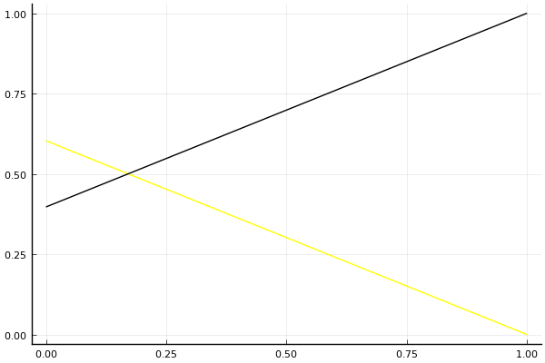

2016 듀얼 레이스 개인전 32강 A조 tiebreaker

## 경기 결과

| 트랙 | 신동이 | 이준용 |
|:---|---:|---:|
| [비치 해변 드라이브](../haebyun) | 0 | 1 |
| __total__ |__0__ |__1__ |

## 시뮬레이션

### 1st 확률

x축: 트랙, y축: 확률
1번: 옐로우, 2번: 블랙, 3번: 레드, 4번: 화이트(회색), 5번: 퍼플, 6번: 그린, 7번: 블루, 8번: 오렌지

| 트랙 | 신동이 | 이준용 |
|:---|---:|---:|
| 초기 | 0.613 | 0.387 |
| 비치 해변 드라이브 | 0.000 | 1.000 |

## 랭킹 변동

### [전체 랭킹](../singles-full)

| 순위 | 변동 | 이름 | 점수 | 변동 | mu | 변동 | sigma | 변동 |
|---:|---:|:---:|---:|---:|---:|---:|---:|---:|
| 2 / 8 | +0 | [신동이](../shindongi) | 2681 | -36 | 3258 | -49 | 192 | -4 |
| 4 / 8 | +0 | [이준용](../ijunyong) | 2583 | +65 | 3175 | +51 | 197 | -5 |

### 시즌 랭킹

| 순위 | 변동 | 이름 | 점수 | 변동 | mu | 변동 | sigma | 변동 |
|---:|---:|:---:|---:|---:|---:|---:|---:|---:|
| 2 / 8 | +0 | [신동이](../shindongi) | 2681 | -36 | 3258 | -49 | 192 | -4 |
| 4 / 8 | +0 | [이준용](../ijunyong) | 2583 | +65 | 3175 | +51 | 197 | -5 |

### 트랙 별 랭킹

#### [비치 해변 드라이브](../haebyun)

| 순위 | 변동 | 이름 | 점수 | 변동 | mu | 변동 | sigma | 변동 |
|:---:|:---:|:---:|---:|---:|---:|---:|---:|---:|
| 1 / 8 | +0 | [이준용](../ijunyong) | 2376 | +215 | 4366 | +92 | 663 | -41 |
| 5 / 8 | +0 | [신동이](../shindongi) | 1097 | +7 | 2799 | -65 | 567 | -24 |
