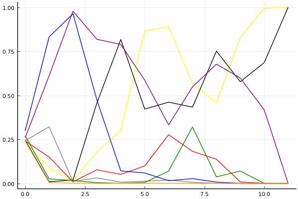

2016 듀얼 레이스 개인전 32강 B조

## 경기 결과

| 트랙 | 전대웅 | 이재인 | 강진우 | 최준호 | 문민기 | 김주원 | 이은택 | 조다훈 |
|:---|---:|---:|---:|---:|---:|---:|---:|---:|
| [비치 해변 드라이브](../haebyun) | 3 | 0 | 4 | 5 | 7 | 1 | 10 | -1 |
| [월드 두바이 다운타운](../dubai) | 3 | 5 | 1 | 0 | 10 | 4 | 7 | -1 |
| [대저택 은밀한 지하실](../jeotaek) | 7 | 10 | 5 | 3 | 4 | 0 | 1 | -1 |
| [월드 파리 에펠탑 다이브](../eifel) | 7 | 10 | 4 | 3 | 5 | -1 | 0 | 1 |
| [노르테유 익스프레스](../noex) | 10 | -1 | 4 | 3 | 0 | 7 | 1 | 5 |
| [공동묘지 마왕의 초대](../mawang) | 5 | 4 | 7 | 3 | 1 | 10 | 0 | -1 |
| [월드 리오 다운힐](../rio) | 0 | 4 | 3 | -1 | 7 | 10 | 5 | 1 |
| [팩토리 미완성 5구역](../district5) | 4 | 10 | 5 | 3 | 7 | 0 | 1 | -1 |
| [해적 숨겨진 보물](../haesumbo) | 10 | 4 | 0 | 3 | 5 | 7 | 1 | -1 |
| [아이스 부서진 빙산](../boobing) | 10 | 7 | 3 | 4 | 5 | -1 | 1 | 0 |
| [팩토리 미완성 5구역](../district5) | 10 | 7 | 1 | 5 | 4 | 0 | 3 | -5 |
| __total__ |__69__ |__60__ |__37__ |__31__ |__55__ |__37__ |__30__ |__-4__ |

## 시뮬레이션

### 1st 확률

x축: 트랙, y축: 확률
1번: 옐로우, 2번: 블랙, 3번: 레드, 4번: 화이트(회색), 5번: 퍼플, 6번: 그린, 7번: 블루, 8번: 오렌지

| 트랙 | 전대웅 | 이재인 | 강진우 | 최준호 | 문민기 | 김주원 | 이은택 | 조다훈 |
|:---|---:|---:|---:|---:|---:|---:|---:|---:|
| 초기 | 0.122 | 0.110 | 0.126 | 0.119 | 0.125 | 0.138 | 0.143 | 0.130 |
| 비치 해변 드라이브 | 0.019 | 0.003 | 0.041 | 0.089 | 0.243 | 0.007 | 0.610 | 0.001 |
| 월드 두바이 다운타운 | 0.002 | 0.002 | 0.002 | 0.003 | 0.533 | 0.003 | 0.465 | 0.000 |
| 대저택 은밀한 지하실 | 0.049 | 0.185 | 0.019 | 0.007 | 0.587 | 0.000 | 0.176 | 0.000 |
| 월드 파리 에펠탑 다이브 | 0.089 | 0.470 | 0.010 | 0.000 | 0.433 | 0.000 | 0.019 | 0.000 |
| 노르테유 익스프레스 | 0.600 | 0.163 | 0.024 | 0.004 | 0.220 | 0.001 | 0.009 | 0.000 |
| 공동묘지 마왕의 초대 | 0.698 | 0.146 | 0.067 | 0.002 | 0.092 | 0.009 | 0.005 | 0.000 |
| 월드 리오 다운힐 | 0.328 | 0.186 | 0.080 | 0.000 | 0.296 | 0.136 | 0.006 | 0.000 |
| 팩토리 미완성 5구역 | 0.189 | 0.447 | 0.051 | 0.000 | 0.339 | 0.010 | 0.001 | 0.000 |
| 해적 숨겨진 보물 | 0.520 | 0.261 | 0.003 | 0.000 | 0.253 | 0.011 | 0.000 | 0.000 |
| 아이스 부서진 빙산 | 0.906 | 0.117 | 0.000 | 0.000 | 0.024 | 0.000 | 0.000 | 0.000 |
| 팩토리 미완성 5구역 | 1.000 | 0.000 | 0.000 | 0.000 | 0.000 | 0.000 | 0.000 | 0.000 |

### Advance 확률

x축: 트랙, y축: 확률
1번: 옐로우, 2번: 블랙, 3번: 레드, 4번: 화이트(회색), 5번: 퍼플, 6번: 그린, 7번: 블루, 8번: 오렌지

| 트랙 | 전대웅 | 이재인 | 강진우 | 최준호 | 문민기 | 김주원 | 이은택 | 조다훈 |
|:---|---:|---:|---:|---:|---:|---:|---:|---:|
| 초기 | 0.235 | 0.246 | 0.241 | 0.242 | 0.259 | 0.270 | 0.298 | 0.240 |
| 비치 해변 드라이브 | 0.087 | 0.009 | 0.150 | 0.321 | 0.610 | 0.026 | 0.831 | 0.005 |
| 월드 두바이 다운타운 | 0.013 | 0.019 | 0.009 | 0.011 | 0.978 | 0.016 | 0.963 | 0.001 |
| 대저택 은밀한 지하실 | 0.178 | 0.456 | 0.077 | 0.031 | 0.818 | 0.004 | 0.474 | 0.000 |
| 월드 파리 에펠탑 다이브 | 0.301 | 0.817 | 0.051 | 0.007 | 0.789 | 0.000 | 0.071 | 0.000 |
| 노르테유 익스프레스 | 0.864 | 0.422 | 0.099 | 0.012 | 0.586 | 0.005 | 0.059 | 0.001 |
| 공동묘지 마왕의 초대 | 0.890 | 0.461 | 0.276 | 0.019 | 0.332 | 0.070 | 0.015 | 0.000 |
| 월드 리오 다운힐 | 0.567 | 0.433 | 0.182 | 0.006 | 0.548 | 0.320 | 0.027 | 0.000 |
| 팩토리 미완성 5구역 | 0.457 | 0.751 | 0.137 | 0.000 | 0.677 | 0.037 | 0.007 | 0.000 |
| 해적 숨겨진 보물 | 0.828 | 0.577 | 0.008 | 0.000 | 0.598 | 0.070 | 0.000 | 0.000 |
| 아이스 부서진 빙산 | 0.995 | 0.686 | 0.000 | 0.000 | 0.417 | 0.000 | 0.000 | 0.000 |
| 팩토리 미완성 5구역 | 1.000 | 1.000 | 0.000 | 0.000 | 0.000 | 0.000 | 0.000 | 0.000 |

## 랭킹 변동

### [전체 랭킹](../singles-full)

| 순위 | 변동 | 이름 | 점수 | 변동 | mu | 변동 | sigma | 변동 |
|---:|---:|:---:|---:|---:|---:|---:|---:|---:|
| 1 / 16 | NaN | [전대웅](../jeondaewoong) | 2937 | +2937 | 3513 | +513 | 192 | -808 |
| 3 / 16 | NaN | [이재인](../ijaein) | 2815 | +2815 | 3385 | +385 | 190 | -810 |
| 4 / 16 | NaN | [문민기](../munmingi) | 2734 | +2734 | 3289 | +289 | 185 | -815 |
| 8 / 16 | NaN | [강진우](../gangjinwu) | 2448 | +2448 | 2988 | -12 | 180 | -820 |
| 11 / 16 | NaN | [최준호](../choijunho) | 2345 | +2345 | 2891 | -109 | 182 | -818 |
| 12 / 16 | NaN | [김주원](../gimjuwon) | 2299 | +2299 | 2877 | -123 | 193 | -807 |
| 13 / 16 | NaN | [이은택](../ieuntaek) | 2261 | +2261 | 2818 | -182 | 185 | -815 |
| 16 / 16 | NaN | [조다훈](../jodahun) | 1544 | +1544 | 2190 | -810 | 216 | -784 |

### 시즌 랭킹

| 순위 | 변동 | 이름 | 점수 | 변동 | mu | 변동 | sigma | 변동 |
|---:|---:|:---:|---:|---:|---:|---:|---:|---:|
| 1 / 16 | NaN | [전대웅](../jeondaewoong) | 2937 | +2937 | 3513 | +513 | 192 | -808 |
| 3 / 16 | NaN | [이재인](../ijaein) | 2815 | +2815 | 3385 | +385 | 190 | -810 |
| 4 / 16 | NaN | [문민기](../munmingi) | 2734 | +2734 | 3289 | +289 | 185 | -815 |
| 8 / 16 | NaN | [강진우](../gangjinwu) | 2448 | +2448 | 2988 | -12 | 180 | -820 |
| 11 / 16 | NaN | [최준호](../choijunho) | 2345 | +2345 | 2891 | -109 | 182 | -818 |
| 12 / 16 | NaN | [김주원](../gimjuwon) | 2299 | +2299 | 2877 | -123 | 193 | -807 |
| 13 / 16 | NaN | [이은택](../ieuntaek) | 2261 | +2261 | 2818 | -182 | 185 | -815 |
| 16 / 16 | NaN | [조다훈](../jodahun) | 1544 | +1544 | 2190 | -810 | 216 | -784 |

### 트랙 별 랭킹

#### [공동묘지 마왕의 초대](../mawang)

| 순위 | 변동 | 이름 | 점수 | 변동 | mu | 변동 | sigma | 변동 |
|:---:|:---:|:---:|---:|---:|---:|---:|---:|---:|
| 1 / 16 | NaN | [김주원](../gimjuwon) | 2161 | +2161 | 4274 | +1274 | 704 | -296 |
| 3 / 16 | NaN | [강진우](../gangjinwu) | 1887 | +1887 | 3763 | +763 | 625 | -375 |
| 5 / 16 | NaN | [전대웅](../jeondaewoong) | 1622 | +1622 | 3423 | +423 | 600 | -400 |
| 8 / 16 | NaN | [이재인](../ijaein) | 1363 | +1363 | 3137 | +137 | 591 | -409 |
| 10 / 16 | NaN | [최준호](../choijunho) | 1090 | +1090 | 2863 | -137 | 591 | -409 |
| 11 / 16 | NaN | [문민기](../munmingi) | 776 | +776 | 2577 | -423 | 600 | -400 |
| 13 / 16 | NaN | [이은택](../ieuntaek) | 361 | +361 | 2237 | -763 | 625 | -375 |
| 15 / 16 | NaN | [조다훈](../jodahun) | -388 | -388 | 1726 | -1274 | 704 | -296 |

#### [노르테유 익스프레스](../noex)

| 순위 | 변동 | 이름 | 점수 | 변동 | mu | 변동 | sigma | 변동 |
|:---:|:---:|:---:|---:|---:|---:|---:|---:|---:|
| 1 / 16 | NaN | [전대웅](../jeondaewoong) | 2161 | +2161 | 4274 | +1274 | 704 | -296 |
| 3 / 16 | NaN | [김주원](../gimjuwon) | 1887 | +1887 | 3763 | +763 | 625 | -375 |
| 6 / 16 | NaN | [조다훈](../jodahun) | 1622 | +1622 | 3423 | +423 | 600 | -400 |
| 7 / 16 | NaN | [강진우](../gangjinwu) | 1363 | +1363 | 3137 | +137 | 591 | -409 |
| 9 / 16 | NaN | [최준호](../choijunho) | 1090 | +1090 | 2863 | -137 | 591 | -409 |
| 11 / 16 | NaN | [이은택](../ieuntaek) | 776 | +776 | 2577 | -423 | 600 | -400 |
| 13 / 16 | NaN | [문민기](../munmingi) | 361 | +361 | 2237 | -763 | 625 | -375 |
| 16 / 16 | NaN | [이재인](../ijaein) | -388 | -388 | 1726 | -1274 | 704 | -296 |

#### [대저택 은밀한 지하실](../jeotaek)

| 순위 | 변동 | 이름 | 점수 | 변동 | mu | 변동 | sigma | 변동 |
|:---:|:---:|:---:|---:|---:|---:|---:|---:|---:|
| 2 / 16 | NaN | [이재인](../ijaein) | 2161 | +2161 | 4274 | +1274 | 704 | -296 |
| 3 / 16 | NaN | [전대웅](../jeondaewoong) | 1887 | +1887 | 3763 | +763 | 625 | -375 |
| 5 / 16 | NaN | [강진우](../gangjinwu) | 1622 | +1622 | 3423 | +423 | 600 | -400 |
| 7 / 16 | NaN | [문민기](../munmingi) | 1363 | +1363 | 3137 | +137 | 591 | -409 |
| 9 / 16 | NaN | [최준호](../choijunho) | 1090 | +1090 | 2863 | -137 | 591 | -409 |
| 12 / 16 | NaN | [이은택](../ieuntaek) | 776 | +776 | 2577 | -423 | 600 | -400 |
| 14 / 16 | NaN | [김주원](../gimjuwon) | 361 | +361 | 2237 | -763 | 625 | -375 |
| 15 / 16 | NaN | [조다훈](../jodahun) | -388 | -388 | 1726 | -1274 | 704 | -296 |

#### [비치 해변 드라이브](../haebyun)

| 순위 | 변동 | 이름 | 점수 | 변동 | mu | 변동 | sigma | 변동 |
|:---:|:---:|:---:|---:|---:|---:|---:|---:|---:|
| 2 / 16 | NaN | [이은택](../ieuntaek) | 2161 | +2161 | 4274 | +1274 | 704 | -296 |
| 3 / 16 | NaN | [문민기](../munmingi) | 1887 | +1887 | 3763 | +763 | 625 | -375 |
| 5 / 16 | NaN | [최준호](../choijunho) | 1622 | +1622 | 3423 | +423 | 600 | -400 |
| 7 / 16 | NaN | [강진우](../gangjinwu) | 1363 | +1363 | 3137 | +137 | 591 | -409 |
| 10 / 16 | NaN | [전대웅](../jeondaewoong) | 1090 | +1090 | 2863 | -137 | 591 | -409 |
| 11 / 16 | NaN | [김주원](../gimjuwon) | 776 | +776 | 2577 | -423 | 600 | -400 |
| 14 / 16 | NaN | [이재인](../ijaein) | 361 | +361 | 2237 | -763 | 625 | -375 |
| 15 / 16 | NaN | [조다훈](../jodahun) | -388 | -388 | 1726 | -1274 | 704 | -296 |

#### [아이스 부서진 빙산](../boobing)

| 순위 | 변동 | 이름 | 점수 | 변동 | mu | 변동 | sigma | 변동 |
|:---:|:---:|:---:|---:|---:|---:|---:|---:|---:|
| 1 / 16 | NaN | [전대웅](../jeondaewoong) | 2161 | +2161 | 4274 | +1274 | 704 | -296 |
| 4 / 16 | NaN | [이재인](../ijaein) | 1887 | +1887 | 3763 | +763 | 625 | -375 |
| 6 / 16 | NaN | [문민기](../munmingi) | 1622 | +1622 | 3423 | +423 | 600 | -400 |
| 7 / 16 | NaN | [최준호](../choijunho) | 1363 | +1363 | 3137 | +137 | 591 | -409 |
| 9 / 16 | NaN | [강진우](../gangjinwu) | 1090 | +1090 | 2863 | -137 | 591 | -409 |
| 11 / 16 | NaN | [이은택](../ieuntaek) | 776 | +776 | 2577 | -423 | 600 | -400 |
| 13 / 16 | NaN | [조다훈](../jodahun) | 361 | +361 | 2237 | -763 | 625 | -375 |
| 15 / 16 | NaN | [김주원](../gimjuwon) | -388 | -388 | 1726 | -1274 | 704 | -296 |

#### [월드 두바이 다운타운](../dubai)

| 순위 | 변동 | 이름 | 점수 | 변동 | mu | 변동 | sigma | 변동 |
|:---:|:---:|:---:|---:|---:|---:|---:|---:|---:|
| 1 / 16 | NaN | [문민기](../munmingi) | 2161 | +2161 | 4274 | +1274 | 704 | -296 |
| 3 / 16 | NaN | [이은택](../ieuntaek) | 1887 | +1887 | 3763 | +763 | 625 | -375 |
| 6 / 16 | NaN | [이재인](../ijaein) | 1622 | +1622 | 3423 | +423 | 600 | -400 |
| 7 / 16 | NaN | [김주원](../gimjuwon) | 1363 | +1363 | 3137 | +137 | 591 | -409 |
| 9 / 16 | NaN | [전대웅](../jeondaewoong) | 1090 | +1090 | 2863 | -137 | 591 | -409 |
| 11 / 16 | NaN | [강진우](../gangjinwu) | 776 | +776 | 2577 | -423 | 600 | -400 |
| 14 / 16 | NaN | [최준호](../choijunho) | 361 | +361 | 2237 | -763 | 625 | -375 |
| 15 / 16 | NaN | [조다훈](../jodahun) | -388 | -388 | 1726 | -1274 | 704 | -296 |

#### [월드 리오 다운힐](../rio)

| 순위 | 변동 | 이름 | 점수 | 변동 | mu | 변동 | sigma | 변동 |
|:---:|:---:|:---:|---:|---:|---:|---:|---:|---:|
| 1 / 16 | NaN | [김주원](../gimjuwon) | 2161 | +2161 | 4274 | +1274 | 704 | -296 |
| 3 / 16 | NaN | [문민기](../munmingi) | 1887 | +1887 | 3763 | +763 | 625 | -375 |
| 6 / 16 | NaN | [이은택](../ieuntaek) | 1622 | +1622 | 3423 | +423 | 600 | -400 |
| 8 / 16 | NaN | [이재인](../ijaein) | 1363 | +1363 | 3137 | +137 | 591 | -409 |
| 9 / 16 | NaN | [강진우](../gangjinwu) | 1090 | +1090 | 2863 | -137 | 591 | -409 |
| 11 / 16 | NaN | [조다훈](../jodahun) | 776 | +776 | 2577 | -423 | 600 | -400 |
| 13 / 16 | NaN | [전대웅](../jeondaewoong) | 361 | +361 | 2237 | -763 | 625 | -375 |
| 15 / 16 | NaN | [최준호](../choijunho) | -388 | -388 | 1726 | -1274 | 704 | -296 |

#### [월드 파리 에펠탑 다이브](../eifel)

| 순위 | 변동 | 이름 | 점수 | 변동 | mu | 변동 | sigma | 변동 |
|:---:|:---:|:---:|---:|---:|---:|---:|---:|---:|
| 2 / 16 | NaN | [이재인](../ijaein) | 2161 | +2161 | 4274 | +1274 | 704 | -296 |
| 3 / 16 | NaN | [전대웅](../jeondaewoong) | 1887 | +1887 | 3763 | +763 | 625 | -375 |
| 5 / 16 | NaN | [문민기](../munmingi) | 1622 | +1622 | 3423 | +423 | 600 | -400 |
| 7 / 16 | NaN | [강진우](../gangjinwu) | 1363 | +1363 | 3137 | +137 | 591 | -409 |
| 9 / 16 | NaN | [최준호](../choijunho) | 1090 | +1090 | 2863 | -137 | 591 | -409 |
| 11 / 16 | NaN | [조다훈](../jodahun) | 776 | +776 | 2577 | -423 | 600 | -400 |
| 14 / 16 | NaN | [이은택](../ieuntaek) | 361 | +361 | 2237 | -763 | 625 | -375 |
| 16 / 16 | NaN | [김주원](../gimjuwon) | -388 | -388 | 1726 | -1274 | 704 | -296 |

#### [팩토리 미완성 5구역](../district5)

| 순위 | 변동 | 이름 | 점수 | 변동 | mu | 변동 | sigma | 변동 |
|:---:|:---:|:---:|---:|---:|---:|---:|---:|---:|
| 1 / 16 | NaN | [이재인](../ijaein) | 2590 | +2590 | 4091 | +1091 | 500 | -500 |
| 2 / 16 | NaN | [전대웅](../jeondaewoong) | 2443 | +2443 | 3874 | +874 | 477 | -523 |
| 4 / 16 | NaN | [문민기](../munmingi) | 2091 | +2091 | 3454 | +454 | 454 | -546 |
| 5 / 16 | NaN | [최준호](../choijunho) | 1935 | +1935 | 3267 | +267 | 444 | -556 |
| 8 / 16 | NaN | [강진우](../gangjinwu) | 1551 | +1551 | 2910 | -90 | 453 | -547 |
| 9 / 16 | NaN | [이은택](../ieuntaek) | 1416 | +1416 | 2756 | -244 | 447 | -553 |
| 13 / 16 | NaN | [김주원](../gimjuwon) | 607 | +607 | 2076 | -924 | 490 | -510 |
| 16 / 16 | NaN | [조다훈](../jodahun) | -419 | -419 | 1345 | -1655 | 588 | -412 |

#### [해적 숨겨진 보물](../haesumbo)

| 순위 | 변동 | 이름 | 점수 | 변동 | mu | 변동 | sigma | 변동 |
|:---:|:---:|:---:|---:|---:|---:|---:|---:|---:|
| 1 / 16 | NaN | [전대웅](../jeondaewoong) | 2161 | +2161 | 4274 | +1274 | 704 | -296 |
| 4 / 16 | NaN | [김주원](../gimjuwon) | 1887 | +1887 | 3763 | +763 | 625 | -375 |
| 5 / 16 | NaN | [문민기](../munmingi) | 1622 | +1622 | 3423 | +423 | 600 | -400 |
| 8 / 16 | NaN | [이재인](../ijaein) | 1363 | +1363 | 3137 | +137 | 591 | -409 |
| 9 / 16 | NaN | [최준호](../choijunho) | 1090 | +1090 | 2863 | -137 | 591 | -409 |
| 11 / 16 | NaN | [이은택](../ieuntaek) | 776 | +776 | 2577 | -423 | 600 | -400 |
| 13 / 16 | NaN | [강진우](../gangjinwu) | 361 | +361 | 2237 | -763 | 625 | -375 |
| 15 / 16 | NaN | [조다훈](../jodahun) | -388 | -388 | 1726 | -1274 | 704 | -296 |
