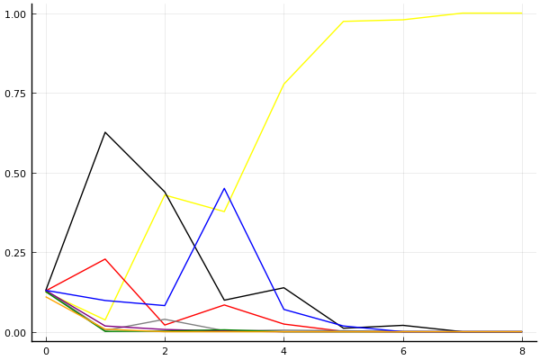
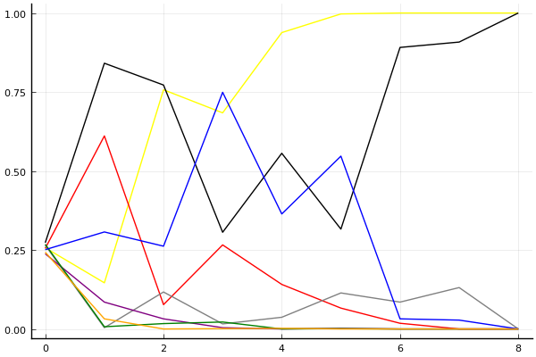

2016 듀얼 레이스 개인전 32강 C조

## 경기 결과

| 트랙 | 유영혁 | 이중선 | 강석인 | 손우현 | 김대진 | 박천원 | 박지호 | 한주성 |
|:---|---:|---:|---:|---:|---:|---:|---:|---:|
| [비치 해변 드라이브](../haebyun) | 4 | 10 | 7 | -1 | 3 | 0 | 5 | 1 |
| [해적 숨겨진 보물](../haesumbo) | 10 | 5 | 0 | 7 | 1 | 3 | 4 | -1 |
| [공동묘지 마왕의 초대](../mawang) | 5 | 1 | 7 | 0 | -1 | 4 | 10 | 3 |
| [아이스 부서진 빙산](../boobing) | 10 | 7 | 3 | 5 | -1 | 0 | 1 | 4 |
| [대저택 은밀한 지하실](../jeotaek) | 10 | 0 | 1 | 7 | 5 | -1 | 4 | 3 |
| [노르테유 익스프레스](../noex) | 7 | 10 | 3 | 5 | 4 | 0 | -1 | 1 |
| [팩토리 미완성 5구역](../district5) | 10 | 3 | 0 | 7 | -1 | 4 | 5 | 1 |
| [월드 파리 에펠탑 다이브](../eifel) | 5 | 7 | 3 | -1 | 1 | 4 | 10 | 0 |
| __total__ |__61__ |__43__ |__24__ |__29__ |__11__ |__14__ |__38__ |__12__ |

## 시뮬레이션

### 1st 확률

x축: 트랙, y축: 확률
1번: 옐로우, 2번: 블랙, 3번: 레드, 4번: 화이트(회색), 5번: 퍼플, 6번: 그린, 7번: 블루, 8번: 오렌지

| 트랙 | 유영혁 | 이중선 | 강석인 | 손우현 | 김대진 | 박천원 | 박지호 | 한주성 |
|:---|---:|---:|---:|---:|---:|---:|---:|---:|
| 초기 | 0.125 | 0.128 | 0.128 | 0.130 | 0.130 | 0.126 | 0.130 | 0.110 |
| 비치 해변 드라이브 | 0.037 | 0.626 | 0.228 | 0.004 | 0.018 | 0.001 | 0.098 | 0.008 |
| 해적 숨겨진 보물 | 0.429 | 0.439 | 0.021 | 0.039 | 0.007 | 0.002 | 0.082 | 0.000 |
| 공동묘지 마왕의 초대 | 0.377 | 0.099 | 0.084 | 0.003 | 0.002 | 0.006 | 0.450 | 0.000 |
| 아이스 부서진 빙산 | 0.777 | 0.138 | 0.024 | 0.005 | 0.000 | 0.000 | 0.070 | 0.000 |
| 대저택 은밀한 지하실 | 0.974 | 0.011 | 0.001 | 0.003 | 0.000 | 0.000 | 0.018 | 0.000 |
| 노르테유 익스프레스 | 0.979 | 0.020 | 0.000 | 0.001 | 0.000 | 0.000 | 0.000 | 0.000 |
| 팩토리 미완성 5구역 | 1.000 | 0.000 | 0.000 | 0.000 | 0.000 | 0.000 | 0.000 | 0.000 |
| 월드 파리 에펠탑 다이브 | 1.000 | 0.000 | 0.000 | 0.000 | 0.000 | 0.000 | 0.000 | 0.000 |

### Advance 확률

x축: 트랙, y축: 확률
1번: 옐로우, 2번: 블랙, 3번: 레드, 4번: 화이트(회색), 5번: 퍼플, 6번: 그린, 7번: 블루, 8번: 오렌지

| 트랙 | 유영혁 | 이중선 | 강석인 | 손우현 | 김대진 | 박천원 | 박지호 | 한주성 |
|:---|---:|---:|---:|---:|---:|---:|---:|---:|
| 초기 | 0.257 | 0.273 | 0.255 | 0.265 | 0.238 | 0.268 | 0.251 | 0.243 |
| 비치 해변 드라이브 | 0.146 | 0.841 | 0.611 | 0.004 | 0.085 | 0.007 | 0.307 | 0.032 |
| 해적 숨겨진 보물 | 0.757 | 0.772 | 0.077 | 0.117 | 0.032 | 0.017 | 0.262 | 0.000 |
| 공동묘지 마왕의 초대 | 0.684 | 0.306 | 0.266 | 0.016 | 0.004 | 0.022 | 0.749 | 0.001 |
| 아이스 부서진 빙산 | 0.938 | 0.556 | 0.141 | 0.037 | 0.000 | 0.000 | 0.364 | 0.002 |
| 대저택 은밀한 지하실 | 0.997 | 0.316 | 0.066 | 0.114 | 0.002 | 0.001 | 0.547 | 0.000 |
| 노르테유 익스프레스 | 1.000 | 0.891 | 0.018 | 0.085 | 0.000 | 0.000 | 0.032 | 0.000 |
| 팩토리 미완성 5구역 | 1.000 | 0.908 | 0.000 | 0.131 | 0.000 | 0.000 | 0.028 | 0.000 |
| 월드 파리 에펠탑 다이브 | 1.000 | 1.000 | 0.000 | 0.000 | 0.000 | 0.000 | 0.000 | 0.000 |

## 랭킹 변동

### [전체 랭킹](../singles-full)

| 순위 | 변동 | 이름 | 점수 | 변동 | mu | 변동 | sigma | 변동 |
|---:|---:|:---:|---:|---:|---:|---:|---:|---:|
| 1 / 24 | NaN | [유영혁](../yuyeonghyeok) | 3074 | +3074 | 3801 | +801 | 242 | -758 |
| 8 / 24 | NaN | [이중선](../ijungseon) | 2643 | +2643 | 3311 | +311 | 223 | -777 |
| 10 / 24 | NaN | [박지호](../bakjiho) | 2537 | +2537 | 3203 | +203 | 222 | -778 |
| 12 / 24 | NaN | [손우현](../sonuhyeon) | 2396 | +2396 | 3070 | +70 | 224 | -776 |
| 18 / 24 | NaN | [강석인](../gangseokin) | 2233 | +2233 | 2876 | -124 | 214 | -786 |
| 19 / 24 | NaN | [박천원](../bakcheonwon) | 2045 | +2045 | 2702 | -298 | 219 | -781 |
| 20 / 24 | NaN | [한주성](../hanjuseong) | 2028 | +2028 | 2676 | -324 | 216 | -784 |
| 22 / 24 | NaN | [김대진](../gimdaejin) | 1885 | +1885 | 2565 | -435 | 227 | -773 |

### 시즌 랭킹

| 순위 | 변동 | 이름 | 점수 | 변동 | mu | 변동 | sigma | 변동 |
|---:|---:|:---:|---:|---:|---:|---:|---:|---:|
| 1 / 24 | NaN | [유영혁](../yuyeonghyeok) | 3074 | +3074 | 3801 | +801 | 242 | -758 |
| 8 / 24 | NaN | [이중선](../ijungseon) | 2643 | +2643 | 3311 | +311 | 223 | -777 |
| 10 / 24 | NaN | [박지호](../bakjiho) | 2537 | +2537 | 3203 | +203 | 222 | -778 |
| 12 / 24 | NaN | [손우현](../sonuhyeon) | 2396 | +2396 | 3070 | +70 | 224 | -776 |
| 18 / 24 | NaN | [강석인](../gangseokin) | 2233 | +2233 | 2876 | -124 | 214 | -786 |
| 19 / 24 | NaN | [박천원](../bakcheonwon) | 2045 | +2045 | 2702 | -298 | 219 | -781 |
| 20 / 24 | NaN | [한주성](../hanjuseong) | 2028 | +2028 | 2676 | -324 | 216 | -784 |
| 22 / 24 | NaN | [김대진](../gimdaejin) | 1885 | +1885 | 2565 | -435 | 227 | -773 |

### 트랙 별 랭킹

#### [공동묘지 마왕의 초대](../mawang)

| 순위 | 변동 | 이름 | 점수 | 변동 | mu | 변동 | sigma | 변동 |
|:---:|:---:|:---:|---:|---:|---:|---:|---:|---:|
| 1 / 24 | NaN | [박지호](../bakjiho) | 2161 | +2161 | 4274 | +1274 | 704 | -296 |
| 5 / 24 | NaN | [강석인](../gangseokin) | 1887 | +1887 | 3763 | +763 | 625 | -375 |
| 8 / 24 | NaN | [유영혁](../yuyeonghyeok) | 1622 | +1622 | 3423 | +423 | 600 | -400 |
| 11 / 24 | NaN | [박천원](../bakcheonwon) | 1363 | +1363 | 3137 | +137 | 591 | -409 |
| 15 / 24 | NaN | [한주성](../hanjuseong) | 1090 | +1090 | 2863 | -137 | 591 | -409 |
| 16 / 24 | NaN | [이중선](../ijungseon) | 776 | +776 | 2577 | -423 | 600 | -400 |
| 19 / 24 | NaN | [손우현](../sonuhyeon) | 361 | +361 | 2237 | -763 | 625 | -375 |
| 23 / 24 | NaN | [김대진](../gimdaejin) | -388 | -388 | 1726 | -1274 | 704 | -296 |

#### [노르테유 익스프레스](../noex)

| 순위 | 변동 | 이름 | 점수 | 변동 | mu | 변동 | sigma | 변동 |
|:---:|:---:|:---:|---:|---:|---:|---:|---:|---:|
| 2 / 24 | NaN | [이중선](../ijungseon) | 2161 | +2161 | 4274 | +1274 | 704 | -296 |
| 4 / 24 | NaN | [유영혁](../yuyeonghyeok) | 1887 | +1887 | 3763 | +763 | 625 | -375 |
| 8 / 24 | NaN | [손우현](../sonuhyeon) | 1622 | +1622 | 3423 | +423 | 600 | -400 |
| 12 / 24 | NaN | [김대진](../gimdaejin) | 1363 | +1363 | 3137 | +137 | 591 | -409 |
| 14 / 24 | NaN | [강석인](../gangseokin) | 1090 | +1090 | 2863 | -137 | 591 | -409 |
| 17 / 24 | NaN | [한주성](../hanjuseong) | 776 | +776 | 2577 | -423 | 600 | -400 |
| 20 / 24 | NaN | [박천원](../bakcheonwon) | 361 | +361 | 2237 | -763 | 625 | -375 |
| 22 / 24 | NaN | [박지호](../bakjiho) | -388 | -388 | 1726 | -1274 | 704 | -296 |

#### [대저택 은밀한 지하실](../jeotaek)

| 순위 | 변동 | 이름 | 점수 | 변동 | mu | 변동 | sigma | 변동 |
|:---:|:---:|:---:|---:|---:|---:|---:|---:|---:|
| 1 / 24 | NaN | [유영혁](../yuyeonghyeok) | 2161 | +2161 | 4274 | +1274 | 704 | -296 |
| 5 / 24 | NaN | [손우현](../sonuhyeon) | 1887 | +1887 | 3763 | +763 | 625 | -375 |
| 9 / 24 | NaN | [김대진](../gimdaejin) | 1622 | +1622 | 3423 | +423 | 600 | -400 |
| 10 / 24 | NaN | [박지호](../bakjiho) | 1363 | +1363 | 3137 | +137 | 591 | -409 |
| 14 / 24 | NaN | [한주성](../hanjuseong) | 1090 | +1090 | 2863 | -137 | 591 | -409 |
| 18 / 24 | NaN | [강석인](../gangseokin) | 776 | +776 | 2577 | -423 | 600 | -400 |
| 19 / 24 | NaN | [이중선](../ijungseon) | 361 | +361 | 2237 | -763 | 625 | -375 |
| 23 / 24 | NaN | [박천원](../bakcheonwon) | -388 | -388 | 1726 | -1274 | 704 | -296 |

#### [비치 해변 드라이브](../haebyun)

| 순위 | 변동 | 이름 | 점수 | 변동 | mu | 변동 | sigma | 변동 |
|:---:|:---:|:---:|---:|---:|---:|---:|---:|---:|
| 3 / 24 | NaN | [이중선](../ijungseon) | 2161 | +2161 | 4274 | +1274 | 704 | -296 |
| 5 / 24 | NaN | [강석인](../gangseokin) | 1887 | +1887 | 3763 | +763 | 625 | -375 |
| 7 / 24 | NaN | [박지호](../bakjiho) | 1622 | +1622 | 3423 | +423 | 600 | -400 |
| 11 / 24 | NaN | [유영혁](../yuyeonghyeok) | 1363 | +1363 | 3137 | +137 | 591 | -409 |
| 15 / 24 | NaN | [김대진](../gimdaejin) | 1090 | +1090 | 2863 | -137 | 591 | -409 |
| 16 / 24 | NaN | [한주성](../hanjuseong) | 776 | +776 | 2577 | -423 | 600 | -400 |
| 20 / 24 | NaN | [박천원](../bakcheonwon) | 361 | +361 | 2237 | -763 | 625 | -375 |
| 22 / 24 | NaN | [손우현](../sonuhyeon) | -388 | -388 | 1726 | -1274 | 704 | -296 |

#### [아이스 부서진 빙산](../boobing)

| 순위 | 변동 | 이름 | 점수 | 변동 | mu | 변동 | sigma | 변동 |
|:---:|:---:|:---:|---:|---:|---:|---:|---:|---:|
| 2 / 24 | NaN | [유영혁](../yuyeonghyeok) | 2161 | +2161 | 4274 | +1274 | 704 | -296 |
| 4 / 24 | NaN | [이중선](../ijungseon) | 1887 | +1887 | 3763 | +763 | 625 | -375 |
| 8 / 24 | NaN | [손우현](../sonuhyeon) | 1622 | +1622 | 3423 | +423 | 600 | -400 |
| 11 / 24 | NaN | [한주성](../hanjuseong) | 1363 | +1363 | 3137 | +137 | 591 | -409 |
| 14 / 24 | NaN | [강석인](../gangseokin) | 1090 | +1090 | 2863 | -137 | 591 | -409 |
| 17 / 24 | NaN | [박지호](../bakjiho) | 776 | +776 | 2577 | -423 | 600 | -400 |
| 21 / 24 | NaN | [박천원](../bakcheonwon) | 361 | +361 | 2237 | -763 | 625 | -375 |
| 23 / 24 | NaN | [김대진](../gimdaejin) | -388 | -388 | 1726 | -1274 | 704 | -296 |

#### [월드 파리 에펠탑 다이브](../eifel)

| 순위 | 변동 | 이름 | 점수 | 변동 | mu | 변동 | sigma | 변동 |
|:---:|:---:|:---:|---:|---:|---:|---:|---:|---:|
| 1 / 24 | NaN | [박지호](../bakjiho) | 2161 | +2161 | 4274 | +1274 | 704 | -296 |
| 5 / 24 | NaN | [이중선](../ijungseon) | 1887 | +1887 | 3763 | +763 | 625 | -375 |
| 7 / 24 | NaN | [유영혁](../yuyeonghyeok) | 1622 | +1622 | 3423 | +423 | 600 | -400 |
| 11 / 24 | NaN | [박천원](../bakcheonwon) | 1363 | +1363 | 3137 | +137 | 591 | -409 |
| 14 / 24 | NaN | [강석인](../gangseokin) | 1090 | +1090 | 2863 | -137 | 591 | -409 |
| 18 / 24 | NaN | [김대진](../gimdaejin) | 776 | +776 | 2577 | -423 | 600 | -400 |
| 21 / 24 | NaN | [한주성](../hanjuseong) | 361 | +361 | 2237 | -763 | 625 | -375 |
| 22 / 24 | NaN | [손우현](../sonuhyeon) | -388 | -388 | 1726 | -1274 | 704 | -296 |

#### [팩토리 미완성 5구역](../district5)

| 순위 | 변동 | 이름 | 점수 | 변동 | mu | 변동 | sigma | 변동 |
|:---:|:---:|:---:|---:|---:|---:|---:|---:|---:|
| 3 / 24 | NaN | [유영혁](../yuyeonghyeok) | 2161 | +2161 | 4274 | +1274 | 704 | -296 |
| 8 / 24 | NaN | [손우현](../sonuhyeon) | 1887 | +1887 | 3763 | +763 | 625 | -375 |
| 9 / 24 | NaN | [박지호](../bakjiho) | 1622 | +1622 | 3423 | +423 | 600 | -400 |
| 14 / 24 | NaN | [박천원](../bakcheonwon) | 1363 | +1363 | 3137 | +137 | 591 | -409 |
| 15 / 24 | NaN | [이중선](../ijungseon) | 1090 | +1090 | 2863 | -137 | 591 | -409 |
| 18 / 24 | NaN | [한주성](../hanjuseong) | 776 | +776 | 2577 | -423 | 600 | -400 |
| 20 / 24 | NaN | [강석인](../gangseokin) | 361 | +361 | 2237 | -763 | 625 | -375 |
| 22 / 24 | NaN | [김대진](../gimdaejin) | -388 | -388 | 1726 | -1274 | 704 | -296 |

#### [해적 숨겨진 보물](../haesumbo)

| 순위 | 변동 | 이름 | 점수 | 변동 | mu | 변동 | sigma | 변동 |
|:---:|:---:|:---:|---:|---:|---:|---:|---:|---:|
| 2 / 24 | NaN | [유영혁](../yuyeonghyeok) | 2161 | +2161 | 4274 | +1274 | 704 | -296 |
| 4 / 24 | NaN | [손우현](../sonuhyeon) | 1887 | +1887 | 3763 | +763 | 625 | -375 |
| 7 / 24 | NaN | [이중선](../ijungseon) | 1622 | +1622 | 3423 | +423 | 600 | -400 |
| 11 / 24 | NaN | [박지호](../bakjiho) | 1363 | +1363 | 3137 | +137 | 591 | -409 |
| 14 / 24 | NaN | [박천원](../bakcheonwon) | 1090 | +1090 | 2863 | -137 | 591 | -409 |
| 17 / 24 | NaN | [김대진](../gimdaejin) | 776 | +776 | 2577 | -423 | 600 | -400 |
| 20 / 24 | NaN | [강석인](../gangseokin) | 361 | +361 | 2237 | -763 | 625 | -375 |
| 24 / 24 | NaN | [한주성](../hanjuseong) | -388 | -388 | 1726 | -1274 | 704 | -296 |
