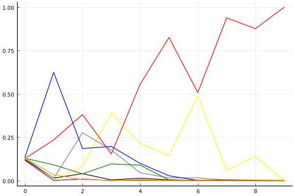
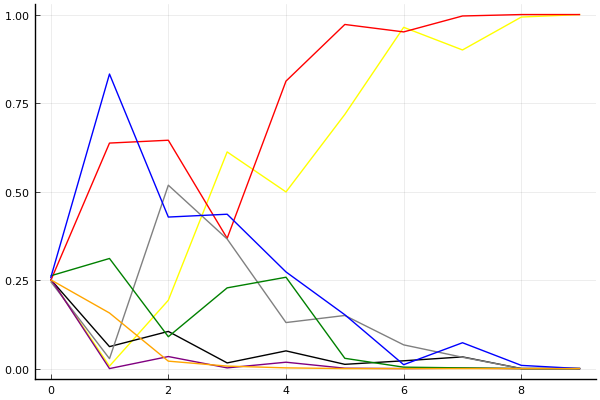

2016 듀얼 레이스 개인전 32강 D조

## 경기 결과

| 트랙 | 김승태 | 최영훈 | 유창현 | 우성민 | 정승민 | 박인수 | 임재원 | 권순민 |
|:---|---:|---:|---:|---:|---:|---:|---:|---:|
| [비치 해변 드라이브](../haebyun) | 0 | 3 | 7 | 1 | -1 | 5 | 10 | 4 |
| [월드 두바이 다운타운](../dubai) | 7 | 3 | 5 | 10 | 4 | 0 | 1 | -1 |
| [월드 리오 다운힐](../rio) | 10 | 0 | 3 | 4 | -1 | 7 | 5 | 1 |
| [아이스 부서진 빙산](../boobing) | 3 | 5 | 10 | 0 | 7 | 4 | 1 | -1 |
| [월드 파리 에펠탑 다이브](../eifel) | 7 | 3 | 10 | 5 | -1 | 0 | 4 | 1 |
| [대저택 은밀한 지하실](../jeotaek) | 10 | 7 | 3 | 4 | 1 | 0 | -1 | 5 |
| [노르테유 익스프레스](../noex) | -1 | 3 | 10 | 0 | 4 | 1 | 7 | 5 |
| [공동묘지 마왕의 초대](../mawang) | 10 | -1 | 5 | 4 | 3 | 1 | 7 | 0 |
| [해적 숨겨진 보물](../haesumbo) | 1 | 0 | 7 | 3 | -1 | 10 | 5 | 4 |
| __total__ |__47__ |__23__ |__60__ |__31__ |__15__ |__28__ |__39__ |__18__ |

## 시뮬레이션

### 1st 확률

x축: 트랙, y축: 확률
1번: 옐로우, 2번: 블랙, 3번: 레드, 4번: 화이트(회색), 5번: 퍼플, 6번: 그린, 7번: 블루, 8번: 오렌지

| 트랙 | 김승태 | 최영훈 | 유창현 | 우성민 | 정승민 | 박인수 | 임재원 | 권순민 |
|:---|---:|---:|---:|---:|---:|---:|---:|---:|
| 초기 | 0.114 | 0.124 | 0.119 | 0.130 | 0.131 | 0.134 | 0.122 | 0.137 |
| 비치 해변 드라이브 | 0.002 | 0.008 | 0.243 | 0.004 | 0.000 | 0.093 | 0.615 | 0.043 |
| 월드 두바이 다운타운 | 0.087 | 0.030 | 0.372 | 0.283 | 0.013 | 0.024 | 0.193 | 0.008 |
| 월드 리오 다운힐 | 0.391 | 0.004 | 0.161 | 0.169 | 0.002 | 0.092 | 0.207 | 0.003 |
| 아이스 부서진 빙산 | 0.202 | 0.011 | 0.579 | 0.037 | 0.004 | 0.093 | 0.090 | 0.000 |
| 월드 파리 에펠탑 다이브 | 0.151 | 0.000 | 0.820 | 0.025 | 0.000 | 0.002 | 0.021 | 0.000 |
| 대저택 은밀한 지하실 | 0.527 | 0.004 | 0.466 | 0.015 | 0.000 | 0.000 | 0.004 | 0.000 |
| 노르테유 익스프레스 | 0.055 | 0.002 | 0.946 | 0.002 | 0.000 | 0.001 | 0.003 | 0.000 |
| 공동묘지 마왕의 초대 | 0.140 | 0.000 | 0.874 | 0.000 | 0.000 | 0.000 | 0.001 | 0.000 |
| 해적 숨겨진 보물 | 0.000 | 0.000 | 1.000 | 0.000 | 0.000 | 0.000 | 0.000 | 0.000 |

### Advance 확률

x축: 트랙, y축: 확률
1번: 옐로우, 2번: 블랙, 3번: 레드, 4번: 화이트(회색), 5번: 퍼플, 6번: 그린, 7번: 블루, 8번: 오렌지

| 트랙 | 김승태 | 최영훈 | 유창현 | 우성민 | 정승민 | 박인수 | 임재원 | 권순민 |
|:---|---:|---:|---:|---:|---:|---:|---:|---:|
| 초기 | 0.253 | 0.252 | 0.248 | 0.246 | 0.254 | 0.262 | 0.256 | 0.251 |
| 비치 해변 드라이브 | 0.007 | 0.062 | 0.637 | 0.028 | 0.000 | 0.311 | 0.832 | 0.157 |
| 월드 두바이 다운타운 | 0.193 | 0.105 | 0.645 | 0.518 | 0.034 | 0.090 | 0.428 | 0.021 |
| 월드 리오 다운힐 | 0.612 | 0.016 | 0.368 | 0.366 | 0.002 | 0.228 | 0.436 | 0.007 |
| 아이스 부서진 빙산 | 0.499 | 0.050 | 0.812 | 0.130 | 0.018 | 0.258 | 0.273 | 0.002 |
| 월드 파리 에펠탑 다이브 | 0.718 | 0.012 | 0.972 | 0.150 | 0.001 | 0.029 | 0.152 | 0.000 |
| 대저택 은밀한 지하실 | 0.964 | 0.022 | 0.951 | 0.067 | 0.000 | 0.004 | 0.011 | 0.000 |
| 노르테유 익스프레스 | 0.900 | 0.033 | 0.996 | 0.032 | 0.001 | 0.002 | 0.073 | 0.000 |
| 공동묘지 마왕의 초대 | 0.993 | 0.000 | 1.000 | 0.000 | 0.000 | 0.000 | 0.009 | 0.000 |
| 해적 숨겨진 보물 | 1.000 | 0.000 | 1.000 | 0.000 | 0.000 | 0.000 | 0.000 | 0.000 |

## 랭킹 변동

### [전체 랭킹](../singles-full)

| 순위 | 변동 | 이름 | 점수 | 변동 | mu | 변동 | sigma | 변동 |
|---:|---:|:---:|---:|---:|---:|---:|---:|---:|
| 4 / 32 | NaN | [유창현](../yuchanghyeon) | 2888 | +2888 | 3526 | +526 | 213 | -787 |
| 10 / 32 | NaN | [김승태](../gimseungtae) | 2637 | +2637 | 3275 | +275 | 213 | -787 |
| 13 / 32 | NaN | [임재원](../imjaewon) | 2534 | +2534 | 3148 | +148 | 205 | -795 |
| 15 / 32 | NaN | [우성민](../useongmin) | 2399 | +2399 | 3000 | +0 | 201 | -799 |
| 19 / 32 | NaN | [박인수](../bakinsu) | 2352 | +2352 | 2956 | -44 | 202 | -798 |
| 24 / 32 | NaN | [최영훈](../choiyeonghun) | 2181 | +2181 | 2786 | -214 | 202 | -798 |
| 25 / 32 | NaN | [권순민](../gweonsoonmin) | 2155 | +2155 | 2773 | -227 | 206 | -794 |
| 28 / 32 | NaN | [정승민](../jeongseungmin) | 1975 | +1975 | 2611 | -389 | 212 | -788 |

### 시즌 랭킹

| 순위 | 변동 | 이름 | 점수 | 변동 | mu | 변동 | sigma | 변동 |
|---:|---:|:---:|---:|---:|---:|---:|---:|---:|
| 4 / 32 | NaN | [유창현](../yuchanghyeon) | 2888 | +2888 | 3526 | +526 | 213 | -787 |
| 10 / 32 | NaN | [김승태](../gimseungtae) | 2637 | +2637 | 3275 | +275 | 213 | -787 |
| 13 / 32 | NaN | [임재원](../imjaewon) | 2534 | +2534 | 3148 | +148 | 205 | -795 |
| 15 / 32 | NaN | [우성민](../useongmin) | 2399 | +2399 | 3000 | +0 | 201 | -799 |
| 19 / 32 | NaN | [박인수](../bakinsu) | 2352 | +2352 | 2956 | -44 | 202 | -798 |
| 24 / 32 | NaN | [최영훈](../choiyeonghun) | 2181 | +2181 | 2786 | -214 | 202 | -798 |
| 25 / 32 | NaN | [권순민](../gweonsoonmin) | 2155 | +2155 | 2773 | -227 | 206 | -794 |
| 28 / 32 | NaN | [정승민](../jeongseungmin) | 1975 | +1975 | 2611 | -389 | 212 | -788 |

### 트랙 별 랭킹

#### [공동묘지 마왕의 초대](../mawang)

| 순위 | 변동 | 이름 | 점수 | 변동 | mu | 변동 | sigma | 변동 |
|:---:|:---:|:---:|---:|---:|---:|---:|---:|---:|
| 2 / 32 | NaN | [김승태](../gimseungtae) | 2161 | +2161 | 4274 | +1274 | 704 | -296 |
| 6 / 32 | NaN | [임재원](../imjaewon) | 1887 | +1887 | 3763 | +763 | 625 | -375 |
| 10 / 32 | NaN | [유창현](../yuchanghyeon) | 1622 | +1622 | 3423 | +423 | 600 | -400 |
| 13 / 32 | NaN | [우성민](../useongmin) | 1363 | +1363 | 3137 | +137 | 591 | -409 |
| 18 / 32 | NaN | [정승민](../jeongseungmin) | 1090 | +1090 | 2863 | -137 | 591 | -409 |
| 23 / 32 | NaN | [박인수](../bakinsu) | 776 | +776 | 2577 | -423 | 600 | -400 |
| 28 / 32 | NaN | [권순민](../gweonsoonmin) | 361 | +361 | 2237 | -763 | 625 | -375 |
| 31 / 32 | NaN | [최영훈](../choiyeonghun) | -388 | -388 | 1726 | -1274 | 704 | -296 |

#### [노르테유 익스프레스](../noex)

| 순위 | 변동 | 이름 | 점수 | 변동 | mu | 변동 | sigma | 변동 |
|:---:|:---:|:---:|---:|---:|---:|---:|---:|---:|
| 3 / 32 | NaN | [유창현](../yuchanghyeon) | 2161 | +2161 | 4274 | +1274 | 704 | -296 |
| 5 / 32 | NaN | [임재원](../imjaewon) | 1887 | +1887 | 3763 | +763 | 625 | -375 |
| 12 / 32 | NaN | [권순민](../gweonsoonmin) | 1622 | +1622 | 3423 | +423 | 600 | -400 |
| 14 / 32 | NaN | [정승민](../jeongseungmin) | 1363 | +1363 | 3137 | +137 | 591 | -409 |
| 19 / 32 | NaN | [최영훈](../choiyeonghun) | 1090 | +1090 | 2863 | -137 | 591 | -409 |
| 23 / 32 | NaN | [박인수](../bakinsu) | 776 | +776 | 2577 | -423 | 600 | -400 |
| 26 / 32 | NaN | [우성민](../useongmin) | 361 | +361 | 2237 | -763 | 625 | -375 |
| 30 / 32 | NaN | [김승태](../gimseungtae) | -388 | -388 | 1726 | -1274 | 704 | -296 |

#### [대저택 은밀한 지하실](../jeotaek)

| 순위 | 변동 | 이름 | 점수 | 변동 | mu | 변동 | sigma | 변동 |
|:---:|:---:|:---:|---:|---:|---:|---:|---:|---:|
| 1 / 32 | NaN | [김승태](../gimseungtae) | 2161 | +2161 | 4274 | +1274 | 704 | -296 |
| 8 / 32 | NaN | [최영훈](../choiyeonghun) | 1887 | +1887 | 3763 | +763 | 625 | -375 |
| 10 / 32 | NaN | [권순민](../gweonsoonmin) | 1622 | +1622 | 3423 | +423 | 600 | -400 |
| 15 / 32 | NaN | [우성민](../useongmin) | 1363 | +1363 | 3137 | +137 | 591 | -409 |
| 17 / 32 | NaN | [유창현](../yuchanghyeon) | 1090 | +1090 | 2863 | -137 | 591 | -409 |
| 23 / 32 | NaN | [정승민](../jeongseungmin) | 776 | +776 | 2577 | -423 | 600 | -400 |
| 28 / 32 | NaN | [박인수](../bakinsu) | 361 | +361 | 2237 | -763 | 625 | -375 |
| 30 / 32 | NaN | [임재원](../imjaewon) | -388 | -388 | 1726 | -1274 | 704 | -296 |

#### [비치 해변 드라이브](../haebyun)

| 순위 | 변동 | 이름 | 점수 | 변동 | mu | 변동 | sigma | 변동 |
|:---:|:---:|:---:|---:|---:|---:|---:|---:|---:|
| 4 / 32 | NaN | [임재원](../imjaewon) | 2161 | +2161 | 4274 | +1274 | 704 | -296 |
| 5 / 32 | NaN | [유창현](../yuchanghyeon) | 1887 | +1887 | 3763 | +763 | 625 | -375 |
| 12 / 32 | NaN | [박인수](../bakinsu) | 1622 | +1622 | 3423 | +423 | 600 | -400 |
| 14 / 32 | NaN | [권순민](../gweonsoonmin) | 1363 | +1363 | 3137 | +137 | 591 | -409 |
| 20 / 32 | NaN | [최영훈](../choiyeonghun) | 1090 | +1090 | 2863 | -137 | 591 | -409 |
| 22 / 32 | NaN | [우성민](../useongmin) | 776 | +776 | 2577 | -423 | 600 | -400 |
| 26 / 32 | NaN | [김승태](../gimseungtae) | 361 | +361 | 2237 | -763 | 625 | -375 |
| 31 / 32 | NaN | [정승민](../jeongseungmin) | -388 | -388 | 1726 | -1274 | 704 | -296 |

#### [아이스 부서진 빙산](../boobing)

| 순위 | 변동 | 이름 | 점수 | 변동 | mu | 변동 | sigma | 변동 |
|:---:|:---:|:---:|---:|---:|---:|---:|---:|---:|
| 2 / 32 | NaN | [유창현](../yuchanghyeon) | 2161 | +2161 | 4274 | +1274 | 704 | -296 |
| 6 / 32 | NaN | [정승민](../jeongseungmin) | 1887 | +1887 | 3763 | +763 | 625 | -375 |
| 12 / 32 | NaN | [최영훈](../choiyeonghun) | 1622 | +1622 | 3423 | +423 | 600 | -400 |
| 16 / 32 | NaN | [박인수](../bakinsu) | 1363 | +1363 | 3137 | +137 | 591 | -409 |
| 18 / 32 | NaN | [김승태](../gimseungtae) | 1090 | +1090 | 2863 | -137 | 591 | -409 |
| 23 / 32 | NaN | [임재원](../imjaewon) | 776 | +776 | 2577 | -423 | 600 | -400 |
| 27 / 32 | NaN | [우성민](../useongmin) | 361 | +361 | 2237 | -763 | 625 | -375 |
| 29 / 32 | NaN | [권순민](../gweonsoonmin) | -388 | -388 | 1726 | -1274 | 704 | -296 |

#### [월드 두바이 다운타운](../dubai)

| 순위 | 변동 | 이름 | 점수 | 변동 | mu | 변동 | sigma | 변동 |
|:---:|:---:|:---:|---:|---:|---:|---:|---:|---:|
| 2 / 24 | NaN | [우성민](../useongmin) | 2161 | +2161 | 4274 | +1274 | 704 | -296 |
| 4 / 24 | NaN | [김승태](../gimseungtae) | 1887 | +1887 | 3763 | +763 | 625 | -375 |
| 7 / 24 | NaN | [유창현](../yuchanghyeon) | 1622 | +1622 | 3423 | +423 | 600 | -400 |
| 10 / 24 | NaN | [정승민](../jeongseungmin) | 1363 | +1363 | 3137 | +137 | 591 | -409 |
| 15 / 24 | NaN | [최영훈](../choiyeonghun) | 1090 | +1090 | 2863 | -137 | 591 | -409 |
| 17 / 24 | NaN | [임재원](../imjaewon) | 776 | +776 | 2577 | -423 | 600 | -400 |
| 21 / 24 | NaN | [박인수](../bakinsu) | 361 | +361 | 2237 | -763 | 625 | -375 |
| 23 / 24 | NaN | [권순민](../gweonsoonmin) | -388 | -388 | 1726 | -1274 | 704 | -296 |

#### [월드 리오 다운힐](../rio)

| 순위 | 변동 | 이름 | 점수 | 변동 | mu | 변동 | sigma | 변동 |
|:---:|:---:|:---:|---:|---:|---:|---:|---:|---:|
| 1 / 24 | NaN | [김승태](../gimseungtae) | 2161 | +2161 | 4274 | +1274 | 704 | -296 |
| 5 / 24 | NaN | [박인수](../bakinsu) | 1887 | +1887 | 3763 | +763 | 625 | -375 |
| 9 / 24 | NaN | [임재원](../imjaewon) | 1622 | +1622 | 3423 | +423 | 600 | -400 |
| 10 / 24 | NaN | [우성민](../useongmin) | 1363 | +1363 | 3137 | +137 | 591 | -409 |
| 14 / 24 | NaN | [유창현](../yuchanghyeon) | 1090 | +1090 | 2863 | -137 | 591 | -409 |
| 18 / 24 | NaN | [권순민](../gweonsoonmin) | 776 | +776 | 2577 | -423 | 600 | -400 |
| 20 / 24 | NaN | [최영훈](../choiyeonghun) | 361 | +361 | 2237 | -763 | 625 | -375 |
| 22 / 24 | NaN | [정승민](../jeongseungmin) | -388 | -388 | 1726 | -1274 | 704 | -296 |

#### [월드 파리 에펠탑 다이브](../eifel)

| 순위 | 변동 | 이름 | 점수 | 변동 | mu | 변동 | sigma | 변동 |
|:---:|:---:|:---:|---:|---:|---:|---:|---:|---:|
| 2 / 32 | NaN | [유창현](../yuchanghyeon) | 2161 | +2161 | 4274 | +1274 | 704 | -296 |
| 6 / 32 | NaN | [김승태](../gimseungtae) | 1887 | +1887 | 3763 | +763 | 625 | -375 |
| 11 / 32 | NaN | [우성민](../useongmin) | 1622 | +1622 | 3423 | +423 | 600 | -400 |
| 14 / 32 | NaN | [임재원](../imjaewon) | 1363 | +1363 | 3137 | +137 | 591 | -409 |
| 19 / 32 | NaN | [최영훈](../choiyeonghun) | 1090 | +1090 | 2863 | -137 | 591 | -409 |
| 22 / 32 | NaN | [권순민](../gweonsoonmin) | 776 | +776 | 2577 | -423 | 600 | -400 |
| 28 / 32 | NaN | [박인수](../bakinsu) | 361 | +361 | 2237 | -763 | 625 | -375 |
| 30 / 32 | NaN | [정승민](../jeongseungmin) | -388 | -388 | 1726 | -1274 | 704 | -296 |

#### [해적 숨겨진 보물](../haesumbo)

| 순위 | 변동 | 이름 | 점수 | 변동 | mu | 변동 | sigma | 변동 |
|:---:|:---:|:---:|---:|---:|---:|---:|---:|---:|
| 4 / 32 | NaN | [박인수](../bakinsu) | 2161 | +2161 | 4274 | +1274 | 704 | -296 |
| 6 / 32 | NaN | [유창현](../yuchanghyeon) | 1887 | +1887 | 3763 | +763 | 625 | -375 |
| 10 / 32 | NaN | [임재원](../imjaewon) | 1622 | +1622 | 3423 | +423 | 600 | -400 |
| 15 / 32 | NaN | [권순민](../gweonsoonmin) | 1363 | +1363 | 3137 | +137 | 591 | -409 |
| 18 / 32 | NaN | [우성민](../useongmin) | 1090 | +1090 | 2863 | -137 | 591 | -409 |
| 22 / 32 | NaN | [김승태](../gimseungtae) | 776 | +776 | 2577 | -423 | 600 | -400 |
| 27 / 32 | NaN | [최영훈](../choiyeonghun) | 361 | +361 | 2237 | -763 | 625 | -375 |
| 30 / 32 | NaN | [정승민](../jeongseungmin) | -388 | -388 | 1726 | -1274 | 704 | -296 |
