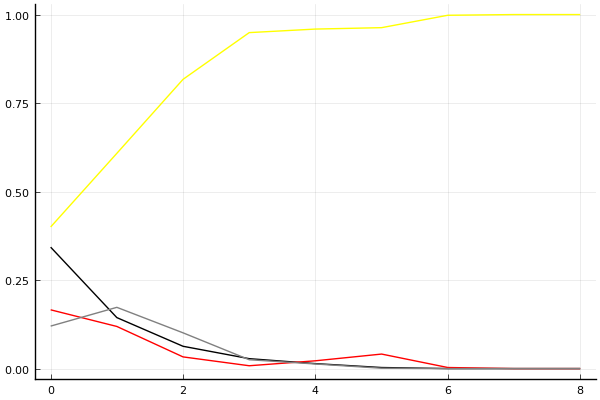
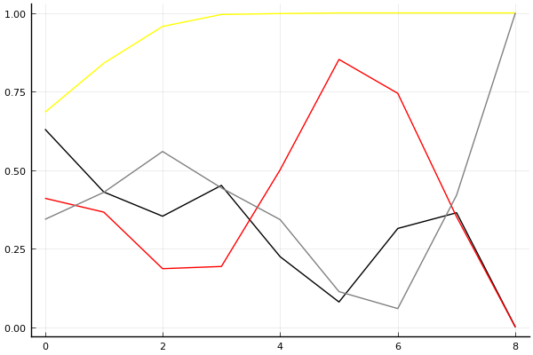

2016 듀얼 레이스 개인전 결승 2회전

## 경기 결과

| 트랙 | 유영혁 | 유창현 | 문호준 | 김승태 |
|:---|---:|---:|---:|---:|
| [비치 해변 드라이브](../haebyun) | 10 | 4 | 5 | 7 |
| [해적 숨겨진 보물](../haesumbo) | 10 | 5 | 4 | 7 |
| [아이스 부서진 빙산](../boobing) | 10 | 7 | 5 | 4 |
| [공동묘지 마왕의 초대](../mawang) | 7 | 4 | 10 | 5 |
| [월드 파리 에펠탑 다이브](../eifel) | 7 | 5 | 10 | 4 |
| [월드 두바이 다운타운](../dubai) | 7 | 10 | 4 | 5 |
| [월드 리오 다운힐](../rio) | 7 | 5 | 4 | 10 |
| [대저택 은밀한 지하실](../jeotaek) | 10 | 5 | 4 | 7 |
| __total__ |__68__ |__45__ |__46__ |__49__ |

## 시뮬레이션

### 1st 확률

x축: 트랙, y축: 확률
1번: 옐로우, 2번: 블랙, 3번: 레드, 4번: 화이트(회색), 5번: 퍼플, 6번: 그린, 7번: 블루, 8번: 오렌지

| 트랙 | 유영혁 | 유창현 | 문호준 | 김승태 |
|:---|---:|---:|---:|---:|
| 초기 | 0.400 | 0.343 | 0.166 | 0.120 |
| 비치 해변 드라이브 | 0.608 | 0.144 | 0.119 | 0.173 |
| 해적 숨겨진 보물 | 0.817 | 0.063 | 0.033 | 0.101 |
| 아이스 부서진 빙산 | 0.949 | 0.028 | 0.008 | 0.025 |
| 공동묘지 마왕의 초대 | 0.959 | 0.014 | 0.022 | 0.013 |
| 월드 파리 에펠탑 다이브 | 0.963 | 0.003 | 0.041 | 0.001 |
| 월드 두바이 다운타운 | 0.998 | 0.000 | 0.003 | 0.000 |
| 월드 리오 다운힐 | 1.000 | 0.000 | 0.000 | 0.000 |
| 대저택 은밀한 지하실 | 1.000 | 0.000 | 0.000 | 0.000 |

### Advance 확률

x축: 트랙, y축: 확률
1번: 옐로우, 2번: 블랙, 3번: 레드, 4번: 화이트(회색), 5번: 퍼플, 6번: 그린, 7번: 블루, 8번: 오렌지

| 트랙 | 유영혁 | 유창현 | 문호준 | 김승태 |
|:---|---:|---:|---:|---:|
| 초기 | 0.702 | 0.640 | 0.410 | 0.321 |
| 비치 해변 드라이브 | 0.844 | 0.418 | 0.359 | 0.446 |
| 해적 숨겨진 보물 | 0.952 | 0.375 | 0.193 | 0.539 |
| 아이스 부서진 빙산 | 0.999 | 0.454 | 0.169 | 0.451 |
| 공동묘지 마왕의 초대 | 0.997 | 0.255 | 0.487 | 0.341 |
| 월드 파리 에펠탑 다이브 | 1.000 | 0.078 | 0.841 | 0.116 |
| 월드 두바이 다운타운 | 1.000 | 0.305 | 0.769 | 0.054 |
| 월드 리오 다운힐 | 1.000 | 0.397 | 0.390 | 0.353 |
| 대저택 은밀한 지하실 | 1.000 | 0.000 | 0.000 | 1.000 |

## 랭킹 변동

### [전체 랭킹](../singles-full)

| 순위 | 변동 | 이름 | 점수 | 변동 | mu | 변동 | sigma | 변동 |
|---:|---:|:---:|---:|---:|---:|---:|---:|---:|
| 1 / 32 | +0 | [유영혁](../yuyeonghyeok) | 3418 | +160 | 3781 | +114 | 121 | -15 |
| 2 / 32 | +0 | [유창현](../yuchanghyeon) | 3215 | -23 | 3566 | -65 | 117 | -14 |
| 3 / 32 | +2 | [김승태](../gimseungtae) | 3143 | +57 | 3497 | +13 | 118 | -14 |
| 5 / 32 | -2 | [문호준](../munhojun) | 3108 | -16 | 3463 | -55 | 118 | -13 |

### 시즌 랭킹

| 순위 | 변동 | 이름 | 점수 | 변동 | mu | 변동 | sigma | 변동 |
|---:|---:|:---:|---:|---:|---:|---:|---:|---:|
| 1 / 32 | +0 | [유영혁](../yuyeonghyeok) | 3418 | +160 | 3781 | +114 | 121 | -15 |
| 2 / 32 | +0 | [유창현](../yuchanghyeon) | 3215 | -23 | 3566 | -65 | 117 | -14 |
| 3 / 32 | +2 | [김승태](../gimseungtae) | 3143 | +57 | 3497 | +13 | 118 | -14 |
| 5 / 32 | -2 | [문호준](../munhojun) | 3108 | -16 | 3463 | -55 | 118 | -13 |

### 트랙 별 랭킹

#### [공동묘지 마왕의 초대](../mawang)

| 순위 | 변동 | 이름 | 점수 | 변동 | mu | 변동 | sigma | 변동 |
|:---:|:---:|:---:|---:|---:|---:|---:|---:|---:|
| 2 / 32 | -1 | [김승태](../gimseungtae) | 2637 | -139 | 3838 | -425 | 400 | -95 |
| 3 / 32 | +1 | [유영혁](../yuyeonghyeok) | 2463 | +286 | 3572 | +75 | 370 | -71 |
| 4 / 32 | -1 | [유창현](../yuchanghyeon) | 2188 | -158 | 3354 | -327 | 388 | -56 |
| 9 / 32 | +8 | [문호준](../munhojun) | 2021 | +917 | 3216 | +682 | 398 | -78 |

#### [대저택 은밀한 지하실](../jeotaek)

| 순위 | 변동 | 이름 | 점수 | 변동 | mu | 변동 | sigma | 변동 |
|:---:|:---:|:---:|---:|---:|---:|---:|---:|---:|
| 1 / 32 | +1 | [유영혁](../yuyeonghyeok) | 3093 | +489 | 4359 | +316 | 422 | -58 |
| 2 / 32 | -1 | [김승태](../gimseungtae) | 2970 | +186 | 4207 | -44 | 412 | -77 |
| 3 / 32 | +0 | [유창현](../yuchanghyeon) | 2527 | +68 | 3730 | -121 | 401 | -63 |
| 11 / 32 | +0 | [문호준](../munhojun) | 1651 | -22 | 2906 | -129 | 418 | -36 |

#### [비치 해변 드라이브](../haebyun)

| 순위 | 변동 | 이름 | 점수 | 변동 | mu | 변동 | sigma | 변동 |
|:---:|:---:|:---:|---:|---:|---:|---:|---:|---:|
| 2 / 32 | +2 | [유영혁](../yuyeonghyeok) | 2525 | +424 | 3680 | +279 | 385 | -48 |
| 3 / 32 | +3 | [김승태](../gimseungtae) | 2307 | +287 | 3493 | +51 | 395 | -79 |
| 6 / 32 | +4 | [문호준](../munhojun) | 2006 | +180 | 3120 | -8 | 371 | -63 |
| 7 / 32 | -2 | [유창현](../yuchanghyeon) | 1900 | -166 | 3062 | -324 | 387 | -53 |

#### [아이스 부서진 빙산](../boobing)

| 순위 | 변동 | 이름 | 점수 | 변동 | mu | 변동 | sigma | 변동 |
|:---:|:---:|:---:|---:|---:|---:|---:|---:|---:|
| 1 / 32 | +0 | [유영혁](../yuyeonghyeok) | 3470 | +232 | 5002 | +111 | 511 | -40 |
| 5 / 32 | +0 | [유창현](../yuchanghyeon) | 2635 | +179 | 3928 | +31 | 431 | -49 |
| 9 / 32 | +4 | [문호준](../munhojun) | 1763 | +175 | 3002 | +28 | 413 | -49 |
| 20 / 32 | +0 | [김승태](../gimseungtae) | 957 | -30 | 2327 | -158 | 457 | -43 |

#### [월드 두바이 다운타운](../dubai)

| 순위 | 변동 | 이름 | 점수 | 변동 | mu | 변동 | sigma | 변동 |
|:---:|:---:|:---:|---:|---:|---:|---:|---:|---:|
| 1 / 26 | +1 | [유창현](../yuchanghyeon) | 2770 | +349 | 3804 | +236 | 345 | -38 |
| 2 / 26 | -1 | [문호준](../munhojun) | 2632 | -354 | 3772 | -551 | 380 | -66 |
| 3 / 26 | +0 | [유영혁](../yuyeonghyeok) | 2487 | +315 | 3559 | +128 | 357 | -62 |
| 4 / 26 | +2 | [김승태](../gimseungtae) | 2311 | +193 | 3286 | +59 | 325 | -45 |

#### [월드 리오 다운힐](../rio)

| 순위 | 변동 | 이름 | 점수 | 변동 | mu | 변동 | sigma | 변동 |
|:---:|:---:|:---:|---:|---:|---:|---:|---:|---:|
| 1 / 26 | +1 | [김승태](../gimseungtae) | 2778 | +312 | 3802 | +207 | 341 | -35 |
| 2 / 26 | +2 | [유영혁](../yuyeonghyeok) | 2467 | +270 | 3504 | +107 | 346 | -54 |
| 3 / 26 | -2 | [문호준](../munhojun) | 2401 | -168 | 3407 | -282 | 335 | -38 |
| 4 / 26 | -1 | [유창현](../yuchanghyeon) | 2349 | +119 | 3328 | -16 | 326 | -45 |

#### [월드 파리 에펠탑 다이브](../eifel)

| 순위 | 변동 | 이름 | 점수 | 변동 | mu | 변동 | sigma | 변동 |
|:---:|:---:|:---:|---:|---:|---:|---:|---:|---:|
| 1 / 32 | +0 | [유창현](../yuchanghyeon) | 3214 | -108 | 4234 | -267 | 340 | -53 |
| 2 / 32 | +2 | [문호준](../munhojun) | 3082 | +412 | 4203 | +266 | 374 | -49 |
| 5 / 32 | +3 | [유영혁](../yuyeonghyeok) | 2724 | +330 | 3674 | +208 | 316 | -41 |
| 7 / 32 | -2 | [김승태](../gimseungtae) | 2561 | -99 | 3636 | -222 | 358 | -41 |

#### [해적 숨겨진 보물](../haesumbo)

| 순위 | 변동 | 이름 | 점수 | 변동 | mu | 변동 | sigma | 변동 |
|:---:|:---:|:---:|---:|---:|---:|---:|---:|---:|
| 1 / 32 | +2 | [유영혁](../yuyeonghyeok) | 2964 | +322 | 4275 | +176 | 437 | -49 |
| 4 / 32 | +6 | [김승태](../gimseungtae) | 2273 | +406 | 3412 | +222 | 379 | -62 |
| 5 / 32 | -1 | [유창현](../yuchanghyeon) | 2267 | +90 | 3414 | -109 | 382 | -67 |
| 10 / 32 | -3 | [문호준](../munhojun) | 1873 | -119 | 3075 | -276 | 401 | -52 |
