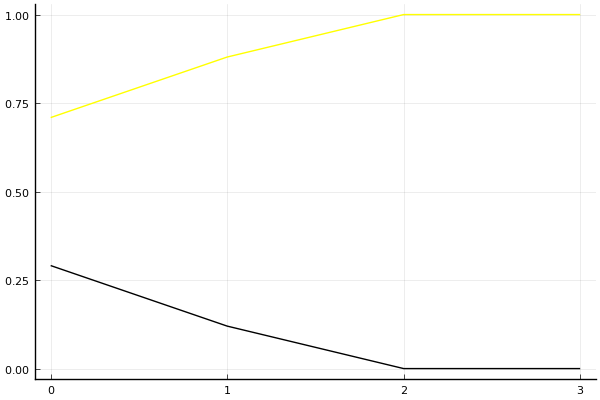

2016 듀얼 레이스 개인전 결승 3회전

## 경기 결과

| 트랙 | 유영혁 | 김승태 |
|:---|---:|---:|
| [비치 해변 드라이브](../haebyun) | 1 | 0 |
| [해적 숨겨진 보물](../haesumbo) | 1 | 0 |
| [팩토리 미완성 5구역](../district5) | 1 | 0 |
| __total__ |__3__ |__0__ |

## 시뮬레이션

### 1st 확률

x축: 트랙, y축: 확률
1번: 옐로우, 2번: 블랙, 3번: 레드, 4번: 화이트(회색), 5번: 퍼플, 6번: 그린, 7번: 블루, 8번: 오렌지

| 트랙 | 유영혁 | 김승태 |
|:---|---:|---:|
| 초기 | 0.709 | 0.291 |
| 비치 해변 드라이브 | 0.880 | 0.120 |
| 해적 숨겨진 보물 | 1.000 | 0.000 |
| 팩토리 미완성 5구역 | 1.000 | 0.000 |

## 랭킹 변동

### [전체 랭킹](../singles-full)

| 순위 | 변동 | 이름 | 점수 | 변동 | mu | 변동 | sigma | 변동 |
|---:|---:|:---:|---:|---:|---:|---:|---:|---:|
| 1 / 32 | +0 | [유영혁](../yuyeonghyeok) | 3455 | +38 | 3814 | +33 | 120 | -1 |
| 4 / 32 | -1 | [김승태](../gimseungtae) | 3116 | -28 | 3465 | -32 | 117 | -1 |

### 시즌 랭킹

| 순위 | 변동 | 이름 | 점수 | 변동 | mu | 변동 | sigma | 변동 |
|---:|---:|:---:|---:|---:|---:|---:|---:|---:|
| 1 / 32 | +0 | [유영혁](../yuyeonghyeok) | 3455 | +38 | 3814 | +33 | 120 | -1 |
| 4 / 32 | -1 | [김승태](../gimseungtae) | 3116 | -28 | 3465 | -32 | 117 | -1 |

### 트랙 별 랭킹

#### [비치 해변 드라이브](../haebyun)

| 순위 | 변동 | 이름 | 점수 | 변동 | mu | 변동 | sigma | 변동 |
|:---:|:---:|:---:|---:|---:|---:|---:|---:|---:|
| 1 / 32 | +1 | [유영혁](../yuyeonghyeok) | 2700 | +175 | 3791 | +111 | 364 | -21 |
| 3 / 32 | +0 | [김승태](../gimseungtae) | 2260 | -47 | 3376 | -117 | 372 | -23 |

#### [팩토리 미완성 5구역](../district5)

| 순위 | 변동 | 이름 | 점수 | 변동 | mu | 변동 | sigma | 변동 |
|:---:|:---:|:---:|---:|---:|---:|---:|---:|---:|
| 1 / 26 | +0 | [유영혁](../yuyeonghyeok) | 3281 | +178 | 4885 | +87 | 535 | -30 |
| 5 / 26 | +0 | [김승태](../gimseungtae) | 2060 | +3 | 3655 | -86 | 532 | -30 |

#### [해적 숨겨진 보물](../haesumbo)

| 순위 | 변동 | 이름 | 점수 | 변동 | mu | 변동 | sigma | 변동 |
|:---:|:---:|:---:|---:|---:|---:|---:|---:|---:|
| 1 / 32 | +0 | [유영혁](../yuyeonghyeok) | 3088 | +124 | 4339 | +65 | 417 | -20 |
| 5 / 32 | -1 | [김승태](../gimseungtae) | 2263 | -10 | 3363 | -49 | 367 | -13 |
