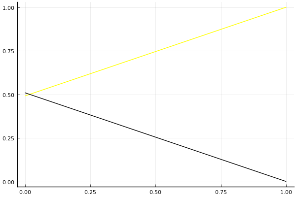

2017 Kespa Cup 개인전 32강 B조 tiebreaker

## 경기 결과

| 트랙 | 김이준 | 노준엽 |
|:---|---:|---:|
| [포레스트 지그재그](../zigzag) | 1 | 0 |
| __total__ |__1__ |__0__ |

## 시뮬레이션

### 1st 확률

x축: 트랙, y축: 확률
1번: 옐로우, 2번: 블랙, 3번: 레드, 4번: 화이트(회색), 5번: 퍼플, 6번: 그린, 7번: 블루, 8번: 오렌지

| 트랙 | 김이준 | 노준엽 |
|:---|---:|---:|
| 초기 | 0.538 | 0.462 |
| 포레스트 지그재그 | 1.000 | 0.000 |

## 랭킹 변동

### [전체 랭킹](../singles-full)

| 순위 | 변동 | 이름 | 점수 | 변동 | mu | 변동 | sigma | 변동 |
|---:|---:|:---:|---:|---:|---:|---:|---:|---:|
| 31 / 45 | +0 | [김이준](../gimijun) | 2164 | +90 | 2914 | +65 | 250 | -8 |
| 35 / 45 | +0 | [노준엽](../nojunyeob) | 1977 | -41 | 2747 | -68 | 257 | -9 |

### 시즌 랭킹

| 순위 | 변동 | 이름 | 점수 | 변동 | mu | 변동 | sigma | 변동 |
|---:|---:|:---:|---:|---:|---:|---:|---:|---:|
| 6 / 16 | +3 | [김이준](../gimijun) | 2207 | +106 | 3003 | +75 | 265 | -10 |
| 10 / 16 | +0 | [노준엽](../nojunyeob) | 2043 | -46 | 2853 | -78 | 270 | -11 |

### 트랙 별 랭킹

#### [포레스트 지그재그](../zigzag)

| 순위 | 변동 | 이름 | 점수 | 변동 | mu | 변동 | sigma | 변동 |
|:---:|:---:|:---:|---:|---:|---:|---:|---:|---:|
| 7 / 16 | +0 | [김이준](../gimijun) | 1587 | +224 | 3251 | +114 | 555 | -37 |
| 13 / 16 | +1 | [노준엽](../nojunyeob) | 364 | +3 | 2109 | -128 | 582 | -44 |
