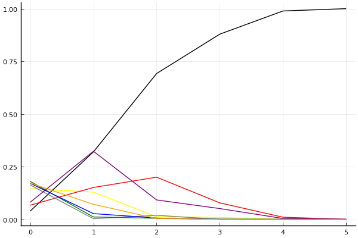
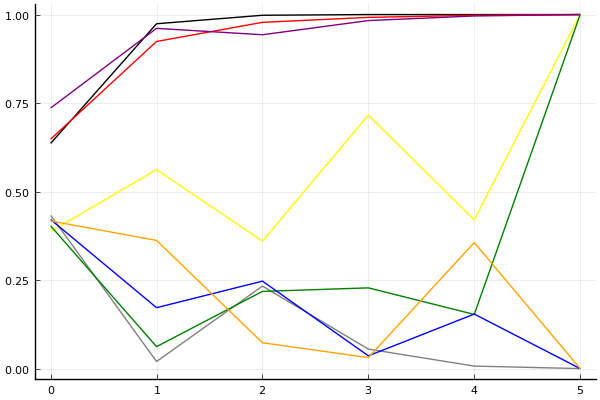

2017 Kespa Cup 개인전 32강 B조

## 경기 결과

| 트랙 | 김이준 | 이재혁 | 황인호 | 전진우 | 이중선 | 노준엽 | 강현 | 이태경 |
|:---|---:|---:|---:|---:|---:|---:|---:|---:|
| [포레스트 지그재그](../zigzag) | 4 | 10 | 5 | -1 | 7 | 0 | 1 | 3 |
| [차이나 서안 병마용](../byeongma) | 1 | 10 | 7 | 5 | 0 | 4 | 3 | -1 |
| [팩토리 미완성 5구역](../district5) | 5 | 10 | 4 | 0 | 7 | 3 | -1 | 1 |
| [대저택 은밀한 지하실](../jeotaek) | 0 | 10 | 4 | -1 | 3 | 1 | 5 | 7 |
| [노르테유 익스프레스](../noex) | 5 | 10 | 0 | 4 | 1 | 7 | 3 | -1 |
| __total__ |__15__ |__50__ |__20__ |__7__ |__18__ |__15__ |__11__ |__9__ |

## 시뮬레이션

### 1st 확률

x축: 트랙, y축: 확률
1번: 옐로우, 2번: 블랙, 3번: 레드, 4번: 화이트(회색), 5번: 퍼플, 6번: 그린, 7번: 블루, 8번: 오렌지

| 트랙 | 김이준 | 이재혁 | 황인호 | 전진우 | 이중선 | 노준엽 | 강현 | 이태경 |
|:---|---:|---:|---:|---:|---:|---:|---:|---:|
| 초기 | 0.145 | 0.047 | 0.052 | 0.173 | 0.072 | 0.167 | 0.177 | 0.183 |
| 포레스트 지그재그 | 0.124 | 0.306 | 0.166 | 0.002 | 0.312 | 0.008 | 0.024 | 0.076 |
| 차이나 서안 병마용 | 0.025 | 0.644 | 0.212 | 0.014 | 0.100 | 0.009 | 0.014 | 0.000 |
| 팩토리 미완성 5구역 | 0.009 | 0.891 | 0.067 | 0.000 | 0.040 | 0.000 | 0.000 | 0.000 |
| 대저택 은밀한 지하실 | 0.000 | 0.994 | 0.004 | 0.000 | 0.002 | 0.000 | 0.000 | 0.000 |
| 노르테유 익스프레스 | 0.000 | 1.000 | 0.000 | 0.000 | 0.000 | 0.000 | 0.000 | 0.000 |

### Advance 확률

x축: 트랙, y축: 확률
1번: 옐로우, 2번: 블랙, 3번: 레드, 4번: 화이트(회색), 5번: 퍼플, 6번: 그린, 7번: 블루, 8번: 오렌지

| 트랙 | 김이준 | 이재혁 | 황인호 | 전진우 | 이중선 | 노준엽 | 강현 | 이태경 |
|:---|---:|---:|---:|---:|---:|---:|---:|---:|
| 초기 | 0.387 | 0.636 | 0.648 | 0.433 | 0.736 | 0.403 | 0.421 | 0.417 |
| 포레스트 지그재그 | 0.562 | 0.974 | 0.924 | 0.020 | 0.961 | 0.062 | 0.172 | 0.362 |
| 차이나 서안 병마용 | 0.360 | 0.998 | 0.978 | 0.233 | 0.943 | 0.218 | 0.247 | 0.073 |
| 팩토리 미완성 5구역 | 0.716 | 1.000 | 0.992 | 0.055 | 0.983 | 0.228 | 0.036 | 0.031 |
| 대저택 은밀한 지하실 | 0.420 | 1.000 | 0.998 | 0.007 | 0.996 | 0.153 | 0.154 | 0.356 |
| 노르테유 익스프레스 | 1.000 | 1.000 | 1.000 | 0.000 | 1.000 | 1.000 | 0.000 | 0.000 |

## 랭킹 변동

### [전체 랭킹](../singles-full)

| 순위 | 변동 | 이름 | 점수 | 변동 | mu | 변동 | sigma | 변동 |
|---:|---:|:---:|---:|---:|---:|---:|---:|---:|
| 8 / 45 | +3 | [이재혁](../ijaehyeok) | 3078 | +135 | 3408 | +120 | 110 | -5 |
| 11 / 45 | -2 | [이중선](../ijungseon) | 2919 | -72 | 3279 | -108 | 120 | -12 |
| 13 / 45 | -1 | [황인호](../hwanginho) | 2855 | -42 | 3231 | -85 | 125 | -14 |
| 31 / 45 | NaN | [김이준](../gimijun) | 2074 | +2074 | 2850 | -150 | 259 | -741 |
| 35 / 45 | NaN | [노준엽](../nojunyeob) | 2017 | +2017 | 2815 | -185 | 266 | -734 |
| 41 / 45 | NaN | [강현](../ganghyeon) | 1831 | +1831 | 2630 | -370 | 266 | -734 |
| 42 / 45 | NaN | [이태경](../itaegyoeng) | 1679 | +1679 | 2520 | -480 | 280 | -720 |
| 44 / 45 | NaN | [전진우](../jeonjinwoo) | 1573 | +1573 | 2427 | -573 | 285 | -715 |

### 시즌 랭킹

| 순위 | 변동 | 이름 | 점수 | 변동 | mu | 변동 | sigma | 변동 |
|---:|---:|:---:|---:|---:|---:|---:|---:|---:|
| 1 / 16 | NaN | [이재혁](../ijaehyeok) | 3350 | +3350 | 4811 | +1811 | 487 | -513 |
| 6 / 16 | NaN | [황인호](../hwanginho) | 2195 | +2195 | 3037 | +37 | 281 | -719 |
| 8 / 16 | NaN | [이중선](../ijungseon) | 2149 | +2149 | 2987 | -13 | 279 | -721 |
| 9 / 16 | NaN | [김이준](../gimijun) | 2101 | +2101 | 2928 | -72 | 276 | -724 |
| 10 / 16 | NaN | [노준엽](../nojunyeob) | 2088 | +2088 | 2931 | -69 | 281 | -719 |
| 13 / 16 | NaN | [강현](../ganghyeon) | 1854 | +1854 | 2690 | -310 | 279 | -721 |
| 15 / 16 | NaN | [이태경](../itaegyoeng) | 1691 | +1691 | 2576 | -424 | 295 | -705 |
| 16 / 16 | NaN | [전진우](../jeonjinwoo) | 1603 | +1603 | 2491 | -509 | 296 | -704 |

### 트랙 별 랭킹

#### [노르테유 익스프레스](../noex)

| 순위 | 변동 | 이름 | 점수 | 변동 | mu | 변동 | sigma | 변동 |
|:---:|:---:|:---:|---:|---:|---:|---:|---:|---:|
| 4 / 45 | NaN | [이재혁](../ijaehyeok) | 2279 | +2279 | 4351 | +1351 | 691 | -309 |
| 7 / 45 | NaN | [노준엽](../nojunyeob) | 2031 | +2031 | 3863 | +863 | 611 | -389 |
| 9 / 45 | -3 | [이중선](../ijungseon) | 1933 | -92 | 3132 | -320 | 400 | -76 |
| 13 / 45 | NaN | [김이준](../gimijun) | 1797 | +1797 | 3547 | +547 | 583 | -417 |
| 20 / 45 | NaN | [전진우](../jeonjinwoo) | 1577 | +1577 | 3289 | +289 | 570 | -430 |
| 27 / 45 | NaN | [강현](../ganghyeon) | 1360 | +1360 | 3053 | +53 | 564 | -436 |
| 37 / 45 | NaN | [황인호](../hwanginho) | 601 | +601 | 2435 | -565 | 611 | -389 |
| 42 / 45 | NaN | [이태경](../itaegyoeng) | -250 | -250 | 1877 | -1123 | 709 | -291 |

#### [대저택 은밀한 지하실](../jeotaek)

| 순위 | 변동 | 이름 | 점수 | 변동 | mu | 변동 | sigma | 변동 |
|:---:|:---:|:---:|---:|---:|---:|---:|---:|---:|
| 4 / 45 | NaN | [이재혁](../ijaehyeok) | 2199 | +2199 | 4290 | +1290 | 697 | -303 |
| 9 / 45 | NaN | [이태경](../itaegyoeng) | 1942 | +1942 | 3785 | +785 | 614 | -386 |
| 13 / 45 | -1 | [이중선](../ijungseon) | 1839 | +126 | 2983 | -71 | 381 | -66 |
| 15 / 45 | NaN | [강현](../ganghyeon) | 1699 | +1699 | 3452 | +452 | 585 | -415 |
| 20 / 45 | NaN | [황인호](../hwanginho) | 1468 | +1468 | 3175 | +175 | 569 | -431 |
| 31 / 45 | NaN | [노준엽](../nojunyeob) | 882 | +882 | 2622 | -378 | 580 | -420 |
| 38 / 45 | NaN | [김이준](../gimijun) | 434 | +434 | 2276 | -724 | 614 | -386 |
| 42 / 45 | NaN | [전진우](../jeonjinwoo) | -344 | -344 | 1757 | -1243 | 700 | -300 |

#### [차이나 서안 병마용](../byeongma)

| 순위 | 변동 | 이름 | 점수 | 변동 | mu | 변동 | sigma | 변동 |
|:---:|:---:|:---:|---:|---:|---:|---:|---:|---:|
| 3 / 29 | +5 | [이재혁](../ijaehyeok) | 2410 | +443 | 3568 | +290 | 386 | -51 |
| 9 / 29 | +6 | [황인호](../hwanginho) | 1918 | +541 | 3062 | +323 | 381 | -72 |
| 15 / 29 | NaN | [전진우](../jeonjinwoo) | 1477 | +1477 | 3134 | +134 | 552 | -448 |
| 18 / 29 | NaN | [노준엽](../nojunyeob) | 1241 | +1241 | 2912 | -88 | 557 | -443 |
| 20 / 29 | NaN | [강현](../ganghyeon) | 988 | +988 | 2683 | -317 | 565 | -435 |
| 23 / 29 | NaN | [김이준](../gimijun) | 693 | +693 | 2429 | -571 | 579 | -421 |
| 26 / 29 | NaN | [이중선](../ijungseon) | 297 | +297 | 2118 | -882 | 607 | -393 |
| 29 / 29 | NaN | [이태경](../itaegyoeng) | -428 | -428 | 1634 | -1366 | 688 | -312 |

#### [팩토리 미완성 5구역](../district5)

| 순위 | 변동 | 이름 | 점수 | 변동 | mu | 변동 | sigma | 변동 |
|:---:|:---:|:---:|---:|---:|---:|---:|---:|---:|
| 9 / 40 | +11 | [이중선](../ijungseon) | 1980 | +522 | 3124 | +346 | 382 | -59 |
| 10 / 40 | NaN | [이재혁](../ijaehyeok) | 1951 | +1951 | 4038 | +1038 | 696 | -304 |
| 22 / 40 | NaN | [김이준](../gimijun) | 1510 | +1510 | 3205 | +205 | 565 | -435 |
| 25 / 40 | NaN | [황인호](../hwanginho) | 1269 | +1269 | 2969 | -31 | 567 | -433 |
| 27 / 40 | NaN | [노준엽](../nojunyeob) | 1012 | +1012 | 2730 | -270 | 572 | -428 |
| 30 / 40 | NaN | [이태경](../itaegyoeng) | 713 | +713 | 2468 | -532 | 585 | -415 |
| 35 / 40 | NaN | [전진우](../jeonjinwoo) | 313 | +313 | 2149 | -851 | 612 | -388 |
| 39 / 40 | NaN | [강현](../ganghyeon) | -418 | -418 | 1659 | -1341 | 692 | -308 |

#### [포레스트 지그재그](../zigzag)

| 순위 | 변동 | 이름 | 점수 | 변동 | mu | 변동 | sigma | 변동 |
|:---:|:---:|:---:|---:|---:|---:|---:|---:|---:|
| 2 / 16 | NaN | [이재혁](../ijaehyeok) | 2161 | +2161 | 4274 | +1274 | 704 | -296 |
| 3 / 16 | NaN | [이중선](../ijungseon) | 1887 | +1887 | 3763 | +763 | 625 | -375 |
| 6 / 16 | NaN | [황인호](../hwanginho) | 1622 | +1622 | 3423 | +423 | 600 | -400 |
| 7 / 16 | NaN | [김이준](../gimijun) | 1363 | +1363 | 3137 | +137 | 591 | -409 |
| 9 / 16 | NaN | [이태경](../itaegyoeng) | 1090 | +1090 | 2863 | -137 | 591 | -409 |
| 12 / 16 | NaN | [강현](../ganghyeon) | 776 | +776 | 2577 | -423 | 600 | -400 |
| 14 / 16 | NaN | [노준엽](../nojunyeob) | 361 | +361 | 2237 | -763 | 625 | -375 |
| 15 / 16 | NaN | [전진우](../jeonjinwoo) | -388 | -388 | 1726 | -1274 | 704 | -296 |
