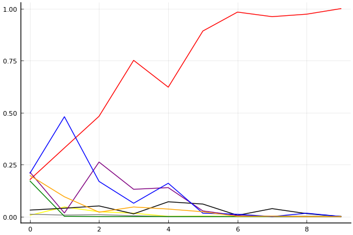
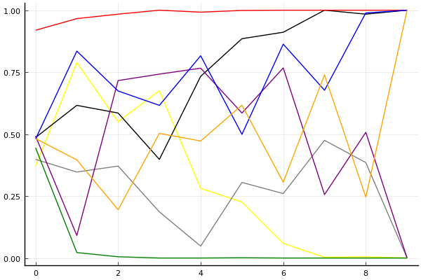

2017 Kespa Cup 개인전 32강 C조

## 경기 결과

| 트랙 | 권순민 | 손우현 | 전대웅 | 최영훈 | 박병선 | 임성준 | 김승래 | 사상훈 |
|:---|---:|---:|---:|---:|---:|---:|---:|---:|
| [포레스트 지그재그](../zigzag) | 10 | 4 | 5 | 1 | 0 | -1 | 7 | 3 |
| [차이나 서안 병마용](../byeongma) | 0 | 4 | 7 | 5 | 10 | -1 | 3 | 1 |
| [팩토리 미완성 5구역](../district5) | 5 | 1 | 10 | 0 | 4 | -5 | 3 | 7 |
| [대저택 은밀한 지하실](../jeotaek) | -1 | 10 | 3 | 0 | 5 | 1 | 7 | 4 |
| [노르테유 익스프레스](../noex) | 1 | 5 | 7 | 10 | 0 | 3 | -1 | 4 |
| [광산 위험한 제련소](../jeryeonso) | 0 | 3 | 10 | 4 | 5 | -1 | 7 | 1 |
| [네모 산타의 비밀공간](../santa) | 0 | 10 | 4 | 5 | -1 | 3 | 1 | 7 |
| [빌리지 붐힐터널](../boomhill) | 5 | -1 | 1 | 4 | 7 | 3 | 10 | 0 |
| [아이스 설산 다운힐](../seolsan) | 10 | 1 | 4 | 0 | 3 | -1 | 5 | 7 |
| __total__ |__30__ |__37__ |__51__ |__29__ |__33__ |__1__ |__42__ |__34__ |

## 시뮬레이션

### 1st 확률

x축: 트랙, y축: 확률
1번: 옐로우, 2번: 블랙, 3번: 레드, 4번: 화이트(회색), 5번: 퍼플, 6번: 그린, 7번: 블루, 8번: 오렌지

| 트랙 | 권순민 | 손우현 | 전대웅 | 최영훈 | 박병선 | 임성준 | 김승래 | 사상훈 |
|:---|---:|---:|---:|---:|---:|---:|---:|---:|
| 초기 | 0.006 | 0.031 | 0.177 | 0.011 | 0.214 | 0.172 | 0.207 | 0.198 |
| 포레스트 지그재그 | 0.046 | 0.040 | 0.330 | 0.007 | 0.017 | 0.001 | 0.480 | 0.095 |
| 차이나 서안 병마용 | 0.023 | 0.051 | 0.482 | 0.009 | 0.262 | 0.000 | 0.169 | 0.021 |
| 팩토리 미완성 5구역 | 0.016 | 0.013 | 0.751 | 0.004 | 0.131 | 0.000 | 0.064 | 0.046 |
| 대저택 은밀한 지하실 | 0.001 | 0.071 | 0.622 | 0.000 | 0.139 | 0.000 | 0.160 | 0.036 |
| 노르테유 익스프레스 | 0.002 | 0.060 | 0.892 | 0.000 | 0.027 | 0.000 | 0.016 | 0.023 |
| 광산 위험한 제련소 | 0.000 | 0.006 | 0.983 | 0.000 | 0.005 | 0.000 | 0.011 | 0.001 |
| 네모 산타의 비밀공간 | 0.000 | 0.038 | 0.961 | 0.000 | 0.000 | 0.000 | 0.000 | 0.002 |
| 빌리지 붐힐터널 | 0.000 | 0.014 | 0.973 | 0.001 | 0.000 | 0.000 | 0.016 | 0.000 |
| 아이스 설산 다운힐 | 0.000 | 0.000 | 1.000 | 0.000 | 0.000 | 0.000 | 0.000 | 0.000 |

### Advance 확률

x축: 트랙, y축: 확률
1번: 옐로우, 2번: 블랙, 3번: 레드, 4번: 화이트(회색), 5번: 퍼플, 6번: 그린, 7번: 블루, 8번: 오렌지

| 트랙 | 권순민 | 손우현 | 전대웅 | 최영훈 | 박병선 | 임성준 | 김승래 | 사상훈 |
|:---|---:|---:|---:|---:|---:|---:|---:|---:|
| 초기 | 0.370 | 0.486 | 0.919 | 0.398 | 0.492 | 0.445 | 0.480 | 0.482 |
| 포레스트 지그재그 | 0.789 | 0.616 | 0.966 | 0.347 | 0.091 | 0.022 | 0.835 | 0.396 |
| 차이나 서안 병마용 | 0.550 | 0.585 | 0.984 | 0.371 | 0.716 | 0.005 | 0.674 | 0.195 |
| 팩토리 미완성 5구역 | 0.675 | 0.398 | 1.000 | 0.186 | 0.742 | 0.000 | 0.616 | 0.503 |
| 대저택 은밀한 지하실 | 0.281 | 0.733 | 0.992 | 0.048 | 0.766 | 0.000 | 0.816 | 0.472 |
| 노르테유 익스프레스 | 0.226 | 0.885 | 0.999 | 0.305 | 0.585 | 0.001 | 0.499 | 0.617 |
| 광산 위험한 제련소 | 0.059 | 0.911 | 1.000 | 0.260 | 0.767 | 0.000 | 0.863 | 0.306 |
| 네모 산타의 비밀공간 | 0.003 | 1.000 | 1.000 | 0.475 | 0.256 | 0.000 | 0.677 | 0.739 |
| 빌리지 붐힐터널 | 0.005 | 0.984 | 1.000 | 0.385 | 0.507 | 0.000 | 0.989 | 0.246 |
| 아이스 설산 다운힐 | 0.000 | 1.000 | 1.000 | 0.000 | 0.000 | 0.000 | 1.000 | 1.000 |

## 랭킹 변동

### [전체 랭킹](../singles-full)

| 순위 | 변동 | 이름 | 점수 | 변동 | mu | 변동 | sigma | 변동 |
|---:|---:|:---:|---:|---:|---:|---:|---:|---:|
| 6 / 49 | -1 | [전대웅](../jeondaewoong) | 3172 | -14 | 3423 | -20 | 83 | -2 |
| 18 / 49 | +0 | [최영훈](../choiyeonghun) | 2673 | +22 | 2988 | -19 | 105 | -13 |
| 19 / 49 | +0 | [권순민](../gweonsoonmin) | 2644 | +25 | 2961 | -14 | 105 | -13 |
| 20 / 49 | +4 | [손우현](../sonuhyeon) | 2628 | +232 | 3081 | +12 | 151 | -73 |
| 21 / 49 | NaN | [김승래](../gimseungrae) | 2588 | +2588 | 3174 | +174 | 195 | -805 |
| 23 / 49 | NaN | [사상훈](../sasanghun) | 2509 | +2509 | 3083 | +83 | 191 | -809 |
| 26 / 49 | NaN | [박병선](../bakbyeongseon) | 2421 | +2421 | 3014 | +14 | 198 | -802 |
| 45 / 49 | NaN | [임성준](../imseongjun) | 1759 | +1759 | 2437 | -563 | 226 | -774 |

### 시즌 랭킹

| 순위 | 변동 | 이름 | 점수 | 변동 | mu | 변동 | sigma | 변동 |
|---:|---:|:---:|---:|---:|---:|---:|---:|---:|
| 3 / 24 | NaN | [전대웅](../jeondaewoong) | 2722 | +2722 | 3344 | +344 | 208 | -792 |
| 6 / 24 | NaN | [김승래](../gimseungrae) | 2582 | +2582 | 3197 | +197 | 205 | -795 |
| 7 / 24 | NaN | [사상훈](../sasanghun) | 2511 | +2511 | 3111 | +111 | 200 | -800 |
| 9 / 24 | NaN | [손우현](../sonuhyeon) | 2481 | +2481 | 3099 | +99 | 206 | -794 |
| 10 / 24 | NaN | [박병선](../bakbyeongseon) | 2404 | +2404 | 3017 | +17 | 204 | -796 |
| 11 / 24 | NaN | [최영훈](../choiyeonghun) | 2356 | +2356 | 2969 | -31 | 204 | -796 |
| 12 / 24 | NaN | [권순민](../gweonsoonmin) | 2266 | +2266 | 2895 | -105 | 210 | -790 |
| 22 / 24 | NaN | [임성준](../imseongjun) | 1716 | +1716 | 2411 | -589 | 232 | -768 |

### 트랙 별 랭킹

#### [광산 위험한 제련소](../jeryeonso)

| 순위 | 변동 | 이름 | 점수 | 변동 | mu | 변동 | sigma | 변동 |
|:---:|:---:|:---:|---:|---:|---:|---:|---:|---:|
| 1 / 16 | NaN | [전대웅](../jeondaewoong) | 2161 | +2161 | 4274 | +1274 | 704 | -296 |
| 4 / 16 | NaN | [김승래](../gimseungrae) | 1887 | +1887 | 3763 | +763 | 625 | -375 |
| 5 / 16 | NaN | [박병선](../bakbyeongseon) | 1622 | +1622 | 3423 | +423 | 600 | -400 |
| 8 / 16 | NaN | [최영훈](../choiyeonghun) | 1363 | +1363 | 3137 | +137 | 591 | -409 |
| 9 / 16 | NaN | [손우현](../sonuhyeon) | 1090 | +1090 | 2863 | -137 | 591 | -409 |
| 11 / 16 | NaN | [사상훈](../sasanghun) | 776 | +776 | 2577 | -423 | 600 | -400 |
| 13 / 16 | NaN | [권순민](../gweonsoonmin) | 361 | +361 | 2237 | -763 | 625 | -375 |
| 16 / 16 | NaN | [임성준](../imseongjun) | -388 | -388 | 1726 | -1274 | 704 | -296 |

#### [네모 산타의 비밀공간](../santa)

| 순위 | 변동 | 이름 | 점수 | 변동 | mu | 변동 | sigma | 변동 |
|:---:|:---:|:---:|---:|---:|---:|---:|---:|---:|
| 1 / 28 | +0 | [최영훈](../choiyeonghun) | 2738 | +84 | 4136 | -355 | 466 | -146 |
| 2 / 28 | NaN | [손우현](../sonuhyeon) | 2445 | +2445 | 4465 | +1465 | 673 | -327 |
| 3 / 28 | +0 | [전대웅](../jeondaewoong) | 2336 | +170 | 3194 | +89 | 286 | -27 |
| 5 / 28 | NaN | [사상훈](../sasanghun) | 2227 | +2227 | 4007 | +1007 | 593 | -407 |
| 18 / 28 | -4 | [권순민](../gweonsoonmin) | 1494 | -60 | 2680 | -263 | 395 | -68 |
| 20 / 28 | NaN | [임성준](../imseongjun) | 1407 | +1407 | 3064 | +64 | 552 | -448 |
| 22 / 28 | NaN | [김승래](../gimseungrae) | 1111 | +1111 | 2792 | -208 | 560 | -440 |
| 27 / 28 | NaN | [박병선](../bakbyeongseon) | -148 | -148 | 1929 | -1071 | 692 | -308 |

#### [노르테유 익스프레스](../noex)

| 순위 | 변동 | 이름 | 점수 | 변동 | mu | 변동 | sigma | 변동 |
|:---:|:---:|:---:|---:|---:|---:|---:|---:|---:|
| 2 / 49 | +0 | [전대웅](../jeondaewoong) | 2903 | +194 | 4168 | -120 | 422 | -105 |
| 3 / 49 | +27 | [최영훈](../choiyeonghun) | 2361 | +1271 | 3762 | +898 | 467 | -124 |
| 6 / 49 | +11 | [손우현](../sonuhyeon) | 2225 | +603 | 3575 | +152 | 450 | -150 |
| 17 / 49 | +1 | [권순민](../gweonsoonmin) | 1635 | +13 | 3015 | -408 | 460 | -140 |
| 20 / 49 | NaN | [사상훈](../sasanghun) | 1618 | +1618 | 3279 | +279 | 554 | -446 |
| 30 / 49 | NaN | [임성준](../imseongjun) | 1358 | +1358 | 3032 | +32 | 558 | -442 |
| 40 / 49 | NaN | [박병선](../bakbyeongseon) | 575 | +575 | 2407 | -593 | 611 | -389 |
| 47 / 49 | NaN | [김승래](../gimseungrae) | -264 | -264 | 1856 | -1144 | 707 | -293 |

#### [대저택 은밀한 지하실](../jeotaek)

| 순위 | 변동 | 이름 | 점수 | 변동 | mu | 변동 | sigma | 변동 |
|:---:|:---:|:---:|---:|---:|---:|---:|---:|---:|
| 3 / 49 | +8 | [손우현](../sonuhyeon) | 2830 | +943 | 4357 | +594 | 509 | -116 |
| 5 / 49 | +0 | [전대웅](../jeondaewoong) | 2325 | +143 | 3440 | -82 | 372 | -75 |
| 6 / 49 | NaN | [김승래](../gimseungrae) | 2241 | +2241 | 3973 | +973 | 578 | -422 |
| 10 / 49 | NaN | [박병선](../bakbyeongseon) | 2023 | +2023 | 3694 | +694 | 557 | -443 |
| 15 / 49 | NaN | [사상훈](../sasanghun) | 1834 | +1834 | 3469 | +469 | 545 | -455 |
| 16 / 49 | -4 | [최영훈](../choiyeonghun) | 1786 | -101 | 3171 | -592 | 462 | -164 |
| 23 / 49 | NaN | [임성준](../imseongjun) | 1420 | +1420 | 3051 | +51 | 544 | -456 |
| 27 / 49 | -9 | [권순민](../gweonsoonmin) | 1340 | -283 | 2781 | -642 | 481 | -120 |

#### [빌리지 붐힐터널](../boomhill)

| 순위 | 변동 | 이름 | 점수 | 변동 | mu | 변동 | sigma | 변동 |
|:---:|:---:|:---:|---:|---:|---:|---:|---:|---:|
| 1 / 8 | NaN | [김승래](../gimseungrae) | 2161 | +2161 | 4274 | +1274 | 704 | -296 |
| 2 / 8 | NaN | [박병선](../bakbyeongseon) | 1887 | +1887 | 3763 | +763 | 625 | -375 |
| 3 / 8 | NaN | [권순민](../gweonsoonmin) | 1622 | +1622 | 3423 | +423 | 600 | -400 |
| 4 / 8 | NaN | [최영훈](../choiyeonghun) | 1363 | +1363 | 3137 | +137 | 591 | -409 |
| 5 / 8 | NaN | [임성준](../imseongjun) | 1090 | +1090 | 2863 | -137 | 591 | -409 |
| 6 / 8 | NaN | [전대웅](../jeondaewoong) | 776 | +776 | 2577 | -423 | 600 | -400 |
| 7 / 8 | NaN | [사상훈](../sasanghun) | 361 | +361 | 2237 | -763 | 625 | -375 |
| 8 / 8 | NaN | [손우현](../sonuhyeon) | -388 | -388 | 1726 | -1274 | 704 | -296 |

#### [아이스 설산 다운힐](../seolsan)

| 순위 | 변동 | 이름 | 점수 | 변동 | mu | 변동 | sigma | 변동 |
|:---:|:---:|:---:|---:|---:|---:|---:|---:|---:|
| 1 / 8 | NaN | [권순민](../gweonsoonmin) | 2161 | +2161 | 4274 | +1274 | 704 | -296 |
| 2 / 8 | NaN | [사상훈](../sasanghun) | 1887 | +1887 | 3763 | +763 | 625 | -375 |
| 3 / 8 | NaN | [김승래](../gimseungrae) | 1622 | +1622 | 3423 | +423 | 600 | -400 |
| 4 / 8 | NaN | [전대웅](../jeondaewoong) | 1363 | +1363 | 3137 | +137 | 591 | -409 |
| 5 / 8 | NaN | [박병선](../bakbyeongseon) | 1090 | +1090 | 2863 | -137 | 591 | -409 |
| 6 / 8 | NaN | [손우현](../sonuhyeon) | 776 | +776 | 2577 | -423 | 600 | -400 |
| 7 / 8 | NaN | [최영훈](../choiyeonghun) | 361 | +361 | 2237 | -763 | 625 | -375 |
| 8 / 8 | NaN | [임성준](../imseongjun) | -388 | -388 | 1726 | -1274 | 704 | -296 |

#### [차이나 서안 병마용](../byeongma)

| 순위 | 변동 | 이름 | 점수 | 변동 | mu | 변동 | sigma | 변동 |
|:---:|:---:|:---:|---:|---:|---:|---:|---:|---:|
| 2 / 34 | +3 | [전대웅](../jeondaewoong) | 2431 | +156 | 3319 | +82 | 296 | -25 |
| 9 / 34 | NaN | [박병선](../bakbyeongseon) | 1923 | +1923 | 4008 | +1008 | 695 | -305 |
| 18 / 34 | +6 | [최영훈](../choiyeonghun) | 1398 | +985 | 2798 | +476 | 467 | -170 |
| 21 / 34 | NaN | [손우현](../sonuhyeon) | 1161 | +1161 | 2836 | -164 | 558 | -442 |
| 24 / 34 | NaN | [김승래](../gimseungrae) | 887 | +887 | 2586 | -414 | 566 | -434 |
| 28 / 34 | NaN | [사상훈](../sasanghun) | 561 | +561 | 2299 | -701 | 580 | -420 |
| 31 / 34 | -4 | [권순민](../gweonsoonmin) | 104 | +460 | 1698 | -92 | 531 | -184 |
| 34 / 34 | NaN | [임성준](../imseongjun) | -546 | -546 | 1477 | -1523 | 675 | -325 |

#### [팩토리 미완성 5구역](../district5)

| 순위 | 변동 | 이름 | 점수 | 변동 | mu | 변동 | sigma | 변동 |
|:---:|:---:|:---:|---:|---:|---:|---:|---:|---:|
| 3 / 46 | +5 | [전대웅](../jeondaewoong) | 2483 | +494 | 3554 | +371 | 357 | -41 |
| 12 / 46 | NaN | [사상훈](../sasanghun) | 1930 | +1930 | 3621 | +621 | 564 | -436 |
| 17 / 46 | NaN | [권순민](../gweonsoonmin) | 1707 | +1707 | 3381 | +381 | 558 | -442 |
| 18 / 46 | -4 | [손우현](../sonuhyeon) | 1699 | -188 | 3105 | -658 | 469 | -157 |
| 25 / 46 | NaN | [박병선](../bakbyeongseon) | 1498 | +1498 | 3166 | +166 | 556 | -444 |
| 28 / 46 | NaN | [김승래](../gimseungrae) | 1287 | +1287 | 2958 | -42 | 557 | -443 |
| 36 / 46 | NaN | [최영훈](../choiyeonghun) | 554 | +554 | 2377 | -623 | 608 | -392 |
| 41 / 46 | NaN | [임성준](../imseongjun) | -275 | -275 | 1835 | -1165 | 703 | -297 |

#### [포레스트 지그재그](../zigzag)

| 순위 | 변동 | 이름 | 점수 | 변동 | mu | 변동 | sigma | 변동 |
|:---:|:---:|:---:|---:|---:|---:|---:|---:|---:|
| 1 / 24 | NaN | [권순민](../gweonsoonmin) | 2161 | +2161 | 4274 | +1274 | 704 | -296 |
| 6 / 24 | NaN | [김승래](../gimseungrae) | 1887 | +1887 | 3763 | +763 | 625 | -375 |
| 7 / 24 | NaN | [전대웅](../jeondaewoong) | 1622 | +1622 | 3423 | +423 | 600 | -400 |
| 11 / 24 | NaN | [손우현](../sonuhyeon) | 1363 | +1363 | 3137 | +137 | 591 | -409 |
| 13 / 24 | NaN | [사상훈](../sasanghun) | 1090 | +1090 | 2863 | -137 | 591 | -409 |
| 18 / 24 | NaN | [최영훈](../choiyeonghun) | 776 | +776 | 2577 | -423 | 600 | -400 |
| 20 / 24 | NaN | [박병선](../bakbyeongseon) | 361 | +361 | 2237 | -763 | 625 | -375 |
| 23 / 24 | NaN | [임성준](../imseongjun) | -388 | -388 | 1726 | -1274 | 704 | -296 |
