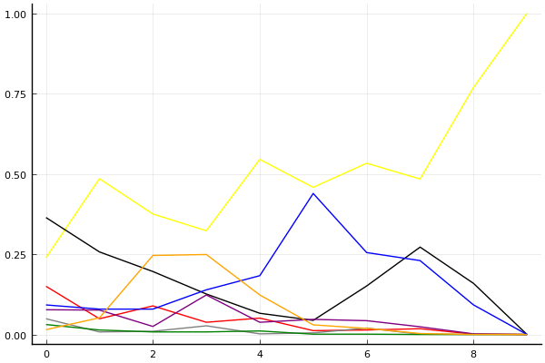
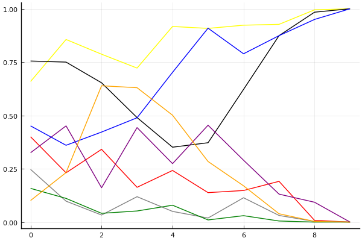
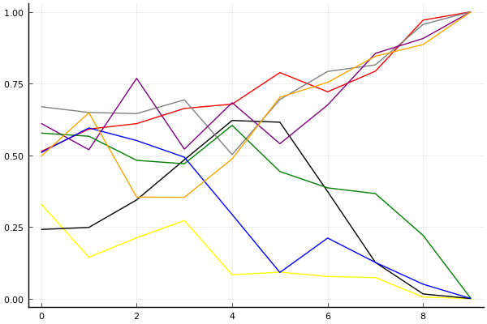

2017 Kespa Cup 개인전 16강 A조

## 경기 결과

| 트랙 | 이재혁 | 김정제 | 이준성 | 임재원 | 황인호 | 김경훈 | 이중선 | 김이준 |
|:---|---:|---:|---:|---:|---:|---:|---:|---:|
| [대저택 은밀한 지하실](../jeotaek) | 10 | 4 | 0 | -1 | 5 | 1 | 3 | 7 |
| [공동묘지 해골 손가락](../haeson) | 3 | 4 | 7 | 1 | -1 | 0 | 5 | 10 |
| [광산 위험한 제련소](../jeryeonso) | 1 | -1 | 0 | 7 | 10 | 4 | 5 | 3 |
| [노르테유 익스프레스](../noex) | 10 | 3 | 5 | -1 | 0 | 4 | 7 | 1 |
| [아이스 설산 다운힐](../seolsan) | 4 | 5 | 1 | 3 | 7 | -1 | 10 | 0 |
| [차이나 서안 병마용](../byeongma) | 3 | 7 | 4 | 10 | 0 | 5 | -1 | 1 |
| [네모 산타의 비밀공간](../santa) | 4 | 10 | 7 | 0 | 3 | 1 | 5 | -1 |
| [포레스트 지그재그](../zigzag) | 10 | 7 | -1 | 3 | 5 | 1 | 4 | 0 |
| [팩토리 미완성 5구역](../district5) | 10 | 0 | 7 | 5 | 3 | 1 | -1 | 4 |
| __total__ |__55__ |__39__ |__30__ |__27__ |__32__ |__16__ |__37__ |__25__ |

## 시뮬레이션

### 1st 확률

x축: 트랙, y축: 확률
1번: 옐로우, 2번: 블랙, 3번: 레드, 4번: 화이트(회색), 5번: 퍼플, 6번: 그린, 7번: 블루, 8번: 오렌지

| 트랙 | 이재혁 | 김정제 | 이준성 | 임재원 | 황인호 | 김경훈 | 이중선 | 김이준 |
|:---|---:|---:|---:|---:|---:|---:|---:|---:|
| 초기 | 0.239 | 0.364 | 0.150 | 0.049 | 0.077 | 0.031 | 0.092 | 0.015 |
| 대저택 은밀한 지하실 | 0.485 | 0.257 | 0.049 | 0.008 | 0.076 | 0.014 | 0.079 | 0.052 |
| 공동묘지 해골 손가락 | 0.375 | 0.196 | 0.089 | 0.010 | 0.025 | 0.008 | 0.079 | 0.246 |
| 광산 위험한 제련소 | 0.323 | 0.126 | 0.038 | 0.027 | 0.123 | 0.008 | 0.139 | 0.249 |
| 노르테유 익스프레스 | 0.545 | 0.066 | 0.051 | 0.002 | 0.038 | 0.011 | 0.183 | 0.123 |
| 아이스 설산 다운힐 | 0.458 | 0.044 | 0.012 | 0.005 | 0.047 | 0.001 | 0.439 | 0.030 |
| 차이나 서안 병마용 | 0.533 | 0.151 | 0.014 | 0.020 | 0.043 | 0.001 | 0.255 | 0.019 |
| 네모 산타의 비밀공간 | 0.484 | 0.272 | 0.018 | 0.001 | 0.024 | 0.000 | 0.230 | 0.003 |
| 포레스트 지그재그 | 0.769 | 0.159 | 0.001 | 0.000 | 0.002 | 0.000 | 0.092 | 0.000 |
| 팩토리 미완성 5구역 | 1.000 | 0.000 | 0.000 | 0.000 | 0.000 | 0.000 | 0.000 | 0.000 |

### Advance 확률

x축: 트랙, y축: 확률
1번: 옐로우, 2번: 블랙, 3번: 레드, 4번: 화이트(회색), 5번: 퍼플, 6번: 그린, 7번: 블루, 8번: 오렌지

| 트랙 | 이재혁 | 김정제 | 이준성 | 임재원 | 황인호 | 김경훈 | 이중선 | 김이준 |
|:---|---:|---:|---:|---:|---:|---:|---:|---:|
| 초기 | 0.642 | 0.743 | 0.434 | 0.220 | 0.355 | 0.167 | 0.427 | 0.087 |
| 대저택 은밀한 지하실 | 0.851 | 0.745 | 0.221 | 0.110 | 0.379 | 0.105 | 0.413 | 0.266 |
| 공동묘지 해골 손가락 | 0.798 | 0.655 | 0.346 | 0.050 | 0.186 | 0.042 | 0.380 | 0.627 |
| 광산 위험한 제련소 | 0.732 | 0.466 | 0.191 | 0.115 | 0.434 | 0.051 | 0.499 | 0.614 |
| 노르테유 익스프레스 | 0.910 | 0.380 | 0.261 | 0.040 | 0.270 | 0.069 | 0.668 | 0.500 |
| 아이스 설산 다운힐 | 0.914 | 0.377 | 0.113 | 0.029 | 0.439 | 0.010 | 0.901 | 0.312 |
| 차이나 서안 병마용 | 0.915 | 0.605 | 0.134 | 0.128 | 0.288 | 0.025 | 0.799 | 0.189 |
| 네모 산타의 비밀공간 | 0.949 | 0.862 | 0.182 | 0.029 | 0.153 | 0.003 | 0.856 | 0.038 |
| 포레스트 지그재그 | 0.998 | 0.981 | 0.009 | 0.004 | 0.085 | 0.000 | 0.958 | 0.002 |
| 팩토리 미완성 5구역 | 1.000 | 1.000 | 0.000 | 0.000 | 0.000 | 0.000 | 1.000 | 0.000 |

### Repechage 확률

x축: 트랙, y축: 확률
1번: 옐로우, 2번: 블랙, 3번: 레드, 4번: 화이트(회색), 5번: 퍼플, 6번: 그린, 7번: 블루, 8번: 오렌지

| 트랙 | 이재혁 | 김정제 | 이준성 | 임재원 | 황인호 | 김경훈 | 이중선 | 김이준 |
|:---|---:|---:|---:|---:|---:|---:|---:|---:|
| 초기 | 0.349 | 0.255 | 0.482 | 0.673 | 0.590 | 0.608 | 0.540 | 0.482 |
| 대저택 은밀한 지하실 | 0.149 | 0.252 | 0.605 | 0.635 | 0.587 | 0.572 | 0.550 | 0.603 |
| 공동묘지 해골 손가락 | 0.202 | 0.342 | 0.606 | 0.652 | 0.721 | 0.485 | 0.596 | 0.359 |
| 광산 위험한 제련소 | 0.260 | 0.512 | 0.625 | 0.683 | 0.534 | 0.467 | 0.485 | 0.373 |
| 노르테유 익스프레스 | 0.090 | 0.593 | 0.659 | 0.508 | 0.680 | 0.612 | 0.329 | 0.488 |
| 아이스 설산 다운힐 | 0.086 | 0.609 | 0.801 | 0.666 | 0.557 | 0.468 | 0.099 | 0.675 |
| 차이나 서안 병마용 | 0.085 | 0.391 | 0.736 | 0.759 | 0.686 | 0.397 | 0.201 | 0.736 |
| 네모 산타의 비밀공간 | 0.051 | 0.138 | 0.799 | 0.816 | 0.831 | 0.374 | 0.144 | 0.846 |
| 포레스트 지그재그 | 0.002 | 0.019 | 0.965 | 0.952 | 0.915 | 0.219 | 0.042 | 0.901 |
| 팩토리 미완성 5구역 | 0.000 | 0.000 | 1.000 | 1.000 | 1.000 | 0.000 | 0.000 | 1.000 |

## 랭킹 변동

### [전체 랭킹](../singles-full)

| 순위 | 변동 | 이름 | 점수 | 변동 | mu | 변동 | sigma | 변동 |
|---:|---:|:---:|---:|---:|---:|---:|---:|---:|
| 6 / 53 | -1 | [김정제](../gimjeongje) | 3166 | -10 | 3428 | -24 | 87 | -4 |
| 8 / 53 | +0 | [이재혁](../ijaehyeok) | 3162 | +84 | 3461 | +54 | 100 | -10 |
| 11 / 53 | +0 | [이중선](../ijungseon) | 2966 | +48 | 3283 | +4 | 105 | -15 |
| 12 / 53 | +1 | [황인호](../hwanginho) | 2901 | +46 | 3226 | -5 | 108 | -17 |
| 15 / 53 | +7 | [이준성](../ijunseong) | 2781 | +202 | 3225 | -28 | 148 | -77 |
| 16 / 53 | +0 | [임재원](../imjaewon) | 2772 | +64 | 3140 | -24 | 123 | -30 |
| 23 / 53 | +6 | [김경훈](../gimgyeonghun) | 2580 | +200 | 3020 | -27 | 147 | -76 |
| 24 / 53 | +12 | [김이준](../gimijun) | 2566 | +402 | 3030 | +116 | 155 | -95 |

### 시즌 랭킹

| 순위 | 변동 | 이름 | 점수 | 변동 | mu | 변동 | sigma | 변동 |
|---:|---:|:---:|---:|---:|---:|---:|---:|---:|
| 1 / 32 | +0 | [이재혁](../ijaehyeok) | 3281 | -70 | 3866 | -945 | 195 | -292 |
| 2 / 32 | +2 | [김정제](../gimjeongje) | 3091 | +124 | 3568 | -191 | 159 | -105 |
| 5 / 32 | +1 | [이준성](../ijunseong) | 2913 | +225 | 3369 | -31 | 152 | -85 |
| 6 / 32 | +14 | [이중선](../ijungseon) | 2820 | +671 | 3308 | +321 | 163 | -117 |
| 7 / 32 | +0 | [임재원](../imjaewon) | 2807 | +195 | 3262 | -39 | 152 | -78 |
| 8 / 32 | +10 | [황인호](../hwanginho) | 2778 | +583 | 3266 | +228 | 163 | -118 |
| 10 / 32 | +0 | [김경훈](../gimgyeonghun) | 2700 | +204 | 3150 | -40 | 150 | -81 |
| 11 / 32 | +6 | [김이준](../gimijun) | 2682 | +475 | 3161 | +157 | 160 | -106 |

### 트랙 별 랭킹

#### [공동묘지 해골 손가락](../haeson)

| 순위 | 변동 | 이름 | 점수 | 변동 | mu | 변동 | sigma | 변동 |
|:---:|:---:|:---:|---:|---:|---:|---:|---:|---:|
| 1 / 8 | NaN | [김이준](../gimijun) | 2161 | +2161 | 4274 | +1274 | 704 | -296 |
| 2 / 8 | NaN | [이준성](../ijunseong) | 1887 | +1887 | 3763 | +763 | 625 | -375 |
| 3 / 8 | NaN | [이중선](../ijungseon) | 1622 | +1622 | 3423 | +423 | 600 | -400 |
| 4 / 8 | NaN | [김정제](../gimjeongje) | 1363 | +1363 | 3137 | +137 | 591 | -409 |
| 5 / 8 | NaN | [이재혁](../ijaehyeok) | 1090 | +1090 | 2863 | -137 | 591 | -409 |
| 6 / 8 | NaN | [임재원](../imjaewon) | 776 | +776 | 2577 | -423 | 600 | -400 |
| 7 / 8 | NaN | [김경훈](../gimgyeonghun) | 361 | +361 | 2237 | -763 | 625 | -375 |
| 8 / 8 | NaN | [황인호](../hwanginho) | -388 | -388 | 1726 | -1274 | 704 | -296 |

#### [광산 위험한 제련소](../jeryeonso)

| 순위 | 변동 | 이름 | 점수 | 변동 | mu | 변동 | sigma | 변동 |
|:---:|:---:|:---:|---:|---:|---:|---:|---:|---:|
| 1 / 28 | +3 | [임재원](../imjaewon) | 2546 | +659 | 3996 | +233 | 484 | -142 |
| 2 / 28 | NaN | [황인호](../hwanginho) | 2375 | +2375 | 4391 | +1391 | 672 | -328 |
| 6 / 28 | +4 | [김경훈](../gimgyeonghun) | 1945 | +583 | 3288 | +152 | 448 | -144 |
| 7 / 28 | NaN | [이중선](../ijungseon) | 1893 | +1893 | 3585 | +585 | 564 | -436 |
| 12 / 28 | -3 | [이준성](../ijunseong) | 1513 | -109 | 2888 | -536 | 458 | -142 |
| 13 / 28 | NaN | [김이준](../gimijun) | 1427 | +1427 | 3083 | +83 | 552 | -448 |
| 16 / 28 | NaN | [이재혁](../ijaehyeok) | 1188 | +1188 | 2853 | -147 | 555 | -445 |
| 19 / 28 | -5 | [김정제](../gimjeongje) | 896 | -193 | 2354 | -510 | 486 | -106 |

#### [네모 산타의 비밀공간](../santa)

| 순위 | 변동 | 이름 | 점수 | 변동 | mu | 변동 | sigma | 변동 |
|:---:|:---:|:---:|---:|---:|---:|---:|---:|---:|
| 3 / 35 | +5 | [김정제](../gimjeongje) | 2374 | +255 | 3131 | +203 | 252 | -17 |
| 8 / 35 | +6 | [이준성](../ijunseong) | 2169 | +534 | 3424 | +121 | 418 | -138 |
| 11 / 35 | -1 | [황인호](../hwanginho) | 2011 | -28 | 3142 | -323 | 377 | -98 |
| 13 / 35 | +2 | [이재혁](../ijaehyeok) | 1837 | +260 | 2769 | +116 | 311 | -48 |
| 16 / 35 | NaN | [이중선](../ijungseon) | 1636 | +1636 | 3201 | +201 | 522 | -478 |
| 23 / 35 | +0 | [김경훈](../gimgyeonghun) | 1395 | +201 | 2658 | -212 | 421 | -138 |
| 27 / 35 | -1 | [임재원](../imjaewon) | 1023 | +72 | 2346 | -301 | 441 | -124 |
| 33 / 35 | NaN | [김이준](../gimijun) | -240 | -240 | 1772 | -1228 | 671 | -329 |

#### [노르테유 익스프레스](../noex)

| 순위 | 변동 | 이름 | 점수 | 변동 | mu | 변동 | sigma | 변동 |
|:---:|:---:|:---:|---:|---:|---:|---:|---:|---:|
| 1 / 53 | +4 | [이재혁](../ijaehyeok) | 3033 | +754 | 4725 | +374 | 564 | -127 |
| 4 / 53 | +9 | [이중선](../ijungseon) | 2494 | +561 | 3524 | +392 | 343 | -56 |
| 5 / 53 | +5 | [김경훈](../gimgyeonghun) | 2430 | +391 | 3739 | -131 | 436 | -174 |
| 7 / 53 | +16 | [이준성](../ijunseong) | 2351 | +764 | 3620 | +321 | 423 | -148 |
| 8 / 53 | -4 | [김정제](../gimjeongje) | 2350 | +64 | 3742 | -615 | 464 | -226 |
| 14 / 53 | +4 | [김이준](../gimijun) | 1987 | +190 | 3289 | -258 | 434 | -149 |
| 19 / 53 | -7 | [임재원](../imjaewon) | 1648 | -287 | 2856 | -491 | 403 | -68 |
| 33 / 53 | +10 | [황인호](../hwanginho) | 1215 | +614 | 2583 | +148 | 456 | -155 |

#### [대저택 은밀한 지하실](../jeotaek)

| 순위 | 변동 | 이름 | 점수 | 변동 | mu | 변동 | sigma | 변동 |
|:---:|:---:|:---:|---:|---:|---:|---:|---:|---:|
| 4 / 53 | +3 | [이재혁](../ijaehyeok) | 2825 | +626 | 4585 | +295 | 587 | -110 |
| 9 / 53 | +2 | [김정제](../gimjeongje) | 2158 | +171 | 3573 | -547 | 472 | -239 |
| 10 / 53 | +14 | [황인호](../hwanginho) | 2100 | +632 | 3382 | +208 | 427 | -141 |
| 13 / 53 | +1 | [이중선](../ijungseon) | 2002 | +163 | 2986 | +3 | 328 | -53 |
| 16 / 53 | +30 | [김이준](../gimijun) | 1842 | +1407 | 3211 | +935 | 456 | -157 |
| 26 / 53 | +5 | [김경훈](../gimgyeonghun) | 1538 | +255 | 2809 | -162 | 424 | -139 |
| 33 / 53 | +7 | [이준성](../ijunseong) | 1114 | +255 | 2418 | -138 | 435 | -131 |
| 37 / 53 | -5 | [임재원](../imjaewon) | 1011 | -203 | 2284 | -433 | 424 | -77 |

#### [아이스 설산 다운힐](../seolsan)

| 순위 | 변동 | 이름 | 점수 | 변동 | mu | 변동 | sigma | 변동 |
|:---:|:---:|:---:|---:|---:|---:|---:|---:|---:|
| 1 / 16 | NaN | [이중선](../ijungseon) | 2161 | +2161 | 4274 | +1274 | 704 | -296 |
| 4 / 16 | NaN | [황인호](../hwanginho) | 1887 | +1887 | 3763 | +763 | 625 | -375 |
| 5 / 16 | NaN | [김정제](../gimjeongje) | 1622 | +1622 | 3423 | +423 | 600 | -400 |
| 8 / 16 | NaN | [이재혁](../ijaehyeok) | 1363 | +1363 | 3137 | +137 | 591 | -409 |
| 10 / 16 | NaN | [임재원](../imjaewon) | 1090 | +1090 | 2863 | -137 | 591 | -409 |
| 12 / 16 | NaN | [이준성](../ijunseong) | 776 | +776 | 2577 | -423 | 600 | -400 |
| 13 / 16 | NaN | [김이준](../gimijun) | 361 | +361 | 2237 | -763 | 625 | -375 |
| 15 / 16 | NaN | [김경훈](../gimgyeonghun) | -388 | -388 | 1726 | -1274 | 704 | -296 |

#### [차이나 서안 병마용](../byeongma)

| 순위 | 변동 | 이름 | 점수 | 변동 | mu | 변동 | sigma | 변동 |
|:---:|:---:|:---:|---:|---:|---:|---:|---:|---:|
| 1 / 39 | +2 | [김정제](../gimjeongje) | 2597 | +171 | 3347 | +109 | 250 | -21 |
| 4 / 39 | +12 | [임재원](../imjaewon) | 2417 | +845 | 3767 | +520 | 450 | -108 |
| 5 / 39 | -1 | [이재혁](../ijaehyeok) | 2376 | -33 | 3360 | -207 | 328 | -58 |
| 8 / 39 | +1 | [이준성](../ijunseong) | 2177 | +159 | 3539 | -536 | 454 | -232 |
| 14 / 39 | -2 | [황인호](../hwanginho) | 1800 | -118 | 2799 | -263 | 333 | -48 |
| 15 / 39 | +14 | [김경훈](../gimgyeonghun) | 1776 | +1036 | 3043 | +551 | 422 | -162 |
| 22 / 39 | +8 | [김이준](../gimijun) | 1281 | +588 | 2564 | +135 | 428 | -151 |
| 34 / 39 | +0 | [이중선](../ijungseon) | 279 | -19 | 1813 | -304 | 512 | -95 |

#### [팩토리 미완성 5구역](../district5)

| 순위 | 변동 | 이름 | 점수 | 변동 | mu | 변동 | sigma | 변동 |
|:---:|:---:|:---:|---:|---:|---:|---:|---:|---:|
| 3 / 52 | +9 | [이재혁](../ijaehyeok) | 2899 | +948 | 4558 | +519 | 553 | -143 |
| 4 / 52 | +16 | [이준성](../ijunseong) | 2499 | +850 | 3830 | +450 | 444 | -133 |
| 6 / 52 | +10 | [임재원](../imjaewon) | 2434 | +568 | 3739 | +114 | 435 | -151 |
| 9 / 52 | +16 | [김이준](../gimijun) | 2117 | +607 | 3380 | +175 | 421 | -144 |
| 11 / 52 | -5 | [김경훈](../gimgyeonghun) | 2067 | -29 | 3384 | -544 | 439 | -172 |
| 18 / 52 | +13 | [황인호](../hwanginho) | 1868 | +599 | 3129 | +160 | 420 | -146 |
| 20 / 52 | -9 | [이중선](../ijungseon) | 1793 | -186 | 2816 | -308 | 341 | -41 |
| 30 / 52 | +3 | [김정제](../gimjeongje) | 1402 | +385 | 2730 | -82 | 443 | -156 |

#### [포레스트 지그재그](../zigzag)

| 순위 | 변동 | 이름 | 점수 | 변동 | mu | 변동 | sigma | 변동 |
|:---:|:---:|:---:|---:|---:|---:|---:|---:|---:|
| 1 / 32 | +2 | [이재혁](../ijaehyeok) | 3175 | +1014 | 4862 | +588 | 562 | -142 |
| 2 / 32 | +0 | [김정제](../gimjeongje) | 2909 | +748 | 4445 | +171 | 512 | -192 |
| 3 / 32 | +8 | [황인호](../hwanginho) | 2436 | +814 | 3787 | +364 | 450 | -150 |
| 4 / 32 | +1 | [이중선](../ijungseon) | 2370 | +483 | 3729 | -34 | 453 | -172 |
| 7 / 32 | +3 | [임재원](../imjaewon) | 2067 | +445 | 3393 | -31 | 442 | -159 |
| 10 / 32 | +3 | [김이준](../gimijun) | 1683 | +96 | 2971 | -279 | 430 | -125 |
| 13 / 32 | +8 | [김경훈](../gimgyeonghun) | 1514 | +738 | 2843 | +266 | 443 | -157 |
| 14 / 32 | -7 | [이준성](../ijunseong) | 1454 | -433 | 2904 | -859 | 483 | -142 |
