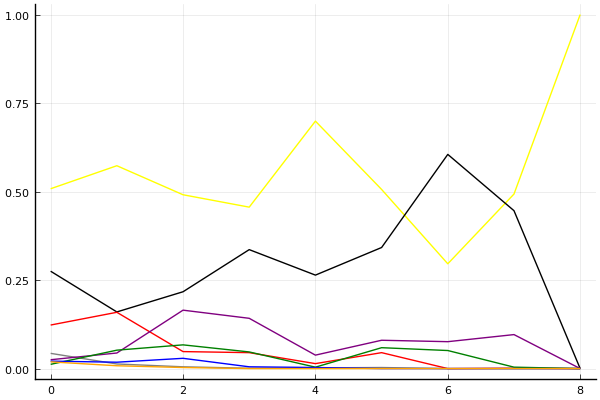
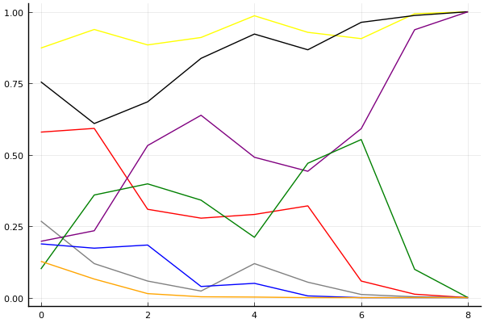
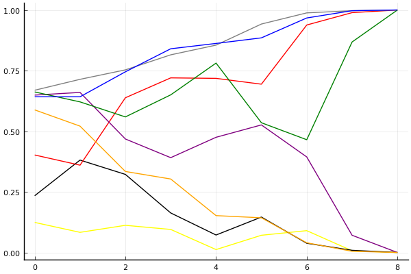

2017 Kespa Cup 개인전 16강 B조

## 경기 결과

| 트랙 | 유영혁 | 문호준 | 전대웅 | 박인수 | 김승래 | 손우현 | 한승철 | 사상훈 |
|:---|---:|---:|---:|---:|---:|---:|---:|---:|
| [대저택 은밀한 지하실](../jeotaek) | 7 | 1 | 5 | -1 | 4 | 10 | 3 | 0 |
| [공동묘지 해골 손가락](../haeson) | 3 | 7 | 0 | 1 | 10 | 5 | 4 | -1 |
| [광산 위험한 제련소](../jeryeonso) | 7 | 10 | 4 | 1 | 5 | 3 | -1 | 0 |
| [노르테유 익스프레스](../noex) | 10 | 5 | 3 | 10 | 0 | -1 | 4 | 1 |
| [아이스 설산 다운힐](../seolsan) | 1 | 4 | 7 | 3 | 5 | 10 | -1 | 0 |
| [차이나 서안 병마용](../byeongma) | 4 | 10 | 0 | 3 | 7 | 5 | 1 | -1 |
| [네모 산타의 비밀공간](../santa) | 10 | 5 | 4 | 3 | 7 | 0 | 1 | -1 |
| [포레스트 지그재그](../zigzag) | 10 | 7 | 5 | 1 | -1 | 3 | 4 | 0 |
| __total__ |__52__ |__49__ |__28__ |__21__ |__37__ |__35__ |__15__ |__-2__ |

## 시뮬레이션

### 1st 확률

x축: 트랙, y축: 확률
1번: 옐로우, 2번: 블랙, 3번: 레드, 4번: 화이트(회색), 5번: 퍼플, 6번: 그린, 7번: 블루, 8번: 오렌지

| 트랙 | 유영혁 | 문호준 | 전대웅 | 박인수 | 김승래 | 손우현 | 한승철 | 사상훈 |
|:---|---:|---:|---:|---:|---:|---:|---:|---:|
| 초기 | 0.508 | 0.275 | 0.123 | 0.043 | 0.025 | 0.012 | 0.021 | 0.019 |
| 대저택 은밀한 지하실 | 0.573 | 0.160 | 0.159 | 0.013 | 0.044 | 0.052 | 0.018 | 0.008 |
| 공동묘지 해골 손가락 | 0.491 | 0.217 | 0.048 | 0.005 | 0.165 | 0.067 | 0.029 | 0.003 |
| 광산 위험한 제련소 | 0.456 | 0.336 | 0.045 | 0.001 | 0.142 | 0.047 | 0.005 | 0.000 |
| 노르테유 익스프레스 | 0.699 | 0.264 | 0.014 | 0.002 | 0.038 | 0.004 | 0.003 | 0.000 |
| 아이스 설산 다운힐 | 0.506 | 0.342 | 0.045 | 0.003 | 0.080 | 0.059 | 0.000 | 0.000 |
| 차이나 서안 병마용 | 0.296 | 0.605 | 0.000 | 0.000 | 0.076 | 0.051 | 0.000 | 0.000 |
| 네모 산타의 비밀공간 | 0.493 | 0.446 | 0.001 | 0.000 | 0.096 | 0.004 | 0.000 | 0.000 |
| 포레스트 지그재그 | 1.000 | 0.000 | 0.000 | 0.000 | 0.000 | 0.000 | 0.000 | 0.000 |

### Advance 확률

x축: 트랙, y축: 확률
1번: 옐로우, 2번: 블랙, 3번: 레드, 4번: 화이트(회색), 5번: 퍼플, 6번: 그린, 7번: 블루, 8번: 오렌지

| 트랙 | 유영혁 | 문호준 | 전대웅 | 박인수 | 김승래 | 손우현 | 한승철 | 사상훈 |
|:---|---:|---:|---:|---:|---:|---:|---:|---:|
| 초기 | 0.876 | 0.765 | 0.583 | 0.276 | 0.185 | 0.113 | 0.171 | 0.117 |
| 대저택 은밀한 지하실 | 0.916 | 0.608 | 0.632 | 0.127 | 0.229 | 0.334 | 0.165 | 0.061 |
| 공동묘지 해골 손가락 | 0.887 | 0.675 | 0.352 | 0.060 | 0.520 | 0.422 | 0.164 | 0.018 |
| 광산 위험한 제련소 | 0.905 | 0.837 | 0.276 | 0.025 | 0.608 | 0.349 | 0.041 | 0.003 |
| 노르테유 익스프레스 | 0.988 | 0.928 | 0.278 | 0.115 | 0.525 | 0.212 | 0.050 | 0.001 |
| 아이스 설산 다운힐 | 0.929 | 0.854 | 0.306 | 0.050 | 0.474 | 0.465 | 0.004 | 0.000 |
| 차이나 서안 병마용 | 0.910 | 0.962 | 0.062 | 0.012 | 0.606 | 0.535 | 0.000 | 0.000 |
| 네모 산타의 비밀공간 | 0.993 | 0.991 | 0.011 | 0.003 | 0.929 | 0.132 | 0.000 | 0.000 |
| 포레스트 지그재그 | 1.000 | 1.000 | 0.000 | 0.000 | 1.000 | 0.000 | 0.000 | 0.000 |

### Repechage 확률

x축: 트랙, y축: 확률
1번: 옐로우, 2번: 블랙, 3번: 레드, 4번: 화이트(회색), 5번: 퍼플, 6번: 그린, 7번: 블루, 8번: 오렌지

| 트랙 | 유영혁 | 문호준 | 전대웅 | 박인수 | 김승래 | 손우현 | 한승철 | 사상훈 |
|:---|---:|---:|---:|---:|---:|---:|---:|---:|
| 초기 | 0.124 | 0.234 | 0.402 | 0.669 | 0.649 | 0.662 | 0.642 | 0.588 |
| 대저택 은밀한 지하실 | 0.083 | 0.381 | 0.360 | 0.714 | 0.660 | 0.621 | 0.642 | 0.521 |
| 공동묘지 해골 손가락 | 0.112 | 0.322 | 0.638 | 0.753 | 0.468 | 0.559 | 0.745 | 0.334 |
| 광산 위험한 제련소 | 0.095 | 0.163 | 0.720 | 0.815 | 0.391 | 0.650 | 0.840 | 0.303 |
| 노르테유 익스프레스 | 0.012 | 0.072 | 0.718 | 0.855 | 0.475 | 0.781 | 0.862 | 0.152 |
| 아이스 설산 다운힐 | 0.071 | 0.146 | 0.694 | 0.942 | 0.526 | 0.535 | 0.885 | 0.143 |
| 차이나 서안 병마용 | 0.090 | 0.038 | 0.938 | 0.988 | 0.394 | 0.465 | 0.967 | 0.040 |
| 네모 산타의 비밀공간 | 0.007 | 0.009 | 0.989 | 0.997 | 0.071 | 0.868 | 0.997 | 0.005 |
| 포레스트 지그재그 | 0.000 | 0.000 | 1.000 | 1.000 | 0.000 | 1.000 | 1.000 | 0.000 |

## 랭킹 변동

### [전체 랭킹](../singles-full)

| 순위 | 변동 | 이름 | 점수 | 변동 | mu | 변동 | sigma | 변동 |
|---:|---:|:---:|---:|---:|---:|---:|---:|---:|
| 1 / 53 | +0 | [유영혁](../yuyeonghyeok) | 3393 | +19 | 3639 | +15 | 82 | -2 |
| 3 / 53 | +0 | [문호준](../munhojun) | 3300 | +49 | 3559 | +39 | 86 | -3 |
| 8 / 53 | -3 | [전대웅](../jeondaewoong) | 3159 | -13 | 3403 | -19 | 81 | -2 |
| 11 / 53 | -1 | [박인수](../bakinsu) | 2960 | -13 | 3235 | -31 | 92 | -6 |
| 13 / 53 | +9 | [김승래](../gimseungrae) | 2888 | +300 | 3320 | +146 | 144 | -51 |
| 16 / 53 | +5 | [손우현](../sonuhyeon) | 2822 | +194 | 3196 | +114 | 125 | -27 |
| 23 / 53 | +4 | [한승철](../hanseungcheol) | 2614 | +136 | 3067 | -62 | 151 | -66 |
| 29 / 53 | -4 | [사상훈](../sasanghun) | 2412 | -96 | 2848 | -234 | 145 | -46 |

### 시즌 랭킹

| 순위 | 변동 | 이름 | 점수 | 변동 | mu | 변동 | sigma | 변동 |
|---:|---:|:---:|---:|---:|---:|---:|---:|---:|
| 2 / 32 | +2 | [문호준](../munhojun) | 3257 | +284 | 3745 | +30 | 163 | -85 |
| 3 / 32 | +0 | [유영혁](../yuyeonghyeok) | 3252 | +270 | 3750 | -12 | 166 | -94 |
| 6 / 32 | +6 | [김승래](../gimseungrae) | 2908 | +327 | 3353 | +155 | 148 | -57 |
| 7 / 32 | +2 | [전대웅](../jeondaewoong) | 2895 | +173 | 3336 | -8 | 147 | -60 |
| 9 / 32 | +5 | [손우현](../sonuhyeon) | 2810 | +329 | 3257 | +158 | 149 | -57 |
| 13 / 32 | +2 | [박인수](../bakinsu) | 2686 | +218 | 3166 | -51 | 160 | -90 |
| 15 / 32 | +1 | [한승철](../hanseungcheol) | 2590 | +180 | 3058 | -44 | 156 | -75 |
| 17 / 32 | -4 | [사상훈](../sasanghun) | 2399 | -111 | 2847 | -264 | 149 | -51 |

### 트랙 별 랭킹

#### [공동묘지 해골 손가락](../haeson)

| 순위 | 변동 | 이름 | 점수 | 변동 | mu | 변동 | sigma | 변동 |
|:---:|:---:|:---:|---:|---:|---:|---:|---:|---:|
| 2 / 16 | NaN | [김승래](../gimseungrae) | 2161 | +2161 | 4274 | +1274 | 704 | -296 |
| 3 / 16 | NaN | [문호준](../munhojun) | 1887 | +1887 | 3763 | +763 | 625 | -375 |
| 5 / 16 | NaN | [손우현](../sonuhyeon) | 1622 | +1622 | 3423 | +423 | 600 | -400 |
| 7 / 16 | NaN | [한승철](../hanseungcheol) | 1363 | +1363 | 3137 | +137 | 591 | -409 |
| 10 / 16 | NaN | [유영혁](../yuyeonghyeok) | 1090 | +1090 | 2863 | -137 | 591 | -409 |
| 12 / 16 | NaN | [박인수](../bakinsu) | 776 | +776 | 2577 | -423 | 600 | -400 |
| 13 / 16 | NaN | [전대웅](../jeondaewoong) | 361 | +361 | 2237 | -763 | 625 | -375 |
| 15 / 16 | NaN | [사상훈](../sasanghun) | -388 | -388 | 1726 | -1274 | 704 | -296 |

#### [광산 위험한 제련소](../jeryeonso)

| 순위 | 변동 | 이름 | 점수 | 변동 | mu | 변동 | sigma | 변동 |
|:---:|:---:|:---:|---:|---:|---:|---:|---:|---:|
| 1 / 28 | +3 | [문호준](../munhojun) | 3072 | +911 | 4779 | +505 | 569 | -135 |
| 2 / 28 | +6 | [유영혁](../yuyeonghyeok) | 2676 | +789 | 4116 | +354 | 480 | -145 |
| 4 / 28 | +5 | [김승래](../gimseungrae) | 2452 | +565 | 3859 | +96 | 469 | -156 |
| 6 / 28 | -3 | [전대웅](../jeondaewoong) | 2292 | +132 | 3786 | -488 | 498 | -207 |
| 12 / 28 | +5 | [손우현](../sonuhyeon) | 1559 | +469 | 2931 | +67 | 457 | -134 |
| 19 / 28 | +1 | [사상훈](../sasanghun) | 907 | +131 | 2298 | -279 | 464 | -137 |
| 22 / 28 | +6 | [박인수](../bakinsu) | 721 | +1108 | 2216 | +491 | 499 | -206 |
| 23 / 28 | -2 | [한승철](../hanseungcheol) | 531 | -245 | 2003 | -574 | 491 | -110 |

#### [네모 산타의 비밀공간](../santa)

| 순위 | 변동 | 이름 | 점수 | 변동 | mu | 변동 | sigma | 변동 |
|:---:|:---:|:---:|---:|---:|---:|---:|---:|---:|
| 2 / 35 | +4 | [문호준](../munhojun) | 2447 | +191 | 3434 | -11 | 329 | -67 |
| 3 / 35 | +1 | [전대웅](../jeondaewoong) | 2428 | +92 | 3200 | +6 | 257 | -29 |
| 4 / 35 | +5 | [유영혁](../yuyeonghyeok) | 2417 | +251 | 3134 | +200 | 239 | -17 |
| 9 / 35 | +16 | [김승래](../gimseungrae) | 2024 | +913 | 3251 | +459 | 409 | -151 |
| 12 / 35 | -10 | [손우현](../sonuhyeon) | 1965 | -480 | 3315 | -1149 | 450 | -223 |
| 14 / 35 | +3 | [박인수](../bakinsu) | 1825 | +287 | 2719 | +144 | 298 | -47 |
| 15 / 35 | +4 | [한승철](../hanseungcheol) | 1782 | +283 | 2973 | -130 | 397 | -138 |
| 16 / 35 | -9 | [사상훈](../sasanghun) | 1702 | -525 | 3043 | -964 | 447 | -146 |

#### [노르테유 익스프레스](../noex)

| 순위 | 변동 | 이름 | 점수 | 변동 | mu | 변동 | sigma | 변동 |
|:---:|:---:|:---:|---:|---:|---:|---:|---:|---:|
| 1 / 53 | +1 | [문호준](../munhojun) | 3132 | +102 | 4221 | -159 | 363 | -87 |
| 3 / 53 | +0 | [전대웅](../jeondaewoong) | 2843 | -60 | 3892 | -276 | 350 | -72 |
| 4 / 53 | +5 | [박인수](../bakinsu) | 2808 | +571 | 3936 | +283 | 376 | -96 |
| 5 / 53 | +7 | [유영혁](../yuyeonghyeok) | 2620 | +551 | 3601 | +383 | 327 | -56 |
| 8 / 53 | +9 | [한승철](../hanseungcheol) | 2422 | +555 | 3657 | +121 | 412 | -145 |
| 15 / 53 | +8 | [사상훈](../sasanghun) | 1920 | +302 | 3189 | -90 | 423 | -131 |
| 18 / 53 | -8 | [손우현](../sonuhyeon) | 1858 | -367 | 3024 | -551 | 389 | -61 |
| 41 / 53 | +10 | [김승래](../gimseungrae) | 920 | +1184 | 2396 | +540 | 492 | -215 |

#### [대저택 은밀한 지하실](../jeotaek)

| 순위 | 변동 | 이름 | 점수 | 변동 | mu | 변동 | sigma | 변동 |
|:---:|:---:|:---:|---:|---:|---:|---:|---:|---:|
| 1 / 53 | +0 | [유영혁](../yuyeonghyeok) | 3405 | +144 | 4445 | -2 | 347 | -49 |
| 2 / 53 | +1 | [손우현](../sonuhyeon) | 3373 | +543 | 4686 | +329 | 438 | -71 |
| 5 / 53 | +1 | [전대웅](../jeondaewoong) | 2641 | +315 | 3613 | +173 | 324 | -47 |
| 7 / 53 | +0 | [김승래](../gimseungrae) | 2475 | +235 | 3760 | -213 | 428 | -149 |
| 15 / 53 | +4 | [문호준](../munhojun) | 1934 | +167 | 2870 | +30 | 312 | -45 |
| 19 / 53 | -2 | [사상훈](../sasanghun) | 1782 | -51 | 3032 | -436 | 417 | -128 |
| 22 / 53 | +19 | [한승철](../hanseungcheol) | 1656 | +792 | 2908 | +372 | 417 | -140 |
| 27 / 53 | -5 | [박인수](../bakinsu) | 1486 | -197 | 2692 | -412 | 402 | -72 |

#### [아이스 설산 다운힐](../seolsan)

| 순위 | 변동 | 이름 | 점수 | 변동 | mu | 변동 | sigma | 변동 |
|:---:|:---:|:---:|---:|---:|---:|---:|---:|---:|
| 3 / 20 | +4 | [전대웅](../jeondaewoong) | 2132 | +769 | 3468 | +331 | 445 | -146 |
| 4 / 20 | +2 | [김승래](../gimseungrae) | 2099 | +477 | 3433 | +10 | 445 | -156 |
| 5 / 20 | +6 | [손우현](../sonuhyeon) | 2047 | +1272 | 3454 | +878 | 469 | -131 |
| 8 / 20 | NaN | [문호준](../munhojun) | 1511 | +1511 | 3142 | +142 | 544 | -456 |
| 9 / 20 | -6 | [사상훈](../sasanghun) | 1503 | -384 | 2920 | -843 | 473 | -153 |
| 11 / 20 | NaN | [박인수](../bakinsu) | 1293 | +1293 | 2939 | -61 | 548 | -452 |
| 14 / 20 | NaN | [유영혁](../yuyeonghyeok) | 1064 | +1064 | 2730 | -270 | 555 | -445 |
| 18 / 20 | NaN | [한승철](../hanseungcheol) | -144 | -144 | 1934 | -1066 | 692 | -308 |

#### [차이나 서안 병마용](../byeongma)

| 순위 | 변동 | 이름 | 점수 | 변동 | mu | 변동 | sigma | 변동 |
|:---:|:---:|:---:|---:|---:|---:|---:|---:|---:|
| 2 / 39 | +0 | [유영혁](../yuyeonghyeok) | 2569 | +53 | 3291 | -15 | 241 | -23 |
| 3 / 39 | +8 | [문호준](../munhojun) | 2449 | +478 | 3479 | +331 | 343 | -49 |
| 7 / 39 | +0 | [박인수](../bakinsu) | 2320 | +65 | 3207 | -72 | 296 | -46 |
| 8 / 39 | -5 | [전대웅](../jeondaewoong) | 2316 | -115 | 3123 | -196 | 269 | -27 |
| 12 / 39 | +13 | [손우현](../sonuhyeon) | 1941 | +780 | 3160 | +324 | 406 | -152 |
| 13 / 39 | +15 | [김승래](../gimseungrae) | 1933 | +1046 | 3180 | +594 | 416 | -151 |
| 14 / 39 | -1 | [한승철](../hanseungcheol) | 1932 | +78 | 3134 | -342 | 401 | -140 |
| 31 / 39 | +0 | [사상훈](../sasanghun) | 554 | -6 | 2029 | -270 | 492 | -88 |

#### [포레스트 지그재그](../zigzag)

| 순위 | 변동 | 이름 | 점수 | 변동 | mu | 변동 | sigma | 변동 |
|:---:|:---:|:---:|---:|---:|---:|---:|---:|---:|
| 2 / 32 | +4 | [유영혁](../yuyeonghyeok) | 3007 | +846 | 4729 | +455 | 574 | -130 |
| 4 / 32 | +4 | [문호준](../munhojun) | 2606 | +719 | 4044 | +281 | 479 | -146 |
| 7 / 32 | +4 | [전대웅](../jeondaewoong) | 2268 | +646 | 3620 | +196 | 451 | -150 |
| 10 / 32 | +6 | [한승철](../hanseungcheol) | 1963 | +601 | 3282 | +145 | 440 | -152 |
| 11 / 32 | +4 | [손우현](../sonuhyeon) | 1782 | +419 | 3095 | -42 | 438 | -154 |
| 17 / 32 | -8 | [김승래](../gimseungrae) | 1322 | -565 | 2757 | -1006 | 478 | -147 |
| 18 / 32 | +0 | [사상훈](../sasanghun) | 1293 | +204 | 2627 | -236 | 445 | -147 |
| 19 / 32 | +9 | [박인수](../bakinsu) | 1183 | +822 | 2539 | +302 | 452 | -173 |
