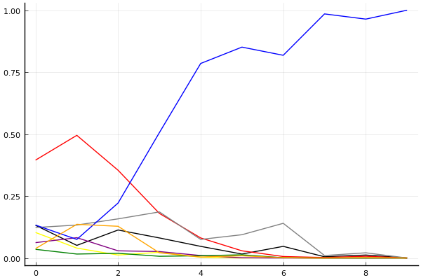
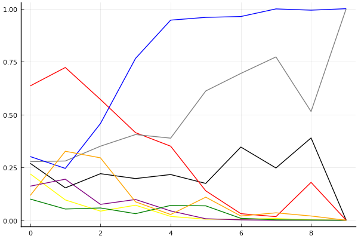

2017 Kespa Cup 개인전 16강 패자부활전

## 경기 결과

| 트랙 | 손우현 | 황인호 | 전대웅 | 이준성 | 임재원 | 김이준 | 박인수 | 한승철 |
|:---|---:|---:|---:|---:|---:|---:|---:|---:|
| [대저택 은밀한 지하실](../jeotaek) | -1 | 0 | 7 | 4 | 5 | 1 | 3 | 10 |
| [공동묘지 해골 손가락](../haeson) | 0 | 7 | 1 | 5 | -1 | 4 | 10 | 3 |
| [광산 위험한 제련소](../jeryeonso) | 7 | 3 | 1 | 5 | 4 | 0 | 10 | -5 |
| [노르테유 익스프레스](../noex) | -1 | 5 | 4 | 3 | 1 | 7 | 10 | 0 |
| [아이스 설산 다운힐](../seolsan) | 1 | 3 | 0 | 7 | -1 | 4 | 5 | 10 |
| [차이나 서안 병마용](../byeongma) | 5 | 10 | 3 | 7 | -1 | 0 | 4 | 1 |
| [네모 산타의 비밀공간](../santa) | 10 | 0 | 5 | 1 | -1 | 3 | 7 | 4 |
| [포레스트 지그재그](../zigzag) | 1 | 7 | 10 | 4 | -1 | 3 | 0 | 5 |
| [팩토리 미완성 5구역](../district5) | 7 | 3 | 4 | 5 | -5 | -5 | 10 | -5 |
| __total__ |__29__ |__38__ |__35__ |__41__ |__0__ |__17__ |__59__ |__23__ |

## 시뮬레이션

### 1st 확률

x축: 트랙, y축: 확률
1번: 옐로우, 2번: 블랙, 3번: 레드, 4번: 화이트(회색), 5번: 퍼플, 6번: 그린, 7번: 블루, 8번: 오렌지

| 트랙 | 손우현 | 황인호 | 전대웅 | 이준성 | 임재원 | 김이준 | 박인수 | 한승철 |
|:---|---:|---:|---:|---:|---:|---:|---:|---:|
| 초기 | 0.102 | 0.107 | 0.381 | 0.138 | 0.062 | 0.039 | 0.149 | 0.047 |
| 대저택 은밀한 지하실 | 0.034 | 0.052 | 0.489 | 0.128 | 0.081 | 0.013 | 0.102 | 0.130 |
| 공동묘지 해골 손가락 | 0.014 | 0.085 | 0.336 | 0.171 | 0.028 | 0.024 | 0.241 | 0.128 |
| 광산 위험한 제련소 | 0.023 | 0.064 | 0.177 | 0.184 | 0.031 | 0.007 | 0.515 | 0.024 |
| 노르테유 익스프레스 | 0.000 | 0.039 | 0.067 | 0.083 | 0.006 | 0.008 | 0.810 | 0.002 |
| 아이스 설산 다운힐 | 0.002 | 0.019 | 0.020 | 0.102 | 0.001 | 0.009 | 0.841 | 0.016 |
| 차이나 서안 병마용 | 0.001 | 0.047 | 0.004 | 0.130 | 0.000 | 0.002 | 0.835 | 0.000 |
| 네모 산타의 비밀공간 | 0.000 | 0.003 | 0.001 | 0.004 | 0.000 | 0.000 | 0.990 | 0.002 |
| 포레스트 지그재그 | 0.000 | 0.022 | 0.010 | 0.024 | 0.000 | 0.000 | 0.951 | 0.000 |
| 팩토리 미완성 5구역 | 0.000 | 0.000 | 0.000 | 0.000 | 0.000 | 0.000 | 1.000 | 0.000 |

### Advance 확률

x축: 트랙, y축: 확률
1번: 옐로우, 2번: 블랙, 3번: 레드, 4번: 화이트(회색), 5번: 퍼플, 6번: 그린, 7번: 블루, 8번: 오렌지

| 트랙 | 손우현 | 황인호 | 전대웅 | 이준성 | 임재원 | 김이준 | 박인수 | 한승철 |
|:---|---:|---:|---:|---:|---:|---:|---:|---:|
| 초기 | 0.219 | 0.269 | 0.635 | 0.277 | 0.161 | 0.100 | 0.301 | 0.117 |
| 대저택 은밀한 지하실 | 0.096 | 0.153 | 0.722 | 0.280 | 0.194 | 0.053 | 0.245 | 0.326 |
| 공동묘지 해골 손가락 | 0.043 | 0.220 | 0.571 | 0.350 | 0.075 | 0.058 | 0.457 | 0.295 |
| 광산 위험한 제련소 | 0.071 | 0.197 | 0.414 | 0.405 | 0.098 | 0.031 | 0.765 | 0.087 |
| 노르테유 익스프레스 | 0.018 | 0.216 | 0.350 | 0.388 | 0.044 | 0.070 | 0.946 | 0.027 |
| 아이스 설산 다운힐 | 0.005 | 0.174 | 0.139 | 0.611 | 0.007 | 0.068 | 0.959 | 0.109 |
| 차이나 서안 병마용 | 0.005 | 0.346 | 0.031 | 0.694 | 0.002 | 0.009 | 0.963 | 0.020 |
| 네모 산타의 비밀공간 | 0.008 | 0.247 | 0.017 | 0.772 | 0.000 | 0.002 | 0.999 | 0.035 |
| 포레스트 지그재그 | 0.002 | 0.389 | 0.179 | 0.514 | 0.000 | 0.001 | 0.993 | 0.020 |
| 팩토리 미완성 5구역 | 0.000 | 0.000 | 0.000 | 1.000 | 0.000 | 0.000 | 1.000 | 0.000 |

## 랭킹 변동

### [전체 랭킹](../singles-full)

| 순위 | 변동 | 이름 | 점수 | 변동 | mu | 변동 | sigma | 변동 |
|---:|---:|:---:|---:|---:|---:|---:|---:|---:|
| 8 / 53 | +0 | [전대웅](../jeondaewoong) | 3137 | -22 | 3376 | -27 | 80 | -2 |
| 9 / 53 | +2 | [박인수](../bakinsu) | 3051 | +91 | 3314 | +79 | 88 | -4 |
| 12 / 53 | +0 | [황인호](../hwanginho) | 2947 | +46 | 3240 | +15 | 98 | -10 |
| 13 / 53 | +4 | [이준성](../ijunseong) | 2928 | +147 | 3284 | +59 | 119 | -29 |
| 16 / 53 | +0 | [손우현](../sonuhyeon) | 2852 | +30 | 3177 | -19 | 108 | -16 |
| 18 / 53 | +5 | [한승철](../hanseungcheol) | 2749 | +135 | 3114 | +47 | 122 | -29 |
| 21 / 53 | +4 | [김이준](../gimijun) | 2678 | +112 | 3044 | +14 | 122 | -33 |
| 23 / 53 | -5 | [임재원](../imjaewon) | 2659 | -113 | 2983 | -158 | 108 | -15 |

### 시즌 랭킹

| 순위 | 변동 | 이름 | 점수 | 변동 | mu | 변동 | sigma | 변동 |
|---:|---:|:---:|---:|---:|---:|---:|---:|---:|
| 5 / 32 | +0 | [이준성](../ijunseong) | 3024 | +112 | 3387 | +17 | 121 | -31 |
| 6 / 32 | +7 | [박인수](../bakinsu) | 3004 | +318 | 3385 | +219 | 127 | -33 |
| 7 / 32 | +0 | [전대웅](../jeondaewoong) | 2965 | +70 | 3322 | -14 | 119 | -28 |
| 8 / 32 | +3 | [황인호](../hwanginho) | 2914 | +136 | 3293 | +27 | 126 | -36 |
| 10 / 32 | -1 | [손우현](../sonuhyeon) | 2863 | +53 | 3226 | -30 | 121 | -28 |
| 12 / 32 | +2 | [김이준](../gimijun) | 2761 | +79 | 3134 | -27 | 124 | -36 |
| 13 / 32 | +2 | [한승철](../hanseungcheol) | 2758 | +168 | 3130 | +73 | 124 | -32 |
| 15 / 32 | -5 | [임재원](../imjaewon) | 2652 | -155 | 3023 | -239 | 124 | -28 |

### 트랙 별 랭킹

#### [공동묘지 해골 손가락](../haeson)

| 순위 | 변동 | 이름 | 점수 | 변동 | mu | 변동 | sigma | 변동 |
|:---:|:---:|:---:|---:|---:|---:|---:|---:|---:|
| 1 / 16 | +3 | [이준성](../ijunseong) | 2219 | +332 | 3558 | -204 | 447 | -179 |
| 2 / 16 | -1 | [김이준](../gimijun) | 2161 | +0 | 3571 | -704 | 470 | -235 |
| 4 / 16 | +8 | [박인수](../bakinsu) | 2015 | +1239 | 3413 | +836 | 466 | -134 |
| 6 / 16 | +1 | [한승철](../hanseungcheol) | 1711 | +349 | 3013 | -123 | 434 | -157 |
| 8 / 16 | +8 | [황인호](../hwanginho) | 1557 | +1944 | 2986 | +1261 | 477 | -228 |
| 9 / 16 | -4 | [손우현](../sonuhyeon) | 1425 | -198 | 2772 | -651 | 449 | -151 |
| 11 / 16 | +2 | [전대웅](../jeondaewoong) | 1108 | +747 | 2460 | +223 | 451 | -174 |
| 14 / 16 | -3 | [임재원](../imjaewon) | 628 | -148 | 2097 | -480 | 490 | -111 |

#### [광산 위험한 제련소](../jeryeonso)

| 순위 | 변동 | 이름 | 점수 | 변동 | mu | 변동 | sigma | 변동 |
|:---:|:---:|:---:|---:|---:|---:|---:|---:|---:|
| 3 / 28 | +0 | [임재원](../imjaewon) | 2560 | +14 | 3690 | -307 | 376 | -107 |
| 5 / 28 | +0 | [황인호](../hwanginho) | 2270 | -105 | 3613 | -778 | 448 | -224 |
| 6 / 28 | +0 | [전대웅](../jeondaewoong) | 2190 | -103 | 3360 | -426 | 390 | -108 |
| 7 / 28 | +5 | [손우현](../sonuhyeon) | 2176 | +617 | 3276 | +345 | 367 | -91 |
| 9 / 28 | +4 | [이준성](../ijunseong) | 2077 | +564 | 3171 | +283 | 365 | -94 |
| 12 / 28 | +10 | [박인수](../bakinsu) | 1888 | +1167 | 3081 | +864 | 398 | -101 |
| 15 / 28 | -1 | [김이준](../gimijun) | 1457 | +31 | 2759 | -324 | 434 | -118 |
| 23 / 28 | +0 | [한승철](../hanseungcheol) | 517 | -14 | 1845 | -158 | 443 | -48 |

#### [네모 산타의 비밀공간](../santa)

| 순위 | 변동 | 이름 | 점수 | 변동 | mu | 변동 | sigma | 변동 |
|:---:|:---:|:---:|---:|---:|---:|---:|---:|---:|
| 2 / 35 | +1 | [전대웅](../jeondaewoong) | 2496 | +68 | 3206 | +6 | 237 | -21 |
| 4 / 35 | +8 | [손우현](../sonuhyeon) | 2443 | +478 | 3607 | +291 | 388 | -62 |
| 8 / 35 | +6 | [박인수](../bakinsu) | 2109 | +284 | 2916 | +196 | 269 | -29 |
| 10 / 35 | -3 | [이준성](../ijunseong) | 2053 | -115 | 3084 | -340 | 343 | -75 |
| 13 / 35 | +2 | [한승철](../hanseungcheol) | 1994 | +212 | 2983 | +11 | 330 | -67 |
| 14 / 35 | -4 | [황인호](../hwanginho) | 1880 | -131 | 2850 | -291 | 323 | -53 |
| 26 / 35 | +7 | [김이준](../gimijun) | 1088 | +1329 | 2416 | +644 | 443 | -228 |
| 28 / 35 | -1 | [임재원](../imjaewon) | 944 | -79 | 2103 | -243 | 386 | -55 |

#### [노르테유 익스프레스](../noex)

| 순위 | 변동 | 이름 | 점수 | 변동 | mu | 변동 | sigma | 변동 |
|:---:|:---:|:---:|---:|---:|---:|---:|---:|---:|
| 2 / 53 | +2 | [박인수](../bakinsu) | 3109 | +301 | 4127 | +191 | 339 | -37 |
| 4 / 53 | -1 | [전대웅](../jeondaewoong) | 2855 | +12 | 3759 | -133 | 301 | -48 |
| 6 / 53 | +8 | [김이준](../gimijun) | 2502 | +515 | 3574 | +286 | 357 | -77 |
| 8 / 53 | +2 | [이준성](../ijunseong) | 2444 | +93 | 3477 | -143 | 344 | -79 |
| 12 / 53 | -4 | [한승철](../hanseungcheol) | 2277 | -145 | 3307 | -350 | 343 | -68 |
| 15 / 53 | +18 | [황인호](../hwanginho) | 1987 | +772 | 3074 | +491 | 362 | -94 |
| 17 / 53 | +3 | [임재원](../imjaewon) | 1918 | +270 | 2923 | +67 | 335 | -68 |
| 21 / 53 | -3 | [손우현](../sonuhyeon) | 1736 | -122 | 2769 | -255 | 344 | -44 |

#### [대저택 은밀한 지하실](../jeotaek)

| 순위 | 변동 | 이름 | 점수 | 변동 | mu | 변동 | sigma | 변동 |
|:---:|:---:|:---:|---:|---:|---:|---:|---:|---:|
| 4 / 53 | +1 | [전대웅](../jeondaewoong) | 2753 | +112 | 3616 | +3 | 288 | -36 |
| 5 / 53 | -3 | [손우현](../sonuhyeon) | 2674 | -699 | 3745 | -941 | 357 | -81 |
| 8 / 53 | +14 | [한승철](../hanseungcheol) | 2268 | +612 | 3341 | +433 | 357 | -60 |
| 12 / 53 | -2 | [황인호](../hwanginho) | 2060 | -40 | 3098 | -284 | 346 | -81 |
| 15 / 53 | +2 | [김이준](../gimijun) | 1973 | +132 | 3049 | -162 | 359 | -98 |
| 19 / 53 | +8 | [박인수](../bakinsu) | 1817 | +331 | 2807 | +115 | 330 | -72 |
| 24 / 53 | +14 | [임재원](../imjaewon) | 1682 | +672 | 2714 | +431 | 344 | -80 |
| 25 / 53 | +9 | [이준성](../ijunseong) | 1681 | +567 | 2724 | +306 | 348 | -87 |

#### [아이스 설산 다운힐](../seolsan)

| 순위 | 변동 | 이름 | 점수 | 변동 | mu | 변동 | sigma | 변동 |
|:---:|:---:|:---:|---:|---:|---:|---:|---:|---:|
| 4 / 20 | +1 | [손우현](../sonuhyeon) | 2021 | -26 | 3138 | -317 | 372 | -97 |
| 5 / 20 | +1 | [황인호](../hwanginho) | 1975 | +88 | 3274 | -488 | 433 | -192 |
| 6 / 20 | -3 | [전대웅](../jeondaewoong) | 1956 | -176 | 3052 | -416 | 365 | -80 |
| 7 / 20 | +4 | [박인수](../bakinsu) | 1912 | +619 | 3138 | +199 | 409 | -140 |
| 8 / 20 | +7 | [이준성](../ijunseong) | 1829 | +1054 | 3135 | +558 | 435 | -165 |
| 9 / 20 | +9 | [한승철](../hanseungcheol) | 1718 | +1862 | 3200 | +1266 | 494 | -199 |
| 13 / 20 | +3 | [김이준](../gimijun) | 1472 | +1111 | 2772 | +535 | 433 | -192 |
| 17 / 20 | -4 | [임재원](../imjaewon) | 940 | -150 | 2362 | -501 | 474 | -117 |

#### [차이나 서안 병마용](../byeongma)

| 순위 | 변동 | 이름 | 점수 | 변동 | mu | 변동 | sigma | 변동 |
|:---:|:---:|:---:|---:|---:|---:|---:|---:|---:|
| 3 / 39 | +6 | [이준성](../ijunseong) | 2515 | +338 | 3606 | +67 | 364 | -90 |
| 5 / 39 | +2 | [박인수](../bakinsu) | 2423 | +103 | 3215 | +8 | 264 | -32 |
| 7 / 39 | +1 | [전대웅](../jeondaewoong) | 2369 | +53 | 3103 | -20 | 245 | -24 |
| 9 / 39 | +3 | [손우현](../sonuhyeon) | 2269 | +328 | 3273 | +113 | 335 | -72 |
| 10 / 39 | +6 | [황인호](../hwanginho) | 2263 | +463 | 3156 | +357 | 298 | -35 |
| 13 / 39 | +1 | [한승철](../hanseungcheol) | 2015 | +84 | 3011 | -123 | 332 | -69 |
| 14 / 39 | -10 | [임재원](../imjaewon) | 1986 | -431 | 3105 | -663 | 373 | -77 |
| 20 / 39 | +4 | [김이준](../gimijun) | 1509 | +227 | 2563 | -2 | 351 | -76 |

#### [팩토리 미완성 5구역](../district5)

| 순위 | 변동 | 이름 | 점수 | 변동 | mu | 변동 | sigma | 변동 |
|:---:|:---:|:---:|---:|---:|---:|---:|---:|---:|
| 4 / 52 | +9 | [박인수](../bakinsu) | 2856 | +797 | 4362 | +442 | 502 | -118 |
| 5 / 52 | -1 | [이준성](../ijunseong) | 2716 | +217 | 3800 | -30 | 361 | -82 |
| 6 / 52 | -1 | [전대웅](../jeondaewoong) | 2604 | +122 | 3530 | -24 | 309 | -49 |
| 7 / 52 | +15 | [손우현](../sonuhyeon) | 2400 | +701 | 3542 | +436 | 381 | -88 |
| 9 / 52 | -3 | [임재원](../imjaewon) | 2324 | -110 | 3384 | -355 | 353 | -82 |
| 11 / 52 | -2 | [김이준](../gimijun) | 2150 | +33 | 3187 | -193 | 346 | -75 |
| 12 / 52 | +6 | [황인호](../hwanginho) | 2120 | +252 | 3156 | +27 | 345 | -75 |
| 23 / 52 | +10 | [한승철](../hanseungcheol) | 1660 | +496 | 2911 | +7 | 417 | -163 |

#### [포레스트 지그재그](../zigzag)

| 순위 | 변동 | 이름 | 점수 | 변동 | mu | 변동 | sigma | 변동 |
|:---:|:---:|:---:|---:|---:|---:|---:|---:|---:|
| 4 / 32 | +3 | [전대웅](../jeondaewoong) | 2797 | +530 | 3967 | +348 | 390 | -61 |
| 5 / 32 | +0 | [황인호](../hwanginho) | 2738 | +302 | 3857 | +70 | 373 | -77 |
| 8 / 32 | +2 | [한승철](../hanseungcheol) | 2327 | +364 | 3407 | +125 | 360 | -79 |
| 10 / 32 | +5 | [이준성](../ijunseong) | 1944 | +490 | 3080 | +176 | 379 | -104 |
| 11 / 32 | +1 | [김이준](../gimijun) | 1940 | +257 | 2992 | +21 | 351 | -79 |
| 12 / 32 | -1 | [손우현](../sonuhyeon) | 1889 | +107 | 2958 | -137 | 356 | -81 |
| 13 / 32 | -4 | [임재원](../imjaewon) | 1736 | -331 | 2857 | -536 | 374 | -68 |
| 16 / 32 | +3 | [박인수](../bakinsu) | 1410 | +227 | 2516 | -23 | 369 | -83 |
