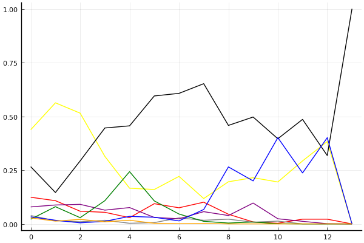
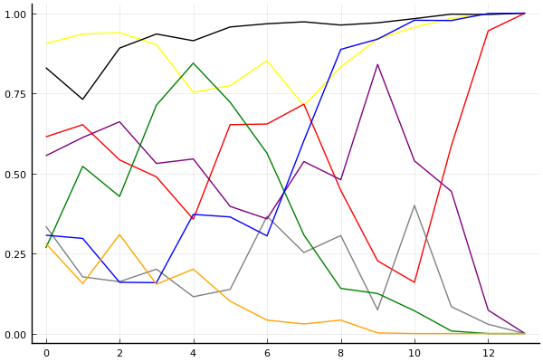

2017 Kespa Cup 개인전 결승 1회전

## 경기 결과

| 트랙 | 유영혁 | 문호준 | 이재혁 | 김승래 | 김정제 | 이중선 | 박인수 | 이준성 |
|:---|---:|---:|---:|---:|---:|---:|---:|---:|
| [포레스트 지그재그](../zigzag) | 7 | 1 | 4 | -1 | 5 | 10 | 3 | 0 |
| [빌리지 붐힐터널](../boomhill) | 5 | 10 | 1 | 3 | 4 | 0 | -1 | 7 |
| [차이나 서안 병마용](../byeongma) | 0 | 7 | 3 | 5 | 1 | 10 | 4 | -1 |
| [네모 산타의 비밀공간](../santa) | -1 | 3 | 1 | 0 | 4 | 7 | 10 | 5 |
| [공동묘지 해골 손가락](../haeson) | 5 | 7 | 10 | 4 | 1 | -1 | 3 | 0 |
| [아이스 설산 다운힐](../seolsan) | 7 | 5 | 4 | 10 | 3 | 0 | 1 | -1 |
| [노르테유 익스프레스](../noex) | 0 | 4 | 5 | 1 | 7 | -1 | 10 | 3 |
| [광산 위험한 제련소](../jeryeonso) | 7 | 1 | -1 | 5 | 3 | 0 | 10 | 4 |
| [팩토리 미완성 5구역](../district5) | 7 | 5 | 1 | -1 | 10 | 4 | 3 | 0 |
| [대저택 은밀한 지하실](../jeotaek) | 5 | 4 | 3 | 10 | -1 | 1 | 7 | 0 |
| [포레스트 지그재그](../zigzag) | 7 | 5 | 10 | -1 | 3 | 0 | 1 | 4 |
| [빌리지 붐힐터널](../boomhill) | 4 | 1 | 7 | 3 | -1 | 0 | 5 | 10 |
| [차이나 서안 병마용](../byeongma) | 3 | 10 | 0 | 4 | -1 | 7 | 1 | 5 |
| __total__ |__56__ |__63__ |__48__ |__42__ |__38__ |__37__ |__57__ |__36__ |

## 시뮬레이션

### 1st 확률

x축: 트랙, y축: 확률
1번: 옐로우, 2번: 블랙, 3번: 레드, 4번: 화이트(회색), 5번: 퍼플, 6번: 그린, 7번: 블루, 8번: 오렌지

| 트랙 | 유영혁 | 문호준 | 이재혁 | 김승래 | 김정제 | 이중선 | 박인수 | 이준성 |
|:---|---:|---:|---:|---:|---:|---:|---:|---:|
| 초기 | 0.423 | 0.267 | 0.104 | 0.055 | 0.094 | 0.025 | 0.021 | 0.024 |
| 포레스트 지그재그 | 0.543 | 0.148 | 0.129 | 0.014 | 0.089 | 0.065 | 0.015 | 0.013 |
| 빌리지 붐힐터널 | 0.487 | 0.309 | 0.067 | 0.011 | 0.081 | 0.033 | 0.006 | 0.025 |
| 차이나 서안 병마용 | 0.297 | 0.456 | 0.061 | 0.012 | 0.048 | 0.121 | 0.009 | 0.009 |
| 네모 산타의 비밀공간 | 0.189 | 0.407 | 0.042 | 0.014 | 0.087 | 0.259 | 0.023 | 0.014 |
| 공동묘지 해골 손가락 | 0.190 | 0.565 | 0.092 | 0.006 | 0.036 | 0.103 | 0.024 | 0.007 |
| 아이스 설산 다운힐 | 0.212 | 0.609 | 0.068 | 0.034 | 0.027 | 0.057 | 0.006 | 0.001 |
| 노르테유 익스프레스 | 0.127 | 0.651 | 0.109 | 0.013 | 0.041 | 0.019 | 0.067 | 0.000 |
| 광산 위험한 제련소 | 0.223 | 0.467 | 0.043 | 0.016 | 0.036 | 0.007 | 0.238 | 0.001 |
| 팩토리 미완성 5구역 | 0.237 | 0.494 | 0.011 | 0.002 | 0.119 | 0.001 | 0.174 | 0.000 |
| 대저택 은밀한 지하실 | 0.205 | 0.418 | 0.005 | 0.008 | 0.019 | 0.000 | 0.380 | 0.000 |
| 포레스트 지그재그 | 0.284 | 0.489 | 0.023 | 0.002 | 0.007 | 0.000 | 0.225 | 0.000 |
| 빌리지 붐힐터널 | 0.378 | 0.332 | 0.032 | 0.000 | 0.000 | 0.000 | 0.372 | 0.000 |
| 차이나 서안 병마용 | 0.000 | 1.000 | 0.000 | 0.000 | 0.000 | 0.000 | 0.000 | 0.000 |

### Advance 확률

x축: 트랙, y축: 확률
1번: 옐로우, 2번: 블랙, 3번: 레드, 4번: 화이트(회색), 5번: 퍼플, 6번: 그린, 7번: 블루, 8번: 오렌지

| 트랙 | 유영혁 | 문호준 | 이재혁 | 김승래 | 김정제 | 이중선 | 박인수 | 이준성 |
|:---|---:|---:|---:|---:|---:|---:|---:|---:|
| 초기 | 0.899 | 0.816 | 0.640 | 0.328 | 0.558 | 0.261 | 0.316 | 0.269 |
| 포레스트 지그재그 | 0.938 | 0.729 | 0.647 | 0.171 | 0.607 | 0.537 | 0.286 | 0.169 |
| 빌리지 붐힐터널 | 0.956 | 0.884 | 0.548 | 0.172 | 0.626 | 0.411 | 0.166 | 0.315 |
| 차이나 서안 병마용 | 0.891 | 0.945 | 0.486 | 0.233 | 0.522 | 0.690 | 0.182 | 0.141 |
| 네모 산타의 비밀공간 | 0.721 | 0.917 | 0.364 | 0.122 | 0.547 | 0.830 | 0.410 | 0.182 |
| 공동묘지 해골 손가락 | 0.763 | 0.956 | 0.622 | 0.151 | 0.420 | 0.708 | 0.387 | 0.105 |
| 아이스 설산 다운힐 | 0.855 | 0.963 | 0.683 | 0.374 | 0.374 | 0.547 | 0.284 | 0.029 |
| 노르테유 익스프레스 | 0.679 | 0.965 | 0.739 | 0.260 | 0.492 | 0.304 | 0.633 | 0.031 |
| 광산 위험한 제련소 | 0.827 | 0.960 | 0.453 | 0.300 | 0.482 | 0.146 | 0.907 | 0.025 |
| 팩토리 미완성 5구역 | 0.899 | 0.977 | 0.211 | 0.069 | 0.854 | 0.140 | 0.924 | 0.006 |
| 대저택 은밀한 지하실 | 0.957 | 0.985 | 0.159 | 0.387 | 0.545 | 0.078 | 0.990 | 0.001 |
| 포레스트 지그재그 | 0.991 | 0.990 | 0.575 | 0.089 | 0.458 | 0.010 | 0.979 | 0.000 |
| 빌리지 붐힐터널 | 0.997 | 1.000 | 0.953 | 0.026 | 0.060 | 0.000 | 0.999 | 0.000 |
| 차이나 서안 병마용 | 1.000 | 1.000 | 1.000 | 0.000 | 0.000 | 0.000 | 1.000 | 0.000 |

## 랭킹 변동

### [전체 랭킹](../singles-full)

| 순위 | 변동 | 이름 | 점수 | 변동 | mu | 변동 | sigma | 변동 |
|---:|---:|:---:|---:|---:|---:|---:|---:|---:|
| 1 / 53 | +0 | [유영혁](../yuyeonghyeok) | 3373 | -20 | 3611 | -27 | 79 | -2 |
| 3 / 53 | +0 | [문호준](../munhojun) | 3330 | +29 | 3576 | +17 | 82 | -4 |
| 5 / 53 | +2 | [이재혁](../ijaehyeok) | 3184 | +22 | 3454 | -7 | 90 | -10 |
| 7 / 53 | -2 | [김정제](../gimjeongje) | 3137 | -29 | 3386 | -42 | 83 | -4 |
| 9 / 53 | +0 | [박인수](../bakinsu) | 3122 | +71 | 3372 | +58 | 83 | -4 |
| 11 / 53 | +0 | [이중선](../ijungseon) | 2995 | +29 | 3276 | -7 | 94 | -12 |
| 12 / 53 | +2 | [김승래](../gimseungrae) | 2993 | +105 | 3326 | +7 | 111 | -33 |
| 13 / 53 | +0 | [이준성](../ijunseong) | 2985 | +57 | 3285 | +1 | 100 | -19 |

### 시즌 랭킹

| 순위 | 변동 | 이름 | 점수 | 변동 | mu | 변동 | sigma | 변동 |
|---:|---:|:---:|---:|---:|---:|---:|---:|---:|
| 1 / 32 | +1 | [문호준](../munhojun) | 3398 | +141 | 3750 | +5 | 117 | -45 |
| 2 / 32 | +1 | [유영혁](../yuyeonghyeok) | 3346 | +94 | 3700 | -50 | 118 | -48 |
| 3 / 32 | -2 | [이재혁](../ijaehyeok) | 3292 | +12 | 3672 | -194 | 127 | -69 |
| 4 / 32 | +2 | [박인수](../bakinsu) | 3191 | +187 | 3502 | +117 | 104 | -23 |
| 5 / 32 | -1 | [김정제](../gimjeongje) | 3132 | +41 | 3481 | -87 | 117 | -42 |
| 6 / 32 | -1 | [이준성](../ijunseong) | 3095 | +71 | 3398 | +12 | 101 | -20 |
| 7 / 32 | +2 | [김승래](../gimseungrae) | 3068 | +160 | 3407 | +55 | 113 | -35 |
| 8 / 32 | +3 | [이중선](../ijungseon) | 2998 | +178 | 3354 | +46 | 119 | -44 |

### 트랙 별 랭킹

#### [공동묘지 해골 손가락](../haeson)

| 순위 | 변동 | 이름 | 점수 | 변동 | mu | 변동 | sigma | 변동 |
|:---:|:---:|:---:|---:|---:|---:|---:|---:|---:|
| 1 / 16 | +4 | [문호준](../munhojun) | 2592 | +705 | 3946 | +183 | 451 | -174 |
| 2 / 16 | +1 | [김승래](../gimseungrae) | 2422 | +261 | 3810 | -464 | 463 | -242 |
| 3 / 16 | +9 | [이재혁](../ijaehyeok) | 2386 | +1297 | 3762 | +899 | 459 | -133 |
| 4 / 16 | +0 | [박인수](../bakinsu) | 2259 | +244 | 3377 | -36 | 372 | -93 |
| 6 / 16 | -5 | [이준성](../ijunseong) | 2126 | -93 | 3232 | -326 | 369 | -78 |
| 7 / 16 | +6 | [유영혁](../yuyeonghyeok) | 2108 | +1018 | 3397 | +533 | 429 | -162 |
| 8 / 16 | +2 | [김정제](../gimjeongje) | 1820 | +457 | 3106 | -31 | 429 | -163 |
| 12 / 16 | -5 | [이중선](../ijungseon) | 1377 | -245 | 2797 | -626 | 473 | -127 |

#### [광산 위험한 제련소](../jeryeonso)

| 순위 | 변동 | 이름 | 점수 | 변동 | mu | 변동 | sigma | 변동 |
|:---:|:---:|:---:|---:|---:|---:|---:|---:|---:|
| 1 / 28 | +1 | [유영혁](../yuyeonghyeok) | 2944 | +268 | 4092 | -25 | 383 | -97 |
| 2 / 28 | +2 | [김승래](../gimseungrae) | 2705 | +253 | 3824 | -35 | 373 | -96 |
| 3 / 28 | -2 | [문호준](../munhojun) | 2578 | -494 | 3827 | -951 | 416 | -153 |
| 5 / 28 | +7 | [박인수](../bakinsu) | 2539 | +651 | 3572 | +492 | 345 | -53 |
| 6 / 28 | +3 | [이준성](../ijunseong) | 2345 | +268 | 3284 | +113 | 313 | -52 |
| 12 / 28 | -1 | [이중선](../ijungseon) | 1848 | -44 | 3131 | -455 | 427 | -137 |
| 13 / 28 | +8 | [김정제](../gimjeongje) | 1657 | +761 | 2795 | +441 | 379 | -107 |
| 19 / 28 | -1 | [이재혁](../ijaehyeok) | 1092 | -96 | 2485 | -368 | 465 | -91 |

#### [네모 산타의 비밀공간](../santa)

| 순위 | 변동 | 이름 | 점수 | 변동 | mu | 변동 | sigma | 변동 |
|:---:|:---:|:---:|---:|---:|---:|---:|---:|---:|
| 3 / 35 | +0 | [문호준](../munhojun) | 2459 | +12 | 3317 | -117 | 286 | -43 |
| 4 / 35 | +2 | [김정제](../gimjeongje) | 2455 | +81 | 3149 | +19 | 231 | -21 |
| 6 / 35 | +2 | [박인수](../bakinsu) | 2392 | +283 | 3139 | +223 | 249 | -20 |
| 7 / 35 | -2 | [유영혁](../yuyeonghyeok) | 2306 | -111 | 2981 | -153 | 225 | -14 |
| 8 / 35 | +2 | [이준성](../ijunseong) | 2300 | +246 | 3188 | +104 | 296 | -47 |
| 10 / 35 | +9 | [이중선](../ijungseon) | 2247 | +612 | 3425 | +225 | 393 | -129 |
| 14 / 35 | -3 | [김승래](../gimseungrae) | 1987 | -37 | 2998 | -252 | 337 | -72 |
| 15 / 35 | +0 | [이재혁](../ijaehyeok) | 1963 | +127 | 2787 | +18 | 275 | -36 |

#### [노르테유 익스프레스](../noex)

| 순위 | 변동 | 이름 | 점수 | 변동 | mu | 변동 | sigma | 변동 |
|:---:|:---:|:---:|---:|---:|---:|---:|---:|---:|
| 1 / 53 | +1 | [박인수](../bakinsu) | 3437 | +327 | 4361 | +234 | 308 | -31 |
| 2 / 53 | +1 | [이재혁](../ijaehyeok) | 3200 | +167 | 4450 | -275 | 417 | -147 |
| 3 / 53 | -2 | [문호준](../munhojun) | 3182 | +50 | 4123 | -98 | 314 | -49 |
| 4 / 53 | +7 | [김정제](../gimjeongje) | 2958 | +608 | 4083 | +341 | 375 | -89 |
| 6 / 53 | +2 | [이준성](../ijunseong) | 2604 | +161 | 3508 | +31 | 301 | -43 |
| 7 / 53 | -2 | [유영혁](../yuyeonghyeok) | 2554 | -66 | 3425 | -176 | 291 | -37 |
| 11 / 53 | -4 | [이중선](../ijungseon) | 2322 | -172 | 3248 | -276 | 309 | -35 |
| 22 / 53 | +19 | [김승래](../gimseungrae) | 1658 | +738 | 2811 | +414 | 384 | -108 |

#### [대저택 은밀한 지하실](../jeotaek)

| 순위 | 변동 | 이름 | 점수 | 변동 | mu | 변동 | sigma | 변동 |
|:---:|:---:|:---:|---:|---:|---:|---:|---:|---:|
| 1 / 53 | +0 | [유영혁](../yuyeonghyeok) | 3324 | -81 | 4226 | -219 | 301 | -46 |
| 3 / 53 | +4 | [김승래](../gimseungrae) | 2929 | +454 | 4045 | +285 | 372 | -56 |
| 6 / 53 | -3 | [이재혁](../ijaehyeok) | 2593 | -232 | 3844 | -741 | 417 | -170 |
| 8 / 53 | +11 | [박인수](../bakinsu) | 2285 | +468 | 3158 | +351 | 291 | -39 |
| 10 / 53 | +7 | [문호준](../munhojun) | 2215 | +281 | 3046 | +175 | 277 | -35 |
| 12 / 53 | +2 | [이중선](../ijungseon) | 2123 | +121 | 2991 | +5 | 289 | -39 |
| 19 / 53 | -9 | [김정제](../gimjeongje) | 1829 | -329 | 3003 | -570 | 391 | -80 |
| 20 / 53 | +5 | [이준성](../ijunseong) | 1799 | +117 | 2715 | -9 | 305 | -42 |

#### [빌리지 붐힐터널](../boomhill)

| 순위 | 변동 | 이름 | 점수 | 변동 | mu | 변동 | sigma | 변동 |
|:---:|:---:|:---:|---:|---:|---:|---:|---:|---:|
| 1 / 15 | NaN | [이준성](../ijunseong) | 2784 | +2784 | 4303 | +1303 | 507 | -493 |
| 2 / 15 | NaN | [유영혁](../yuyeonghyeok) | 2209 | +2209 | 3490 | +490 | 427 | -573 |
| 3 / 15 | -2 | [김승래](../gimseungrae) | 2192 | +31 | 3375 | -900 | 394 | -310 |
| 4 / 15 | NaN | [이재혁](../ijaehyeok) | 2106 | +2106 | 3447 | +447 | 447 | -553 |
| 5 / 15 | NaN | [문호준](../munhojun) | 2064 | +2064 | 3461 | +461 | 465 | -535 |
| 8 / 15 | NaN | [박인수](../bakinsu) | 1604 | +1604 | 3021 | +21 | 472 | -528 |
| 10 / 15 | NaN | [김정제](../gimjeongje) | 1288 | +1288 | 2680 | -320 | 464 | -536 |
| 11 / 15 | NaN | [이중선](../ijungseon) | 1110 | +1110 | 2504 | -496 | 465 | -535 |

#### [아이스 설산 다운힐](../seolsan)

| 순위 | 변동 | 이름 | 점수 | 변동 | mu | 변동 | sigma | 변동 |
|:---:|:---:|:---:|---:|---:|---:|---:|---:|---:|
| 1 / 20 | +2 | [김승래](../gimseungrae) | 2638 | +539 | 3786 | +353 | 383 | -62 |
| 3 / 20 | +8 | [문호준](../munhojun) | 2148 | +637 | 3366 | +224 | 406 | -138 |
| 4 / 20 | +12 | [유영혁](../yuyeonghyeok) | 2068 | +1004 | 3320 | +589 | 417 | -138 |
| 5 / 20 | +2 | [박인수](../bakinsu) | 2044 | +132 | 3066 | -72 | 341 | -68 |
| 7 / 20 | +7 | [이재혁](../ijaehyeok) | 1996 | +634 | 3262 | +126 | 422 | -169 |
| 8 / 20 | +2 | [김정제](../gimjeongje) | 1995 | +372 | 3269 | -154 | 425 | -175 |
| 11 / 20 | -10 | [이중선](../ijungseon) | 1844 | -316 | 3246 | -1028 | 467 | -237 |
| 13 / 20 | -5 | [이준성](../ijunseong) | 1651 | -178 | 2779 | -356 | 376 | -59 |

#### [차이나 서안 병마용](../byeongma)

| 순위 | 변동 | 이름 | 점수 | 변동 | mu | 변동 | sigma | 변동 |
|:---:|:---:|:---:|---:|---:|---:|---:|---:|---:|
| 1 / 39 | +3 | [문호준](../munhojun) | 2889 | +440 | 3712 | +233 | 274 | -69 |
| 2 / 39 | +0 | [유영혁](../yuyeonghyeok) | 2575 | +6 | 3199 | -92 | 208 | -33 |
| 3 / 39 | +2 | [박인수](../bakinsu) | 2534 | +111 | 3198 | -17 | 222 | -42 |
| 4 / 39 | -3 | [김정제](../gimjeongje) | 2493 | -104 | 3143 | -204 | 217 | -33 |
| 5 / 39 | -2 | [이준성](../ijunseong) | 2484 | -30 | 3320 | -286 | 279 | -85 |
| 6 / 39 | +9 | [김승래](../gimseungrae) | 2458 | +525 | 3329 | +149 | 290 | -125 |
| 7 / 39 | -1 | [이재혁](../ijaehyeok) | 2415 | +38 | 3183 | -177 | 256 | -72 |
| 12 / 39 | +22 | [이중선](../ijungseon) | 2238 | +1959 | 3229 | +1416 | 330 | -181 |

#### [팩토리 미완성 5구역](../district5)

| 순위 | 변동 | 이름 | 점수 | 변동 | mu | 변동 | sigma | 변동 |
|:---:|:---:|:---:|---:|---:|---:|---:|---:|---:|
| 1 / 52 | +0 | [유영혁](../yuyeonghyeok) | 3495 | -57 | 4658 | -367 | 388 | -103 |
| 3 / 52 | +1 | [박인수](../bakinsu) | 2825 | -31 | 3972 | -390 | 382 | -120 |
| 4 / 52 | -1 | [이재혁](../ijaehyeok) | 2702 | -197 | 3920 | -638 | 406 | -147 |
| 5 / 52 | +5 | [문호준](../munhojun) | 2628 | +385 | 3592 | +209 | 321 | -58 |
| 6 / 52 | -1 | [이준성](../ijunseong) | 2614 | -102 | 3560 | -240 | 315 | -46 |
| 8 / 52 | +23 | [김정제](../gimjeongje) | 2404 | +1002 | 3513 | +782 | 370 | -73 |
| 12 / 52 | +9 | [이중선](../ijungseon) | 2220 | +426 | 3107 | +291 | 296 | -45 |
| 33 / 52 | +0 | [김승래](../gimseungrae) | 1250 | -36 | 2665 | -293 | 472 | -85 |

#### [포레스트 지그재그](../zigzag)

| 순위 | 변동 | 이름 | 점수 | 변동 | mu | 변동 | sigma | 변동 |
|:---:|:---:|:---:|---:|---:|---:|---:|---:|---:|
| 1 / 32 | +0 | [이재혁](../ijaehyeok) | 3546 | +371 | 4681 | -181 | 378 | -184 |
| 2 / 32 | +0 | [유영혁](../yuyeonghyeok) | 3545 | +539 | 4650 | -79 | 368 | -206 |
| 3 / 32 | +0 | [김정제](../gimjeongje) | 3068 | +159 | 4074 | -371 | 335 | -177 |
| 4 / 32 | +3 | [이중선](../ijungseon) | 2835 | +466 | 3826 | +97 | 330 | -123 |
| 5 / 32 | +1 | [문호준](../munhojun) | 2829 | +224 | 3816 | -228 | 329 | -151 |
| 8 / 32 | +2 | [이준성](../ijunseong) | 2348 | +405 | 3224 | +144 | 292 | -87 |
| 11 / 32 | +5 | [박인수](../bakinsu) | 2120 | +710 | 2975 | +460 | 285 | -83 |
| 19 / 32 | -1 | [김승래](../gimseungrae) | 1236 | -86 | 2392 | -365 | 385 | -93 |
