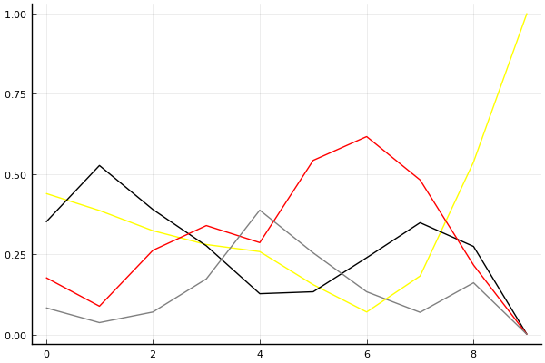
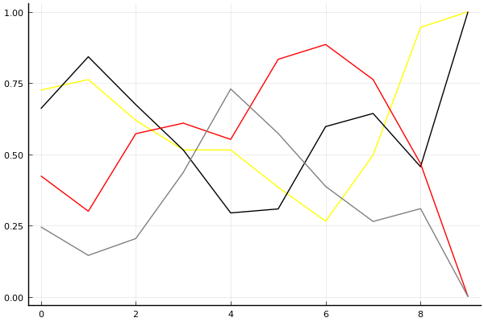

2017 Kespa Cup 개인전 결승 2회전

## 경기 결과

| 트랙 | 유영혁 | 문호준 | 이재혁 | 박인수 |
|:---|---:|---:|---:|---:|
| [포레스트 지그재그](../zigzag) | 7 | 10 | 5 | 4 |
| [빌리지 붐힐터널](../boomhill) | 5 | 4 | 10 | 7 |
| [차이나 서안 병마용](../byeongma) | 5 | 4 | 7 | 10 |
| [네모 산타의 비밀공간](../santa) | 7 | 4 | 5 | 10 |
| [공동묘지 해골 손가락](../haeson) | 5 | 7 | 10 | 4 |
| [아이스 설산 다운힐](../seolsan) | 5 | 10 | 7 | 4 |
| [노르테유 익스프레스](../noex) | 10 | 7 | 4 | 5 |
| [광산 위험한 제련소](../jeryeonso) | 10 | 5 | 4 | 7 |
| [팩토리 미완성 5구역](../district5) | 10 | 7 | 5 | 4 |
| __total__ |__64__ |__58__ |__57__ |__55__ |

## 시뮬레이션

### 1st 확률

x축: 트랙, y축: 확률
1번: 옐로우, 2번: 블랙, 3번: 레드, 4번: 화이트(회색), 5번: 퍼플, 6번: 그린, 7번: 블루, 8번: 오렌지

| 트랙 | 유영혁 | 문호준 | 이재혁 | 박인수 |
|:---|---:|---:|---:|---:|
| 초기 | 0.433 | 0.315 | 0.202 | 0.086 |
| 포레스트 지그재그 | 0.407 | 0.484 | 0.100 | 0.036 |
| 빌리지 붐힐터널 | 0.346 | 0.374 | 0.269 | 0.067 |
| 차이나 서안 병마용 | 0.277 | 0.244 | 0.357 | 0.167 |
| 네모 산타의 비밀공간 | 0.292 | 0.137 | 0.245 | 0.389 |
| 공동묘지 해골 손가락 | 0.179 | 0.137 | 0.535 | 0.231 |
| 아이스 설산 다운힐 | 0.053 | 0.275 | 0.627 | 0.117 |
| 노르테유 익스프레스 | 0.199 | 0.331 | 0.467 | 0.086 |
| 광산 위험한 제련소 | 0.545 | 0.265 | 0.206 | 0.171 |
| 팩토리 미완성 5구역 | 1.000 | 0.000 | 0.000 | 0.000 |

### Advance 확률

x축: 트랙, y축: 확률
1번: 옐로우, 2번: 블랙, 3번: 레드, 4번: 화이트(회색), 5번: 퍼플, 6번: 그린, 7번: 블루, 8번: 오렌지

| 트랙 | 유영혁 | 문호준 | 이재혁 | 박인수 |
|:---|---:|---:|---:|---:|
| 초기 | 0.732 | 0.648 | 0.429 | 0.260 |
| 포레스트 지그재그 | 0.754 | 0.831 | 0.335 | 0.138 |
| 빌리지 붐힐터널 | 0.633 | 0.674 | 0.581 | 0.191 |
| 차이나 서안 병마용 | 0.523 | 0.508 | 0.652 | 0.418 |
| 네모 산타의 비밀공간 | 0.549 | 0.324 | 0.504 | 0.723 |
| 공동묘지 해골 손가락 | 0.407 | 0.308 | 0.821 | 0.602 |
| 아이스 설산 다운힐 | 0.235 | 0.609 | 0.887 | 0.383 |
| 노르테유 익스프레스 | 0.505 | 0.636 | 0.753 | 0.289 |
| 광산 위험한 제련소 | 0.949 | 0.457 | 0.463 | 0.314 |
| 팩토리 미완성 5구역 | 1.000 | 1.000 | 0.000 | 0.000 |

## 랭킹 변동

### [전체 랭킹](../singles-full)

| 순위 | 변동 | 이름 | 점수 | 변동 | mu | 변동 | sigma | 변동 |
|---:|---:|:---:|---:|---:|---:|---:|---:|---:|
| 1 / 53 | +0 | [유영혁](../yuyeonghyeok) | 3386 | +13 | 3626 | +14 | 80 | +0 |
| 3 / 53 | +0 | [문호준](../munhojun) | 3315 | -14 | 3561 | -15 | 82 | -0 |
| 5 / 53 | +0 | [이재혁](../ijaehyeok) | 3193 | +9 | 3456 | +3 | 88 | -2 |
| 9 / 53 | +0 | [박인수](../bakinsu) | 3121 | -1 | 3370 | -2 | 83 | -0 |

### 시즌 랭킹

| 순위 | 변동 | 이름 | 점수 | 변동 | mu | 변동 | sigma | 변동 |
|---:|---:|:---:|---:|---:|---:|---:|---:|---:|
| 1 / 32 | +1 | [유영혁](../yuyeonghyeok) | 3423 | +77 | 3744 | +44 | 107 | -11 |
| 2 / 32 | -1 | [문호준](../munhojun) | 3397 | -2 | 3718 | -32 | 107 | -10 |
| 3 / 32 | +0 | [이재혁](../ijaehyeok) | 3317 | +24 | 3655 | -17 | 113 | -14 |
| 4 / 32 | +0 | [박인수](../bakinsu) | 3209 | +19 | 3504 | +2 | 98 | -6 |

### 트랙 별 랭킹

#### [공동묘지 해골 손가락](../haeson)

| 순위 | 변동 | 이름 | 점수 | 변동 | mu | 변동 | sigma | 변동 |
|:---:|:---:|:---:|---:|---:|---:|---:|---:|---:|
| 1 / 16 | +2 | [이재혁](../ijaehyeok) | 2853 | +466 | 4065 | +302 | 404 | -55 |
| 2 / 16 | -1 | [문호준](../munhojun) | 2774 | +182 | 3928 | -18 | 385 | -67 |
| 4 / 16 | +3 | [유영혁](../yuyeonghyeok) | 2283 | +175 | 3394 | -2 | 370 | -59 |
| 5 / 16 | -1 | [박인수](../bakinsu) | 2166 | -93 | 3191 | -185 | 342 | -31 |

#### [광산 위험한 제련소](../jeryeonso)

| 순위 | 변동 | 이름 | 점수 | 변동 | mu | 변동 | sigma | 변동 |
|:---:|:---:|:---:|---:|---:|---:|---:|---:|---:|
| 1 / 28 | +0 | [유영혁](../yuyeonghyeok) | 3167 | +224 | 4229 | +137 | 354 | -29 |
| 2 / 28 | +3 | [박인수](../bakinsu) | 2707 | +168 | 3647 | +75 | 313 | -31 |
| 5 / 28 | -2 | [문호준](../munhojun) | 2523 | -55 | 3623 | -204 | 367 | -50 |
| 19 / 28 | +0 | [이재혁](../ijaehyeok) | 1098 | +6 | 2402 | -83 | 435 | -30 |

#### [네모 산타의 비밀공간](../santa)

| 순위 | 변동 | 이름 | 점수 | 변동 | mu | 변동 | sigma | 변동 |
|:---:|:---:|:---:|---:|---:|---:|---:|---:|---:|
| 2 / 35 | +4 | [박인수](../bakinsu) | 2527 | +136 | 3238 | +99 | 237 | -12 |
| 6 / 35 | +1 | [유영혁](../yuyeonghyeok) | 2376 | +70 | 3015 | +35 | 213 | -12 |
| 7 / 35 | -4 | [문호준](../munhojun) | 2321 | -139 | 3117 | -200 | 265 | -20 |
| 12 / 35 | +3 | [이재혁](../ijaehyeok) | 2041 | +77 | 2800 | +13 | 253 | -21 |

#### [노르테유 익스프레스](../noex)

| 순위 | 변동 | 이름 | 점수 | 변동 | mu | 변동 | sigma | 변동 |
|:---:|:---:|:---:|---:|---:|---:|---:|---:|---:|
| 1 / 53 | +0 | [박인수](../bakinsu) | 3409 | -28 | 4244 | -117 | 278 | -30 |
| 2 / 53 | +1 | [문호준](../munhojun) | 3298 | +115 | 4144 | +21 | 282 | -32 |
| 3 / 53 | -1 | [이재혁](../ijaehyeok) | 2998 | -202 | 4083 | -368 | 361 | -55 |
| 5 / 53 | +2 | [유영혁](../yuyeonghyeok) | 2887 | +333 | 3690 | +265 | 268 | -23 |

#### [빌리지 붐힐터널](../boomhill)

| 순위 | 변동 | 이름 | 점수 | 변동 | mu | 변동 | sigma | 변동 |
|:---:|:---:|:---:|---:|---:|---:|---:|---:|---:|
| 2 / 15 | +2 | [이재혁](../ijaehyeok) | 2530 | +423 | 3715 | +268 | 395 | -52 |
| 3 / 15 | -1 | [유영혁](../yuyeonghyeok) | 2258 | +48 | 3354 | -137 | 365 | -62 |
| 5 / 15 | +3 | [박인수](../bakinsu) | 2078 | +474 | 3254 | +233 | 392 | -80 |
| 6 / 15 | -1 | [문호준](../munhojun) | 1895 | -170 | 3105 | -355 | 404 | -62 |

#### [아이스 설산 다운힐](../seolsan)

| 순위 | 변동 | 이름 | 점수 | 변동 | mu | 변동 | sigma | 변동 |
|:---:|:---:|:---:|---:|---:|---:|---:|---:|---:|
| 2 / 20 | +1 | [문호준](../munhojun) | 2515 | +367 | 3608 | +242 | 364 | -42 |
| 3 / 20 | +4 | [이재혁](../ijaehyeok) | 2265 | +268 | 3350 | +88 | 362 | -60 |
| 5 / 20 | -1 | [유영혁](../yuyeonghyeok) | 2144 | +76 | 3219 | -101 | 358 | -59 |
| 9 / 20 | -4 | [박인수](../bakinsu) | 1960 | -84 | 2905 | -160 | 315 | -25 |

#### [차이나 서안 병마용](../byeongma)

| 순위 | 변동 | 이름 | 점수 | 변동 | mu | 변동 | sigma | 변동 |
|:---:|:---:|:---:|---:|---:|---:|---:|---:|---:|
| 1 / 39 | +0 | [문호준](../munhojun) | 2744 | -145 | 3509 | -203 | 255 | -19 |
| 2 / 39 | +1 | [박인수](../bakinsu) | 2664 | +130 | 3299 | +101 | 212 | -10 |
| 3 / 39 | -1 | [유영혁](../yuyeonghyeok) | 2598 | +23 | 3192 | -7 | 198 | -10 |
| 4 / 39 | +3 | [이재혁](../ijaehyeok) | 2523 | +108 | 3236 | +53 | 238 | -18 |

#### [팩토리 미완성 5구역](../district5)

| 순위 | 변동 | 이름 | 점수 | 변동 | mu | 변동 | sigma | 변동 |
|:---:|:---:|:---:|---:|---:|---:|---:|---:|---:|
| 1 / 52 | +0 | [유영혁](../yuyeonghyeok) | 3667 | +172 | 4753 | +95 | 362 | -26 |
| 3 / 52 | +2 | [문호준](../munhojun) | 2866 | +238 | 3747 | +155 | 294 | -28 |
| 4 / 52 | +0 | [이재혁](../ijaehyeok) | 2799 | +97 | 3850 | -69 | 351 | -56 |
| 5 / 52 | -2 | [박인수](../bakinsu) | 2689 | -137 | 3722 | -250 | 345 | -38 |

#### [포레스트 지그재그](../zigzag)

| 순위 | 변동 | 이름 | 점수 | 변동 | mu | 변동 | sigma | 변동 |
|:---:|:---:|:---:|---:|---:|---:|---:|---:|---:|
| 1 / 32 | +1 | [유영혁](../yuyeonghyeok) | 3589 | +44 | 4565 | -85 | 325 | -43 |
| 2 / 32 | -1 | [이재혁](../ijaehyeok) | 3425 | -121 | 4435 | -246 | 337 | -41 |
| 3 / 32 | +2 | [문호준](../munhojun) | 3191 | +362 | 4095 | +279 | 301 | -28 |
| 11 / 32 | +0 | [박인수](../bakinsu) | 2118 | -2 | 2956 | -19 | 279 | -6 |
