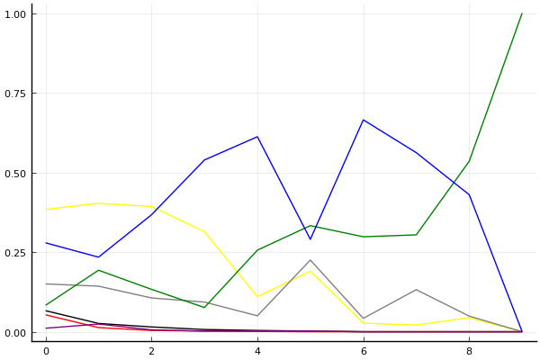

2017 듀얼 레이스 2 개인전 16강 B조 2회전

## 경기 결과

| 트랙 | 이재혁 | 김주원 | 최영훈 | 황선민 | 권순민 | 이재인 | 유창현 |
|:---|---:|---:|---:|---:|---:|---:|---:|
| [네모 장난감 선물공장](../present) | 5 | 1 | 0 | 3 | 7 | 10 | 4 |
| [차이나 서안 병마용](../byeongma) | 7 | 4 | 1 | 5 | 0 | 3 | 10 |
| [해적 가파른 감시탑](../gamshi) | 5 | 0 | 3 | 7 | 1 | 4 | 10 |
| [월드 뉴욕 대질주](../newyork) | 1 | 7 | 0 | 3 | 4 | 10 | 5 |
| [비치 해변 드라이브](../haebyun) | 7 | 1 | 3 | 10 | 4 | 5 | 0 |
| [월드 두바이 다운타운](../dubai) | 0 | 3 | 4 | 1 | 7 | 5 | 10 |
| [월드 파리 에펠탑 다이브](../eifel) | 7 | 3 | 0 | 10 | 1 | 5 | 4 |
| [WKC 투어링 랠리](../rally) | 7 | 10 | 3 | 0 | 5 | 4 | 1 |
| [네모 산타의 비밀공간](../santa) | 5 | 3 | 10 | 4 | 1 | 7 | 0 |
| __total__ |__44__ |__32__ |__24__ |__43__ |__30__ |__53__ |__44__ |

## 시뮬레이션

### 1st 확률

x축: 트랙, y축: 확률
1번: 옐로우, 2번: 블랙, 3번: 레드, 4번: 화이트(회색), 5번: 퍼플, 6번: 그린, 7번: 블루, 8번: 오렌지

| 트랙 | 이재혁 | 김주원 | 최영훈 | 황선민 | 권순민 | 이재인 | 유창현 |
|:---|---:|---:|---:|---:|---:|---:|---:|
| 초기 | 0.384 | 0.066 | 0.053 | 0.150 | 0.011 | 0.083 | 0.279 |
| 네모 장난감 선물공장 | 0.403 | 0.026 | 0.013 | 0.143 | 0.024 | 0.193 | 0.234 |
| 차이나 서안 병마용 | 0.393 | 0.015 | 0.004 | 0.106 | 0.006 | 0.133 | 0.367 |
| 해적 가파른 감시탑 | 0.314 | 0.007 | 0.002 | 0.093 | 0.002 | 0.076 | 0.539 |
| 월드 뉴욕 대질주 | 0.110 | 0.004 | 0.001 | 0.050 | 0.002 | 0.256 | 0.612 |
| 비치 해변 드라이브 | 0.190 | 0.002 | 0.000 | 0.225 | 0.002 | 0.333 | 0.290 |
| 월드 두바이 다운타운 | 0.027 | 0.000 | 0.000 | 0.042 | 0.000 | 0.298 | 0.665 |
| 월드 파리 에펠탑 다이브 | 0.021 | 0.000 | 0.000 | 0.132 | 0.000 | 0.304 | 0.562 |
| WKC 투어링 랠리 | 0.044 | 0.000 | 0.000 | 0.049 | 0.000 | 0.535 | 0.430 |
| 네모 산타의 비밀공간 | 0.000 | 0.000 | 0.000 | 0.000 | 0.000 | 1.000 | 0.000 |

### Repechage 확률

x축: 트랙, y축: 확률
1번: 옐로우, 2번: 블랙, 3번: 레드, 4번: 화이트(회색), 5번: 퍼플, 6번: 그린, 7번: 블루, 8번: 오렌지

| 트랙 | 이재혁 | 김주원 | 최영훈 | 황선민 | 권순민 | 이재인 | 유창현 |
|:---|---:|---:|---:|---:|---:|---:|---:|
| 초기 | 0.535 | 0.632 | 0.556 | 0.696 | 0.292 | 0.701 | 0.642 |
| 네모 장난감 선물공장 | 0.529 | 0.527 | 0.374 | 0.676 | 0.495 | 0.744 | 0.702 |
| 차이나 서안 병마용 | 0.588 | 0.579 | 0.296 | 0.786 | 0.381 | 0.808 | 0.611 |
| 해적 가파른 감시탑 | 0.679 | 0.439 | 0.307 | 0.877 | 0.368 | 0.896 | 0.459 |
| 월드 뉴욕 대질주 | 0.875 | 0.647 | 0.100 | 0.907 | 0.379 | 0.737 | 0.388 |
| 비치 해변 드라이브 | 0.806 | 0.480 | 0.091 | 0.772 | 0.510 | 0.667 | 0.710 |
| 월드 두바이 다운타운 | 0.947 | 0.230 | 0.041 | 0.952 | 0.804 | 0.702 | 0.335 |
| 월드 파리 에펠탑 다이브 | 0.979 | 0.213 | 0.007 | 0.868 | 0.825 | 0.696 | 0.438 |
| WKC 투어링 랠리 | 0.955 | 0.586 | 0.001 | 0.951 | 0.422 | 0.465 | 0.570 |
| 네모 산타의 비밀공간 | 1.000 | 1.000 | 0.000 | 1.000 | 0.000 | 0.000 | 1.000 |

## 랭킹 변동

### [전체 랭킹](../singles-full)

| 순위 | 변동 | 이름 | 점수 | 변동 | mu | 변동 | sigma | 변동 |
|---:|---:|:---:|---:|---:|---:|---:|---:|---:|
| 6 / 35 | +0 | [유창현](../yuchanghyeon) | 3027 | -3 | 3315 | -25 | 96 | -7 |
| 8 / 35 | +3 | [이재인](../ijaein) | 2960 | +106 | 3256 | +75 | 99 | -10 |
| 9 / 35 | +4 | [이재혁](../ijaehyeok) | 2940 | +119 | 3358 | -42 | 139 | -54 |
| 11 / 35 | +1 | [황선민](../hwangseongmin) | 2912 | +74 | 3265 | +4 | 118 | -23 |
| 14 / 35 | +1 | [김주원](../gimjuwon) | 2764 | +35 | 3109 | -30 | 115 | -22 |
| 17 / 35 | +0 | [최영훈](../choiyeonghun) | 2651 | -19 | 3007 | -88 | 118 | -23 |
| 18 / 35 | +2 | [권순민](../gweonsoonmin) | 2620 | +132 | 2974 | +57 | 118 | -25 |

### 시즌 랭킹

| 순위 | 변동 | 이름 | 점수 | 변동 | mu | 변동 | sigma | 변동 |
|---:|---:|:---:|---:|---:|---:|---:|---:|---:|
| 5 / 16 | +1 | [이재혁](../ijaehyeok) | 2738 | +102 | 3168 | -81 | 143 | -61 |
| 7 / 16 | +2 | [황선민](../hwangseongmin) | 2647 | +140 | 3081 | -41 | 145 | -60 |
| 8 / 16 | +5 | [이재인](../ijaein) | 2628 | +466 | 3065 | +267 | 146 | -66 |
| 9 / 16 | -2 | [김주원](../gimjuwon) | 2545 | +11 | 2971 | -160 | 142 | -57 |
| 13 / 16 | -5 | [최영훈](../choiyeonghun) | 2435 | -95 | 2871 | -274 | 145 | -59 |
| 14 / 16 | +0 | [권순민](../gweonsoonmin) | 2377 | +235 | 2809 | +49 | 144 | -62 |
| 15 / 16 | +0 | [유창현](../yuchanghyeon) | 2374 | +469 | 2819 | +279 | 148 | -63 |

### 트랙 별 랭킹

#### [WKC 투어링 랠리](../rally)

| 순위 | 변동 | 이름 | 점수 | 변동 | mu | 변동 | sigma | 변동 |
|:---:|:---:|:---:|---:|---:|---:|---:|---:|---:|
| 1 / 16 | +7 | [김주원](../gimjuwon) | 2485 | +863 | 3984 | +561 | 500 | -101 |
| 2 / 16 | -1 | [이재혁](../ijaehyeok) | 2440 | +279 | 3999 | -276 | 520 | -185 |
| 8 / 16 | +2 | [최영훈](../choiyeonghun) | 1499 | +136 | 2830 | -307 | 444 | -148 |
| 10 / 16 | +4 | [권순민](../gweonsoonmin) | 1452 | +1091 | 2842 | +605 | 463 | -162 |
| 11 / 16 | +2 | [이재인](../ijaein) | 1426 | +650 | 2765 | +188 | 446 | -154 |
| 13 / 16 | -9 | [황선민](../hwangseongmin) | 1190 | -696 | 2639 | -1124 | 483 | -143 |
| 15 / 16 | +1 | [유창현](../yuchanghyeon) | 580 | +968 | 2065 | +339 | 495 | -210 |

#### [네모 산타의 비밀공간](../santa)

| 순위 | 변동 | 이름 | 점수 | 변동 | mu | 변동 | sigma | 변동 |
|:---:|:---:|:---:|---:|---:|---:|---:|---:|---:|
| 1 / 16 | +1 | [최영훈](../choiyeonghun) | 2654 | +493 | 4491 | +217 | 612 | -92 |
| 5 / 16 | +1 | [황선민](../hwangseongmin) | 1843 | +221 | 3167 | -256 | 441 | -159 |
| 6 / 16 | +7 | [이재혁](../ijaehyeok) | 1624 | +849 | 2958 | +381 | 445 | -156 |
| 9 / 16 | -4 | [권순민](../gweonsoonmin) | 1554 | -333 | 2943 | -820 | 463 | -162 |
| 10 / 16 | +1 | [김주원](../gimjuwon) | 1457 | +367 | 2777 | -86 | 440 | -151 |
| 11 / 16 | +5 | [이재인](../ijaein) | 1438 | +1826 | 2928 | +1202 | 497 | -208 |
| 16 / 16 | -1 | [유창현](../yuchanghyeon) | 326 | -35 | 1900 | -337 | 525 | -101 |

#### [네모 장난감 선물공장](../present)

| 순위 | 변동 | 이름 | 점수 | 변동 | mu | 변동 | sigma | 변동 |
|:---:|:---:|:---:|---:|---:|---:|---:|---:|---:|
| 1 / 16 | +5 | [권순민](../gweonsoonmin) | 2235 | +613 | 3571 | +147 | 445 | -155 |
| 3 / 16 | +0 | [유창현](../yuchanghyeon) | 2081 | +195 | 3420 | -343 | 446 | -179 |
| 4 / 16 | +8 | [이재혁](../ijaehyeok) | 1879 | +790 | 3183 | +320 | 435 | -157 |
| 7 / 16 | -5 | [김주원](../gimjuwon) | 1739 | -422 | 3200 | -1074 | 487 | -217 |
| 8 / 16 | +8 | [이재인](../ijaein) | 1717 | +2104 | 3222 | +1497 | 502 | -203 |
| 9 / 16 | +0 | [황선민](../hwangseongmin) | 1713 | +350 | 3024 | -112 | 437 | -154 |
| 15 / 16 | -1 | [최영훈](../choiyeonghun) | 715 | -60 | 2225 | -351 | 503 | -97 |

#### [비치 해변 드라이브](../haebyun)

| 순위 | 변동 | 이름 | 점수 | 변동 | mu | 변동 | sigma | 변동 |
|:---:|:---:|:---:|---:|---:|---:|---:|---:|---:|
| 3 / 35 | +6 | [이재혁](../ijaehyeok) | 2541 | +424 | 3941 | -186 | 467 | -204 |
| 4 / 35 | +3 | [이재인](../ijaein) | 2392 | +231 | 3344 | +81 | 318 | -50 |
| 6 / 35 | +17 | [황선민](../hwangseongmin) | 2277 | +832 | 3456 | +609 | 393 | -75 |
| 10 / 35 | +4 | [권순민](../gweonsoonmin) | 2155 | +232 | 3201 | +10 | 348 | -74 |
| 16 / 35 | +4 | [최영훈](../choiyeonghun) | 1908 | +210 | 2952 | -9 | 348 | -73 |
| 19 / 35 | -9 | [유창현](../yuchanghyeon) | 1870 | -129 | 2765 | -214 | 299 | -28 |
| 20 / 35 | -1 | [김주원](../gimjuwon) | 1834 | +40 | 2903 | -181 | 356 | -74 |

#### [월드 뉴욕 대질주](../newyork)

| 순위 | 변동 | 이름 | 점수 | 변동 | mu | 변동 | sigma | 변동 |
|:---:|:---:|:---:|---:|---:|---:|---:|---:|---:|
| 6 / 16 | +2 | [김주원](../gimjuwon) | 1944 | +581 | 3273 | +137 | 443 | -148 |
| 7 / 16 | -1 | [황선민](../hwangseongmin) | 1760 | -127 | 3095 | -668 | 445 | -180 |
| 8 / 16 | +6 | [이재인](../ijaein) | 1715 | +1354 | 3155 | +918 | 480 | -145 |
| 9 / 16 | -2 | [이재혁](../ijaehyeok) | 1485 | -138 | 2818 | -606 | 444 | -156 |
| 10 / 16 | +2 | [권순민](../gweonsoonmin) | 1436 | +660 | 2741 | +165 | 435 | -165 |
| 12 / 16 | +4 | [유창현](../yuchanghyeon) | 1200 | +1588 | 2613 | +887 | 471 | -234 |
| 14 / 16 | -4 | [최영훈](../choiyeonghun) | 880 | -210 | 2306 | -558 | 475 | -116 |

#### [월드 두바이 다운타운](../dubai)

| 순위 | 변동 | 이름 | 점수 | 변동 | mu | 변동 | sigma | 변동 |
|:---:|:---:|:---:|---:|---:|---:|---:|---:|---:|
| 1 / 30 | +1 | [유창현](../yuchanghyeon) | 2730 | +205 | 3573 | +139 | 281 | -22 |
| 6 / 30 | +3 | [최영훈](../choiyeonghun) | 2202 | +120 | 3251 | -130 | 350 | -83 |
| 10 / 30 | +1 | [김주원](../gimjuwon) | 2043 | +89 | 3085 | -146 | 347 | -78 |
| 11 / 30 | +5 | [이재인](../ijaein) | 1984 | +300 | 2859 | +175 | 291 | -42 |
| 12 / 30 | -2 | [황선민](../hwangseongmin) | 1979 | -68 | 3050 | -305 | 357 | -79 |
| 15 / 30 | +6 | [권순민](../gweonsoonmin) | 1830 | +744 | 2937 | +468 | 369 | -92 |
| 19 / 30 | -5 | [이재혁](../ijaehyeok) | 1555 | -292 | 2816 | -595 | 420 | -101 |

#### [월드 파리 에펠탑 다이브](../eifel)

| 순위 | 변동 | 이름 | 점수 | 변동 | mu | 변동 | sigma | 변동 |
|:---:|:---:|:---:|---:|---:|---:|---:|---:|---:|
| 3 / 35 | -1 | [유창현](../yuchanghyeon) | 3015 | -148 | 3826 | -239 | 271 | -30 |
| 6 / 35 | +1 | [이재인](../ijaein) | 2672 | +45 | 3538 | -70 | 289 | -38 |
| 13 / 35 | +12 | [이재혁](../ijaehyeok) | 1894 | +972 | 3134 | +534 | 414 | -146 |
| 14 / 35 | +10 | [황선민](../hwangseongmin) | 1874 | +945 | 3014 | +700 | 380 | -82 |
| 15 / 35 | -3 | [최영훈](../choiyeonghun) | 1792 | -397 | 2905 | -588 | 371 | -64 |
| 18 / 35 | +5 | [김주원](../gimjuwon) | 1439 | +452 | 2604 | +148 | 388 | -101 |
| 26 / 35 | +2 | [권순민](../gweonsoonmin) | 1030 | +486 | 2210 | +194 | 393 | -97 |

#### [차이나 서안 병마용](../byeongma)

| 순위 | 변동 | 이름 | 점수 | 변동 | mu | 변동 | sigma | 변동 |
|:---:|:---:|:---:|---:|---:|---:|---:|---:|---:|
| 3 / 15 | NaN | [유창현](../yuchanghyeon) | 2065 | +2065 | 4210 | +1210 | 715 | -285 |
| 5 / 15 | NaN | [이재혁](../ijaehyeok) | 1769 | +1769 | 3678 | +678 | 636 | -364 |
| 7 / 15 | NaN | [황선민](../hwangseongmin) | 1477 | +1477 | 3316 | +316 | 613 | -387 |
| 10 / 15 | NaN | [김주원](../gimjuwon) | 1179 | +1179 | 3000 | +0 | 607 | -393 |
| 12 / 15 | NaN | [이재인](../ijaein) | 845 | +845 | 2684 | -316 | 613 | -387 |
| 14 / 15 | NaN | [최영훈](../choiyeonghun) | 413 | +413 | 2322 | -678 | 636 | -364 |
| 15 / 15 | NaN | [권순민](../gweonsoonmin) | -356 | -356 | 1790 | -1210 | 715 | -285 |

#### [해적 가파른 감시탑](../gamshi)

| 순위 | 변동 | 이름 | 점수 | 변동 | mu | 변동 | sigma | 변동 |
|:---:|:---:|:---:|---:|---:|---:|---:|---:|---:|
| 3 / 16 | +1 | [이재혁](../ijaehyeok) | 2081 | +194 | 3433 | -330 | 451 | -175 |
| 6 / 16 | +9 | [유창현](../yuchanghyeon) | 1764 | +1403 | 3199 | +962 | 478 | -147 |
| 7 / 16 | +5 | [황선민](../hwangseongmin) | 1758 | +982 | 3096 | +520 | 446 | -154 |
| 8 / 16 | +2 | [이재인](../ijaein) | 1707 | +344 | 3021 | -115 | 438 | -153 |
| 10 / 16 | -3 | [최영훈](../choiyeonghun) | 1611 | -11 | 2953 | -471 | 447 | -153 |
| 13 / 16 | -2 | [김주원](../gimjuwon) | 735 | -354 | 2181 | -683 | 482 | -110 |
| 15 / 16 | +1 | [권순민](../gweonsoonmin) | 474 | +862 | 1989 | +263 | 505 | -200 |
