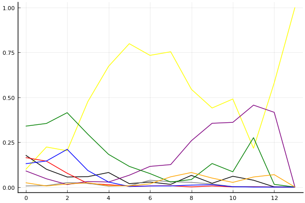
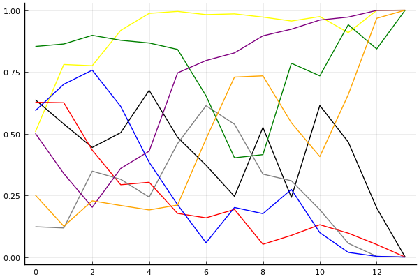

2017 듀얼 레이스 2 개인전 결승 1회전

## 경기 결과

| 트랙 | 김승태 | 문호준 | 신동이 | 이재인 | 김정제 | 유영혁 | 전대웅 | 유창현 |
|:---|---:|---:|---:|---:|---:|---:|---:|---:|
| [네모 장난감 선물공장](../present) | 10 | 1 | 4 | 3 | 0 | 5 | 7 | -1 |
| [월드 뉴욕 대질주](../newyork) | 3 | 1 | -1 | 10 | 0 | 4 | 5 | 7 |
| [비치 해변 드라이브](../haebyun) | 10 | 5 | 0 | 1 | 7 | 4 | -1 | 3 |
| [WKC 투어링 랠리](../rally) | 10 | 7 | 4 | 0 | 5 | 3 | -1 | 1 |
| [월드 파리 에펠탑 다이브](../eifel) | 5 | 0 | 1 | 7 | 10 | 3 | -1 | 4 |
| [해적 가파른 감시탑](../gamshi) | 1 | 3 | 4 | 7 | 5 | 0 | -1 | 10 |
| [네모 산타의 비밀공간](../santa) | 3 | 0 | 5 | 1 | 4 | -1 | 10 | 7 |
| [월드 두바이 다운타운](../dubai) | 0 | 10 | -1 | 1 | 7 | 5 | 3 | 4 |
| [차이나 서안 병마용](../byeongma) | 1 | -1 | 5 | 3 | 4 | 10 | 7 | 0 |
| [월드 리오 다운힐](../rio) | 5 | 10 | 7 | 0 | 4 | 3 | -1 | 1 |
| [월드 뉴욕 대질주](../newyork) | -1 | 3 | 5 | 0 | 4 | 10 | 1 | 7 |
| [WKC 투어링 랠리](../rally) | 10 | 1 | 3 | 0 | 5 | -1 | 4 | 7 |
| [해적 가파른 감시탑](../gamshi) | 10 | 0 | 7 | -1 | 1 | 5 | 3 | 4 |
| __total__ |__67__ |__40__ |__43__ |__32__ |__56__ |__50__ |__35__ |__54__ |

## 시뮬레이션

### 1st 확률

x축: 트랙, y축: 확률
1번: 옐로우, 2번: 블랙, 3번: 레드, 4번: 화이트(회색), 5번: 퍼플, 6번: 그린, 7번: 블루, 8번: 오렌지

| 트랙 | 김승태 | 문호준 | 신동이 | 이재인 | 김정제 | 유영혁 | 전대웅 | 유창현 |
|:---|---:|---:|---:|---:|---:|---:|---:|---:|
| 초기 | 0.091 | 0.170 | 0.165 | 0.009 | 0.093 | 0.357 | 0.124 | 0.015 |
| 네모 장난감 선물공장 | 0.231 | 0.104 | 0.143 | 0.003 | 0.045 | 0.329 | 0.157 | 0.005 |
| 월드 뉴욕 대질주 | 0.210 | 0.067 | 0.068 | 0.042 | 0.016 | 0.390 | 0.219 | 0.013 |
| 비치 해변 드라이브 | 0.435 | 0.063 | 0.028 | 0.014 | 0.035 | 0.352 | 0.089 | 0.013 |
| WKC 투어링 랠리 | 0.692 | 0.071 | 0.019 | 0.007 | 0.027 | 0.180 | 0.017 | 0.005 |
| 월드 파리 에펠탑 다이브 | 0.786 | 0.036 | 0.003 | 0.006 | 0.071 | 0.104 | 0.004 | 0.004 |
| 해적 가파른 감시탑 | 0.710 | 0.023 | 0.010 | 0.042 | 0.123 | 0.077 | 0.004 | 0.027 |
| 네모 산타의 비밀공간 | 0.726 | 0.016 | 0.006 | 0.031 | 0.136 | 0.036 | 0.011 | 0.059 |
| 월드 두바이 다운타운 | 0.566 | 0.056 | 0.001 | 0.013 | 0.265 | 0.049 | 0.010 | 0.072 |
| 차이나 서안 병마용 | 0.431 | 0.021 | 0.004 | 0.019 | 0.319 | 0.166 | 0.016 | 0.047 |
| 월드 리오 다운힐 | 0.477 | 0.055 | 0.006 | 0.005 | 0.374 | 0.089 | 0.004 | 0.016 |
| 월드 뉴욕 대질주 | 0.205 | 0.032 | 0.004 | 0.001 | 0.462 | 0.289 | 0.001 | 0.043 |
| WKC 투어링 랠리 | 0.620 | 0.000 | 0.000 | 0.000 | 0.365 | 0.017 | 0.000 | 0.061 |
| 해적 가파른 감시탑 | 1.000 | 0.000 | 0.000 | 0.000 | 0.000 | 0.000 | 0.000 | 0.000 |

### Advance 확률

x축: 트랙, y축: 확률
1번: 옐로우, 2번: 블랙, 3번: 레드, 4번: 화이트(회색), 5번: 퍼플, 6번: 그린, 7번: 블루, 8번: 오렌지

| 트랙 | 김승태 | 문호준 | 신동이 | 이재인 | 김정제 | 유영혁 | 전대웅 | 유창현 |
|:---|---:|---:|---:|---:|---:|---:|---:|---:|
| 초기 | 0.507 | 0.637 | 0.627 | 0.123 | 0.501 | 0.853 | 0.593 | 0.251 |
| 네모 장난감 선물공장 | 0.780 | 0.539 | 0.625 | 0.118 | 0.338 | 0.863 | 0.700 | 0.125 |
| 월드 뉴욕 대질주 | 0.775 | 0.444 | 0.433 | 0.348 | 0.202 | 0.898 | 0.757 | 0.228 |
| 비치 해변 드라이브 | 0.918 | 0.504 | 0.293 | 0.315 | 0.359 | 0.878 | 0.610 | 0.209 |
| WKC 투어링 랠리 | 0.987 | 0.675 | 0.303 | 0.243 | 0.429 | 0.867 | 0.384 | 0.191 |
| 월드 파리 에펠탑 다이브 | 0.995 | 0.485 | 0.177 | 0.460 | 0.746 | 0.841 | 0.212 | 0.211 |
| 해적 가파른 감시탑 | 0.982 | 0.372 | 0.159 | 0.613 | 0.796 | 0.653 | 0.058 | 0.479 |
| 네모 산타의 비밀공간 | 0.985 | 0.246 | 0.193 | 0.538 | 0.827 | 0.402 | 0.201 | 0.729 |
| 월드 두바이 다운타운 | 0.972 | 0.525 | 0.052 | 0.336 | 0.896 | 0.415 | 0.176 | 0.734 |
| 차이나 서안 병마용 | 0.956 | 0.242 | 0.088 | 0.309 | 0.923 | 0.785 | 0.274 | 0.544 |
| 월드 리오 다운힐 | 0.974 | 0.614 | 0.131 | 0.192 | 0.960 | 0.734 | 0.099 | 0.407 |
| 월드 뉴욕 대질주 | 0.909 | 0.466 | 0.097 | 0.056 | 0.972 | 0.941 | 0.019 | 0.658 |
| WKC 투어링 랠리 | 0.999 | 0.199 | 0.051 | 0.003 | 0.999 | 0.843 | 0.003 | 0.967 |
| 해적 가파른 감시탑 | 1.000 | 0.000 | 0.000 | 0.000 | 1.000 | 1.000 | 0.000 | 1.000 |

## 랭킹 변동

### [전체 랭킹](../singles-full)

| 순위 | 변동 | 이름 | 점수 | 변동 | mu | 변동 | sigma | 변동 |
|---:|---:|:---:|---:|---:|---:|---:|---:|---:|
| 1 / 35 | +0 | [유영혁](../yuyeonghyeok) | 3355 | -30 | 3608 | -46 | 84 | -5 |
| 2 / 35 | +3 | [김승태](../gimseungtae) | 3268 | +102 | 3547 | +69 | 93 | -11 |
| 3 / 35 | +3 | [김정제](../gimjeongje) | 3222 | +111 | 3514 | +59 | 97 | -17 |
| 4 / 35 | -1 | [문호준](../munhojun) | 3217 | -15 | 3495 | -50 | 93 | -12 |
| 5 / 35 | -1 | [신동이](../shindongi) | 3212 | +19 | 3504 | -32 | 97 | -17 |
| 6 / 35 | -4 | [전대웅](../jeondaewoong) | 3186 | -49 | 3443 | -66 | 86 | -6 |
| 7 / 35 | +0 | [유창현](../yuchanghyeon) | 3150 | +83 | 3404 | +65 | 85 | -6 |
| 8 / 35 | +2 | [이재인](../ijaein) | 3001 | +41 | 3269 | +14 | 89 | -9 |

### 시즌 랭킹

| 순위 | 변동 | 이름 | 점수 | 변동 | mu | 변동 | sigma | 변동 |
|---:|---:|:---:|---:|---:|---:|---:|---:|---:|
| 1 / 16 | +3 | [김승태](../gimseungtae) | 2993 | +212 | 3393 | -22 | 133 | -78 |
| 2 / 16 | -1 | [유영혁](../yuyeonghyeok) | 2886 | +54 | 3181 | +3 | 99 | -17 |
| 3 / 16 | -1 | [신동이](../shindongi) | 2868 | +50 | 3196 | -46 | 109 | -32 |
| 4 / 16 | +2 | [김정제](../gimjeongje) | 2866 | +153 | 3161 | +98 | 98 | -18 |
| 5 / 16 | -2 | [문호준](../munhojun) | 2809 | +27 | 3194 | -191 | 129 | -73 |
| 6 / 16 | -1 | [전대웅](../jeondaewoong) | 2765 | -11 | 3064 | -61 | 100 | -17 |
| 7 / 16 | +4 | [유창현](../yuchanghyeon) | 2761 | +198 | 3063 | +138 | 101 | -20 |
| 8 / 16 | +0 | [이재인](../ijaein) | 2694 | +66 | 3028 | -38 | 111 | -34 |

### 트랙 별 랭킹

#### [WKC 투어링 랠리](../rally)

| 순위 | 변동 | 이름 | 점수 | 변동 | mu | 변동 | sigma | 변동 |
|:---:|:---:|:---:|---:|---:|---:|---:|---:|---:|
| 1 / 16 | +13 | [김승태](../gimseungtae) | 2773 | +1684 | 3988 | +1125 | 405 | -186 |
| 2 / 16 | -1 | [김정제](../gimjeongje) | 2768 | +182 | 3663 | -140 | 298 | -108 |
| 3 / 16 | +1 | [문호준](../munhojun) | 2406 | +245 | 3530 | -744 | 375 | -330 |
| 5 / 16 | +5 | [신동이](../shindongi) | 2179 | +548 | 3101 | +144 | 307 | -135 |
| 6 / 16 | -4 | [유영혁](../yuyeonghyeok) | 2131 | -161 | 2986 | -392 | 285 | -77 |
| 8 / 16 | -2 | [전대웅](../jeondaewoong) | 2040 | +32 | 2897 | -220 | 286 | -84 |
| 9 / 16 | +6 | [유창현](../yuchanghyeon) | 1786 | +1206 | 2720 | +811 | 311 | -132 |
| 13 / 16 | +0 | [이재인](../ijaein) | 1658 | +232 | 2602 | -163 | 315 | -132 |

#### [네모 산타의 비밀공간](../santa)

| 순위 | 변동 | 이름 | 점수 | 변동 | mu | 변동 | sigma | 변동 |
|:---:|:---:|:---:|---:|---:|---:|---:|---:|---:|
| 2 / 16 | +1 | [신동이](../shindongi) | 2262 | +215 | 3340 | -64 | 359 | -93 |
| 3 / 16 | +3 | [전대웅](../jeondaewoong) | 2167 | +450 | 3104 | +330 | 312 | -40 |
| 5 / 16 | +3 | [김정제](../gimjeongje) | 1927 | +271 | 2853 | +111 | 309 | -53 |
| 6 / 16 | +8 | [유창현](../yuchanghyeon) | 1908 | +536 | 2902 | +343 | 331 | -64 |
| 7 / 16 | +8 | [김승태](../gimseungtae) | 1746 | +383 | 2995 | -142 | 416 | -175 |
| 8 / 16 | -3 | [유영혁](../yuyeonghyeok) | 1723 | -161 | 2677 | -274 | 318 | -38 |
| 9 / 16 | -7 | [문호준](../munhojun) | 1719 | -442 | 3100 | -1175 | 460 | -244 |
| 10 / 16 | +3 | [이재인](../ijaein) | 1674 | +236 | 2820 | -108 | 382 | -115 |

#### [네모 장난감 선물공장](../present)

| 순위 | 변동 | 이름 | 점수 | 변동 | mu | 변동 | sigma | 변동 |
|:---:|:---:|:---:|---:|---:|---:|---:|---:|---:|
| 1 / 16 | +4 | [전대웅](../jeondaewoong) | 2378 | +264 | 3346 | +104 | 323 | -53 |
| 5 / 16 | -4 | [유창현](../yuchanghyeon) | 2192 | -408 | 3185 | -567 | 331 | -53 |
| 6 / 16 | +2 | [유영혁](../yuyeonghyeok) | 2108 | +271 | 3028 | +122 | 307 | -50 |
| 8 / 16 | +2 | [이재인](../ijaein) | 1905 | +188 | 3051 | -171 | 382 | -120 |
| 10 / 16 | +6 | [김승태](../gimseungtae) | 1841 | +1480 | 3235 | +998 | 465 | -161 |
| 11 / 16 | +2 | [신동이](../shindongi) | 1749 | +493 | 2854 | +184 | 368 | -103 |
| 13 / 16 | -2 | [김정제](../gimjeongje) | 1554 | +135 | 2525 | -36 | 323 | -57 |
| 14 / 16 | +0 | [문호준](../munhojun) | 1500 | +410 | 2756 | -108 | 419 | -173 |

#### [비치 해변 드라이브](../haebyun)

| 순위 | 변동 | 이름 | 점수 | 변동 | mu | 변동 | sigma | 변동 |
|:---:|:---:|:---:|---:|---:|---:|---:|---:|---:|
| 1 / 35 | +0 | [유영혁](../yuyeonghyeok) | 3044 | -39 | 3768 | -111 | 241 | -24 |
| 2 / 35 | +1 | [김정제](../gimjeongje) | 2763 | +199 | 3662 | +63 | 300 | -45 |
| 4 / 35 | +9 | [김승태](../gimseungtae) | 2531 | +382 | 3397 | +287 | 288 | -32 |
| 6 / 35 | -1 | [이재인](../ijaein) | 2399 | +8 | 3236 | -108 | 279 | -39 |
| 9 / 35 | -3 | [신동이](../shindongi) | 2253 | -64 | 3159 | -205 | 302 | -47 |
| 10 / 35 | +10 | [문호준](../munhojun) | 2171 | +354 | 3036 | +223 | 288 | -44 |
| 14 / 35 | +0 | [유창현](../yuchanghyeon) | 2153 | +151 | 2881 | +77 | 243 | -25 |
| 15 / 35 | -6 | [전대웅](../jeondaewoong) | 2099 | -107 | 2891 | -171 | 264 | -21 |

#### [월드 뉴욕 대질주](../newyork)

| 순위 | 변동 | 이름 | 점수 | 변동 | mu | 변동 | sigma | 변동 |
|:---:|:---:|:---:|---:|---:|---:|---:|---:|---:|
| 1 / 16 | +1 | [유영혁](../yuyeonghyeok) | 2807 | +330 | 3687 | +98 | 293 | -77 |
| 2 / 16 | -1 | [전대웅](../jeondaewoong) | 2757 | -338 | 3680 | -765 | 308 | -143 |
| 4 / 16 | +5 | [유창현](../yuchanghyeon) | 2444 | +774 | 3300 | +509 | 285 | -88 |
| 5 / 16 | +3 | [이재인](../ijaein) | 2302 | +587 | 3293 | +138 | 330 | -150 |
| 9 / 16 | -5 | [김승태](../gimseungtae) | 1822 | -339 | 2975 | -1299 | 384 | -320 |
| 10 / 16 | +2 | [김정제](../gimjeongje) | 1765 | +437 | 2634 | +159 | 290 | -93 |
| 11 / 16 | +2 | [신동이](../shindongi) | 1698 | +418 | 2686 | +18 | 329 | -133 |
| 12 / 16 | +3 | [문호준](../munhojun) | 1659 | +1298 | 2726 | +489 | 356 | -270 |

#### [월드 두바이 다운타운](../dubai)

| 순위 | 변동 | 이름 | 점수 | 변동 | mu | 변동 | sigma | 변동 |
|:---:|:---:|:---:|---:|---:|---:|---:|---:|---:|
| 1 / 30 | +2 | [문호준](../munhojun) | 2793 | +318 | 3685 | +225 | 297 | -31 |
| 2 / 30 | +3 | [김정제](../gimjeongje) | 2694 | +245 | 3593 | +112 | 300 | -44 |
| 3 / 30 | -1 | [유창현](../yuchanghyeon) | 2667 | +63 | 3365 | -1 | 233 | -21 |
| 4 / 30 | -3 | [김승태](../gimseungtae) | 2529 | -111 | 3327 | -203 | 266 | -31 |
| 5 / 30 | -1 | [전대웅](../jeondaewoong) | 2508 | +52 | 3211 | -13 | 234 | -22 |
| 6 / 30 | +1 | [유영혁](../yuyeonghyeok) | 2507 | +163 | 3231 | +93 | 242 | -23 |
| 12 / 30 | +1 | [이재인](../ijaein) | 2100 | +116 | 2882 | +24 | 261 | -31 |
| 13 / 30 | -1 | [신동이](../shindongi) | 1955 | -147 | 2901 | -265 | 315 | -39 |

#### [월드 리오 다운힐](../rio)

| 순위 | 변동 | 이름 | 점수 | 변동 | mu | 변동 | sigma | 변동 |
|:---:|:---:|:---:|---:|---:|---:|---:|---:|---:|
| 1 / 30 | +2 | [문호준](../munhojun) | 3018 | +271 | 3857 | +197 | 280 | -25 |
| 2 / 30 | -1 | [유영혁](../yuyeonghyeok) | 2884 | -35 | 3654 | -119 | 257 | -28 |
| 3 / 30 | -1 | [김승태](../gimseungtae) | 2870 | +117 | 3671 | +23 | 267 | -31 |
| 4 / 30 | +0 | [신동이](../shindongi) | 2854 | +270 | 3805 | +114 | 317 | -52 |
| 5 / 30 | +0 | [유창현](../yuchanghyeon) | 2283 | +71 | 3076 | -19 | 264 | -30 |
| 7 / 30 | +7 | [김정제](../gimjeongje) | 2147 | +439 | 3152 | +219 | 335 | -73 |
| 9 / 30 | -1 | [이재인](../ijaein) | 2120 | +9 | 2975 | -98 | 285 | -36 |
| 10 / 30 | -1 | [전대웅](../jeondaewoong) | 2012 | -95 | 2809 | -155 | 266 | -20 |

#### [월드 파리 에펠탑 다이브](../eifel)

| 순위 | 변동 | 이름 | 점수 | 변동 | mu | 변동 | sigma | 변동 |
|:---:|:---:|:---:|---:|---:|---:|---:|---:|---:|
| 1 / 35 | +0 | [유창현](../yuchanghyeon) | 3240 | +56 | 3938 | -9 | 233 | -22 |
| 2 / 35 | +2 | [김승태](../gimseungtae) | 3090 | +181 | 3937 | +57 | 282 | -41 |
| 3 / 35 | -1 | [문호준](../munhojun) | 3028 | -94 | 3878 | -212 | 283 | -39 |
| 4 / 35 | +3 | [이재인](../ijaein) | 2941 | +269 | 3720 | +182 | 260 | -29 |
| 5 / 35 | +6 | [김정제](../gimjeongje) | 2941 | +568 | 3964 | +399 | 341 | -56 |
| 6 / 35 | +0 | [유영혁](../yuyeonghyeok) | 2904 | +101 | 3621 | +30 | 239 | -24 |
| 7 / 35 | -4 | [전대웅](../jeondaewoong) | 2900 | -141 | 3691 | -212 | 264 | -24 |
| 9 / 35 | -1 | [신동이](../shindongi) | 2742 | +95 | 3796 | -184 | 351 | -93 |

#### [차이나 서안 병마용](../byeongma)

| 순위 | 변동 | 이름 | 점수 | 변동 | mu | 변동 | sigma | 변동 |
|:---:|:---:|:---:|---:|---:|---:|---:|---:|---:|
| 1 / 16 | +3 | [유영혁](../yuyeonghyeok) | 2422 | +437 | 3368 | +318 | 316 | -40 |
| 2 / 16 | +1 | [신동이](../shindongi) | 2350 | +299 | 3472 | -15 | 374 | -105 |
| 3 / 16 | +4 | [전대웅](../jeondaewoong) | 2275 | +407 | 3237 | +242 | 321 | -55 |
| 4 / 16 | +2 | [김정제](../gimjeongje) | 2175 | +235 | 3132 | +63 | 319 | -57 |
| 5 / 16 | -4 | [유창현](../yuchanghyeon) | 2172 | -276 | 3308 | -560 | 379 | -95 |
| 9 / 16 | +3 | [이재인](../ijaein) | 1617 | +771 | 2902 | +218 | 428 | -185 |
| 10 / 16 | -8 | [문호준](../munhojun) | 1500 | -661 | 2988 | -1286 | 496 | -208 |
| 13 / 16 | NaN | [김승태](../gimseungtae) | 1349 | +1349 | 2894 | -106 | 515 | -485 |

#### [해적 가파른 감시탑](../gamshi)

| 순위 | 변동 | 이름 | 점수 | 변동 | mu | 변동 | sigma | 변동 |
|:---:|:---:|:---:|---:|---:|---:|---:|---:|---:|
| 1 / 16 | +0 | [신동이](../shindongi) | 2907 | +228 | 3970 | -538 | 354 | -255 |
| 2 / 16 | +4 | [김승태](../gimseungtae) | 2766 | +605 | 3937 | -338 | 390 | -314 |
| 3 / 16 | +2 | [김정제](../gimjeongje) | 2491 | +303 | 3335 | +11 | 281 | -97 |
| 4 / 16 | +6 | [유창현](../yuchanghyeon) | 2471 | +803 | 3333 | +524 | 287 | -93 |
| 5 / 16 | -3 | [유영혁](../yuyeonghyeok) | 2467 | +214 | 3309 | -35 | 281 | -83 |
| 8 / 16 | -1 | [문호준](../munhojun) | 2163 | +276 | 3216 | -547 | 351 | -275 |
| 9 / 16 | +0 | [이재인](../ijaein) | 2140 | +433 | 3084 | +63 | 315 | -123 |
| 10 / 16 | -2 | [전대웅](../jeondaewoong) | 1953 | +215 | 2813 | -8 | 287 | -74 |
