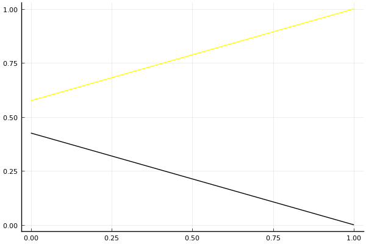

2017 듀얼 레이스 2 개인전 결승 2회전 tiebreaker

## 경기 결과

| 트랙 | 유영혁 | 유창현 |
|:---|---:|---:|
| [네모 장난감 선물공장](../present) | 1 | 0 |
| __total__ |__1__ |__0__ |

## 시뮬레이션

### 1st 확률

x축: 트랙, y축: 확률
1번: 옐로우, 2번: 블랙, 3번: 레드, 4번: 화이트(회색), 5번: 퍼플, 6번: 그린, 7번: 블루, 8번: 오렌지

| 트랙 | 유영혁 | 유창현 |
|:---|---:|---:|
| 초기 | 0.575 | 0.425 |
| 네모 장난감 선물공장 | 1.000 | 0.000 |

## 랭킹 변동

### [전체 랭킹](../singles-full)

| 순위 | 변동 | 이름 | 점수 | 변동 | mu | 변동 | sigma | 변동 |
|---:|---:|:---:|---:|---:|---:|---:|---:|---:|
| 1 / 35 | +0 | [유영혁](../yuyeonghyeok) | 3364 | +5 | 3614 | +6 | 83 | +0 |
| 6 / 35 | +0 | [유창현](../yuchanghyeon) | 3165 | -7 | 3417 | -6 | 84 | +0 |

### 시즌 랭킹

| 순위 | 변동 | 이름 | 점수 | 변동 | mu | 변동 | sigma | 변동 |
|---:|---:|:---:|---:|---:|---:|---:|---:|---:|
| 2 / 16 | +0 | [유영혁](../yuyeonghyeok) | 2933 | +9 | 3215 | +9 | 94 | +0 |
| 5 / 16 | +0 | [유창현](../yuchanghyeon) | 2796 | -9 | 3084 | -9 | 96 | -0 |

### 트랙 별 랭킹

#### [네모 장난감 선물공장](../present)

| 순위 | 변동 | 이름 | 점수 | 변동 | mu | 변동 | sigma | 변동 |
|:---:|:---:|:---:|---:|---:|---:|---:|---:|---:|
| 3 / 16 | +3 | [유영혁](../yuyeonghyeok) | 2254 | +145 | 3131 | +103 | 293 | -14 |
| 6 / 16 | -1 | [유창현](../yuchanghyeon) | 2125 | -67 | 3064 | -120 | 313 | -18 |
