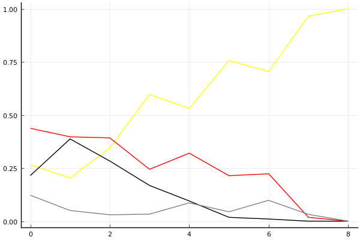
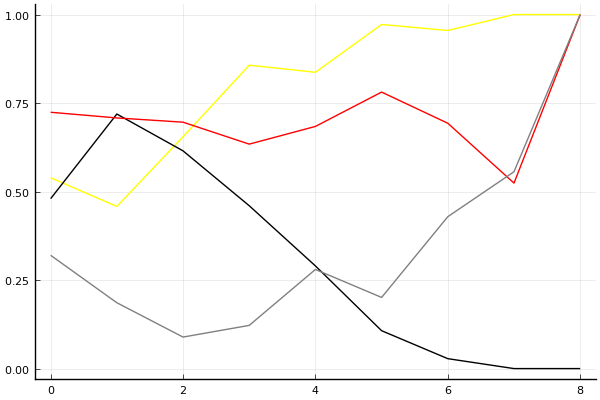

2017 듀얼 레이스 2 개인전 결승 2회전

## 경기 결과

| 트랙 | 김승태 | 김정제 | 유영혁 | 유창현 |
|:---|---:|---:|---:|---:|
| [WKC 투어링 랠리](../rally) | 5 | 10 | 7 | 4 |
| [차이나 서안 병마용](../byeongma) | 10 | 5 | 7 | 4 |
| [네모 산타의 비밀공간](../santa) | 10 | 4 | 5 | 7 |
| [월드 뉴욕 대질주](../newyork) | 5 | 4 | 7 | 10 |
| [월드 두바이 다운타운](../dubai) | 10 | 4 | 7 | 5 |
| [해적 가파른 감시탑](../gamshi) | 5 | 4 | 7 | 10 |
| [비치 해변 드라이브](../haebyun) | 10 | 4 | 5 | 7 |
| [월드 파리 에펠탑 다이브](../eifel) | 10 | -5 | 7 | 5 |
| __total__ |__65__ |__30__ |__52__ |__52__ |

## 시뮬레이션

### 1st 확률

x축: 트랙, y축: 확률
1번: 옐로우, 2번: 블랙, 3번: 레드, 4번: 화이트(회색), 5번: 퍼플, 6번: 그린, 7번: 블루, 8번: 오렌지

| 트랙 | 김승태 | 김정제 | 유영혁 | 유창현 |
|:---|---:|---:|---:|---:|
| 초기 | 0.265 | 0.215 | 0.437 | 0.122 |
| WKC 투어링 랠리 | 0.203 | 0.387 | 0.397 | 0.050 |
| 차이나 서안 병마용 | 0.345 | 0.283 | 0.392 | 0.030 |
| 네모 산타의 비밀공간 | 0.596 | 0.168 | 0.244 | 0.033 |
| 월드 뉴욕 대질주 | 0.531 | 0.095 | 0.320 | 0.086 |
| 월드 두바이 다운타운 | 0.756 | 0.018 | 0.214 | 0.044 |
| 해적 가파른 감시탑 | 0.704 | 0.010 | 0.223 | 0.098 |
| 비치 해변 드라이브 | 0.965 | 0.000 | 0.018 | 0.032 |
| 월드 파리 에펠탑 다이브 | 1.000 | 0.000 | 0.000 | 0.000 |

### Advance 확률

x축: 트랙, y축: 확률
1번: 옐로우, 2번: 블랙, 3번: 레드, 4번: 화이트(회색), 5번: 퍼플, 6번: 그린, 7번: 블루, 8번: 오렌지

| 트랙 | 김승태 | 김정제 | 유영혁 | 유창현 |
|:---|---:|---:|---:|---:|
| 초기 | 0.539 | 0.480 | 0.724 | 0.320 |
| WKC 투어링 랠리 | 0.458 | 0.719 | 0.708 | 0.186 |
| 차이나 서안 병마용 | 0.655 | 0.615 | 0.696 | 0.089 |
| 네모 산타의 비밀공간 | 0.857 | 0.460 | 0.634 | 0.122 |
| 월드 뉴욕 대질주 | 0.837 | 0.290 | 0.684 | 0.280 |
| 월드 두바이 다운타운 | 0.972 | 0.107 | 0.781 | 0.201 |
| 해적 가파른 감시탑 | 0.955 | 0.028 | 0.693 | 0.429 |
| 비치 해변 드라이브 | 1.000 | 0.000 | 0.524 | 0.556 |
| 월드 파리 에펠탑 다이브 | 1.000 | 0.000 | 1.000 | 1.000 |

## 랭킹 변동

### [전체 랭킹](../singles-full)

| 순위 | 변동 | 이름 | 점수 | 변동 | mu | 변동 | sigma | 변동 |
|---:|---:|:---:|---:|---:|---:|---:|---:|---:|
| 1 / 35 | +0 | [유영혁](../yuyeonghyeok) | 3358 | +3 | 3608 | -0 | 83 | -1 |
| 2 / 35 | +0 | [김승태](../gimseungtae) | 3338 | +70 | 3610 | +62 | 91 | -2 |
| 6 / 35 | +1 | [유창현](../yuchanghyeon) | 3172 | +22 | 3424 | +20 | 84 | -1 |
| 7 / 35 | -4 | [김정제](../gimjeongje) | 3139 | -83 | 3421 | -92 | 94 | -3 |

### 시즌 랭킹

| 순위 | 변동 | 이름 | 점수 | 변동 | mu | 변동 | sigma | 변동 |
|---:|---:|:---:|---:|---:|---:|---:|---:|---:|
| 1 / 16 | +0 | [김승태](../gimseungtae) | 3092 | +99 | 3452 | +59 | 120 | -14 |
| 2 / 16 | +0 | [유영혁](../yuyeonghyeok) | 2924 | +39 | 3206 | +24 | 94 | -5 |
| 5 / 16 | +2 | [유창현](../yuchanghyeon) | 2805 | +44 | 3093 | +30 | 96 | -4 |
| 6 / 16 | -2 | [김정제](../gimjeongje) | 2786 | -80 | 3072 | -90 | 95 | -3 |

### 트랙 별 랭킹

#### [WKC 투어링 랠리](../rally)

| 순위 | 변동 | 이름 | 점수 | 변동 | mu | 변동 | sigma | 변동 |
|:---:|:---:|:---:|---:|---:|---:|---:|---:|---:|
| 1 / 16 | +1 | [김정제](../gimjeongje) | 2922 | +154 | 3766 | +103 | 281 | -17 |
| 2 / 16 | -1 | [김승태](../gimseungtae) | 2621 | -153 | 3668 | -320 | 349 | -56 |
| 4 / 16 | +2 | [유영혁](../yuyeonghyeok) | 2319 | +189 | 3110 | +125 | 264 | -21 |
| 10 / 16 | -1 | [유창현](../yuchanghyeon) | 1761 | -25 | 2649 | -71 | 296 | -15 |

#### [네모 산타의 비밀공간](../santa)

| 순위 | 변동 | 이름 | 점수 | 변동 | mu | 변동 | sigma | 변동 |
|:---:|:---:|:---:|---:|---:|---:|---:|---:|---:|
| 4 / 16 | +3 | [김승태](../gimseungtae) | 2123 | +377 | 3236 | +241 | 371 | -45 |
| 5 / 16 | +1 | [유창현](../yuchanghyeon) | 2055 | +147 | 2952 | +50 | 299 | -32 |
| 7 / 16 | -2 | [김정제](../gimjeongje) | 1822 | -105 | 2682 | -171 | 287 | -22 |
| 8 / 16 | +0 | [유영혁](../yuyeonghyeok) | 1806 | +84 | 2672 | -5 | 289 | -30 |

#### [비치 해변 드라이브](../haebyun)

| 순위 | 변동 | 이름 | 점수 | 변동 | mu | 변동 | sigma | 변동 |
|:---:|:---:|:---:|---:|---:|---:|---:|---:|---:|
| 1 / 35 | +0 | [유영혁](../yuyeonghyeok) | 2999 | -45 | 3676 | -91 | 226 | -15 |
| 2 / 35 | +2 | [김승태](../gimseungtae) | 2729 | +198 | 3537 | +140 | 269 | -19 |
| 3 / 35 | -1 | [김정제](../gimjeongje) | 2637 | -126 | 3466 | -196 | 276 | -23 |
| 7 / 35 | +7 | [유창현](../yuchanghyeon) | 2322 | +169 | 3003 | +122 | 227 | -16 |

#### [월드 뉴욕 대질주](../newyork)

| 순위 | 변동 | 이름 | 점수 | 변동 | mu | 변동 | sigma | 변동 |
|:---:|:---:|:---:|---:|---:|---:|---:|---:|---:|
| 1 / 16 | +0 | [유영혁](../yuyeonghyeok) | 2817 | +10 | 3630 | -56 | 271 | -22 |
| 3 / 16 | +1 | [유창현](../yuchanghyeon) | 2641 | +197 | 3446 | +146 | 268 | -17 |
| 8 / 16 | +1 | [김승태](../gimseungtae) | 1935 | +113 | 2954 | -21 | 340 | -45 |
| 10 / 16 | +0 | [김정제](../gimjeongje) | 1723 | -42 | 2550 | -84 | 276 | -14 |

#### [월드 두바이 다운타운](../dubai)

| 순위 | 변동 | 이름 | 점수 | 변동 | mu | 변동 | sigma | 변동 |
|:---:|:---:|:---:|---:|---:|---:|---:|---:|---:|
| 2 / 30 | +2 | [김승태](../gimseungtae) | 2706 | +177 | 3457 | +130 | 250 | -16 |
| 3 / 30 | +0 | [유창현](../yuchanghyeon) | 2679 | +12 | 3337 | -28 | 219 | -14 |
| 4 / 30 | +2 | [유영혁](../yuyeonghyeok) | 2604 | +97 | 3283 | +52 | 227 | -15 |
| 5 / 30 | -3 | [김정제](../gimjeongje) | 2565 | -129 | 3395 | -199 | 277 | -23 |

#### [월드 파리 에펠탑 다이브](../eifel)

| 순위 | 변동 | 이름 | 점수 | 변동 | mu | 변동 | sigma | 변동 |
|:---:|:---:|:---:|---:|---:|---:|---:|---:|---:|
| 1 / 35 | +1 | [김승태](../gimseungtae) | 3266 | +175 | 4060 | +123 | 265 | -17 |
| 2 / 35 | -1 | [유창현](../yuchanghyeon) | 3234 | -6 | 3892 | -46 | 219 | -13 |
| 4 / 35 | +2 | [유영혁](../yuyeonghyeok) | 3014 | +111 | 3689 | +68 | 225 | -14 |
| 8 / 35 | -3 | [김정제](../gimjeongje) | 2815 | -126 | 3744 | -220 | 310 | -31 |

#### [차이나 서안 병마용](../byeongma)

| 순위 | 변동 | 이름 | 점수 | 변동 | mu | 변동 | sigma | 변동 |
|:---:|:---:|:---:|---:|---:|---:|---:|---:|---:|
| 1 / 16 | +0 | [유영혁](../yuyeonghyeok) | 2523 | +101 | 3385 | +16 | 287 | -28 |
| 4 / 16 | +0 | [김정제](../gimjeongje) | 2239 | +63 | 3106 | -26 | 289 | -30 |
| 5 / 16 | +8 | [김승태](../gimseungtae) | 2106 | +756 | 3390 | +495 | 428 | -87 |
| 6 / 16 | -1 | [유창현](../yuchanghyeon) | 2033 | -139 | 3053 | -255 | 340 | -39 |

#### [해적 가파른 감시탑](../gamshi)

| 순위 | 변동 | 이름 | 점수 | 변동 | mu | 변동 | sigma | 변동 |
|:---:|:---:|:---:|---:|---:|---:|---:|---:|---:|
| 2 / 16 | +0 | [김승태](../gimseungtae) | 2702 | -64 | 3708 | -229 | 335 | -55 |
| 3 / 16 | +1 | [유창현](../yuchanghyeon) | 2697 | +226 | 3500 | +167 | 268 | -19 |
| 4 / 16 | +1 | [유영혁](../yuyeonghyeok) | 2608 | +141 | 3383 | +74 | 258 | -22 |
| 5 / 16 | -2 | [김정제](../gimjeongje) | 2424 | -67 | 3219 | -116 | 265 | -16 |
