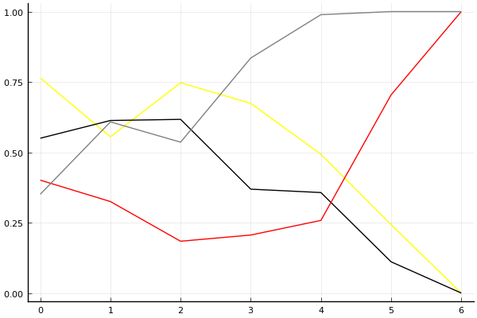

2018 듀얼 레이스 X 개인전 2회전

## 경기 결과

| 트랙 | 문호준 | 유영혁 | 이재혁 | 박인수 |
|:---|---:|---:|---:|---:|
| [도검 용의 길](../daagon) | 4 | 7 | 5 | 10 |
| [도검 구름의 협곡](../hyupgog) | 10 | 7 | 4 | 5 |
| [사막 빙글빙글 공사장](../sabing) | 5 | 4 | 7 | 10 |
| [팩토리 미완성 5구역](../district5) | 4 | 5 | 7 | 10 |
| [비치 해변 드라이브](../haebyun) | 5 | 4 | 10 | 7 |
| [네모 산타의 비밀공간](../santa) | 4 | 7 | 5 | 10 |
| __total__ |__32__ |__34__ |__38__ |__52__ |

## 시뮬레이션

### 1st 확률

x축: 트랙, y축: 확률
1번: 옐로우, 2번: 블랙, 3번: 레드, 4번: 화이트(회색), 5번: 퍼플, 6번: 그린, 7번: 블루, 8번: 오렌지

| 트랙 | 문호준 | 유영혁 | 이재혁 | 박인수 |
|:---|---:|---:|---:|---:|
| 초기 | 0.513 | 0.242 | 0.142 | 0.149 |
| 도검 용의 길 | 0.313 | 0.319 | 0.127 | 0.293 |
| 도검 구름의 협곡 | 0.507 | 0.276 | 0.055 | 0.218 |
| 사막 빙글빙글 공사장 | 0.345 | 0.142 | 0.070 | 0.489 |
| 팩토리 미완성 5구역 | 0.098 | 0.055 | 0.040 | 0.842 |
| 비치 해변 드라이브 | 0.000 | 0.000 | 0.047 | 0.984 |
| 네모 산타의 비밀공간 | 0.000 | 0.000 | 0.000 | 1.000 |

### Advance 확률

x축: 트랙, y축: 확률
1번: 옐로우, 2번: 블랙, 3번: 레드, 4번: 화이트(회색), 5번: 퍼플, 6번: 그린, 7번: 블루, 8번: 오렌지

| 트랙 | 문호준 | 유영혁 | 이재혁 | 박인수 |
|:---|---:|---:|---:|---:|
| 초기 | 0.764 | 0.550 | 0.401 | 0.351 |
| 도검 용의 길 | 0.555 | 0.613 | 0.325 | 0.608 |
| 도검 구름의 협곡 | 0.747 | 0.617 | 0.184 | 0.536 |
| 사막 빙글빙글 공사장 | 0.674 | 0.369 | 0.206 | 0.835 |
| 팩토리 미완성 5구역 | 0.493 | 0.357 | 0.258 | 0.989 |
| 비치 해변 드라이브 | 0.243 | 0.111 | 0.704 | 1.000 |
| 네모 산타의 비밀공간 | 0.000 | 0.000 | 1.000 | 1.000 |

## 랭킹 변동

### [전체 랭킹](../singles-full)

| 순위 | 변동 | 이름 | 점수 | 변동 | mu | 변동 | sigma | 변동 |
|---:|---:|:---:|---:|---:|---:|---:|---:|---:|
| 1 / 61 | +0 | [문호준](../munhojun) | 3434 | -48 | 3674 | -47 | 80 | +0 |
| 2 / 61 | +0 | [유영혁](../yuyeonghyeok) | 3355 | -20 | 3591 | -19 | 79 | +0 |
| 3 / 61 | +1 | [박인수](../bakinsu) | 3327 | +54 | 3563 | +56 | 79 | +1 |
| 4 / 61 | -1 | [이재혁](../ijaehyeok) | 3295 | +7 | 3532 | +8 | 79 | +0 |

### 시즌 랭킹

| 순위 | 변동 | 이름 | 점수 | 변동 | mu | 변동 | sigma | 변동 |
|---:|---:|:---:|---:|---:|---:|---:|---:|---:|
| 1 / 8 | +0 | [박인수](../bakinsu) | 3142 | +257 | 3692 | +120 | 183 | -46 |
| 2 / 8 | +1 | [이재혁](../ijaehyeok) | 2758 | +184 | 3279 | +42 | 174 | -47 |
| 3 / 8 | -1 | [문호준](../munhojun) | 2611 | -43 | 3142 | -182 | 177 | -46 |
| 4 / 8 | +0 | [유영혁](../yuyeonghyeok) | 2583 | +163 | 3102 | +25 | 173 | -46 |

### 트랙 별 랭킹

#### [네모 산타의 비밀공간](../santa)

| 순위 | 변동 | 이름 | 점수 | 변동 | mu | 변동 | sigma | 변동 |
|:---:|:---:|:---:|---:|---:|---:|---:|---:|---:|
| 1 / 45 | +1 | [유영혁](../yuyeonghyeok) | 2739 | +21 | 3209 | +6 | 156 | -5 |
| 2 / 45 | -1 | [문호준](../munhojun) | 2714 | -65 | 3256 | -84 | 180 | -6 |
| 6 / 45 | +0 | [이재혁](../ijaehyeok) | 2622 | +1 | 3138 | -19 | 172 | -7 |
| 13 / 45 | +1 | [박인수](../bakinsu) | 2352 | +111 | 2883 | +92 | 177 | -6 |

#### [도검 구름의 협곡](../hyupgog)

| 순위 | 변동 | 이름 | 점수 | 변동 | mu | 변동 | sigma | 변동 |
|:---:|:---:|:---:|---:|---:|---:|---:|---:|---:|
| 1 / 8 | +2 | [문호준](../munhojun) | 2474 | +851 | 3978 | +555 | 502 | -99 |
| 2 / 8 | +0 | [유영혁](../yuyeonghyeok) | 2334 | +447 | 3813 | +50 | 493 | -132 |
| 3 / 8 | -2 | [박인수](../bakinsu) | 2061 | -100 | 3667 | -607 | 535 | -169 |
| 6 / 8 | +0 | [이재혁](../ijaehyeok) | 786 | +10 | 2417 | -160 | 543 | -57 |

#### [도검 용의 길](../daagon)

| 순위 | 변동 | 이름 | 점수 | 변동 | mu | 변동 | sigma | 변동 |
|:---:|:---:|:---:|---:|---:|---:|---:|---:|---:|
| 1 / 8 | +0 | [박인수](../bakinsu) | 2474 | +313 | 4405 | +131 | 644 | -61 |
| 4 / 8 | +2 | [유영혁](../yuyeonghyeok) | 1391 | +615 | 2891 | +314 | 500 | -100 |
| 6 / 8 | +1 | [이재혁](../ijaehyeok) | 893 | +532 | 2386 | +149 | 498 | -128 |
| 7 / 8 | -2 | [문호준](../munhojun) | 837 | -252 | 2334 | -529 | 499 | -92 |

#### [비치 해변 드라이브](../haebyun)

| 순위 | 변동 | 이름 | 점수 | 변동 | mu | 변동 | sigma | 변동 |
|:---:|:---:|:---:|---:|---:|---:|---:|---:|---:|
| 2 / 37 | +0 | [유영혁](../yuyeonghyeok) | 2805 | -81 | 3417 | -106 | 204 | -9 |
| 3 / 37 | +2 | [박인수](../bakinsu) | 2637 | +97 | 3389 | +36 | 250 | -20 |
| 5 / 37 | +4 | [이재혁](../ijaehyeok) | 2604 | +253 | 3472 | +180 | 289 | -24 |
| 8 / 37 | +0 | [문호준](../munhojun) | 2435 | +58 | 3159 | +3 | 241 | -18 |

#### [사막 빙글빙글 공사장](../sabing)

| 순위 | 변동 | 이름 | 점수 | 변동 | mu | 변동 | sigma | 변동 |
|:---:|:---:|:---:|---:|---:|---:|---:|---:|---:|
| 1 / 8 | +0 | [이재혁](../ijaehyeok) | 2426 | +265 | 3998 | -276 | 524 | -180 |
| 2 / 8 | +2 | [박인수](../bakinsu) | 2338 | +975 | 3813 | +677 | 492 | -100 |
| 3 / 8 | -1 | [문호준](../munhojun) | 1995 | +108 | 3489 | -274 | 498 | -127 |
| 5 / 8 | +0 | [유영혁](../yuyeonghyeok) | 1060 | -30 | 2626 | -237 | 522 | -69 |

#### [팩토리 미완성 5구역](../district5)

| 순위 | 변동 | 이름 | 점수 | 변동 | mu | 변동 | sigma | 변동 |
|:---:|:---:|:---:|---:|---:|---:|---:|---:|---:|
| 1 / 59 | +0 | [이재혁](../ijaehyeok) | 3266 | +49 | 3886 | +15 | 207 | -11 |
| 2 / 59 | +2 | [박인수](../bakinsu) | 3163 | +126 | 3777 | +100 | 205 | -9 |
| 3 / 59 | +0 | [유영혁](../yuyeonghyeok) | 3135 | +13 | 3768 | -24 | 211 | -12 |
| 4 / 59 | -2 | [문호준](../munhojun) | 3100 | -80 | 3776 | -115 | 226 | -12 |
