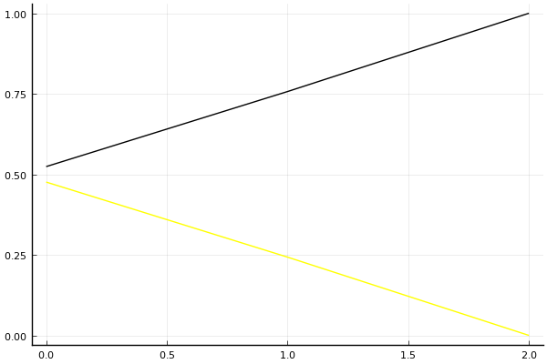

2018 듀얼 레이스 X 개인전 3회전

## 경기 결과

| 트랙 | 이재혁 | 박인수 |
|:---|---:|---:|
| [도검 구름의 협곡](../hyupgog) | 0 | 1 |
| [팩토리 미완성 5구역](../district5) | 0 | 1 |
| __total__ |__0__ |__2__ |

## 시뮬레이션

### 1st 확률

x축: 트랙, y축: 확률
1번: 옐로우, 2번: 블랙, 3번: 레드, 4번: 화이트(회색), 5번: 퍼플, 6번: 그린, 7번: 블루, 8번: 오렌지

| 트랙 | 이재혁 | 박인수 |
|:---|---:|---:|
| 초기 | 0.476 | 0.524 |
| 도검 구름의 협곡 | 0.243 | 0.757 |
| 팩토리 미완성 5구역 | 0.000 | 1.000 |

## 랭킹 변동

### [전체 랭킹](../singles-full)

| 순위 | 변동 | 이름 | 점수 | 변동 | mu | 변동 | sigma | 변동 |
|---:|---:|:---:|---:|---:|---:|---:|---:|---:|
| 3 / 61 | +0 | [박인수](../bakinsu) | 3338 | +11 | 3576 | +13 | 79 | +1 |
| 4 / 61 | +0 | [이재혁](../ijaehyeok) | 3280 | -15 | 3518 | -14 | 79 | +1 |

### 시즌 랭킹

| 순위 | 변동 | 이름 | 점수 | 변동 | mu | 변동 | sigma | 변동 |
|---:|---:|:---:|---:|---:|---:|---:|---:|---:|
| 1 / 8 | +0 | [박인수](../bakinsu) | 3198 | +56 | 3733 | +42 | 178 | -5 |
| 2 / 8 | +0 | [이재혁](../ijaehyeok) | 2733 | -26 | 3241 | -37 | 170 | -4 |

### 트랙 별 랭킹

#### [도검 구름의 협곡](../hyupgog)

| 순위 | 변동 | 이름 | 점수 | 변동 | mu | 변동 | sigma | 변동 |
|:---:|:---:|:---:|---:|---:|---:|---:|---:|---:|
| 3 / 8 | +0 | [박인수](../bakinsu) | 2188 | +128 | 3727 | +60 | 513 | -22 |
| 6 / 8 | +0 | [이재혁](../ijaehyeok) | 794 | +8 | 2354 | -62 | 520 | -23 |

#### [팩토리 미완성 5구역](../district5)

| 순위 | 변동 | 이름 | 점수 | 변동 | mu | 변동 | sigma | 변동 |
|:---:|:---:|:---:|---:|---:|---:|---:|---:|---:|
| 1 / 59 | +0 | [이재혁](../ijaehyeok) | 3231 | -35 | 3836 | -50 | 202 | -5 |
| 2 / 59 | +0 | [박인수](../bakinsu) | 3226 | +63 | 3826 | +49 | 200 | -5 |
