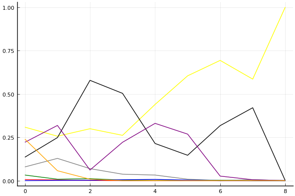
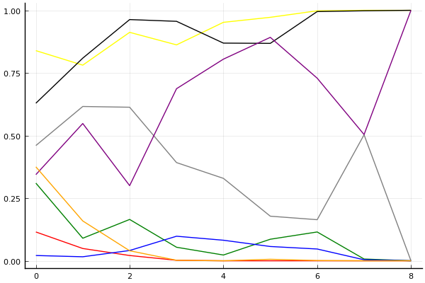
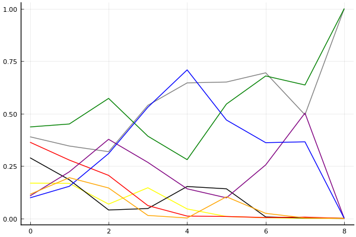

2018 듀얼 레이스 3 개인전 32강 A조

## 경기 결과

| 트랙 | 유영혁 | 이재혁 | 한승철 | 김정제 | 김응태 | 이중선 | 배성빈 | 박창규 |
|:---|---:|---:|---:|---:|---:|---:|---:|---:|
| [공동묘지 해골 손가락](../haeson) | 4 | 10 | 0 | 7 | 5 | -1 | 3 | 1 |
| [광산 위험한 제련소](../jeryeonso) | 7 | 10 | -1 | 3 | 1 | 5 | 4 | 0 |
| [대저택 은밀한 지하실](../jeotaek) | 5 | 4 | 0 | 3 | 10 | 1 | 7 | -1 |
| [네모 산타의 비밀공간](../santa) | 10 | 1 | -1 | 5 | 7 | 3 | 4 | 0 |
| [팩토리 미완성 5구역](../district5) | 5 | 1 | 3 | -1 | 4 | 7 | 0 | 10 |
| [아이스 설산 다운힐](../seolsan) | 7 | 10 | 4 | 3 | 0 | 5 | 1 | -1 |
| [노르테유 익스프레스](../noex) | 5 | 7 | 4 | 10 | 3 | 0 | 1 | -1 |
| [포레스트 지그재그](../zigzag) | 10 | 7 | 4 | 0 | 1 | 5 | 3 | -1 |
| __total__ |__53__ |__50__ |__13__ |__30__ |__31__ |__25__ |__23__ |__7__ |

## 시뮬레이션

### 1st 확률

x축: 트랙, y축: 확률
1번: 옐로우, 2번: 블랙, 3번: 레드, 4번: 화이트(회색), 5번: 퍼플, 6번: 그린, 7번: 블루, 8번: 오렌지

| 트랙 | 유영혁 | 이재혁 | 한승철 | 김정제 | 김응태 | 이중선 | 배성빈 | 박창규 |
|:---|---:|---:|---:|---:|---:|---:|---:|---:|
| 초기 | 0.319 | 0.131 | 0.007 | 0.091 | 0.225 | 0.033 | 0.000 | 0.217 |
| 공동묘지 해골 손가락 | 0.268 | 0.277 | 0.003 | 0.106 | 0.293 | 0.011 | 0.004 | 0.063 |
| 광산 위험한 제련소 | 0.294 | 0.573 | 0.001 | 0.070 | 0.063 | 0.011 | 0.003 | 0.002 |
| 대저택 은밀한 지하실 | 0.256 | 0.479 | 0.001 | 0.035 | 0.249 | 0.001 | 0.007 | 0.000 |
| 네모 산타의 비밀공간 | 0.459 | 0.206 | 0.000 | 0.026 | 0.346 | 0.000 | 0.007 | 0.000 |
| 팩토리 미완성 5구역 | 0.592 | 0.134 | 0.000 | 0.011 | 0.284 | 0.003 | 0.002 | 0.000 |
| 아이스 설산 다운힐 | 0.699 | 0.297 | 0.000 | 0.004 | 0.026 | 0.001 | 0.000 | 0.000 |
| 노르테유 익스프레스 | 0.611 | 0.395 | 0.000 | 0.002 | 0.003 | 0.001 | 0.000 | 0.000 |
| 포레스트 지그재그 | 1.000 | 0.000 | 0.000 | 0.000 | 0.000 | 0.000 | 0.000 | 0.000 |

### Advance 확률

x축: 트랙, y축: 확률
1번: 옐로우, 2번: 블랙, 3번: 레드, 4번: 화이트(회색), 5번: 퍼플, 6번: 그린, 7번: 블루, 8번: 오렌지

| 트랙 | 유영혁 | 이재혁 | 한승철 | 김정제 | 김응태 | 이중선 | 배성빈 | 박창규 |
|:---|---:|---:|---:|---:|---:|---:|---:|---:|
| 초기 | 0.807 | 0.628 | 0.132 | 0.494 | 0.350 | 0.300 | 0.023 | 0.355 |
| 공동묘지 해골 손가락 | 0.813 | 0.799 | 0.032 | 0.600 | 0.551 | 0.107 | 0.027 | 0.152 |
| 광산 위험한 제련소 | 0.929 | 0.959 | 0.019 | 0.658 | 0.234 | 0.169 | 0.059 | 0.035 |
| 대저택 은밀한 지하실 | 0.849 | 0.952 | 0.003 | 0.402 | 0.693 | 0.056 | 0.104 | 0.000 |
| 네모 산타의 비밀공간 | 0.954 | 0.846 | 0.000 | 0.317 | 0.852 | 0.013 | 0.080 | 0.001 |
| 팩토리 미완성 5구역 | 0.991 | 0.857 | 0.000 | 0.170 | 0.895 | 0.079 | 0.058 | 0.013 |
| 아이스 설산 다운힐 | 0.997 | 0.993 | 0.000 | 0.174 | 0.729 | 0.122 | 0.044 | 0.000 |
| 노르테유 익스프레스 | 1.000 | 0.998 | 0.000 | 0.504 | 0.495 | 0.010 | 0.005 | 0.000 |
| 포레스트 지그재그 | 1.000 | 1.000 | 0.000 | 0.000 | 1.000 | 0.000 | 0.000 | 0.000 |

### Repechage 확률

x축: 트랙, y축: 확률
1번: 옐로우, 2번: 블랙, 3번: 레드, 4번: 화이트(회색), 5번: 퍼플, 6번: 그린, 7번: 블루, 8번: 오렌지

| 트랙 | 유영혁 | 이재혁 | 한승철 | 김정제 | 김응태 | 이중선 | 배성빈 | 박창규 |
|:---|---:|---:|---:|---:|---:|---:|---:|---:|
| 초기 | 0.168 | 0.289 | 0.363 | 0.389 | 0.107 | 0.436 | 0.098 | 0.115 |
| 공동묘지 해골 손가락 | 0.167 | 0.184 | 0.278 | 0.345 | 0.222 | 0.450 | 0.153 | 0.194 |
| 광산 위험한 제련소 | 0.068 | 0.040 | 0.205 | 0.318 | 0.377 | 0.572 | 0.309 | 0.145 |
| 대저택 은밀한 지하실 | 0.146 | 0.047 | 0.061 | 0.539 | 0.267 | 0.392 | 0.530 | 0.014 |
| 네모 산타의 비밀공간 | 0.045 | 0.152 | 0.011 | 0.646 | 0.141 | 0.280 | 0.708 | 0.002 |
| 팩토리 미완성 5구역 | 0.009 | 0.141 | 0.009 | 0.650 | 0.098 | 0.545 | 0.469 | 0.103 |
| 아이스 설산 다운힐 | 0.003 | 0.007 | 0.004 | 0.694 | 0.255 | 0.679 | 0.361 | 0.024 |
| 노르테유 익스프레스 | 0.000 | 0.002 | 0.006 | 0.494 | 0.502 | 0.636 | 0.365 | 0.002 |
| 포레스트 지그재그 | 0.000 | 0.000 | 0.000 | 1.000 | 0.000 | 1.000 | 0.000 | 0.000 |

## 랭킹 변동

### [전체 랭킹](../singles-full)

| 순위 | 변동 | 이름 | 점수 | 변동 | mu | 변동 | sigma | 변동 |
|---:|---:|:---:|---:|---:|---:|---:|---:|---:|
| 1 / 55 | +0 | [유영혁](../yuyeonghyeok) | 3388 | +28 | 3628 | +25 | 80 | -1 |
| 4 / 55 | +1 | [이재혁](../ijaehyeok) | 3242 | +49 | 3497 | +41 | 85 | -3 |
| 9 / 55 | -2 | [김정제](../gimjeongje) | 3119 | -19 | 3363 | -23 | 81 | -2 |
| 12 / 55 | -1 | [이중선](../ijungseon) | 2991 | -4 | 3258 | -17 | 89 | -5 |
| 19 / 55 | -1 | [한승철](../hanseungcheol) | 2726 | -23 | 3051 | -63 | 108 | -14 |
| 23 / 55 | NaN | [김응태](../gimeungtae) | 2673 | +2673 | 3282 | +282 | 203 | -797 |
| 27 / 55 | +11 | [배성빈](../baeseongbin) | 2565 | +494 | 3027 | +260 | 154 | -78 |
| 44 / 55 | NaN | [박창규](../bakchanggyu) | 1967 | +1967 | 2638 | -362 | 224 | -776 |

### 시즌 랭킹

| 순위 | 변동 | 이름 | 점수 | 변동 | mu | 변동 | sigma | 변동 |
|---:|---:|:---:|---:|---:|---:|---:|---:|---:|
| 1 / 8 | NaN | [유영혁](../yuyeonghyeok) | 2983 | +2983 | 3665 | +665 | 228 | -772 |
| 2 / 8 | NaN | [이재혁](../ijaehyeok) | 2766 | +2766 | 3467 | +467 | 234 | -766 |
| 3 / 8 | NaN | [김응태](../gimeungtae) | 2424 | +2424 | 3075 | +75 | 217 | -783 |
| 4 / 8 | NaN | [김정제](../gimjeongje) | 2352 | +2352 | 3016 | +16 | 221 | -779 |
| 5 / 8 | NaN | [이중선](../ijungseon) | 2342 | +2342 | 3005 | +5 | 221 | -779 |
| 6 / 8 | NaN | [배성빈](../baeseongbin) | 2303 | +2303 | 2939 | -61 | 212 | -788 |
| 7 / 8 | NaN | [한승철](../hanseungcheol) | 1986 | +1986 | 2676 | -324 | 230 | -770 |
| 8 / 8 | NaN | [박창규](../bakchanggyu) | 1480 | +1480 | 2233 | -767 | 251 | -749 |

### 트랙 별 랭킹

#### [공동묘지 해골 손가락](../haeson)

| 순위 | 변동 | 이름 | 점수 | 변동 | mu | 변동 | sigma | 변동 |
|:---:|:---:|:---:|---:|---:|---:|---:|---:|---:|
| 1 / 19 | +0 | [이재혁](../ijaehyeok) | 3135 | +282 | 4235 | +170 | 367 | -37 |
| 4 / 19 | +0 | [유영혁](../yuyeonghyeok) | 2401 | +118 | 3366 | -28 | 322 | -49 |
| 5 / 19 | +3 | [김정제](../gimjeongje) | 2348 | +528 | 3435 | +329 | 362 | -66 |
| 9 / 19 | NaN | [김응태](../gimeungtae) | 1868 | +1868 | 3465 | +465 | 532 | -468 |
| 10 / 19 | -1 | [한승철](../hanseungcheol) | 1680 | -32 | 2777 | -236 | 366 | -68 |
| 12 / 19 | NaN | [배성빈](../baeseongbin) | 1433 | +1433 | 3029 | +29 | 532 | -468 |
| 14 / 19 | -2 | [이중선](../ijungseon) | 1204 | -174 | 2421 | -376 | 406 | -67 |
| 15 / 19 | NaN | [박창규](../bakchanggyu) | 1196 | +1196 | 2806 | -194 | 537 | -463 |

#### [광산 위험한 제련소](../jeryeonso)

| 순위 | 변동 | 이름 | 점수 | 변동 | mu | 변동 | sigma | 변동 |
|:---:|:---:|:---:|---:|---:|---:|---:|---:|---:|
| 1 / 30 | +0 | [유영혁](../yuyeonghyeok) | 3121 | -46 | 4056 | -172 | 312 | -42 |
| 10 / 30 | +2 | [이중선](../ijungseon) | 2162 | +314 | 3227 | +96 | 355 | -73 |
| 12 / 30 | +7 | [이재혁](../ijaehyeok) | 1973 | +876 | 3076 | +674 | 368 | -67 |
| 14 / 30 | +3 | [배성빈](../baeseongbin) | 1795 | +433 | 3088 | -48 | 431 | -160 |
| 15 / 30 | -2 | [김정제](../gimjeongje) | 1787 | +130 | 2773 | -21 | 329 | -51 |
| 22 / 30 | NaN | [김응태](../gimeungtae) | 850 | +850 | 2511 | -489 | 553 | -447 |
| 24 / 30 | NaN | [박창규](../bakchanggyu) | 432 | +432 | 2174 | -826 | 580 | -420 |
| 25 / 30 | -2 | [한승철](../hanseungcheol) | 425 | -91 | 1627 | -218 | 401 | -42 |

#### [네모 산타의 비밀공간](../santa)

| 순위 | 변동 | 이름 | 점수 | 변동 | mu | 변동 | sigma | 변동 |
|:---:|:---:|:---:|---:|---:|---:|---:|---:|---:|
| 2 / 37 | +4 | [유영혁](../yuyeonghyeok) | 2536 | +160 | 3148 | +132 | 204 | -9 |
| 3 / 37 | +1 | [김정제](../gimjeongje) | 2531 | +76 | 3180 | +31 | 216 | -15 |
| 10 / 37 | +0 | [이중선](../ijungseon) | 2248 | +1 | 3231 | -194 | 328 | -65 |
| 11 / 37 | +1 | [이재혁](../ijaehyeok) | 2071 | +31 | 2774 | -26 | 234 | -19 |
| 15 / 37 | NaN | [김응태](../gimeungtae) | 1910 | +1910 | 3467 | +467 | 519 | -481 |
| 17 / 37 | -3 | [한승철](../hanseungcheol) | 1805 | -189 | 2704 | -279 | 300 | -30 |
| 18 / 37 | +9 | [배성빈](../baeseongbin) | 1723 | +647 | 2915 | +222 | 398 | -142 |
| 30 / 37 | NaN | [박창규](../bakchanggyu) | 933 | +933 | 2512 | -488 | 526 | -474 |

#### [노르테유 익스프레스](../noex)

| 순위 | 변동 | 이름 | 점수 | 변동 | mu | 변동 | sigma | 변동 |
|:---:|:---:|:---:|---:|---:|---:|---:|---:|---:|
| 3 / 55 | +1 | [김정제](../gimjeongje) | 3283 | +325 | 4298 | +216 | 338 | -37 |
| 4 / 55 | -1 | [이재혁](../ijaehyeok) | 3172 | +173 | 4125 | +42 | 318 | -44 |
| 5 / 55 | +0 | [유영혁](../yuyeonghyeok) | 2959 | +93 | 3683 | +35 | 241 | -19 |
| 9 / 55 | +3 | [한승철](../hanseungcheol) | 2459 | +181 | 3363 | +56 | 301 | -42 |
| 12 / 55 | -1 | [이중선](../ijungseon) | 2223 | -99 | 3069 | -179 | 282 | -27 |
| 22 / 55 | +12 | [배성빈](../baeseongbin) | 1694 | +351 | 2949 | -56 | 418 | -136 |
| 28 / 55 | NaN | [김응태](../gimeungtae) | 1575 | +1575 | 3150 | +150 | 525 | -475 |
| 51 / 55 | NaN | [박창규](../bakchanggyu) | -22 | -22 | 2063 | -937 | 695 | -305 |

#### [대저택 은밀한 지하실](../jeotaek)

| 순위 | 변동 | 이름 | 점수 | 변동 | mu | 변동 | sigma | 변동 |
|:---:|:---:|:---:|---:|---:|---:|---:|---:|---:|
| 1 / 55 | +0 | [유영혁](../yuyeonghyeok) | 3329 | +6 | 4147 | -79 | 272 | -28 |
| 5 / 55 | +1 | [이재혁](../ijaehyeok) | 2713 | +120 | 3752 | -91 | 347 | -70 |
| 8 / 55 | NaN | [김응태](../gimeungtae) | 2483 | +2483 | 4413 | +1413 | 643 | -357 |
| 9 / 55 | +22 | [배성빈](../baeseongbin) | 2397 | +1015 | 3662 | +632 | 421 | -128 |
| 12 / 55 | +0 | [이중선](../ijungseon) | 2196 | +73 | 2986 | -5 | 263 | -26 |
| 13 / 55 | -4 | [한승철](../hanseungcheol) | 2163 | -105 | 3111 | -230 | 316 | -42 |
| 15 / 55 | +4 | [김정제](../gimjeongje) | 2110 | +281 | 3103 | +100 | 331 | -60 |
| 50 / 55 | NaN | [박창규](../bakchanggyu) | 2 | +2 | 2096 | -904 | 698 | -302 |

#### [아이스 설산 다운힐](../seolsan)

| 순위 | 변동 | 이름 | 점수 | 변동 | mu | 변동 | sigma | 변동 |
|:---:|:---:|:---:|---:|---:|---:|---:|---:|---:|
| 3 / 23 | +0 | [이재혁](../ijaehyeok) | 2618 | +353 | 3593 | +242 | 325 | -37 |
| 4 / 23 | +1 | [유영혁](../yuyeonghyeok) | 2394 | +280 | 3299 | +159 | 302 | -40 |
| 5 / 23 | +6 | [이중선](../ijungseon) | 2186 | +342 | 3305 | +59 | 373 | -94 |
| 7 / 23 | +0 | [김정제](../gimjeongje) | 2035 | +40 | 3099 | -171 | 355 | -70 |
| 9 / 23 | +3 | [한승철](../hanseungcheol) | 2003 | +285 | 3162 | -38 | 386 | -107 |
| 18 / 23 | NaN | [배성빈](../baeseongbin) | 931 | +931 | 2605 | -395 | 558 | -442 |
| 19 / 23 | NaN | [김응태](../gimeungtae) | 466 | +466 | 2263 | -737 | 599 | -401 |
| 21 / 23 | NaN | [박창규](../bakchanggyu) | -326 | -326 | 1749 | -1251 | 692 | -308 |

#### [팩토리 미완성 5구역](../district5)

| 순위 | 변동 | 이름 | 점수 | 변동 | mu | 변동 | sigma | 변동 |
|:---:|:---:|:---:|---:|---:|---:|---:|---:|---:|
| 1 / 54 | +0 | [유영혁](../yuyeonghyeok) | 3418 | -74 | 4303 | -190 | 295 | -39 |
| 5 / 54 | -1 | [이재혁](../ijaehyeok) | 2671 | -128 | 3590 | -261 | 306 | -44 |
| 8 / 54 | +4 | [이중선](../ijungseon) | 2554 | +334 | 3363 | +256 | 270 | -26 |
| 9 / 54 | NaN | [박창규](../bakchanggyu) | 2428 | +2428 | 4353 | +1353 | 642 | -358 |
| 15 / 54 | -7 | [김정제](../gimjeongje) | 2113 | -291 | 3103 | -410 | 330 | -39 |
| 20 / 54 | +4 | [한승철](../hanseungcheol) | 2028 | +368 | 3065 | +154 | 346 | -71 |
| 23 / 54 | NaN | [김응태](../gimeungtae) | 1892 | +1892 | 3452 | +452 | 520 | -480 |
| 37 / 54 | +11 | [배성빈](../baeseongbin) | 908 | +1273 | 2347 | +599 | 480 | -225 |

#### [포레스트 지그재그](../zigzag)

| 순위 | 변동 | 이름 | 점수 | 변동 | mu | 변동 | sigma | 변동 |
|:---:|:---:|:---:|---:|---:|---:|---:|---:|---:|
| 1 / 34 | +0 | [유영혁](../yuyeonghyeok) | 3788 | +199 | 4698 | +133 | 303 | -22 |
| 2 / 34 | +0 | [이재혁](../ijaehyeok) | 3537 | +112 | 4447 | +11 | 303 | -34 |
| 4 / 34 | +1 | [이중선](../ijungseon) | 2989 | +153 | 3875 | +49 | 295 | -35 |
| 6 / 34 | -2 | [김정제](../gimjeongje) | 2777 | -291 | 3681 | -393 | 302 | -34 |
| 8 / 34 | +1 | [한승철](../hanseungcheol) | 2524 | +197 | 3468 | +61 | 315 | -45 |
| 17 / 34 | NaN | [김응태](../gimeungtae) | 1422 | +1422 | 3019 | +19 | 532 | -468 |
| 19 / 34 | +12 | [배성빈](../baeseongbin) | 1319 | +1706 | 2731 | +1005 | 471 | -234 |
| 31 / 34 | NaN | [박창규](../bakchanggyu) | 42 | +42 | 2177 | -823 | 712 | -288 |
