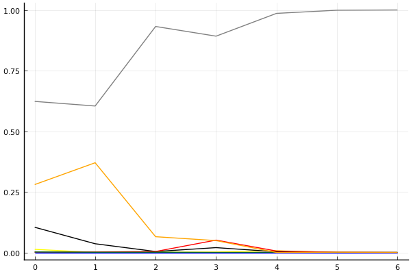
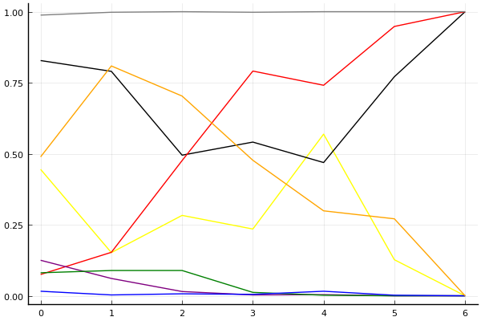
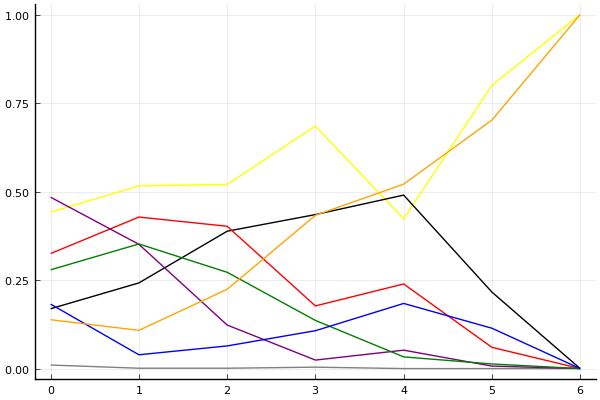

2018 듀얼 레이스 3 개인전 32강 B조

## 경기 결과

| 트랙 | 임재원 | 황인호 | 이승교 | 문호준 | 박현수B | 배재민 | 정승민 | 한상현 |
|:---|---:|---:|---:|---:|---:|---:|---:|---:|
| [공동묘지 해골 손가락](../haeson) | 0 | 3 | 5 | 10 | 1 | 4 | -1 | 7 |
| [아이스 설산 다운힐](../seolsan) | 5 | 0 | 7 | 10 | -1 | 1 | 4 | 3 |
| [포레스트 지그재그](../zigzag) | 5 | 7 | 10 | 1 | -1 | 0 | 4 | 3 |
| [네모 산타의 비밀공간](../santa) | 7 | 3 | 0 | 10 | 5 | -1 | 4 | 1 |
| [차이나 서안 병마용](../byeongma) | -1 | 7 | 5 | 10 | 0 | 3 | 1 | 4 |
| [빌리지 붐힐터널](../boomhill) | 3 | 5 | 0 | 10 | 7 | -1 | 1 | 4 |
| __total__ |__19__ |__25__ |__27__ |__51__ |__11__ |__6__ |__13__ |__22__ |

## 시뮬레이션

### 1st 확률

x축: 트랙, y축: 확률
1번: 옐로우, 2번: 블랙, 3번: 레드, 4번: 화이트(회색), 5번: 퍼플, 6번: 그린, 7번: 블루, 8번: 오렌지

| 트랙 | 임재원 | 황인호 | 이승교 | 문호준 | 박현수B | 배재민 | 정승민 | 한상현 |
|:---|---:|---:|---:|---:|---:|---:|---:|---:|
| 초기 | 0.013 | 0.104 | 0.001 | 0.623 | 0.002 | 0.002 | 0.000 | 0.280 |
| 공동묘지 해골 손가락 | 0.000 | 0.036 | 0.002 | 0.604 | 0.000 | 0.001 | 0.000 | 0.370 |
| 아이스 설산 다운힐 | 0.001 | 0.004 | 0.004 | 0.932 | 0.000 | 0.001 | 0.000 | 0.065 |
| 포레스트 지그재그 | 0.002 | 0.020 | 0.051 | 0.892 | 0.000 | 0.000 | 0.000 | 0.049 |
| 네모 산타의 비밀공간 | 0.007 | 0.003 | 0.006 | 0.986 | 0.000 | 0.000 | 0.000 | 0.000 |
| 차이나 서안 병마용 | 0.000 | 0.000 | 0.001 | 0.999 | 0.000 | 0.000 | 0.000 | 0.001 |
| 빌리지 붐힐터널 | 0.000 | 0.000 | 0.000 | 1.000 | 0.000 | 0.000 | 0.000 | 0.000 |

### Advance 확률

x축: 트랙, y축: 확률
1번: 옐로우, 2번: 블랙, 3번: 레드, 4번: 화이트(회색), 5번: 퍼플, 6번: 그린, 7번: 블루, 8번: 오렌지

| 트랙 | 임재원 | 황인호 | 이승교 | 문호준 | 박현수B | 배재민 | 정승민 | 한상현 |
|:---|---:|---:|---:|---:|---:|---:|---:|---:|
| 초기 | 0.445 | 0.828 | 0.075 | 0.988 | 0.125 | 0.081 | 0.016 | 0.489 |
| 공동묘지 해골 손가락 | 0.152 | 0.790 | 0.153 | 0.998 | 0.061 | 0.089 | 0.003 | 0.809 |
| 아이스 설산 다운힐 | 0.283 | 0.495 | 0.476 | 1.000 | 0.015 | 0.089 | 0.007 | 0.703 |
| 포레스트 지그재그 | 0.235 | 0.541 | 0.791 | 0.998 | 0.003 | 0.012 | 0.005 | 0.477 |
| 네모 산타의 비밀공간 | 0.569 | 0.469 | 0.741 | 1.000 | 0.004 | 0.002 | 0.016 | 0.299 |
| 차이나 서안 병마용 | 0.127 | 0.771 | 0.948 | 1.000 | 0.000 | 0.000 | 0.002 | 0.271 |
| 빌리지 붐힐터널 | 0.000 | 1.000 | 1.000 | 1.000 | 0.000 | 0.000 | 0.000 | 0.000 |

### Repechage 확률

x축: 트랙, y축: 확률
1번: 옐로우, 2번: 블랙, 3번: 레드, 4번: 화이트(회색), 5번: 퍼플, 6번: 그린, 7번: 블루, 8번: 오렌지

| 트랙 | 임재원 | 황인호 | 이승교 | 문호준 | 박현수B | 배재민 | 정승민 | 한상현 |
|:---|---:|---:|---:|---:|---:|---:|---:|---:|
| 초기 | 0.455 | 0.162 | 0.291 | 0.012 | 0.500 | 0.287 | 0.167 | 0.156 |
| 공동묘지 해골 손가락 | 0.532 | 0.182 | 0.459 | 0.002 | 0.339 | 0.346 | 0.053 | 0.114 |
| 아이스 설산 다운힐 | 0.507 | 0.413 | 0.412 | 0.000 | 0.130 | 0.264 | 0.082 | 0.223 |
| 포레스트 지그재그 | 0.657 | 0.432 | 0.199 | 0.002 | 0.034 | 0.133 | 0.104 | 0.429 |
| 네모 산타의 비밀공간 | 0.399 | 0.496 | 0.252 | 0.000 | 0.046 | 0.036 | 0.174 | 0.563 |
| 차이나 서안 병마용 | 0.813 | 0.227 | 0.052 | 0.000 | 0.006 | 0.034 | 0.112 | 0.686 |
| 빌리지 붐힐터널 | 1.000 | 0.000 | 0.000 | 0.000 | 0.000 | 0.000 | 0.000 | 1.000 |

## 랭킹 변동

### [전체 랭킹](../singles-full)

| 순위 | 변동 | 이름 | 점수 | 변동 | mu | 변동 | sigma | 변동 |
|---:|---:|:---:|---:|---:|---:|---:|---:|---:|
| 2 / 56 | +1 | [문호준](../munhojun) | 3360 | +22 | 3608 | +23 | 83 | +0 |
| 14 / 56 | +0 | [황인호](../hwanginho) | 2923 | -24 | 3202 | -38 | 93 | -5 |
| 24 / 56 | +0 | [임재원](../imjaewon) | 2648 | -10 | 2951 | -31 | 101 | -7 |
| 35 / 56 | +14 | [이승교](../iseunggyo) | 2334 | +475 | 2850 | +270 | 172 | -68 |
| 36 / 56 | -1 | [박현수B](../bakhyeonsu-b) | 2304 | +29 | 2698 | -33 | 131 | -21 |
| 38 / 56 | NaN | [한상현](../hansanghyeon) | 2255 | +2255 | 2941 | -59 | 229 | -771 |
| 41 / 56 | +4 | [정승민](../jeongseungmin) | 2125 | +182 | 2532 | +102 | 136 | -27 |
| 46 / 56 | +2 | [배재민](../baejaemin) | 1999 | +118 | 2504 | -59 | 169 | -59 |

### 시즌 랭킹

| 순위 | 변동 | 이름 | 점수 | 변동 | mu | 변동 | sigma | 변동 |
|---:|---:|:---:|---:|---:|---:|---:|---:|---:|
| 1 / 16 | NaN | [문호준](../munhojun) | 3038 | +3038 | 3994 | +994 | 319 | -681 |
| 5 / 16 | NaN | [황인호](../hwanginho) | 2410 | +2410 | 3164 | +164 | 251 | -749 |
| 8 / 16 | NaN | [이승교](../iseunggyo) | 2325 | +2325 | 3123 | +123 | 266 | -734 |
| 10 / 16 | NaN | [한상현](../hansanghyeon) | 2273 | +2273 | 3011 | +11 | 246 | -754 |
| 11 / 16 | NaN | [임재원](../imjaewon) | 2142 | +2142 | 2909 | -91 | 255 | -745 |
| 12 / 16 | NaN | [정승민](../jeongseungmin) | 2045 | +2045 | 2795 | -205 | 250 | -750 |
| 14 / 16 | NaN | [박현수B](../bakhyeonsu-b) | 1892 | +1892 | 2704 | -296 | 271 | -729 |
| 15 / 16 | NaN | [배재민](../baejaemin) | 1607 | +1607 | 2410 | -590 | 268 | -732 |

### 트랙 별 랭킹

#### [공동묘지 해골 손가락](../haeson)

| 순위 | 변동 | 이름 | 점수 | 변동 | mu | 변동 | sigma | 변동 |
|:---:|:---:|:---:|---:|---:|---:|---:|---:|---:|
| 2 / 24 | +0 | [문호준](../munhojun) | 3057 | +282 | 4122 | +194 | 355 | -29 |
| 9 / 24 | NaN | [한상현](../hansanghyeon) | 1963 | +1963 | 3717 | +717 | 585 | -415 |
| 11 / 24 | +0 | [황인호](../hwanginho) | 1710 | +154 | 2895 | -91 | 395 | -82 |
| 13 / 24 | NaN | [이승교](../iseunggyo) | 1676 | +1676 | 3390 | +390 | 571 | -429 |
| 16 / 24 | NaN | [배재민](../baejaemin) | 1423 | +1423 | 3107 | +107 | 561 | -439 |
| 20 / 24 | NaN | [박현수B](../bakhyeonsu-b) | 824 | +824 | 2527 | -473 | 568 | -432 |
| 21 / 24 | -4 | [임재원](../imjaewon) | 773 | +145 | 2021 | -76 | 416 | -74 |
| 23 / 24 | NaN | [정승민](../jeongseungmin) | -356 | -356 | 1664 | -1336 | 674 | -326 |

#### [네모 산타의 비밀공간](../santa)

| 순위 | 변동 | 이름 | 점수 | 변동 | mu | 변동 | sigma | 변동 |
|:---:|:---:|:---:|---:|---:|---:|---:|---:|---:|
| 7 / 38 | +0 | [문호준](../munhojun) | 2438 | +117 | 3196 | +79 | 253 | -13 |
| 17 / 38 | -1 | [황인호](../hwanginho) | 1795 | -85 | 2660 | -191 | 288 | -35 |
| 25 / 38 | +4 | [임재원](../imjaewon) | 1413 | +468 | 2408 | +304 | 332 | -55 |
| 29 / 38 | +3 | [박현수B](../bakhyeonsu-b) | 1273 | +609 | 2540 | +141 | 422 | -156 |
| 33 / 38 | +3 | [정승민](../jeongseungmin) | 781 | +1145 | 2141 | +477 | 453 | -223 |
| 34 / 38 | NaN | [한상현](../hansanghyeon) | 504 | +504 | 2118 | -882 | 538 | -462 |
| 36 / 38 | +1 | [이승교](../iseunggyo) | 61 | +503 | 1531 | -84 | 490 | -196 |
| 37 / 38 | -3 | [배재민](../baejaemin) | -10 | -285 | 1454 | -639 | 488 | -118 |

#### [빌리지 붐힐터널](../boomhill)

| 순위 | 변동 | 이름 | 점수 | 변동 | mu | 변동 | sigma | 변동 |
|:---:|:---:|:---:|---:|---:|---:|---:|---:|---:|
| 3 / 22 | +3 | [문호준](../munhojun) | 2371 | +477 | 3462 | +357 | 364 | -40 |
| 8 / 22 | NaN | [박현수B](../bakhyeonsu-b) | 1781 | +1781 | 3500 | +500 | 573 | -427 |
| 10 / 22 | NaN | [황인호](../hwanginho) | 1531 | +1531 | 3239 | +239 | 569 | -431 |
| 13 / 22 | NaN | [한상현](../hansanghyeon) | 1286 | +1286 | 2996 | -4 | 570 | -430 |
| 16 / 22 | NaN | [임재원](../imjaewon) | 1026 | +1026 | 2752 | -248 | 575 | -425 |
| 18 / 22 | NaN | [정승민](../jeongseungmin) | 724 | +724 | 2486 | -514 | 587 | -413 |
| 20 / 22 | NaN | [이승교](../iseunggyo) | 322 | +322 | 2164 | -836 | 614 | -386 |
| 22 / 22 | NaN | [배재민](../baejaemin) | -413 | -413 | 1670 | -1330 | 694 | -306 |

#### [아이스 설산 다운힐](../seolsan)

| 순위 | 변동 | 이름 | 점수 | 변동 | mu | 변동 | sigma | 변동 |
|:---:|:---:|:---:|---:|---:|---:|---:|---:|---:|
| 1 / 28 | +0 | [문호준](../munhojun) | 2889 | +241 | 3858 | +168 | 323 | -25 |
| 12 / 28 | NaN | [이승교](../iseunggyo) | 1851 | +1851 | 3547 | +547 | 565 | -435 |
| 13 / 28 | -3 | [황인호](../hwanginho) | 1742 | -234 | 2852 | -422 | 370 | -63 |
| 15 / 28 | +2 | [임재원](../imjaewon) | 1630 | +691 | 2793 | +431 | 388 | -87 |
| 18 / 28 | NaN | [정승민](../jeongseungmin) | 1410 | +1410 | 3029 | +29 | 540 | -460 |
| 19 / 28 | NaN | [한상현](../hansanghyeon) | 1216 | +1216 | 2841 | -159 | 542 | -458 |
| 21 / 28 | NaN | [배재민](../baejaemin) | 1010 | +1010 | 2646 | -354 | 545 | -455 |
| 25 / 28 | NaN | [박현수B](../bakhyeonsu-b) | -156 | -156 | 1881 | -1119 | 679 | -321 |

#### [차이나 서안 병마용](../byeongma)

| 순위 | 변동 | 이름 | 점수 | 변동 | mu | 변동 | sigma | 변동 |
|:---:|:---:|:---:|---:|---:|---:|---:|---:|---:|
| 1 / 40 | +0 | [문호준](../munhojun) | 2873 | +129 | 3601 | +92 | 243 | -12 |
| 8 / 40 | +3 | [황인호](../hwanginho) | 2423 | +160 | 3237 | +81 | 271 | -26 |
| 19 / 40 | -3 | [임재원](../imjaewon) | 1684 | -302 | 2671 | -434 | 329 | -44 |
| 21 / 40 | +4 | [배재민](../baejaemin) | 1562 | +247 | 2813 | -190 | 417 | -146 |
| 24 / 40 | +10 | [이승교](../iseunggyo) | 1435 | +1102 | 2745 | +575 | 437 | -176 |
| 27 / 40 | NaN | [한상현](../hansanghyeon) | 1354 | +1354 | 2918 | -82 | 521 | -479 |
| 30 / 40 | -2 | [박현수B](../bakhyeonsu-b) | 1155 | +108 | 2428 | -330 | 424 | -146 |
| 34 / 40 | +2 | [정승민](../jeongseungmin) | 771 | +1140 | 2156 | +454 | 462 | -229 |

#### [포레스트 지그재그](../zigzag)

| 순위 | 변동 | 이름 | 점수 | 변동 | mu | 변동 | sigma | 변동 |
|:---:|:---:|:---:|---:|---:|---:|---:|---:|---:|
| 4 / 35 | -1 | [문호준](../munhojun) | 2985 | -206 | 3799 | -296 | 271 | -30 |
| 5 / 35 | +2 | [황인호](../hwanginho) | 2875 | +137 | 3843 | -14 | 323 | -50 |
| 11 / 35 | +3 | [임재원](../imjaewon) | 2140 | +404 | 3097 | +240 | 319 | -55 |
| 13 / 35 | +17 | [이승교](../iseunggyo) | 2000 | +1639 | 3388 | +1151 | 463 | -163 |
| 16 / 35 | +6 | [정승민](../jeongseungmin) | 1871 | +782 | 3134 | +271 | 421 | -170 |
| 18 / 35 | NaN | [한상현](../hansanghyeon) | 1592 | +1592 | 3123 | +123 | 510 | -490 |
| 20 / 35 | -2 | [배재민](../baejaemin) | 1511 | +148 | 2835 | -302 | 441 | -150 |
| 26 / 35 | -2 | [박현수B](../bakhyeonsu-b) | 950 | -139 | 2398 | -466 | 483 | -109 |
