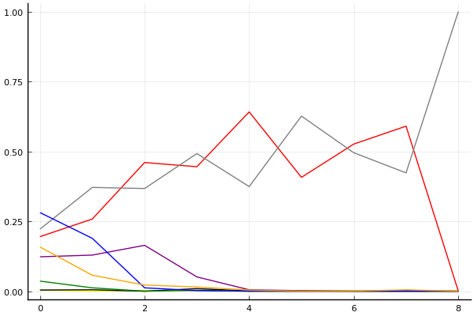
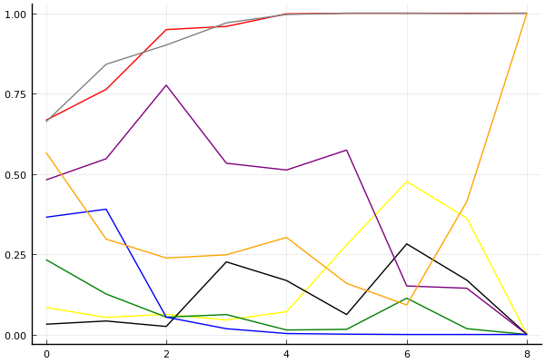
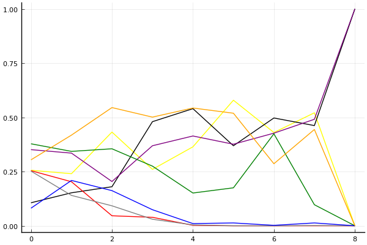

2018 듀얼 레이스 3 개인전 32강 C조

## 경기 결과

| 트랙 | 최영훈 | 송용준 | 전대웅 | 박인수 | 이준성 | 김주원 | 박민우 | 김승래 |
|:---|---:|---:|---:|---:|---:|---:|---:|---:|
| [노르테유 익스프레스](../noex) | 1 | 3 | 7 | 10 | 5 | 0 | 4 | -1 |
| [차이나 서안 병마용](../byeongma) | 4 | 1 | 10 | 5 | 7 | 0 | -1 | 3 |
| [포레스트 지그재그](../zigzag) | 1 | 10 | 5 | 7 | -1 | 3 | 0 | 4 |
| [빌리지 붐힐터널](../boomhill) | 4 | 1 | 10 | 7 | 3 | 0 | -1 | 5 |
| [광산 위험한 제련소](../jeryeonso) | 7 | -1 | 5 | 10 | 3 | 4 | 1 | 0 |
| [팩토리 미완성 5구역](../district5) | 5 | 7 | 4 | 1 | -1 | 10 | 0 | 3 |
| [네모 산타의 비밀공간](../santa) | 4 | 3 | 1 | 0 | 5 | -1 | 7 | 10 |
| [공동묘지 해골 손가락](../haeson) | -1 | 3 | 1 | 10 | 7 | 4 | 0 | 5 |
| __total__ |__25__ |__27__ |__43__ |__50__ |__28__ |__20__ |__10__ |__29__ |

## 시뮬레이션

### 1st 확률

x축: 트랙, y축: 확률
1번: 옐로우, 2번: 블랙, 3번: 레드, 4번: 화이트(회색), 5번: 퍼플, 6번: 그린, 7번: 블루, 8번: 오렌지

| 트랙 | 최영훈 | 송용준 | 전대웅 | 박인수 | 이준성 | 김주원 | 박민우 | 김승래 |
|:---|---:|---:|---:|---:|---:|---:|---:|---:|
| 초기 | 0.004 | 0.004 | 0.195 | 0.222 | 0.123 | 0.036 | 0.281 | 0.158 |
| 노르테유 익스프레스 | 0.000 | 0.005 | 0.258 | 0.371 | 0.129 | 0.012 | 0.189 | 0.057 |
| 차이나 서안 병마용 | 0.003 | 0.000 | 0.460 | 0.367 | 0.164 | 0.000 | 0.012 | 0.022 |
| 포레스트 지그재그 | 0.001 | 0.009 | 0.445 | 0.492 | 0.051 | 0.003 | 0.002 | 0.015 |
| 빌리지 붐힐터널 | 0.000 | 0.001 | 0.641 | 0.374 | 0.005 | 0.000 | 0.000 | 0.004 |
| 광산 위험한 제련소 | 0.000 | 0.000 | 0.407 | 0.626 | 0.002 | 0.000 | 0.000 | 0.000 |
| 팩토리 미완성 5구역 | 0.001 | 0.000 | 0.526 | 0.495 | 0.000 | 0.000 | 0.000 | 0.000 |
| 네모 산타의 비밀공간 | 0.000 | 0.000 | 0.590 | 0.423 | 0.002 | 0.000 | 0.000 | 0.005 |
| 공동묘지 해골 손가락 | 0.000 | 0.000 | 0.000 | 1.000 | 0.000 | 0.000 | 0.000 | 0.000 |

### Advance 확률

x축: 트랙, y축: 확률
1번: 옐로우, 2번: 블랙, 3번: 레드, 4번: 화이트(회색), 5번: 퍼플, 6번: 그린, 7번: 블루, 8번: 오렌지

| 트랙 | 최영훈 | 송용준 | 전대웅 | 박인수 | 이준성 | 김주원 | 박민우 | 김승래 |
|:---|---:|---:|---:|---:|---:|---:|---:|---:|
| 초기 | 0.084 | 0.032 | 0.667 | 0.662 | 0.481 | 0.233 | 0.365 | 0.567 |
| 노르테유 익스프레스 | 0.053 | 0.042 | 0.763 | 0.841 | 0.547 | 0.126 | 0.390 | 0.297 |
| 차이나 서안 병마용 | 0.063 | 0.025 | 0.949 | 0.901 | 0.776 | 0.054 | 0.054 | 0.238 |
| 포레스트 지그재그 | 0.045 | 0.226 | 0.959 | 0.970 | 0.533 | 0.062 | 0.018 | 0.248 |
| 빌리지 붐힐터널 | 0.071 | 0.168 | 0.998 | 0.996 | 0.512 | 0.014 | 0.003 | 0.302 |
| 광산 위험한 제련소 | 0.279 | 0.062 | 1.000 | 1.000 | 0.574 | 0.016 | 0.001 | 0.159 |
| 팩토리 미완성 5구역 | 0.476 | 0.282 | 1.000 | 1.000 | 0.151 | 0.113 | 0.000 | 0.092 |
| 네모 산타의 비밀공간 | 0.362 | 0.169 | 1.000 | 0.999 | 0.144 | 0.018 | 0.000 | 0.414 |
| 공동묘지 해골 손가락 | 0.000 | 0.000 | 1.000 | 1.000 | 0.000 | 0.000 | 0.000 | 1.000 |

### Repechage 확률

x축: 트랙, y축: 확률
1번: 옐로우, 2번: 블랙, 3번: 레드, 4번: 화이트(회색), 5번: 퍼플, 6번: 그린, 7번: 블루, 8번: 오렌지

| 트랙 | 최영훈 | 송용준 | 전대웅 | 박인수 | 이준성 | 김주원 | 박민우 | 김승래 |
|:---|---:|---:|---:|---:|---:|---:|---:|---:|
| 초기 | 0.256 | 0.106 | 0.254 | 0.252 | 0.351 | 0.378 | 0.081 | 0.304 |
| 노르테유 익스프레스 | 0.240 | 0.152 | 0.203 | 0.140 | 0.335 | 0.343 | 0.209 | 0.418 |
| 차이나 서안 병마용 | 0.432 | 0.180 | 0.046 | 0.092 | 0.204 | 0.355 | 0.162 | 0.545 |
| 포레스트 지그재그 | 0.260 | 0.480 | 0.039 | 0.030 | 0.369 | 0.275 | 0.074 | 0.501 |
| 빌리지 붐힐터널 | 0.364 | 0.540 | 0.002 | 0.004 | 0.414 | 0.151 | 0.010 | 0.543 |
| 광산 위험한 제련소 | 0.579 | 0.369 | 0.000 | 0.000 | 0.376 | 0.175 | 0.013 | 0.519 |
| 팩토리 미완성 5구역 | 0.430 | 0.497 | 0.000 | 0.000 | 0.427 | 0.424 | 0.002 | 0.286 |
| 네모 산타의 비밀공간 | 0.521 | 0.462 | 0.000 | 0.001 | 0.491 | 0.097 | 0.013 | 0.444 |
| 공동묘지 해골 손가락 | 0.000 | 1.000 | 0.000 | 0.000 | 1.000 | 0.000 | 0.000 | 0.000 |

## 랭킹 변동

### [전체 랭킹](../singles-full)

| 순위 | 변동 | 이름 | 점수 | 변동 | mu | 변동 | sigma | 변동 |
|---:|---:|:---:|---:|---:|---:|---:|---:|---:|
| 7 / 57 | +1 | [박인수](../bakinsu) | 3156 | +35 | 3401 | +31 | 82 | -1 |
| 8 / 57 | -1 | [전대웅](../jeondaewoong) | 3148 | +11 | 3385 | +8 | 79 | -1 |
| 12 / 57 | -1 | [김승래](../gimseungrae) | 2971 | -22 | 3274 | -52 | 101 | -10 |
| 13 / 57 | +0 | [이준성](../ijunseong) | 2961 | -25 | 3241 | -44 | 94 | -6 |
| 17 / 57 | +0 | [김주원](../gimjuwon) | 2807 | -26 | 3092 | -47 | 95 | -7 |
| 20 / 57 | +2 | [최영훈](../choiyeonghun) | 2724 | +51 | 3014 | +25 | 97 | -8 |
| 29 / 57 | +13 | [송용준](../songyongjun) | 2496 | +398 | 2952 | +193 | 152 | -68 |
| 42 / 57 | NaN | [박민우](../bakminu) | 2126 | +2126 | 2753 | -247 | 209 | -791 |

### 시즌 랭킹

| 순위 | 변동 | 이름 | 점수 | 변동 | mu | 변동 | sigma | 변동 |
|---:|---:|:---:|---:|---:|---:|---:|---:|---:|
| 3 / 24 | NaN | [박인수](../bakinsu) | 2769 | +2769 | 3480 | +480 | 237 | -763 |
| 5 / 24 | NaN | [전대웅](../jeondaewoong) | 2629 | +2629 | 3309 | +309 | 227 | -773 |
| 8 / 24 | NaN | [김승래](../gimseungrae) | 2366 | +2366 | 3027 | +27 | 220 | -780 |
| 13 / 24 | NaN | [최영훈](../choiyeonghun) | 2302 | +2302 | 2952 | -48 | 217 | -783 |
| 15 / 24 | NaN | [송용준](../songyongjun) | 2256 | +2256 | 2908 | -92 | 217 | -783 |
| 16 / 24 | NaN | [이준성](../ijunseong) | 2254 | +2254 | 2918 | -82 | 221 | -779 |
| 18 / 24 | NaN | [김주원](../gimjuwon) | 2104 | +2104 | 2772 | -228 | 223 | -777 |
| 22 / 24 | NaN | [박민우](../bakminu) | 1838 | +1838 | 2511 | -489 | 224 | -776 |

### 트랙 별 랭킹

#### [공동묘지 해골 손가락](../haeson)

| 순위 | 변동 | 이름 | 점수 | 변동 | mu | 변동 | sigma | 변동 |
|:---:|:---:|:---:|---:|---:|---:|---:|---:|---:|
| 3 / 28 | +3 | [박인수](../bakinsu) | 2527 | +361 | 3456 | +264 | 310 | -32 |
| 4 / 28 | -1 | [김승래](../gimseungrae) | 2493 | +71 | 3621 | -190 | 376 | -87 |
| 5 / 28 | +3 | [이준성](../ijunseong) | 2419 | +293 | 3383 | +150 | 321 | -47 |
| 15 / 28 | NaN | [김주원](../gimjuwon) | 1429 | +1429 | 3053 | +53 | 541 | -459 |
| 18 / 28 | +1 | [전대웅](../jeondaewoong) | 1279 | +171 | 2423 | -37 | 381 | -70 |
| 21 / 28 | NaN | [송용준](../songyongjun) | 1139 | +1139 | 2787 | -213 | 549 | -451 |
| 24 / 28 | NaN | [박민우](../bakminu) | 404 | +404 | 2180 | -820 | 592 | -408 |
| 27 / 28 | NaN | [최영훈](../choiyeonghun) | -364 | -364 | 1684 | -1316 | 683 | -317 |

#### [광산 위험한 제련소](../jeryeonso)

| 순위 | 변동 | 이름 | 점수 | 변동 | mu | 변동 | sigma | 변동 |
|:---:|:---:|:---:|---:|---:|---:|---:|---:|---:|
| 2 / 32 | +0 | [박인수](../bakinsu) | 2968 | +261 | 3835 | +188 | 289 | -24 |
| 5 / 32 | +3 | [전대웅](../jeondaewoong) | 2474 | +285 | 3465 | +105 | 330 | -60 |
| 6 / 32 | -3 | [김승래](../gimseungrae) | 2468 | -237 | 3438 | -386 | 324 | -49 |
| 7 / 32 | -1 | [이준성](../ijunseong) | 2422 | +77 | 3260 | -24 | 279 | -34 |
| 8 / 32 | +11 | [최영훈](../choiyeonghun) | 2292 | +930 | 3586 | +450 | 431 | -160 |
| 16 / 32 | NaN | [김주원](../gimjuwon) | 1788 | +1788 | 3329 | +329 | 514 | -486 |
| 21 / 32 | NaN | [박민우](../bakminu) | 1422 | +1422 | 2979 | -21 | 519 | -481 |
| 22 / 32 | -2 | [송용준](../songyongjun) | 1000 | -89 | 2449 | -414 | 483 | -108 |

#### [네모 산타의 비밀공간](../santa)

| 순위 | 변동 | 이름 | 점수 | 변동 | mu | 변동 | sigma | 변동 |
|:---:|:---:|:---:|---:|---:|---:|---:|---:|---:|
| 1 / 39 | +0 | [최영훈](../choiyeonghun) | 2669 | -69 | 3770 | -366 | 367 | -99 |
| 4 / 39 | +1 | [전대웅](../jeondaewoong) | 2486 | -11 | 3146 | -60 | 220 | -16 |
| 5 / 39 | +3 | [이준성](../ijunseong) | 2481 | +181 | 3280 | +92 | 266 | -30 |
| 6 / 39 | -2 | [박인수](../bakinsu) | 2463 | -64 | 3127 | -111 | 221 | -15 |
| 9 / 39 | +5 | [김승래](../gimseungrae) | 2427 | +441 | 3337 | +339 | 303 | -34 |
| 13 / 39 | NaN | [박민우](../bakminu) | 2066 | +2066 | 3631 | +631 | 522 | -478 |
| 22 / 39 | -1 | [김주원](../gimjuwon) | 1581 | -86 | 2536 | -186 | 318 | -33 |
| 25 / 39 | +10 | [송용준](../songyongjun) | 1443 | +1039 | 2686 | +532 | 414 | -169 |

#### [노르테유 익스프레스](../noex)

| 순위 | 변동 | 이름 | 점수 | 변동 | mu | 변동 | sigma | 변동 |
|:---:|:---:|:---:|---:|---:|---:|---:|---:|---:|
| 1 / 56 | +0 | [박인수](../bakinsu) | 3548 | +139 | 4338 | +94 | 263 | -15 |
| 5 / 56 | +1 | [전대웅](../jeondaewoong) | 3030 | +175 | 3852 | +92 | 274 | -27 |
| 7 / 56 | +0 | [이준성](../ijunseong) | 2759 | +155 | 3575 | +67 | 272 | -29 |
| 11 / 56 | +0 | [최영훈](../choiyeonghun) | 2295 | -65 | 3417 | -345 | 374 | -93 |
| 19 / 56 | NaN | [박민우](../bakminu) | 1825 | +1825 | 3382 | +382 | 519 | -481 |
| 21 / 56 | -2 | [김주원](../gimjuwon) | 1793 | -94 | 3138 | -625 | 448 | -177 |
| 24 / 56 | +21 | [송용준](../songyongjun) | 1639 | +897 | 2903 | +425 | 421 | -157 |
| 31 / 56 | -8 | [김승래](../gimseungrae) | 1560 | -99 | 2598 | -212 | 346 | -38 |

#### [빌리지 붐힐터널](../boomhill)

| 순위 | 변동 | 이름 | 점수 | 변동 | mu | 변동 | sigma | 변동 |
|:---:|:---:|:---:|---:|---:|---:|---:|---:|---:|
| 2 / 25 | -1 | [이준성](../ijunseong) | 2503 | -281 | 3692 | -611 | 396 | -110 |
| 3 / 25 | +3 | [박인수](../bakinsu) | 2442 | +365 | 3446 | +193 | 335 | -57 |
| 4 / 25 | +1 | [김승래](../gimseungrae) | 2431 | +239 | 3432 | +57 | 334 | -61 |
| 7 / 25 | +10 | [전대웅](../jeondaewoong) | 2108 | +1332 | 3480 | +904 | 457 | -143 |
| 8 / 25 | +3 | [최영훈](../choiyeonghun) | 1953 | +590 | 3235 | +98 | 427 | -164 |
| 17 / 25 | NaN | [송용준](../songyongjun) | 1056 | +1056 | 2754 | -246 | 566 | -434 |
| 20 / 25 | NaN | [김주원](../gimjuwon) | 550 | +550 | 2382 | -618 | 610 | -390 |
| 23 / 25 | NaN | [박민우](../bakminu) | -278 | -278 | 1837 | -1163 | 705 | -295 |

#### [차이나 서안 병마용](../byeongma)

| 순위 | 변동 | 이름 | 점수 | 변동 | mu | 변동 | sigma | 변동 |
|:---:|:---:|:---:|---:|---:|---:|---:|---:|---:|
| 2 / 41 | +0 | [박인수](../bakinsu) | 2704 | +41 | 3304 | +5 | 200 | -12 |
| 3 / 41 | +3 | [이준성](../ijunseong) | 2621 | +137 | 3382 | +62 | 254 | -25 |
| 5 / 41 | +4 | [전대웅](../jeondaewoong) | 2567 | +197 | 3257 | +154 | 230 | -14 |
| 8 / 41 | -1 | [김승래](../gimseungrae) | 2429 | -29 | 3214 | -115 | 262 | -29 |
| 17 / 41 | +9 | [최영훈](../choiyeonghun) | 1835 | +438 | 2933 | +136 | 366 | -101 |
| 25 / 41 | +4 | [송용준](../songyongjun) | 1449 | +282 | 2680 | -125 | 410 | -135 |
| 27 / 41 | -2 | [김주원](../gimjuwon) | 1404 | -16 | 2513 | -223 | 370 | -69 |
| 38 / 41 | NaN | [박민우](../bakminu) | -170 | -170 | 1842 | -1158 | 670 | -330 |

#### [팩토리 미완성 5구역](../district5)

| 순위 | 변동 | 이름 | 점수 | 변동 | mu | 변동 | sigma | 변동 |
|:---:|:---:|:---:|---:|---:|---:|---:|---:|---:|
| 5 / 55 | +2 | [전대웅](../jeondaewoong) | 2610 | +6 | 3431 | -99 | 273 | -35 |
| 7 / 55 | -3 | [박인수](../bakinsu) | 2547 | -142 | 3441 | -281 | 298 | -46 |
| 10 / 55 | -4 | [이준성](../ijunseong) | 2360 | -253 | 3217 | -343 | 285 | -30 |
| 25 / 55 | +13 | [송용준](../songyongjun) | 1864 | +1035 | 3134 | +523 | 423 | -171 |
| 27 / 55 | +15 | [김주원](../gimjuwon) | 1727 | +1120 | 2905 | +828 | 393 | -97 |
| 28 / 55 | +7 | [김승래](../gimseungrae) | 1723 | +472 | 2824 | +159 | 367 | -105 |
| 30 / 55 | +13 | [최영훈](../choiyeonghun) | 1671 | +1117 | 2938 | +560 | 422 | -185 |
| 39 / 55 | NaN | [박민우](../bakminu) | 1142 | +1142 | 2690 | -310 | 516 | -484 |

#### [포레스트 지그재그](../zigzag)

| 순위 | 변동 | 이름 | 점수 | 변동 | mu | 변동 | sigma | 변동 |
|:---:|:---:|:---:|---:|---:|---:|---:|---:|---:|
| 7 / 37 | -1 | [전대웅](../jeondaewoong) | 2740 | -57 | 3729 | -238 | 330 | -60 |
| 9 / 37 | +3 | [박인수](../bakinsu) | 2331 | +213 | 3099 | +143 | 256 | -23 |
| 12 / 37 | -3 | [이준성](../ijunseong) | 2125 | -223 | 2934 | -290 | 270 | -22 |
| 13 / 37 | +14 | [송용준](../songyongjun) | 2004 | +1229 | 3381 | +804 | 459 | -142 |
| 18 / 37 | +6 | [김승래](../gimseungrae) | 1647 | +411 | 2627 | +235 | 327 | -59 |
| 26 / 37 | NaN | [김주원](../gimjuwon) | 1292 | +1292 | 2843 | -157 | 517 | -483 |
| 27 / 37 | +2 | [최영훈](../choiyeonghun) | 1282 | +506 | 2577 | -0 | 432 | -169 |
| 30 / 37 | NaN | [박민우](../bakminu) | 891 | +891 | 2477 | -523 | 529 | -471 |
