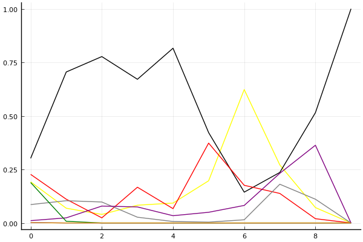
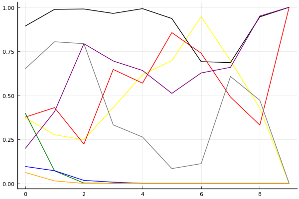
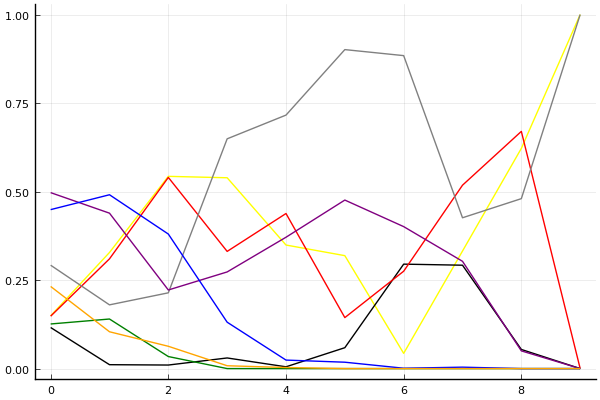

2018 듀얼 레이스 3 개인전 32강 D조

## 경기 결과

| 트랙 | 박현수 | 김승태 | 정승하 | 유창현 | 이준용 | 김진석 | 권순민 | 노준엽 |
|:---|---:|---:|---:|---:|---:|---:|---:|---:|
| [아이스 설산 다운힐](../seolsan) | 3 | 10 | 4 | 5 | 7 | 0 | 1 | -1 |
| [포레스트 지그재그](../zigzag) | 4 | 7 | 3 | 5 | 10 | -1 | 1 | 0 |
| [노르테유 익스프레스](../noex) | 7 | 4 | 10 | 0 | 5 | -1 | 3 | 1 |
| [차이나 서안 병마용](../byeongma) | 7 | 10 | 4 | 5 | 3 | -1 | 0 | 1 |
| [공동묘지 해골 손가락](../haeson) | 7 | 0 | 10 | 3 | 5 | 1 | 4 | -1 |
| [네모 산타의 비밀공간](../santa) | 10 | 0 | 3 | 7 | 5 | 4 | 1 | -1 |
| [빌리지 붐힐터널](../boomhill) | -1 | 3 | 1 | 10 | 4 | 0 | 7 | 5 |
| [광산 위험한 제련소](../jeryeonso) | 3 | 10 | 4 | 5 | 7 | 0 | -1 | 1 |
| [대저택 은밀한 지하실](../jeotaek) | -1 | 7 | 10 | 5 | 0 | 4 | 3 | 1 |
| __total__ |__39__ |__51__ |__49__ |__45__ |__46__ |__6__ |__19__ |__6__ |

## 시뮬레이션

### 1st 확률

x축: 트랙, y축: 확률
1번: 옐로우, 2번: 블랙, 3번: 레드, 4번: 화이트(회색), 5번: 퍼플, 6번: 그린, 7번: 블루, 8번: 오렌지

| 트랙 | 박현수 | 김승태 | 정승하 | 유창현 | 이준용 | 김진석 | 권순민 | 노준엽 |
|:---|---:|---:|---:|---:|---:|---:|---:|---:|
| 초기 | 0.192 | 0.302 | 0.227 | 0.086 | 0.011 | 0.189 | 0.002 | 0.002 |
| 아이스 설산 다운힐 | 0.069 | 0.705 | 0.111 | 0.104 | 0.024 | 0.008 | 0.000 | 0.000 |
| 포레스트 지그재그 | 0.040 | 0.777 | 0.024 | 0.098 | 0.079 | 0.000 | 0.000 | 0.000 |
| 노르테유 익스프레스 | 0.083 | 0.671 | 0.167 | 0.027 | 0.075 | 0.000 | 0.000 | 0.000 |
| 차이나 서안 병마용 | 0.093 | 0.816 | 0.067 | 0.007 | 0.034 | 0.000 | 0.000 | 0.000 |
| 공동묘지 해골 손가락 | 0.197 | 0.422 | 0.373 | 0.004 | 0.050 | 0.000 | 0.000 | 0.000 |
| 네모 산타의 비밀공간 | 0.623 | 0.144 | 0.176 | 0.015 | 0.082 | 0.000 | 0.000 | 0.000 |
| 빌리지 붐힐터널 | 0.271 | 0.236 | 0.138 | 0.181 | 0.232 | 0.000 | 0.000 | 0.000 |
| 광산 위험한 제련소 | 0.072 | 0.515 | 0.020 | 0.111 | 0.363 | 0.000 | 0.000 | 0.000 |
| 대저택 은밀한 지하실 | 0.000 | 1.000 | 0.000 | 0.000 | 0.000 | 0.000 | 0.000 | 0.000 |

### Advance 확률

x축: 트랙, y축: 확률
1번: 옐로우, 2번: 블랙, 3번: 레드, 4번: 화이트(회색), 5번: 퍼플, 6번: 그린, 7번: 블루, 8번: 오렌지

| 트랙 | 박현수 | 김승태 | 정승하 | 유창현 | 이준용 | 김진석 | 권순민 | 노준엽 |
|:---|---:|---:|---:|---:|---:|---:|---:|---:|
| 초기 | 0.385 | 0.873 | 0.392 | 0.672 | 0.225 | 0.365 | 0.093 | 0.057 |
| 아이스 설산 다운힐 | 0.261 | 0.989 | 0.390 | 0.806 | 0.473 | 0.055 | 0.077 | 0.011 |
| 포레스트 지그재그 | 0.254 | 0.990 | 0.227 | 0.785 | 0.771 | 0.001 | 0.021 | 0.004 |
| 노르테유 익스프레스 | 0.412 | 0.970 | 0.647 | 0.313 | 0.723 | 0.000 | 0.007 | 0.000 |
| 차이나 서안 병마용 | 0.645 | 0.995 | 0.558 | 0.270 | 0.629 | 0.000 | 0.000 | 0.000 |
| 공동묘지 해골 손가락 | 0.681 | 0.941 | 0.856 | 0.086 | 0.523 | 0.000 | 0.000 | 0.000 |
| 네모 산타의 비밀공간 | 0.957 | 0.705 | 0.725 | 0.115 | 0.599 | 0.000 | 0.000 | 0.000 |
| 빌리지 붐힐터널 | 0.668 | 0.708 | 0.481 | 0.573 | 0.697 | 0.000 | 0.000 | 0.000 |
| 광산 위험한 제련소 | 0.378 | 0.946 | 0.330 | 0.520 | 0.950 | 0.000 | 0.000 | 0.000 |
| 대저택 은밀한 지하실 | 0.000 | 1.000 | 1.000 | 0.000 | 1.000 | 0.000 | 0.000 | 0.000 |

### Repechage 확률

x축: 트랙, y축: 확률
1번: 옐로우, 2번: 블랙, 3번: 레드, 4번: 화이트(회색), 5번: 퍼플, 6번: 그린, 7번: 블루, 8번: 오렌지

| 트랙 | 박현수 | 김승태 | 정승하 | 유창현 | 이준용 | 김진석 | 권순민 | 노준엽 |
|:---|---:|---:|---:|---:|---:|---:|---:|---:|
| 초기 | 0.149 | 0.116 | 0.148 | 0.292 | 0.497 | 0.126 | 0.449 | 0.232 |
| 아이스 설산 다운힐 | 0.328 | 0.011 | 0.310 | 0.180 | 0.439 | 0.140 | 0.491 | 0.104 |
| 포레스트 지그재그 | 0.543 | 0.010 | 0.540 | 0.214 | 0.222 | 0.034 | 0.380 | 0.063 |
| 노르테유 익스프레스 | 0.539 | 0.030 | 0.331 | 0.649 | 0.273 | 0.000 | 0.131 | 0.008 |
| 차이나 서안 병마용 | 0.349 | 0.005 | 0.438 | 0.716 | 0.371 | 0.000 | 0.024 | 0.003 |
| 공동묘지 해골 손가락 | 0.319 | 0.059 | 0.144 | 0.901 | 0.476 | 0.000 | 0.018 | 0.000 |
| 네모 산타의 비밀공간 | 0.043 | 0.295 | 0.275 | 0.884 | 0.401 | 0.000 | 0.001 | 0.000 |
| 빌리지 붐힐터널 | 0.332 | 0.292 | 0.518 | 0.426 | 0.303 | 0.000 | 0.004 | 0.000 |
| 광산 위험한 제련소 | 0.622 | 0.054 | 0.670 | 0.480 | 0.050 | 0.000 | 0.000 | 0.000 |
| 대저택 은밀한 지하실 | 1.000 | 0.000 | 0.000 | 1.000 | 0.000 | 0.000 | 0.000 | 0.000 |

## 랭킹 변동

### [전체 랭킹](../singles-full)

| 순위 | 변동 | 이름 | 점수 | 변동 | mu | 변동 | sigma | 변동 |
|---:|---:|:---:|---:|---:|---:|---:|---:|---:|
| 3 / 60 | +0 | [김승태](../gimseungtae) | 3315 | -31 | 3577 | -42 | 88 | -3 |
| 6 / 60 | +0 | [유창현](../yuchanghyeon) | 3160 | -5 | 3406 | -11 | 82 | -2 |
| 17 / 60 | +4 | [이준용](../ijunyong) | 2851 | +167 | 3185 | +110 | 112 | -19 |
| 18 / 60 | NaN | [정승하](../jeongseungha) | 2807 | +2807 | 3402 | +402 | 199 | -801 |
| 26 / 60 | -1 | [권순민](../gweonsoonmin) | 2630 | -14 | 2921 | -40 | 97 | -9 |
| 28 / 60 | NaN | [박현수](../bakhyeonsu) | 2566 | +2566 | 3165 | +165 | 200 | -800 |
| 44 / 60 | +4 | [노준엽](../nojunyeob) | 2133 | +157 | 2624 | -123 | 163 | -93 |
| 52 / 60 | NaN | [김진석](../gimjinseok) | 1964 | +1964 | 2598 | -402 | 211 | -789 |

### 시즌 랭킹

| 순위 | 변동 | 이름 | 점수 | 변동 | mu | 변동 | sigma | 변동 |
|---:|---:|:---:|---:|---:|---:|---:|---:|---:|
| 5 / 32 | NaN | [정승하](../jeongseungha) | 2740 | +2740 | 3373 | +373 | 211 | -789 |
| 6 / 32 | NaN | [유창현](../yuchanghyeon) | 2694 | +2694 | 3324 | +324 | 210 | -790 |
| 7 / 32 | NaN | [이준용](../ijunyong) | 2668 | +2668 | 3293 | +293 | 208 | -792 |
| 8 / 32 | NaN | [김승태](../gimseungtae) | 2667 | +2667 | 3320 | +320 | 218 | -782 |
| 10 / 32 | NaN | [박현수](../bakhyeonsu) | 2498 | +2498 | 3138 | +138 | 214 | -786 |
| 24 / 32 | NaN | [권순민](../gweonsoonmin) | 2050 | +2050 | 2680 | -320 | 210 | -790 |
| 29 / 32 | NaN | [노준엽](../nojunyeob) | 1782 | +1782 | 2451 | -549 | 223 | -777 |
| 30 / 32 | NaN | [김진석](../gimjinseok) | 1777 | +1777 | 2452 | -548 | 225 | -775 |

### 트랙 별 랭킹

#### [공동묘지 해골 손가락](../haeson)

| 순위 | 변동 | 이름 | 점수 | 변동 | mu | 변동 | sigma | 변동 |
|:---:|:---:|:---:|---:|---:|---:|---:|---:|---:|
| 9 / 36 | NaN | [정승하](../jeongseungha) | 2161 | +2161 | 4274 | +1274 | 704 | -296 |
| 11 / 36 | NaN | [박현수](../bakhyeonsu) | 1887 | +1887 | 3763 | +763 | 625 | -375 |
| 16 / 36 | NaN | [이준용](../ijunyong) | 1622 | +1622 | 3423 | +423 | 600 | -400 |
| 21 / 36 | NaN | [권순민](../gweonsoonmin) | 1363 | +1363 | 3137 | +137 | 591 | -409 |
| 26 / 36 | NaN | [유창현](../yuchanghyeon) | 1090 | +1090 | 2863 | -137 | 591 | -409 |
| 28 / 36 | NaN | [김진석](../gimjinseok) | 776 | +776 | 2577 | -423 | 600 | -400 |
| 31 / 36 | NaN | [김승태](../gimseungtae) | 361 | +361 | 2237 | -763 | 625 | -375 |
| 36 / 36 | NaN | [노준엽](../nojunyeob) | -388 | -388 | 1726 | -1274 | 704 | -296 |

#### [광산 위험한 제련소](../jeryeonso)

| 순위 | 변동 | 이름 | 점수 | 변동 | mu | 변동 | sigma | 변동 |
|:---:|:---:|:---:|---:|---:|---:|---:|---:|---:|
| 13 / 39 | NaN | [김승태](../gimseungtae) | 2159 | +2159 | 4271 | +1271 | 704 | -296 |
| 16 / 39 | NaN | [이준용](../ijunyong) | 1887 | +1887 | 3759 | +759 | 624 | -376 |
| 20 / 39 | NaN | [유창현](../yuchanghyeon) | 1624 | +1624 | 3419 | +419 | 598 | -402 |
| 25 / 39 | NaN | [정승하](../jeongseungha) | 1367 | +1367 | 3132 | +132 | 588 | -412 |
| 26 / 39 | NaN | [박현수](../bakhyeonsu) | 1099 | +1099 | 2858 | -142 | 586 | -414 |
| 30 / 39 | NaN | [노준엽](../nojunyeob) | 796 | +796 | 2572 | -428 | 592 | -408 |
| 34 / 39 | NaN | [김진석](../gimjinseok) | 411 | +411 | 2235 | -765 | 608 | -392 |
| 37 / 39 | -8 | [권순민](../gweonsoonmin) | 172 | -189 | 1750 | -487 | 526 | -100 |

#### [네모 산타의 비밀공간](../santa)

| 순위 | 변동 | 이름 | 점수 | 변동 | mu | 변동 | sigma | 변동 |
|:---:|:---:|:---:|---:|---:|---:|---:|---:|---:|
| 10 / 44 | +4 | [유창현](../yuchanghyeon) | 2306 | +251 | 3134 | +182 | 276 | -23 |
| 15 / 44 | NaN | [박현수](../bakhyeonsu) | 2039 | +2039 | 4077 | +1077 | 679 | -321 |
| 17 / 44 | -2 | [김승태](../gimseungtae) | 1875 | -126 | 2796 | -235 | 307 | -36 |
| 23 / 44 | NaN | [이준용](../ijunyong) | 1671 | +1671 | 3287 | +287 | 539 | -461 |
| 24 / 44 | +0 | [권순민](../gweonsoonmin) | 1628 | +133 | 2641 | -39 | 338 | -57 |
| 27 / 44 | NaN | [김진석](../gimjinseok) | 1472 | +1472 | 3078 | +78 | 535 | -465 |
| 34 / 44 | NaN | [정승하](../jeongseungha) | 1278 | +1278 | 2874 | -126 | 532 | -468 |
| 43 / 44 | NaN | [노준엽](../nojunyeob) | -130 | -130 | 1888 | -1112 | 672 | -328 |

#### [노르테유 익스프레스](../noex)

| 순위 | 변동 | 이름 | 점수 | 변동 | mu | 변동 | sigma | 변동 |
|:---:|:---:|:---:|---:|---:|---:|---:|---:|---:|
| 13 / 59 | NaN | [정승하](../jeongseungha) | 2172 | +2172 | 4224 | +1224 | 684 | -316 |
| 15 / 59 | NaN | [박현수](../bakhyeonsu) | 1959 | +1959 | 3703 | +703 | 581 | -419 |
| 16 / 59 | -3 | [유창현](../yuchanghyeon) | 1943 | -227 | 3101 | -489 | 386 | -87 |
| 17 / 59 | -3 | [노준엽](../nojunyeob) | 1942 | -89 | 3247 | -616 | 435 | -175 |
| 20 / 59 | +5 | [권순민](../gweonsoonmin) | 1913 | +278 | 3021 | +5 | 369 | -91 |
| 21 / 59 | +11 | [김승태](../gimseungtae) | 1891 | +470 | 3022 | +178 | 377 | -98 |
| 26 / 59 | +17 | [이준용](../ijunyong) | 1766 | +793 | 2933 | +492 | 389 | -100 |
| 55 / 59 | NaN | [김진석](../gimjinseok) | -37 | -37 | 2037 | -963 | 691 | -309 |

#### [대저택 은밀한 지하실](../jeotaek)

| 순위 | 변동 | 이름 | 점수 | 변동 | mu | 변동 | sigma | 변동 |
|:---:|:---:|:---:|---:|---:|---:|---:|---:|---:|
| 2 / 58 | +0 | [김승태](../gimseungtae) | 3133 | +163 | 4221 | +14 | 363 | -49 |
| 6 / 58 | +1 | [유창현](../yuchanghyeon) | 2697 | +170 | 3744 | +14 | 349 | -52 |
| 9 / 58 | NaN | [정승하](../jeongseungha) | 2482 | +2482 | 4452 | +1452 | 657 | -343 |
| 29 / 58 | +7 | [권순민](../gweonsoonmin) | 1657 | +318 | 2837 | +56 | 393 | -87 |
| 33 / 58 | NaN | [김진석](../gimjinseok) | 1581 | +1581 | 3249 | +249 | 556 | -444 |
| 39 / 58 | +3 | [노준엽](../nojunyeob) | 1236 | +354 | 2563 | -59 | 442 | -138 |
| 43 / 58 | -3 | [이준용](../ijunyong) | 1051 | +73 | 2282 | -170 | 411 | -81 |
| 53 / 58 | NaN | [박현수](../bakhyeonsu) | -259 | -259 | 1768 | -1232 | 676 | -324 |

#### [빌리지 붐힐터널](../boomhill)

| 순위 | 변동 | 이름 | 점수 | 변동 | mu | 변동 | sigma | 변동 |
|:---:|:---:|:---:|---:|---:|---:|---:|---:|---:|
| 6 / 32 | +5 | [권순민](../gweonsoonmin) | 2280 | +658 | 3717 | +294 | 479 | -121 |
| 8 / 32 | NaN | [유창현](../yuchanghyeon) | 2188 | +2188 | 4251 | +1251 | 688 | -312 |
| 13 / 32 | NaN | [노준엽](../nojunyeob) | 1660 | +1660 | 3411 | +411 | 584 | -416 |
| 15 / 32 | NaN | [이준용](../ijunyong) | 1386 | +1386 | 3130 | +130 | 581 | -419 |
| 19 / 32 | NaN | [김승태](../gimseungtae) | 1105 | +1105 | 2859 | -141 | 585 | -415 |
| 23 / 32 | NaN | [정승하](../jeongseungha) | 786 | +786 | 2574 | -426 | 596 | -404 |
| 26 / 32 | NaN | [김진석](../gimjinseok) | 368 | +368 | 2235 | -765 | 622 | -378 |
| 30 / 32 | NaN | [박현수](../bakhyeonsu) | -384 | -384 | 1725 | -1275 | 703 | -297 |

#### [아이스 설산 다운힐](../seolsan)

| 순위 | 변동 | 이름 | 점수 | 변동 | mu | 변동 | sigma | 변동 |
|:---:|:---:|:---:|---:|---:|---:|---:|---:|---:|
| 5 / 35 | NaN | [김승태](../gimseungtae) | 2326 | +2326 | 4390 | +1390 | 688 | -312 |
| 7 / 35 | NaN | [이준용](../ijunyong) | 2080 | +2080 | 3913 | +913 | 611 | -389 |
| 14 / 35 | NaN | [유창현](../yuchanghyeon) | 1849 | +1849 | 3607 | +607 | 586 | -414 |
| 15 / 35 | -9 | [권순민](../gweonsoonmin) | 1836 | -325 | 3360 | -914 | 508 | -196 |
| 18 / 35 | NaN | [정승하](../jeongseungha) | 1631 | +1631 | 3359 | +359 | 576 | -424 |
| 22 / 35 | NaN | [박현수](../bakhyeonsu) | 1415 | +1415 | 3136 | +136 | 574 | -426 |
| 28 / 35 | NaN | [김진석](../gimjinseok) | 633 | +633 | 2508 | -492 | 625 | -375 |
| 32 / 35 | NaN | [노준엽](../nojunyeob) | -232 | -232 | 1929 | -1071 | 720 | -280 |

#### [차이나 서안 병마용](../byeongma)

| 순위 | 변동 | 이름 | 점수 | 변동 | mu | 변동 | sigma | 변동 |
|:---:|:---:|:---:|---:|---:|---:|---:|---:|---:|
| 6 / 45 | +7 | [김승태](../gimseungtae) | 2551 | +446 | 3695 | +305 | 381 | -47 |
| 14 / 45 | +0 | [유창현](../yuchanghyeon) | 2204 | +172 | 3120 | +67 | 305 | -35 |
| 18 / 45 | NaN | [박현수](../bakhyeonsu) | 1829 | +1829 | 3515 | +515 | 562 | -438 |
| 30 / 45 | NaN | [정승하](../jeongseungha) | 1327 | +1327 | 2964 | -36 | 546 | -454 |
| 31 / 45 | -2 | [노준엽](../nojunyeob) | 1263 | +22 | 2570 | -342 | 435 | -122 |
| 33 / 45 | NaN | [이준용](../ijunyong) | 1060 | +1060 | 2711 | -289 | 551 | -449 |
| 39 / 45 | -2 | [권순민](../gweonsoonmin) | 412 | +307 | 1731 | +34 | 440 | -91 |
| 44 / 45 | NaN | [김진석](../gimjinseok) | -452 | -452 | 1549 | -1451 | 667 | -333 |

#### [포레스트 지그재그](../zigzag)

| 순위 | 변동 | 이름 | 점수 | 변동 | mu | 변동 | sigma | 변동 |
|:---:|:---:|:---:|---:|---:|---:|---:|---:|---:|
| 10 / 43 | NaN | [이준용](../ijunyong) | 2276 | +2276 | 4353 | +1353 | 692 | -308 |
| 13 / 43 | NaN | [김승태](../gimseungtae) | 2026 | +2026 | 3865 | +865 | 613 | -387 |
| 19 / 43 | NaN | [유창현](../yuchanghyeon) | 1788 | +1788 | 3549 | +549 | 587 | -413 |
| 20 / 43 | -10 | [권순민](../gweonsoonmin) | 1763 | -398 | 3279 | -995 | 505 | -199 |
| 24 / 43 | NaN | [박현수](../bakhyeonsu) | 1563 | +1563 | 3290 | +290 | 576 | -424 |
| 28 / 43 | NaN | [정승하](../jeongseungha) | 1339 | +1339 | 3054 | +54 | 572 | -428 |
| 37 / 43 | -5 | [노준엽](../nojunyeob) | 710 | +346 | 2141 | +32 | 477 | -105 |
| 40 / 43 | NaN | [김진석](../gimjinseok) | -291 | -291 | 1800 | -1200 | 697 | -303 |
