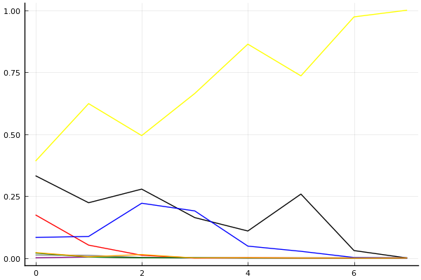
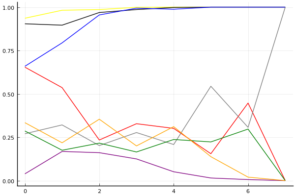

2018 듀얼 레이스 3 개인전 16강 2경기

## 경기 결과

| 트랙 | 문호준 | 김승태 | 정승하 | 이준용 | 이승교 | 황인호 | 유창현 | 박현수 |
|:---|---:|---:|---:|---:|---:|---:|---:|---:|
| [빌리지 붐힐터널](../boomhill) | 10 | 4 | 1 | 3 | 7 | -1 | 5 | 0 |
| [광산 위험한 제련소](../jeryeonso) | 4 | 7 | -1 | 0 | 1 | 3 | 10 | 5 |
| [포레스트 지그재그](../zigzag) | 10 | 5 | 4 | 3 | 0 | 1 | 7 | -1 |
| [네모 산타의 비밀공간](../santa) | 10 | 7 | 3 | 1 | -1 | 4 | 0 | 5 |
| [아이스 설산 다운힐](../seolsan) | 4 | 10 | 1 | 7 | -1 | 3 | 5 | 0 |
| [대저택 은밀한 지하실](../jeotaek) | 10 | 3 | 7 | 0 | 1 | 4 | 5 | -1 |
| [차이나 서안 병마용](../byeongma) | 5 | -1 | 1 | 10 | 0 | 7 | 4 | 3 |
| __total__ |__53__ |__35__ |__16__ |__24__ |__7__ |__21__ |__36__ |__11__ |

## 시뮬레이션

### 1st 확률

x축: 트랙, y축: 확률
1번: 옐로우, 2번: 블랙, 3번: 레드, 4번: 화이트(회색), 5번: 퍼플, 6번: 그린, 7번: 블루, 8번: 오렌지

| 트랙 | 문호준 | 김승태 | 정승하 | 이준용 | 이승교 | 황인호 | 유창현 | 박현수 |
|:---|---:|---:|---:|---:|---:|---:|---:|---:|
| 초기 | 0.391 | 0.332 | 0.174 | 0.012 | 0.001 | 0.020 | 0.083 | 0.022 |
| 빌리지 붐힐터널 | 0.623 | 0.223 | 0.052 | 0.011 | 0.004 | 0.004 | 0.087 | 0.005 |
| 광산 위험한 제련소 | 0.494 | 0.278 | 0.011 | 0.002 | 0.001 | 0.001 | 0.221 | 0.014 |
| 포레스트 지그재그 | 0.664 | 0.163 | 0.000 | 0.001 | 0.000 | 0.001 | 0.190 | 0.000 |
| 네모 산타의 비밀공간 | 0.863 | 0.109 | 0.001 | 0.000 | 0.000 | 0.000 | 0.048 | 0.001 |
| 아이스 설산 다운힐 | 0.735 | 0.258 | 0.000 | 0.000 | 0.000 | 0.000 | 0.027 | 0.000 |
| 대저택 은밀한 지하실 | 0.973 | 0.030 | 0.000 | 0.000 | 0.000 | 0.000 | 0.002 | 0.000 |
| 차이나 서안 병마용 | 1.000 | 0.000 | 0.000 | 0.000 | 0.000 | 0.000 | 0.000 | 0.000 |

### Advance 확률

x축: 트랙, y축: 확률
1번: 옐로우, 2번: 블랙, 3번: 레드, 4번: 화이트(회색), 5번: 퍼플, 6번: 그린, 7번: 블루, 8번: 오렌지

| 트랙 | 문호준 | 김승태 | 정승하 | 이준용 | 이승교 | 황인호 | 유창현 | 박현수 |
|:---|---:|---:|---:|---:|---:|---:|---:|---:|
| 초기 | 0.936 | 0.904 | 0.654 | 0.270 | 0.039 | 0.286 | 0.659 | 0.334 |
| 빌리지 붐힐터널 | 0.982 | 0.896 | 0.536 | 0.321 | 0.168 | 0.175 | 0.794 | 0.218 |
| 광산 위험한 제련소 | 0.986 | 0.969 | 0.234 | 0.202 | 0.161 | 0.216 | 0.955 | 0.354 |
| 포레스트 지그재그 | 0.999 | 0.986 | 0.328 | 0.277 | 0.125 | 0.165 | 0.994 | 0.200 |
| 네모 산타의 비밀공간 | 1.000 | 0.998 | 0.301 | 0.208 | 0.051 | 0.237 | 0.988 | 0.311 |
| 아이스 설산 다운힐 | 1.000 | 1.000 | 0.155 | 0.544 | 0.015 | 0.223 | 1.000 | 0.138 |
| 대저택 은밀한 지하실 | 1.000 | 1.000 | 0.447 | 0.307 | 0.006 | 0.297 | 1.000 | 0.020 |
| 차이나 서안 병마용 | 1.000 | 1.000 | 0.000 | 1.000 | 0.000 | 0.000 | 1.000 | 0.000 |

## 랭킹 변동

### [전체 랭킹](../singles-full)

| 순위 | 변동 | 이름 | 점수 | 변동 | mu | 변동 | sigma | 변동 |
|---:|---:|:---:|---:|---:|---:|---:|---:|---:|
| 1 / 60 | +1 | [문호준](../munhojun) | 3404 | +45 | 3650 | +42 | 82 | -1 |
| 4 / 60 | -1 | [김승태](../gimseungtae) | 3307 | -8 | 3562 | -16 | 85 | -2 |
| 6 / 60 | +0 | [유창현](../yuchanghyeon) | 3191 | +25 | 3430 | +22 | 80 | -1 |
| 13 / 60 | +0 | [황인호](../hwanginho) | 2937 | +14 | 3204 | +1 | 89 | -4 |
| 15 / 60 | +2 | [이준용](../ijunyong) | 2899 | +49 | 3206 | +20 | 102 | -9 |
| 18 / 60 | +0 | [정승하](../jeongseungha) | 2817 | +10 | 3261 | -141 | 148 | -50 |
| 20 / 60 | +0 | [박현수](../bakhyeonsu) | 2763 | -28 | 3121 | -83 | 119 | -18 |
| 34 / 60 | +5 | [이승교](../iseunggyo) | 2436 | +102 | 2852 | +2 | 139 | -33 |

### 시즌 랭킹

| 순위 | 변동 | 이름 | 점수 | 변동 | mu | 변동 | sigma | 변동 |
|---:|---:|:---:|---:|---:|---:|---:|---:|---:|
| 1 / 32 | +2 | [문호준](../munhojun) | 3386 | +348 | 3978 | -16 | 197 | -121 |
| 4 / 32 | +0 | [유창현](../yuchanghyeon) | 3031 | +167 | 3399 | +104 | 123 | -21 |
| 5 / 32 | +7 | [김승태](../gimseungtae) | 2948 | +281 | 3422 | +102 | 158 | -60 |
| 8 / 32 | +3 | [이준용](../ijunyong) | 2835 | +167 | 3293 | +0 | 153 | -55 |
| 9 / 32 | -1 | [정승하](../jeongseungha) | 2788 | +48 | 3249 | -123 | 154 | -57 |
| 12 / 32 | +5 | [황인호](../hwanginho) | 2713 | +303 | 3213 | +48 | 167 | -85 |
| 13 / 32 | -3 | [박현수](../bakhyeonsu) | 2690 | +9 | 3057 | -50 | 123 | -20 |
| 18 / 32 | +2 | [이승교](../iseunggyo) | 2435 | +110 | 2958 | -164 | 174 | -92 |

### 트랙 별 랭킹

#### [광산 위험한 제련소](../jeryeonso)

| 순위 | 변동 | 이름 | 점수 | 변동 | mu | 변동 | sigma | 변동 |
|:---:|:---:|:---:|---:|---:|---:|---:|---:|---:|
| 3 / 40 | +11 | [김승태](../gimseungtae) | 2618 | +459 | 4050 | -222 | 477 | -227 |
| 5 / 40 | +1 | [문호준](../munhojun) | 2586 | +63 | 3531 | -92 | 315 | -52 |
| 9 / 40 | +9 | [유창현](../yuchanghyeon) | 2501 | +645 | 3600 | +475 | 366 | -57 |
| 11 / 40 | -1 | [황인호](../hwanginho) | 2300 | +30 | 3389 | -224 | 363 | -85 |
| 16 / 40 | +9 | [박현수](../bakhyeonsu) | 2050 | +565 | 3100 | +344 | 350 | -74 |
| 22 / 40 | -5 | [이준용](../ijunyong) | 1646 | -241 | 3006 | -753 | 453 | -171 |
| 28 / 40 | +0 | [정승하](../jeongseungha) | 1105 | -262 | 2515 | -616 | 470 | -118 |
| 29 / 40 | +10 | [이승교](../iseunggyo) | 1002 | +1389 | 2418 | +693 | 472 | -232 |

#### [네모 산타의 비밀공간](../santa)

| 순위 | 변동 | 이름 | 점수 | 변동 | mu | 변동 | sigma | 변동 |
|:---:|:---:|:---:|---:|---:|---:|---:|---:|---:|
| 4 / 44 | +5 | [문호준](../munhojun) | 2620 | +182 | 3333 | +137 | 238 | -15 |
| 9 / 44 | +2 | [박현수](../bakhyeonsu) | 2425 | +107 | 3499 | -165 | 358 | -91 |
| 10 / 44 | -5 | [유창현](../yuchanghyeon) | 2423 | -142 | 3137 | -196 | 238 | -18 |
| 15 / 44 | +2 | [김승태](../gimseungtae) | 2167 | +292 | 2990 | +194 | 274 | -33 |
| 18 / 44 | +1 | [황인호](../hwanginho) | 1978 | +183 | 2756 | +97 | 259 | -29 |
| 20 / 44 | +4 | [이준용](../ijunyong) | 1744 | +73 | 2945 | -342 | 401 | -138 |
| 24 / 44 | +10 | [정승하](../jeongseungha) | 1677 | +399 | 2861 | -12 | 395 | -137 |
| 41 / 44 | +0 | [이승교](../iseunggyo) | 85 | +24 | 1448 | -83 | 454 | -36 |

#### [대저택 은밀한 지하실](../jeotaek)

| 순위 | 변동 | 이름 | 점수 | 변동 | mu | 변동 | sigma | 변동 |
|:---:|:---:|:---:|---:|---:|---:|---:|---:|---:|
| 4 / 59 | +1 | [유창현](../yuchanghyeon) | 2983 | +100 | 3841 | -13 | 286 | -38 |
| 5 / 59 | -3 | [김승태](../gimseungtae) | 2983 | -150 | 3919 | -302 | 312 | -51 |
| 7 / 59 | +2 | [정승하](../jeongseungha) | 2865 | +383 | 4211 | -241 | 449 | -208 |
| 9 / 59 | +3 | [문호준](../munhojun) | 2574 | +358 | 3342 | +296 | 256 | -21 |
| 13 / 59 | +5 | [황인호](../hwanginho) | 2343 | +283 | 3244 | +146 | 300 | -46 |
| 24 / 59 | +3 | [이승교](../iseunggyo) | 1876 | +160 | 3211 | -351 | 445 | -170 |
| 38 / 59 | +7 | [이준용](../ijunyong) | 1280 | +229 | 2348 | +65 | 356 | -54 |
| 41 / 59 | -3 | [박현수](../bakhyeonsu) | 1174 | -149 | 2351 | -312 | 392 | -54 |

#### [빌리지 붐힐터널](../boomhill)

| 순위 | 변동 | 이름 | 점수 | 변동 | mu | 변동 | sigma | 변동 |
|:---:|:---:|:---:|---:|---:|---:|---:|---:|---:|
| 3 / 33 | +3 | [문호준](../munhojun) | 2660 | +289 | 3651 | +189 | 330 | -33 |
| 11 / 33 | +5 | [유창현](../yuchanghyeon) | 2065 | +349 | 3177 | +73 | 371 | -92 |
| 17 / 33 | +5 | [김승태](../gimseungtae) | 1697 | +592 | 2962 | +102 | 421 | -163 |
| 18 / 33 | +3 | [이준용](../ijunyong) | 1692 | +306 | 2954 | -176 | 421 | -161 |
| 20 / 33 | +10 | [이승교](../iseunggyo) | 1651 | +1329 | 2974 | +810 | 441 | -173 |
| 22 / 33 | -4 | [박현수](../bakhyeonsu) | 1549 | -59 | 2721 | -363 | 391 | -101 |
| 23 / 33 | +2 | [정승하](../jeongseungha) | 1295 | +509 | 2581 | +7 | 429 | -167 |
| 24 / 33 | -4 | [황인호](../hwanginho) | 1174 | -357 | 2520 | -720 | 448 | -121 |

#### [아이스 설산 다운힐](../seolsan)

| 순위 | 변동 | 이름 | 점수 | 변동 | mu | 변동 | sigma | 변동 |
|:---:|:---:|:---:|---:|---:|---:|---:|---:|---:|
| 1 / 36 | +5 | [김승태](../gimseungtae) | 3232 | +907 | 4890 | +500 | 553 | -136 |
| 2 / 36 | -1 | [문호준](../munhojun) | 2954 | +64 | 3820 | -38 | 289 | -34 |
| 3 / 36 | +6 | [이준용](../ijunyong) | 2870 | +789 | 4257 | +344 | 462 | -149 |
| 4 / 36 | +0 | [유창현](../yuchanghyeon) | 2848 | +344 | 4020 | +60 | 391 | -95 |
| 10 / 36 | +9 | [황인호](../hwanginho) | 2067 | +326 | 3026 | +174 | 320 | -51 |
| 17 / 36 | +3 | [정승하](../jeongseungha) | 1921 | +291 | 3194 | -165 | 424 | -152 |
| 18 / 36 | +0 | [박현수](../bakhyeonsu) | 1838 | +94 | 2893 | -94 | 352 | -63 |
| 20 / 36 | -4 | [이승교](../iseunggyo) | 1527 | -324 | 2879 | -668 | 451 | -115 |

#### [차이나 서안 병마용](../byeongma)

| 순위 | 변동 | 이름 | 점수 | 변동 | mu | 변동 | sigma | 변동 |
|:---:|:---:|:---:|---:|---:|---:|---:|---:|---:|
| 1 / 45 | +0 | [문호준](../munhojun) | 2919 | +46 | 3593 | -8 | 225 | -18 |
| 3 / 45 | +9 | [황인호](../hwanginho) | 2615 | +191 | 3359 | +121 | 248 | -23 |
| 7 / 45 | -1 | [박현수](../bakhyeonsu) | 2487 | -48 | 3573 | -346 | 362 | -99 |
| 13 / 45 | +2 | [유창현](../yuchanghyeon) | 2331 | +156 | 3070 | +81 | 246 | -25 |
| 15 / 45 | -10 | [김승태](../gimseungtae) | 2226 | -325 | 3220 | -475 | 331 | -50 |
| 16 / 45 | +17 | [이준용](../ijunyong) | 2197 | +1137 | 3478 | +767 | 427 | -124 |
| 24 / 45 | +6 | [정승하](../jeongseungha) | 1736 | +409 | 2943 | -21 | 402 | -143 |
| 26 / 45 | +2 | [이승교](../iseunggyo) | 1644 | +209 | 2714 | -31 | 357 | -80 |

#### [포레스트 지그재그](../zigzag)

| 순위 | 변동 | 이름 | 점수 | 변동 | mu | 변동 | sigma | 변동 |
|:---:|:---:|:---:|---:|---:|---:|---:|---:|---:|
| 3 / 43 | +1 | [문호준](../munhojun) | 3201 | +216 | 3962 | +163 | 253 | -18 |
| 7 / 43 | +0 | [황인호](../hwanginho) | 2812 | -63 | 3672 | -171 | 287 | -36 |
| 8 / 43 | +4 | [유창현](../yuchanghyeon) | 2745 | +466 | 3785 | +257 | 347 | -70 |
| 9 / 43 | +8 | [김승태](../gimseungtae) | 2604 | +578 | 3896 | +32 | 431 | -182 |
| 12 / 43 | +1 | [이준용](../ijunyong) | 2431 | +155 | 3791 | -561 | 453 | -239 |
| 17 / 43 | +10 | [정승하](../jeongseungha) | 2168 | +829 | 3412 | +358 | 415 | -157 |
| 19 / 43 | -1 | [이승교](../iseunggyo) | 2016 | +16 | 3157 | -231 | 380 | -82 |
| 32 / 43 | -4 | [박현수](../bakhyeonsu) | 1277 | -53 | 2494 | -205 | 406 | -51 |
