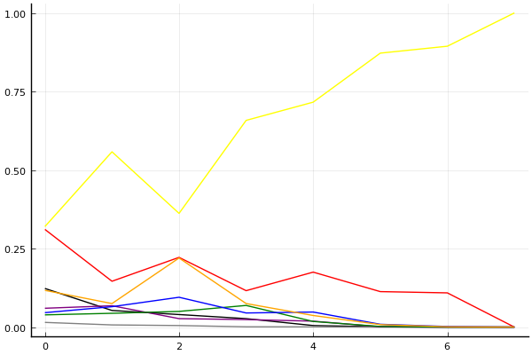
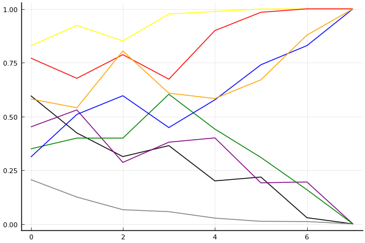

2018 듀얼 레이스 3 개인전 결승 1회전

## 경기 결과

| 트랙 | 문호준 | 김승태 | 유영혁 | 이준성 | 박인수 | 유창현 | 정승하 | 이재혁 |
|:---|---:|---:|---:|---:|---:|---:|---:|---:|
| [빌리지 붐힐터널](../boomhill) | 10 | -1 | 1 | 0 | 5 | 4 | 7 | 3 |
| [네모 산타의 비밀공간](../santa) | 1 | 3 | 7 | 0 | -1 | 4 | 5 | 10 |
| [광산 위험한 제련소](../jeryeonso) | 10 | 4 | 1 | 3 | 5 | 7 | 0 | -1 |
| [대저택 은밀한 지하실](../jeotaek) | 7 | 0 | 10 | 1 | 4 | -1 | 5 | 3 |
| [공동묘지 해골 손가락](../haeson) | 10 | 5 | 7 | 0 | -1 | 1 | 4 | 3 |
| [차이나 서안 병마용](../byeongma) | 7 | -1 | 10 | 5 | 3 | 0 | 1 | 4 |
| [노르테유 익스프레스](../noex) | 7 | 5 | 3 | -1 | 4 | 1 | 0 | 10 |
| __total__ |__52__ |__15__ |__39__ |__8__ |__19__ |__16__ |__22__ |__32__ |

## 시뮬레이션

### 1st 확률

x축: 트랙, y축: 확률
1번: 옐로우, 2번: 블랙, 3번: 레드, 4번: 화이트(회색), 5번: 퍼플, 6번: 그린, 7번: 블루, 8번: 오렌지

| 트랙 | 문호준 | 김승태 | 유영혁 | 이준성 | 박인수 | 유창현 | 정승하 | 이재혁 |
|:---|---:|---:|---:|---:|---:|---:|---:|---:|
| 초기 | 0.320 | 0.123 | 0.311 | 0.015 | 0.060 | 0.039 | 0.046 | 0.117 |
| 빌리지 붐힐터널 | 0.558 | 0.053 | 0.146 | 0.007 | 0.068 | 0.044 | 0.065 | 0.075 |
| 네모 산타의 비밀공간 | 0.362 | 0.040 | 0.222 | 0.005 | 0.027 | 0.050 | 0.095 | 0.220 |
| 광산 위험한 제련소 | 0.658 | 0.027 | 0.116 | 0.001 | 0.024 | 0.069 | 0.045 | 0.075 |
| 대저택 은밀한 지하실 | 0.716 | 0.005 | 0.175 | 0.001 | 0.019 | 0.018 | 0.048 | 0.037 |
| 공동묘지 해골 손가락 | 0.872 | 0.001 | 0.113 | 0.000 | 0.001 | 0.002 | 0.009 | 0.008 |
| 차이나 서안 병마용 | 0.894 | 0.000 | 0.109 | 0.000 | 0.000 | 0.000 | 0.002 | 0.001 |
| 노르테유 익스프레스 | 1.000 | 0.000 | 0.000 | 0.000 | 0.000 | 0.000 | 0.000 | 0.000 |

### Advance 확률

x축: 트랙, y축: 확률
1번: 옐로우, 2번: 블랙, 3번: 레드, 4번: 화이트(회색), 5번: 퍼플, 6번: 그린, 7번: 블루, 8번: 오렌지

| 트랙 | 문호준 | 김승태 | 유영혁 | 이준성 | 박인수 | 유창현 | 정승하 | 이재혁 |
|:---|---:|---:|---:|---:|---:|---:|---:|---:|
| 초기 | 0.828 | 0.596 | 0.771 | 0.206 | 0.451 | 0.349 | 0.311 | 0.581 |
| 빌리지 붐힐터널 | 0.923 | 0.423 | 0.677 | 0.125 | 0.530 | 0.399 | 0.509 | 0.540 |
| 네모 산타의 비밀공간 | 0.851 | 0.313 | 0.787 | 0.066 | 0.286 | 0.399 | 0.596 | 0.804 |
| 광산 위험한 제련소 | 0.976 | 0.364 | 0.673 | 0.057 | 0.380 | 0.603 | 0.448 | 0.608 |
| 대저택 은밀한 지하실 | 0.988 | 0.200 | 0.899 | 0.027 | 0.400 | 0.441 | 0.577 | 0.583 |
| 공동묘지 해골 손가락 | 0.999 | 0.218 | 0.984 | 0.012 | 0.191 | 0.309 | 0.740 | 0.670 |
| 차이나 서안 병마용 | 1.000 | 0.029 | 1.000 | 0.011 | 0.195 | 0.159 | 0.829 | 0.878 |
| 노르테유 익스프레스 | 1.000 | 0.000 | 1.000 | 0.000 | 0.000 | 0.000 | 1.000 | 1.000 |

## 랭킹 변동

### [전체 랭킹](../singles-full)

| 순위 | 변동 | 이름 | 점수 | 변동 | mu | 변동 | sigma | 변동 |
|---:|---:|:---:|---:|---:|---:|---:|---:|---:|
| 1 / 60 | +0 | [문호준](../munhojun) | 3474 | +58 | 3713 | +56 | 80 | -1 |
| 2 / 60 | +0 | [유영혁](../yuyeonghyeok) | 3416 | +25 | 3649 | +24 | 78 | -0 |
| 3 / 60 | +1 | [이재혁](../ijaehyeok) | 3290 | +13 | 3526 | +11 | 79 | -1 |
| 4 / 60 | -1 | [김승태](../gimseungtae) | 3255 | -36 | 3498 | -41 | 81 | -1 |
| 6 / 60 | -1 | [박인수](../bakinsu) | 3210 | -15 | 3445 | -17 | 78 | -1 |
| 7 / 60 | +0 | [유창현](../yuchanghyeon) | 3179 | -15 | 3411 | -16 | 77 | -0 |
| 9 / 60 | +0 | [정승하](../jeongseungha) | 3121 | +39 | 3414 | +16 | 98 | -8 |
| 10 / 60 | +0 | [이준성](../ijunseong) | 3058 | -23 | 3301 | -28 | 81 | -1 |

### 시즌 랭킹

| 순위 | 변동 | 이름 | 점수 | 변동 | mu | 변동 | sigma | 변동 |
|---:|---:|:---:|---:|---:|---:|---:|---:|---:|
| 1 / 32 | +0 | [문호준](../munhojun) | 3522 | +132 | 3881 | +83 | 120 | -16 |
| 2 / 32 | +0 | [유영혁](../yuyeonghyeok) | 3321 | +87 | 3645 | +52 | 108 | -12 |
| 3 / 32 | +0 | [이재혁](../ijaehyeok) | 3212 | +41 | 3509 | +18 | 99 | -8 |
| 4 / 32 | +0 | [박인수](../bakinsu) | 3129 | -8 | 3436 | -37 | 102 | -9 |
| 5 / 32 | +0 | [유창현](../yuchanghyeon) | 3099 | -6 | 3372 | -21 | 91 | -5 |
| 6 / 32 | +2 | [정승하](../jeongseungha) | 3083 | +46 | 3379 | +21 | 99 | -8 |
| 7 / 32 | -1 | [김승태](../gimseungtae) | 3059 | -16 | 3383 | -52 | 108 | -12 |
| 9 / 32 | +0 | [이준성](../ijunseong) | 2950 | -13 | 3242 | -34 | 97 | -7 |

### 트랙 별 랭킹

#### [공동묘지 해골 손가락](../haeson)

| 순위 | 변동 | 이름 | 점수 | 변동 | mu | 변동 | sigma | 변동 |
|:---:|:---:|:---:|---:|---:|---:|---:|---:|---:|
| 1 / 36 | +1 | [문호준](../munhojun) | 3208 | +244 | 4043 | +172 | 279 | -24 |
| 2 / 36 | -1 | [이재혁](../ijaehyeok) | 2990 | -2 | 3741 | -80 | 250 | -26 |
| 3 / 36 | +2 | [유영혁](../yuyeonghyeok) | 2917 | +186 | 3628 | +127 | 237 | -20 |
| 4 / 36 | +0 | [이준성](../ijunseong) | 2703 | -42 | 3400 | -99 | 232 | -19 |
| 5 / 36 | -2 | [박인수](../bakinsu) | 2623 | -147 | 3390 | -211 | 256 | -21 |
| 6 / 36 | +4 | [정승하](../jeongseungha) | 2542 | +381 | 3888 | -386 | 449 | -256 |
| 7 / 36 | +7 | [김승태](../gimseungtae) | 2539 | +495 | 3617 | +215 | 359 | -93 |
| 15 / 36 | +1 | [유창현](../yuchanghyeon) | 1986 | +304 | 2889 | +159 | 301 | -49 |

#### [광산 위험한 제련소](../jeryeonso)

| 순위 | 변동 | 이름 | 점수 | 변동 | mu | 변동 | sigma | 변동 |
|:---:|:---:|:---:|---:|---:|---:|---:|---:|---:|
| 1 / 40 | +0 | [박인수](../bakinsu) | 3165 | +53 | 3797 | +8 | 211 | -15 |
| 2 / 40 | +1 | [문호준](../munhojun) | 3129 | +232 | 3922 | +167 | 264 | -22 |
| 3 / 40 | -1 | [유영혁](../yuyeonghyeok) | 3010 | -49 | 3703 | -112 | 231 | -21 |
| 5 / 40 | +4 | [유창현](../yuchanghyeon) | 2820 | +219 | 3564 | +145 | 248 | -24 |
| 6 / 40 | +1 | [이준성](../ijunseong) | 2690 | +70 | 3315 | +25 | 208 | -15 |
| 7 / 40 | -2 | [이재혁](../ijaehyeok) | 2664 | -122 | 3374 | -171 | 237 | -16 |
| 10 / 40 | +4 | [김승태](../gimseungtae) | 2549 | +269 | 3509 | +71 | 320 | -66 |
| 12 / 40 | -1 | [정승하](../jeongseungha) | 2355 | +39 | 3186 | -66 | 277 | -35 |

#### [네모 산타의 비밀공간](../santa)

| 순위 | 변동 | 이름 | 점수 | 변동 | mu | 변동 | sigma | 변동 |
|:---:|:---:|:---:|---:|---:|---:|---:|---:|---:|
| 1 / 44 | +5 | [유영혁](../yuyeonghyeok) | 2727 | +67 | 3256 | +42 | 176 | -8 |
| 2 / 44 | -1 | [문호준](../munhojun) | 2726 | -49 | 3353 | -96 | 209 | -16 |
| 6 / 44 | -4 | [이준성](../ijunseong) | 2662 | -66 | 3255 | -102 | 198 | -12 |
| 7 / 44 | +2 | [이재혁](../ijaehyeok) | 2516 | +152 | 3099 | +124 | 194 | -9 |
| 10 / 44 | +0 | [유창현](../yuchanghyeon) | 2396 | +80 | 3021 | +33 | 208 | -16 |
| 11 / 44 | +9 | [정승하](../jeongseungha) | 2266 | +234 | 3120 | +102 | 284 | -44 |
| 13 / 44 | +3 | [김승태](../gimseungtae) | 2251 | +87 | 2934 | +23 | 228 | -21 |
| 15 / 44 | -4 | [박인수](../bakinsu) | 2214 | -55 | 2791 | -79 | 192 | -8 |

#### [노르테유 익스프레스](../noex)

| 순위 | 변동 | 이름 | 점수 | 변동 | mu | 변동 | sigma | 변동 |
|:---:|:---:|:---:|---:|---:|---:|---:|---:|---:|
| 1 / 60 | +0 | [박인수](../bakinsu) | 3751 | -32 | 4372 | -76 | 207 | -15 |
| 2 / 60 | +0 | [문호준](../munhojun) | 3616 | +87 | 4327 | +26 | 237 | -20 |
| 3 / 60 | +0 | [이재혁](../ijaehyeok) | 3507 | +170 | 4176 | +131 | 223 | -13 |
| 4 / 60 | +0 | [유영혁](../yuyeonghyeok) | 3187 | +40 | 3784 | +1 | 199 | -13 |
| 6 / 60 | -1 | [이준성](../ijunseong) | 3047 | -82 | 3663 | -112 | 205 | -10 |
| 7 / 60 | +0 | [정승하](../jeongseungha) | 2924 | -98 | 3877 | -275 | 318 | -59 |
| 8 / 60 | +0 | [유창현](../yuchanghyeon) | 2899 | +64 | 3614 | -5 | 238 | -23 |
| 11 / 60 | +9 | [김승태](../gimseungtae) | 2490 | +472 | 3344 | +343 | 285 | -43 |

#### [대저택 은밀한 지하실](../jeotaek)

| 순위 | 변동 | 이름 | 점수 | 변동 | mu | 변동 | sigma | 변동 |
|:---:|:---:|:---:|---:|---:|---:|---:|---:|---:|
| 1 / 59 | +0 | [유영혁](../yuyeonghyeok) | 3621 | +97 | 4295 | +67 | 225 | -10 |
| 3 / 59 | +1 | [이재혁](../ijaehyeok) | 3029 | +6 | 3706 | -53 | 226 | -20 |
| 4 / 59 | +3 | [정승하](../jeongseungha) | 2992 | +129 | 3797 | +26 | 268 | -34 |
| 6 / 59 | +0 | [박인수](../bakinsu) | 2947 | +67 | 3587 | +17 | 213 | -16 |
| 7 / 59 | -4 | [유창현](../yuchanghyeon) | 2900 | -126 | 3563 | -168 | 221 | -14 |
| 8 / 59 | +0 | [김승태](../gimseungtae) | 2767 | -56 | 3519 | -135 | 251 | -26 |
| 9 / 59 | +1 | [문호준](../munhojun) | 2690 | +217 | 3359 | +166 | 223 | -17 |
| 12 / 59 | +2 | [이준성](../ijunseong) | 2361 | +108 | 3021 | +55 | 220 | -18 |

#### [빌리지 붐힐터널](../boomhill)

| 순위 | 변동 | 이름 | 점수 | 변동 | mu | 변동 | sigma | 변동 |
|:---:|:---:|:---:|---:|---:|---:|---:|---:|---:|
| 1 / 33 | +2 | [문호준](../munhojun) | 2919 | +221 | 3715 | +157 | 265 | -21 |
| 3 / 33 | -1 | [유창현](../yuchanghyeon) | 2802 | +39 | 3566 | -50 | 255 | -30 |
| 4 / 33 | +3 | [박인수](../bakinsu) | 2635 | +122 | 3307 | +65 | 224 | -19 |
| 5 / 33 | +1 | [이재혁](../ijaehyeok) | 2583 | +50 | 3298 | -21 | 239 | -24 |
| 7 / 33 | -3 | [유영혁](../yuyeonghyeok) | 2566 | -10 | 3315 | -90 | 250 | -27 |
| 9 / 33 | +5 | [정승하](../jeongseungha) | 2416 | +318 | 3241 | +213 | 275 | -35 |
| 11 / 33 | +0 | [이준성](../ijunseong) | 2233 | +8 | 2971 | -61 | 246 | -23 |
| 15 / 33 | -5 | [김승태](../gimseungtae) | 2069 | -161 | 2985 | -268 | 305 | -36 |

#### [차이나 서안 병마용](../byeongma)

| 순위 | 변동 | 이름 | 점수 | 변동 | mu | 변동 | sigma | 변동 |
|:---:|:---:|:---:|---:|---:|---:|---:|---:|---:|
| 1 / 46 | +0 | [문호준](../munhojun) | 3023 | +62 | 3616 | +27 | 198 | -12 |
| 2 / 46 | +0 | [유영혁](../yuyeonghyeok) | 2826 | +120 | 3369 | +99 | 181 | -7 |
| 3 / 46 | +0 | [박인수](../bakinsu) | 2707 | +17 | 3228 | -9 | 174 | -9 |
| 4 / 46 | +5 | [이준성](../ijunseong) | 2648 | +93 | 3261 | +51 | 204 | -14 |
| 8 / 46 | +3 | [이재혁](../ijaehyeok) | 2565 | +68 | 3147 | +32 | 194 | -12 |
| 9 / 46 | -1 | [유창현](../yuchanghyeon) | 2532 | -27 | 3136 | -65 | 201 | -13 |
| 13 / 46 | -8 | [김승태](../gimseungtae) | 2422 | -177 | 3230 | -259 | 269 | -27 |
| 14 / 46 | +1 | [정승하](../jeongseungha) | 2369 | +41 | 3135 | -49 | 255 | -30 |
