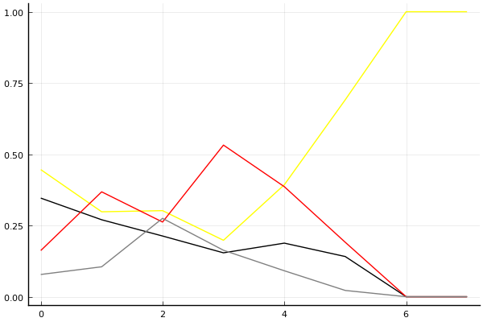
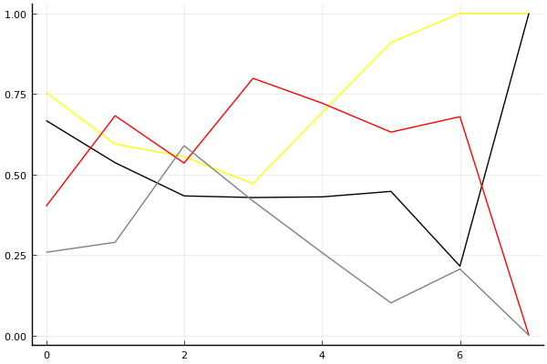

2018 듀얼 레이스 3 개인전 결승 2회전

## 경기 결과

| 트랙 | 문호준 | 유영혁 | 이재혁 | 정승하 |
|:---|---:|---:|---:|---:|
| [네모 산타의 비밀공간](../santa) | 4 | 5 | 10 | 7 |
| [포레스트 지그재그](../zigzag) | 7 | 5 | 4 | 10 |
| [빌리지 붐힐터널](../boomhill) | 5 | 7 | 10 | 4 |
| [노르테유 익스프레스](../noex) | 10 | 7 | 5 | 4 |
| [아이스 설산 다운힐](../seolsan) | 10 | 7 | 5 | 4 |
| [차이나 서안 병마용](../byeongma) | 10 | 4 | 5 | 7 |
| [공동묘지 해골 손가락](../haeson) | 7 | 10 | 4 | 5 |
| __total__ |__53__ |__45__ |__43__ |__41__ |

## 시뮬레이션

### 1st 확률

x축: 트랙, y축: 확률
1번: 옐로우, 2번: 블랙, 3번: 레드, 4번: 화이트(회색), 5번: 퍼플, 6번: 그린, 7번: 블루, 8번: 오렌지

| 트랙 | 문호준 | 유영혁 | 이재혁 | 정승하 |
|:---|---:|---:|---:|---:|
| 초기 | 0.446 | 0.346 | 0.162 | 0.078 |
| 네모 산타의 비밀공간 | 0.298 | 0.270 | 0.368 | 0.105 |
| 포레스트 지그재그 | 0.302 | 0.213 | 0.262 | 0.275 |
| 빌리지 붐힐터널 | 0.198 | 0.154 | 0.532 | 0.163 |
| 노르테유 익스프레스 | 0.393 | 0.188 | 0.386 | 0.091 |
| 아이스 설산 다운힐 | 0.691 | 0.141 | 0.191 | 0.022 |
| 차이나 서안 병마용 | 1.000 | 0.000 | 0.000 | 0.000 |
| 공동묘지 해골 손가락 | 1.000 | 0.000 | 0.000 | 0.000 |

### Advance 확률

x축: 트랙, y축: 확률
1번: 옐로우, 2번: 블랙, 3번: 레드, 4번: 화이트(회색), 5번: 퍼플, 6번: 그린, 7번: 블루, 8번: 오렌지

| 트랙 | 문호준 | 유영혁 | 이재혁 | 정승하 |
|:---|---:|---:|---:|---:|
| 초기 | 0.754 | 0.667 | 0.401 | 0.258 |
| 네모 산타의 비밀공간 | 0.594 | 0.536 | 0.682 | 0.289 |
| 포레스트 지그재그 | 0.555 | 0.433 | 0.535 | 0.589 |
| 빌리지 붐힐터널 | 0.471 | 0.428 | 0.798 | 0.417 |
| 노르테유 익스프레스 | 0.691 | 0.430 | 0.721 | 0.257 |
| 아이스 설산 다운힐 | 0.909 | 0.447 | 0.631 | 0.101 |
| 차이나 서안 병마용 | 1.000 | 0.215 | 0.679 | 0.206 |
| 공동묘지 해골 손가락 | 1.000 | 1.000 | 0.000 | 0.000 |

## 랭킹 변동

### [전체 랭킹](../singles-full)

| 순위 | 변동 | 이름 | 점수 | 변동 | mu | 변동 | sigma | 변동 |
|---:|---:|:---:|---:|---:|---:|---:|---:|---:|
| 1 / 60 | +0 | [문호준](../munhojun) | 3486 | +13 | 3727 | +14 | 80 | +0 |
| 2 / 60 | +0 | [유영혁](../yuyeonghyeok) | 3410 | -6 | 3645 | -4 | 78 | +1 |
| 3 / 60 | +0 | [이재혁](../ijaehyeok) | 3281 | -9 | 3519 | -7 | 79 | +1 |
| 9 / 60 | +0 | [정승하](../jeongseungha) | 3128 | +7 | 3411 | -3 | 94 | -3 |

### 시즌 랭킹

| 순위 | 변동 | 이름 | 점수 | 변동 | mu | 변동 | sigma | 변동 |
|---:|---:|:---:|---:|---:|---:|---:|---:|---:|
| 1 / 32 | +0 | [문호준](../munhojun) | 3540 | +18 | 3874 | -7 | 111 | -8 |
| 2 / 32 | +0 | [유영혁](../yuyeonghyeok) | 3340 | +19 | 3646 | +0 | 102 | -6 |
| 3 / 32 | +0 | [이재혁](../ijaehyeok) | 3218 | +6 | 3505 | -4 | 96 | -4 |
| 5 / 32 | +1 | [정승하](../jeongseungha) | 3100 | +17 | 3387 | +7 | 95 | -3 |

### 트랙 별 랭킹

#### [공동묘지 해골 손가락](../haeson)

| 순위 | 변동 | 이름 | 점수 | 변동 | mu | 변동 | sigma | 변동 |
|:---:|:---:|:---:|---:|---:|---:|---:|---:|---:|
| 1 / 36 | +0 | [문호준](../munhojun) | 3263 | +55 | 4033 | -10 | 257 | -22 |
| 2 / 36 | +1 | [유영혁](../yuyeonghyeok) | 3084 | +167 | 3760 | +132 | 225 | -12 |
| 3 / 36 | -1 | [이재혁](../ijaehyeok) | 2920 | -71 | 3635 | -106 | 238 | -12 |
| 5 / 36 | +1 | [정승하](../jeongseungha) | 2669 | +127 | 3781 | -107 | 371 | -78 |

#### [네모 산타의 비밀공간](../santa)

| 순위 | 변동 | 이름 | 점수 | 변동 | mu | 변동 | sigma | 변동 |
|:---:|:---:|:---:|---:|---:|---:|---:|---:|---:|
| 1 / 44 | +0 | [유영혁](../yuyeonghyeok) | 2725 | -3 | 3235 | -21 | 170 | -6 |
| 6 / 44 | -4 | [문호준](../munhojun) | 2655 | -71 | 3257 | -96 | 201 | -8 |
| 7 / 44 | +0 | [이재혁](../ijaehyeok) | 2617 | +101 | 3180 | +82 | 188 | -7 |
| 10 / 44 | +1 | [정승하](../jeongseungha) | 2398 | +132 | 3177 | +58 | 260 | -25 |

#### [노르테유 익스프레스](../noex)

| 순위 | 변동 | 이름 | 점수 | 변동 | mu | 변동 | sigma | 변동 |
|:---:|:---:|:---:|---:|---:|---:|---:|---:|---:|
| 2 / 60 | +0 | [문호준](../munhojun) | 3713 | +97 | 4395 | +68 | 227 | -9 |
| 3 / 60 | +0 | [이재혁](../ijaehyeok) | 3488 | -20 | 4122 | -54 | 211 | -11 |
| 4 / 60 | +0 | [유영혁](../yuyeonghyeok) | 3265 | +77 | 3836 | +53 | 191 | -8 |
| 8 / 60 | -1 | [정승하](../jeongseungha) | 2847 | -76 | 3730 | -147 | 294 | -23 |

#### [빌리지 붐힐터널](../boomhill)

| 순위 | 변동 | 이름 | 점수 | 변동 | mu | 변동 | sigma | 변동 |
|:---:|:---:|:---:|---:|---:|---:|---:|---:|---:|
| 2 / 33 | -1 | [문호준](../munhojun) | 2878 | -41 | 3616 | -100 | 246 | -19 |
| 4 / 33 | +1 | [이재혁](../ijaehyeok) | 2736 | +153 | 3416 | +118 | 227 | -12 |
| 5 / 33 | +2 | [유영혁](../yuyeonghyeok) | 2664 | +98 | 3363 | +48 | 233 | -17 |
| 9 / 33 | +0 | [정승하](../jeongseungha) | 2355 | -61 | 3133 | -108 | 259 | -16 |

#### [아이스 설산 다운힐](../seolsan)

| 순위 | 변동 | 이름 | 점수 | 변동 | mu | 변동 | sigma | 변동 |
|:---:|:---:|:---:|---:|---:|---:|---:|---:|---:|
| 1 / 36 | +1 | [문호준](../munhojun) | 3029 | +149 | 3769 | +108 | 247 | -14 |
| 3 / 36 | +0 | [이재혁](../ijaehyeok) | 2850 | +3 | 3581 | -52 | 244 | -18 |
| 5 / 36 | +3 | [유영혁](../yuyeonghyeok) | 2740 | +124 | 3485 | +66 | 248 | -20 |
| 9 / 36 | -3 | [정승하](../jeongseungha) | 2555 | -93 | 3393 | -157 | 279 | -21 |

#### [차이나 서안 병마용](../byeongma)

| 순위 | 변동 | 이름 | 점수 | 변동 | mu | 변동 | sigma | 변동 |
|:---:|:---:|:---:|---:|---:|---:|---:|---:|---:|
| 1 / 46 | +0 | [문호준](../munhojun) | 3088 | +66 | 3665 | +49 | 192 | -6 |
| 2 / 46 | +0 | [유영혁](../yuyeonghyeok) | 2771 | -56 | 3298 | -71 | 176 | -5 |
| 8 / 46 | +0 | [이재혁](../ijaehyeok) | 2584 | +20 | 3143 | -4 | 186 | -8 |
| 11 / 46 | +3 | [정승하](../jeongseungha) | 2487 | +119 | 3202 | +67 | 238 | -17 |

#### [포레스트 지그재그](../zigzag)

| 순위 | 변동 | 이름 | 점수 | 변동 | mu | 변동 | sigma | 변동 |
|:---:|:---:|:---:|---:|---:|---:|---:|---:|---:|
| 1 / 43 | +0 | [유영혁](../yuyeonghyeok) | 3632 | -28 | 4289 | -71 | 219 | -14 |
| 2 / 43 | +0 | [문호준](../munhojun) | 3560 | +43 | 4188 | +7 | 209 | -12 |
| 3 / 43 | +0 | [이재혁](../ijaehyeok) | 3435 | -72 | 4084 | -104 | 217 | -10 |
| 9 / 43 | +3 | [정승하](../jeongseungha) | 2899 | +341 | 3701 | +270 | 267 | -24 |
