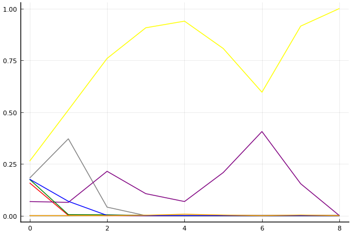
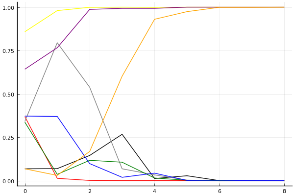
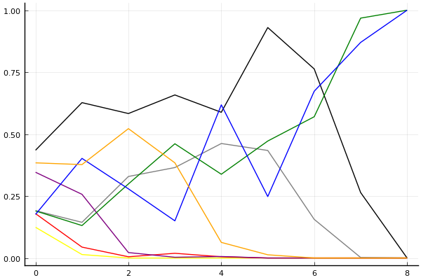

2019 시즌 2 개인전 32강 A조

## 경기 결과

| 트랙 | 문호준 | 김진석 | 박민호 | 최민석 | 이재혁 | 문진형 | 이건욱 | 양민규 |
|:---|---:|---:|---:|---:|---:|---:|---:|---:|
| [신화 신들의 세계](../shinsegye) | 10 | 3 | -1 | 7 | 5 | 0 | 4 | 1 |
| [해적 로비 절벽의 전투](../lobby) | 7 | 3 | -1 | 1 | 10 | 4 | 0 | 5 |
| [월드 뉴욕 대질주](../newyork) | 10 | 4 | 1 | -1 | 5 | 3 | 0 | 7 |
| [월드 이탈리아 피사의 사탑](../pizza) | 5 | -1 | 0 | 3 | 4 | 1 | 7 | 10 |
| [도검 구름의 협곡](../hyupgog) | 5 | 7 | 0 | 1 | 10 | 3 | -1 | 4 |
| [네모 산타의 비밀공간](../santa) | 7 | -1 | 1 | 0 | 10 | 3 | 5 | 4 |
| [비치 해변 드라이브](../haebyun) | 4 | 3 | 0 | 1 | -1 | 10 | 7 | 5 |
| [WKC 브라질 서킷](../brazil) | 10 | 3 | 7 | -1 | 5 | 4 | 1 | 0 |
| __total__ |__58__ |__21__ |__7__ |__11__ |__48__ |__28__ |__23__ |__36__ |

## 시뮬레이션

### 1st 확률

x축: 트랙, y축: 확률
1번: 옐로우, 2번: 블랙, 3번: 레드, 4번: 화이트(회색), 5번: 퍼플, 6번: 그린, 7번: 블루, 8번: 오렌지

| 트랙 | 문호준 | 김진석 | 박민호 | 최민석 | 이재혁 | 문진형 | 이건욱 | 양민규 |
|:---|---:|---:|---:|---:|---:|---:|---:|---:|
| 초기 | 0.263 | 0.000 | 0.158 | 0.181 | 0.068 | 0.175 | 0.176 | 0.000 |
| 신화 신들의 세계 | 0.510 | 0.000 | 0.001 | 0.371 | 0.064 | 0.005 | 0.069 | 0.000 |
| 해적 로비 절벽의 전투 | 0.759 | 0.001 | 0.000 | 0.041 | 0.214 | 0.004 | 0.001 | 0.000 |
| 월드 뉴욕 대질주 | 0.907 | 0.000 | 0.000 | 0.000 | 0.106 | 0.001 | 0.000 | 0.002 |
| 월드 이탈리아 피사의 사탑 | 0.939 | 0.000 | 0.000 | 0.000 | 0.068 | 0.000 | 0.000 | 0.007 |
| 도검 구름의 협곡 | 0.807 | 0.000 | 0.000 | 0.000 | 0.208 | 0.000 | 0.000 | 0.003 |
| 네모 산타의 비밀공간 | 0.596 | 0.000 | 0.000 | 0.000 | 0.406 | 0.000 | 0.000 | 0.000 |
| 비치 해변 드라이브 | 0.915 | 0.000 | 0.000 | 0.000 | 0.154 | 0.000 | 0.000 | 0.003 |
| WKC 브라질 서킷 | 1.000 | 0.000 | 0.000 | 0.000 | 0.000 | 0.000 | 0.000 | 0.000 |

### Advance 확률

x축: 트랙, y축: 확률
1번: 옐로우, 2번: 블랙, 3번: 레드, 4번: 화이트(회색), 5번: 퍼플, 6번: 그린, 7번: 블루, 8번: 오렌지

| 트랙 | 문호준 | 김진석 | 박민호 | 최민석 | 이재혁 | 문진형 | 이건욱 | 양민규 |
|:---|---:|---:|---:|---:|---:|---:|---:|---:|
| 초기 | 0.858 | 0.068 | 0.369 | 0.341 | 0.642 | 0.337 | 0.372 | 0.068 |
| 신화 신들의 세계 | 0.980 | 0.069 | 0.013 | 0.795 | 0.766 | 0.036 | 0.370 | 0.030 |
| 해적 로비 절벽의 전투 | 0.999 | 0.145 | 0.001 | 0.538 | 0.987 | 0.117 | 0.098 | 0.168 |
| 월드 뉴욕 대질주 | 1.000 | 0.267 | 0.000 | 0.068 | 0.993 | 0.106 | 0.019 | 0.602 |
| 월드 이탈리아 피사의 사탑 | 0.999 | 0.012 | 0.000 | 0.033 | 0.993 | 0.015 | 0.043 | 0.930 |
| 도검 구름의 협곡 | 1.000 | 0.028 | 0.000 | 0.003 | 1.000 | 0.002 | 0.001 | 0.974 |
| 네모 산타의 비밀공간 | 1.000 | 0.000 | 0.000 | 0.000 | 1.000 | 0.000 | 0.002 | 0.999 |
| 비치 해변 드라이브 | 1.000 | 0.000 | 0.000 | 0.000 | 1.000 | 0.001 | 0.000 | 0.999 |
| WKC 브라질 서킷 | 1.000 | 0.000 | 0.000 | 0.000 | 1.000 | 0.000 | 0.000 | 1.000 |

### Repechage 확률

x축: 트랙, y축: 확률
1번: 옐로우, 2번: 블랙, 3번: 레드, 4번: 화이트(회색), 5번: 퍼플, 6번: 그린, 7번: 블루, 8번: 오렌지

| 트랙 | 문호준 | 김진석 | 박민호 | 최민석 | 이재혁 | 문진형 | 이건욱 | 양민규 |
|:---|---:|---:|---:|---:|---:|---:|---:|---:|
| 초기 | 0.133 | 0.422 | 0.184 | 0.187 | 0.328 | 0.184 | 0.187 | 0.386 |
| 신화 신들의 세계 | 0.020 | 0.624 | 0.036 | 0.164 | 0.225 | 0.129 | 0.423 | 0.388 |
| 해적 로비 절벽의 전투 | 0.001 | 0.592 | 0.010 | 0.307 | 0.012 | 0.288 | 0.285 | 0.528 |
| 월드 뉴욕 대질주 | 0.000 | 0.630 | 0.021 | 0.389 | 0.007 | 0.445 | 0.169 | 0.359 |
| 월드 이탈리아 피사의 사탑 | 0.001 | 0.598 | 0.004 | 0.469 | 0.007 | 0.322 | 0.605 | 0.069 |
| 도검 구름의 협곡 | 0.000 | 0.911 | 0.000 | 0.384 | 0.000 | 0.485 | 0.296 | 0.026 |
| 네모 산타의 비밀공간 | 0.000 | 0.774 | 0.000 | 0.161 | 0.000 | 0.560 | 0.647 | 0.001 |
| 비치 해변 드라이브 | 0.000 | 0.253 | 0.000 | 0.008 | 0.000 | 0.970 | 0.865 | 0.001 |
| WKC 브라질 서킷 | 0.000 | 0.000 | 0.000 | 0.000 | 0.000 | 1.000 | 1.000 | 0.000 |

## 랭킹 변동

### [전체 랭킹](../singles-full)

| 순위 | 변동 | 이름 | 점수 | 변동 | mu | 변동 | sigma | 변동 |
|---:|---:|:---:|---:|---:|---:|---:|---:|---:|
| 1 / 73 | +0 | [문호준](../munhojun) | 3425 | -10 | 3663 | -9 | 79 | +0 |
| 5 / 73 | -1 | [이재혁](../ijaehyeok) | 3203 | -12 | 3440 | -12 | 79 | +0 |
| 34 / 73 | +14 | [양민규](../yangmingyu) | 2563 | +285 | 3001 | +134 | 146 | -50 |
| 36 / 73 | -2 | [김진석](../gimjinseok) | 2531 | -20 | 2854 | -58 | 108 | -13 |
| 49 / 73 | NaN | [문진형](../munjinhyeong) | 2276 | +2276 | 2902 | -98 | 209 | -791 |
| 54 / 73 | NaN | [이건욱](../igeonuk) | 2176 | +2176 | 2809 | -191 | 211 | -789 |
| 67 / 73 | NaN | [최민석](../choiminseok) | 1845 | +1845 | 2485 | -515 | 213 | -787 |
| 69 / 73 | NaN | [박민호](../bakminho) | 1823 | +1823 | 2499 | -501 | 225 | -775 |

### 시즌 랭킹

| 순위 | 변동 | 이름 | 점수 | 변동 | mu | 변동 | sigma | 변동 |
|---:|---:|:---:|---:|---:|---:|---:|---:|---:|
| 1 / 8 | NaN | [문호준](../munhojun) | 2979 | +2979 | 3698 | +698 | 240 | -760 |
| 2 / 8 | NaN | [이재혁](../ijaehyeok) | 2735 | +2735 | 3442 | +442 | 235 | -765 |
| 3 / 8 | NaN | [양민규](../yangmingyu) | 2562 | +2562 | 3229 | +229 | 222 | -778 |
| 4 / 8 | NaN | [문진형](../munjinhyeong) | 2321 | +2321 | 2977 | -23 | 219 | -781 |
| 5 / 8 | NaN | [이건욱](../igeonuk) | 2219 | +2219 | 2884 | -116 | 222 | -778 |
| 6 / 8 | NaN | [김진석](../gimjinseok) | 2093 | +2093 | 2755 | -245 | 221 | -779 |
| 7 / 8 | NaN | [박민호](../bakminho) | 1833 | +1833 | 2529 | -471 | 232 | -768 |
| 8 / 8 | NaN | [최민석](../choiminseok) | 1792 | +1792 | 2469 | -531 | 226 | -774 |

### 트랙 별 랭킹

#### [WKC 브라질 서킷](../brazil)

| 순위 | 변동 | 이름 | 점수 | 변동 | mu | 변동 | sigma | 변동 |
|:---:|:---:|:---:|---:|---:|---:|---:|---:|---:|
| 1 / 8 | NaN | [문호준](../munhojun) | 2161 | +2161 | 4274 | +1274 | 704 | -296 |
| 2 / 8 | NaN | [박민호](../bakminho) | 1887 | +1887 | 3763 | +763 | 625 | -375 |
| 3 / 8 | NaN | [이재혁](../ijaehyeok) | 1622 | +1622 | 3423 | +423 | 600 | -400 |
| 4 / 8 | NaN | [문진형](../munjinhyeong) | 1363 | +1363 | 3137 | +137 | 591 | -409 |
| 5 / 8 | NaN | [김진석](../gimjinseok) | 1090 | +1090 | 2863 | -137 | 591 | -409 |
| 6 / 8 | NaN | [이건욱](../igeonuk) | 776 | +776 | 2577 | -423 | 600 | -400 |
| 7 / 8 | NaN | [양민규](../yangmingyu) | 361 | +361 | 2237 | -763 | 625 | -375 |
| 8 / 8 | NaN | [최민석](../choiminseok) | -388 | -388 | 1726 | -1274 | 704 | -296 |

#### [네모 산타의 비밀공간](../santa)

| 순위 | 변동 | 이름 | 점수 | 변동 | mu | 변동 | sigma | 변동 |
|:---:|:---:|:---:|---:|---:|---:|---:|---:|---:|
| 1 / 50 | +1 | [문호준](../munhojun) | 2762 | +48 | 3285 | +29 | 174 | -6 |
| 4 / 50 | +2 | [이재혁](../ijaehyeok) | 2710 | +88 | 3212 | +74 | 167 | -5 |
| 27 / 50 | NaN | [이건욱](../igeonuk) | 1618 | +1618 | 3201 | +201 | 528 | -472 |
| 33 / 50 | NaN | [양민규](../yangmingyu) | 1400 | +1400 | 3002 | +2 | 534 | -466 |
| 37 / 50 | NaN | [문진형](../munjinhyeong) | 1179 | +1179 | 2802 | -198 | 541 | -459 |
| 39 / 50 | -10 | [김진석](../gimjinseok) | 1076 | -395 | 2407 | -672 | 443 | -92 |
| 40 / 50 | NaN | [박민호](../bakminho) | 941 | +941 | 2590 | -410 | 550 | -450 |
| 45 / 50 | NaN | [최민석](../choiminseok) | 665 | +665 | 2352 | -648 | 562 | -438 |

#### [도검 구름의 협곡](../hyupgog)

| 순위 | 변동 | 이름 | 점수 | 변동 | mu | 변동 | sigma | 변동 |
|:---:|:---:|:---:|---:|---:|---:|---:|---:|---:|
| 1 / 37 | +0 | [문호준](../munhojun) | 2977 | -62 | 3663 | -109 | 229 | -16 |
| 14 / 37 | +6 | [이재혁](../ijaehyeok) | 2108 | +571 | 3173 | +407 | 355 | -55 |
| 16 / 37 | +5 | [김진석](../gimjinseok) | 1974 | +502 | 3035 | +287 | 354 | -72 |
| 24 / 37 | +8 | [양민규](../yangmingyu) | 1248 | +906 | 2589 | +394 | 447 | -170 |
| 27 / 37 | NaN | [문진형](../munjinhyeong) | 1012 | +1012 | 2656 | -344 | 548 | -452 |
| 30 / 37 | NaN | [최민석](../choiminseok) | 709 | +709 | 2408 | -592 | 566 | -434 |
| 35 / 37 | NaN | [박민호](../bakminho) | 308 | +308 | 2101 | -899 | 598 | -402 |
| 37 / 37 | NaN | [이건욱](../igeonuk) | -423 | -423 | 1622 | -1378 | 681 | -319 |

#### [비치 해변 드라이브](../haebyun)

| 순위 | 변동 | 이름 | 점수 | 변동 | mu | 변동 | sigma | 변동 |
|:---:|:---:|:---:|---:|---:|---:|---:|---:|---:|
| 7 / 43 | +1 | [문호준](../munhojun) | 2520 | +85 | 3203 | +44 | 227 | -14 |
| 9 / 43 | -4 | [이재혁](../ijaehyeok) | 2387 | -217 | 3196 | -276 | 270 | -20 |
| 10 / 43 | NaN | [문진형](../munjinhyeong) | 2324 | +2324 | 4359 | +1359 | 678 | -322 |
| 16 / 43 | NaN | [이건욱](../igeonuk) | 2105 | +2105 | 3875 | +875 | 590 | -410 |
| 20 / 43 | NaN | [양민규](../yangmingyu) | 1903 | +1903 | 3564 | +564 | 554 | -446 |
| 28 / 43 | NaN | [김진석](../gimjinseok) | 1513 | +1513 | 3112 | +112 | 533 | -467 |
| 32 / 43 | NaN | [최민석](../choiminseok) | 1305 | +1305 | 2916 | -84 | 537 | -463 |
| 34 / 43 | NaN | [박민호](../bakminho) | 1089 | +1089 | 2715 | -285 | 542 | -458 |

#### [신화 신들의 세계](../shinsegye)

| 순위 | 변동 | 이름 | 점수 | 변동 | mu | 변동 | sigma | 변동 |
|:---:|:---:|:---:|---:|---:|---:|---:|---:|---:|
| 10 / 36 | +4 | [문호준](../munhojun) | 2425 | +282 | 3288 | +216 | 288 | -22 |
| 17 / 36 | +0 | [김진석](../gimjinseok) | 1934 | -8 | 3014 | -223 | 360 | -72 |
| 20 / 36 | NaN | [최민석](../choiminseok) | 1748 | +1748 | 3388 | +388 | 547 | -453 |
| 22 / 36 | +6 | [이재혁](../ijaehyeok) | 1456 | +1095 | 2802 | +565 | 449 | -177 |
| 25 / 36 | NaN | [이건욱](../igeonuk) | 1360 | +1360 | 2952 | -48 | 531 | -469 |
| 27 / 36 | -2 | [양민규](../yangmingyu) | 1270 | +181 | 2600 | -263 | 443 | -148 |
| 30 / 36 | NaN | [문진형](../munjinhyeong) | 442 | +442 | 2204 | -796 | 587 | -413 |
| 33 / 36 | NaN | [박민호](../bakminho) | -341 | -341 | 1703 | -1297 | 681 | -319 |

#### [월드 뉴욕 대질주](../newyork)

| 순위 | 변동 | 이름 | 점수 | 변동 | mu | 변동 | sigma | 변동 |
|:---:|:---:|:---:|---:|---:|---:|---:|---:|---:|
| 7 / 22 | +5 | [문호준](../munhojun) | 2100 | +441 | 3065 | +340 | 322 | -34 |
| 8 / 22 | +0 | [이재혁](../ijaehyeok) | 2093 | +167 | 3048 | +39 | 319 | -42 |
| 13 / 22 | NaN | [양민규](../yangmingyu) | 1695 | +1695 | 3331 | +331 | 546 | -454 |
| 16 / 22 | NaN | [김진석](../gimjinseok) | 1252 | +1252 | 2884 | -116 | 544 | -456 |
| 17 / 22 | NaN | [문진형](../munjinhyeong) | 995 | +995 | 2661 | -339 | 555 | -445 |
| 19 / 22 | NaN | [박민호](../bakminho) | 697 | +697 | 2411 | -589 | 571 | -429 |
| 20 / 22 | NaN | [이건욱](../igeonuk) | 299 | +299 | 2103 | -897 | 601 | -399 |
| 22 / 22 | NaN | [최민석](../choiminseok) | -428 | -428 | 1623 | -1377 | 684 | -316 |

#### [월드 이탈리아 피사의 사탑](../pizza)

| 순위 | 변동 | 이름 | 점수 | 변동 | mu | 변동 | sigma | 변동 |
|:---:|:---:|:---:|---:|---:|---:|---:|---:|---:|
| 1 / 8 | NaN | [양민규](../yangmingyu) | 2161 | +2161 | 4274 | +1274 | 704 | -296 |
| 2 / 8 | NaN | [이건욱](../igeonuk) | 1887 | +1887 | 3763 | +763 | 625 | -375 |
| 3 / 8 | NaN | [문호준](../munhojun) | 1622 | +1622 | 3423 | +423 | 600 | -400 |
| 4 / 8 | NaN | [이재혁](../ijaehyeok) | 1363 | +1363 | 3137 | +137 | 591 | -409 |
| 5 / 8 | NaN | [최민석](../choiminseok) | 1090 | +1090 | 2863 | -137 | 591 | -409 |
| 6 / 8 | NaN | [문진형](../munjinhyeong) | 776 | +776 | 2577 | -423 | 600 | -400 |
| 7 / 8 | NaN | [박민호](../bakminho) | 361 | +361 | 2237 | -763 | 625 | -375 |
| 8 / 8 | NaN | [김진석](../gimjinseok) | -388 | -388 | 1726 | -1274 | 704 | -296 |

#### [해적 로비 절벽의 전투](../lobby)

| 순위 | 변동 | 이름 | 점수 | 변동 | mu | 변동 | sigma | 변동 |
|:---:|:---:|:---:|---:|---:|---:|---:|---:|---:|
| 1 / 14 | +2 | [이재혁](../ijaehyeok) | 2547 | +925 | 4026 | +602 | 493 | -107 |
| 2 / 14 | +0 | [문호준](../munhojun) | 2441 | +554 | 3883 | +120 | 481 | -145 |
| 4 / 14 | NaN | [양민규](../yangmingyu) | 1702 | +1702 | 3435 | +435 | 578 | -422 |
| 5 / 14 | NaN | [문진형](../munjinhyeong) | 1414 | +1414 | 3149 | +149 | 578 | -422 |
| 7 / 14 | NaN | [김진석](../gimjinseok) | 1125 | +1125 | 2875 | -125 | 583 | -417 |
| 9 / 14 | NaN | [최민석](../choiminseok) | 801 | +801 | 2587 | -413 | 595 | -405 |
| 11 / 14 | NaN | [이건욱](../igeonuk) | 379 | +379 | 2246 | -754 | 622 | -378 |
| 13 / 14 | NaN | [박민호](../bakminho) | -377 | -377 | 1733 | -1267 | 703 | -297 |
