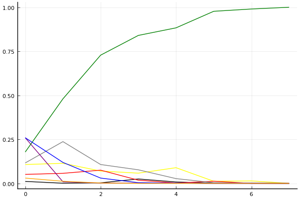
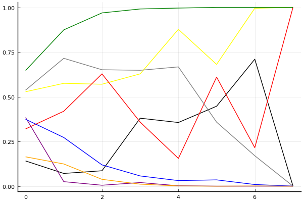
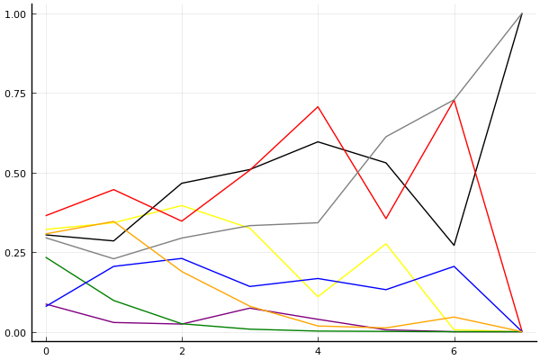

2019 시즌 2 개인전 32강 C조

## 경기 결과

| 트랙 | 황인호 | 박현수 | 이준성 | 신종민 | 조원호 | 전대웅 | 온유민 | 김지민 |
|:---|---:|---:|---:|---:|---:|---:|---:|---:|
| [신화 신들의 세계](../shinsegye) | 4 | 0 | 5 | 7 | -1 | 10 | 3 | 1 |
| [해적 로비 절벽의 전투](../lobby) | 4 | 5 | 7 | 3 | 0 | 10 | 1 | -1 |
| [팩토리 미완성 5구역](../district5) | 5 | 10 | -1 | 3 | 4 | 7 | 1 | 0 |
| [네모 산타의 비밀공간](../santa) | 10 | 4 | 1 | 5 | 0 | 7 | 3 | -1 |
| [WKC 브라질 서킷](../brazil) | -1 | 3 | 10 | 0 | 1 | 7 | 4 | 5 |
| [월드 뉴욕 대질주](../newyork) | 10 | 4 | -1 | 1 | 0 | 5 | 3 | 7 |
| [월드 이탈리아 피사의 사탑](../pizza) | 5 | 3 | 10 | 7 | -1 | 4 | 1 | 0 |
| __total__ |__37__ |__29__ |__31__ |__26__ |__3__ |__50__ |__16__ |__11__ |

## 시뮬레이션

### 1st 확률

x축: 트랙, y축: 확률
1번: 옐로우, 2번: 블랙, 3번: 레드, 4번: 화이트(회색), 5번: 퍼플, 6번: 그린, 7번: 블루, 8번: 오렌지

| 트랙 | 황인호 | 박현수 | 이준성 | 신종민 | 조원호 | 전대웅 | 온유민 | 김지민 |
|:---|---:|---:|---:|---:|---:|---:|---:|---:|
| 초기 | 0.107 | 0.011 | 0.051 | 0.116 | 0.259 | 0.178 | 0.259 | 0.030 |
| 신화 신들의 세계 | 0.114 | 0.001 | 0.057 | 0.237 | 0.009 | 0.480 | 0.119 | 0.012 |
| 해적 로비 절벽의 전투 | 0.070 | 0.003 | 0.075 | 0.107 | 0.002 | 0.728 | 0.030 | 0.002 |
| 팩토리 미완성 5구역 | 0.058 | 0.025 | 0.018 | 0.077 | 0.001 | 0.840 | 0.004 | 0.000 |
| 네모 산타의 비밀공간 | 0.089 | 0.008 | 0.002 | 0.027 | 0.001 | 0.883 | 0.001 | 0.000 |
| WKC 브라질 서킷 | 0.012 | 0.001 | 0.012 | 0.004 | 0.000 | 0.977 | 0.000 | 0.000 |
| 월드 뉴욕 대질주 | 0.014 | 0.001 | 0.000 | 0.001 | 0.000 | 0.990 | 0.000 | 0.000 |
| 월드 이탈리아 피사의 사탑 | 0.000 | 0.000 | 0.000 | 0.000 | 0.000 | 1.000 | 0.000 | 0.000 |

### Advance 확률

x축: 트랙, y축: 확률
1번: 옐로우, 2번: 블랙, 3번: 레드, 4번: 화이트(회색), 5번: 퍼플, 6번: 그린, 7번: 블루, 8번: 오렌지

| 트랙 | 황인호 | 박현수 | 이준성 | 신종민 | 조원호 | 전대웅 | 온유민 | 김지민 |
|:---|---:|---:|---:|---:|---:|---:|---:|---:|
| 초기 | 0.528 | 0.141 | 0.320 | 0.537 | 0.384 | 0.647 | 0.374 | 0.164 |
| 신화 신들의 세계 | 0.575 | 0.071 | 0.419 | 0.715 | 0.025 | 0.874 | 0.272 | 0.124 |
| 해적 로비 절벽의 전투 | 0.570 | 0.086 | 0.628 | 0.651 | 0.005 | 0.969 | 0.119 | 0.038 |
| 팩토리 미완성 5구역 | 0.628 | 0.380 | 0.358 | 0.648 | 0.020 | 0.991 | 0.057 | 0.011 |
| 네모 산타의 비밀공간 | 0.877 | 0.356 | 0.155 | 0.667 | 0.002 | 0.996 | 0.031 | 0.001 |
| WKC 브라질 서킷 | 0.681 | 0.447 | 0.610 | 0.358 | 0.000 | 1.000 | 0.035 | 0.000 |
| 월드 뉴욕 대질주 | 0.995 | 0.710 | 0.215 | 0.170 | 0.000 | 1.000 | 0.009 | 0.001 |
| 월드 이탈리아 피사의 사탑 | 1.000 | 0.000 | 1.000 | 0.000 | 0.000 | 1.000 | 0.000 | 0.000 |

### Repechage 확률

x축: 트랙, y축: 확률
1번: 옐로우, 2번: 블랙, 3번: 레드, 4번: 화이트(회색), 5번: 퍼플, 6번: 그린, 7번: 블루, 8번: 오렌지

| 트랙 | 황인호 | 박현수 | 이준성 | 신종민 | 조원호 | 전대웅 | 온유민 | 김지민 |
|:---|---:|---:|---:|---:|---:|---:|---:|---:|
| 초기 | 0.311 | 0.295 | 0.391 | 0.298 | 0.068 | 0.259 | 0.088 | 0.289 |
| 신화 신들의 세계 | 0.355 | 0.294 | 0.419 | 0.243 | 0.041 | 0.120 | 0.192 | 0.322 |
| 해적 로비 절벽의 전투 | 0.373 | 0.495 | 0.331 | 0.306 | 0.024 | 0.031 | 0.240 | 0.199 |
| 팩토리 미완성 5구역 | 0.327 | 0.494 | 0.535 | 0.308 | 0.067 | 0.009 | 0.144 | 0.069 |
| 네모 산타의 비밀공간 | 0.121 | 0.599 | 0.697 | 0.321 | 0.028 | 0.004 | 0.157 | 0.023 |
| WKC 브라질 서킷 | 0.305 | 0.515 | 0.367 | 0.576 | 0.005 | 0.000 | 0.124 | 0.007 |
| 월드 뉴욕 대질주 | 0.005 | 0.282 | 0.725 | 0.705 | 0.001 | 0.000 | 0.207 | 0.052 |
| 월드 이탈리아 피사의 사탑 | 0.000 | 1.000 | 0.000 | 1.000 | 0.000 | 0.000 | 0.000 | 0.000 |

## 랭킹 변동

### [전체 랭킹](../singles-full)

| 순위 | 변동 | 이름 | 점수 | 변동 | mu | 변동 | sigma | 변동 |
|---:|---:|:---:|---:|---:|---:|---:|---:|---:|
| 6 / 79 | +1 | [전대웅](../jeondaewoong) | 3201 | +33 | 3432 | +33 | 77 | +0 |
| 10 / 79 | +0 | [황인호](../hwanginho) | 3086 | +8 | 3318 | +8 | 77 | -0 |
| 13 / 79 | +0 | [신종민](../shinjongmin) | 3014 | -17 | 3291 | -33 | 92 | -5 |
| 16 / 79 | +0 | [이준성](../ijunseong) | 2975 | -2 | 3209 | -2 | 78 | +0 |
| 28 / 79 | +1 | [박현수](../bakhyeonsu) | 2783 | +52 | 3076 | +30 | 98 | -7 |
| 34 / 79 | -2 | [김지민](../gimjimin) | 2582 | -55 | 2951 | -112 | 123 | -19 |
| 52 / 79 | NaN | [온유민](../onyumin) | 2309 | +2309 | 2942 | -58 | 211 | -789 |
| 71 / 79 | NaN | [조원호](../jowonho) | 1881 | +1881 | 2572 | -428 | 230 | -770 |

### 시즌 랭킹

| 순위 | 변동 | 이름 | 점수 | 변동 | mu | 변동 | sigma | 변동 |
|---:|---:|:---:|---:|---:|---:|---:|---:|---:|
| 2 / 24 | NaN | [전대웅](../jeondaewoong) | 2842 | +2842 | 3599 | +599 | 252 | -748 |
| 5 / 24 | NaN | [황인호](../hwanginho) | 2643 | +2643 | 3371 | +371 | 242 | -758 |
| 9 / 24 | NaN | [박현수](../bakhyeonsu) | 2454 | +2454 | 3160 | +160 | 235 | -765 |
| 10 / 24 | NaN | [신종민](../shinjongmin) | 2358 | +2358 | 3052 | +52 | 231 | -769 |
| 12 / 24 | NaN | [이준성](../ijunseong) | 2326 | +2326 | 3076 | +76 | 250 | -750 |
| 17 / 24 | NaN | [온유민](../onyumin) | 2096 | +2096 | 2786 | -214 | 230 | -770 |
| 21 / 24 | NaN | [김지민](../gimjimin) | 1849 | +1849 | 2592 | -408 | 248 | -752 |
| 24 / 24 | NaN | [조원호](../jowonho) | 1589 | +1589 | 2335 | -665 | 249 | -751 |

### 트랙 별 랭킹

#### [WKC 브라질 서킷](../brazil)

| 순위 | 변동 | 이름 | 점수 | 변동 | mu | 변동 | sigma | 변동 |
|:---:|:---:|:---:|---:|---:|---:|---:|---:|---:|
| 3 / 24 | NaN | [이준성](../ijunseong) | 2161 | +2161 | 4274 | +1274 | 704 | -296 |
| 4 / 24 | NaN | [전대웅](../jeondaewoong) | 1887 | +1887 | 3763 | +763 | 625 | -375 |
| 8 / 24 | NaN | [김지민](../gimjimin) | 1622 | +1622 | 3423 | +423 | 600 | -400 |
| 11 / 24 | NaN | [온유민](../onyumin) | 1363 | +1363 | 3137 | +137 | 591 | -409 |
| 13 / 24 | NaN | [박현수](../bakhyeonsu) | 1090 | +1090 | 2863 | -137 | 591 | -409 |
| 18 / 24 | NaN | [조원호](../jowonho) | 776 | +776 | 2577 | -423 | 600 | -400 |
| 19 / 24 | NaN | [신종민](../shinjongmin) | 361 | +361 | 2237 | -763 | 625 | -375 |
| 22 / 24 | NaN | [황인호](../hwanginho) | -388 | -388 | 1726 | -1274 | 704 | -296 |

#### [네모 산타의 비밀공간](../santa)

| 순위 | 변동 | 이름 | 점수 | 변동 | mu | 변동 | sigma | 변동 |
|:---:|:---:|:---:|---:|---:|---:|---:|---:|---:|
| 7 / 58 | -1 | [이준성](../ijunseong) | 2599 | -62 | 3167 | -88 | 189 | -9 |
| 8 / 58 | +0 | [전대웅](../jeondaewoong) | 2561 | +74 | 3118 | +48 | 186 | -9 |
| 16 / 58 | +1 | [박현수](../bakhyeonsu) | 2279 | +73 | 3101 | -26 | 274 | -33 |
| 17 / 58 | +5 | [황인호](../hwanginho) | 2269 | +216 | 2940 | +174 | 224 | -14 |
| 29 / 58 | NaN | [신종민](../shinjongmin) | 1662 | +1662 | 3184 | +184 | 507 | -493 |
| 39 / 58 | NaN | [온유민](../onyumin) | 1324 | +1324 | 2857 | -143 | 511 | -489 |
| 51 / 58 | NaN | [조원호](../jowonho) | 600 | +600 | 2330 | -670 | 577 | -423 |
| 58 / 58 | NaN | [김지민](../gimjimin) | -250 | -250 | 1802 | -1198 | 684 | -316 |

#### [신화 신들의 세계](../shinsegye)

| 순위 | 변동 | 이름 | 점수 | 변동 | mu | 변동 | sigma | 변동 |
|:---:|:---:|:---:|---:|---:|---:|---:|---:|---:|
| 3 / 44 | +0 | [황인호](../hwanginho) | 2857 | +4 | 3604 | -64 | 249 | -23 |
| 8 / 44 | +2 | [이준성](../ijunseong) | 2603 | +162 | 3429 | +66 | 275 | -32 |
| 11 / 44 | +7 | [신종민](../shinjongmin) | 2452 | +313 | 3299 | +220 | 282 | -31 |
| 15 / 44 | NaN | [전대웅](../jeondaewoong) | 2240 | +2240 | 4206 | +1206 | 655 | -345 |
| 16 / 44 | -3 | [김지민](../gimjimin) | 2197 | -123 | 3303 | -350 | 369 | -76 |
| 26 / 44 | NaN | [온유민](../onyumin) | 1528 | +1528 | 3098 | +98 | 523 | -477 |
| 35 / 44 | NaN | [박현수](../bakhyeonsu) | 692 | +692 | 2489 | -511 | 599 | -401 |
| 40 / 44 | NaN | [조원호](../jowonho) | -201 | -201 | 1918 | -1082 | 706 | -294 |

#### [월드 뉴욕 대질주](../newyork)

| 순위 | 변동 | 이름 | 점수 | 변동 | mu | 변동 | sigma | 변동 |
|:---:|:---:|:---:|---:|---:|---:|---:|---:|---:|
| 2 / 34 | +0 | [전대웅](../jeondaewoong) | 2806 | +49 | 3653 | -27 | 282 | -25 |
| 3 / 34 | +4 | [황인호](../hwanginho) | 2701 | +548 | 3887 | +378 | 395 | -57 |
| 12 / 34 | NaN | [김지민](../gimjimin) | 2056 | +2056 | 3733 | +733 | 559 | -441 |
| 18 / 34 | NaN | [박현수](../bakhyeonsu) | 1504 | +1504 | 3178 | +178 | 558 | -442 |
| 22 / 34 | NaN | [온유민](../onyumin) | 1187 | +1187 | 2900 | -100 | 571 | -429 |
| 26 / 34 | NaN | [신종민](../shinjongmin) | 845 | +845 | 2608 | -392 | 588 | -412 |
| 29 / 34 | NaN | [조원호](../jowonho) | 409 | +409 | 2264 | -736 | 618 | -382 |
| 32 / 34 | NaN | [이준성](../ijunseong) | -359 | -359 | 1747 | -1253 | 702 | -298 |

#### [월드 이탈리아 피사의 사탑](../pizza)

| 순위 | 변동 | 이름 | 점수 | 변동 | mu | 변동 | sigma | 변동 |
|:---:|:---:|:---:|---:|---:|---:|---:|---:|---:|
| 3 / 24 | NaN | [이준성](../ijunseong) | 2161 | +2161 | 4274 | +1274 | 704 | -296 |
| 4 / 24 | NaN | [신종민](../shinjongmin) | 1887 | +1887 | 3763 | +763 | 625 | -375 |
| 7 / 24 | NaN | [황인호](../hwanginho) | 1622 | +1622 | 3423 | +423 | 600 | -400 |
| 10 / 24 | NaN | [전대웅](../jeondaewoong) | 1363 | +1363 | 3137 | +137 | 591 | -409 |
| 13 / 24 | NaN | [박현수](../bakhyeonsu) | 1090 | +1090 | 2863 | -137 | 591 | -409 |
| 17 / 24 | NaN | [온유민](../onyumin) | 776 | +776 | 2577 | -423 | 600 | -400 |
| 21 / 24 | NaN | [김지민](../gimjimin) | 361 | +361 | 2237 | -763 | 625 | -375 |
| 23 / 24 | NaN | [조원호](../jowonho) | -388 | -388 | 1726 | -1274 | 704 | -296 |

#### [팩토리 미완성 5구역](../district5)

| 순위 | 변동 | 이름 | 점수 | 변동 | mu | 변동 | sigma | 변동 |
|:---:|:---:|:---:|---:|---:|---:|---:|---:|---:|
| 6 / 73 | +2 | [전대웅](../jeondaewoong) | 2875 | +101 | 3490 | +63 | 205 | -13 |
| 8 / 73 | -2 | [이준성](../ijunseong) | 2797 | -91 | 3356 | -113 | 186 | -7 |
| 9 / 73 | +2 | [황인호](../hwanginho) | 2766 | +82 | 3359 | +46 | 198 | -12 |
| 11 / 73 | -1 | [신종민](../shinjongmin) | 2690 | -29 | 3663 | -222 | 324 | -64 |
| 22 / 73 | +18 | [박현수](../bakhyeonsu) | 2310 | +667 | 3329 | +491 | 339 | -58 |
| 28 / 73 | -1 | [김지민](../gimjimin) | 2062 | -16 | 3253 | -400 | 397 | -128 |
| 38 / 73 | NaN | [조원호](../jowonho) | 1866 | +1866 | 3364 | +364 | 499 | -501 |
| 46 / 73 | NaN | [온유민](../onyumin) | 1554 | +1554 | 3074 | +74 | 507 | -493 |

#### [해적 로비 절벽의 전투](../lobby)

| 순위 | 변동 | 이름 | 점수 | 변동 | mu | 변동 | sigma | 변동 |
|:---:|:---:|:---:|---:|---:|---:|---:|---:|---:|
| 5 / 28 | NaN | [전대웅](../jeondaewoong) | 2161 | +2161 | 4274 | +1274 | 704 | -296 |
| 7 / 28 | NaN | [이준성](../ijunseong) | 1887 | +1887 | 3763 | +763 | 625 | -375 |
| 9 / 28 | NaN | [박현수](../bakhyeonsu) | 1622 | +1622 | 3423 | +423 | 600 | -400 |
| 13 / 28 | NaN | [황인호](../hwanginho) | 1363 | +1363 | 3137 | +137 | 591 | -409 |
| 16 / 28 | NaN | [신종민](../shinjongmin) | 1090 | +1090 | 2863 | -137 | 591 | -409 |
| 19 / 28 | NaN | [온유민](../onyumin) | 776 | +776 | 2577 | -423 | 600 | -400 |
| 23 / 28 | NaN | [조원호](../jowonho) | 361 | +361 | 2237 | -763 | 625 | -375 |
| 28 / 28 | NaN | [김지민](../gimjimin) | -388 | -388 | 1726 | -1274 | 704 | -296 |
