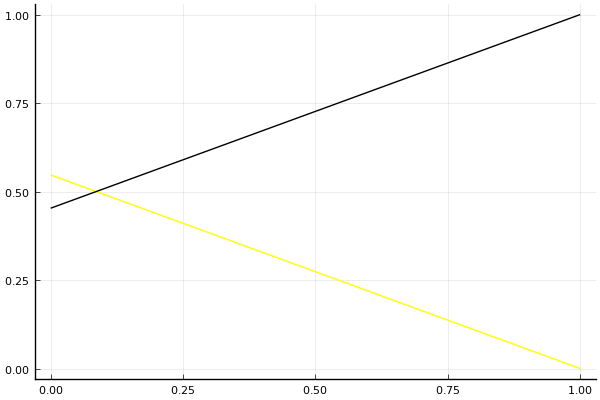

2019 시즌 2 개인전 32강 D조 tiebreaker

## 경기 결과

| 트랙 | 전강인 | 최윤서 |
|:---|---:|---:|
| [신화 신들의 세계](../shinsegye) | 0 | 1 |
| __total__ |__0__ |__1__ |

## 시뮬레이션

### 1st 확률

x축: 트랙, y축: 확률
1번: 옐로우, 2번: 블랙, 3번: 레드, 4번: 화이트(회색), 5번: 퍼플, 6번: 그린, 7번: 블루, 8번: 오렌지

| 트랙 | 전강인 | 최윤서 |
|:---|---:|---:|
| 초기 | 0.496 | 0.504 |
| 신화 신들의 세계 | 0.000 | 1.000 |

## 랭킹 변동

### [전체 랭킹](../singles-full)

| 순위 | 변동 | 이름 | 점수 | 변동 | mu | 변동 | sigma | 변동 |
|---:|---:|:---:|---:|---:|---:|---:|---:|---:|
| 40 / 82 | +2 | [최윤서](../choiyunseo) | 2521 | +50 | 3074 | +39 | 184 | -4 |
| 42 / 82 | -4 | [전강인](../jeongangin) | 2508 | -28 | 3048 | -37 | 180 | -3 |

### 시즌 랭킹

| 순위 | 변동 | 이름 | 점수 | 변동 | mu | 변동 | sigma | 변동 |
|---:|---:|:---:|---:|---:|---:|---:|---:|---:|
| 9 / 32 | +0 | [전강인](../jeongangin) | 2570 | -30 | 3132 | -42 | 187 | -4 |
| 10 / 32 | +4 | [최윤서](../choiyunseo) | 2563 | +57 | 3143 | +45 | 194 | -4 |

### 트랙 별 랭킹

#### [신화 신들의 세계](../shinsegye)

| 순위 | 변동 | 이름 | 점수 | 변동 | mu | 변동 | sigma | 변동 |
|:---:|:---:|:---:|---:|---:|---:|---:|---:|---:|
| 27 / 47 | +2 | [최윤서](../choiyunseo) | 1604 | +225 | 3050 | +127 | 482 | -32 |
| 37 / 47 | +0 | [전강인](../jeongangin) | 619 | -20 | 2225 | -163 | 535 | -48 |
