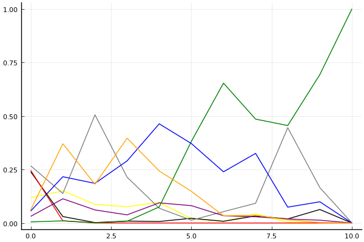
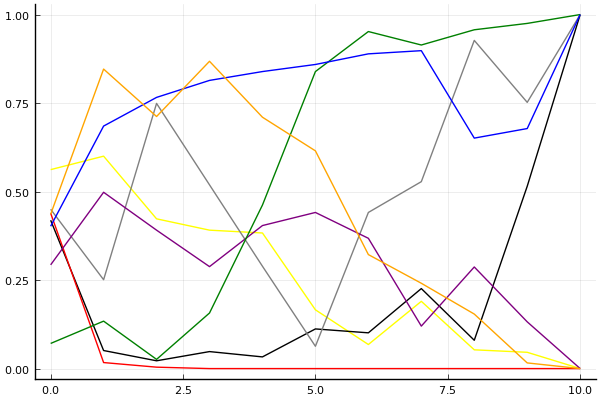
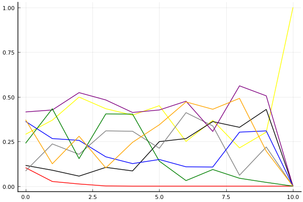

2019 시즌 2 개인전 32강 D조

## 경기 결과

| 트랙 | 김승래 | 전강인 | 이강호 | 최윤서 | 이준용 | 김기수 | 최영훈 | 한승철 |
|:---|---:|---:|---:|---:|---:|---:|---:|---:|
| [신화 신들의 세계](../shinsegye) | 1 | 0 | -1 | 3 | 5 | 4 | 7 | 10 |
| [도검 구름의 협곡](../hyupgog) | 4 | 1 | 0 | 10 | 5 | -1 | 7 | 3 |
| [월드 뉴욕 대질주](../newyork) | 3 | 4 | -1 | 1 | 0 | 10 | 5 | 7 |
| [네모 산타의 비밀공간](../santa) | 4 | 3 | -1 | 1 | 7 | 10 | 5 | 0 |
| [해적 로비 절벽의 전투](../lobby) | 1 | 7 | -1 | 0 | 5 | 10 | 4 | 3 |
| [비치 해변 드라이브](../haebyun) | 0 | 4 | 5 | 10 | 1 | 7 | 3 | -1 |
| [공동묘지 해골 손가락](../haeson) | 10 | 7 | -1 | 5 | 1 | 0 | 4 | 3 |
| [WKC 브라질 서킷](../brazil) | 0 | 1 | 5 | 10 | 7 | 4 | -1 | 3 |
| [월드 이탈리아 피사의 사탑](../pizza) | 5 | 10 | 7 | 0 | 1 | 3 | 4 | -1 |
| [팩토리 미완성 5구역](../district5) | 10 | 4 | 0 | 1 | 3 | 5 | 7 | -1 |
| __total__ |__38__ |__41__ |__12__ |__41__ |__35__ |__52__ |__45__ |__26__ |

## 시뮬레이션

### 1st 확률

x축: 트랙, y축: 확률
1번: 옐로우, 2번: 블랙, 3번: 레드, 4번: 화이트(회색), 5번: 퍼플, 6번: 그린, 7번: 블루, 8번: 오렌지

| 트랙 | 김승래 | 전강인 | 이강호 | 최윤서 | 이준용 | 김기수 | 최영훈 | 한승철 |
|:---|---:|---:|---:|---:|---:|---:|---:|---:|
| 초기 | 0.118 | 0.239 | 0.246 | 0.267 | 0.031 | 0.005 | 0.056 | 0.061 |
| 신화 신들의 세계 | 0.150 | 0.030 | 0.010 | 0.138 | 0.113 | 0.010 | 0.216 | 0.370 |
| 도검 구름의 협곡 | 0.087 | 0.002 | 0.000 | 0.505 | 0.061 | 0.001 | 0.185 | 0.181 |
| 월드 뉴욕 대질주 | 0.076 | 0.009 | 0.000 | 0.214 | 0.038 | 0.008 | 0.290 | 0.396 |
| 네모 산타의 비밀공간 | 0.096 | 0.007 | 0.000 | 0.069 | 0.094 | 0.075 | 0.463 | 0.243 |
| 해적 로비 절벽의 전투 | 0.020 | 0.022 | 0.000 | 0.013 | 0.081 | 0.381 | 0.371 | 0.148 |
| 비치 해변 드라이브 | 0.007 | 0.008 | 0.000 | 0.053 | 0.034 | 0.653 | 0.239 | 0.034 |
| 공동묘지 해골 손가락 | 0.043 | 0.033 | 0.000 | 0.092 | 0.029 | 0.485 | 0.325 | 0.036 |
| WKC 브라질 서킷 | 0.004 | 0.019 | 0.000 | 0.445 | 0.019 | 0.455 | 0.074 | 0.015 |
| 월드 이탈리아 피사의 사탑 | 0.002 | 0.063 | 0.000 | 0.165 | 0.013 | 0.693 | 0.099 | 0.002 |
| 팩토리 미완성 5구역 | 0.000 | 0.000 | 0.000 | 0.000 | 0.000 | 1.000 | 0.000 | 0.000 |

### Advance 확률

x축: 트랙, y축: 확률
1번: 옐로우, 2번: 블랙, 3번: 레드, 4번: 화이트(회색), 5번: 퍼플, 6번: 그린, 7번: 블루, 8번: 오렌지

| 트랙 | 김승래 | 전강인 | 이강호 | 최윤서 | 이준용 | 김기수 | 최영훈 | 한승철 |
|:---|---:|---:|---:|---:|---:|---:|---:|---:|
| 초기 | 0.597 | 0.416 | 0.420 | 0.456 | 0.284 | 0.071 | 0.424 | 0.426 |
| 신화 신들의 세계 | 0.563 | 0.079 | 0.023 | 0.283 | 0.466 | 0.109 | 0.695 | 0.861 |
| 도검 구름의 협곡 | 0.426 | 0.025 | 0.002 | 0.768 | 0.422 | 0.020 | 0.722 | 0.698 |
| 월드 뉴욕 대질주 | 0.418 | 0.041 | 0.001 | 0.511 | 0.260 | 0.142 | 0.816 | 0.883 |
| 네모 산타의 비밀공간 | 0.386 | 0.044 | 0.000 | 0.265 | 0.428 | 0.436 | 0.852 | 0.707 |
| 해적 로비 절벽의 전투 | 0.170 | 0.102 | 0.000 | 0.061 | 0.480 | 0.844 | 0.843 | 0.604 |
| 비치 해변 드라이브 | 0.066 | 0.111 | 0.000 | 0.411 | 0.333 | 0.969 | 0.881 | 0.335 |
| 공동묘지 해골 손가락 | 0.219 | 0.229 | 0.000 | 0.502 | 0.169 | 0.894 | 0.879 | 0.231 |
| WKC 브라질 서킷 | 0.038 | 0.092 | 0.000 | 0.934 | 0.283 | 0.954 | 0.664 | 0.156 |
| 월드 이탈리아 피사의 사탑 | 0.049 | 0.525 | 0.000 | 0.765 | 0.148 | 0.978 | 0.661 | 0.017 |
| 팩토리 미완성 5구역 | 0.000 | 1.000 | 0.000 | 1.000 | 0.000 | 1.000 | 1.000 | 0.000 |

### Repechage 확률

x축: 트랙, y축: 확률
1번: 옐로우, 2번: 블랙, 3번: 레드, 4번: 화이트(회색), 5번: 퍼플, 6번: 그린, 7번: 블루, 8번: 오렌지

| 트랙 | 김승래 | 전강인 | 이강호 | 최윤서 | 이준용 | 김기수 | 최영훈 | 한승철 |
|:---|---:|---:|---:|---:|---:|---:|---:|---:|
| 초기 | 0.290 | 0.116 | 0.103 | 0.085 | 0.415 | 0.240 | 0.362 | 0.371 |
| 신화 신들의 세계 | 0.369 | 0.089 | 0.026 | 0.236 | 0.426 | 0.433 | 0.266 | 0.125 |
| 도검 구름의 협곡 | 0.498 | 0.056 | 0.012 | 0.178 | 0.523 | 0.154 | 0.256 | 0.279 |
| 월드 뉴욕 대질주 | 0.433 | 0.105 | 0.001 | 0.309 | 0.482 | 0.404 | 0.164 | 0.102 |
| 네모 산타의 비밀공간 | 0.397 | 0.085 | 0.000 | 0.307 | 0.412 | 0.403 | 0.126 | 0.245 |
| 해적 로비 절벽의 전투 | 0.450 | 0.249 | 0.000 | 0.212 | 0.426 | 0.140 | 0.149 | 0.343 |
| 비치 해변 드라이브 | 0.250 | 0.266 | 0.000 | 0.411 | 0.475 | 0.031 | 0.108 | 0.471 |
| 공동묘지 해골 손가락 | 0.368 | 0.361 | 0.000 | 0.337 | 0.306 | 0.093 | 0.107 | 0.430 |
| WKC 브라질 서킷 | 0.214 | 0.329 | 0.000 | 0.061 | 0.561 | 0.044 | 0.302 | 0.491 |
| 월드 이탈리아 피사의 사탑 | 0.302 | 0.429 | 0.000 | 0.219 | 0.505 | 0.021 | 0.309 | 0.196 |
| 팩토리 미완성 5구역 | 1.000 | 0.000 | 0.000 | 0.000 | 0.000 | 0.000 | 0.000 | 0.000 |

## 랭킹 변동

### [전체 랭킹](../singles-full)

| 순위 | 변동 | 이름 | 점수 | 변동 | mu | 변동 | sigma | 변동 |
|---:|---:|:---:|---:|---:|---:|---:|---:|---:|
| 16 / 82 | -2 | [김승래](../gimseungrae) | 2970 | -40 | 3201 | -41 | 77 | -0 |
| 20 / 82 | +1 | [최영훈](../choiyeonghun) | 2894 | +3 | 3132 | -1 | 79 | -1 |
| 24 / 82 | -5 | [한승철](../hanseungcheol) | 2823 | -85 | 3072 | -92 | 83 | -2 |
| 25 / 82 | +0 | [이준용](../ijunyong) | 2815 | -8 | 3057 | -14 | 81 | -2 |
| 34 / 82 | +15 | [김기수](../gimgisu) | 2603 | +225 | 2957 | +143 | 118 | -27 |
| 38 / 82 | NaN | [전강인](../jeongangin) | 2536 | +2536 | 3085 | +85 | 183 | -817 |
| 42 / 82 | NaN | [최윤서](../choiyunseo) | 2471 | +2471 | 3035 | +35 | 188 | -812 |
| 71 / 82 | NaN | [이강호](../igangho) | 1912 | +1912 | 2553 | -447 | 214 | -786 |

### 시즌 랭킹

| 순위 | 변동 | 이름 | 점수 | 변동 | mu | 변동 | sigma | 변동 |
|---:|---:|:---:|---:|---:|---:|---:|---:|---:|
| 5 / 32 | NaN | [김기수](../gimgisu) | 2659 | +2659 | 3255 | +255 | 199 | -801 |
| 8 / 32 | NaN | [최영훈](../choiyeonghun) | 2614 | +2614 | 3184 | +184 | 190 | -810 |
| 9 / 32 | NaN | [전강인](../jeongangin) | 2600 | +2600 | 3173 | +173 | 191 | -809 |
| 12 / 32 | NaN | [김승래](../gimseungrae) | 2538 | +2538 | 3115 | +115 | 192 | -808 |
| 13 / 32 | NaN | [이준용](../ijunyong) | 2513 | +2513 | 3082 | +82 | 190 | -810 |
| 14 / 32 | NaN | [최윤서](../choiyunseo) | 2505 | +2505 | 3099 | +99 | 198 | -802 |
| 25 / 32 | NaN | [한승철](../hanseungcheol) | 2089 | +2089 | 2690 | -310 | 200 | -800 |
| 28 / 32 | NaN | [이강호](../igangho) | 1936 | +1936 | 2608 | -392 | 224 | -776 |

### 트랙 별 랭킹

#### [WKC 브라질 서킷](../brazil)

| 순위 | 변동 | 이름 | 점수 | 변동 | mu | 변동 | sigma | 변동 |
|:---:|:---:|:---:|---:|---:|---:|---:|---:|---:|
| 1 / 32 | NaN | [최윤서](../choiyunseo) | 2161 | +2161 | 4274 | +1274 | 704 | -296 |
| 8 / 32 | NaN | [이준용](../ijunyong) | 1887 | +1887 | 3763 | +763 | 625 | -375 |
| 9 / 32 | NaN | [이강호](../igangho) | 1622 | +1622 | 3423 | +423 | 600 | -400 |
| 16 / 32 | NaN | [김기수](../gimgisu) | 1363 | +1363 | 3137 | +137 | 591 | -409 |
| 17 / 32 | NaN | [한승철](../hanseungcheol) | 1090 | +1090 | 2863 | -137 | 591 | -409 |
| 21 / 32 | NaN | [전강인](../jeongangin) | 776 | +776 | 2577 | -423 | 600 | -400 |
| 28 / 32 | NaN | [김승래](../gimseungrae) | 361 | +361 | 2237 | -763 | 625 | -375 |
| 32 / 32 | NaN | [최영훈](../choiyeonghun) | -388 | -388 | 1726 | -1274 | 704 | -296 |

#### [공동묘지 해골 손가락](../haeson)

| 순위 | 변동 | 이름 | 점수 | 변동 | mu | 변동 | sigma | 변동 |
|:---:|:---:|:---:|---:|---:|---:|---:|---:|---:|
| 5 / 40 | +3 | [김승래](../gimseungrae) | 2685 | +255 | 3577 | +190 | 297 | -21 |
| 14 / 40 | -5 | [이준용](../ijunyong) | 2036 | -195 | 3084 | -388 | 349 | -65 |
| 16 / 40 | NaN | [전강인](../jeongangin) | 1825 | +1825 | 3498 | +498 | 558 | -442 |
| 17 / 40 | +0 | [한승철](../hanseungcheol) | 1809 | +129 | 2762 | -15 | 318 | -48 |
| 22 / 40 | NaN | [최윤서](../choiyunseo) | 1584 | +1584 | 3216 | +216 | 544 | -456 |
| 31 / 40 | +3 | [최영훈](../choiyeonghun) | 1116 | +1480 | 2504 | +820 | 463 | -220 |
| 34 / 40 | NaN | [김기수](../gimgisu) | 531 | +531 | 2274 | -726 | 581 | -419 |
| 37 / 40 | NaN | [이강호](../igangho) | -289 | -289 | 1758 | -1242 | 682 | -318 |

#### [네모 산타의 비밀공간](../santa)

| 순위 | 변동 | 이름 | 점수 | 변동 | mu | 변동 | sigma | 변동 |
|:---:|:---:|:---:|---:|---:|---:|---:|---:|---:|
| 2 / 62 | +0 | [김승래](../gimseungrae) | 2722 | +9 | 3414 | -42 | 230 | -17 |
| 9 / 62 | +1 | [최영훈](../choiyeonghun) | 2545 | +142 | 3389 | +42 | 281 | -34 |
| 11 / 62 | +9 | [이준용](../ijunyong) | 2436 | +300 | 3318 | +198 | 294 | -34 |
| 21 / 62 | NaN | [김기수](../gimgisu) | 2169 | +2169 | 4158 | +1158 | 663 | -337 |
| 26 / 62 | -1 | [한승철](../hanseungcheol) | 1760 | -46 | 2591 | -113 | 277 | -22 |
| 40 / 62 | NaN | [전강인](../jeongangin) | 1360 | +1360 | 2950 | -50 | 530 | -470 |
| 46 / 62 | NaN | [최윤서](../choiyunseo) | 1078 | +1078 | 2698 | -302 | 540 | -460 |
| 61 / 62 | NaN | [이강호](../igangho) | -153 | -153 | 1874 | -1126 | 676 | -324 |

#### [도검 구름의 협곡](../hyupgog)

| 순위 | 변동 | 이름 | 점수 | 변동 | mu | 변동 | sigma | 변동 |
|:---:|:---:|:---:|---:|---:|---:|---:|---:|---:|
| 5 / 44 | +1 | [김승래](../gimseungrae) | 2585 | +47 | 3273 | -4 | 229 | -17 |
| 6 / 44 | +5 | [최영훈](../choiyeonghun) | 2575 | +237 | 3428 | +149 | 284 | -29 |
| 9 / 44 | -2 | [한승철](../hanseungcheol) | 2465 | -68 | 3413 | -215 | 316 | -49 |
| 14 / 44 | +5 | [이준용](../ijunyong) | 2188 | +423 | 3260 | +181 | 358 | -81 |
| 15 / 44 | NaN | [최윤서](../choiyunseo) | 2187 | +2187 | 4175 | +1175 | 662 | -338 |
| 30 / 44 | NaN | [전강인](../jeongangin) | 1002 | +1002 | 2679 | -321 | 559 | -441 |
| 36 / 44 | NaN | [이강호](../igangho) | 505 | +505 | 2292 | -708 | 595 | -405 |
| 40 / 44 | -5 | [김기수](../gimgisu) | 322 | -72 | 1634 | -214 | 437 | -48 |

#### [비치 해변 드라이브](../haebyun)

| 순위 | 변동 | 이름 | 점수 | 변동 | mu | 변동 | sigma | 변동 |
|:---:|:---:|:---:|---:|---:|---:|---:|---:|---:|
| 14 / 55 | NaN | [최윤서](../choiyunseo) | 2191 | +2191 | 4277 | +1277 | 695 | -305 |
| 21 / 55 | NaN | [김기수](../gimgisu) | 1941 | +1941 | 3768 | +768 | 609 | -391 |
| 22 / 55 | +3 | [최영훈](../choiyeonghun) | 1924 | +117 | 2782 | +32 | 286 | -28 |
| 30 / 55 | NaN | [이강호](../igangho) | 1705 | +1705 | 3433 | +433 | 576 | -424 |
| 31 / 55 | -2 | [이준용](../ijunyong) | 1644 | +23 | 2831 | -246 | 396 | -90 |
| 35 / 55 | NaN | [전강인](../jeongangin) | 1488 | +1488 | 3152 | +152 | 555 | -445 |
| 46 / 55 | NaN | [김승래](../gimseungrae) | 528 | +528 | 2306 | -694 | 593 | -407 |
| 50 / 55 | NaN | [한승철](../hanseungcheol) | -291 | -291 | 1782 | -1218 | 691 | -309 |

#### [신화 신들의 세계](../shinsegye)

| 순위 | 변동 | 이름 | 점수 | 변동 | mu | 변동 | sigma | 변동 |
|:---:|:---:|:---:|---:|---:|---:|---:|---:|---:|
| 7 / 47 | +6 | [한승철](../hanseungcheol) | 2611 | +266 | 3490 | +185 | 293 | -27 |
| 9 / 47 | -4 | [김승래](../gimseungrae) | 2582 | -135 | 3350 | -204 | 256 | -23 |
| 20 / 47 | +3 | [최영훈](../choiyeonghun) | 2168 | +313 | 3025 | +206 | 286 | -35 |
| 21 / 47 | +1 | [김기수](../gimgisu) | 2078 | +221 | 3206 | -92 | 376 | -104 |
| 23 / 47 | +8 | [이준용](../ijunyong) | 1906 | +549 | 3029 | +241 | 374 | -103 |
| 29 / 47 | NaN | [최윤서](../choiyunseo) | 1379 | +1379 | 2922 | -78 | 514 | -486 |
| 37 / 47 | NaN | [전강인](../jeongangin) | 639 | +639 | 2388 | -612 | 583 | -417 |
| 43 / 47 | NaN | [이강호](../igangho) | -229 | -229 | 1845 | -1155 | 691 | -309 |

#### [월드 뉴욕 대질주](../newyork)

| 순위 | 변동 | 이름 | 점수 | 변동 | mu | 변동 | sigma | 변동 |
|:---:|:---:|:---:|---:|---:|---:|---:|---:|---:|
| 13 / 41 | NaN | [김기수](../gimgisu) | 1938 | +1938 | 4082 | +1082 | 714 | -286 |
| 18 / 41 | NaN | [한승철](../hanseungcheol) | 1664 | +1664 | 3508 | +508 | 615 | -385 |
| 22 / 41 | +3 | [최영훈](../choiyeonghun) | 1500 | +620 | 2697 | +391 | 399 | -76 |
| 25 / 41 | NaN | [전강인](../jeongangin) | 1198 | +1198 | 2886 | -114 | 563 | -437 |
| 29 / 41 | NaN | [김승래](../gimseungrae) | 955 | +955 | 2660 | -340 | 568 | -432 |
| 32 / 41 | NaN | [최윤서](../choiyunseo) | 667 | +667 | 2410 | -590 | 581 | -419 |
| 36 / 41 | NaN | [이준용](../ijunyong) | 278 | +278 | 2102 | -898 | 608 | -392 |
| 41 / 41 | NaN | [이강호](../igangho) | -440 | -440 | 1621 | -1379 | 687 | -313 |

#### [월드 이탈리아 피사의 사탑](../pizza)

| 순위 | 변동 | 이름 | 점수 | 변동 | mu | 변동 | sigma | 변동 |
|:---:|:---:|:---:|---:|---:|---:|---:|---:|---:|
| 1 / 32 | NaN | [전강인](../jeongangin) | 2161 | +2161 | 4274 | +1274 | 704 | -296 |
| 7 / 32 | NaN | [이강호](../igangho) | 1887 | +1887 | 3763 | +763 | 625 | -375 |
| 12 / 32 | NaN | [김승래](../gimseungrae) | 1622 | +1622 | 3423 | +423 | 600 | -400 |
| 16 / 32 | NaN | [최영훈](../choiyeonghun) | 1363 | +1363 | 3137 | +137 | 591 | -409 |
| 20 / 32 | NaN | [김기수](../gimgisu) | 1090 | +1090 | 2863 | -137 | 591 | -409 |
| 24 / 32 | NaN | [이준용](../ijunyong) | 776 | +776 | 2577 | -423 | 600 | -400 |
| 25 / 32 | NaN | [최윤서](../choiyunseo) | 361 | +361 | 2237 | -763 | 625 | -375 |
| 30 / 32 | NaN | [한승철](../hanseungcheol) | -388 | -388 | 1726 | -1274 | 704 | -296 |

#### [팩토리 미완성 5구역](../district5)

| 순위 | 변동 | 이름 | 점수 | 변동 | mu | 변동 | sigma | 변동 |
|:---:|:---:|:---:|---:|---:|---:|---:|---:|---:|
| 10 / 76 | +2 | [최영훈](../choiyeonghun) | 2762 | +79 | 3518 | +11 | 252 | -23 |
| 13 / 76 | +2 | [김승래](../gimseungrae) | 2679 | +120 | 3248 | +98 | 190 | -7 |
| 21 / 76 | +0 | [이준용](../ijunyong) | 2349 | +4 | 3036 | -47 | 229 | -17 |
| 30 / 76 | -5 | [한승철](../hanseungcheol) | 1972 | -156 | 2734 | -206 | 254 | -17 |
| 49 / 76 | NaN | [전강인](../jeongangin) | 1498 | +1498 | 3037 | +37 | 513 | -487 |
| 52 / 76 | +13 | [김기수](../gimgisu) | 1460 | +1496 | 2820 | +806 | 453 | -230 |
| 56 / 76 | NaN | [최윤서](../choiyunseo) | 1115 | +1115 | 2681 | -319 | 522 | -478 |
| 59 / 76 | NaN | [이강호](../igangho) | 872 | +872 | 2470 | -530 | 533 | -467 |

#### [해적 로비 절벽의 전투](../lobby)

| 순위 | 변동 | 이름 | 점수 | 변동 | mu | 변동 | sigma | 변동 |
|:---:|:---:|:---:|---:|---:|---:|---:|---:|---:|
| 6 / 35 | NaN | [김기수](../gimgisu) | 2034 | +2034 | 4171 | +1171 | 713 | -287 |
| 9 / 35 | NaN | [전강인](../jeongangin) | 1750 | +1750 | 3628 | +628 | 626 | -374 |
| 12 / 35 | NaN | [이준용](../ijunyong) | 1477 | +1477 | 3255 | +255 | 593 | -407 |
| 17 / 35 | +7 | [최영훈](../choiyeonghun) | 1223 | +861 | 2647 | +410 | 475 | -150 |
| 21 / 35 | NaN | [한승철](../hanseungcheol) | 971 | +971 | 2695 | -305 | 575 | -425 |
| 26 / 35 | NaN | [김승래](../gimseungrae) | 681 | +681 | 2438 | -562 | 586 | -414 |
| 30 / 35 | NaN | [최윤서](../choiyunseo) | 289 | +289 | 2125 | -875 | 612 | -388 |
| 35 / 35 | NaN | [이강호](../igangho) | -433 | -433 | 1639 | -1361 | 691 | -309 |
