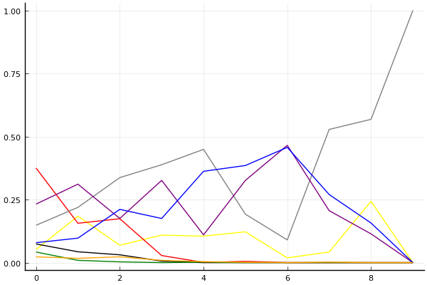
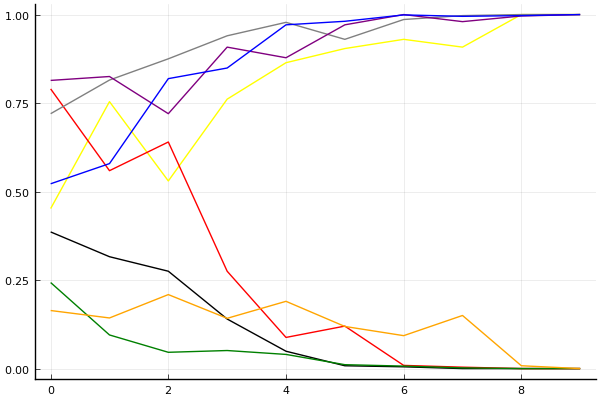

2019 시즌 2 개인전 32강 패자부활전

## 경기 결과

| 트랙 | 박현수 | 전강인 | 박효민 | 김승래 | 신종민 | 문진형 | 배성빈 | 이건욱 |
|:---|---:|---:|---:|---:|---:|---:|---:|---:|
| [신화 신들의 세계](../shinsegye) | 10 | 1 | 0 | 7 | 4 | -1 | 5 | 3 |
| [네모 산타의 비밀공간](../santa) | -1 | 3 | 5 | 7 | 1 | 0 | 10 | 4 |
| [월드 뉴욕 대질주](../newyork) | 7 | 0 | -1 | 5 | 10 | 4 | 3 | 1 |
| [도검 구름의 협곡](../hyupgog) | 5 | 0 | -1 | 7 | 1 | 3 | 10 | 4 |
| [해적 로비 절벽의 전투](../lobby) | 5 | 0 | 7 | -1 | 10 | 1 | 4 | 3 |
| [공동묘지 해골 손가락](../haeson) | 1 | 0 | -1 | 5 | 10 | 4 | 7 | 3 |
| [월드 이탈리아 피사의 사탑](../pizza) | 5 | 1 | 3 | 10 | -1 | 4 | 0 | 7 |
| [WKC 브라질 서킷](../brazil) | 10 | 7 | 4 | 5 | 3 | -1 | 1 | 0 |
| [비치 해변 드라이브](../haebyun) | 0 | 1 | 4 | 10 | 3 | 7 | -1 | 5 |
| __total__ |__42__ |__13__ |__20__ |__55__ |__41__ |__21__ |__39__ |__30__ |

## 시뮬레이션

### 1st 확률

x축: 트랙, y축: 확률
1번: 옐로우, 2번: 블랙, 3번: 레드, 4번: 화이트(회색), 5번: 퍼플, 6번: 그린, 7번: 블루, 8번: 오렌지

| 트랙 | 박현수 | 전강인 | 박효민 | 김승래 | 신종민 | 문진형 | 배성빈 | 이건욱 |
|:---|---:|---:|---:|---:|---:|---:|---:|---:|
| 초기 | 0.052 | 0.074 | 0.375 | 0.148 | 0.232 | 0.042 | 0.079 | 0.023 |
| 신화 신들의 세계 | 0.184 | 0.043 | 0.156 | 0.219 | 0.311 | 0.009 | 0.097 | 0.017 |
| 네모 산타의 비밀공간 | 0.069 | 0.031 | 0.174 | 0.337 | 0.175 | 0.003 | 0.211 | 0.023 |
| 월드 뉴욕 대질주 | 0.109 | 0.006 | 0.028 | 0.388 | 0.326 | 0.000 | 0.175 | 0.009 |
| 도검 구름의 협곡 | 0.105 | 0.000 | 0.001 | 0.449 | 0.110 | 0.002 | 0.362 | 0.004 |
| 해적 로비 절벽의 전투 | 0.122 | 0.000 | 0.005 | 0.192 | 0.326 | 0.000 | 0.385 | 0.001 |
| 공동묘지 해골 손가락 | 0.019 | 0.000 | 0.000 | 0.090 | 0.465 | 0.000 | 0.457 | 0.000 |
| 월드 이탈리아 피사의 사탑 | 0.042 | 0.000 | 0.000 | 0.528 | 0.206 | 0.000 | 0.270 | 0.002 |
| WKC 브라질 서킷 | 0.243 | 0.000 | 0.000 | 0.568 | 0.114 | 0.000 | 0.157 | 0.000 |
| 비치 해변 드라이브 | 0.000 | 0.000 | 0.000 | 1.000 | 0.000 | 0.000 | 0.000 | 0.000 |

### Advance 확률

x축: 트랙, y축: 확률
1번: 옐로우, 2번: 블랙, 3번: 레드, 4번: 화이트(회색), 5번: 퍼플, 6번: 그린, 7번: 블루, 8번: 오렌지

| 트랙 | 박현수 | 전강인 | 박효민 | 김승래 | 신종민 | 문진형 | 배성빈 | 이건욱 |
|:---|---:|---:|---:|---:|---:|---:|---:|---:|
| 초기 | 0.452 | 0.386 | 0.790 | 0.720 | 0.814 | 0.243 | 0.522 | 0.164 |
| 신화 신들의 세계 | 0.754 | 0.316 | 0.559 | 0.815 | 0.825 | 0.095 | 0.579 | 0.143 |
| 네모 산타의 비밀공간 | 0.530 | 0.275 | 0.640 | 0.875 | 0.720 | 0.046 | 0.819 | 0.209 |
| 월드 뉴욕 대질주 | 0.761 | 0.140 | 0.275 | 0.940 | 0.908 | 0.051 | 0.849 | 0.142 |
| 도검 구름의 협곡 | 0.864 | 0.049 | 0.088 | 0.978 | 0.878 | 0.040 | 0.971 | 0.190 |
| 해적 로비 절벽의 전투 | 0.904 | 0.008 | 0.120 | 0.930 | 0.971 | 0.011 | 0.981 | 0.119 |
| 공동묘지 해골 손가락 | 0.930 | 0.005 | 0.009 | 0.986 | 1.000 | 0.007 | 0.999 | 0.093 |
| 월드 이탈리아 피사의 사탑 | 0.908 | 0.000 | 0.004 | 0.997 | 0.980 | 0.002 | 0.995 | 0.150 |
| WKC 브라질 서킷 | 1.000 | 0.000 | 0.000 | 1.000 | 0.996 | 0.000 | 0.997 | 0.008 |
| 비치 해변 드라이브 | 1.000 | 0.000 | 0.000 | 1.000 | 1.000 | 0.000 | 1.000 | 0.000 |

## 랭킹 변동

### [전체 랭킹](../singles-full)

| 순위 | 변동 | 이름 | 점수 | 변동 | mu | 변동 | sigma | 변동 |
|---:|---:|:---:|---:|---:|---:|---:|---:|---:|
| 13 / 82 | +3 | [김승래](../gimseungrae) | 3007 | +37 | 3238 | +37 | 77 | -0 |
| 14 / 82 | -1 | [신종민](../shinjongmin) | 3002 | -12 | 3266 | -25 | 88 | -4 |
| 24 / 82 | +4 | [박현수](../bakhyeonsu) | 2834 | +51 | 3108 | +33 | 91 | -6 |
| 25 / 82 | +2 | [배성빈](../baeseongbin) | 2833 | +30 | 3102 | +14 | 90 | -5 |
| 34 / 82 | -4 | [박효민](../bakhyomin) | 2599 | -102 | 3026 | -282 | 142 | -60 |
| 40 / 82 | +21 | [이건욱](../igeonuk) | 2527 | +351 | 2954 | +145 | 142 | -69 |
| 42 / 82 | +0 | [전강인](../jeongangin) | 2519 | +11 | 2917 | -131 | 133 | -47 |
| 46 / 82 | +10 | [문진형](../munjinhyeong) | 2448 | +173 | 2880 | -22 | 144 | -65 |

### 시즌 랭킹

| 순위 | 변동 | 이름 | 점수 | 변동 | mu | 변동 | sigma | 변동 |
|---:|---:|:---:|---:|---:|---:|---:|---:|---:|
| 2 / 32 | +11 | [김승래](../gimseungrae) | 2849 | +311 | 3270 | +155 | 140 | -52 |
| 6 / 32 | +9 | [박현수](../bakhyeonsu) | 2714 | +260 | 3173 | +13 | 153 | -82 |
| 8 / 32 | +8 | [신종민](../shinjongmin) | 2649 | +291 | 3105 | +53 | 152 | -79 |
| 12 / 32 | +8 | [배성빈](../baeseongbin) | 2579 | +325 | 3011 | +140 | 144 | -62 |
| 16 / 32 | +6 | [이건욱](../igeonuk) | 2528 | +308 | 2964 | +80 | 145 | -76 |
| 17 / 32 | -8 | [전강인](../jeongangin) | 2516 | -54 | 2923 | -209 | 136 | -52 |
| 19 / 32 | +0 | [문진형](../munjinhyeong) | 2446 | +125 | 2887 | -90 | 147 | -72 |
| 20 / 32 | -3 | [박효민](../bakhyomin) | 2422 | +71 | 2859 | -122 | 146 | -64 |

### 트랙 별 랭킹

#### [WKC 브라질 서킷](../brazil)

| 순위 | 변동 | 이름 | 점수 | 변동 | mu | 변동 | sigma | 변동 |
|:---:|:---:|:---:|---:|---:|---:|---:|---:|---:|
| 5 / 32 | +13 | [박현수](../bakhyeonsu) | 2057 | +968 | 3471 | +608 | 471 | -120 |
| 9 / 32 | +3 | [박효민](../bakhyomin) | 1861 | +238 | 3154 | -269 | 431 | -169 |
| 10 / 32 | +11 | [전강인](../jeongangin) | 1761 | +986 | 3089 | +513 | 443 | -158 |
| 11 / 32 | -4 | [배성빈](../baeseongbin) | 1689 | -198 | 3016 | -747 | 443 | -183 |
| 15 / 32 | +13 | [김승래](../gimseungrae) | 1478 | +1116 | 2805 | +568 | 442 | -183 |
| 19 / 32 | +6 | [신종민](../shinjongmin) | 1222 | +861 | 2542 | +305 | 440 | -185 |
| 23 / 32 | +0 | [이건욱](../igeonuk) | 1038 | +263 | 2371 | -206 | 444 | -156 |
| 24 / 32 | -9 | [문진형](../munjinhyeong) | 984 | -379 | 2379 | -758 | 465 | -126 |

#### [공동묘지 해골 손가락](../haeson)

| 순위 | 변동 | 이름 | 점수 | 변동 | mu | 변동 | sigma | 변동 |
|:---:|:---:|:---:|---:|---:|---:|---:|---:|---:|
| 4 / 44 | +1 | [김승래](../gimseungrae) | 2790 | +105 | 3603 | +27 | 271 | -26 |
| 9 / 44 | NaN | [신종민](../shinjongmin) | 2299 | +2299 | 4276 | +1276 | 659 | -341 |
| 10 / 44 | +15 | [배성빈](../baeseongbin) | 2274 | +841 | 3528 | +499 | 418 | -114 |
| 11 / 44 | -2 | [박현수](../bakhyeonsu) | 2169 | -24 | 3256 | -240 | 362 | -72 |
| 19 / 44 | NaN | [문진형](../munjinhyeong) | 1748 | +1748 | 3333 | +333 | 529 | -471 |
| 21 / 44 | -5 | [전강인](../jeongangin) | 1695 | -131 | 3001 | -497 | 435 | -122 |
| 27 / 44 | NaN | [이건욱](../igeonuk) | 1549 | +1549 | 3139 | +139 | 530 | -470 |
| 40 / 44 | NaN | [박효민](../bakhyomin) | -44 | -44 | 2061 | -939 | 702 | -298 |

#### [네모 산타의 비밀공간](../santa)

| 순위 | 변동 | 이름 | 점수 | 변동 | mu | 변동 | sigma | 변동 |
|:---:|:---:|:---:|---:|---:|---:|---:|---:|---:|
| 1 / 62 | +1 | [김승래](../gimseungrae) | 2831 | +109 | 3480 | +66 | 216 | -14 |
| 10 / 62 | +6 | [박효민](../bakhyomin) | 2501 | +202 | 3848 | -486 | 449 | -229 |
| 13 / 62 | +11 | [배성빈](../baeseongbin) | 2419 | +442 | 3313 | +338 | 298 | -35 |
| 22 / 62 | -5 | [박현수](../bakhyeonsu) | 2138 | -142 | 2904 | -197 | 255 | -18 |
| 24 / 62 | +8 | [이건욱](../igeonuk) | 2076 | +458 | 3266 | +65 | 397 | -131 |
| 27 / 62 | +3 | [신종민](../shinjongmin) | 1841 | +179 | 3012 | -172 | 390 | -117 |
| 28 / 62 | +12 | [전강인](../jeongangin) | 1824 | +463 | 3018 | +68 | 398 | -132 |
| 36 / 62 | +8 | [문진형](../munjinhyeong) | 1447 | +268 | 2676 | -126 | 409 | -132 |

#### [도검 구름의 협곡](../hyupgog)

| 순위 | 변동 | 이름 | 점수 | 변동 | mu | 변동 | sigma | 변동 |
|:---:|:---:|:---:|---:|---:|---:|---:|---:|---:|
| 4 / 45 | +4 | [배성빈](../baeseongbin) | 2777 | +291 | 3791 | +187 | 338 | -35 |
| 5 / 45 | +0 | [김승래](../gimseungrae) | 2680 | +95 | 3332 | +59 | 217 | -12 |
| 6 / 45 | -2 | [신종민](../shinjongmin) | 2587 | -186 | 3375 | -263 | 263 | -25 |
| 22 / 45 | NaN | [박현수](../bakhyeonsu) | 1644 | +1644 | 3226 | +226 | 528 | -472 |
| 25 / 45 | +4 | [문진형](../munjinhyeong) | 1495 | +483 | 2722 | +66 | 409 | -139 |
| 29 / 45 | +15 | [이건욱](../igeonuk) | 1133 | +1556 | 2502 | +880 | 456 | -225 |
| 31 / 45 | -1 | [전강인](../jeongangin) | 1057 | +55 | 2375 | -304 | 440 | -119 |
| 44 / 45 | -2 | [박효민](../bakhyomin) | -305 | +16 | 1438 | -324 | 581 | -113 |

#### [비치 해변 드라이브](../haebyun)

| 순위 | 변동 | 이름 | 점수 | 변동 | mu | 변동 | sigma | 변동 |
|:---:|:---:|:---:|---:|---:|---:|---:|---:|---:|
| 3 / 57 | +7 | [문진형](../munjinhyeong) | 2664 | +341 | 4107 | -251 | 481 | -197 |
| 9 / 57 | +9 | [이건욱](../igeonuk) | 2418 | +314 | 3745 | -130 | 442 | -148 |
| 20 / 57 | +26 | [김승래](../gimseungrae) | 2058 | +1530 | 3444 | +1138 | 462 | -131 |
| 21 / 57 | +12 | [박효민](../bakhyomin) | 2006 | +395 | 3261 | +45 | 418 | -117 |
| 35 / 57 | +0 | [전강인](../jeongangin) | 1541 | +53 | 2855 | -297 | 438 | -117 |
| 40 / 57 | NaN | [신종민](../shinjongmin) | 1312 | +1312 | 2968 | -32 | 552 | -448 |
| 49 / 57 | NaN | [박현수](../bakhyeonsu) | 433 | +433 | 2270 | -730 | 612 | -388 |
| 53 / 57 | -2 | [배성빈](../baeseongbin) | -342 | -43 | 1435 | -369 | 592 | -109 |

#### [신화 신들의 세계](../shinsegye)

| 순위 | 변동 | 이름 | 점수 | 변동 | mu | 변동 | sigma | 변동 |
|:---:|:---:|:---:|---:|---:|---:|---:|---:|---:|
| 5 / 47 | +4 | [김승래](../gimseungrae) | 2706 | +124 | 3418 | +68 | 237 | -19 |
| 8 / 47 | +2 | [배성빈](../baeseongbin) | 2640 | +88 | 3455 | -9 | 272 | -32 |
| 11 / 47 | +1 | [신종민](../shinjongmin) | 2504 | +52 | 3272 | -27 | 256 | -26 |
| 21 / 47 | +15 | [박현수](../bakhyeonsu) | 2035 | +1343 | 3391 | +903 | 452 | -147 |
| 25 / 47 | -14 | [박효민](../bakhyomin) | 1753 | -700 | 3143 | -1292 | 463 | -197 |
| 27 / 47 | +5 | [이건욱](../igeonuk) | 1735 | +375 | 2935 | -18 | 400 | -131 |
| 35 / 47 | +2 | [전강인](../jeongangin) | 1224 | +605 | 2447 | +222 | 408 | -128 |
| 38 / 47 | +0 | [문진형](../munjinhyeong) | 414 | -28 | 1904 | -299 | 497 | -90 |

#### [월드 뉴욕 대질주](../newyork)

| 순위 | 변동 | 이름 | 점수 | 변동 | mu | 변동 | sigma | 변동 |
|:---:|:---:|:---:|---:|---:|---:|---:|---:|---:|
| 13 / 41 | +7 | [박현수](../bakhyeonsu) | 1999 | +495 | 3290 | +112 | 430 | -128 |
| 16 / 41 | +14 | [신종민](../shinjongmin) | 1895 | +1049 | 3298 | +690 | 468 | -120 |
| 21 / 41 | +8 | [김승래](../gimseungrae) | 1595 | +640 | 2870 | +210 | 425 | -144 |
| 24 / 41 | +3 | [문진형](../munjinhyeong) | 1461 | +466 | 2709 | +48 | 416 | -139 |
| 28 / 41 | -3 | [전강인](../jeongangin) | 1145 | -53 | 2415 | -471 | 423 | -140 |
| 29 / 41 | -10 | [박효민](../bakhyomin) | 1141 | -498 | 2435 | -839 | 431 | -114 |
| 31 / 41 | +4 | [이건욱](../igeonuk) | 892 | +592 | 2193 | +90 | 434 | -167 |
| 32 / 41 | +5 | [배성빈](../baeseongbin) | 857 | +1162 | 2252 | +446 | 465 | -239 |

#### [월드 이탈리아 피사의 사탑](../pizza)

| 순위 | 변동 | 이름 | 점수 | 변동 | mu | 변동 | sigma | 변동 |
|:---:|:---:|:---:|---:|---:|---:|---:|---:|---:|
| 1 / 32 | +11 | [김승래](../gimseungrae) | 2594 | +972 | 4041 | +618 | 482 | -118 |
| 2 / 32 | +6 | [이건욱](../igeonuk) | 2521 | +634 | 3908 | +145 | 462 | -163 |
| 6 / 32 | +11 | [박현수](../bakhyeonsu) | 1998 | +909 | 3302 | +439 | 435 | -157 |
| 7 / 32 | -6 | [전강인](../jeongangin) | 1973 | -188 | 3384 | -890 | 470 | -234 |
| 8 / 32 | +3 | [박효민](../bakhyomin) | 1964 | +342 | 3265 | -159 | 433 | -167 |
| 11 / 32 | +12 | [문진형](../munjinhyeong) | 1735 | +959 | 3036 | +459 | 434 | -167 |
| 14 / 32 | -9 | [신종민](../shinjongmin) | 1383 | -504 | 2825 | -938 | 481 | -145 |
| 19 / 32 | +2 | [배성빈](../baeseongbin) | 1238 | +463 | 2584 | +7 | 449 | -152 |

#### [해적 로비 절벽의 전투](../lobby)

| 순위 | 변동 | 이름 | 점수 | 변동 | mu | 변동 | sigma | 변동 |
|:---:|:---:|:---:|---:|---:|---:|---:|---:|---:|
| 6 / 35 | +14 | [신종민](../shinjongmin) | 2076 | +986 | 3486 | +623 | 470 | -121 |
| 8 / 35 | +3 | [박현수](../bakhyeonsu) | 2017 | +395 | 3323 | -100 | 435 | -165 |
| 11 / 35 | +2 | [배성빈](../baeseongbin) | 1829 | +353 | 3097 | -103 | 423 | -152 |
| 13 / 35 | +1 | [문진형](../munjinhyeong) | 1531 | +117 | 2811 | -338 | 427 | -152 |
| 15 / 35 | +16 | [박효민](../bakhyomin) | 1472 | +1834 | 2902 | +1149 | 477 | -229 |
| 16 / 35 | -7 | [전강인](../jeongangin) | 1451 | -299 | 2811 | -817 | 453 | -173 |
| 19 / 35 | +9 | [이건욱](../igeonuk) | 1244 | +866 | 2564 | +319 | 440 | -182 |
| 28 / 35 | -2 | [김승래](../gimseungrae) | 569 | -112 | 2016 | -423 | 482 | -104 |
