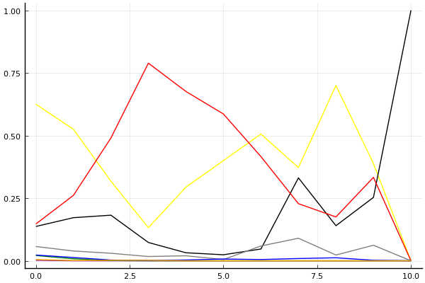
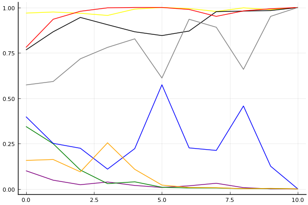

2019 시즌 2 개인전 16강 1경기

## 경기 결과

| 트랙 | 문호준 | 전대웅 | 이재혁 | 황인호 | 양민규 | 이준성 | 김승래 | 박현수 |
|:---|---:|---:|---:|---:|---:|---:|---:|---:|
| [신화 신들의 세계](../shinsegye) | 5 | 7 | 10 | 4 | -1 | 1 | 0 | 3 |
| [월드 뉴욕 대질주](../newyork) | 4 | 7 | 10 | 5 | 1 | -1 | 3 | 0 |
| [월드 이탈리아 피사의 사탑](../pizza) | 3 | 1 | 10 | 5 | 4 | -1 | 0 | 7 |
| [네모 산타의 비밀공간](../santa) | 10 | 1 | 3 | 4 | 0 | 5 | 7 | -1 |
| [도검 구름의 협곡](../hyupgog) | 7 | 5 | 3 | 1 | 4 | 0 | 10 | -1 |
| [WKC 브라질 서킷](../brazil) | 3 | 4 | -1 | 10 | 7 | 1 | 0 | 5 |
| [해적 로비 절벽의 전투](../lobby) | 0 | 10 | -1 | 3 | 5 | 7 | 4 | 1 |
| [팩토리 미완성 5구역](../district5) | 10 | 3 | 5 | 0 | -1 | 4 | 7 | 1 |
| [비치 해변 드라이브](../haebyun) | -1 | 3 | 4 | 7 | 0 | 5 | 1 | 10 |
| [공동묘지 해골 손가락](../haeson) | 1 | 10 | 5 | 7 | 3 | -1 | 0 | 4 |
| __total__ |__42__ |__51__ |__48__ |__46__ |__22__ |__20__ |__32__ |__29__ |

## 시뮬레이션

### 1st 확률

x축: 트랙, y축: 확률
1번: 옐로우, 2번: 블랙, 3번: 레드, 4번: 화이트(회색), 5번: 퍼플, 6번: 그린, 7번: 블루, 8번: 오렌지

| 트랙 | 문호준 | 전대웅 | 이재혁 | 황인호 | 양민규 | 이준성 | 김승래 | 박현수 |
|:---|---:|---:|---:|---:|---:|---:|---:|---:|
| 초기 | 0.625 | 0.137 | 0.147 | 0.057 | 0.002 | 0.021 | 0.023 | 0.005 |
| 신화 신들의 세계 | 0.525 | 0.172 | 0.261 | 0.039 | 0.000 | 0.008 | 0.013 | 0.001 |
| 월드 뉴욕 대질주 | 0.318 | 0.182 | 0.490 | 0.030 | 0.000 | 0.001 | 0.003 | 0.002 |
| 월드 이탈리아 피사의 사탑 | 0.132 | 0.073 | 0.789 | 0.017 | 0.000 | 0.000 | 0.001 | 0.002 |
| 네모 산타의 비밀공간 | 0.294 | 0.032 | 0.676 | 0.020 | 0.000 | 0.000 | 0.003 | 0.000 |
| 도검 구름의 협곡 | 0.400 | 0.024 | 0.586 | 0.005 | 0.000 | 0.000 | 0.007 | 0.000 |
| WKC 브라질 서킷 | 0.506 | 0.047 | 0.416 | 0.059 | 0.000 | 0.000 | 0.005 | 0.000 |
| 해적 로비 절벽의 전투 | 0.372 | 0.331 | 0.228 | 0.090 | 0.000 | 0.000 | 0.009 | 0.000 |
| 팩토리 미완성 5구역 | 0.700 | 0.140 | 0.175 | 0.023 | 0.000 | 0.000 | 0.012 | 0.000 |
| 비치 해변 드라이브 | 0.388 | 0.253 | 0.333 | 0.062 | 0.000 | 0.000 | 0.002 | 0.000 |
| 공동묘지 해골 손가락 | 0.000 | 1.000 | 0.000 | 0.000 | 0.000 | 0.000 | 0.000 | 0.000 |

### Advance 확률

x축: 트랙, y축: 확률
1번: 옐로우, 2번: 블랙, 3번: 레드, 4번: 화이트(회색), 5번: 퍼플, 6번: 그린, 7번: 블루, 8번: 오렌지

| 트랙 | 문호준 | 전대웅 | 이재혁 | 황인호 | 양민규 | 이준성 | 김승래 | 박현수 |
|:---|---:|---:|---:|---:|---:|---:|---:|---:|
| 초기 | 0.969 | 0.766 | 0.780 | 0.573 | 0.100 | 0.344 | 0.398 | 0.157 |
| 신화 신들의 세계 | 0.975 | 0.866 | 0.935 | 0.592 | 0.048 | 0.249 | 0.251 | 0.162 |
| 월드 뉴욕 대질주 | 0.968 | 0.945 | 0.979 | 0.717 | 0.023 | 0.104 | 0.224 | 0.094 |
| 월드 이탈리아 피사의 사탑 | 0.956 | 0.905 | 0.998 | 0.780 | 0.038 | 0.029 | 0.109 | 0.254 |
| 네모 산타의 비밀공간 | 0.991 | 0.866 | 1.000 | 0.827 | 0.019 | 0.039 | 0.222 | 0.108 |
| 도검 구름의 협곡 | 1.000 | 0.845 | 1.000 | 0.611 | 0.008 | 0.009 | 0.574 | 0.021 |
| WKC 브라질 서킷 | 0.994 | 0.870 | 0.989 | 0.935 | 0.017 | 0.005 | 0.226 | 0.008 |
| 해적 로비 절벽의 전투 | 0.978 | 0.977 | 0.951 | 0.891 | 0.031 | 0.005 | 0.212 | 0.007 |
| 팩토리 미완성 5구역 | 0.998 | 0.980 | 0.981 | 0.659 | 0.007 | 0.001 | 0.457 | 0.001 |
| 비치 해변 드라이브 | 0.988 | 0.983 | 0.993 | 0.951 | 0.000 | 0.002 | 0.125 | 0.003 |
| 공동묘지 해골 손가락 | 1.000 | 1.000 | 1.000 | 1.000 | 0.000 | 0.000 | 0.000 | 0.000 |

## 랭킹 변동

### [전체 랭킹](../singles-full)

| 순위 | 변동 | 이름 | 점수 | 변동 | mu | 변동 | sigma | 변동 |
|---:|---:|:---:|---:|---:|---:|---:|---:|---:|
| 1 / 82 | +0 | [문호준](../munhojun) | 3372 | -53 | 3607 | -56 | 78 | -1 |
| 4 / 82 | +2 | [전대웅](../jeondaewoong) | 3222 | +21 | 3452 | +20 | 77 | -0 |
| 6 / 82 | -1 | [이재혁](../ijaehyeok) | 3204 | +1 | 3439 | -1 | 78 | -1 |
| 9 / 82 | +1 | [황인호](../hwanginho) | 3115 | +29 | 3346 | +27 | 77 | -1 |
| 13 / 82 | +0 | [김승래](../gimseungrae) | 3014 | +7 | 3243 | +6 | 77 | -0 |
| 17 / 82 | -1 | [이준성](../ijunseong) | 2948 | -27 | 3180 | -29 | 77 | -0 |
| 21 / 82 | +3 | [박현수](../bakhyeonsu) | 2866 | +32 | 3126 | +17 | 87 | -5 |
| 30 / 82 | +7 | [양민규](../yangmingyu) | 2688 | +125 | 3039 | +38 | 117 | -29 |

### 시즌 랭킹

| 순위 | 변동 | 이름 | 점수 | 변동 | mu | 변동 | sigma | 변동 |
|---:|---:|:---:|---:|---:|---:|---:|---:|---:|
| 1 / 32 | +2 | [전대웅](../jeondaewoong) | 3155 | +312 | 3608 | +9 | 151 | -101 |
| 2 / 32 | -1 | [문호준](../munhojun) | 3069 | +90 | 3517 | -181 | 149 | -91 |
| 3 / 32 | +6 | [황인호](../hwanginho) | 3041 | +398 | 3484 | +114 | 148 | -95 |
| 4 / 32 | +1 | [이재혁](../ijaehyeok) | 3034 | +298 | 3483 | +41 | 150 | -86 |
| 5 / 32 | -3 | [김승래](../gimseungrae) | 2944 | +95 | 3288 | +18 | 115 | -26 |
| 6 / 32 | +0 | [박현수](../bakhyeonsu) | 2840 | +126 | 3203 | +31 | 121 | -32 |
| 8 / 32 | +6 | [양민규](../yangmingyu) | 2745 | +183 | 3177 | -52 | 144 | -78 |
| 11 / 32 | +10 | [이준성](../ijunseong) | 2637 | +312 | 3095 | +19 | 152 | -98 |

### 트랙 별 랭킹

#### [WKC 브라질 서킷](../brazil)

| 순위 | 변동 | 이름 | 점수 | 변동 | mu | 변동 | sigma | 변동 |
|:---:|:---:|:---:|---:|---:|---:|---:|---:|---:|
| 1 / 32 | +4 | [박현수](../bakhyeonsu) | 2404 | +347 | 3530 | +59 | 375 | -96 |
| 2 / 32 | +4 | [전대웅](../jeondaewoong) | 2252 | +365 | 3562 | -201 | 437 | -189 |
| 3 / 32 | +0 | [문호준](../munhojun) | 2214 | +53 | 3598 | -677 | 461 | -243 |
| 6 / 32 | -2 | [이준성](../ijunseong) | 2046 | -115 | 3445 | -829 | 466 | -238 |
| 10 / 32 | +17 | [양민규](../yangmingyu) | 1844 | +1483 | 3171 | +934 | 442 | -183 |
| 11 / 32 | +18 | [황인호](../hwanginho) | 1808 | +2196 | 3279 | +1553 | 490 | -214 |
| 14 / 32 | +1 | [김승래](../gimseungrae) | 1636 | +159 | 2746 | -59 | 370 | -72 |
| 20 / 32 | -7 | [이재혁](../ijaehyeok) | 1309 | -313 | 2727 | -697 | 473 | -128 |

#### [공동묘지 해골 손가락](../haeson)

| 순위 | 변동 | 이름 | 점수 | 변동 | mu | 변동 | sigma | 변동 |
|:---:|:---:|:---:|---:|---:|---:|---:|---:|---:|
| 1 / 45 | +0 | [문호준](../munhojun) | 3160 | -103 | 3865 | -169 | 235 | -22 |
| 3 / 45 | +0 | [이재혁](../ijaehyeok) | 2979 | +59 | 3641 | +6 | 220 | -18 |
| 4 / 45 | +0 | [김승래](../gimseungrae) | 2730 | -60 | 3470 | -133 | 247 | -24 |
| 7 / 45 | -2 | [이준성](../ijunseong) | 2613 | -90 | 3272 | -128 | 220 | -13 |
| 9 / 45 | +4 | [전대웅](../jeondaewoong) | 2468 | +340 | 3240 | +268 | 257 | -24 |
| 10 / 45 | +1 | [박현수](../bakhyeonsu) | 2425 | +255 | 3343 | +87 | 306 | -56 |
| 13 / 45 | +7 | [황인호](../hwanginho) | 2273 | +562 | 3254 | +358 | 327 | -68 |
| 19 / 45 | NaN | [양민규](../yangmingyu) | 1816 | +1816 | 3291 | +291 | 492 | -508 |

#### [네모 산타의 비밀공간](../santa)

| 순위 | 변동 | 이름 | 점수 | 변동 | mu | 변동 | sigma | 변동 |
|:---:|:---:|:---:|---:|---:|---:|---:|---:|---:|
| 1 / 62 | +0 | [김승래](../gimseungrae) | 2899 | +68 | 3510 | +30 | 204 | -13 |
| 2 / 62 | +0 | [문호준](../munhojun) | 2855 | +93 | 3361 | +76 | 169 | -5 |
| 3 / 62 | +0 | [이재혁](../ijaehyeok) | 2710 | -0 | 3193 | -20 | 161 | -6 |
| 6 / 62 | +1 | [이준성](../ijunseong) | 2657 | +58 | 3197 | +31 | 180 | -9 |
| 8 / 62 | +0 | [전대웅](../jeondaewoong) | 2550 | -12 | 3081 | -37 | 177 | -8 |
| 18 / 62 | +0 | [황인호](../hwanginho) | 2358 | +89 | 2983 | +43 | 208 | -15 |
| 25 / 62 | -3 | [박현수](../bakhyeonsu) | 2037 | -101 | 2757 | -147 | 240 | -16 |
| 35 / 62 | +5 | [양민규](../yangmingyu) | 1559 | +159 | 2759 | -243 | 400 | -134 |

#### [도검 구름의 협곡](../hyupgog)

| 순위 | 변동 | 이름 | 점수 | 변동 | mu | 변동 | sigma | 변동 |
|:---:|:---:|:---:|---:|---:|---:|---:|---:|---:|
| 1 / 46 | +0 | [문호준](../munhojun) | 3031 | +54 | 3676 | +14 | 215 | -13 |
| 4 / 46 | +1 | [김승래](../gimseungrae) | 2827 | +147 | 3449 | +117 | 208 | -10 |
| 13 / 46 | -2 | [이준성](../ijunseong) | 2219 | -141 | 3121 | -274 | 301 | -44 |
| 14 / 46 | +2 | [이재혁](../ijaehyeok) | 2193 | +85 | 3107 | -67 | 305 | -50 |
| 20 / 46 | +0 | [황인호](../hwanginho) | 1890 | +108 | 2633 | +35 | 248 | -24 |
| 21 / 46 | NaN | [전대웅](../jeondaewoong) | 1818 | +1818 | 3356 | +356 | 513 | -487 |
| 22 / 46 | +6 | [양민규](../yangmingyu) | 1778 | +530 | 2850 | +261 | 357 | -90 |
| 27 / 46 | -5 | [박현수](../bakhyeonsu) | 1387 | -257 | 2657 | -569 | 423 | -104 |

#### [비치 해변 드라이브](../haebyun)

| 순위 | 변동 | 이름 | 점수 | 변동 | mu | 변동 | sigma | 변동 |
|:---:|:---:|:---:|---:|---:|---:|---:|---:|---:|
| 8 / 58 | +3 | [이재혁](../ijaehyeok) | 2483 | +96 | 3220 | +24 | 246 | -24 |
| 9 / 58 | -1 | [문호준](../munhojun) | 2418 | -102 | 3066 | -137 | 216 | -12 |
| 11 / 58 | +11 | [황인호](../hwanginho) | 2404 | +453 | 3506 | +198 | 367 | -85 |
| 16 / 58 | +3 | [전대웅](../jeondaewoong) | 2215 | +116 | 2938 | +47 | 241 | -23 |
| 21 / 58 | -1 | [김승래](../gimseungrae) | 2119 | +61 | 3209 | -235 | 363 | -99 |
| 23 / 58 | +26 | [박현수](../bakhyeonsu) | 1973 | +1540 | 3344 | +1074 | 457 | -155 |
| 29 / 58 | NaN | [이준성](../ijunseong) | 1881 | +1881 | 3412 | +412 | 510 | -490 |
| 30 / 58 | -4 | [양민규](../yangmingyu) | 1878 | -25 | 3099 | -465 | 407 | -146 |

#### [신화 신들의 세계](../shinsegye)

| 순위 | 변동 | 이름 | 점수 | 변동 | mu | 변동 | sigma | 변동 |
|:---:|:---:|:---:|---:|---:|---:|---:|---:|---:|
| 2 / 47 | +1 | [황인호](../hwanginho) | 2900 | +43 | 3589 | -15 | 229 | -19 |
| 5 / 47 | +9 | [전대웅](../jeondaewoong) | 2735 | +496 | 4084 | -121 | 450 | -206 |
| 9 / 47 | -4 | [김승래](../gimseungrae) | 2640 | -66 | 3307 | -111 | 222 | -15 |
| 10 / 47 | +2 | [문호준](../munhojun) | 2620 | +195 | 3398 | +111 | 259 | -28 |
| 12 / 47 | -2 | [이준성](../ijunseong) | 2601 | -2 | 3352 | -77 | 250 | -25 |
| 14 / 47 | +17 | [이재혁](../ijaehyeok) | 2342 | +886 | 3464 | +662 | 374 | -74 |
| 15 / 47 | +6 | [박현수](../bakhyeonsu) | 2285 | +250 | 3358 | -34 | 357 | -95 |
| 34 / 47 | +0 | [양민규](../yangmingyu) | 1233 | -37 | 2414 | -186 | 394 | -50 |

#### [월드 뉴욕 대질주](../newyork)

| 순위 | 변동 | 이름 | 점수 | 변동 | mu | 변동 | sigma | 변동 |
|:---:|:---:|:---:|---:|---:|---:|---:|---:|---:|
| 2 / 41 | +0 | [전대웅](../jeondaewoong) | 2919 | +113 | 3691 | +38 | 257 | -25 |
| 3 / 41 | +0 | [황인호](../hwanginho) | 2769 | +67 | 3762 | -126 | 331 | -64 |
| 5 / 41 | +6 | [이재혁](../ijaehyeok) | 2488 | +395 | 3351 | +303 | 288 | -31 |
| 9 / 41 | +1 | [문호준](../munhojun) | 2270 | +170 | 3123 | +58 | 284 | -37 |
| 16 / 41 | +5 | [김승래](../gimseungrae) | 1880 | +285 | 2926 | +56 | 349 | -76 |
| 17 / 41 | -4 | [박현수](../bakhyeonsu) | 1828 | -171 | 2919 | -370 | 364 | -66 |
| 18 / 41 | +1 | [양민규](../yangmingyu) | 1789 | +94 | 3018 | -313 | 410 | -136 |
| 38 / 41 | +0 | [이준성](../ijunseong) | -294 | +65 | 1516 | -231 | 603 | -99 |

#### [월드 이탈리아 피사의 사탑](../pizza)

| 순위 | 변동 | 이름 | 점수 | 변동 | mu | 변동 | sigma | 변동 |
|:---:|:---:|:---:|---:|---:|---:|---:|---:|---:|
| 1 / 32 | +5 | [박현수](../bakhyeonsu) | 2568 | +570 | 3647 | +344 | 360 | -75 |
| 2 / 32 | +14 | [이재혁](../ijaehyeok) | 2549 | +1186 | 3920 | +784 | 457 | -134 |
| 4 / 32 | -1 | [양민규](../yangmingyu) | 2504 | +343 | 3884 | -390 | 460 | -244 |
| 5 / 32 | +7 | [황인호](../hwanginho) | 2404 | +782 | 3693 | +269 | 429 | -171 |
| 6 / 32 | -5 | [김승래](../gimseungrae) | 2398 | -196 | 3555 | -486 | 386 | -96 |
| 7 / 32 | +6 | [문호준](../munhojun) | 2164 | +542 | 3449 | +26 | 428 | -172 |
| 11 / 32 | +4 | [전대웅](../jeondaewoong) | 1919 | +556 | 3201 | +65 | 427 | -164 |
| 15 / 32 | -10 | [이준성](../ijunseong) | 1666 | -495 | 3187 | -1087 | 507 | -197 |

#### [팩토리 미완성 5구역](../district5)

| 순위 | 변동 | 이름 | 점수 | 변동 | mu | 변동 | sigma | 변동 |
|:---:|:---:|:---:|---:|---:|---:|---:|---:|---:|
| 2 / 76 | +0 | [문호준](../munhojun) | 3289 | +87 | 3842 | +67 | 184 | -7 |
| 3 / 76 | +0 | [이재혁](../ijaehyeok) | 3213 | +18 | 3757 | -10 | 181 | -9 |
| 6 / 76 | +0 | [전대웅](../jeondaewoong) | 2878 | +3 | 3458 | -32 | 193 | -11 |
| 8 / 76 | +0 | [이준성](../ijunseong) | 2838 | +41 | 3370 | +14 | 177 | -9 |
| 9 / 76 | +4 | [김승래](../gimseungrae) | 2787 | +109 | 3331 | +82 | 181 | -9 |
| 12 / 76 | -3 | [황인호](../hwanginho) | 2707 | -59 | 3274 | -85 | 189 | -9 |
| 21 / 76 | +1 | [박현수](../bakhyeonsu) | 2351 | +41 | 3235 | -94 | 295 | -45 |
| 65 / 76 | +0 | [양민규](../yangmingyu) | 422 | +36 | 1962 | -182 | 513 | -72 |

#### [해적 로비 절벽의 전투](../lobby)

| 순위 | 변동 | 이름 | 점수 | 변동 | mu | 변동 | sigma | 변동 |
|:---:|:---:|:---:|---:|---:|---:|---:|---:|---:|
| 1 / 35 | +4 | [전대웅](../jeondaewoong) | 3023 | +863 | 4736 | +462 | 571 | -134 |
| 2 / 35 | +8 | [이준성](../ijunseong) | 2635 | +748 | 4056 | +293 | 473 | -152 |
| 3 / 35 | +9 | [양민규](../yangmingyu) | 2342 | +640 | 3637 | +202 | 432 | -146 |
| 5 / 35 | -3 | [문호준](../munhojun) | 2274 | -167 | 3413 | -470 | 380 | -101 |
| 7 / 35 | +1 | [박현수](../bakhyeonsu) | 2161 | +144 | 3224 | -100 | 354 | -81 |
| 8 / 35 | -7 | [이재혁](../ijaehyeok) | 2126 | -421 | 3323 | -702 | 399 | -94 |
| 12 / 35 | +6 | [황인호](../hwanginho) | 1945 | +582 | 3210 | +74 | 422 | -169 |
| 14 / 35 | +14 | [김승래](../gimseungrae) | 1565 | +996 | 2703 | +687 | 379 | -103 |
