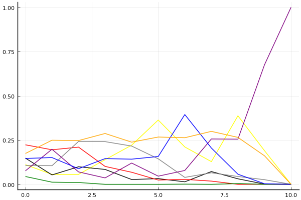
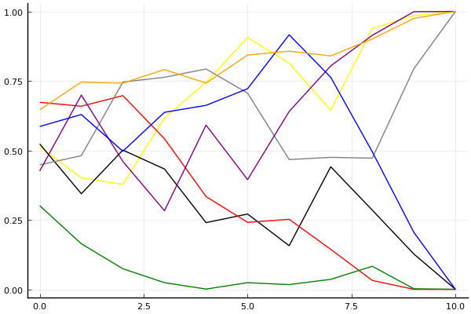

2019 시즌 2 개인전 16강 패자전

## 경기 결과

| 트랙 | 최영훈 | 최윤서 | 김승래 | 박현수 | 배성빈 | 양민규 | 이준성 | 신종민 |
|:---|---:|---:|---:|---:|---:|---:|---:|---:|
| [신화 신들의 세계](../shinsegye) | 1 | 0 | 3 | 4 | 10 | -1 | 5 | 7 |
| [네모 산타의 비밀공간](../santa) | 3 | 7 | 5 | 10 | -1 | 0 | 1 | 4 |
| [WKC 브라질 서킷](../brazil) | 10 | 3 | 1 | 4 | 0 | -1 | 7 | 5 |
| [비치 해변 드라이브](../haebyun) | 7 | 0 | 1 | 4 | 10 | -1 | 5 | 3 |
| [월드 뉴욕 대질주](../newyork) | 7 | 4 | 0 | 1 | -1 | 10 | 3 | 5 |
| [월드 이탈리아 피사의 사탑](../pizza) | 0 | 1 | 5 | -1 | 7 | 3 | 10 | 4 |
| [해적 로비 절벽의 전투](../lobby) | 0 | 10 | 1 | 4 | 7 | 5 | -1 | 3 |
| [도검 구름의 협곡](../hyupgog) | 10 | 1 | 0 | 3 | 5 | 7 | -1 | 4 |
| [팩토리 미완성 5구역](../district5) | 4 | 3 | -1 | 7 | 10 | 0 | 1 | 5 |
| [공동묘지 해골 손가락](../haeson) | 4 | 5 | 1 | 3 | 7 | -1 | 0 | 10 |
| __total__ |__46__ |__34__ |__16__ |__39__ |__54__ |__21__ |__30__ |__50__ |

## 시뮬레이션

### 1st 확률

x축: 트랙, y축: 확률
1번: 옐로우, 2번: 블랙, 3번: 레드, 4번: 화이트(회색), 5번: 퍼플, 6번: 그린, 7번: 블루, 8번: 오렌지

| 트랙 | 최영훈 | 최윤서 | 김승래 | 박현수 | 배성빈 | 양민규 | 이준성 | 신종민 |
|:---|---:|---:|---:|---:|---:|---:|---:|---:|
| 초기 | 0.106 | 0.148 | 0.233 | 0.096 | 0.069 | 0.057 | 0.128 | 0.197 |
| 신화 신들의 세계 | 0.053 | 0.064 | 0.186 | 0.092 | 0.212 | 0.023 | 0.137 | 0.259 |
| 네모 산타의 비밀공간 | 0.051 | 0.117 | 0.206 | 0.239 | 0.065 | 0.009 | 0.094 | 0.236 |
| WKC 브라질 서킷 | 0.117 | 0.092 | 0.120 | 0.238 | 0.045 | 0.000 | 0.157 | 0.265 |
| 비치 해변 드라이브 | 0.215 | 0.021 | 0.059 | 0.236 | 0.121 | 0.001 | 0.145 | 0.242 |
| 월드 뉴욕 대질주 | 0.362 | 0.038 | 0.026 | 0.175 | 0.038 | 0.001 | 0.133 | 0.260 |
| 월드 이탈리아 피사의 사탑 | 0.201 | 0.015 | 0.018 | 0.050 | 0.093 | 0.001 | 0.383 | 0.276 |
| 해적 로비 절벽의 전투 | 0.133 | 0.066 | 0.017 | 0.086 | 0.217 | 0.002 | 0.228 | 0.286 |
| 도검 구름의 협곡 | 0.384 | 0.029 | 0.003 | 0.031 | 0.276 | 0.001 | 0.059 | 0.259 |
| 팩토리 미완성 5구역 | 0.176 | 0.001 | 0.000 | 0.026 | 0.702 | 0.000 | 0.003 | 0.145 |
| 공동묘지 해골 손가락 | 0.000 | 0.000 | 0.000 | 0.000 | 1.000 | 0.000 | 0.000 | 0.000 |

### Advance 확률

x축: 트랙, y축: 확률
1번: 옐로우, 2번: 블랙, 3번: 레드, 4번: 화이트(회색), 5번: 퍼플, 6번: 그린, 7번: 블루, 8번: 오렌지

| 트랙 | 최영훈 | 최윤서 | 김승래 | 박현수 | 배성빈 | 양민규 | 이준성 | 신종민 |
|:---|---:|---:|---:|---:|---:|---:|---:|---:|
| 초기 | 0.474 | 0.525 | 0.711 | 0.466 | 0.421 | 0.324 | 0.575 | 0.601 |
| 신화 신들의 세계 | 0.385 | 0.348 | 0.648 | 0.493 | 0.711 | 0.167 | 0.619 | 0.731 |
| 네모 산타의 비밀공간 | 0.330 | 0.520 | 0.701 | 0.733 | 0.451 | 0.086 | 0.529 | 0.757 |
| WKC 브라질 서킷 | 0.593 | 0.438 | 0.558 | 0.767 | 0.308 | 0.027 | 0.655 | 0.771 |
| 비치 해변 드라이브 | 0.758 | 0.228 | 0.348 | 0.778 | 0.589 | 0.010 | 0.662 | 0.751 |
| 월드 뉴욕 대질주 | 0.905 | 0.282 | 0.231 | 0.726 | 0.394 | 0.032 | 0.708 | 0.842 |
| 월드 이탈리아 피사의 사탑 | 0.829 | 0.160 | 0.249 | 0.457 | 0.612 | 0.024 | 0.927 | 0.867 |
| 해적 로비 절벽의 전투 | 0.632 | 0.436 | 0.134 | 0.479 | 0.795 | 0.028 | 0.782 | 0.841 |
| 도검 구름의 협곡 | 0.942 | 0.285 | 0.040 | 0.466 | 0.910 | 0.067 | 0.541 | 0.885 |
| 팩토리 미완성 5구역 | 0.996 | 0.127 | 0.000 | 0.813 | 0.997 | 0.002 | 0.183 | 0.981 |
| 공동묘지 해골 손가락 | 1.000 | 0.000 | 0.000 | 1.000 | 1.000 | 0.000 | 0.000 | 1.000 |

## 랭킹 변동

### [전체 랭킹](../singles-full)

| 순위 | 변동 | 이름 | 점수 | 변동 | mu | 변동 | sigma | 변동 |
|---:|---:|:---:|---:|---:|---:|---:|---:|---:|
| 14 / 82 | +2 | [신종민](../shinjongmin) | 2996 | +45 | 3241 | +36 | 82 | -3 |
| 16 / 82 | -3 | [김승래](../gimseungrae) | 2950 | -64 | 3178 | -65 | 76 | -0 |
| 17 / 82 | +2 | [최영훈](../choiyeonghun) | 2945 | +30 | 3177 | +27 | 77 | -1 |
| 18 / 82 | -1 | [이준성](../ijunseong) | 2923 | -25 | 3154 | -26 | 77 | -0 |
| 20 / 82 | +6 | [배성빈](../baeseongbin) | 2910 | +66 | 3160 | +58 | 83 | -3 |
| 22 / 82 | +0 | [박현수](../bakhyeonsu) | 2890 | +25 | 3140 | +14 | 83 | -4 |
| 28 / 82 | +2 | [최윤서](../choiyunseo) | 2820 | +67 | 3152 | -4 | 111 | -24 |
| 33 / 82 | -1 | [양민규](../yangmingyu) | 2668 | -20 | 2978 | -61 | 103 | -14 |

### 시즌 랭킹

| 순위 | 변동 | 이름 | 점수 | 변동 | mu | 변동 | sigma | 변동 |
|---:|---:|:---:|---:|---:|---:|---:|---:|---:|
| 9 / 32 | +1 | [박현수](../bakhyeonsu) | 2882 | +42 | 3194 | -9 | 104 | -17 |
| 10 / 32 | +1 | [최영훈](../choiyeonghun) | 2880 | +120 | 3217 | +48 | 113 | -24 |
| 11 / 32 | -2 | [김승래](../gimseungrae) | 2854 | -90 | 3155 | -133 | 100 | -14 |
| 12 / 32 | +3 | [신종민](../shinjongmin) | 2825 | +182 | 3139 | +128 | 105 | -18 |
| 13 / 32 | +1 | [배성빈](../baeseongbin) | 2822 | +159 | 3134 | +115 | 104 | -14 |
| 14 / 32 | -1 | [최윤서](../choiyunseo) | 2807 | +74 | 3144 | -2 | 112 | -25 |
| 15 / 32 | +1 | [이준성](../ijunseong) | 2706 | +69 | 3067 | -28 | 120 | -32 |
| 16 / 32 | -4 | [양민규](../yangmingyu) | 2683 | -62 | 3036 | -141 | 118 | -26 |

### 트랙 별 랭킹

#### [WKC 브라질 서킷](../brazil)

| 순위 | 변동 | 이름 | 점수 | 변동 | mu | 변동 | sigma | 변동 |
|:---:|:---:|:---:|---:|---:|---:|---:|---:|---:|
| 2 / 32 | +0 | [박현수](../bakhyeonsu) | 2455 | +50 | 3406 | -124 | 317 | -58 |
| 3 / 32 | +2 | [이준성](../ijunseong) | 2425 | +379 | 3547 | +102 | 374 | -92 |
| 5 / 32 | +16 | [최영훈](../choiyeonghun) | 2219 | +773 | 3383 | +540 | 388 | -78 |
| 7 / 32 | +9 | [신종민](../shinjongmin) | 2051 | +358 | 2969 | +209 | 306 | -50 |
| 10 / 32 | -4 | [배성빈](../baeseongbin) | 1970 | -58 | 2901 | -203 | 310 | -48 |
| 15 / 32 | +2 | [김승래](../gimseungrae) | 1797 | +161 | 2742 | -4 | 315 | -55 |
| 16 / 32 | +6 | [최윤서](../choiyunseo) | 1771 | +395 | 2910 | +46 | 380 | -116 |
| 21 / 32 | -8 | [양민규](../yangmingyu) | 1601 | -243 | 2721 | -450 | 373 | -69 |

#### [공동묘지 해골 손가락](../haeson)

| 순위 | 변동 | 이름 | 점수 | 변동 | mu | 변동 | sigma | 변동 |
|:---:|:---:|:---:|---:|---:|---:|---:|---:|---:|
| 3 / 45 | +8 | [신종민](../shinjongmin) | 2999 | +701 | 4632 | +356 | 544 | -115 |
| 5 / 45 | -1 | [김승래](../gimseungrae) | 2706 | -24 | 3389 | -81 | 228 | -19 |
| 6 / 45 | +6 | [배성빈](../baeseongbin) | 2685 | +411 | 3754 | +226 | 356 | -62 |
| 9 / 45 | -2 | [이준성](../ijunseong) | 2576 | -38 | 3197 | -75 | 207 | -12 |
| 11 / 45 | -1 | [박현수](../bakhyeonsu) | 2502 | +77 | 3317 | -26 | 272 | -34 |
| 14 / 45 | +12 | [최윤서](../choiyunseo) | 2259 | +675 | 3481 | +266 | 407 | -136 |
| 20 / 45 | +15 | [최영훈](../choiyeonghun) | 1837 | +721 | 2931 | +427 | 365 | -98 |
| 25 / 45 | -6 | [양민규](../yangmingyu) | 1626 | -190 | 2845 | -447 | 406 | -85 |

#### [네모 산타의 비밀공간](../santa)

| 순위 | 변동 | 이름 | 점수 | 변동 | mu | 변동 | sigma | 변동 |
|:---:|:---:|:---:|---:|---:|---:|---:|---:|---:|
| 1 / 62 | +0 | [김승래](../gimseungrae) | 2925 | +26 | 3502 | -8 | 192 | -11 |
| 7 / 62 | -1 | [이준성](../ijunseong) | 2645 | -13 | 3161 | -36 | 172 | -8 |
| 9 / 62 | +0 | [최영훈](../choiyeonghun) | 2588 | +12 | 3285 | -53 | 232 | -22 |
| 14 / 62 | +8 | [최윤서](../choiyunseo) | 2446 | +354 | 3458 | +131 | 337 | -75 |
| 18 / 62 | -7 | [배성빈](../baeseongbin) | 2374 | -157 | 3113 | -215 | 246 | -19 |
| 21 / 62 | +5 | [박현수](../bakhyeonsu) | 2295 | +258 | 2969 | +212 | 224 | -15 |
| 24 / 62 | +4 | [신종민](../shinjongmin) | 2138 | +243 | 2995 | +111 | 286 | -44 |
| 32 / 62 | +4 | [양민규](../yangmingyu) | 1713 | +154 | 2710 | -49 | 332 | -68 |

#### [도검 구름의 협곡](../hyupgog)

| 순위 | 변동 | 이름 | 점수 | 변동 | mu | 변동 | sigma | 변동 |
|:---:|:---:|:---:|---:|---:|---:|---:|---:|---:|
| 3 / 46 | +0 | [배성빈](../baeseongbin) | 3007 | +38 | 3799 | -59 | 264 | -32 |
| 5 / 46 | +2 | [최영훈](../choiyeonghun) | 2825 | +212 | 3547 | +160 | 241 | -17 |
| 6 / 46 | +0 | [신종민](../shinjongmin) | 2780 | +51 | 3448 | -4 | 223 | -18 |
| 7 / 46 | -2 | [김승래](../gimseungrae) | 2771 | -55 | 3361 | -89 | 196 | -11 |
| 10 / 46 | +0 | [최윤서](../choiyunseo) | 2400 | -32 | 3453 | -303 | 351 | -90 |
| 14 / 46 | +9 | [양민규](../yangmingyu) | 2258 | +481 | 3176 | +327 | 306 | -51 |
| 17 / 46 | -3 | [이준성](../ijunseong) | 2116 | -103 | 2944 | -177 | 276 | -24 |
| 22 / 46 | +5 | [박현수](../bakhyeonsu) | 1873 | +486 | 2896 | +238 | 341 | -82 |

#### [비치 해변 드라이브](../haebyun)

| 순위 | 변동 | 이름 | 점수 | 변동 | mu | 변동 | sigma | 변동 |
|:---:|:---:|:---:|---:|---:|---:|---:|---:|---:|
| 11 / 58 | +5 | [최영훈](../choiyeonghun) | 2458 | +171 | 3182 | +108 | 242 | -21 |
| 19 / 58 | +9 | [이준성](../ijunseong) | 2234 | +353 | 3391 | -20 | 386 | -124 |
| 20 / 58 | +4 | [박현수](../bakhyeonsu) | 2184 | +210 | 3265 | -79 | 361 | -96 |
| 24 / 58 | -2 | [김승래](../gimseungrae) | 2128 | +8 | 3058 | -151 | 310 | -53 |
| 25 / 58 | +15 | [배성빈](../baeseongbin) | 2076 | +703 | 3135 | +510 | 353 | -64 |
| 31 / 58 | -1 | [최윤서](../choiyunseo) | 1823 | -53 | 2930 | -333 | 369 | -93 |
| 35 / 58 | -6 | [양민규](../yangmingyu) | 1674 | -204 | 2730 | -369 | 352 | -55 |
| 36 / 58 | +8 | [신종민](../shinjongmin) | 1656 | +467 | 2733 | +184 | 359 | -95 |

#### [신화 신들의 세계](../shinsegye)

| 순위 | 변동 | 이름 | 점수 | 변동 | mu | 변동 | sigma | 변동 |
|:---:|:---:|:---:|---:|---:|---:|---:|---:|---:|
| 3 / 47 | +3 | [배성빈](../baeseongbin) | 2924 | +160 | 3625 | +118 | 233 | -14 |
| 8 / 47 | +6 | [이준성](../ijunseong) | 2690 | +89 | 3380 | +28 | 230 | -20 |
| 12 / 47 | -1 | [김승래](../gimseungrae) | 2647 | +7 | 3271 | -36 | 208 | -14 |
| 15 / 47 | +1 | [신종민](../shinjongmin) | 2552 | +165 | 3220 | +114 | 223 | -17 |
| 16 / 47 | +1 | [박현수](../bakhyeonsu) | 2424 | +139 | 3336 | -22 | 304 | -54 |
| 18 / 47 | +1 | [최영훈](../choiyeonghun) | 2281 | +24 | 2990 | -38 | 236 | -21 |
| 23 / 47 | +0 | [최윤서](../choiyunseo) | 2045 | -91 | 3003 | -245 | 319 | -52 |
| 35 / 47 | -1 | [양민규](../yangmingyu) | 1180 | -53 | 2246 | -168 | 355 | -38 |

#### [월드 뉴욕 대질주](../newyork)

| 순위 | 변동 | 이름 | 점수 | 변동 | mu | 변동 | sigma | 변동 |
|:---:|:---:|:---:|---:|---:|---:|---:|---:|---:|
| 12 / 41 | +0 | [신종민](../shinjongmin) | 2250 | +119 | 3198 | -44 | 316 | -54 |
| 13 / 41 | +6 | [양민규](../yangmingyu) | 2250 | +461 | 3322 | +304 | 358 | -52 |
| 16 / 41 | +1 | [최윤서](../choiyunseo) | 1974 | +131 | 3022 | -110 | 349 | -80 |
| 17 / 41 | +6 | [최영훈](../choiyeonghun) | 1944 | +369 | 2852 | +238 | 303 | -43 |
| 19 / 41 | -1 | [박현수](../bakhyeonsu) | 1802 | -26 | 2739 | -181 | 312 | -52 |
| 20 / 41 | -4 | [김승래](../gimseungrae) | 1751 | -129 | 2667 | -258 | 305 | -43 |
| 33 / 41 | +5 | [이준성](../ijunseong) | 883 | +1176 | 2155 | +638 | 424 | -179 |
| 34 / 41 | -1 | [배성빈](../baeseongbin) | 745 | -63 | 1854 | -197 | 369 | -45 |

#### [월드 이탈리아 피사의 사탑](../pizza)

| 순위 | 변동 | 이름 | 점수 | 변동 | mu | 변동 | sigma | 변동 |
|:---:|:---:|:---:|---:|---:|---:|---:|---:|---:|
| 4 / 32 | +3 | [김승래](../gimseungrae) | 2562 | +164 | 3532 | -23 | 323 | -63 |
| 6 / 32 | +0 | [양민규](../yangmingyu) | 2455 | -49 | 3540 | -344 | 362 | -98 |
| 7 / 32 | +11 | [이준성](../ijunseong) | 2409 | +743 | 3654 | +467 | 415 | -92 |
| 9 / 32 | -6 | [박현수](../bakhyeonsu) | 2276 | -292 | 3224 | -423 | 316 | -43 |
| 10 / 32 | +4 | [신종민](../shinjongmin) | 2214 | +268 | 3191 | +71 | 325 | -66 |
| 16 / 32 | +5 | [배성빈](../baeseongbin) | 1931 | +609 | 2886 | +443 | 319 | -56 |
| 18 / 32 | -1 | [최영훈](../choiyeonghun) | 1793 | +109 | 2850 | -129 | 352 | -79 |
| 19 / 32 | +1 | [최윤서](../choiyunseo) | 1755 | +327 | 2825 | +60 | 357 | -89 |

#### [팩토리 미완성 5구역](../district5)

| 순위 | 변동 | 이름 | 점수 | 변동 | mu | 변동 | sigma | 변동 |
|:---:|:---:|:---:|---:|---:|---:|---:|---:|---:|
| 8 / 76 | +1 | [최영훈](../choiyeonghun) | 2812 | +7 | 3460 | -43 | 216 | -17 |
| 9 / 76 | -1 | [이준성](../ijunseong) | 2801 | -36 | 3312 | -58 | 170 | -7 |
| 12 / 76 | -1 | [김승래](../gimseungrae) | 2686 | -101 | 3211 | -120 | 175 | -6 |
| 15 / 76 | +2 | [신종민](../shinjongmin) | 2558 | +128 | 3339 | +36 | 260 | -31 |
| 16 / 76 | +5 | [박현수](../bakhyeonsu) | 2549 | +197 | 3340 | +105 | 264 | -31 |
| 23 / 76 | +9 | [배성빈](../baeseongbin) | 2320 | +338 | 3104 | +264 | 261 | -25 |
| 33 / 76 | +7 | [최윤서](../choiyunseo) | 2005 | +250 | 2977 | +46 | 324 | -68 |
| 57 / 76 | +8 | [양민규](../yangmingyu) | 1084 | +662 | 2260 | +298 | 392 | -121 |

#### [해적 로비 절벽의 전투](../lobby)

| 순위 | 변동 | 이름 | 점수 | 변동 | mu | 변동 | sigma | 변동 |
|:---:|:---:|:---:|---:|---:|---:|---:|---:|---:|
| 5 / 35 | +4 | [양민규](../yangmingyu) | 2480 | +138 | 3525 | -112 | 348 | -84 |
| 9 / 35 | +1 | [박현수](../bakhyeonsu) | 2298 | +137 | 3207 | -17 | 303 | -51 |
| 10 / 35 | +2 | [신종민](../shinjongmin) | 2143 | +109 | 3093 | -70 | 317 | -60 |
| 12 / 35 | +10 | [최윤서](../choiyunseo) | 2088 | +733 | 3182 | +522 | 365 | -71 |
| 13 / 35 | -9 | [이준성](../ijunseong) | 2066 | -570 | 3213 | -843 | 383 | -91 |
| 14 / 35 | +0 | [배성빈](../baeseongbin) | 2053 | +462 | 2992 | +303 | 313 | -53 |
| 16 / 35 | -1 | [김승래](../gimseungrae) | 1759 | +193 | 2717 | +15 | 320 | -59 |
| 17 / 35 | +3 | [최영훈](../choiyeonghun) | 1575 | +156 | 2550 | -19 | 325 | -58 |
