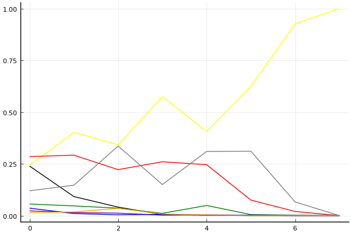
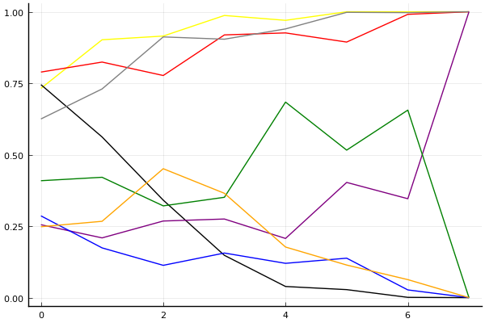

2019 시즌 2 개인전 16강 최종전

## 경기 결과

| 트랙 | 이재혁 | 전대웅 | 박도현 | 황인호 | 배성빈 | 신종민 | 최영훈 | 박현수 |
|:---|---:|---:|---:|---:|---:|---:|---:|---:|
| [신화 신들의 세계](../shinsegye) | 10 | -1 | 5 | 7 | 1 | 3 | 0 | 4 |
| [팩토리 미완성 5구역](../district5) | 4 | -1 | 3 | 10 | 5 | 1 | 0 | 7 |
| [WKC 브라질 서킷](../brazil) | 10 | -1 | 7 | 1 | 3 | 4 | 5 | 0 |
| [해적 로비 절벽의 전투](../lobby) | 1 | -1 | 5 | 7 | 3 | 10 | 4 | 0 |
| [공동묘지 해골 손가락](../haeson) | 10 | 4 | 1 | 7 | 5 | -1 | 3 | 0 |
| [월드 뉴욕 대질주](../newyork) | 10 | -1 | 7 | 1 | 3 | 5 | 0 | 4 |
| [월드 이탈리아 피사의 사탑](../pizza) | 10 | -1 | 3 | 4 | 7 | 0 | 5 | 1 |
| __total__ |__55__ |__-2__ |__31__ |__37__ |__27__ |__22__ |__17__ |__16__ |

## 시뮬레이션

### 1st 확률

x축: 트랙, y축: 확률
1번: 옐로우, 2번: 블랙, 3번: 레드, 4번: 화이트(회색), 5번: 퍼플, 6번: 그린, 7번: 블루, 8번: 오렌지

| 트랙 | 이재혁 | 전대웅 | 박도현 | 황인호 | 배성빈 | 신종민 | 최영훈 | 박현수 |
|:---|---:|---:|---:|---:|---:|---:|---:|---:|
| 초기 | 0.243 | 0.239 | 0.285 | 0.120 | 0.023 | 0.056 | 0.036 | 0.014 |
| 신화 신들의 세계 | 0.402 | 0.092 | 0.292 | 0.147 | 0.015 | 0.047 | 0.010 | 0.018 |
| 팩토리 미완성 5구역 | 0.342 | 0.041 | 0.222 | 0.336 | 0.012 | 0.036 | 0.004 | 0.035 |
| WKC 브라질 서킷 | 0.575 | 0.005 | 0.260 | 0.150 | 0.002 | 0.011 | 0.006 | 0.008 |
| 해적 로비 절벽의 전투 | 0.406 | 0.002 | 0.246 | 0.310 | 0.004 | 0.049 | 0.002 | 0.003 |
| 공동묘지 해골 손가락 | 0.624 | 0.000 | 0.075 | 0.311 | 0.002 | 0.005 | 0.002 | 0.000 |
| 월드 뉴욕 대질주 | 0.926 | 0.000 | 0.020 | 0.066 | 0.000 | 0.002 | 0.000 | 0.000 |
| 월드 이탈리아 피사의 사탑 | 1.000 | 0.000 | 0.000 | 0.000 | 0.000 | 0.000 | 0.000 | 0.000 |

### Advance 확률

x축: 트랙, y축: 확률
1번: 옐로우, 2번: 블랙, 3번: 레드, 4번: 화이트(회색), 5번: 퍼플, 6번: 그린, 7번: 블루, 8번: 오렌지

| 트랙 | 이재혁 | 전대웅 | 박도현 | 황인호 | 배성빈 | 신종민 | 최영훈 | 박현수 |
|:---|---:|---:|---:|---:|---:|---:|---:|---:|
| 초기 | 0.738 | 0.766 | 0.771 | 0.618 | 0.278 | 0.412 | 0.294 | 0.229 |
| 신화 신들의 세계 | 0.896 | 0.558 | 0.816 | 0.749 | 0.228 | 0.404 | 0.213 | 0.262 |
| 팩토리 미완성 5구역 | 0.906 | 0.354 | 0.803 | 0.896 | 0.272 | 0.305 | 0.097 | 0.462 |
| WKC 브라질 서킷 | 0.985 | 0.155 | 0.908 | 0.893 | 0.299 | 0.352 | 0.153 | 0.347 |
| 해적 로비 절벽의 전투 | 0.975 | 0.029 | 0.919 | 0.953 | 0.215 | 0.692 | 0.131 | 0.152 |
| 공동묘지 해골 손가락 | 0.997 | 0.028 | 0.895 | 0.996 | 0.405 | 0.506 | 0.155 | 0.104 |
| 월드 뉴욕 대질주 | 1.000 | 0.000 | 0.977 | 0.998 | 0.346 | 0.664 | 0.029 | 0.059 |
| 월드 이탈리아 피사의 사탑 | 1.000 | 0.000 | 1.000 | 1.000 | 1.000 | 0.000 | 0.000 | 0.000 |

## 랭킹 변동

### [전체 랭킹](../singles-full)

| 순위 | 변동 | 이름 | 점수 | 변동 | mu | 변동 | sigma | 변동 |
|---:|---:|:---:|---:|---:|---:|---:|---:|---:|
| 4 / 82 | +3 | [이재혁](../ijaehyeok) | 3236 | +65 | 3470 | +65 | 78 | +0 |
| 8 / 82 | +3 | [박도현](../bakdohyeon) | 3128 | +32 | 3442 | -3 | 105 | -12 |
| 9 / 82 | +1 | [황인호](../hwanginho) | 3127 | +29 | 3356 | +28 | 76 | -0 |
| 11 / 82 | -6 | [전대웅](../jeondaewoong) | 3075 | -112 | 3306 | -111 | 77 | +0 |
| 14 / 82 | +0 | [신종민](../shinjongmin) | 2995 | -1 | 3236 | -5 | 80 | -1 |
| 17 / 82 | +3 | [배성빈](../baeseongbin) | 2948 | +38 | 3192 | +32 | 81 | -2 |
| 18 / 82 | -1 | [최영훈](../choiyeonghun) | 2945 | +0 | 3176 | -2 | 77 | -1 |
| 22 / 82 | +0 | [박현수](../bakhyeonsu) | 2895 | +4 | 3138 | -1 | 81 | -2 |

### 시즌 랭킹

| 순위 | 변동 | 이름 | 점수 | 변동 | mu | 변동 | sigma | 변동 |
|---:|---:|:---:|---:|---:|---:|---:|---:|---:|
| 2 / 32 | +3 | [이재혁](../ijaehyeok) | 3186 | +171 | 3519 | +137 | 111 | -11 |
| 4 / 32 | +0 | [황인호](../hwanginho) | 3100 | +77 | 3422 | +41 | 107 | -12 |
| 5 / 32 | +1 | [박도현](../bakdohyeon) | 3042 | +60 | 3359 | +23 | 106 | -12 |
| 8 / 32 | +5 | [배성빈](../baeseongbin) | 2894 | +72 | 3183 | +49 | 96 | -8 |
| 9 / 32 | +1 | [최영훈](../choiyeonghun) | 2893 | +14 | 3200 | -17 | 102 | -10 |
| 10 / 32 | -1 | [박현수](../bakhyeonsu) | 2887 | +5 | 3177 | -17 | 97 | -7 |
| 11 / 32 | -8 | [전대웅](../jeondaewoong) | 2874 | -212 | 3207 | -247 | 111 | -12 |
| 12 / 32 | +0 | [신종민](../shinjongmin) | 2859 | +34 | 3151 | +12 | 97 | -7 |

### 트랙 별 랭킹

#### [WKC 브라질 서킷](../brazil)

| 순위 | 변동 | 이름 | 점수 | 변동 | mu | 변동 | sigma | 변동 |
|:---:|:---:|:---:|---:|---:|---:|---:|---:|---:|
| 3 / 32 | +2 | [최영훈](../choiyeonghun) | 2408 | +188 | 3378 | -5 | 323 | -64 |
| 5 / 32 | -3 | [박현수](../bakhyeonsu) | 2334 | -120 | 3175 | -231 | 280 | -37 |
| 6 / 32 | +2 | [박도현](../bakdohyeon) | 2307 | +324 | 3219 | +181 | 304 | -48 |
| 7 / 32 | +11 | [이재혁](../ijaehyeok) | 2259 | +503 | 3229 | +365 | 323 | -46 |
| 8 / 32 | -1 | [신종민](../shinjongmin) | 2208 | +158 | 3021 | +52 | 271 | -35 |
| 9 / 32 | +1 | [배성빈](../baeseongbin) | 2099 | +129 | 2920 | +19 | 273 | -37 |
| 10 / 32 | -4 | [전대웅](../jeondaewoong) | 1994 | -200 | 2929 | -323 | 312 | -41 |
| 17 / 32 | +5 | [황인호](../hwanginho) | 1778 | +225 | 2772 | +8 | 332 | -72 |

#### [공동묘지 해골 손가락](../haeson)

| 순위 | 변동 | 이름 | 점수 | 변동 | mu | 변동 | sigma | 변동 |
|:---:|:---:|:---:|---:|---:|---:|---:|---:|---:|
| 2 / 46 | +2 | [이재혁](../ijaehyeok) | 3111 | +132 | 3742 | +101 | 210 | -10 |
| 4 / 46 | +2 | [배성빈](../baeseongbin) | 2810 | +124 | 3725 | -29 | 305 | -51 |
| 8 / 46 | +5 | [황인호](../hwanginho) | 2582 | +309 | 3445 | +191 | 288 | -39 |
| 10 / 46 | +2 | [전대웅](../jeondaewoong) | 2573 | +105 | 3281 | +41 | 236 | -21 |
| 12 / 46 | -1 | [박현수](../bakhyeonsu) | 2469 | -33 | 3214 | -102 | 248 | -23 |
| 13 / 46 | -10 | [신종민](../shinjongmin) | 2293 | -706 | 3540 | -1091 | 416 | -128 |
| 17 / 46 | +3 | [최영훈](../choiyeonghun) | 2105 | +268 | 3035 | +104 | 310 | -55 |
| 30 / 46 | NaN | [박도현](../bakdohyeon) | 1528 | +1528 | 3039 | +39 | 504 | -496 |

#### [신화 신들의 세계](../shinsegye)

| 순위 | 변동 | 이름 | 점수 | 변동 | mu | 변동 | sigma | 변동 |
|:---:|:---:|:---:|---:|---:|---:|---:|---:|---:|
| 1 / 47 | +4 | [이재혁](../ijaehyeok) | 3090 | +285 | 3984 | +196 | 298 | -30 |
| 2 / 47 | +2 | [황인호](../hwanginho) | 3028 | +107 | 3633 | +72 | 202 | -12 |
| 5 / 47 | -2 | [배성빈](../baeseongbin) | 2887 | -37 | 3538 | -87 | 217 | -16 |
| 6 / 47 | +7 | [박도현](../bakdohyeon) | 2810 | +187 | 3747 | +17 | 312 | -56 |
| 14 / 47 | +1 | [신종민](../shinjongmin) | 2615 | +63 | 3239 | +19 | 208 | -15 |
| 16 / 47 | +0 | [박현수](../bakhyeonsu) | 2584 | +160 | 3392 | +56 | 269 | -35 |
| 17 / 47 | +1 | [최영훈](../choiyeonghun) | 2305 | +24 | 2967 | -23 | 221 | -16 |
| 21 / 47 | -4 | [전대웅](../jeondaewoong) | 2181 | -207 | 3157 | -344 | 325 | -46 |

#### [월드 뉴욕 대질주](../newyork)

| 순위 | 변동 | 이름 | 점수 | 변동 | mu | 변동 | sigma | 변동 |
|:---:|:---:|:---:|---:|---:|---:|---:|---:|---:|
| 1 / 41 | +1 | [박도현](../bakdohyeon) | 3040 | +63 | 4056 | -118 | 339 | -60 |
| 3 / 41 | +4 | [이재혁](../ijaehyeok) | 2838 | +214 | 3565 | +168 | 242 | -15 |
| 5 / 41 | -2 | [전대웅](../jeondaewoong) | 2629 | -168 | 3303 | -214 | 225 | -15 |
| 8 / 41 | -4 | [황인호](../hwanginho) | 2612 | -102 | 3390 | -192 | 259 | -30 |
| 11 / 41 | +1 | [신종민](../shinjongmin) | 2436 | +186 | 3278 | +80 | 281 | -35 |
| 16 / 41 | +3 | [박현수](../bakhyeonsu) | 2034 | +232 | 2862 | +123 | 276 | -36 |
| 17 / 41 | +0 | [최영훈](../choiyeonghun) | 1980 | +36 | 2789 | -64 | 270 | -33 |
| 27 / 41 | +7 | [배성빈](../baeseongbin) | 1309 | +564 | 2243 | +389 | 311 | -58 |

#### [월드 이탈리아 피사의 사탑](../pizza)

| 순위 | 변동 | 이름 | 점수 | 변동 | mu | 변동 | sigma | 변동 |
|:---:|:---:|:---:|---:|---:|---:|---:|---:|---:|
| 2 / 32 | +0 | [박도현](../bakdohyeon) | 2755 | -117 | 3749 | -337 | 331 | -73 |
| 3 / 32 | +0 | [황인호](../hwanginho) | 2643 | +79 | 3544 | -76 | 301 | -52 |
| 4 / 32 | +8 | [이재혁](../ijaehyeok) | 2571 | +451 | 3567 | +310 | 332 | -47 |
| 9 / 32 | +0 | [박현수](../bakhyeonsu) | 2325 | +50 | 3162 | -62 | 279 | -37 |
| 11 / 32 | +5 | [배성빈](../baeseongbin) | 2288 | +357 | 3131 | +245 | 281 | -37 |
| 12 / 32 | -2 | [신종민](../shinjongmin) | 2192 | -22 | 3056 | -135 | 288 | -38 |
| 13 / 32 | +5 | [최영훈](../choiyeonghun) | 2175 | +382 | 3078 | +228 | 301 | -51 |
| 18 / 32 | -3 | [전대웅](../jeondaewoong) | 1827 | -121 | 2780 | -229 | 318 | -36 |

#### [팩토리 미완성 5구역](../district5)

| 순위 | 변동 | 이름 | 점수 | 변동 | mu | 변동 | sigma | 변동 |
|:---:|:---:|:---:|---:|---:|---:|---:|---:|---:|
| 3 / 76 | +0 | [이재혁](../ijaehyeok) | 3257 | -8 | 3755 | -30 | 166 | -7 |
| 6 / 76 | -1 | [전대웅](../jeondaewoong) | 2927 | -84 | 3461 | -105 | 178 | -7 |
| 7 / 76 | +3 | [황인호](../hwanginho) | 2910 | +111 | 3430 | +92 | 173 | -6 |
| 10 / 76 | -2 | [최영훈](../choiyeonghun) | 2776 | -37 | 3384 | -76 | 203 | -13 |
| 11 / 76 | +5 | [박현수](../bakhyeonsu) | 2730 | +181 | 3451 | +111 | 240 | -23 |
| 15 / 76 | +0 | [신종민](../shinjongmin) | 2591 | +33 | 3301 | -38 | 237 | -23 |
| 19 / 76 | +4 | [배성빈](../baeseongbin) | 2509 | +189 | 3221 | +118 | 238 | -24 |
| 20 / 76 | +4 | [박도현](../bakdohyeon) | 2429 | +161 | 3307 | +12 | 293 | -50 |

#### [해적 로비 절벽의 전투](../lobby)

| 순위 | 변동 | 이름 | 점수 | 변동 | mu | 변동 | sigma | 변동 |
|:---:|:---:|:---:|---:|---:|---:|---:|---:|---:|
| 2 / 35 | +4 | [황인호](../hwanginho) | 2691 | +222 | 3591 | +84 | 300 | -46 |
| 3 / 35 | -2 | [전대웅](../jeondaewoong) | 2642 | -790 | 3805 | -1126 | 388 | -112 |
| 4 / 35 | -1 | [이재혁](../ijaehyeok) | 2600 | -54 | 3478 | -197 | 293 | -48 |
| 6 / 35 | +4 | [신종민](../shinjongmin) | 2515 | +372 | 3373 | +280 | 286 | -31 |
| 10 / 35 | +1 | [박도현](../bakdohyeon) | 2376 | +281 | 3293 | +119 | 306 | -54 |
| 11 / 35 | -2 | [박현수](../bakhyeonsu) | 2312 | +14 | 3121 | -87 | 270 | -34 |
| 12 / 35 | +2 | [배성빈](../baeseongbin) | 2223 | +170 | 3047 | +54 | 275 | -39 |
| 16 / 35 | +1 | [최영훈](../choiyeonghun) | 1933 | +358 | 2781 | +231 | 283 | -42 |
