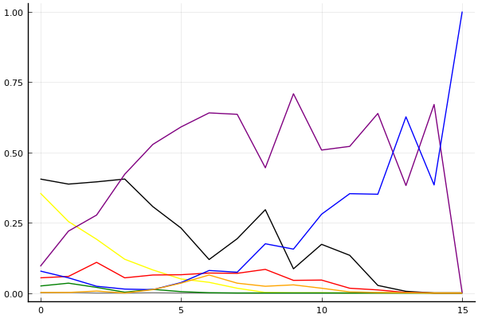
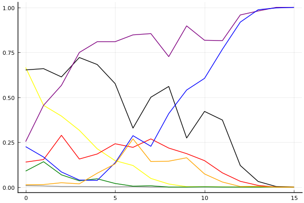

2019 시즌 2 개인전 결승 1라운드

## 경기 결과

| 트랙 | 박인수 | 문호준 | 유영혁 | 김기수 | 이재혁 | 황인호 | 박도현 | 배성빈 |
|:---|---:|---:|---:|---:|---:|---:|---:|---:|
| [신화 신들의 세계](../shinsegye) | -1 | 4 | 3 | 1 | 10 | 7 | 0 | 5 |
| [팩토리 미완성 5구역](../district5) | 3 | 5 | 10 | 0 | 7 | -1 | 1 | 4 |
| [WKC 브라질 서킷](../brazil) | 4 | 7 | 1 | 5 | 10 | -1 | 0 | 3 |
| [해적 로비 절벽의 전투](../lobby) | 0 | 1 | 3 | -1 | 5 | 7 | 4 | 10 |
| [비치 해변 드라이브](../haebyun) | 0 | 1 | 5 | 4 | 3 | -1 | 10 | 7 |
| [월드 뉴욕 대질주](../newyork) | 4 | 0 | 3 | 1 | 5 | -1 | 10 | 7 |
| [네모 산타의 비밀공간](../santa) | 1 | 10 | 7 | -1 | 5 | 3 | 4 | 0 |
| [도검 구름의 협곡](../hyupgog) | 0 | 7 | 4 | 3 | 1 | -1 | 10 | 5 |
| [월드 이탈리아 피사의 사탑](../pizza) | 3 | 1 | 4 | -1 | 10 | 0 | 7 | 5 |
| [공동묘지 해골 손가락](../haeson) | 4 | 7 | 3 | 1 | 0 | 10 | 5 | -1 |
| [해적 로비 절벽의 전투](../lobby) | -1 | 5 | 1 | 10 | 4 | 3 | 7 | 0 |
| [네모 산타의 비밀공간](../santa) | 1 | 0 | 3 | 4 | 7 | 10 | 5 | -1 |
| [비치 해변 드라이브](../haebyun) | 10 | 0 | -1 | 5 | 1 | 3 | 7 | 4 |
| [월드 이탈리아 피사의 사탑](../pizza) | -1 | 7 | 0 | 4 | 10 | 1 | 5 | 3 |
| [월드 뉴욕 대질주](../newyork) | 1 | 5 | 3 | 0 | -1 | 4 | 7 | 10 |
| __total__ |__28__ |__60__ |__49__ |__35__ |__77__ |__43__ |__82__ |__61__ |

## 시뮬레이션

### 1st 확률

x축: 트랙, y축: 확률
1번: 옐로우, 2번: 블랙, 3번: 레드, 4번: 화이트(회색), 5번: 퍼플, 6번: 그린, 7번: 블루, 8번: 오렌지

| 트랙 | 박인수 | 문호준 | 유영혁 | 김기수 | 이재혁 | 황인호 | 박도현 | 배성빈 |
|:---|---:|---:|---:|---:|---:|---:|---:|---:|
| 초기 | 0.355 | 0.405 | 0.054 | 0.001 | 0.095 | 0.025 | 0.078 | 0.002 |
| 신화 신들의 세계 | 0.254 | 0.387 | 0.059 | 0.002 | 0.220 | 0.035 | 0.054 | 0.002 |
| 팩토리 미완성 5구역 | 0.191 | 0.395 | 0.109 | 0.000 | 0.277 | 0.020 | 0.024 | 0.007 |
| WKC 브라질 서킷 | 0.120 | 0.405 | 0.054 | 0.000 | 0.422 | 0.003 | 0.014 | 0.000 |
| 해적 로비 절벽의 전투 | 0.082 | 0.307 | 0.064 | 0.001 | 0.528 | 0.013 | 0.012 | 0.012 |
| 비치 해변 드라이브 | 0.050 | 0.231 | 0.065 | 0.000 | 0.590 | 0.005 | 0.037 | 0.035 |
| 월드 뉴욕 대질주 | 0.038 | 0.119 | 0.071 | 0.000 | 0.640 | 0.001 | 0.080 | 0.064 |
| 네모 산타의 비밀공간 | 0.017 | 0.193 | 0.070 | 0.000 | 0.635 | 0.000 | 0.074 | 0.035 |
| 도검 구름의 협곡 | 0.002 | 0.296 | 0.084 | 0.000 | 0.445 | 0.000 | 0.175 | 0.024 |
| 월드 이탈리아 피사의 사탑 | 0.001 | 0.086 | 0.045 | 0.000 | 0.708 | 0.000 | 0.156 | 0.029 |
| 공동묘지 해골 손가락 | 0.001 | 0.173 | 0.046 | 0.000 | 0.508 | 0.000 | 0.280 | 0.017 |
| 해적 로비 절벽의 전투 | 0.000 | 0.134 | 0.017 | 0.000 | 0.521 | 0.000 | 0.353 | 0.004 |
| 네모 산타의 비밀공간 | 0.000 | 0.027 | 0.011 | 0.000 | 0.638 | 0.000 | 0.351 | 0.002 |
| 비치 해변 드라이브 | 0.000 | 0.006 | 0.002 | 0.000 | 0.382 | 0.000 | 0.626 | 0.001 |
| 월드 이탈리아 피사의 사탑 | 0.000 | 0.000 | 0.000 | 0.000 | 0.670 | 0.000 | 0.384 | 0.000 |
| 월드 뉴욕 대질주 | 0.000 | 0.000 | 0.000 | 0.000 | 0.000 | 0.000 | 1.000 | 0.000 |

### Advance 확률

x축: 트랙, y축: 확률
1번: 옐로우, 2번: 블랙, 3번: 레드, 4번: 화이트(회색), 5번: 퍼플, 6번: 그린, 7번: 블루, 8번: 오렌지

| 트랙 | 박인수 | 문호준 | 유영혁 | 김기수 | 이재혁 | 황인호 | 박도현 | 배성빈 |
|:---|---:|---:|---:|---:|---:|---:|---:|---:|
| 초기 | 0.663 | 0.651 | 0.147 | 0.006 | 0.268 | 0.084 | 0.211 | 0.011 |
| 신화 신들의 세계 | 0.492 | 0.645 | 0.135 | 0.007 | 0.476 | 0.134 | 0.149 | 0.017 |
| 팩토리 미완성 5구역 | 0.431 | 0.635 | 0.290 | 0.004 | 0.529 | 0.063 | 0.085 | 0.020 |
| WKC 브라질 서킷 | 0.309 | 0.729 | 0.160 | 0.001 | 0.757 | 0.030 | 0.035 | 0.017 |
| 해적 로비 절벽의 전투 | 0.237 | 0.650 | 0.172 | 0.002 | 0.798 | 0.067 | 0.046 | 0.071 |
| 비치 해변 드라이브 | 0.118 | 0.530 | 0.234 | 0.001 | 0.831 | 0.035 | 0.134 | 0.156 |
| 월드 뉴욕 대질주 | 0.130 | 0.317 | 0.208 | 0.002 | 0.844 | 0.006 | 0.286 | 0.268 |
| 네모 산타의 비밀공간 | 0.051 | 0.455 | 0.276 | 0.000 | 0.853 | 0.009 | 0.255 | 0.159 |
| 도검 구름의 협곡 | 0.016 | 0.537 | 0.242 | 0.000 | 0.725 | 0.001 | 0.404 | 0.126 |
| 월드 이탈리아 피사의 사탑 | 0.006 | 0.271 | 0.171 | 0.000 | 0.898 | 0.000 | 0.556 | 0.165 |
| 공동묘지 해골 손가락 | 0.001 | 0.410 | 0.184 | 0.001 | 0.805 | 0.002 | 0.585 | 0.061 |
| 해적 로비 절벽의 전투 | 0.000 | 0.361 | 0.068 | 0.000 | 0.831 | 0.000 | 0.762 | 0.030 |
| 네모 산타의 비밀공간 | 0.000 | 0.118 | 0.040 | 0.000 | 0.957 | 0.000 | 0.908 | 0.003 |
| 비치 해변 드라이브 | 0.000 | 0.028 | 0.007 | 0.000 | 0.985 | 0.000 | 0.986 | 0.003 |
| 월드 이탈리아 피사의 사탑 | 0.000 | 0.000 | 0.000 | 0.000 | 1.000 | 0.000 | 1.000 | 0.000 |
| 월드 뉴욕 대질주 | 0.000 | 0.000 | 0.000 | 0.000 | 1.000 | 0.000 | 1.000 | 0.000 |

## 랭킹 변동

### [전체 랭킹](../singles-full)

| 순위 | 변동 | 이름 | 점수 | 변동 | mu | 변동 | sigma | 변동 |
|---:|---:|:---:|---:|---:|---:|---:|---:|---:|
| 1 / 82 | +1 | [문호준](../munhojun) | 3365 | -30 | 3595 | -33 | 77 | -1 |
| 3 / 82 | +1 | [이재혁](../ijaehyeok) | 3277 | +41 | 3509 | +39 | 77 | -1 |
| 4 / 82 | -3 | [박인수](../bakinsu) | 3273 | -127 | 3504 | -129 | 77 | -1 |
| 5 / 82 | +3 | [박도현](../bakdohyeon) | 3270 | +143 | 3545 | +103 | 92 | -13 |
| 7 / 82 | -1 | [유영혁](../yuyeonghyeok) | 3166 | -11 | 3394 | -13 | 76 | -1 |
| 10 / 82 | -1 | [황인호](../hwanginho) | 3102 | -25 | 3331 | -25 | 76 | +0 |
| 13 / 82 | +4 | [배성빈](../baeseongbin) | 3030 | +82 | 3267 | +76 | 79 | -2 |
| 20 / 82 | +3 | [김기수](../gimgisu) | 2923 | +54 | 3184 | +29 | 87 | -8 |

### 시즌 랭킹

| 순위 | 변동 | 이름 | 점수 | 변동 | mu | 변동 | sigma | 변동 |
|---:|---:|:---:|---:|---:|---:|---:|---:|---:|
| 1 / 32 | +1 | [이재혁](../ijaehyeok) | 3272 | +86 | 3557 | +38 | 95 | -16 |
| 2 / 32 | -1 | [문호준](../munhojun) | 3255 | +19 | 3550 | -47 | 98 | -22 |
| 3 / 32 | +2 | [박도현](../bakdohyeon) | 3215 | +172 | 3491 | +131 | 92 | -14 |
| 4 / 32 | +0 | [황인호](../hwanginho) | 3070 | -30 | 3350 | -72 | 94 | -14 |
| 5 / 32 | -2 | [박인수](../bakinsu) | 3050 | -113 | 3348 | -180 | 99 | -22 |
| 6 / 32 | +0 | [유영혁](../yuyeonghyeok) | 3041 | +74 | 3330 | +13 | 96 | -20 |
| 7 / 32 | +1 | [배성빈](../baeseongbin) | 3013 | +119 | 3275 | +92 | 87 | -9 |
| 8 / 32 | -1 | [김기수](../gimgisu) | 2977 | +23 | 3267 | -34 | 97 | -19 |

### 트랙 별 랭킹

#### [WKC 브라질 서킷](../brazil)

| 순위 | 변동 | 이름 | 점수 | 변동 | mu | 변동 | sigma | 변동 |
|:---:|:---:|:---:|---:|---:|---:|---:|---:|---:|
| 1 / 32 | +0 | [문호준](../munhojun) | 2752 | +209 | 3714 | +47 | 320 | -54 |
| 2 / 32 | +5 | [이재혁](../ijaehyeok) | 2615 | +356 | 3493 | +264 | 293 | -31 |
| 3 / 32 | +1 | [박인수](../bakinsu) | 2469 | +105 | 3476 | -117 | 336 | -74 |
| 7 / 32 | +4 | [김기수](../gimgisu) | 2281 | +300 | 3178 | +160 | 299 | -47 |
| 8 / 32 | -2 | [박도현](../bakdohyeon) | 2234 | -73 | 3052 | -167 | 273 | -31 |
| 9 / 32 | +0 | [배성빈](../baeseongbin) | 2209 | +109 | 2953 | +33 | 248 | -25 |
| 11 / 32 | +1 | [유영혁](../yuyeonghyeok) | 2022 | +104 | 2959 | -61 | 312 | -55 |
| 19 / 32 | -2 | [황인호](../hwanginho) | 1681 | -97 | 2587 | -186 | 302 | -30 |

#### [공동묘지 해골 손가락](../haeson)

| 순위 | 변동 | 이름 | 점수 | 변동 | mu | 변동 | sigma | 변동 |
|:---:|:---:|:---:|---:|---:|---:|---:|---:|---:|
| 1 / 46 | +0 | [문호준](../munhojun) | 3235 | +75 | 3892 | +28 | 219 | -16 |
| 2 / 46 | +1 | [유영혁](../yuyeonghyeok) | 3067 | -17 | 3698 | -63 | 210 | -15 |
| 3 / 46 | -1 | [이재혁](../ijaehyeok) | 3035 | -76 | 3631 | -111 | 199 | -12 |
| 4 / 46 | +4 | [황인호](../hwanginho) | 2872 | +291 | 3666 | +221 | 265 | -23 |
| 5 / 46 | +2 | [박인수](../bakinsu) | 2725 | +101 | 3426 | +36 | 234 | -22 |
| 8 / 46 | -4 | [배성빈](../baeseongbin) | 2622 | -188 | 3451 | -274 | 276 | -29 |
| 14 / 46 | +16 | [박도현](../bakdohyeon) | 2260 | +733 | 3401 | +362 | 380 | -124 |
| 30 / 46 | +9 | [김기수](../gimgisu) | 1562 | +1030 | 2790 | +517 | 409 | -171 |

#### [네모 산타의 비밀공간](../santa)

| 순위 | 변동 | 이름 | 점수 | 변동 | mu | 변동 | sigma | 변동 |
|:---:|:---:|:---:|---:|---:|---:|---:|---:|---:|
| 2 / 62 | +1 | [문호준](../munhojun) | 2896 | +24 | 3353 | -4 | 153 | -9 |
| 3 / 62 | +1 | [유영혁](../yuyeonghyeok) | 2800 | +48 | 3208 | +25 | 136 | -8 |
| 4 / 62 | +2 | [이재혁](../ijaehyeok) | 2745 | +94 | 3185 | +65 | 147 | -10 |
| 7 / 62 | +5 | [황인호](../hwanginho) | 2627 | +154 | 3162 | +101 | 178 | -18 |
| 11 / 62 | -9 | [김기수](../gimgisu) | 2532 | -356 | 3401 | -698 | 290 | -114 |
| 13 / 62 | +0 | [박인수](../bakinsu) | 2478 | +27 | 2928 | -5 | 150 | -11 |
| 17 / 62 | +11 | [박도현](../bakdohyeon) | 2403 | +373 | 3168 | +144 | 255 | -76 |
| 22 / 62 | -4 | [배성빈](../baeseongbin) | 2276 | -97 | 2922 | -191 | 215 | -31 |

#### [도검 구름의 협곡](../hyupgog)

| 순위 | 변동 | 이름 | 점수 | 변동 | mu | 변동 | sigma | 변동 |
|:---:|:---:|:---:|---:|---:|---:|---:|---:|---:|
| 1 / 46 | +0 | [문호준](../munhojun) | 3166 | +39 | 3755 | +6 | 196 | -11 |
| 2 / 46 | +1 | [배성빈](../baeseongbin) | 3020 | +13 | 3744 | -55 | 242 | -23 |
| 3 / 46 | -1 | [박인수](../bakinsu) | 2976 | -124 | 3564 | -157 | 196 | -11 |
| 10 / 46 | +1 | [유영혁](../yuyeonghyeok) | 2460 | +87 | 3143 | +29 | 228 | -19 |
| 12 / 46 | +12 | [박도현](../bakdohyeon) | 2319 | +507 | 3229 | +389 | 303 | -39 |
| 17 / 46 | -1 | [이재혁](../ijaehyeok) | 2174 | +53 | 2915 | -24 | 247 | -26 |
| 24 / 46 | -1 | [황인호](../hwanginho) | 1783 | -38 | 2455 | -69 | 224 | -10 |
| 27 / 46 | +3 | [김기수](../gimgisu) | 1609 | +378 | 2486 | +239 | 292 | -46 |

#### [비치 해변 드라이브](../haebyun)

| 순위 | 변동 | 이름 | 점수 | 변동 | mu | 변동 | sigma | 변동 |
|:---:|:---:|:---:|---:|---:|---:|---:|---:|---:|
| 1 / 58 | +8 | [박도현](../bakdohyeon) | 2992 | +473 | 3820 | +261 | 276 | -71 |
| 3 / 58 | -2 | [유영혁](../yuyeonghyeok) | 2891 | -35 | 3387 | -74 | 165 | -13 |
| 4 / 58 | -1 | [박인수](../bakinsu) | 2826 | +104 | 3384 | +47 | 186 | -19 |
| 5 / 58 | +5 | [김기수](../gimgisu) | 2757 | +251 | 3547 | +8 | 263 | -81 |
| 8 / 58 | -2 | [문호준](../munhojun) | 2601 | -6 | 3152 | -69 | 184 | -21 |
| 9 / 58 | +16 | [배성빈](../baeseongbin) | 2589 | +513 | 3396 | +261 | 269 | -84 |
| 12 / 58 | +3 | [이재혁](../ijaehyeok) | 2489 | +111 | 3092 | +21 | 201 | -30 |
| 16 / 58 | -3 | [황인호](../hwanginho) | 2387 | -30 | 3145 | -204 | 253 | -58 |

#### [신화 신들의 세계](../shinsegye)

| 순위 | 변동 | 이름 | 점수 | 변동 | mu | 변동 | sigma | 변동 |
|:---:|:---:|:---:|---:|---:|---:|---:|---:|---:|
| 1 / 47 | +0 | [이재혁](../ijaehyeok) | 3300 | +210 | 4127 | +143 | 276 | -22 |
| 2 / 47 | +0 | [황인호](../hwanginho) | 3122 | +94 | 3696 | +63 | 192 | -10 |
| 3 / 47 | +2 | [배성빈](../baeseongbin) | 2973 | +86 | 3583 | +46 | 203 | -14 |
| 5 / 47 | -2 | [박인수](../bakinsu) | 2888 | -118 | 3533 | -156 | 215 | -13 |
| 6 / 47 | +1 | [문호준](../munhojun) | 2848 | +79 | 3505 | +26 | 219 | -18 |
| 8 / 47 | +3 | [유영혁](../yuyeonghyeok) | 2732 | +66 | 3430 | +0 | 233 | -22 |
| 9 / 47 | -3 | [박도현](../bakdohyeon) | 2727 | -83 | 3554 | -193 | 276 | -37 |
| 17 / 47 | +1 | [김기수](../gimgisu) | 2389 | +114 | 3145 | +30 | 252 | -28 |

#### [월드 뉴욕 대질주](../newyork)

| 순위 | 변동 | 이름 | 점수 | 변동 | mu | 변동 | sigma | 변동 |
|:---:|:---:|:---:|---:|---:|---:|---:|---:|---:|
| 1 / 41 | +0 | [박도현](../bakdohyeon) | 3270 | +230 | 4098 | +42 | 276 | -63 |
| 2 / 41 | +0 | [유영혁](../yuyeonghyeok) | 3004 | -8 | 3581 | -86 | 192 | -26 |
| 3 / 41 | +0 | [이재혁](../ijaehyeok) | 2804 | -34 | 3438 | -128 | 211 | -31 |
| 4 / 41 | +2 | [박인수](../bakinsu) | 2729 | +102 | 3393 | -27 | 221 | -43 |
| 5 / 41 | +4 | [문호준](../munhojun) | 2656 | +123 | 3308 | +10 | 217 | -38 |
| 8 / 41 | +0 | [황인호](../hwanginho) | 2613 | +0 | 3280 | -110 | 222 | -37 |
| 9 / 41 | -2 | [김기수](../gimgisu) | 2547 | -66 | 3389 | -382 | 281 | -105 |
| 13 / 41 | +14 | [배성빈](../baeseongbin) | 2264 | +955 | 3019 | +777 | 252 | -60 |

#### [월드 이탈리아 피사의 사탑](../pizza)

| 순위 | 변동 | 이름 | 점수 | 변동 | mu | 변동 | sigma | 변동 |
|:---:|:---:|:---:|---:|---:|---:|---:|---:|---:|
| 1 / 32 | +3 | [이재혁](../ijaehyeok) | 3137 | +567 | 3968 | +402 | 277 | -55 |
| 2 / 32 | +0 | [박도현](../bakdohyeon) | 3019 | +264 | 3803 | +54 | 261 | -70 |
| 3 / 32 | +7 | [문호준](../munhojun) | 2665 | +351 | 3480 | +112 | 272 | -79 |
| 4 / 32 | -3 | [박인수](../bakinsu) | 2632 | -733 | 3615 | -1281 | 327 | -182 |
| 5 / 32 | +6 | [배성빈](../baeseongbin) | 2589 | +301 | 3285 | +154 | 232 | -49 |
| 6 / 32 | -3 | [황인호](../hwanginho) | 2576 | -66 | 3315 | -230 | 246 | -54 |
| 10 / 32 | +4 | [유영혁](../yuyeonghyeok) | 2430 | +272 | 3242 | +11 | 271 | -87 |
| 17 / 32 | +4 | [김기수](../gimgisu) | 1890 | +429 | 2776 | +192 | 295 | -79 |

#### [팩토리 미완성 5구역](../district5)

| 순위 | 변동 | 이름 | 점수 | 변동 | mu | 변동 | sigma | 변동 |
|:---:|:---:|:---:|---:|---:|---:|---:|---:|---:|
| 1 / 76 | +0 | [박인수](../bakinsu) | 3443 | -28 | 3901 | -45 | 153 | -5 |
| 2 / 76 | +1 | [이재혁](../ijaehyeok) | 3306 | +49 | 3786 | +31 | 160 | -6 |
| 3 / 76 | -1 | [문호준](../munhojun) | 3300 | +27 | 3805 | +5 | 168 | -7 |
| 4 / 76 | +0 | [유영혁](../yuyeonghyeok) | 3206 | +98 | 3713 | +81 | 169 | -6 |
| 8 / 76 | -1 | [황인호](../hwanginho) | 2843 | -66 | 3347 | -82 | 168 | -5 |
| 15 / 76 | +4 | [배성빈](../baeseongbin) | 2638 | +129 | 3296 | +75 | 219 | -18 |
| 20 / 76 | +0 | [박도현](../bakdohyeon) | 2500 | +72 | 3285 | -22 | 262 | -31 |
| 25 / 76 | +1 | [김기수](../gimgisu) | 2270 | +54 | 3083 | -43 | 271 | -33 |

#### [해적 로비 절벽의 전투](../lobby)

| 순위 | 변동 | 이름 | 점수 | 변동 | mu | 변동 | sigma | 변동 |
|:---:|:---:|:---:|---:|---:|---:|---:|---:|---:|
| 1 / 35 | +1 | [황인호](../hwanginho) | 2875 | +184 | 3603 | +11 | 243 | -57 |
| 2 / 35 | +2 | [이재혁](../ijaehyeok) | 2820 | +221 | 3533 | +56 | 238 | -55 |
| 3 / 35 | -2 | [김기수](../gimgisu) | 2813 | +46 | 3744 | -264 | 310 | -103 |
| 4 / 35 | +6 | [박도현](../bakdohyeon) | 2746 | +370 | 3483 | +190 | 246 | -60 |
| 5 / 35 | +0 | [문호준](../munhojun) | 2739 | +173 | 3496 | -31 | 252 | -68 |
| 7 / 35 | +2 | [유영혁](../yuyeonghyeok) | 2540 | +161 | 3303 | -52 | 254 | -71 |
| 8 / 35 | +4 | [배성빈](../baeseongbin) | 2524 | +301 | 3223 | +176 | 233 | -42 |
| 12 / 35 | -4 | [박인수](../bakinsu) | 2269 | -145 | 3104 | -374 | 278 | -76 |
