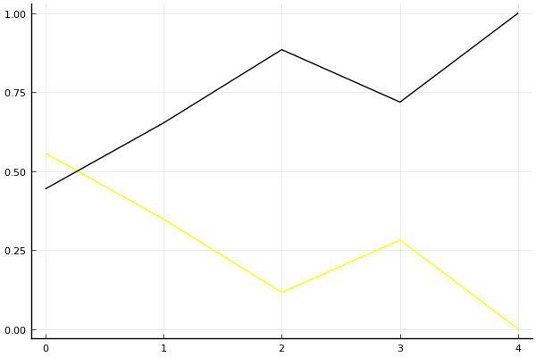

2019 시즌 2 개인전 결승 2라운드

## 경기 결과

| 트랙 | 박도현 | 이재혁 |
|:---|---:|---:|
| [비치 해변 드라이브](../haebyun) | 0 | 1 |
| [공동묘지 해골 손가락](../haeson) | 0 | 1 |
| [월드 뉴욕 대질주](../newyork) | 1 | 0 |
| [신화 신들의 세계](../shinsegye) | 0 | 1 |
| __total__ |__1__ |__3__ |

## 시뮬레이션

### 1st 확률

x축: 트랙, y축: 확률
1번: 옐로우, 2번: 블랙, 3번: 레드, 4번: 화이트(회색), 5번: 퍼플, 6번: 그린, 7번: 블루, 8번: 오렌지

| 트랙 | 박도현 | 이재혁 |
|:---|---:|---:|
| 초기 | 0.515 | 0.485 |
| 비치 해변 드라이브 | 0.521 | 0.479 |
| 공동묘지 해골 손가락 | 0.516 | 0.484 |
| 월드 뉴욕 대질주 | 0.514 | 0.486 |
| 신화 신들의 세계 | 0.000 | 1.000 |

## 랭킹 변동

### [전체 랭킹](../singles-full)

| 순위 | 변동 | 이름 | 점수 | 변동 | mu | 변동 | sigma | 변동 |
|---:|---:|:---:|---:|---:|---:|---:|---:|---:|
| 2 / 82 | +1 | [이재혁](../ijaehyeok) | 3287 | +10 | 3523 | +14 | 79 | +1 |
| 5 / 82 | +0 | [박도현](../bakdohyeon) | 3250 | -20 | 3525 | -20 | 92 | +0 |

### 시즌 랭킹

| 순위 | 변동 | 이름 | 점수 | 변동 | mu | 변동 | sigma | 변동 |
|---:|---:|:---:|---:|---:|---:|---:|---:|---:|
| 1 / 32 | +0 | [이재혁](../ijaehyeok) | 3288 | +17 | 3573 | +17 | 95 | -0 |
| 3 / 32 | +0 | [박도현](../bakdohyeon) | 3198 | -16 | 3475 | -16 | 92 | +0 |

### 트랙 별 랭킹

#### [공동묘지 해골 손가락](../haeson)

| 순위 | 변동 | 이름 | 점수 | 변동 | mu | 변동 | sigma | 변동 |
|:---:|:---:|:---:|---:|---:|---:|---:|---:|---:|
| 2 / 46 | +1 | [이재혁](../ijaehyeok) | 3074 | +39 | 3661 | +30 | 196 | -3 |
| 15 / 46 | -1 | [박도현](../bakdohyeon) | 2221 | -39 | 3291 | -110 | 357 | -24 |

#### [비치 해변 드라이브](../haebyun)

| 순위 | 변동 | 이름 | 점수 | 변동 | mu | 변동 | sigma | 변동 |
|:---:|:---:|:---:|---:|---:|---:|---:|---:|---:|
| 3 / 58 | -2 | [박도현](../bakdohyeon) | 2890 | -101 | 3678 | -143 | 262 | -14 |
| 11 / 58 | +1 | [이재혁](../ijaehyeok) | 2580 | +91 | 3168 | +76 | 196 | -5 |

#### [신화 신들의 세계](../shinsegye)

| 순위 | 변동 | 이름 | 점수 | 변동 | mu | 변동 | sigma | 변동 |
|:---:|:---:|:---:|---:|---:|---:|---:|---:|---:|
| 1 / 47 | +0 | [이재혁](../ijaehyeok) | 3360 | +60 | 4165 | +38 | 268 | -7 |
| 9 / 47 | +0 | [박도현](../bakdohyeon) | 2710 | -17 | 3515 | -38 | 269 | -7 |

#### [월드 뉴욕 대질주](../newyork)

| 순위 | 변동 | 이름 | 점수 | 변동 | mu | 변동 | sigma | 변동 |
|:---:|:---:|:---:|---:|---:|---:|---:|---:|---:|
| 1 / 41 | +0 | [박도현](../bakdohyeon) | 3325 | +55 | 4132 | +34 | 269 | -7 |
| 3 / 41 | +0 | [이재혁](../ijaehyeok) | 2793 | -11 | 3418 | -20 | 208 | -3 |
