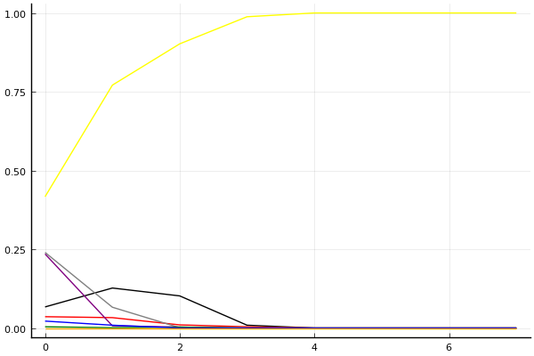
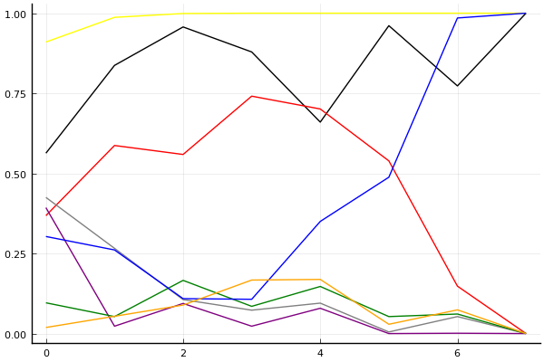
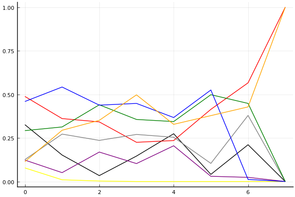

2019 시즌 1 개인전 32강 A조

## 경기 결과

| 트랙 | 박인수 | 이준성 | 이준용 | 심우혁 | 최성수 | 최준호 | 김응태 | 김진석 |
|:---|---:|---:|---:|---:|---:|---:|---:|---:|
| [신화 신들의 세계](../shinsegye) | 10 | 7 | 5 | 3 | -1 | 0 | 1 | 4 |
| [도검 구름의 협곡](../hyupgog) | 10 | 7 | 1 | 0 | 4 | 5 | -1 | 3 |
| [월드 두바이 다운타운](../dubai) | 10 | -1 | 7 | 3 | 0 | 1 | 4 | 5 |
| [팩토리 미완성 5구역](../district5) | 10 | -1 | 1 | 3 | 5 | 4 | 7 | 0 |
| [노르테유 익스프레스](../noex) | 5 | 10 | 4 | 0 | -1 | 3 | 7 | 1 |
| [차이나 서안 병마용](../byeongma) | 1 | 0 | -1 | 7 | 3 | 4 | 10 | 5 |
| [대저택 은밀한 지하실](../jeotaek) | 10 | 4 | 7 | -1 | 3 | 1 | 0 | 5 |
| __total__ |__56__ |__26__ |__24__ |__15__ |__13__ |__18__ |__28__ |__23__ |

## 시뮬레이션

### 1st 확률

x축: 트랙, y축: 확률
1번: 옐로우, 2번: 블랙, 3번: 레드, 4번: 화이트(회색), 5번: 퍼플, 6번: 그린, 7번: 블루, 8번: 오렌지

| 트랙 | 박인수 | 이준성 | 이준용 | 심우혁 | 최성수 | 최준호 | 김응태 | 김진석 |
|:---|---:|---:|---:|---:|---:|---:|---:|---:|
| 초기 | 0.428 | 0.080 | 0.038 | 0.228 | 0.219 | 0.005 | 0.015 | 0.001 |
| 신화 신들의 세계 | 0.771 | 0.121 | 0.050 | 0.068 | 0.003 | 0.000 | 0.005 | 0.000 |
| 도검 구름의 협곡 | 0.892 | 0.108 | 0.004 | 0.001 | 0.004 | 0.000 | 0.002 | 0.000 |
| 월드 두바이 다운타운 | 0.981 | 0.015 | 0.003 | 0.001 | 0.000 | 0.001 | 0.002 | 0.000 |
| 팩토리 미완성 5구역 | 1.000 | 0.000 | 0.000 | 0.000 | 0.000 | 0.000 | 0.000 | 0.000 |
| 노르테유 익스프레스 | 0.999 | 0.000 | 0.001 | 0.000 | 0.000 | 0.000 | 0.000 | 0.000 |
| 차이나 서안 병마용 | 0.999 | 0.001 | 0.000 | 0.000 | 0.000 | 0.000 | 0.000 | 0.000 |
| 대저택 은밀한 지하실 | 1.000 | 0.000 | 0.000 | 0.000 | 0.000 | 0.000 | 0.000 | 0.000 |

### Advance 확률

x축: 트랙, y축: 확률
1번: 옐로우, 2번: 블랙, 3번: 레드, 4번: 화이트(회색), 5번: 퍼플, 6번: 그린, 7번: 블루, 8번: 오렌지

| 트랙 | 박인수 | 이준성 | 이준용 | 심우혁 | 최성수 | 최준호 | 김응태 | 김진석 |
|:---|---:|---:|---:|---:|---:|---:|---:|---:|
| 초기 | 0.910 | 0.563 | 0.368 | 0.425 | 0.393 | 0.096 | 0.303 | 0.019 |
| 신화 신들의 세계 | 0.987 | 0.837 | 0.587 | 0.266 | 0.023 | 0.053 | 0.261 | 0.054 |
| 도검 구름의 협곡 | 0.999 | 0.957 | 0.559 | 0.106 | 0.094 | 0.166 | 0.109 | 0.089 |
| 월드 두바이 다운타운 | 1.000 | 0.879 | 0.741 | 0.073 | 0.023 | 0.085 | 0.107 | 0.167 |
| 팩토리 미완성 5구역 | 1.000 | 0.660 | 0.701 | 0.095 | 0.079 | 0.147 | 0.350 | 0.169 |
| 노르테유 익스프레스 | 1.000 | 0.961 | 0.539 | 0.005 | 0.000 | 0.053 | 0.488 | 0.029 |
| 차이나 서안 병마용 | 1.000 | 0.773 | 0.148 | 0.053 | 0.001 | 0.061 | 0.985 | 0.074 |
| 대저택 은밀한 지하실 | 1.000 | 1.000 | 0.000 | 0.000 | 0.000 | 0.000 | 1.000 | 0.000 |

### Repechage 확률

x축: 트랙, y축: 확률
1번: 옐로우, 2번: 블랙, 3번: 레드, 4번: 화이트(회색), 5번: 퍼플, 6번: 그린, 7번: 블루, 8번: 오렌지

| 트랙 | 박인수 | 이준성 | 이준용 | 심우혁 | 최성수 | 최준호 | 김응태 | 김진석 |
|:---|---:|---:|---:|---:|---:|---:|---:|---:|
| 초기 | 0.086 | 0.363 | 0.462 | 0.093 | 0.110 | 0.326 | 0.445 | 0.107 |
| 신화 신들의 세계 | 0.013 | 0.150 | 0.363 | 0.286 | 0.055 | 0.318 | 0.533 | 0.275 |
| 도검 구름의 협곡 | 0.001 | 0.039 | 0.372 | 0.204 | 0.193 | 0.430 | 0.411 | 0.364 |
| 월드 두바이 다운타운 | 0.000 | 0.108 | 0.230 | 0.266 | 0.100 | 0.378 | 0.429 | 0.555 |
| 팩토리 미완성 5구역 | 0.000 | 0.241 | 0.254 | 0.239 | 0.195 | 0.336 | 0.394 | 0.359 |
| 노르테유 익스프레스 | 0.000 | 0.039 | 0.453 | 0.114 | 0.047 | 0.518 | 0.497 | 0.355 |
| 차이나 서안 병마용 | 0.000 | 0.223 | 0.551 | 0.361 | 0.028 | 0.433 | 0.014 | 0.457 |
| 대저택 은밀한 지하실 | 0.000 | 0.000 | 1.000 | 0.000 | 0.000 | 0.000 | 0.000 | 1.000 |

## 랭킹 변동

### [전체 랭킹](../singles-full)

| 순위 | 변동 | 이름 | 점수 | 변동 | mu | 변동 | sigma | 변동 |
|---:|---:|:---:|---:|---:|---:|---:|---:|---:|
| 2 / 63 | +1 | [박인수](../bakinsu) | 3360 | +22 | 3599 | +23 | 80 | +0 |
| 11 / 63 | -1 | [이준성](../ijunseong) | 3017 | -40 | 3258 | -42 | 80 | -1 |
| 16 / 63 | +0 | [이준용](../ijunyong) | 2888 | -16 | 3146 | -24 | 86 | -3 |
| 20 / 63 | +1 | [김응태](../gimeungtae) | 2766 | +14 | 3090 | -20 | 108 | -11 |
| 34 / 63 | +5 | [최준호](../choijunho) | 2456 | +111 | 2880 | -11 | 141 | -41 |
| 40 / 63 | +13 | [김진석](../gimjinseok) | 2363 | +399 | 2821 | +223 | 153 | -59 |
| 49 / 63 | NaN | [심우혁](../shimuhyeok) | 2076 | +2076 | 2727 | -273 | 217 | -783 |
| 51 / 63 | NaN | [최성수](../choiseongsu) | 2045 | +2045 | 2718 | -282 | 224 | -776 |

### 시즌 랭킹

| 순위 | 변동 | 이름 | 점수 | 변동 | mu | 변동 | sigma | 변동 |
|---:|---:|:---:|---:|---:|---:|---:|---:|---:|
| 1 / 9 | +0 | [박인수](../bakinsu) | 2910 | +1551 | 3782 | +64 | 291 | -496 |
| 2 / 9 | NaN | [김응태](../gimeungtae) | 2376 | +2376 | 3105 | +105 | 243 | -757 |
| 3 / 9 | NaN | [이준용](../ijunyong) | 2310 | +2310 | 3021 | +21 | 237 | -763 |
| 4 / 9 | NaN | [김진석](../gimjinseok) | 2298 | +2298 | 2982 | -18 | 228 | -772 |
| 5 / 9 | NaN | [이준성](../ijunseong) | 2227 | +2227 | 2959 | -41 | 244 | -756 |
| 6 / 9 | NaN | [최준호](../choijunho) | 2188 | +2188 | 2870 | -130 | 227 | -773 |
| 7 / 9 | NaN | [최성수](../choiseongsu) | 1972 | +1972 | 2680 | -320 | 236 | -764 |
| 8 / 9 | NaN | [심우혁](../shimuhyeok) | 1966 | +1966 | 2667 | -333 | 234 | -766 |

### 트랙 별 랭킹

#### [노르테유 익스프레스](../noex)

| 순위 | 변동 | 이름 | 점수 | 변동 | mu | 변동 | sigma | 변동 |
|:---:|:---:|:---:|---:|---:|---:|---:|---:|---:|
| 2 / 62 | -1 | [박인수](../bakinsu) | 3670 | -81 | 4261 | -110 | 197 | -10 |
| 5 / 62 | +1 | [이준성](../ijunseong) | 3155 | +107 | 3748 | +85 | 198 | -8 |
| 10 / 62 | +4 | [김응태](../gimeungtae) | 2600 | +287 | 3491 | +170 | 297 | -39 |
| 25 / 62 | +7 | [이준용](../ijunyong) | 1869 | +226 | 2744 | +132 | 292 | -32 |
| 38 / 62 | +5 | [최준호](../choijunho) | 1435 | +346 | 2765 | -99 | 443 | -148 |
| 50 / 62 | +6 | [김진석](../gimjinseok) | 713 | +750 | 2197 | +160 | 495 | -197 |
| 56 / 62 | NaN | [심우혁](../shimuhyeok) | 322 | +322 | 2115 | -885 | 598 | -402 |
| 62 / 62 | NaN | [최성수](../choiseongsu) | -414 | -414 | 1632 | -1368 | 682 | -318 |

#### [대저택 은밀한 지하실](../jeotaek)

| 순위 | 변동 | 이름 | 점수 | 변동 | mu | 변동 | sigma | 변동 |
|:---:|:---:|:---:|---:|---:|---:|---:|---:|---:|
| 4 / 62 | +0 | [박인수](../bakinsu) | 3096 | +68 | 3681 | +50 | 195 | -6 |
| 11 / 62 | +1 | [이준성](../ijunseong) | 2402 | +41 | 3023 | +2 | 207 | -13 |
| 22 / 62 | +13 | [김진석](../gimjinseok) | 2030 | +449 | 3251 | +2 | 407 | -149 |
| 24 / 62 | -7 | [김응태](../gimeungtae) | 2000 | -190 | 2959 | -328 | 319 | -46 |
| 25 / 62 | +6 | [이준용](../ijunyong) | 1977 | +313 | 2758 | +234 | 260 | -26 |
| 37 / 62 | +7 | [최준호](../choijunho) | 1429 | +340 | 2708 | -156 | 426 | -165 |
| 42 / 62 | NaN | [최성수](../choiseongsu) | 1321 | +1321 | 2856 | -144 | 512 | -488 |
| 57 / 62 | NaN | [심우혁](../shimuhyeok) | -100 | -100 | 1916 | -1084 | 672 | -328 |

#### [도검 구름의 협곡](../hyupgog)

| 순위 | 변동 | 이름 | 점수 | 변동 | mu | 변동 | sigma | 변동 |
|:---:|:---:|:---:|---:|---:|---:|---:|---:|---:|
| 1 / 15 | +2 | [박인수](../bakinsu) | 2746 | +558 | 4095 | +368 | 450 | -63 |
| 4 / 15 | NaN | [이준성](../ijunseong) | 1929 | +1929 | 3719 | +719 | 597 | -403 |
| 5 / 15 | NaN | [최준호](../choijunho) | 1641 | +1641 | 3398 | +398 | 586 | -414 |
| 6 / 15 | NaN | [최성수](../choiseongsu) | 1372 | +1372 | 3119 | +119 | 582 | -418 |
| 8 / 15 | NaN | [김진석](../gimjinseok) | 1095 | +1095 | 2850 | -150 | 585 | -415 |
| 11 / 15 | NaN | [이준용](../ijunyong) | 778 | +778 | 2567 | -433 | 596 | -404 |
| 12 / 15 | NaN | [심우혁](../shimuhyeok) | 362 | +362 | 2229 | -771 | 622 | -378 |
| 14 / 15 | NaN | [김응태](../gimeungtae) | -387 | -387 | 1720 | -1280 | 702 | -298 |

#### [신화 신들의 세계](../shinsegye)

| 순위 | 변동 | 이름 | 점수 | 변동 | mu | 변동 | sigma | 변동 |
|:---:|:---:|:---:|---:|---:|---:|---:|---:|---:|
| 1 / 8 | NaN | [박인수](../bakinsu) | 2161 | +2161 | 4274 | +1274 | 704 | -296 |
| 2 / 8 | NaN | [이준성](../ijunseong) | 1887 | +1887 | 3763 | +763 | 625 | -375 |
| 3 / 8 | NaN | [이준용](../ijunyong) | 1622 | +1622 | 3423 | +423 | 600 | -400 |
| 4 / 8 | NaN | [김진석](../gimjinseok) | 1363 | +1363 | 3137 | +137 | 591 | -409 |
| 5 / 8 | NaN | [심우혁](../shimuhyeok) | 1090 | +1090 | 2863 | -137 | 591 | -409 |
| 6 / 8 | NaN | [김응태](../gimeungtae) | 776 | +776 | 2577 | -423 | 600 | -400 |
| 7 / 8 | NaN | [최준호](../choijunho) | 361 | +361 | 2237 | -763 | 625 | -375 |
| 8 / 8 | NaN | [최성수](../choiseongsu) | -388 | -388 | 1726 | -1274 | 704 | -296 |

#### [월드 두바이 다운타운](../dubai)

| 순위 | 변동 | 이름 | 점수 | 변동 | mu | 변동 | sigma | 변동 |
|:---:|:---:|:---:|---:|---:|---:|---:|---:|---:|
| 9 / 35 | +5 | [박인수](../bakinsu) | 2198 | +302 | 3095 | +222 | 299 | -27 |
| 15 / 35 | +4 | [이준용](../ijunyong) | 1921 | +332 | 2914 | +186 | 331 | -49 |
| 22 / 35 | NaN | [김진석](../gimjinseok) | 1361 | +1361 | 2979 | -21 | 539 | -461 |
| 23 / 35 | NaN | [김응태](../gimeungtae) | 1134 | +1134 | 2767 | -233 | 544 | -456 |
| 26 / 35 | NaN | [심우혁](../shimuhyeok) | 889 | +889 | 2541 | -459 | 551 | -449 |
| 31 / 35 | -2 | [최준호](../choijunho) | 755 | +394 | 2155 | -82 | 467 | -158 |
| 33 / 35 | NaN | [최성수](../choiseongsu) | 228 | +228 | 1996 | -1004 | 589 | -411 |
| 35 / 35 | NaN | [이준성](../ijunseong) | -474 | -474 | 1538 | -1462 | 671 | -329 |

#### [차이나 서안 병마용](../byeongma)

| 순위 | 변동 | 이름 | 점수 | 변동 | mu | 변동 | sigma | 변동 |
|:---:|:---:|:---:|---:|---:|---:|---:|---:|---:|
| 3 / 49 | +0 | [박인수](../bakinsu) | 2692 | -15 | 3194 | -34 | 167 | -6 |
| 4 / 49 | +14 | [김응태](../gimeungtae) | 2673 | +619 | 3995 | +392 | 441 | -76 |
| 6 / 49 | -2 | [이준성](../ijunseong) | 2598 | -50 | 3180 | -81 | 194 | -10 |
| 18 / 49 | -1 | [이준용](../ijunyong) | 2027 | -121 | 2861 | -196 | 278 | -25 |
| 20 / 49 | NaN | [심우혁](../shimuhyeok) | 2002 | +2002 | 3677 | +677 | 558 | -442 |
| 29 / 49 | NaN | [최준호](../choijunho) | 1668 | +1668 | 3219 | +219 | 517 | -483 |
| 32 / 49 | NaN | [최성수](../choiseongsu) | 1541 | +1541 | 3073 | +73 | 511 | -489 |
| 35 / 49 | +10 | [김진석](../gimjinseok) | 1407 | +1859 | 2775 | +1226 | 456 | -211 |

#### [팩토리 미완성 5구역](../district5)

| 순위 | 변동 | 이름 | 점수 | 변동 | mu | 변동 | sigma | 변동 |
|:---:|:---:|:---:|---:|---:|---:|---:|---:|---:|
| 1 / 62 | +1 | [박인수](../bakinsu) | 3303 | +77 | 3883 | +58 | 194 | -6 |
| 7 / 62 | -1 | [이준성](../ijunseong) | 2800 | -159 | 3443 | -193 | 214 | -12 |
| 14 / 62 | +0 | [이준용](../ijunyong) | 2355 | +20 | 3160 | -70 | 268 | -30 |
| 17 / 62 | +8 | [최준호](../choijunho) | 2230 | +295 | 3303 | +35 | 358 | -86 |
| 18 / 62 | +11 | [김응태](../gimeungtae) | 2207 | +448 | 3122 | +316 | 305 | -44 |
| 29 / 62 | NaN | [최성수](../choiseongsu) | 1903 | +1903 | 3440 | +440 | 512 | -488 |
| 37 / 62 | NaN | [심우혁](../shimuhyeok) | 1597 | +1597 | 3122 | +122 | 509 | -491 |
| 45 / 62 | NaN | [김진석](../gimjinseok) | 1236 | +1236 | 2790 | -210 | 518 | -482 |
