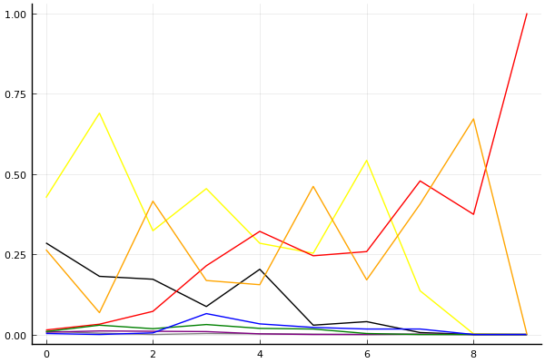
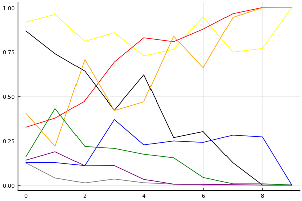
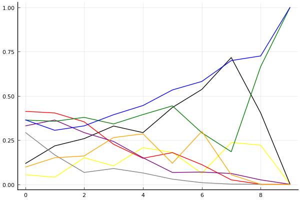

2019 시즌 1 개인전 32강 B조

## 경기 결과

| 트랙 | 유영혁 | 이재혁 | 황인호 | 김경훈 | 김이준 | 한승철 | 최영훈 | 신종민 |
|:---|---:|---:|---:|---:|---:|---:|---:|---:|
| [신화 신들의 세계](../shinsegye) | 7 | 0 | 5 | -1 | 4 | 10 | 3 | 1 |
| [도검 구름의 협곡](../hyupgog) | -1 | 4 | 7 | 0 | 3 | 1 | 5 | 10 |
| [대저택 은밀한 지하실](../jeotaek) | 4 | -1 | 7 | 5 | 3 | 1 | 10 | 0 |
| [신화 오딘의 궁전](../odin) | 3 | 10 | 7 | 1 | -1 | 4 | 0 | 5 |
| [월드 두바이 다운타운](../dubai) | 7 | -1 | 3 | 1 | 0 | 4 | 5 | 10 |
| [차이나 서안 병마용](../byeongma) | 10 | 7 | 5 | 0 | 4 | -1 | 3 | 1 |
| [팩토리 미완성 5구역](../district5) | 0 | 3 | 7 | -1 | 4 | 1 | 5 | 10 |
| [WKC 투어링 랠리](../rally) | 3 | -1 | 7 | 4 | 0 | 5 | 1 | 10 |
| [노르테유 익스프레스](../noex) | 4 | 10 | 3 | 5 | -1 | 7 | 1 | 0 |
| __total__ |__37__ |__31__ |__51__ |__14__ |__16__ |__32__ |__33__ |__47__ |

## 시뮬레이션

### 1st 확률

x축: 트랙, y축: 확률
1번: 옐로우, 2번: 블랙, 3번: 레드, 4번: 화이트(회색), 5번: 퍼플, 6번: 그린, 7번: 블루, 8번: 오렌지

| 트랙 | 유영혁 | 이재혁 | 황인호 | 김경훈 | 김이준 | 한승철 | 최영훈 | 신종민 |
|:---|---:|---:|---:|---:|---:|---:|---:|---:|
| 초기 | 0.426 | 0.285 | 0.014 | 0.010 | 0.007 | 0.009 | 0.003 | 0.264 |
| 신화 신들의 세계 | 0.689 | 0.181 | 0.032 | 0.004 | 0.011 | 0.029 | 0.000 | 0.068 |
| 도검 구름의 협곡 | 0.323 | 0.172 | 0.072 | 0.000 | 0.010 | 0.018 | 0.005 | 0.415 |
| 대저택 은밀한 지하실 | 0.454 | 0.087 | 0.214 | 0.003 | 0.009 | 0.031 | 0.065 | 0.168 |
| 신화 오딘의 궁전 | 0.284 | 0.203 | 0.321 | 0.002 | 0.002 | 0.019 | 0.033 | 0.155 |
| 월드 두바이 다운타운 | 0.253 | 0.029 | 0.245 | 0.001 | 0.000 | 0.017 | 0.022 | 0.461 |
| 차이나 서안 병마용 | 0.542 | 0.040 | 0.258 | 0.000 | 0.000 | 0.003 | 0.017 | 0.170 |
| 팩토리 미완성 5구역 | 0.136 | 0.006 | 0.478 | 0.000 | 0.001 | 0.000 | 0.017 | 0.406 |
| WKC 투어링 랠리 | 0.002 | 0.000 | 0.374 | 0.000 | 0.000 | 0.000 | 0.000 | 0.671 |
| 노르테유 익스프레스 | 0.000 | 0.000 | 1.000 | 0.000 | 0.000 | 0.000 | 0.000 | 0.000 |

### Advance 확률

x축: 트랙, y축: 확률
1번: 옐로우, 2번: 블랙, 3번: 레드, 4번: 화이트(회색), 5번: 퍼플, 6번: 그린, 7번: 블루, 8번: 오렌지

| 트랙 | 유영혁 | 이재혁 | 황인호 | 김경훈 | 김이준 | 한승철 | 최영훈 | 신종민 |
|:---|---:|---:|---:|---:|---:|---:|---:|---:|
| 초기 | 0.917 | 0.869 | 0.326 | 0.126 | 0.140 | 0.157 | 0.127 | 0.408 |
| 신화 신들의 세계 | 0.961 | 0.739 | 0.378 | 0.040 | 0.188 | 0.432 | 0.127 | 0.219 |
| 도검 구름의 협곡 | 0.809 | 0.641 | 0.474 | 0.012 | 0.109 | 0.218 | 0.110 | 0.706 |
| 대저택 은밀한 지하실 | 0.858 | 0.422 | 0.692 | 0.034 | 0.110 | 0.207 | 0.370 | 0.421 |
| 신화 오딘의 궁전 | 0.727 | 0.620 | 0.829 | 0.013 | 0.032 | 0.174 | 0.227 | 0.470 |
| 월드 두바이 다운타운 | 0.764 | 0.268 | 0.807 | 0.005 | 0.005 | 0.154 | 0.249 | 0.838 |
| 차이나 서안 병마용 | 0.947 | 0.302 | 0.878 | 0.000 | 0.004 | 0.043 | 0.241 | 0.660 |
| 팩토리 미완성 5구역 | 0.748 | 0.126 | 0.965 | 0.000 | 0.002 | 0.007 | 0.282 | 0.944 |
| WKC 투어링 랠리 | 0.769 | 0.000 | 1.000 | 0.000 | 0.000 | 0.007 | 0.272 | 0.999 |
| 노르테유 익스프레스 | 1.000 | 0.000 | 1.000 | 0.000 | 0.000 | 0.000 | 0.000 | 1.000 |

### Repechage 확률

x축: 트랙, y축: 확률
1번: 옐로우, 2번: 블랙, 3번: 레드, 4번: 화이트(회색), 5번: 퍼플, 6번: 그린, 7번: 블루, 8번: 오렌지

| 트랙 | 유영혁 | 이재혁 | 황인호 | 김경훈 | 김이준 | 한승철 | 최영훈 | 신종민 |
|:---|---:|---:|---:|---:|---:|---:|---:|---:|
| 초기 | 0.073 | 0.109 | 0.426 | 0.311 | 0.333 | 0.347 | 0.344 | 0.087 |
| 신화 신들의 세계 | 0.035 | 0.200 | 0.384 | 0.157 | 0.376 | 0.388 | 0.289 | 0.170 |
| 도검 구름의 협곡 | 0.151 | 0.273 | 0.389 | 0.069 | 0.277 | 0.410 | 0.292 | 0.159 |
| 대저택 은밀한 지하실 | 0.110 | 0.339 | 0.236 | 0.091 | 0.261 | 0.326 | 0.389 | 0.221 |
| 신화 오딘의 궁전 | 0.220 | 0.284 | 0.153 | 0.060 | 0.143 | 0.415 | 0.454 | 0.286 |
| 월드 두바이 다운타운 | 0.200 | 0.416 | 0.179 | 0.026 | 0.057 | 0.455 | 0.536 | 0.130 |
| 차이나 서안 병마용 | 0.051 | 0.561 | 0.115 | 0.008 | 0.076 | 0.288 | 0.602 | 0.306 |
| 팩토리 미완성 5구역 | 0.248 | 0.706 | 0.035 | 0.001 | 0.068 | 0.191 | 0.677 | 0.055 |
| WKC 투어링 랠리 | 0.231 | 0.440 | 0.000 | 0.000 | 0.030 | 0.634 | 0.728 | 0.001 |
| 노르테유 익스프레스 | 0.000 | 0.000 | 0.000 | 0.000 | 0.000 | 1.000 | 1.000 | 0.000 |

## 랭킹 변동

### [전체 랭킹](../singles-full)

| 순위 | 변동 | 이름 | 점수 | 변동 | mu | 변동 | sigma | 변동 |
|---:|---:|:---:|---:|---:|---:|---:|---:|---:|
| 3 / 64 | +0 | [유영혁](../yuyeonghyeok) | 3301 | -54 | 3535 | -56 | 78 | -1 |
| 5 / 64 | -1 | [이재혁](../ijaehyeok) | 3215 | -65 | 3452 | -66 | 79 | -1 |
| 11 / 64 | +3 | [황인호](../hwanginho) | 3019 | +77 | 3266 | +69 | 82 | -3 |
| 17 / 64 | NaN | [신종민](../shinjongmin) | 2872 | +2872 | 3469 | +469 | 199 | -801 |
| 20 / 64 | +1 | [최영훈](../choiyeonghun) | 2828 | +63 | 3088 | +49 | 87 | -5 |
| 21 / 64 | +4 | [한승철](../hanseungcheol) | 2810 | +84 | 3104 | +53 | 98 | -10 |
| 27 / 64 | -1 | [김이준](../gimijun) | 2686 | +8 | 3005 | -39 | 106 | -16 |
| 29 / 64 | +0 | [김경훈](../gimgyeonghun) | 2627 | +47 | 2986 | -34 | 120 | -27 |

### 시즌 랭킹

| 순위 | 변동 | 이름 | 점수 | 변동 | mu | 변동 | sigma | 변동 |
|---:|---:|:---:|---:|---:|---:|---:|---:|---:|
| 2 / 16 | NaN | [황인호](../hwanginho) | 2651 | +2651 | 3257 | +257 | 202 | -798 |
| 3 / 16 | NaN | [신종민](../shinjongmin) | 2560 | +2560 | 3196 | +196 | 212 | -788 |
| 5 / 16 | NaN | [최영훈](../choiyeonghun) | 2339 | +2339 | 2941 | -59 | 200 | -800 |
| 6 / 16 | NaN | [유영혁](../yuyeonghyeok) | 2337 | +2337 | 2947 | -53 | 204 | -796 |
| 9 / 16 | NaN | [한승철](../hanseungcheol) | 2260 | +2260 | 2868 | -132 | 203 | -797 |
| 12 / 16 | -3 | [이재혁](../ijaehyeok) | 2139 | +2218 | 2772 | +491 | 211 | -576 |
| 13 / 16 | NaN | [김경훈](../gimgyeonghun) | 1994 | +1994 | 2610 | -390 | 206 | -794 |
| 16 / 16 | NaN | [김이준](../gimijun) | 1933 | +1933 | 2547 | -453 | 205 | -795 |

### 트랙 별 랭킹

#### [WKC 투어링 랠리](../rally)

| 순위 | 변동 | 이름 | 점수 | 변동 | mu | 변동 | sigma | 변동 |
|:---:|:---:|:---:|---:|---:|---:|---:|---:|---:|
| 4 / 20 | +0 | [유영혁](../yuyeonghyeok) | 2344 | +42 | 3061 | -14 | 239 | -19 |
| 5 / 20 | +6 | [황인호](../hwanginho) | 2279 | +546 | 3413 | +337 | 378 | -70 |
| 7 / 20 | NaN | [신종민](../shinjongmin) | 2182 | +2182 | 4193 | +1193 | 670 | -330 |
| 10 / 20 | NaN | [한승철](../hanseungcheol) | 1810 | +1810 | 3423 | +423 | 538 | -462 |
| 13 / 20 | -6 | [이재혁](../ijaehyeok) | 1754 | -286 | 2814 | -436 | 353 | -50 |
| 14 / 20 | +0 | [최영훈](../choiyeonghun) | 1703 | +205 | 2793 | -36 | 363 | -80 |
| 17 / 20 | NaN | [김경훈](../gimgyeonghun) | 1626 | +1626 | 3209 | +209 | 528 | -472 |
| 19 / 20 | NaN | [김이준](../gimijun) | 960 | +960 | 2572 | -428 | 537 | -463 |

#### [노르테유 익스프레스](../noex)

| 순위 | 변동 | 이름 | 점수 | 변동 | mu | 변동 | sigma | 변동 |
|:---:|:---:|:---:|---:|---:|---:|---:|---:|---:|
| 3 / 63 | +0 | [이재혁](../ijaehyeok) | 3576 | +88 | 4187 | +65 | 204 | -8 |
| 4 / 63 | +0 | [유영혁](../yuyeonghyeok) | 3262 | -2 | 3807 | -29 | 182 | -9 |
| 10 / 63 | +3 | [한승철](../hanseungcheol) | 2742 | +283 | 3554 | +191 | 271 | -31 |
| 11 / 63 | +3 | [김경훈](../gimgyeonghun) | 2727 | +297 | 3781 | +43 | 351 | -85 |
| 14 / 63 | +1 | [최영훈](../choiyeonghun) | 2350 | +55 | 3307 | -110 | 319 | -55 |
| 15 / 63 | +5 | [황인호](../hwanginho) | 2327 | +176 | 3150 | +73 | 274 | -34 |
| 17 / 63 | -6 | [김이준](../gimijun) | 2257 | -245 | 3215 | -359 | 319 | -38 |
| 44 / 63 | NaN | [신종민](../shinjongmin) | 1270 | +1270 | 2856 | -144 | 528 | -472 |

#### [대저택 은밀한 지하실](../jeotaek)

| 순위 | 변동 | 이름 | 점수 | 변동 | mu | 변동 | sigma | 변동 |
|:---:|:---:|:---:|---:|---:|---:|---:|---:|---:|
| 1 / 63 | +0 | [유영혁](../yuyeonghyeok) | 3618 | -93 | 4226 | -133 | 203 | -13 |
| 4 / 63 | -1 | [이재혁](../ijaehyeok) | 2999 | -147 | 3606 | -178 | 202 | -10 |
| 9 / 63 | +6 | [최영훈](../choiyeonghun) | 2717 | +414 | 3677 | +288 | 320 | -42 |
| 12 / 63 | +1 | [황인호](../hwanginho) | 2567 | +231 | 3304 | +161 | 245 | -23 |
| 16 / 63 | +1 | [한승철](../hanseungcheol) | 2263 | +99 | 3099 | -11 | 279 | -37 |
| 18 / 63 | +8 | [김이준](../gimijun) | 2211 | +238 | 3128 | +79 | 305 | -53 |
| 20 / 63 | +16 | [김경훈](../gimgyeonghun) | 2139 | +601 | 3165 | +356 | 342 | -82 |
| 42 / 63 | NaN | [신종민](../shinjongmin) | 1345 | +1345 | 2881 | -119 | 512 | -488 |

#### [도검 구름의 협곡](../hyupgog)

| 순위 | 변동 | 이름 | 점수 | 변동 | mu | 변동 | sigma | 변동 |
|:---:|:---:|:---:|---:|---:|---:|---:|---:|---:|
| 3 / 20 | NaN | [신종민](../shinjongmin) | 2172 | +2172 | 4244 | +1244 | 691 | -309 |
| 4 / 20 | +3 | [최영훈](../choiyeonghun) | 1990 | +627 | 3337 | +201 | 449 | -142 |
| 5 / 20 | NaN | [황인호](../hwanginho) | 1939 | +1939 | 3728 | +728 | 596 | -404 |
| 7 / 20 | -4 | [유영혁](../yuyeonghyeok) | 1771 | -562 | 3005 | -808 | 411 | -82 |
| 9 / 20 | +1 | [이재혁](../ijaehyeok) | 1537 | +742 | 2767 | +412 | 410 | -110 |
| 11 / 20 | NaN | [김이준](../gimijun) | 1314 | +1314 | 2938 | -62 | 541 | -459 |
| 12 / 20 | NaN | [한승철](../hanseungcheol) | 1118 | +1118 | 2754 | -246 | 546 | -454 |
| 15 / 20 | NaN | [김경훈](../gimgyeonghun) | 900 | +900 | 2559 | -441 | 553 | -447 |

#### [신화 신들의 세계](../shinsegye)

| 순위 | 변동 | 이름 | 점수 | 변동 | mu | 변동 | sigma | 변동 |
|:---:|:---:|:---:|---:|---:|---:|---:|---:|---:|
| 1 / 16 | NaN | [한승철](../hanseungcheol) | 2161 | +2161 | 4274 | +1274 | 704 | -296 |
| 3 / 16 | NaN | [유영혁](../yuyeonghyeok) | 1887 | +1887 | 3763 | +763 | 625 | -375 |
| 5 / 16 | NaN | [황인호](../hwanginho) | 1622 | +1622 | 3423 | +423 | 600 | -400 |
| 7 / 16 | NaN | [김이준](../gimijun) | 1363 | +1363 | 3137 | +137 | 591 | -409 |
| 10 / 16 | NaN | [최영훈](../choiyeonghun) | 1090 | +1090 | 2863 | -137 | 591 | -409 |
| 11 / 16 | NaN | [신종민](../shinjongmin) | 776 | +776 | 2577 | -423 | 600 | -400 |
| 13 / 16 | NaN | [이재혁](../ijaehyeok) | 361 | +361 | 2237 | -763 | 625 | -375 |
| 15 / 16 | NaN | [김경훈](../gimgyeonghun) | -388 | -388 | 1726 | -1274 | 704 | -296 |

#### [신화 오딘의 궁전](../odin)

| 순위 | 변동 | 이름 | 점수 | 변동 | mu | 변동 | sigma | 변동 |
|:---:|:---:|:---:|---:|---:|---:|---:|---:|---:|
| 1 / 8 | NaN | [이재혁](../ijaehyeok) | 2161 | +2161 | 4274 | +1274 | 704 | -296 |
| 2 / 8 | NaN | [황인호](../hwanginho) | 1887 | +1887 | 3763 | +763 | 625 | -375 |
| 3 / 8 | NaN | [신종민](../shinjongmin) | 1622 | +1622 | 3423 | +423 | 600 | -400 |
| 4 / 8 | NaN | [한승철](../hanseungcheol) | 1363 | +1363 | 3137 | +137 | 591 | -409 |
| 5 / 8 | NaN | [유영혁](../yuyeonghyeok) | 1090 | +1090 | 2863 | -137 | 591 | -409 |
| 6 / 8 | NaN | [김경훈](../gimgyeonghun) | 776 | +776 | 2577 | -423 | 600 | -400 |
| 7 / 8 | NaN | [최영훈](../choiyeonghun) | 361 | +361 | 2237 | -763 | 625 | -375 |
| 8 / 8 | NaN | [김이준](../gimijun) | -388 | -388 | 1726 | -1274 | 704 | -296 |

#### [월드 두바이 다운타운](../dubai)

| 순위 | 변동 | 이름 | 점수 | 변동 | mu | 변동 | sigma | 변동 |
|:---:|:---:|:---:|---:|---:|---:|---:|---:|---:|
| 3 / 39 | +1 | [유영혁](../yuyeonghyeok) | 2704 | +101 | 3351 | +68 | 216 | -11 |
| 8 / 39 | +0 | [최영훈](../choiyeonghun) | 2359 | +157 | 3282 | +31 | 308 | -42 |
| 14 / 39 | NaN | [신종민](../shinjongmin) | 2083 | +2083 | 4100 | +1100 | 672 | -328 |
| 19 / 39 | -3 | [이재혁](../ijaehyeok) | 1667 | -225 | 2595 | -316 | 309 | -30 |
| 21 / 39 | NaN | [한승철](../hanseungcheol) | 1442 | +1442 | 3029 | +29 | 529 | -471 |
| 25 / 39 | +2 | [황인호](../hwanginho) | 1335 | +488 | 2461 | +229 | 376 | -87 |
| 29 / 39 | NaN | [김경훈](../gimgyeonghun) | 989 | +989 | 2592 | -408 | 534 | -466 |
| 35 / 39 | NaN | [김이준](../gimijun) | 751 | +751 | 2380 | -620 | 543 | -457 |

#### [차이나 서안 병마용](../byeongma)

| 순위 | 변동 | 이름 | 점수 | 변동 | mu | 변동 | sigma | 변동 |
|:---:|:---:|:---:|---:|---:|---:|---:|---:|---:|
| 2 / 50 | +0 | [유영혁](../yuyeonghyeok) | 2851 | +81 | 3363 | +65 | 171 | -5 |
| 5 / 50 | +0 | [황인호](../hwanginho) | 2669 | +39 | 3308 | -6 | 213 | -15 |
| 6 / 50 | +3 | [이재혁](../ijaehyeok) | 2655 | +70 | 3189 | +46 | 178 | -8 |
| 20 / 50 | +4 | [최영훈](../choiyeonghun) | 1967 | +132 | 2900 | -33 | 311 | -55 |
| 24 / 50 | -5 | [한승철](../hanseungcheol) | 1831 | -184 | 2728 | -283 | 299 | -33 |
| 25 / 50 | +8 | [김이준](../gimijun) | 1814 | +305 | 2718 | +155 | 301 | -50 |
| 28 / 50 | -1 | [김경훈](../gimgyeonghun) | 1735 | -41 | 2780 | -263 | 348 | -74 |
| 38 / 50 | NaN | [신종민](../shinjongmin) | 1184 | +1184 | 2706 | -294 | 507 | -493 |

#### [팩토리 미완성 5구역](../district5)

| 순위 | 변동 | 이름 | 점수 | 변동 | mu | 변동 | sigma | 변동 |
|:---:|:---:|:---:|---:|---:|---:|---:|---:|---:|
| 2 / 63 | +0 | [이재혁](../ijaehyeok) | 3195 | -36 | 3767 | -69 | 191 | -11 |
| 4 / 63 | -1 | [유영혁](../yuyeonghyeok) | 3047 | -88 | 3645 | -123 | 199 | -12 |
| 11 / 63 | +9 | [황인호](../hwanginho) | 2460 | +317 | 3269 | +227 | 270 | -30 |
| 14 / 63 | +5 | [김이준](../gimijun) | 2398 | +248 | 3287 | +99 | 296 | -50 |
| 15 / 63 | +8 | [최영훈](../choiyeonghun) | 2389 | +328 | 3281 | +184 | 297 | -48 |
| 20 / 63 | NaN | [신종민](../shinjongmin) | 2292 | +2292 | 4231 | +1231 | 646 | -354 |
| 23 / 63 | +3 | [한승철](../hanseungcheol) | 2201 | +173 | 3092 | +27 | 297 | -49 |
| 30 / 63 | -8 | [김경훈](../gimgyeonghun) | 1901 | -166 | 3018 | -366 | 372 | -67 |
