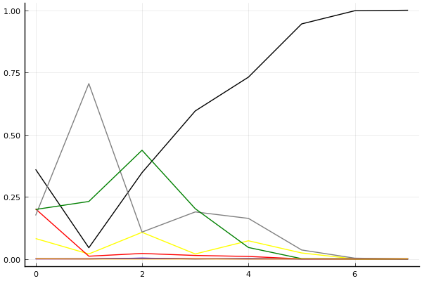
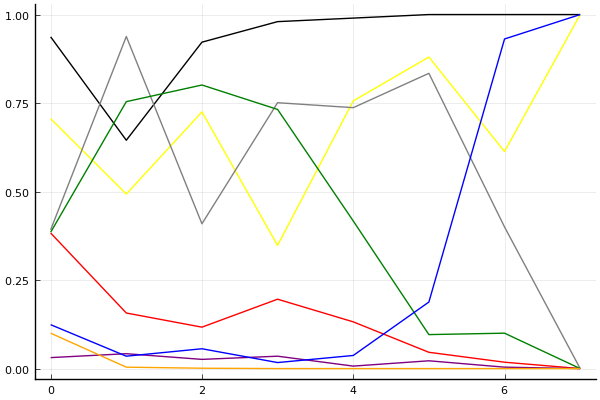
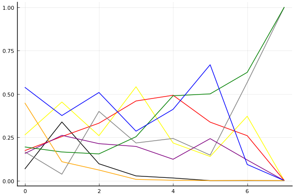

2019 시즌 1 개인전 32강 C조

## 경기 결과

| 트랙 | 정승하 | 문호준 | 윤정현 | 김기수 | 이태경 | 김지민 | 송용준 | 박지호 |
|:---|---:|---:|---:|---:|---:|---:|---:|---:|
| [신화 신들의 세계](../shinsegye) | 4 | 0 | 1 | 10 | 5 | 7 | 3 | -1 |
| [차이나 서안 병마용](../byeongma) | 7 | 10 | 3 | 0 | 1 | 5 | 4 | -1 |
| [대저택 은밀한 지하실](../jeotaek) | 0 | 10 | 5 | 7 | 3 | 4 | 1 | -1 |
| [노르테유 익스프레스](../noex) | 10 | 7 | 3 | 4 | 0 | 1 | 5 | -1 |
| [신화 오딘의 궁전](../odin) | 3 | 10 | 1 | 4 | 5 | -1 | 7 | 0 |
| [도검 구름의 협곡](../hyupgog) | 0 | 7 | 3 | -1 | 1 | 4 | 10 | 5 |
| [월드 두바이 다운타운](../dubai) | 10 | 7 | 5 | 3 | 1 | 4 | 0 | -1 |
| __total__ |__34__ |__51__ |__21__ |__27__ |__16__ |__24__ |__30__ |__0__ |

## 시뮬레이션

### 1st 확률

x축: 트랙, y축: 확률
1번: 옐로우, 2번: 블랙, 3번: 레드, 4번: 화이트(회색), 5번: 퍼플, 6번: 그린, 7번: 블루, 8번: 오렌지

| 트랙 | 정승하 | 문호준 | 윤정현 | 김기수 | 이태경 | 김지민 | 송용준 | 박지호 |
|:---|---:|---:|---:|---:|---:|---:|---:|---:|
| 초기 | 0.082 | 0.360 | 0.201 | 0.175 | 0.000 | 0.199 | 0.001 | 0.001 |
| 신화 신들의 세계 | 0.020 | 0.045 | 0.011 | 0.705 | 0.000 | 0.231 | 0.001 | 0.000 |
| 차이나 서안 병마용 | 0.107 | 0.347 | 0.022 | 0.108 | 0.003 | 0.437 | 0.003 | 0.000 |
| 대저택 은밀한 지하실 | 0.020 | 0.595 | 0.014 | 0.189 | 0.001 | 0.202 | 0.000 | 0.000 |
| 노르테유 익스프레스 | 0.073 | 0.731 | 0.010 | 0.163 | 0.000 | 0.046 | 0.002 | 0.000 |
| 신화 오딘의 궁전 | 0.024 | 0.945 | 0.000 | 0.036 | 0.000 | 0.001 | 0.000 | 0.000 |
| 도검 구름의 협곡 | 0.000 | 0.998 | 0.000 | 0.003 | 0.000 | 0.000 | 0.001 | 0.000 |
| 월드 두바이 다운타운 | 0.000 | 1.000 | 0.000 | 0.000 | 0.000 | 0.000 | 0.000 | 0.000 |

### Advance 확률

x축: 트랙, y축: 확률
1번: 옐로우, 2번: 블랙, 3번: 레드, 4번: 화이트(회색), 5번: 퍼플, 6번: 그린, 7번: 블루, 8번: 오렌지

| 트랙 | 정승하 | 문호준 | 윤정현 | 김기수 | 이태경 | 김지민 | 송용준 | 박지호 |
|:---|---:|---:|---:|---:|---:|---:|---:|---:|
| 초기 | 0.706 | 0.937 | 0.383 | 0.392 | 0.031 | 0.385 | 0.124 | 0.100 |
| 신화 신들의 세계 | 0.493 | 0.645 | 0.157 | 0.938 | 0.042 | 0.754 | 0.035 | 0.004 |
| 차이나 서안 병마용 | 0.725 | 0.922 | 0.117 | 0.409 | 0.026 | 0.801 | 0.056 | 0.001 |
| 대저택 은밀한 지하실 | 0.348 | 0.980 | 0.196 | 0.751 | 0.035 | 0.732 | 0.017 | 0.000 |
| 노르테유 익스프레스 | 0.756 | 0.990 | 0.132 | 0.737 | 0.007 | 0.417 | 0.037 | 0.000 |
| 신화 오딘의 궁전 | 0.880 | 1.000 | 0.046 | 0.834 | 0.022 | 0.096 | 0.188 | 0.000 |
| 도검 구름의 협곡 | 0.613 | 1.000 | 0.018 | 0.400 | 0.004 | 0.100 | 0.931 | 0.000 |
| 월드 두바이 다운타운 | 1.000 | 1.000 | 0.000 | 0.000 | 0.000 | 0.000 | 1.000 | 0.000 |

### Repechage 확률

x축: 트랙, y축: 확률
1번: 옐로우, 2번: 블랙, 3번: 레드, 4번: 화이트(회색), 5번: 퍼플, 6번: 그린, 7번: 블루, 8번: 오렌지

| 트랙 | 정승하 | 문호준 | 윤정현 | 김기수 | 이태경 | 김지민 | 송용준 | 박지호 |
|:---|---:|---:|---:|---:|---:|---:|---:|---:|
| 초기 | 0.268 | 0.062 | 0.163 | 0.194 | 0.160 | 0.166 | 0.555 | 0.443 |
| 신화 신들의 세계 | 0.461 | 0.325 | 0.256 | 0.039 | 0.275 | 0.168 | 0.369 | 0.115 |
| 차이나 서안 병마용 | 0.264 | 0.077 | 0.320 | 0.394 | 0.212 | 0.168 | 0.509 | 0.054 |
| 대저택 은밀한 지하실 | 0.587 | 0.020 | 0.448 | 0.216 | 0.222 | 0.229 | 0.280 | 0.008 |
| 노르테유 익스프레스 | 0.240 | 0.010 | 0.479 | 0.237 | 0.101 | 0.503 | 0.427 | 0.002 |
| 신화 오딘의 궁전 | 0.116 | 0.000 | 0.373 | 0.160 | 0.206 | 0.513 | 0.666 | 0.000 |
| 도검 구름의 협곡 | 0.377 | 0.000 | 0.275 | 0.552 | 0.099 | 0.682 | 0.069 | 0.000 |
| 월드 두바이 다운타운 | 0.000 | 0.000 | 0.000 | 1.000 | 0.000 | 1.000 | 0.000 | 0.000 |

## 랭킹 변동

### [전체 랭킹](../singles-full)

| 순위 | 변동 | 이름 | 점수 | 변동 | mu | 변동 | sigma | 변동 |
|---:|---:|:---:|---:|---:|---:|---:|---:|---:|
| 1 / 67 | +0 | [문호준](../munhojun) | 3448 | +14 | 3688 | +14 | 80 | -0 |
| 9 / 67 | +0 | [정승하](../jeongseungha) | 3140 | +5 | 3400 | -3 | 87 | -3 |
| 27 / 67 | +3 | [송용준](../songyongjun) | 2721 | +134 | 3048 | +98 | 109 | -12 |
| 34 / 67 | NaN | [윤정현](../yunjeonghyeon) | 2512 | +2512 | 3150 | +150 | 213 | -787 |
| 35 / 67 | NaN | [김지민](../gimjimin) | 2464 | +2464 | 3126 | +126 | 221 | -779 |
| 37 / 67 | NaN | [김기수](../gimgisu) | 2453 | +2453 | 3132 | +132 | 227 | -773 |
| 41 / 67 | -7 | [박지호](../bakjiho) | 2411 | -87 | 2752 | -120 | 114 | -11 |
| 45 / 67 | +16 | [이태경](../itaegyoeng) | 2354 | +675 | 2876 | +356 | 174 | -106 |

### 시즌 랭킹

| 순위 | 변동 | 이름 | 점수 | 변동 | mu | 변동 | sigma | 변동 |
|---:|---:|:---:|---:|---:|---:|---:|---:|---:|
| 1 / 24 | NaN | [문호준](../munhojun) | 2988 | +2988 | 3750 | +750 | 254 | -746 |
| 5 / 24 | NaN | [정승하](../jeongseungha) | 2526 | +2526 | 3244 | +244 | 240 | -760 |
| 6 / 24 | NaN | [송용준](../songyongjun) | 2500 | +2500 | 3208 | +208 | 236 | -764 |
| 11 / 24 | NaN | [윤정현](../yunjeonghyeon) | 2310 | +2310 | 2992 | -8 | 227 | -773 |
| 13 / 24 | NaN | [김기수](../gimgisu) | 2275 | +2275 | 2987 | -13 | 237 | -763 |
| 15 / 24 | NaN | [김지민](../gimjimin) | 2236 | +2236 | 2934 | -66 | 233 | -767 |
| 18 / 24 | NaN | [이태경](../itaegyoeng) | 2155 | +2155 | 2848 | -152 | 231 | -769 |
| 24 / 24 | NaN | [박지호](../bakjiho) | 1292 | +1292 | 2205 | -795 | 305 | -695 |

### 트랙 별 랭킹

#### [노르테유 익스프레스](../noex)

| 순위 | 변동 | 이름 | 점수 | 변동 | mu | 변동 | sigma | 변동 |
|:---:|:---:|:---:|---:|---:|---:|---:|---:|---:|
| 1 / 66 | +0 | [문호준](../munhojun) | 3692 | -21 | 4341 | -54 | 216 | -11 |
| 6 / 66 | +2 | [정승하](../jeongseungha) | 3094 | +247 | 3916 | +186 | 274 | -20 |
| 14 / 66 | +6 | [송용준](../songyongjun) | 2402 | +202 | 3328 | +99 | 309 | -35 |
| 39 / 66 | NaN | [김기수](../gimgisu) | 1406 | +1406 | 3101 | +101 | 565 | -435 |
| 48 / 66 | NaN | [윤정현](../yunjeonghyeon) | 1038 | +1038 | 2778 | -222 | 580 | -420 |
| 54 / 66 | NaN | [김지민](../gimjimin) | 632 | +632 | 2421 | -579 | 596 | -404 |
| 61 / 66 | -2 | [이태경](../itaegyoeng) | 142 | +392 | 1753 | -124 | 537 | -172 |
| 66 / 66 | -5 | [박지호](../bakjiho) | -512 | -124 | 1230 | -495 | 581 | -124 |

#### [대저택 은밀한 지하실](../jeotaek)

| 순위 | 변동 | 이름 | 점수 | 변동 | mu | 변동 | sigma | 변동 |
|:---:|:---:|:---:|---:|---:|---:|---:|---:|---:|
| 8 / 66 | +3 | [문호준](../munhojun) | 2777 | +161 | 3388 | +136 | 204 | -8 |
| 9 / 66 | -3 | [정승하](../jeongseungha) | 2774 | -127 | 3462 | -175 | 229 | -16 |
| 21 / 66 | +7 | [이태경](../itaegyoeng) | 2124 | +182 | 3426 | -359 | 434 | -180 |
| 24 / 66 | NaN | [김기수](../gimgisu) | 2084 | +2084 | 3682 | +682 | 533 | -467 |
| 30 / 66 | NaN | [윤정현](../yunjeonghyeon) | 1908 | +1908 | 3487 | +487 | 526 | -474 |
| 35 / 66 | NaN | [김지민](../gimjimin) | 1750 | +1750 | 3313 | +313 | 521 | -479 |
| 38 / 66 | +6 | [송용준](../songyongjun) | 1656 | +406 | 2724 | +166 | 356 | -80 |
| 48 / 66 | -8 | [박지호](../bakjiho) | 1199 | -163 | 2609 | -527 | 470 | -121 |

#### [도검 구름의 협곡](../hyupgog)

| 순위 | 변동 | 이름 | 점수 | 변동 | mu | 변동 | sigma | 변동 |
|:---:|:---:|:---:|---:|---:|---:|---:|---:|---:|
| 2 / 26 | +0 | [문호준](../munhojun) | 2739 | +265 | 4027 | +49 | 429 | -72 |
| 3 / 26 | NaN | [송용준](../songyongjun) | 2307 | +2307 | 4347 | +1347 | 680 | -320 |
| 9 / 26 | NaN | [박지호](../bakjiho) | 1683 | +1683 | 3459 | +459 | 592 | -408 |
| 13 / 26 | NaN | [김지민](../gimjimin) | 1353 | +1353 | 3124 | +124 | 590 | -410 |
| 18 / 26 | NaN | [윤정현](../yunjeonghyeon) | 1024 | +1024 | 2805 | -195 | 593 | -407 |
| 21 / 26 | NaN | [이태경](../itaegyoeng) | 650 | +650 | 2458 | -542 | 603 | -397 |
| 24 / 26 | -4 | [정승하](../jeongseungha) | 135 | +522 | 1756 | +30 | 540 | -164 |
| 26 / 26 | NaN | [김기수](../gimgisu) | -514 | -514 | 1553 | -1447 | 689 | -311 |

#### [신화 신들의 세계](../shinsegye)

| 순위 | 변동 | 이름 | 점수 | 변동 | mu | 변동 | sigma | 변동 |
|:---:|:---:|:---:|---:|---:|---:|---:|---:|---:|
| 3 / 24 | NaN | [김기수](../gimgisu) | 2161 | +2161 | 4274 | +1274 | 704 | -296 |
| 6 / 24 | NaN | [김지민](../gimjimin) | 1887 | +1887 | 3763 | +763 | 625 | -375 |
| 8 / 24 | NaN | [이태경](../itaegyoeng) | 1622 | +1622 | 3423 | +423 | 600 | -400 |
| 10 / 24 | NaN | [정승하](../jeongseungha) | 1363 | +1363 | 3137 | +137 | 591 | -409 |
| 14 / 24 | NaN | [송용준](../songyongjun) | 1090 | +1090 | 2863 | -137 | 591 | -409 |
| 18 / 24 | NaN | [윤정현](../yunjeonghyeon) | 776 | +776 | 2577 | -423 | 600 | -400 |
| 21 / 24 | NaN | [문호준](../munhojun) | 361 | +361 | 2237 | -763 | 625 | -375 |
| 22 / 24 | NaN | [박지호](../bakjiho) | -388 | -388 | 1726 | -1274 | 704 | -296 |

#### [신화 오딘의 궁전](../odin)

| 순위 | 변동 | 이름 | 점수 | 변동 | mu | 변동 | sigma | 변동 |
|:---:|:---:|:---:|---:|---:|---:|---:|---:|---:|
| 2 / 16 | NaN | [문호준](../munhojun) | 2161 | +2161 | 4274 | +1274 | 704 | -296 |
| 4 / 16 | NaN | [송용준](../songyongjun) | 1887 | +1887 | 3763 | +763 | 625 | -375 |
| 6 / 16 | NaN | [이태경](../itaegyoeng) | 1622 | +1622 | 3423 | +423 | 600 | -400 |
| 8 / 16 | NaN | [김기수](../gimgisu) | 1363 | +1363 | 3137 | +137 | 591 | -409 |
| 9 / 16 | NaN | [정승하](../jeongseungha) | 1090 | +1090 | 2863 | -137 | 591 | -409 |
| 12 / 16 | NaN | [윤정현](../yunjeonghyeon) | 776 | +776 | 2577 | -423 | 600 | -400 |
| 13 / 16 | NaN | [박지호](../bakjiho) | 361 | +361 | 2237 | -763 | 625 | -375 |
| 16 / 16 | NaN | [김지민](../gimjimin) | -388 | -388 | 1726 | -1274 | 704 | -296 |

#### [월드 두바이 다운타운](../dubai)

| 순위 | 변동 | 이름 | 점수 | 변동 | mu | 변동 | sigma | 변동 |
|:---:|:---:|:---:|---:|---:|---:|---:|---:|---:|
| 1 / 45 | +0 | [문호준](../munhojun) | 2920 | +127 | 3754 | +69 | 278 | -19 |
| 9 / 45 | NaN | [정승하](../jeongseungha) | 2262 | +2262 | 4266 | +1266 | 668 | -332 |
| 20 / 45 | NaN | [윤정현](../yunjeonghyeon) | 1753 | +1753 | 3444 | +444 | 564 | -436 |
| 23 / 45 | NaN | [김지민](../gimjimin) | 1474 | +1474 | 3169 | +169 | 565 | -435 |
| 29 / 45 | NaN | [김기수](../gimgisu) | 1203 | +1203 | 2907 | -93 | 568 | -432 |
| 33 / 45 | NaN | [이태경](../itaegyoeng) | 914 | +914 | 2637 | -363 | 574 | -426 |
| 35 / 45 | -7 | [박지호](../bakjiho) | 826 | -171 | 2042 | -317 | 405 | -49 |
| 41 / 45 | NaN | [송용준](../songyongjun) | 574 | +574 | 2329 | -671 | 585 | -415 |

#### [차이나 서안 병마용](../byeongma)

| 순위 | 변동 | 이름 | 점수 | 변동 | mu | 변동 | sigma | 변동 |
|:---:|:---:|:---:|---:|---:|---:|---:|---:|---:|
| 1 / 53 | +0 | [문호준](../munhojun) | 3152 | +64 | 3713 | +49 | 187 | -5 |
| 10 / 53 | +2 | [정승하](../jeongseungha) | 2590 | +103 | 3264 | +62 | 225 | -13 |
| 18 / 53 | +4 | [송용준](../songyongjun) | 2031 | +87 | 2933 | -23 | 301 | -37 |
| 32 / 53 | NaN | [김지민](../gimjimin) | 1565 | +1565 | 3163 | +163 | 533 | -467 |
| 41 / 53 | NaN | [윤정현](../yunjeonghyeon) | 995 | +995 | 2630 | -370 | 545 | -455 |
| 45 / 53 | -3 | [박지호](../bakjiho) | 559 | -216 | 1806 | -405 | 416 | -63 |
| 47 / 53 | +2 | [이태경](../itaegyoeng) | 512 | +940 | 1967 | +332 | 485 | -203 |
| 50 / 53 | NaN | [김기수](../gimgisu) | 352 | +352 | 2055 | -945 | 568 | -432 |
