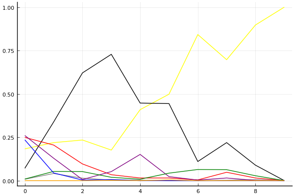
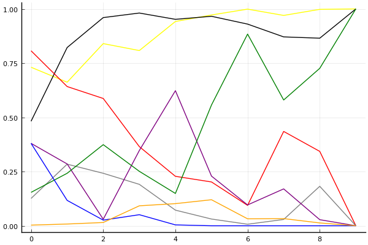
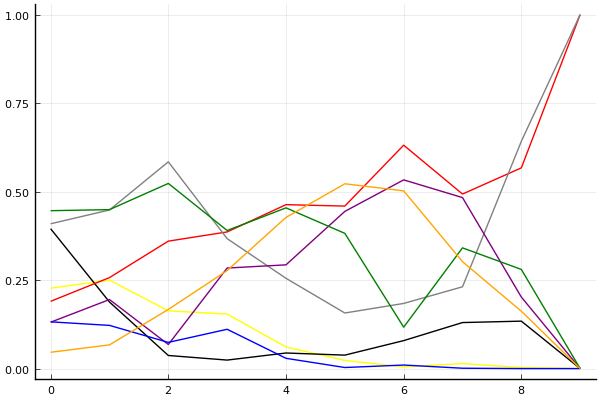

2019 시즌 1 개인전 32강 D조

## 경기 결과

| 트랙 | 유창현 | 김승래 | 김승태 | 임재원 | 양민규 | 배성빈 | 현록빈 | 정승민 |
|:---|---:|---:|---:|---:|---:|---:|---:|---:|
| [신화 신들의 세계](../shinsegye) | 1 | 10 | -1 | 7 | 3 | 5 | 0 | 4 |
| [신화 오딘의 궁전](../odin) | 7 | 10 | 3 | 1 | -1 | 5 | 0 | 4 |
| [월드 두바이 다운타운](../dubai) | 3 | 5 | -1 | 1 | 10 | 0 | 4 | 7 |
| [대저택 은밀한 지하실](../jeotaek) | 10 | 1 | 4 | 0 | 7 | 3 | -1 | 5 |
| [도검 구름의 협곡](../hyupgog) | 7 | 4 | 5 | 1 | 0 | 10 | -1 | 3 |
| [차이나 서안 병마용](../byeongma) | 10 | 0 | 4 | 3 | 1 | 7 | 5 | -1 |
| [WKC 투어링 랠리](../rally) | -1 | 3 | 10 | 7 | 5 | 1 | 0 | 4 |
| [팩토리 미완성 5구역](../district5) | 7 | 3 | 5 | 10 | 0 | 4 | -1 | 1 |
| [노르테유 익스프레스](../noex) | 10 | 1 | 7 | 4 | 0 | 3 | -1 | 5 |
| __total__ |__54__ |__37__ |__36__ |__34__ |__25__ |__38__ |__5__ |__32__ |

## 시뮬레이션

### 1st 확률

x축: 트랙, y축: 확률
1번: 옐로우, 2번: 블랙, 3번: 레드, 4번: 화이트(회색), 5번: 퍼플, 6번: 그린, 7번: 블루, 8번: 오렌지

| 트랙 | 유창현 | 김승래 | 김승태 | 임재원 | 양민규 | 배성빈 | 현록빈 | 정승민 |
|:---|---:|---:|---:|---:|---:|---:|---:|---:|
| 초기 | 0.183 | 0.071 | 0.249 | 0.008 | 0.260 | 0.009 | 0.235 | 0.000 |
| 신화 신들의 세계 | 0.219 | 0.338 | 0.205 | 0.041 | 0.129 | 0.053 | 0.044 | 0.000 |
| 신화 오딘의 궁전 | 0.234 | 0.621 | 0.096 | 0.014 | 0.006 | 0.052 | 0.003 | 0.000 |
| 월드 두바이 다운타운 | 0.176 | 0.728 | 0.034 | 0.003 | 0.052 | 0.019 | 0.006 | 0.001 |
| 대저택 은밀한 지하실 | 0.409 | 0.447 | 0.015 | 0.003 | 0.151 | 0.008 | 0.000 | 0.000 |
| 도검 구름의 협곡 | 0.498 | 0.444 | 0.015 | 0.000 | 0.023 | 0.043 | 0.000 | 0.004 |
| 차이나 서안 병마용 | 0.842 | 0.110 | 0.004 | 0.000 | 0.003 | 0.064 | 0.000 | 0.000 |
| WKC 투어링 랠리 | 0.697 | 0.219 | 0.048 | 0.002 | 0.015 | 0.063 | 0.000 | 0.000 |
| 팩토리 미완성 5구역 | 0.897 | 0.089 | 0.015 | 0.005 | 0.001 | 0.028 | 0.000 | 0.000 |
| 노르테유 익스프레스 | 1.000 | 0.000 | 0.000 | 0.000 | 0.000 | 0.000 | 0.000 | 0.000 |

### Advance 확률

x축: 트랙, y축: 확률
1번: 옐로우, 2번: 블랙, 3번: 레드, 4번: 화이트(회색), 5번: 퍼플, 6번: 그린, 7번: 블루, 8번: 오렌지

| 트랙 | 유창현 | 김승래 | 김승태 | 임재원 | 양민규 | 배성빈 | 현록빈 | 정승민 |
|:---|---:|---:|---:|---:|---:|---:|---:|---:|
| 초기 | 0.731 | 0.482 | 0.807 | 0.126 | 0.380 | 0.154 | 0.380 | 0.003 |
| 신화 신들의 세계 | 0.662 | 0.822 | 0.642 | 0.284 | 0.285 | 0.242 | 0.117 | 0.008 |
| 신화 오딘의 궁전 | 0.840 | 0.960 | 0.587 | 0.242 | 0.030 | 0.374 | 0.026 | 0.015 |
| 월드 두바이 다운타운 | 0.808 | 0.981 | 0.365 | 0.191 | 0.347 | 0.251 | 0.051 | 0.092 |
| 대저택 은밀한 지하실 | 0.942 | 0.952 | 0.228 | 0.072 | 0.623 | 0.149 | 0.004 | 0.102 |
| 도검 구름의 협곡 | 0.972 | 0.966 | 0.202 | 0.031 | 0.229 | 0.557 | 0.000 | 0.120 |
| 차이나 서안 병마용 | 0.999 | 0.930 | 0.094 | 0.007 | 0.096 | 0.884 | 0.000 | 0.032 |
| WKC 투어링 랠리 | 0.970 | 0.871 | 0.435 | 0.029 | 0.170 | 0.580 | 0.000 | 0.033 |
| 팩토리 미완성 5구역 | 0.998 | 0.865 | 0.343 | 0.182 | 0.028 | 0.726 | 0.000 | 0.013 |
| 노르테유 익스프레스 | 1.000 | 1.000 | 0.000 | 0.000 | 0.000 | 1.000 | 0.000 | 0.000 |

### Repechage 확률

x축: 트랙, y축: 확률
1번: 옐로우, 2번: 블랙, 3번: 레드, 4번: 화이트(회색), 5번: 퍼플, 6번: 그린, 7번: 블루, 8번: 오렌지

| 트랙 | 유창현 | 김승래 | 김승태 | 임재원 | 양민규 | 배성빈 | 현록빈 | 정승민 |
|:---|---:|---:|---:|---:|---:|---:|---:|---:|
| 초기 | 0.223 | 0.408 | 0.162 | 0.473 | 0.112 | 0.437 | 0.125 | 0.064 |
| 신화 신들의 세계 | 0.292 | 0.155 | 0.289 | 0.454 | 0.185 | 0.424 | 0.131 | 0.057 |
| 신화 오딘의 궁전 | 0.147 | 0.040 | 0.359 | 0.583 | 0.079 | 0.525 | 0.088 | 0.158 |
| 월드 두바이 다운타운 | 0.159 | 0.018 | 0.384 | 0.393 | 0.291 | 0.415 | 0.097 | 0.266 |
| 대저택 은밀한 지하실 | 0.052 | 0.046 | 0.487 | 0.264 | 0.265 | 0.462 | 0.027 | 0.416 |
| 도검 구름의 협곡 | 0.028 | 0.034 | 0.507 | 0.167 | 0.397 | 0.380 | 0.004 | 0.491 |
| 차이나 서안 병마용 | 0.001 | 0.067 | 0.629 | 0.190 | 0.567 | 0.115 | 0.013 | 0.505 |
| WKC 투어링 랠리 | 0.030 | 0.124 | 0.472 | 0.237 | 0.444 | 0.381 | 0.001 | 0.319 |
| 팩토리 미완성 5구역 | 0.002 | 0.130 | 0.578 | 0.639 | 0.176 | 0.261 | 0.000 | 0.181 |
| 노르테유 익스프레스 | 0.000 | 0.000 | 1.000 | 1.000 | 0.000 | 0.000 | 0.000 | 0.000 |

## 랭킹 변동

### [전체 랭킹](../singles-full)

| 순위 | 변동 | 이름 | 점수 | 변동 | mu | 변동 | sigma | 변동 |
|---:|---:|:---:|---:|---:|---:|---:|---:|---:|
| 6 / 69 | +1 | [유창현](../yuchanghyeon) | 3180 | +1 | 3412 | +2 | 77 | +0 |
| 8 / 69 | -4 | [김승태](../gimseungtae) | 3161 | -56 | 3397 | -59 | 79 | -1 |
| 14 / 69 | -1 | [김승래](../gimseungrae) | 2987 | -23 | 3235 | -30 | 83 | -2 |
| 23 / 69 | +1 | [임재원](../imjaewon) | 2775 | +35 | 3039 | +21 | 88 | -5 |
| 27 / 69 | +4 | [배성빈](../baeseongbin) | 2731 | +166 | 3098 | +71 | 122 | -32 |
| 43 / 69 | +10 | [정승민](../jeongseungmin) | 2397 | +272 | 2738 | +206 | 114 | -22 |
| 48 / 69 | NaN | [양민규](../yangmingyu) | 2278 | +2278 | 2867 | -133 | 196 | -804 |
| 64 / 69 | NaN | [현록빈](../hyeonrokbin) | 1855 | +1855 | 2471 | -529 | 206 | -794 |

### 시즌 랭킹

| 순위 | 변동 | 이름 | 점수 | 변동 | mu | 변동 | sigma | 변동 |
|---:|---:|:---:|---:|---:|---:|---:|---:|---:|
| 3 / 32 | NaN | [유창현](../yuchanghyeon) | 2798 | +2798 | 3446 | +446 | 216 | -784 |
| 6 / 32 | NaN | [김승태](../gimseungtae) | 2528 | +2528 | 3155 | +155 | 209 | -791 |
| 8 / 32 | NaN | [배성빈](../baeseongbin) | 2525 | +2525 | 3134 | +134 | 203 | -797 |
| 10 / 32 | NaN | [임재원](../imjaewon) | 2451 | +2451 | 3059 | +59 | 203 | -797 |
| 11 / 32 | NaN | [정승민](../jeongseungmin) | 2418 | +2418 | 3019 | +19 | 200 | -800 |
| 13 / 32 | NaN | [김승래](../gimseungrae) | 2374 | +2374 | 2995 | -5 | 207 | -793 |
| 23 / 32 | NaN | [양민규](../yangmingyu) | 2195 | +2195 | 2816 | -184 | 207 | -793 |
| 31 / 32 | NaN | [현록빈](../hyeonrokbin) | 1680 | +1680 | 2345 | -655 | 222 | -778 |

### 트랙 별 랭킹

#### [WKC 투어링 랠리](../rally)

| 순위 | 변동 | 이름 | 점수 | 변동 | mu | 변동 | sigma | 변동 |
|:---:|:---:|:---:|---:|---:|---:|---:|---:|---:|
| 1 / 26 | +1 | [김승태](../gimseungtae) | 2985 | +259 | 3921 | +191 | 312 | -22 |
| 10 / 26 | NaN | [임재원](../imjaewon) | 1999 | +1999 | 3712 | +712 | 571 | -429 |
| 14 / 26 | NaN | [양민규](../yangmingyu) | 1737 | +1737 | 3429 | +429 | 564 | -436 |
| 19 / 26 | -7 | [유창현](../yuchanghyeon) | 1625 | -136 | 2462 | -187 | 279 | -17 |
| 20 / 26 | NaN | [정승민](../jeongseungmin) | 1502 | +1502 | 3182 | +182 | 560 | -440 |
| 22 / 26 | NaN | [김승래](../gimseungrae) | 1272 | +1272 | 2947 | -53 | 559 | -441 |
| 23 / 26 | NaN | [배성빈](../baeseongbin) | 1030 | +1030 | 2709 | -291 | 560 | -440 |
| 25 / 26 | NaN | [현록빈](../hyeonrokbin) | 761 | +761 | 2451 | -549 | 563 | -437 |

#### [노르테유 익스프레스](../noex)

| 순위 | 변동 | 이름 | 점수 | 변동 | mu | 변동 | sigma | 변동 |
|:---:|:---:|:---:|---:|---:|---:|---:|---:|---:|
| 8 / 68 | +0 | [유창현](../yuchanghyeon) | 3009 | +110 | 3693 | +79 | 228 | -10 |
| 12 / 68 | +1 | [김승태](../gimseungtae) | 2612 | +122 | 3395 | +51 | 261 | -24 |
| 18 / 68 | -1 | [김승래](../gimseungrae) | 2233 | -54 | 2922 | -104 | 230 | -17 |
| 21 / 68 | +6 | [임재원](../imjaewon) | 1965 | +159 | 2783 | +60 | 273 | -33 |
| 27 / 68 | +5 | [배성빈](../baeseongbin) | 1830 | +136 | 2860 | -89 | 343 | -75 |
| 33 / 68 | +16 | [정승민](../jeongseungmin) | 1662 | +680 | 2795 | +364 | 378 | -105 |
| 56 / 68 | NaN | [양민규](../yangmingyu) | 546 | +546 | 2261 | -739 | 571 | -429 |
| 65 / 68 | NaN | [현록빈](../hyeonrokbin) | -281 | -281 | 1749 | -1251 | 677 | -323 |

#### [대저택 은밀한 지하실](../jeotaek)

| 순위 | 변동 | 이름 | 점수 | 변동 | mu | 변동 | sigma | 변동 |
|:---:|:---:|:---:|---:|---:|---:|---:|---:|---:|
| 2 / 68 | +0 | [김승래](../gimseungrae) | 3118 | -134 | 3823 | -195 | 235 | -20 |
| 4 / 68 | +2 | [유창현](../yuchanghyeon) | 3038 | +138 | 3673 | +110 | 211 | -9 |
| 7 / 68 | +0 | [김승태](../gimseungtae) | 2818 | +40 | 3464 | -7 | 215 | -16 |
| 13 / 68 | +1 | [배성빈](../baeseongbin) | 2472 | +74 | 3498 | -164 | 342 | -80 |
| 21 / 68 | NaN | [양민규](../yangmingyu) | 2135 | +2135 | 3702 | +702 | 522 | -478 |
| 26 / 68 | -1 | [임재원](../imjaewon) | 2039 | +0 | 2871 | -77 | 277 | -26 |
| 36 / 68 | +17 | [정승민](../jeongseungmin) | 1778 | +926 | 2879 | +623 | 367 | -101 |
| 62 / 68 | NaN | [현록빈](../hyeonrokbin) | 1 | +1 | 2097 | -903 | 699 | -301 |

#### [도검 구름의 협곡](../hyupgog)

| 순위 | 변동 | 이름 | 점수 | 변동 | mu | 변동 | sigma | 변동 |
|:---:|:---:|:---:|---:|---:|---:|---:|---:|---:|
| 5 / 33 | NaN | [배성빈](../baeseongbin) | 2092 | +2092 | 4201 | +1201 | 703 | -297 |
| 9 / 33 | NaN | [유창현](../yuchanghyeon) | 1832 | +1832 | 3669 | +669 | 612 | -388 |
| 10 / 33 | +7 | [김승태](../gimseungtae) | 1780 | +690 | 3168 | +305 | 463 | -129 |
| 17 / 33 | NaN | [김승래](../gimseungrae) | 1331 | +1331 | 3051 | +51 | 573 | -427 |
| 21 / 33 | NaN | [정승민](../jeongseungmin) | 1062 | +1062 | 2797 | -203 | 578 | -422 |
| 25 / 33 | NaN | [임재원](../imjaewon) | 752 | +752 | 2523 | -477 | 590 | -410 |
| 29 / 33 | NaN | [양민규](../yangmingyu) | 343 | +343 | 2194 | -806 | 617 | -383 |
| 32 / 33 | NaN | [현록빈](../hyeonrokbin) | -399 | -399 | 1693 | -1307 | 698 | -302 |

#### [신화 신들의 세계](../shinsegye)

| 순위 | 변동 | 이름 | 점수 | 변동 | mu | 변동 | sigma | 변동 |
|:---:|:---:|:---:|---:|---:|---:|---:|---:|---:|
| 3 / 32 | NaN | [김승래](../gimseungrae) | 2161 | +2161 | 4274 | +1274 | 704 | -296 |
| 5 / 32 | NaN | [임재원](../imjaewon) | 1887 | +1887 | 3763 | +763 | 625 | -375 |
| 11 / 32 | NaN | [배성빈](../baeseongbin) | 1622 | +1622 | 3423 | +423 | 600 | -400 |
| 14 / 32 | NaN | [정승민](../jeongseungmin) | 1363 | +1363 | 3137 | +137 | 591 | -409 |
| 18 / 32 | NaN | [양민규](../yangmingyu) | 1090 | +1090 | 2863 | -137 | 591 | -409 |
| 23 / 32 | NaN | [유창현](../yuchanghyeon) | 776 | +776 | 2577 | -423 | 600 | -400 |
| 25 / 32 | NaN | [현록빈](../hyeonrokbin) | 361 | +361 | 2237 | -763 | 625 | -375 |
| 29 / 32 | NaN | [김승태](../gimseungtae) | -388 | -388 | 1726 | -1274 | 704 | -296 |

#### [신화 오딘의 궁전](../odin)

| 순위 | 변동 | 이름 | 점수 | 변동 | mu | 변동 | sigma | 변동 |
|:---:|:---:|:---:|---:|---:|---:|---:|---:|---:|
| 3 / 24 | NaN | [김승래](../gimseungrae) | 2161 | +2161 | 4274 | +1274 | 704 | -296 |
| 4 / 24 | NaN | [유창현](../yuchanghyeon) | 1887 | +1887 | 3763 | +763 | 625 | -375 |
| 9 / 24 | NaN | [배성빈](../baeseongbin) | 1622 | +1622 | 3423 | +423 | 600 | -400 |
| 10 / 24 | NaN | [정승민](../jeongseungmin) | 1363 | +1363 | 3137 | +137 | 591 | -409 |
| 13 / 24 | NaN | [김승태](../gimseungtae) | 1090 | +1090 | 2863 | -137 | 591 | -409 |
| 17 / 24 | NaN | [임재원](../imjaewon) | 776 | +776 | 2577 | -423 | 600 | -400 |
| 20 / 24 | NaN | [현록빈](../hyeonrokbin) | 361 | +361 | 2237 | -763 | 625 | -375 |
| 23 / 24 | NaN | [양민규](../yangmingyu) | -388 | -388 | 1726 | -1274 | 704 | -296 |

#### [월드 두바이 다운타운](../dubai)

| 순위 | 변동 | 이름 | 점수 | 변동 | mu | 변동 | sigma | 변동 |
|:---:|:---:|:---:|---:|---:|---:|---:|---:|---:|
| 3 / 49 | +1 | [유창현](../yuchanghyeon) | 2688 | +9 | 3311 | -26 | 208 | -11 |
| 5 / 49 | -3 | [김승태](../gimseungtae) | 2536 | -170 | 3244 | -212 | 236 | -14 |
| 9 / 49 | NaN | [양민규](../yangmingyu) | 2307 | +2307 | 4303 | +1303 | 665 | -335 |
| 10 / 49 | +15 | [정승민](../jeongseungmin) | 2285 | +922 | 3645 | +509 | 453 | -138 |
| 19 / 49 | NaN | [김승래](../gimseungrae) | 1928 | +1928 | 3554 | +554 | 542 | -458 |
| 24 / 49 | NaN | [현록빈](../hyeonrokbin) | 1752 | +1752 | 3338 | +338 | 529 | -471 |
| 28 / 49 | +9 | [임재원](../imjaewon) | 1472 | +697 | 2771 | +194 | 433 | -168 |
| 34 / 49 | NaN | [배성빈](../baeseongbin) | 1138 | +1138 | 2729 | -271 | 530 | -470 |

#### [차이나 서안 병마용](../byeongma)

| 순위 | 변동 | 이름 | 점수 | 변동 | mu | 변동 | sigma | 변동 |
|:---:|:---:|:---:|---:|---:|---:|---:|---:|---:|
| 7 / 55 | +4 | [유창현](../yuchanghyeon) | 2653 | +121 | 3235 | +99 | 194 | -8 |
| 13 / 55 | -4 | [김승래](../gimseungrae) | 2482 | -108 | 3123 | -147 | 213 | -13 |
| 14 / 55 | +1 | [김승태](../gimseungtae) | 2459 | +37 | 3197 | -33 | 246 | -23 |
| 18 / 55 | +4 | [임재원](../imjaewon) | 2052 | +94 | 2829 | +11 | 259 | -28 |
| 24 / 55 | +19 | [배성빈](../baeseongbin) | 1831 | +1004 | 3082 | +550 | 417 | -152 |
| 31 / 55 | NaN | [현록빈](../hyeonrokbin) | 1702 | +1702 | 3232 | +232 | 510 | -490 |
| 42 / 55 | NaN | [양민규](../yangmingyu) | 1181 | +1181 | 2714 | -286 | 511 | -489 |
| 46 / 55 | -2 | [정승민](../jeongseungmin) | 740 | -31 | 1966 | -190 | 409 | -53 |

#### [팩토리 미완성 5구역](../district5)

| 순위 | 변동 | 이름 | 점수 | 변동 | mu | 변동 | sigma | 변동 |
|:---:|:---:|:---:|---:|---:|---:|---:|---:|---:|
| 6 / 65 | +0 | [유창현](../yuchanghyeon) | 2946 | +58 | 3746 | -19 | 266 | -26 |
| 9 / 65 | +9 | [임재원](../imjaewon) | 2602 | +296 | 3447 | +222 | 282 | -25 |
| 12 / 65 | +4 | [김승태](../gimseungtae) | 2482 | +101 | 3384 | -22 | 301 | -41 |
| 20 / 65 | -1 | [김승래](../gimseungrae) | 2277 | -20 | 2980 | -71 | 235 | -17 |
| 42 / 65 | +7 | [배성빈](../baeseongbin) | 1503 | +595 | 2642 | +295 | 380 | -100 |
| 50 / 65 | +4 | [정승민](../jeongseungmin) | 930 | +531 | 2300 | +34 | 457 | -166 |
| 55 / 65 | NaN | [양민규](../yangmingyu) | 387 | +387 | 2144 | -856 | 586 | -414 |
| 61 / 65 | NaN | [현록빈](../hyeonrokbin) | -374 | -374 | 1656 | -1344 | 677 | -323 |
