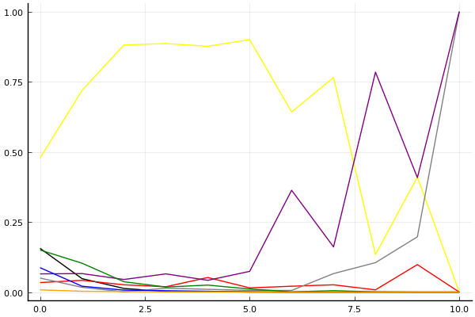
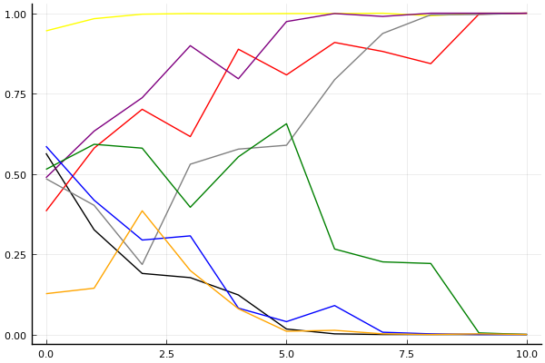

2019 시즌 1 개인전 32강 패자부활전

## 경기 결과

| 트랙 | 김승태 | 김기수 | 임재원 | 최영훈 | 한승철 | 김지민 | 이준용 | 김진석 |
|:---|---:|---:|---:|---:|---:|---:|---:|---:|
| [신화 신들의 세계](../shinsegye) | 10 | 0 | 7 | 1 | 5 | 4 | -1 | 3 |
| [WKC 투어링 랠리](../rally) | 10 | 0 | 4 | -1 | 5 | 3 | 1 | 7 |
| [차이나 서안 병마용](../byeongma) | 5 | 3 | 1 | 10 | 7 | 0 | 4 | -1 |
| [월드 두바이 다운타운](../dubai) | 4 | 3 | 10 | 5 | 1 | 7 | -1 | 0 |
| [노르테유 익스프레스](../noex) | 7 | 0 | 1 | 4 | 10 | 5 | 3 | -1 |
| [도검 구름의 협곡](../hyupgog) | 1 | 0 | 4 | 5 | 10 | -1 | 7 | 3 |
| [팩토리 미완성 5구역](../district5) | 4 | -1 | 5 | 10 | 0 | 7 | 1 | 3 |
| [신화 오딘의 궁전](../odin) | -1 | 0 | 3 | 7 | 10 | 5 | 1 | 4 |
| [광산 3개의 지름길](../gwangsamji) | 5 | 4 | 7 | 3 | -1 | 0 | 1 | 10 |
| [대저택 은밀한 지하실](../jeotaek) | 3 | -1 | 4 | 10 | 7 | 1 | 0 | 5 |
| __total__ |__48__ |__8__ |__46__ |__54__ |__54__ |__31__ |__16__ |__33__ |

## 시뮬레이션

### 1st 확률

x축: 트랙, y축: 확률
1번: 옐로우, 2번: 블랙, 3번: 레드, 4번: 화이트(회색), 5번: 퍼플, 6번: 그린, 7번: 블루, 8번: 오렌지

| 트랙 | 김승태 | 김기수 | 임재원 | 최영훈 | 한승철 | 김지민 | 이준용 | 김진석 |
|:---|---:|---:|---:|---:|---:|---:|---:|---:|
| 초기 | 0.490 | 0.148 | 0.032 | 0.046 | 0.054 | 0.155 | 0.085 | 0.009 |
| 신화 신들의 세계 | 0.703 | 0.051 | 0.042 | 0.024 | 0.049 | 0.111 | 0.023 | 0.009 |
| WKC 투어링 랠리 | 0.869 | 0.005 | 0.025 | 0.001 | 0.052 | 0.043 | 0.009 | 0.009 |
| 차이나 서안 병마용 | 0.876 | 0.002 | 0.018 | 0.012 | 0.082 | 0.008 | 0.003 | 0.004 |
| 월드 두바이 다운타운 | 0.877 | 0.002 | 0.043 | 0.017 | 0.043 | 0.026 | 0.000 | 0.000 |
| 노르테유 익스프레스 | 0.909 | 0.000 | 0.014 | 0.004 | 0.073 | 0.010 | 0.000 | 0.000 |
| 도검 구름의 협곡 | 0.637 | 0.000 | 0.020 | 0.011 | 0.365 | 0.000 | 0.001 | 0.000 |
| 팩토리 미완성 5구역 | 0.736 | 0.000 | 0.031 | 0.067 | 0.186 | 0.006 | 0.000 | 0.000 |
| 신화 오딘의 궁전 | 0.129 | 0.000 | 0.009 | 0.091 | 0.802 | 0.002 | 0.000 | 0.000 |
| 광산 3개의 지름길 | 0.427 | 0.000 | 0.104 | 0.205 | 0.385 | 0.000 | 0.000 | 0.000 |
| 대저택 은밀한 지하실 | 0.000 | 0.000 | 0.000 | 1.000 | 1.000 | 0.000 | 0.000 | 0.000 |

### Advance 확률

x축: 트랙, y축: 확률
1번: 옐로우, 2번: 블랙, 3번: 레드, 4번: 화이트(회색), 5번: 퍼플, 6번: 그린, 7번: 블루, 8번: 오렌지

| 트랙 | 김승태 | 김기수 | 임재원 | 최영훈 | 한승철 | 김지민 | 이준용 | 김진석 |
|:---|---:|---:|---:|---:|---:|---:|---:|---:|
| 초기 | 0.929 | 0.565 | 0.394 | 0.473 | 0.516 | 0.558 | 0.561 | 0.117 |
| 신화 신들의 세계 | 0.985 | 0.367 | 0.587 | 0.387 | 0.615 | 0.616 | 0.401 | 0.163 |
| WKC 투어링 랠리 | 0.995 | 0.174 | 0.716 | 0.236 | 0.734 | 0.585 | 0.299 | 0.396 |
| 차이나 서안 병마용 | 0.999 | 0.171 | 0.633 | 0.531 | 0.880 | 0.390 | 0.324 | 0.207 |
| 월드 두바이 다운타운 | 0.999 | 0.124 | 0.860 | 0.597 | 0.791 | 0.552 | 0.099 | 0.076 |
| 노르테유 익스프레스 | 1.000 | 0.024 | 0.838 | 0.583 | 0.972 | 0.627 | 0.036 | 0.014 |
| 도검 구름의 협곡 | 1.000 | 0.003 | 0.908 | 0.792 | 0.999 | 0.249 | 0.105 | 0.014 |
| 팩토리 미완성 5구역 | 1.000 | 0.000 | 0.866 | 0.941 | 0.990 | 0.243 | 0.006 | 0.002 |
| 신화 오딘의 궁전 | 0.994 | 0.000 | 0.802 | 0.996 | 1.000 | 0.255 | 0.000 | 0.000 |
| 광산 3개의 지름길 | 1.000 | 0.000 | 0.995 | 1.000 | 0.999 | 0.006 | 0.000 | 0.001 |
| 대저택 은밀한 지하실 | 1.000 | 0.000 | 1.000 | 1.000 | 1.000 | 0.000 | 0.000 | 0.000 |

## 랭킹 변동

### [전체 랭킹](../singles-full)

| 순위 | 변동 | 이름 | 점수 | 변동 | mu | 변동 | sigma | 변동 |
|---:|---:|:---:|---:|---:|---:|---:|---:|---:|
| 9 / 69 | -1 | [김승태](../gimseungtae) | 3133 | -28 | 3367 | -31 | 78 | -1 |
| 16 / 69 | +4 | [최영훈](../choiyeonghun) | 2895 | +67 | 3146 | +58 | 84 | -3 |
| 17 / 69 | +4 | [한승철](../hanseungcheol) | 2892 | +82 | 3166 | +62 | 91 | -7 |
| 21 / 69 | +2 | [임재원](../imjaewon) | 2836 | +61 | 3088 | +49 | 84 | -4 |
| 22 / 69 | -6 | [이준용](../ijunyong) | 2823 | -66 | 3071 | -75 | 83 | -3 |
| 30 / 69 | +5 | [김지민](../gimjimin) | 2637 | +173 | 3063 | -63 | 142 | -79 |
| 34 / 69 | +11 | [김진석](../gimjinseok) | 2551 | +188 | 2912 | +91 | 120 | -32 |
| 44 / 69 | -7 | [김기수](../gimgisu) | 2379 | -74 | 2814 | -318 | 145 | -81 |

### 시즌 랭킹

| 순위 | 변동 | 이름 | 점수 | 변동 | mu | 변동 | sigma | 변동 |
|---:|---:|:---:|---:|---:|---:|---:|---:|---:|
| 4 / 32 | +2 | [김승태](../gimseungtae) | 2722 | +193 | 3144 | -10 | 141 | -68 |
| 5 / 32 | +9 | [최영훈](../choiyeonghun) | 2709 | +370 | 3126 | +186 | 139 | -61 |
| 6 / 32 | +4 | [임재원](../imjaewon) | 2703 | +252 | 3115 | +56 | 137 | -65 |
| 7 / 32 | +13 | [한승철](../hanseungcheol) | 2672 | +412 | 3094 | +226 | 141 | -62 |
| 12 / 32 | +6 | [김진석](../gimjinseok) | 2504 | +206 | 2942 | -40 | 146 | -82 |
| 14 / 32 | +7 | [김지민](../gimjimin) | 2493 | +257 | 2930 | -5 | 146 | -87 |
| 18 / 32 | -2 | [이준용](../ijunyong) | 2355 | +44 | 2797 | -224 | 147 | -90 |
| 21 / 32 | -2 | [김기수](../gimgisu) | 2229 | -46 | 2675 | -312 | 149 | -89 |

### 트랙 별 랭킹

#### [WKC 투어링 랠리](../rally)

| 순위 | 변동 | 이름 | 점수 | 변동 | mu | 변동 | sigma | 변동 |
|:---:|:---:|:---:|---:|---:|---:|---:|---:|---:|
| 1 / 30 | +0 | [김승태](../gimseungtae) | 3209 | +224 | 4085 | +164 | 292 | -20 |
| 5 / 30 | +6 | [한승철](../hanseungcheol) | 2325 | +516 | 3579 | +156 | 418 | -120 |
| 7 / 30 | +3 | [임재원](../imjaewon) | 2257 | +258 | 3552 | -160 | 432 | -139 |
| 11 / 30 | NaN | [김진석](../gimjinseok) | 2178 | +2178 | 3841 | +841 | 554 | -446 |
| 20 / 30 | -5 | [최영훈](../choiyeonghun) | 1528 | -175 | 2527 | -266 | 333 | -30 |
| 23 / 30 | NaN | [김지민](../gimjimin) | 1433 | +1433 | 3081 | +81 | 549 | -451 |
| 25 / 30 | NaN | [이준용](../ijunyong) | 1149 | +1149 | 2821 | -179 | 557 | -443 |
| 28 / 30 | NaN | [김기수](../gimgisu) | 846 | +846 | 2544 | -456 | 566 | -434 |

#### [광산 3개의 지름길](../gwangsamji)

| 순위 | 변동 | 이름 | 점수 | 변동 | mu | 변동 | sigma | 변동 |
|:---:|:---:|:---:|---:|---:|---:|---:|---:|---:|
| 1 / 8 | NaN | [김진석](../gimjinseok) | 2161 | +2161 | 4274 | +1274 | 704 | -296 |
| 2 / 8 | NaN | [임재원](../imjaewon) | 1887 | +1887 | 3763 | +763 | 625 | -375 |
| 3 / 8 | NaN | [김승태](../gimseungtae) | 1622 | +1622 | 3423 | +423 | 600 | -400 |
| 4 / 8 | NaN | [김기수](../gimgisu) | 1363 | +1363 | 3137 | +137 | 591 | -409 |
| 5 / 8 | NaN | [최영훈](../choiyeonghun) | 1090 | +1090 | 2863 | -137 | 591 | -409 |
| 6 / 8 | NaN | [이준용](../ijunyong) | 776 | +776 | 2577 | -423 | 600 | -400 |
| 7 / 8 | NaN | [김지민](../gimjimin) | 361 | +361 | 2237 | -763 | 625 | -375 |
| 8 / 8 | NaN | [한승철](../hanseungcheol) | -388 | -388 | 1726 | -1274 | 704 | -296 |

#### [노르테유 익스프레스](../noex)

| 순위 | 변동 | 이름 | 점수 | 변동 | mu | 변동 | sigma | 변동 |
|:---:|:---:|:---:|---:|---:|---:|---:|---:|---:|
| 9 / 68 | +1 | [한승철](../hanseungcheol) | 2908 | +166 | 3672 | +119 | 255 | -16 |
| 12 / 68 | +0 | [김승태](../gimseungtae) | 2720 | +108 | 3445 | +50 | 242 | -19 |
| 15 / 68 | +0 | [최영훈](../choiyeonghun) | 2394 | +43 | 3239 | -68 | 282 | -37 |
| 21 / 68 | +0 | [임재원](../imjaewon) | 1983 | +18 | 2731 | -52 | 250 | -23 |
| 22 / 68 | +4 | [이준용](../ijunyong) | 1973 | +104 | 2761 | +17 | 263 | -29 |
| 33 / 68 | +21 | [김지민](../gimjimin) | 1668 | +1036 | 2937 | +517 | 423 | -173 |
| 46 / 68 | -6 | [김기수](../gimgisu) | 1342 | -63 | 2618 | -483 | 425 | -140 |
| 54 / 68 | -1 | [김진석](../gimjinseok) | 640 | -73 | 1922 | -274 | 428 | -67 |

#### [대저택 은밀한 지하실](../jeotaek)

| 순위 | 변동 | 이름 | 점수 | 변동 | mu | 변동 | sigma | 변동 |
|:---:|:---:|:---:|---:|---:|---:|---:|---:|---:|
| 7 / 68 | +3 | [최영훈](../choiyeonghun) | 2947 | +230 | 3830 | +153 | 294 | -26 |
| 8 / 68 | -1 | [김승태](../gimseungtae) | 2799 | -19 | 3406 | -58 | 202 | -13 |
| 13 / 68 | +3 | [한승철](../hanseungcheol) | 2487 | +225 | 3250 | +150 | 254 | -25 |
| 16 / 68 | +11 | [김진석](../gimjinseok) | 2340 | +310 | 3344 | +93 | 334 | -72 |
| 19 / 68 | +7 | [임재원](../imjaewon) | 2213 | +174 | 2965 | +93 | 251 | -27 |
| 28 / 68 | +2 | [이준용](../ijunyong) | 2004 | +27 | 2725 | -32 | 240 | -20 |
| 30 / 68 | +7 | [김지민](../gimjimin) | 1915 | +165 | 3085 | -228 | 390 | -131 |
| 38 / 68 | -13 | [김기수](../gimgisu) | 1676 | -408 | 2935 | -747 | 420 | -113 |

#### [도검 구름의 협곡](../hyupgog)

| 순위 | 변동 | 이름 | 점수 | 변동 | mu | 변동 | sigma | 변동 |
|:---:|:---:|:---:|---:|---:|---:|---:|---:|---:|
| 5 / 33 | +1 | [최영훈](../choiyeonghun) | 2170 | +180 | 3269 | -69 | 366 | -83 |
| 7 / 33 | +12 | [한승철](../hanseungcheol) | 2026 | +909 | 3351 | +597 | 442 | -104 |
| 12 / 33 | +12 | [이준용](../ijunyong) | 1765 | +987 | 3080 | +513 | 438 | -158 |
| 13 / 33 | -3 | [김승태](../gimseungtae) | 1698 | -82 | 2823 | -345 | 375 | -88 |
| 17 / 33 | +3 | [김진석](../gimjinseok) | 1472 | +377 | 2748 | -102 | 426 | -160 |
| 18 / 33 | +7 | [임재원](../imjaewon) | 1468 | +715 | 2748 | +225 | 427 | -163 |
| 25 / 33 | -9 | [김지민](../gimjimin) | 864 | -490 | 2265 | -859 | 467 | -123 |
| 27 / 33 | +6 | [김기수](../gimgisu) | 393 | +908 | 1848 | +295 | 485 | -204 |

#### [신화 신들의 세계](../shinsegye)

| 순위 | 변동 | 이름 | 점수 | 변동 | mu | 변동 | sigma | 변동 |
|:---:|:---:|:---:|---:|---:|---:|---:|---:|---:|
| 1 / 32 | +4 | [임재원](../imjaewon) | 2590 | +703 | 3952 | +189 | 454 | -171 |
| 2 / 32 | -1 | [한승철](../hanseungcheol) | 2568 | +408 | 3987 | -287 | 473 | -232 |
| 3 / 32 | +5 | [김지민](../gimjimin) | 2320 | +433 | 3654 | -109 | 445 | -181 |
| 6 / 32 | +23 | [김승태](../gimseungtae) | 1973 | +2360 | 3464 | +1738 | 497 | -207 |
| 7 / 32 | +9 | [김진석](../gimjinseok) | 1941 | +579 | 3237 | +100 | 432 | -159 |
| 10 / 32 | -6 | [김기수](../gimgisu) | 1857 | -304 | 3298 | -976 | 480 | -224 |
| 11 / 32 | +9 | [최영훈](../choiyeonghun) | 1668 | +579 | 2973 | +109 | 435 | -156 |
| 18 / 32 | -6 | [이준용](../ijunyong) | 1357 | -265 | 2789 | -635 | 477 | -123 |

#### [신화 오딘의 궁전](../odin)

| 순위 | 변동 | 이름 | 점수 | 변동 | mu | 변동 | sigma | 변동 |
|:---:|:---:|:---:|---:|---:|---:|---:|---:|---:|
| 4 / 26 | +7 | [한승철](../hanseungcheol) | 2095 | +732 | 3562 | +425 | 489 | -102 |
| 11 / 26 | +10 | [최영훈](../choiyeonghun) | 1489 | +1128 | 2870 | +633 | 460 | -165 |
| 13 / 26 | +4 | [임재원](../imjaewon) | 1247 | +471 | 2561 | -16 | 438 | -162 |
| 14 / 26 | NaN | [김진석](../gimjinseok) | 1213 | +1213 | 2810 | -190 | 532 | -468 |
| 15 / 26 | -3 | [김기수](../gimgisu) | 1200 | -163 | 2526 | -610 | 442 | -149 |
| 16 / 26 | +8 | [김지민](../gimjimin) | 1126 | +1514 | 2552 | +826 | 475 | -229 |
| 19 / 26 | NaN | [이준용](../ijunyong) | 862 | +862 | 2467 | -533 | 535 | -465 |
| 22 / 26 | -9 | [김승태](../gimseungtae) | 763 | -327 | 2169 | -695 | 469 | -123 |

#### [월드 두바이 다운타운](../dubai)

| 순위 | 변동 | 이름 | 점수 | 변동 | mu | 변동 | sigma | 변동 |
|:---:|:---:|:---:|---:|---:|---:|---:|---:|---:|
| 4 / 49 | +1 | [김승태](../gimseungtae) | 2573 | +38 | 3233 | -11 | 220 | -16 |
| 7 / 49 | +1 | [최영훈](../choiyeonghun) | 2493 | +134 | 3316 | +34 | 274 | -34 |
| 14 / 49 | +13 | [김지민](../gimjimin) | 2189 | +716 | 3439 | +269 | 416 | -149 |
| 15 / 49 | +13 | [임재원](../imjaewon) | 2183 | +711 | 3282 | +512 | 366 | -66 |
| 24 / 49 | -4 | [이준용](../ijunyong) | 1764 | -157 | 2666 | -248 | 300 | -30 |
| 27 / 49 | +6 | [김기수](../gimgisu) | 1701 | +499 | 2933 | +26 | 410 | -158 |
| 28 / 49 | +1 | [한승철](../hanseungcheol) | 1673 | +231 | 2868 | -162 | 398 | -131 |
| 31 / 49 | +0 | [김진석](../gimjinseok) | 1473 | +112 | 2699 | -281 | 408 | -131 |

#### [차이나 서안 병마용](../byeongma)

| 순위 | 변동 | 이름 | 점수 | 변동 | mu | 변동 | sigma | 변동 |
|:---:|:---:|:---:|---:|---:|---:|---:|---:|---:|
| 12 / 55 | +2 | [김승태](../gimseungtae) | 2498 | +39 | 3180 | -17 | 227 | -19 |
| 18 / 55 | +4 | [최영훈](../choiyeonghun) | 2269 | +302 | 3119 | +219 | 283 | -28 |
| 19 / 55 | +1 | [이준용](../ijunyong) | 2113 | +86 | 2867 | +5 | 251 | -27 |
| 20 / 55 | +5 | [한승철](../hanseungcheol) | 2082 | +251 | 2886 | +158 | 268 | -31 |
| 21 / 55 | -3 | [임재원](../imjaewon) | 2041 | -11 | 2754 | -75 | 238 | -21 |
| 37 / 55 | -3 | [김지민](../gimjimin) | 1467 | -98 | 2672 | -490 | 402 | -131 |
| 40 / 55 | -2 | [김진석](../gimjinseok) | 1198 | -209 | 2352 | -423 | 385 | -71 |
| 43 / 55 | +9 | [김기수](../gimgisu) | 1177 | +825 | 2396 | +341 | 406 | -161 |

#### [팩토리 미완성 5구역](../district5)

| 순위 | 변동 | 이름 | 점수 | 변동 | mu | 변동 | sigma | 변동 |
|:---:|:---:|:---:|---:|---:|---:|---:|---:|---:|
| 9 / 67 | +0 | [임재원](../imjaewon) | 2703 | +101 | 3471 | +24 | 256 | -26 |
| 10 / 67 | +7 | [최영훈](../choiyeonghun) | 2683 | +294 | 3507 | +226 | 274 | -23 |
| 12 / 67 | +0 | [김승태](../gimseungtae) | 2555 | +73 | 3362 | -22 | 269 | -32 |
| 18 / 67 | +0 | [이준용](../ijunyong) | 2345 | -9 | 3083 | -77 | 246 | -22 |
| 23 / 67 | +0 | [한승철](../hanseungcheol) | 2128 | -73 | 2940 | -151 | 271 | -26 |
| 25 / 67 | NaN | [김지민](../gimjimin) | 2078 | +2078 | 3653 | +653 | 525 | -475 |
| 33 / 67 | +14 | [김진석](../gimjinseok) | 1751 | +515 | 2924 | +133 | 391 | -127 |
| 60 / 67 | NaN | [김기수](../gimgisu) | -35 | -35 | 2013 | -987 | 683 | -317 |
