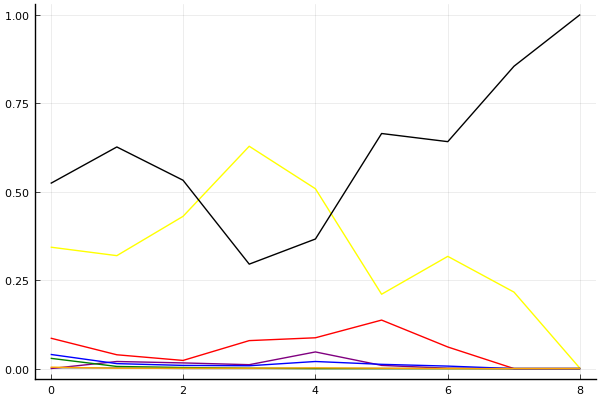
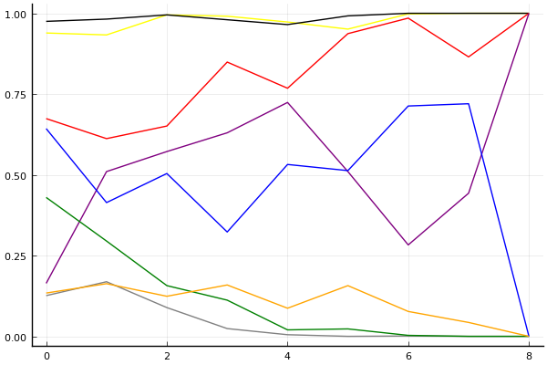

2019 시즌 1 개인전 16강 1경기

## 경기 결과

| 트랙 | 박인수 | 문호준 | 정승하 | 송용준 | 김응태 | 이준성 | 김승태 | 임재원 |
|:---|---:|---:|---:|---:|---:|---:|---:|---:|
| [신화 신들의 세계](../shinsegye) | 5 | 7 | 1 | 4 | 10 | 0 | -1 | 3 |
| [차이나 서안 병마용](../byeongma) | 10 | 7 | 4 | -1 | 3 | 0 | 5 | 1 |
| [도검 구름의 협곡](../hyupgog) | 7 | 0 | 10 | -1 | 4 | 3 | 1 | 5 |
| [WKC 투어링 랠리](../rally) | 1 | 5 | 4 | 0 | 7 | -1 | 10 | 3 |
| [광산 3개의 지름길](../gwangsamji) | 1 | 10 | 7 | 0 | -1 | 4 | 3 | 5 |
| [노르테유 익스프레스](../noex) | 10 | 7 | 4 | 3 | -1 | 1 | 5 | 0 |
| [팩토리 미완성 5구역](../district5) | 7 | 10 | -1 | 0 | 5 | 1 | 4 | 3 |
| [월드 두바이 다운타운](../dubai) | 10 | 7 | 5 | 0 | 4 | 1 | -1 | 3 |
| __total__ |__51__ |__53__ |__34__ |__5__ |__31__ |__9__ |__26__ |__23__ |

## 시뮬레이션

### 1st 확률

x축: 트랙, y축: 확률
1번: 옐로우, 2번: 블랙, 3번: 레드, 4번: 화이트(회색), 5번: 퍼플, 6번: 그린, 7번: 블루, 8번: 오렌지

| 트랙 | 박인수 | 문호준 | 정승하 | 송용준 | 김응태 | 이준성 | 김승태 | 임재원 |
|:---|---:|---:|---:|---:|---:|---:|---:|---:|
| 초기 | 0.329 | 0.540 | 0.067 | 0.003 | 0.006 | 0.020 | 0.055 | 0.004 |
| 신화 신들의 세계 | 0.299 | 0.637 | 0.036 | 0.001 | 0.020 | 0.013 | 0.009 | 0.005 |
| 차이나 서안 병마용 | 0.430 | 0.539 | 0.029 | 0.001 | 0.008 | 0.002 | 0.010 | 0.000 |
| 도검 구름의 협곡 | 0.621 | 0.299 | 0.079 | 0.000 | 0.014 | 0.001 | 0.003 | 0.001 |
| WKC 투어링 랠리 | 0.470 | 0.394 | 0.092 | 0.000 | 0.042 | 0.000 | 0.032 | 0.000 |
| 광산 3개의 지름길 | 0.238 | 0.646 | 0.121 | 0.000 | 0.008 | 0.001 | 0.014 | 0.001 |
| 노르테유 익스프레스 | 0.304 | 0.649 | 0.066 | 0.000 | 0.000 | 0.000 | 0.006 | 0.000 |
| 팩토리 미완성 5구역 | 0.210 | 0.840 | 0.000 | 0.000 | 0.001 | 0.000 | 0.000 | 0.000 |
| 월드 두바이 다운타운 | 0.000 | 1.000 | 0.000 | 0.000 | 0.000 | 0.000 | 0.000 | 0.000 |

### Advance 확률

x축: 트랙, y축: 확률
1번: 옐로우, 2번: 블랙, 3번: 레드, 4번: 화이트(회색), 5번: 퍼플, 6번: 그린, 7번: 블루, 8번: 오렌지

| 트랙 | 박인수 | 문호준 | 정승하 | 송용준 | 김응태 | 이준성 | 김승태 | 임재원 |
|:---|---:|---:|---:|---:|---:|---:|---:|---:|
| 초기 | 0.939 | 0.975 | 0.674 | 0.126 | 0.164 | 0.430 | 0.643 | 0.134 |
| 신화 신들의 세계 | 0.933 | 0.982 | 0.612 | 0.169 | 0.510 | 0.295 | 0.414 | 0.163 |
| 차이나 서안 병마용 | 0.995 | 0.995 | 0.651 | 0.089 | 0.572 | 0.157 | 0.504 | 0.124 |
| 도검 구름의 협곡 | 0.991 | 0.980 | 0.849 | 0.024 | 0.630 | 0.112 | 0.323 | 0.159 |
| WKC 투어링 랠리 | 0.973 | 0.965 | 0.768 | 0.005 | 0.724 | 0.020 | 0.532 | 0.087 |
| 광산 3개의 지름길 | 0.951 | 0.992 | 0.937 | 0.000 | 0.510 | 0.023 | 0.513 | 0.157 |
| 노르테유 익스프레스 | 0.998 | 1.000 | 0.985 | 0.001 | 0.283 | 0.003 | 0.713 | 0.077 |
| 팩토리 미완성 5구역 | 1.000 | 1.000 | 0.865 | 0.000 | 0.443 | 0.000 | 0.720 | 0.043 |
| 월드 두바이 다운타운 | 1.000 | 1.000 | 1.000 | 0.000 | 1.000 | 0.000 | 0.000 | 0.000 |

## 랭킹 변동

### [전체 랭킹](../singles-full)

| 순위 | 변동 | 이름 | 점수 | 변동 | mu | 변동 | sigma | 변동 |
|---:|---:|:---:|---:|---:|---:|---:|---:|---:|
| 1 / 69 | +0 | [문호준](../munhojun) | 3469 | +21 | 3707 | +19 | 79 | -1 |
| 2 / 69 | +0 | [박인수](../bakinsu) | 3389 | +29 | 3626 | +28 | 79 | -0 |
| 8 / 69 | +0 | [정승하](../jeongseungha) | 3150 | +11 | 3403 | +2 | 84 | -3 |
| 9 / 69 | +0 | [김승태](../gimseungtae) | 3115 | -17 | 3348 | -19 | 78 | -0 |
| 14 / 69 | -2 | [이준성](../ijunseong) | 2970 | -47 | 3208 | -50 | 79 | -1 |
| 19 / 69 | +2 | [임재원](../imjaewon) | 2868 | +32 | 3113 | +25 | 81 | -2 |
| 22 / 69 | +2 | [김응태](../gimeungtae) | 2848 | +82 | 3145 | +55 | 99 | -9 |
| 28 / 69 | +0 | [송용준](../songyongjun) | 2692 | -30 | 2991 | -57 | 100 | -9 |

### 시즌 랭킹

| 순위 | 변동 | 이름 | 점수 | 변동 | mu | 변동 | sigma | 변동 |
|---:|---:|:---:|---:|---:|---:|---:|---:|---:|
| 1 / 32 | +0 | [문호준](../munhojun) | 3293 | +305 | 3794 | +44 | 167 | -87 |
| 2 / 32 | +0 | [박인수](../bakinsu) | 3254 | +344 | 3783 | +1 | 176 | -114 |
| 3 / 32 | +7 | [정승하](../jeongseungha) | 2853 | +328 | 3330 | +86 | 159 | -81 |
| 4 / 32 | +0 | [김승태](../gimseungtae) | 2803 | +82 | 3162 | +17 | 119 | -21 |
| 6 / 32 | +0 | [임재원](../imjaewon) | 2790 | +87 | 3138 | +24 | 116 | -21 |
| 7 / 32 | +9 | [김응태](../gimeungtae) | 2731 | +355 | 3213 | +108 | 161 | -82 |
| 15 / 32 | -2 | [송용준](../songyongjun) | 2450 | -50 | 2927 | -281 | 159 | -77 |
| 16 / 32 | +6 | [이준성](../ijunseong) | 2436 | +209 | 2914 | -44 | 159 | -85 |

### 트랙 별 랭킹

#### [WKC 투어링 랠리](../rally)

| 순위 | 변동 | 이름 | 점수 | 변동 | mu | 변동 | sigma | 변동 |
|:---:|:---:|:---:|---:|---:|---:|---:|---:|---:|
| 1 / 34 | +0 | [김승태](../gimseungtae) | 3378 | +169 | 4206 | +121 | 276 | -16 |
| 3 / 34 | +0 | [문호준](../munhojun) | 2609 | +203 | 3589 | +59 | 327 | -48 |
| 7 / 34 | +0 | [임재원](../imjaewon) | 2276 | +19 | 3358 | -195 | 361 | -71 |
| 9 / 34 | NaN | [김응태](../gimeungtae) | 2183 | +2183 | 3847 | +847 | 554 | -446 |
| 14 / 34 | +2 | [박인수](../bakinsu) | 1794 | +94 | 2753 | -25 | 320 | -40 |
| 18 / 34 | NaN | [정승하](../jeongseungha) | 1706 | +1706 | 3307 | +307 | 534 | -466 |
| 32 / 34 | NaN | [송용준](../songyongjun) | 601 | +601 | 2392 | -608 | 597 | -403 |
| 33 / 34 | NaN | [이준성](../ijunseong) | -250 | -250 | 1846 | -1154 | 699 | -301 |

#### [광산 3개의 지름길](../gwangsamji)

| 순위 | 변동 | 이름 | 점수 | 변동 | mu | 변동 | sigma | 변동 |
|:---:|:---:|:---:|---:|---:|---:|---:|---:|---:|
| 1 / 14 | NaN | [문호준](../munhojun) | 2349 | +2349 | 4394 | +1394 | 682 | -318 |
| 2 / 14 | +0 | [임재원](../imjaewon) | 2340 | +453 | 3767 | +4 | 475 | -150 |
| 4 / 14 | NaN | [정승하](../jeongseungha) | 2117 | +2117 | 3919 | +919 | 601 | -399 |
| 5 / 14 | -2 | [김승태](../gimseungtae) | 1834 | +211 | 3218 | -206 | 461 | -139 |
| 6 / 14 | NaN | [이준성](../ijunseong) | 1621 | +1621 | 3323 | +323 | 567 | -433 |
| 9 / 14 | NaN | [박인수](../bakinsu) | 969 | +969 | 2736 | -264 | 589 | -411 |
| 11 / 14 | NaN | [송용준](../songyongjun) | 494 | +494 | 2365 | -635 | 624 | -376 |
| 13 / 14 | NaN | [김응태](../gimeungtae) | -309 | -309 | 1824 | -1176 | 711 | -289 |

#### [노르테유 익스프레스](../noex)

| 순위 | 변동 | 이름 | 점수 | 변동 | mu | 변동 | sigma | 변동 |
|:---:|:---:|:---:|---:|---:|---:|---:|---:|---:|
| 1 / 68 | +1 | [박인수](../bakinsu) | 3759 | +89 | 4331 | +70 | 191 | -7 |
| 2 / 68 | -1 | [문호준](../munhojun) | 3730 | +38 | 4345 | +4 | 205 | -11 |
| 5 / 68 | +1 | [정승하](../jeongseungha) | 3135 | +40 | 3880 | -36 | 248 | -25 |
| 6 / 68 | -1 | [이준성](../ijunseong) | 3120 | -35 | 3683 | -64 | 188 | -10 |
| 10 / 68 | +2 | [김승태](../gimseungtae) | 2876 | +156 | 3549 | +104 | 224 | -17 |
| 13 / 68 | +1 | [송용준](../songyongjun) | 2557 | +155 | 3377 | +49 | 273 | -35 |
| 14 / 68 | -1 | [김응태](../gimeungtae) | 2441 | -159 | 3259 | -232 | 273 | -24 |
| 21 / 68 | +0 | [임재원](../imjaewon) | 2073 | +90 | 2769 | +37 | 232 | -17 |

#### [도검 구름의 협곡](../hyupgog)

| 순위 | 변동 | 이름 | 점수 | 변동 | mu | 변동 | sigma | 변동 |
|:---:|:---:|:---:|---:|---:|---:|---:|---:|---:|
| 1 / 33 | +0 | [박인수](../bakinsu) | 2812 | +66 | 3910 | -185 | 366 | -84 |
| 2 / 33 | +0 | [문호준](../munhojun) | 2424 | -315 | 3478 | -549 | 351 | -78 |
| 6 / 33 | +3 | [이준성](../ijunseong) | 2077 | +148 | 3335 | -384 | 419 | -177 |
| 8 / 33 | +10 | [임재원](../imjaewon) | 1980 | +512 | 3025 | +277 | 348 | -78 |
| 10 / 33 | +3 | [김승태](../gimseungtae) | 1896 | +198 | 2850 | +27 | 318 | -57 |
| 15 / 33 | +16 | [정승하](../jeongseungha) | 1664 | +1529 | 2919 | +1163 | 418 | -122 |
| 16 / 33 | -13 | [송용준](../songyongjun) | 1647 | -659 | 3087 | -1260 | 480 | -200 |
| 21 / 33 | +11 | [김응태](../gimeungtae) | 1355 | +1742 | 2708 | +988 | 451 | -251 |

#### [신화 신들의 세계](../shinsegye)

| 순위 | 변동 | 이름 | 점수 | 변동 | mu | 변동 | sigma | 변동 |
|:---:|:---:|:---:|---:|---:|---:|---:|---:|---:|
| 2 / 32 | -1 | [임재원](../imjaewon) | 2552 | -39 | 3646 | -306 | 365 | -89 |
| 3 / 32 | +1 | [박인수](../bakinsu) | 2477 | +316 | 3866 | -409 | 463 | -242 |
| 6 / 32 | +17 | [김응태](../gimeungtae) | 2151 | +1375 | 3522 | +946 | 457 | -143 |
| 8 / 32 | +13 | [송용준](../songyongjun) | 1934 | +844 | 3205 | +342 | 424 | -168 |
| 10 / 32 | +19 | [문호준](../munhojun) | 1885 | +1524 | 3217 | +980 | 444 | -181 |
| 12 / 32 | -3 | [이준성](../ijunseong) | 1834 | -53 | 3173 | -590 | 446 | -179 |
| 13 / 32 | +2 | [정승하](../jeongseungha) | 1800 | +437 | 3081 | -56 | 427 | -164 |
| 14 / 32 | -8 | [김승태](../gimseungtae) | 1702 | -271 | 2938 | -526 | 412 | -85 |

#### [월드 두바이 다운타운](../dubai)

| 순위 | 변동 | 이름 | 점수 | 변동 | mu | 변동 | sigma | 변동 |
|:---:|:---:|:---:|---:|---:|---:|---:|---:|---:|
| 1 / 49 | +0 | [문호준](../munhojun) | 3007 | +86 | 3772 | +18 | 255 | -23 |
| 5 / 49 | +7 | [박인수](../bakinsu) | 2541 | +343 | 3364 | +269 | 274 | -25 |
| 8 / 49 | +3 | [정승하](../jeongseungha) | 2457 | +196 | 3816 | -450 | 453 | -215 |
| 9 / 49 | -5 | [김승태](../gimseungtae) | 2422 | -151 | 3052 | -181 | 210 | -10 |
| 13 / 49 | +2 | [임재원](../imjaewon) | 2217 | +33 | 3165 | -118 | 316 | -50 |
| 24 / 49 | +11 | [김응태](../gimeungtae) | 1788 | +654 | 3013 | +246 | 408 | -136 |
| 36 / 49 | +9 | [송용준](../songyongjun) | 1061 | +487 | 2345 | +16 | 428 | -157 |
| 41 / 49 | +8 | [이준성](../ijunseong) | 852 | +1326 | 2218 | +680 | 455 | -215 |

#### [차이나 서안 병마용](../byeongma)

| 순위 | 변동 | 이름 | 점수 | 변동 | mu | 변동 | sigma | 변동 |
|:---:|:---:|:---:|---:|---:|---:|---:|---:|---:|
| 1 / 55 | +0 | [문호준](../munhojun) | 3187 | +35 | 3723 | +9 | 179 | -8 |
| 3 / 55 | +0 | [박인수](../bakinsu) | 2795 | +103 | 3282 | +88 | 162 | -5 |
| 7 / 55 | +3 | [정승하](../jeongseungha) | 2652 | +62 | 3280 | +16 | 209 | -15 |
| 8 / 55 | +4 | [김승태](../gimseungtae) | 2608 | +110 | 3243 | +63 | 212 | -16 |
| 10 / 55 | -6 | [김응태](../gimeungtae) | 2589 | -84 | 3637 | -358 | 349 | -91 |
| 11 / 55 | -3 | [이준성](../ijunseong) | 2560 | -38 | 3115 | -65 | 185 | -9 |
| 19 / 55 | +2 | [임재원](../imjaewon) | 2123 | +82 | 2784 | +31 | 220 | -17 |
| 23 / 55 | -1 | [송용준](../songyongjun) | 1932 | -100 | 2761 | -172 | 277 | -24 |

#### [팩토리 미완성 5구역](../district5)

| 순위 | 변동 | 이름 | 점수 | 변동 | mu | 변동 | sigma | 변동 |
|:---:|:---:|:---:|---:|---:|---:|---:|---:|---:|
| 1 / 67 | +0 | [박인수](../bakinsu) | 3343 | +40 | 3898 | +14 | 185 | -9 |
| 2 / 67 | +1 | [문호준](../munhojun) | 3233 | +133 | 3878 | +101 | 215 | -11 |
| 8 / 67 | -1 | [이준성](../ijunseong) | 2772 | -28 | 3378 | -65 | 202 | -12 |
| 9 / 67 | +0 | [임재원](../imjaewon) | 2723 | +20 | 3426 | -44 | 235 | -22 |
| 11 / 67 | +1 | [김승태](../gimseungtae) | 2651 | +96 | 3384 | +22 | 244 | -25 |
| 14 / 67 | +8 | [김응태](../gimeungtae) | 2460 | +253 | 3272 | +150 | 271 | -34 |
| 29 / 67 | -2 | [정승하](../jeongseungha) | 1908 | -130 | 2801 | -217 | 298 | -29 |
| 33 / 67 | +4 | [송용준](../songyongjun) | 1766 | +130 | 2721 | -22 | 318 | -51 |
