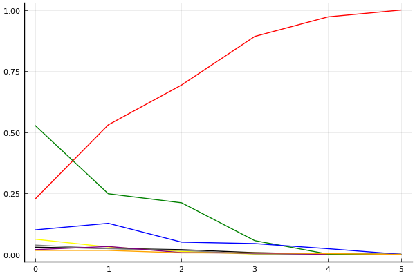
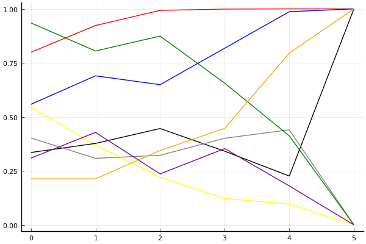

2019 시즌 1 개인전 16강 패자전

## 경기 결과

| 트랙 | 한승철 | 임재원 | 김승태 | 최영훈 | 배성빈 | 유영혁 | 이준성 | 송용준 |
|:---|---:|---:|---:|---:|---:|---:|---:|---:|
| [신화 신들의 세계](../shinsegye) | 0 | 3 | 10 | 1 | 5 | -1 | 7 | 4 |
| [신화 오딘의 궁전](../odin) | 0 | 4 | 10 | 3 | -1 | 7 | 1 | 5 |
| [WKC 투어링 랠리](../rally) | 0 | 1 | 10 | 4 | 5 | -1 | 7 | 3 |
| [월드 두바이 다운타운](../dubai) | 4 | 0 | 10 | 3 | -1 | 1 | 7 | 5 |
| [차이나 서안 병마용](../byeongma) | 5 | 7 | 10 | 3 | 4 | -1 | 0 | 1 |
| __total__ |__9__ |__15__ |__50__ |__14__ |__12__ |__5__ |__22__ |__18__ |

## 시뮬레이션

### 1st 확률

x축: 트랙, y축: 확률
1번: 옐로우, 2번: 블랙, 3번: 레드, 4번: 화이트(회색), 5번: 퍼플, 6번: 그린, 7번: 블루, 8번: 오렌지

| 트랙 | 한승철 | 임재원 | 김승태 | 최영훈 | 배성빈 | 유영혁 | 이준성 | 송용준 |
|:---|---:|---:|---:|---:|---:|---:|---:|---:|
| 초기 | 0.075 | 0.036 | 0.248 | 0.033 | 0.035 | 0.509 | 0.073 | 0.012 |
| 신화 신들의 세계 | 0.024 | 0.033 | 0.501 | 0.027 | 0.046 | 0.244 | 0.132 | 0.011 |
| 신화 오딘의 궁전 | 0.006 | 0.018 | 0.702 | 0.010 | 0.007 | 0.224 | 0.041 | 0.014 |
| WKC 투어링 랠리 | 0.002 | 0.005 | 0.902 | 0.003 | 0.005 | 0.039 | 0.046 | 0.006 |
| 월드 두바이 다운타운 | 0.000 | 0.000 | 0.972 | 0.000 | 0.001 | 0.004 | 0.022 | 0.002 |
| 차이나 서안 병마용 | 0.000 | 0.000 | 1.000 | 0.000 | 0.000 | 0.000 | 0.000 | 0.000 |

### Advance 확률

x축: 트랙, y축: 확률
1번: 옐로우, 2번: 블랙, 3번: 레드, 4번: 화이트(회색), 5번: 퍼플, 6번: 그린, 7번: 블루, 8번: 오렌지

| 트랙 | 한승철 | 임재원 | 김승태 | 최영훈 | 배성빈 | 유영혁 | 이준성 | 송용준 |
|:---|---:|---:|---:|---:|---:|---:|---:|---:|
| 초기 | 0.544 | 0.335 | 0.799 | 0.402 | 0.309 | 0.935 | 0.558 | 0.213 |
| 신화 신들의 세계 | 0.370 | 0.377 | 0.923 | 0.308 | 0.428 | 0.805 | 0.690 | 0.213 |
| 신화 오딘의 궁전 | 0.221 | 0.446 | 0.993 | 0.322 | 0.236 | 0.874 | 0.649 | 0.344 |
| WKC 투어링 랠리 | 0.122 | 0.341 | 0.999 | 0.401 | 0.353 | 0.656 | 0.818 | 0.447 |
| 월드 두바이 다운타운 | 0.096 | 0.226 | 1.000 | 0.440 | 0.180 | 0.412 | 0.987 | 0.795 |
| 차이나 서안 병마용 | 0.000 | 1.000 | 1.000 | 0.000 | 0.000 | 0.000 | 1.000 | 1.000 |

## 랭킹 변동

### [전체 랭킹](../singles-full)

| 순위 | 변동 | 이름 | 점수 | 변동 | mu | 변동 | sigma | 변동 |
|---:|---:|:---:|---:|---:|---:|---:|---:|---:|
| 6 / 69 | +3 | [김승태](../gimseungtae) | 3185 | +70 | 3419 | +71 | 78 | +0 |
| 9 / 69 | -6 | [유영혁](../yuyeonghyeok) | 3158 | -71 | 3390 | -71 | 77 | -0 |
| 14 / 69 | +1 | [이준성](../ijunseong) | 2984 | +14 | 3220 | +12 | 79 | -1 |
| 18 / 69 | -1 | [한승철](../hanseungcheol) | 2908 | -21 | 3164 | -27 | 85 | -2 |
| 19 / 69 | +0 | [최영훈](../choiyeonghun) | 2891 | -1 | 3133 | -5 | 81 | -1 |
| 20 / 69 | +0 | [임재원](../imjaewon) | 2874 | +5 | 3115 | +2 | 80 | -1 |
| 25 / 69 | +3 | [송용준](../songyongjun) | 2745 | +54 | 3030 | +39 | 95 | -5 |
| 26 / 69 | -1 | [배성빈](../baeseongbin) | 2743 | +0 | 3052 | -19 | 103 | -6 |

### 시즌 랭킹

| 순위 | 변동 | 이름 | 점수 | 변동 | mu | 변동 | sigma | 변동 |
|---:|---:|:---:|---:|---:|---:|---:|---:|---:|
| 6 / 32 | +2 | [김승태](../gimseungtae) | 2978 | +175 | 3316 | +154 | 113 | -7 |
| 9 / 32 | +0 | [임재원](../imjaewon) | 2783 | -7 | 3106 | -32 | 107 | -9 |
| 11 / 32 | -1 | [한승철](../hanseungcheol) | 2725 | -37 | 3056 | -65 | 111 | -10 |
| 12 / 32 | +0 | [최영훈](../choiyeonghun) | 2714 | +1 | 3045 | -29 | 110 | -10 |
| 13 / 32 | +5 | [이준성](../ijunseong) | 2585 | +149 | 2996 | +82 | 137 | -22 |
| 14 / 32 | +3 | [송용준](../songyongjun) | 2569 | +119 | 2976 | +49 | 136 | -23 |
| 15 / 32 | -2 | [배성빈](../baeseongbin) | 2539 | +9 | 2935 | -46 | 132 | -18 |
| 19 / 32 | -3 | [유영혁](../yuyeonghyeok) | 2401 | -53 | 2802 | -104 | 134 | -17 |

### 트랙 별 랭킹

#### [WKC 투어링 랠리](../rally)

| 순위 | 변동 | 이름 | 점수 | 변동 | mu | 변동 | sigma | 변동 |
|:---:|:---:|:---:|---:|---:|---:|---:|---:|---:|
| 1 / 34 | +0 | [김승태](../gimseungtae) | 3444 | +66 | 4245 | +38 | 267 | -9 |
| 6 / 34 | +0 | [한승철](../hanseungcheol) | 2262 | -154 | 3153 | -290 | 297 | -45 |
| 8 / 34 | -1 | [임재원](../imjaewon) | 2219 | -56 | 3141 | -217 | 307 | -54 |
| 13 / 34 | -4 | [유영혁](../yuyeonghyeok) | 2133 | -85 | 2777 | -119 | 214 | -11 |
| 18 / 34 | +3 | [최영훈](../choiyeonghun) | 1916 | +203 | 2702 | +112 | 262 | -30 |
| 19 / 34 | +8 | [배성빈](../baeseongbin) | 1821 | +487 | 2845 | +268 | 341 | -73 |
| 25 / 34 | +8 | [이준성](../ijunseong) | 1550 | +1799 | 2968 | +1122 | 473 | -226 |
| 29 / 34 | +3 | [송용준](../songyongjun) | 1426 | +825 | 2672 | +280 | 415 | -182 |

#### [신화 신들의 세계](../shinsegye)

| 순위 | 변동 | 이름 | 점수 | 변동 | mu | 변동 | sigma | 변동 |
|:---:|:---:|:---:|---:|---:|---:|---:|---:|---:|
| 4 / 32 | +0 | [임재원](../imjaewon) | 2574 | +22 | 3502 | -143 | 309 | -55 |
| 5 / 32 | +5 | [배성빈](../baeseongbin) | 2495 | +298 | 3537 | +52 | 347 | -82 |
| 6 / 32 | +10 | [이준성](../ijunseong) | 2380 | +546 | 3459 | +286 | 360 | -87 |
| 7 / 32 | +10 | [김승태](../gimseungtae) | 2364 | +662 | 3418 | +480 | 351 | -61 |
| 8 / 32 | -3 | [한승철](../hanseungcheol) | 2345 | -103 | 3305 | -274 | 320 | -57 |
| 10 / 32 | +3 | [송용준](../songyongjun) | 2263 | +329 | 3292 | +87 | 343 | -81 |
| 14 / 32 | -8 | [유영혁](../yuyeonghyeok) | 2112 | -327 | 3216 | -546 | 368 | -73 |
| 18 / 32 | +2 | [최영훈](../choiyeonghun) | 1855 | +298 | 2818 | +115 | 321 | -61 |

#### [신화 오딘의 궁전](../odin)

| 순위 | 변동 | 이름 | 점수 | 변동 | mu | 변동 | sigma | 변동 |
|:---:|:---:|:---:|---:|---:|---:|---:|---:|---:|
| 8 / 29 | +3 | [송용준](../songyongjun) | 2145 | +258 | 3442 | -321 | 432 | -193 |
| 10 / 29 | -2 | [한승철](../hanseungcheol) | 2033 | -146 | 3025 | -332 | 331 | -62 |
| 11 / 29 | +3 | [유영혁](../yuyeonghyeok) | 1975 | +555 | 3067 | +295 | 364 | -87 |
| 12 / 29 | -6 | [배성빈](../baeseongbin) | 1897 | -384 | 2991 | -599 | 365 | -71 |
| 14 / 29 | +10 | [김승태](../gimseungtae) | 1736 | +974 | 2887 | +718 | 384 | -85 |
| 15 / 29 | +2 | [임재원](../imjaewon) | 1698 | +452 | 2757 | +196 | 353 | -85 |
| 16 / 29 | +0 | [최영훈](../choiyeonghun) | 1663 | +314 | 2666 | +105 | 334 | -69 |
| 20 / 29 | NaN | [이준성](../ijunseong) | 1207 | +1207 | 2729 | -271 | 507 | -493 |

#### [월드 두바이 다운타운](../dubai)

| 순위 | 변동 | 이름 | 점수 | 변동 | mu | 변동 | sigma | 변동 |
|:---:|:---:|:---:|---:|---:|---:|---:|---:|---:|
| 5 / 49 | +0 | [유영혁](../yuyeonghyeok) | 2592 | -45 | 3170 | -79 | 193 | -11 |
| 7 / 49 | +3 | [김승태](../gimseungtae) | 2547 | +125 | 3149 | +97 | 201 | -9 |
| 9 / 49 | -1 | [최영훈](../choiyeonghun) | 2512 | -19 | 3196 | -81 | 228 | -20 |
| 18 / 49 | +5 | [한승철](../hanseungcheol) | 2178 | +123 | 3034 | -9 | 285 | -44 |
| 21 / 49 | -5 | [임재원](../imjaewon) | 2115 | -102 | 2957 | -208 | 281 | -35 |
| 32 / 49 | +4 | [송용준](../songyongjun) | 1658 | +598 | 2688 | +343 | 343 | -85 |
| 33 / 49 | +8 | [이준성](../ijunseong) | 1650 | +798 | 2730 | +512 | 360 | -95 |
| 38 / 49 | -3 | [배성빈](../baeseongbin) | 1008 | -65 | 2171 | -233 | 388 | -56 |

#### [차이나 서안 병마용](../byeongma)

| 순위 | 변동 | 이름 | 점수 | 변동 | mu | 변동 | sigma | 변동 |
|:---:|:---:|:---:|---:|---:|---:|---:|---:|---:|
| 5 / 55 | -2 | [유영혁](../yuyeonghyeok) | 2738 | -77 | 3215 | -92 | 159 | -5 |
| 6 / 55 | +2 | [김승태](../gimseungtae) | 2728 | +119 | 3334 | +91 | 202 | -9 |
| 12 / 55 | -1 | [이준성](../ijunseong) | 2525 | -35 | 3055 | -60 | 177 | -9 |
| 14 / 55 | +0 | [최영훈](../choiyeonghun) | 2483 | +10 | 3182 | -58 | 233 | -23 |
| 18 / 55 | +1 | [임재원](../imjaewon) | 2277 | +154 | 2896 | +112 | 206 | -14 |
| 20 / 55 | +1 | [한승철](../hanseungcheol) | 2216 | +152 | 2895 | +91 | 226 | -20 |
| 21 / 55 | +1 | [배성빈](../baeseongbin) | 2208 | +160 | 3076 | +17 | 289 | -48 |
| 23 / 55 | +1 | [송용준](../songyongjun) | 2022 | +90 | 2768 | +6 | 249 | -28 |
