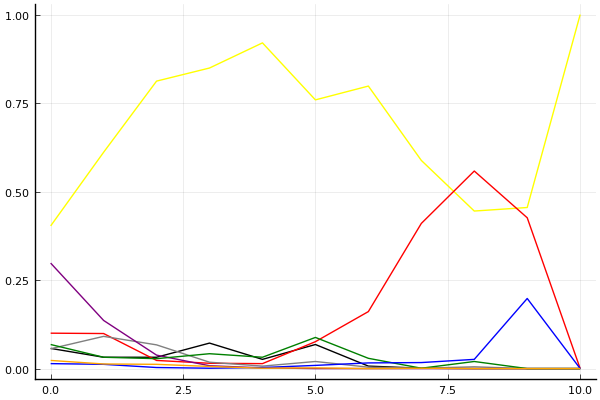
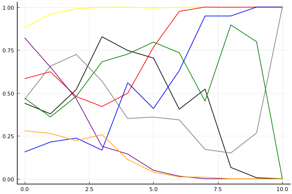

2019 시즌 1 개인전 16강 최종전

## 경기 결과

| 트랙 | 유창현 | 김응태 | 황인호 | 김승래 | 김승태 | 이준성 | 송용준 | 임재원 |
|:---|---:|---:|---:|---:|---:|---:|---:|---:|
| [신화 신들의 세계](../shinsegye) | 10 | 0 | 5 | 7 | -1 | 1 | 4 | 3 |
| [도검 구름의 협곡](../hyupgog) | 10 | 7 | -1 | 4 | 0 | 5 | 3 | 1 |
| [광산 3개의 지름길](../gwangsamji) | 5 | 10 | 3 | 0 | -1 | 7 | 1 | 4 |
| [차이나 서안 병마용](../byeongma) | 7 | 1 | 5 | 0 | 3 | 4 | 10 | -1 |
| [월드 두바이 다운타운](../dubai) | -1 | 4 | 10 | 5 | 0 | 7 | 3 | 1 |
| [대저택 은밀한 지하실](../jeotaek) | 7 | -1 | 10 | 4 | 3 | 1 | 5 | 0 |
| [노르테유 익스프레스](../noex) | 3 | 4 | 10 | 0 | 1 | -1 | 7 | 5 |
| [팩토리 미완성 5구역](../district5) | 1 | -1 | 3 | 7 | 5 | 10 | 4 | 0 |
| [WKC 투어링 랠리](../rally) | 5 | -1 | 4 | 3 | 7 | 0 | 10 | 1 |
| [신화 오딘의 궁전](../odin) | 10 | 1 | 0 | 7 | 4 | -1 | 3 | 5 |
| __total__ |__57__ |__24__ |__49__ |__37__ |__21__ |__33__ |__50__ |__19__ |

## 시뮬레이션

### 1st 확률

x축: 트랙, y축: 확률
1번: 옐로우, 2번: 블랙, 3번: 레드, 4번: 화이트(회색), 5번: 퍼플, 6번: 그린, 7번: 블루, 8번: 오렌지

| 트랙 | 유창현 | 김응태 | 황인호 | 김승래 | 김승태 | 이준성 | 송용준 | 임재원 |
|:---|---:|---:|---:|---:|---:|---:|---:|---:|
| 초기 | 0.403 | 0.057 | 0.100 | 0.056 | 0.298 | 0.068 | 0.014 | 0.023 |
| 신화 신들의 세계 | 0.611 | 0.032 | 0.099 | 0.091 | 0.136 | 0.032 | 0.012 | 0.013 |
| 도검 구름의 협곡 | 0.812 | 0.032 | 0.023 | 0.067 | 0.038 | 0.028 | 0.003 | 0.012 |
| 광산 3개의 지름길 | 0.849 | 0.072 | 0.015 | 0.018 | 0.008 | 0.042 | 0.001 | 0.006 |
| 차이나 서안 병마용 | 0.920 | 0.026 | 0.014 | 0.007 | 0.002 | 0.032 | 0.003 | 0.001 |
| 월드 두바이 다운타운 | 0.759 | 0.068 | 0.076 | 0.020 | 0.000 | 0.088 | 0.009 | 0.002 |
| 대저택 은밀한 지하실 | 0.798 | 0.007 | 0.161 | 0.004 | 0.000 | 0.029 | 0.016 | 0.000 |
| 노르테유 익스프레스 | 0.588 | 0.001 | 0.410 | 0.001 | 0.000 | 0.001 | 0.017 | 0.001 |
| 팩토리 미완성 5구역 | 0.445 | 0.000 | 0.558 | 0.005 | 0.000 | 0.020 | 0.026 | 0.000 |
| WKC 투어링 랠리 | 0.455 | 0.000 | 0.426 | 0.000 | 0.000 | 0.000 | 0.198 | 0.000 |
| 신화 오딘의 궁전 | 1.000 | 0.000 | 0.000 | 0.000 | 0.000 | 0.000 | 0.000 | 0.000 |

### Advance 확률

x축: 트랙, y축: 확률
1번: 옐로우, 2번: 블랙, 3번: 레드, 4번: 화이트(회색), 5번: 퍼플, 6번: 그린, 7번: 블루, 8번: 오렌지

| 트랙 | 유창현 | 김응태 | 황인호 | 김승래 | 김승태 | 이준성 | 송용준 | 임재원 |
|:---|---:|---:|---:|---:|---:|---:|---:|---:|
| 초기 | 0.874 | 0.457 | 0.577 | 0.446 | 0.830 | 0.470 | 0.173 | 0.276 |
| 신화 신들의 세계 | 0.939 | 0.349 | 0.650 | 0.676 | 0.661 | 0.367 | 0.198 | 0.264 |
| 도검 구름의 협곡 | 0.995 | 0.516 | 0.432 | 0.725 | 0.483 | 0.518 | 0.245 | 0.234 |
| 광산 3개의 지름길 | 0.996 | 0.833 | 0.402 | 0.611 | 0.192 | 0.657 | 0.166 | 0.269 |
| 차이나 서안 병마용 | 0.997 | 0.777 | 0.509 | 0.344 | 0.133 | 0.744 | 0.514 | 0.093 |
| 월드 두바이 다운타운 | 0.996 | 0.683 | 0.753 | 0.352 | 0.036 | 0.816 | 0.422 | 0.035 |
| 대저택 은밀한 지하실 | 0.999 | 0.405 | 0.972 | 0.374 | 0.013 | 0.726 | 0.621 | 0.010 |
| 노르테유 익스프레스 | 1.000 | 0.519 | 0.998 | 0.157 | 0.001 | 0.461 | 0.955 | 0.013 |
| 팩토리 미완성 5구역 | 0.999 | 0.066 | 1.000 | 0.147 | 0.000 | 0.898 | 0.952 | 0.000 |
| WKC 투어링 랠리 | 1.000 | 0.007 | 1.000 | 0.267 | 0.000 | 0.802 | 1.000 | 0.000 |
| 신화 오딘의 궁전 | 1.000 | 0.000 | 1.000 | 1.000 | 0.000 | 0.000 | 1.000 | 0.000 |

## 랭킹 변동

### [전체 랭킹](../singles-full)

| 순위 | 변동 | 이름 | 점수 | 변동 | mu | 변동 | sigma | 변동 |
|---:|---:|:---:|---:|---:|---:|---:|---:|---:|
| 3 / 69 | +0 | [유창현](../yuchanghyeon) | 3238 | +15 | 3470 | +14 | 77 | -0 |
| 9 / 69 | -3 | [김승태](../gimseungtae) | 3115 | -70 | 3346 | -73 | 77 | -1 |
| 11 / 69 | +1 | [황인호](../hwanginho) | 3061 | +29 | 3296 | +26 | 78 | -1 |
| 14 / 69 | +1 | [김승래](../gimseungrae) | 2996 | +17 | 3231 | +13 | 78 | -1 |
| 15 / 69 | -1 | [이준성](../ijunseong) | 2978 | -7 | 3211 | -9 | 78 | -1 |
| 18 / 69 | -2 | [김응태](../gimeungtae) | 2905 | -32 | 3165 | -46 | 87 | -5 |
| 20 / 69 | +5 | [송용준](../songyongjun) | 2873 | +128 | 3139 | +109 | 88 | -6 |
| 21 / 69 | -1 | [임재원](../imjaewon) | 2863 | -11 | 3099 | -15 | 79 | -2 |

### 시즌 랭킹

| 순위 | 변동 | 이름 | 점수 | 변동 | mu | 변동 | sigma | 변동 |
|---:|---:|:---:|---:|---:|---:|---:|---:|---:|
| 3 / 32 | +0 | [유창현](../yuchanghyeon) | 3183 | +47 | 3508 | -7 | 108 | -18 |
| 6 / 32 | +2 | [황인호](../hwanginho) | 2973 | +86 | 3283 | +41 | 103 | -15 |
| 7 / 32 | -1 | [김승태](../gimseungtae) | 2911 | -67 | 3210 | -107 | 99 | -13 |
| 8 / 32 | -1 | [김응태](../gimeungtae) | 2863 | -64 | 3181 | -115 | 106 | -17 |
| 9 / 32 | +1 | [김승래](../gimseungrae) | 2836 | +96 | 3146 | +47 | 103 | -17 |
| 10 / 32 | +4 | [송용준](../songyongjun) | 2819 | +250 | 3154 | +178 | 112 | -24 |
| 11 / 32 | -2 | [임재원](../imjaewon) | 2783 | -1 | 3071 | -34 | 96 | -11 |
| 14 / 32 | -1 | [이준성](../ijunseong) | 2711 | +126 | 3050 | +54 | 113 | -24 |

### 트랙 별 랭킹

#### [WKC 투어링 랠리](../rally)

| 순위 | 변동 | 이름 | 점수 | 변동 | mu | 변동 | sigma | 변동 |
|:---:|:---:|:---:|---:|---:|---:|---:|---:|---:|
| 1 / 34 | +0 | [김승태](../gimseungtae) | 3413 | -30 | 4151 | -93 | 246 | -21 |
| 5 / 34 | +0 | [황인호](../hwanginho) | 2588 | +61 | 3353 | -24 | 255 | -28 |
| 6 / 34 | +3 | [김승래](../gimseungrae) | 2282 | +98 | 3158 | -38 | 292 | -45 |
| 9 / 34 | -1 | [임재원](../imjaewon) | 2244 | +24 | 3063 | -78 | 273 | -34 |
| 10 / 34 | +19 | [송용준](../songyongjun) | 2194 | +767 | 3251 | +579 | 352 | -63 |
| 13 / 34 | +3 | [유창현](../yuchanghyeon) | 2162 | +204 | 2837 | +150 | 225 | -18 |
| 22 / 34 | -7 | [김응태](../gimeungtae) | 1742 | -223 | 2808 | -393 | 355 | -57 |
| 24 / 34 | +1 | [이준성](../ijunseong) | 1662 | +112 | 2788 | -181 | 375 | -97 |

#### [광산 3개의 지름길](../gwangsamji)

| 순위 | 변동 | 이름 | 점수 | 변동 | mu | 변동 | sigma | 변동 |
|:---:|:---:|:---:|---:|---:|---:|---:|---:|---:|
| 1 / 18 | +0 | [임재원](../imjaewon) | 2396 | +56 | 3522 | -245 | 375 | -100 |
| 2 / 18 | +5 | [이준성](../ijunseong) | 2276 | +655 | 3548 | +225 | 424 | -143 |
| 3 / 18 | +7 | [김응태](../gimeungtae) | 2251 | +820 | 3452 | +574 | 400 | -82 |
| 7 / 18 | +7 | [유창현](../yuchanghyeon) | 1857 | +872 | 3093 | +441 | 412 | -144 |
| 8 / 18 | +3 | [황인호](../hwanginho) | 1800 | +397 | 3011 | -7 | 404 | -134 |
| 9 / 18 | -4 | [김승래](../gimseungrae) | 1734 | -154 | 2993 | -575 | 420 | -140 |
| 10 / 18 | -4 | [김승태](../gimseungtae) | 1567 | -266 | 2735 | -483 | 389 | -72 |
| 14 / 18 | +2 | [송용준](../songyongjun) | 1288 | +793 | 2603 | +238 | 439 | -185 |

#### [노르테유 익스프레스](../noex)

| 순위 | 변동 | 이름 | 점수 | 변동 | mu | 변동 | sigma | 변동 |
|:---:|:---:|:---:|---:|---:|---:|---:|---:|---:|
| 6 / 68 | -1 | [유창현](../yuchanghyeon) | 3136 | -42 | 3741 | -84 | 202 | -14 |
| 8 / 68 | -1 | [이준성](../ijunseong) | 3014 | -106 | 3554 | -129 | 180 | -8 |
| 10 / 68 | +0 | [김승태](../gimseungtae) | 2850 | -26 | 3476 | -73 | 209 | -16 |
| 12 / 68 | +1 | [김응태](../gimeungtae) | 2743 | +63 | 3420 | +2 | 226 | -21 |
| 14 / 68 | +0 | [송용준](../songyongjun) | 2724 | +168 | 3467 | +91 | 248 | -26 |
| 15 / 68 | +1 | [황인호](../hwanginho) | 2610 | +241 | 3316 | +189 | 235 | -17 |
| 18 / 68 | +4 | [임재원](../imjaewon) | 2265 | +193 | 2910 | +141 | 215 | -17 |
| 20 / 68 | +1 | [김승래](../gimseungrae) | 2239 | +46 | 2859 | +4 | 207 | -14 |

#### [대저택 은밀한 지하실](../jeotaek)

| 순위 | 변동 | 이름 | 점수 | 변동 | mu | 변동 | sigma | 변동 |
|:---:|:---:|:---:|---:|---:|---:|---:|---:|---:|
| 2 / 68 | +2 | [유창현](../yuchanghyeon) | 3111 | +47 | 3660 | +20 | 183 | -9 |
| 3 / 68 | -1 | [김승래](../gimseungrae) | 3087 | -12 | 3661 | -47 | 191 | -11 |
| 10 / 68 | +2 | [황인호](../hwanginho) | 2836 | +148 | 3438 | +118 | 201 | -10 |
| 11 / 68 | -1 | [김승태](../gimseungtae) | 2801 | +2 | 3374 | -32 | 191 | -11 |
| 15 / 68 | +0 | [이준성](../ijunseong) | 2426 | +24 | 3012 | -12 | 195 | -12 |
| 19 / 68 | +1 | [임재원](../imjaewon) | 2215 | +1 | 2909 | -55 | 232 | -19 |
| 21 / 68 | -3 | [김응태](../gimeungtae) | 2164 | -120 | 2935 | -181 | 257 | -21 |
| 28 / 68 | +13 | [송용준](../songyongjun) | 2093 | +437 | 3001 | +277 | 303 | -53 |

#### [도검 구름의 협곡](../hyupgog)

| 순위 | 변동 | 이름 | 점수 | 변동 | mu | 변동 | sigma | 변동 |
|:---:|:---:|:---:|---:|---:|---:|---:|---:|---:|
| 1 / 33 | +0 | [유창현](../yuchanghyeon) | 3153 | +224 | 4224 | +126 | 357 | -32 |
| 5 / 33 | +6 | [이준성](../ijunseong) | 2360 | +283 | 3394 | +59 | 345 | -75 |
| 7 / 33 | +8 | [김응태](../gimeungtae) | 2269 | +420 | 3208 | +283 | 313 | -46 |
| 10 / 33 | +4 | [김승래](../gimseungrae) | 2123 | +248 | 3041 | +95 | 306 | -51 |
| 13 / 33 | -1 | [임재원](../imjaewon) | 2048 | +68 | 2951 | -75 | 301 | -47 |
| 14 / 33 | +4 | [송용준](../songyongjun) | 1937 | +290 | 3053 | -34 | 372 | -108 |
| 15 / 33 | -2 | [김승태](../gimseungtae) | 1914 | +18 | 2762 | -88 | 283 | -35 |
| 16 / 33 | -6 | [황인호](../hwanginho) | 1897 | -191 | 2834 | -306 | 312 | -38 |

#### [신화 신들의 세계](../shinsegye)

| 순위 | 변동 | 이름 | 점수 | 변동 | mu | 변동 | sigma | 변동 |
|:---:|:---:|:---:|---:|---:|---:|---:|---:|---:|
| 1 / 32 | +1 | [유창현](../yuchanghyeon) | 3197 | +338 | 4240 | +212 | 348 | -42 |
| 2 / 32 | +1 | [황인호](../hwanginho) | 2882 | +169 | 3805 | +16 | 308 | -51 |
| 4 / 32 | +0 | [임재원](../imjaewon) | 2651 | +77 | 3472 | -30 | 274 | -36 |
| 5 / 32 | +8 | [김승래](../gimseungrae) | 2632 | +436 | 3591 | +277 | 320 | -53 |
| 6 / 32 | +4 | [송용준](../songyongjun) | 2501 | +238 | 3389 | +97 | 296 | -47 |
| 8 / 32 | -2 | [이준성](../ijunseong) | 2441 | +61 | 3364 | -95 | 307 | -52 |
| 11 / 32 | +1 | [김응태](../gimeungtae) | 2230 | +19 | 3175 | -136 | 315 | -52 |
| 13 / 32 | -6 | [김승태](../gimseungtae) | 2196 | -169 | 3136 | -282 | 314 | -38 |

#### [신화 오딘의 궁전](../odin)

| 순위 | 변동 | 이름 | 점수 | 변동 | mu | 변동 | sigma | 변동 |
|:---:|:---:|:---:|---:|---:|---:|---:|---:|---:|
| 1 / 29 | +1 | [유창현](../yuchanghyeon) | 3160 | +262 | 4168 | +165 | 336 | -32 |
| 3 / 29 | +1 | [김승래](../gimseungrae) | 2805 | +226 | 3785 | +79 | 327 | -49 |
| 6 / 29 | +2 | [송용준](../songyongjun) | 2250 | +105 | 3300 | -142 | 350 | -83 |
| 8 / 29 | -2 | [황인호](../hwanginho) | 2141 | -127 | 3126 | -292 | 328 | -55 |
| 10 / 29 | +5 | [임재원](../imjaewon) | 2095 | +397 | 3012 | +255 | 305 | -47 |
| 11 / 29 | +3 | [김승태](../gimseungtae) | 2071 | +334 | 3039 | +152 | 323 | -61 |
| 14 / 29 | -1 | [김응태](../gimeungtae) | 1912 | +160 | 3103 | -233 | 397 | -131 |
| 22 / 29 | -2 | [이준성](../ijunseong) | 1111 | -95 | 2400 | -329 | 429 | -78 |

#### [월드 두바이 다운타운](../dubai)

| 순위 | 변동 | 이름 | 점수 | 변동 | mu | 변동 | sigma | 변동 |
|:---:|:---:|:---:|---:|---:|---:|---:|---:|---:|
| 4 / 49 | +0 | [유창현](../yuchanghyeon) | 2633 | -87 | 3170 | -108 | 179 | -7 |
| 6 / 49 | +2 | [김응태](../gimeungtae) | 2579 | +35 | 3474 | -119 | 298 | -51 |
| 8 / 49 | +4 | [김승래](../gimseungrae) | 2537 | +134 | 3402 | +1 | 288 | -44 |
| 10 / 49 | -3 | [김승태](../gimseungtae) | 2512 | -35 | 3082 | -67 | 190 | -11 |
| 14 / 49 | +9 | [황인호](../hwanginho) | 2366 | +310 | 3153 | +237 | 262 | -24 |
| 20 / 49 | +1 | [임재원](../imjaewon) | 2175 | +60 | 2932 | -25 | 252 | -28 |
| 24 / 49 | +9 | [이준성](../ijunseong) | 2100 | +450 | 3021 | +291 | 307 | -53 |
| 26 / 49 | +6 | [송용준](../songyongjun) | 1914 | +255 | 2796 | +108 | 294 | -49 |

#### [차이나 서안 병마용](../byeongma)

| 순위 | 변동 | 이름 | 점수 | 변동 | mu | 변동 | sigma | 변동 |
|:---:|:---:|:---:|---:|---:|---:|---:|---:|---:|
| 3 / 55 | +0 | [유창현](../yuchanghyeon) | 2829 | +57 | 3339 | +34 | 170 | -7 |
| 4 / 55 | +0 | [황인호](../hwanginho) | 2801 | +39 | 3341 | +11 | 180 | -9 |
| 6 / 55 | +0 | [김승태](../gimseungtae) | 2726 | -1 | 3298 | -36 | 191 | -12 |
| 10 / 55 | +2 | [이준성](../ijunseong) | 2569 | +44 | 3075 | +20 | 169 | -8 |
| 12 / 55 | -2 | [김승래](../gimseungrae) | 2528 | -33 | 3071 | -59 | 181 | -9 |
| 17 / 55 | +0 | [김응태](../gimeungtae) | 2313 | +20 | 3128 | -91 | 272 | -37 |
| 18 / 55 | +5 | [송용준](../songyongjun) | 2291 | +269 | 2984 | +217 | 231 | -17 |
| 21 / 55 | -3 | [임재원](../imjaewon) | 2215 | -62 | 2808 | -88 | 198 | -9 |

#### [팩토리 미완성 5구역](../district5)

| 순위 | 변동 | 이름 | 점수 | 변동 | mu | 변동 | sigma | 변동 |
|:---:|:---:|:---:|---:|---:|---:|---:|---:|---:|
| 7 / 67 | +2 | [이준성](../ijunseong) | 2888 | +115 | 3468 | +90 | 193 | -8 |
| 8 / 67 | -1 | [유창현](../yuchanghyeon) | 2786 | -43 | 3458 | -102 | 224 | -20 |
| 10 / 67 | +3 | [김승태](../gimseungtae) | 2729 | +78 | 3403 | +19 | 225 | -20 |
| 12 / 67 | -2 | [임재원](../imjaewon) | 2668 | -55 | 3321 | -106 | 218 | -17 |
| 13 / 67 | +2 | [황인호](../hwanginho) | 2593 | +38 | 3268 | -23 | 225 | -20 |
| 15 / 67 | -3 | [김응태](../gimeungtae) | 2543 | -120 | 3235 | -169 | 231 | -16 |
| 20 / 67 | +2 | [김승래](../gimseungrae) | 2393 | +173 | 3019 | +130 | 209 | -15 |
| 27 / 67 | +6 | [송용준](../songyongjun) | 2060 | +294 | 2891 | +170 | 277 | -41 |
