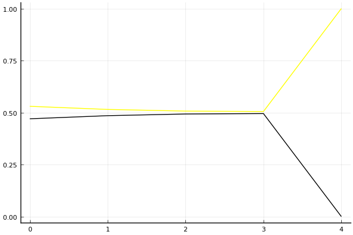

2019 시즌 1 개인전 결승 2라운드

## 경기 결과

| 트랙 | 문호준 | 박인수 |
|:---|---:|---:|
| [월드 두바이 다운타운](../dubai) | 0 | 1 |
| [신화 신들의 세계](../shinsegye) | 1 | 0 |
| [차이나 서안 병마용](../byeongma) | 1 | 0 |
| [도검 구름의 협곡](../hyupgog) | 1 | 0 |
| __total__ |__3__ |__1__ |

## 시뮬레이션

### 1st 확률

x축: 트랙, y축: 확률
1번: 옐로우, 2번: 블랙, 3번: 레드, 4번: 화이트(회색), 5번: 퍼플, 6번: 그린, 7번: 블루, 8번: 오렌지

| 트랙 | 문호준 | 박인수 |
|:---|---:|---:|
| 초기 | 0.530 | 0.470 |
| 월드 두바이 다운타운 | 0.515 | 0.485 |
| 신화 신들의 세계 | 0.507 | 0.493 |
| 차이나 서안 병마용 | 0.505 | 0.495 |
| 도검 구름의 협곡 | 1.000 | 0.000 |

## 랭킹 변동

### [전체 랭킹](../singles-full)

| 순위 | 변동 | 이름 | 점수 | 변동 | mu | 변동 | sigma | 변동 |
|---:|---:|:---:|---:|---:|---:|---:|---:|---:|
| 1 / 69 | +0 | [문호준](../munhojun) | 3435 | +9 | 3672 | +13 | 79 | +1 |
| 2 / 69 | +0 | [박인수](../bakinsu) | 3383 | -17 | 3619 | -13 | 79 | +1 |

### 시즌 랭킹

| 순위 | 변동 | 이름 | 점수 | 변동 | mu | 변동 | sigma | 변동 |
|---:|---:|:---:|---:|---:|---:|---:|---:|---:|
| 1 / 32 | +1 | [문호준](../munhojun) | 3354 | +26 | 3656 | +25 | 101 | -1 |
| 2 / 32 | -1 | [박인수](../bakinsu) | 3337 | -23 | 3642 | -25 | 102 | -1 |

### 트랙 별 랭킹

#### [도검 구름의 협곡](../hyupgog)

| 순위 | 변동 | 이름 | 점수 | 변동 | mu | 변동 | sigma | 변동 |
|:---:|:---:|:---:|---:|---:|---:|---:|---:|---:|
| 1 / 33 | +0 | [문호준](../munhojun) | 3039 | +74 | 3772 | +52 | 244 | -7 |
| 4 / 33 | -1 | [박인수](../bakinsu) | 2751 | -30 | 3476 | -51 | 242 | -7 |

#### [신화 신들의 세계](../shinsegye)

| 순위 | 변동 | 이름 | 점수 | 변동 | mu | 변동 | sigma | 변동 |
|:---:|:---:|:---:|---:|---:|---:|---:|---:|---:|
| 3 / 32 | -1 | [박인수](../bakinsu) | 2770 | -142 | 3657 | -197 | 296 | -18 |
| 14 / 32 | +3 | [문호준](../munhojun) | 2143 | +284 | 3072 | +219 | 310 | -22 |

#### [월드 두바이 다운타운](../dubai)

| 순위 | 변동 | 이름 | 점수 | 변동 | mu | 변동 | sigma | 변동 |
|:---:|:---:|:---:|---:|---:|---:|---:|---:|---:|
| 1 / 49 | +0 | [문호준](../munhojun) | 3175 | -55 | 3785 | -73 | 203 | -6 |
| 2 / 49 | +3 | [박인수](../bakinsu) | 2783 | +97 | 3413 | +78 | 210 | -6 |

#### [차이나 서안 병마용](../byeongma)

| 순위 | 변동 | 이름 | 점수 | 변동 | mu | 변동 | sigma | 변동 |
|:---:|:---:|:---:|---:|---:|---:|---:|---:|---:|
| 1 / 55 | +0 | [문호준](../munhojun) | 3249 | +24 | 3720 | +19 | 157 | -2 |
| 2 / 55 | +0 | [박인수](../bakinsu) | 2925 | -13 | 3368 | -16 | 148 | -1 |
