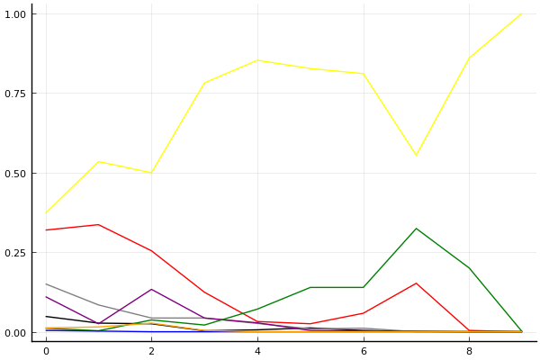

2020 시즌 2 개인전 16강 승자전

## 경기 결과

| 트랙 | 박인수 | 정승하 | 이재혁 | 유영혁 | 노준현 | 박현수 | 최민석 | 송용준 |
|:---|---:|---:|---:|---:|---:|---:|---:|---:|
| [카멜롯 펜드래건 캐슬](../pendragon) | 10 | 1 | 7 | 3 | 0 | 4 | -1 | 5 |
| [동화 이상한 나라의 문](../gate) | 3 | 4 | 1 | 0 | 10 | 7 | -1 | 5 |
| [공동묘지 해골성 대탐험](../skullcastle) | 10 | -1 | 3 | 7 | 1 | 5 | 4 | 0 |
| [[리버스] 해적 로비 절벽의 전투](../rlobby) | 7 | 5 | 1 | 3 | 4 | 10 | -1 | 0 |
| [황금문명 오르에트 황금 좌표](../coordinate) | 5 | 10 | 4 | 1 | -1 | 7 | 0 | 3 |
| [아이스 부서진 빙산](../boobing) | 4 | 1 | 10 | 7 | 5 | 3 | -1 | 0 |
| [아이스 아찔한 헬기 점프](../heli) | 3 | 5 | 10 | -1 | 1 | 7 | 0 | 4 |
| [어비스 숨겨진 바닷길](../hiddenoceanroad) | 7 | 5 | -1 | 4 | 1 | 3 | 0 | 10 |
| [대저택 은밀한 지하실](../jeotaek) | 10 | 1 | 4 | -1 | 7 | 5 | 0 | 3 |
| __total__ |__59__ |__31__ |__39__ |__23__ |__28__ |__51__ |__0__ |__30__ |

## 시뮬레이션

### 1st 확률

x축: 트랙, y축: 확률
1번: 옐로우, 2번: 블랙, 3번: 레드, 4번: 화이트(회색), 5번: 퍼플, 6번: 그린, 7번: 블루, 8번: 오렌지

| 트랙 | 박인수 | 정승하 | 이재혁 | 유영혁 | 노준현 | 박현수 | 최민석 | 송용준 |
|:---|---:|---:|---:|---:|---:|---:|---:|---:|
| 초기 | 0.372 | 0.048 | 0.319 | 0.150 | 0.110 | 0.011 | 0.004 | 0.012 |
| 카멜롯 펜드래건 캐슬 | 0.534 | 0.027 | 0.336 | 0.084 | 0.025 | 0.003 | 0.002 | 0.015 |
| 동화 이상한 나라의 문 | 0.499 | 0.025 | 0.254 | 0.043 | 0.133 | 0.037 | 0.000 | 0.027 |
| 공동묘지 해골성 대탐험 | 0.781 | 0.003 | 0.124 | 0.043 | 0.043 | 0.021 | 0.000 | 0.004 |
| [리버스] 해적 로비 절벽의 전투 | 0.852 | 0.006 | 0.032 | 0.026 | 0.028 | 0.071 | 0.000 | 0.000 |
| 황금문명 오르에트 황금 좌표 | 0.826 | 0.012 | 0.025 | 0.009 | 0.004 | 0.139 | 0.000 | 0.000 |
| 아이스 부서진 빙산 | 0.810 | 0.004 | 0.058 | 0.011 | 0.003 | 0.139 | 0.000 | 0.000 |
| 아이스 아찔한 헬기 점프 | 0.554 | 0.001 | 0.152 | 0.000 | 0.001 | 0.324 | 0.000 | 0.000 |
| 어비스 숨겨진 바닷길 | 0.859 | 0.000 | 0.004 | 0.000 | 0.000 | 0.200 | 0.000 | 0.000 |
| 대저택 은밀한 지하실 | 1.000 | 0.000 | 0.000 | 0.000 | 0.000 | 0.000 | 0.000 | 0.000 |

### Advance 확률

x축: 트랙, y축: 확률
1번: 옐로우, 2번: 블랙, 3번: 레드, 4번: 화이트(회색), 5번: 퍼플, 6번: 그린, 7번: 블루, 8번: 오렌지

| 트랙 | 박인수 | 정승하 | 이재혁 | 유영혁 | 노준현 | 박현수 | 최민석 | 송용준 |
|:---|---:|---:|---:|---:|---:|---:|---:|---:|
| 초기 | 0.888 | 0.472 | 0.863 | 0.710 | 0.634 | 0.191 | 0.113 | 0.211 |
| 카멜롯 펜드래건 캐슬 | 0.978 | 0.422 | 0.936 | 0.690 | 0.421 | 0.241 | 0.068 | 0.332 |
| 동화 이상한 나라의 문 | 0.941 | 0.349 | 0.828 | 0.415 | 0.754 | 0.427 | 0.017 | 0.375 |
| 공동묘지 해골성 대탐험 | 0.994 | 0.160 | 0.836 | 0.652 | 0.637 | 0.540 | 0.023 | 0.262 |
| [리버스] 해적 로비 절벽의 전투 | 1.000 | 0.179 | 0.659 | 0.558 | 0.629 | 0.908 | 0.006 | 0.169 |
| 황금문명 오르에트 황금 좌표 | 0.998 | 0.612 | 0.681 | 0.369 | 0.323 | 0.983 | 0.002 | 0.132 |
| 아이스 부서진 빙산 | 1.000 | 0.358 | 0.908 | 0.519 | 0.308 | 0.983 | 0.000 | 0.027 |
| 아이스 아찔한 헬기 점프 | 0.999 | 0.620 | 0.996 | 0.233 | 0.204 | 1.000 | 0.000 | 0.043 |
| 어비스 숨겨진 바닷길 | 1.000 | 0.707 | 0.998 | 0.148 | 0.038 | 1.000 | 0.000 | 0.244 |
| 대저택 은밀한 지하실 | 1.000 | 1.000 | 1.000 | 0.000 | 0.000 | 1.000 | 0.000 | 0.000 |

## 랭킹 변동

### [전체 랭킹](../singles-full)

| 순위 | 변동 | 이름 | 점수 | 변동 | mu | 변동 | sigma | 변동 |
|---:|---:|:---:|---:|---:|---:|---:|---:|---:|
| 2 / 93 | +0 | [박인수](../bakinsu) | 3379 | +36 | 3609 | +35 | 77 | -0 |
| 3 / 93 | +0 | [이재혁](../ijaehyeok) | 3313 | -16 | 3543 | -16 | 77 | -0 |
| 6 / 93 | -1 | [유영혁](../yuyeonghyeok) | 3176 | -45 | 3405 | -45 | 76 | -0 |
| 7 / 93 | +0 | [정승하](../jeongseungha) | 3117 | +6 | 3347 | +5 | 76 | -0 |
| 10 / 93 | +8 | [박현수](../bakhyeonsu) | 3054 | +85 | 3286 | +83 | 77 | -1 |
| 12 / 93 | +2 | [노준현](../nojunhyeon) | 3027 | +28 | 3379 | -48 | 117 | -25 |
| 14 / 93 | +1 | [송용준](../songyongjun) | 3018 | +22 | 3251 | +19 | 78 | -1 |
| 31 / 93 | -4 | [최민석](../choiminseok) | 2809 | -71 | 3063 | -79 | 85 | -3 |

### 시즌 랭킹

| 순위 | 변동 | 이름 | 점수 | 변동 | mu | 변동 | sigma | 변동 |
|---:|---:|:---:|---:|---:|---:|---:|---:|---:|
| 1 / 32 | +0 | [박인수](../bakinsu) | 3385 | +194 | 3753 | +108 | 123 | -29 |
| 2 / 32 | +1 | [이재혁](../ijaehyeok) | 3202 | +86 | 3570 | -3 | 123 | -30 |
| 3 / 32 | +1 | [정승하](../jeongseungha) | 3136 | +74 | 3500 | -16 | 122 | -30 |
| 4 / 32 | +4 | [박현수](../bakhyeonsu) | 3129 | +297 | 3485 | +214 | 119 | -28 |
| 5 / 32 | -3 | [유영혁](../yuyeonghyeok) | 3076 | -45 | 3455 | -151 | 127 | -35 |
| 6 / 32 | -1 | [노준현](../nojunhyeon) | 3051 | +84 | 3412 | -0 | 120 | -28 |
| 7 / 32 | +0 | [송용준](../songyongjun) | 3035 | +119 | 3389 | +39 | 118 | -27 |
| 9 / 32 | -3 | [최민석](../choiminseok) | 2777 | -141 | 3147 | -222 | 123 | -27 |

### 트랙 별 랭킹

#### [[리버스] 해적 로비 절벽의 전투](../rlobby)

| 순위 | 변동 | 이름 | 점수 | 변동 | mu | 변동 | sigma | 변동 |
|:---:|:---:|:---:|---:|---:|---:|---:|---:|---:|
| 1 / 32 | +2 | [박현수](../bakhyeonsu) | 3230 | +527 | 4467 | +323 | 412 | -68 |
| 2 / 32 | -1 | [노준현](../nojunhyeon) | 2859 | +101 | 4025 | -216 | 388 | -106 |
| 3 / 32 | +4 | [박인수](../bakinsu) | 2773 | +552 | 3865 | +332 | 364 | -73 |
| 7 / 32 | +7 | [정승하](../jeongseungha) | 2478 | +856 | 3777 | +354 | 433 | -167 |
| 8 / 32 | +1 | [유영혁](../yuyeonghyeok) | 2375 | +214 | 3783 | -491 | 470 | -235 |
| 10 / 32 | -2 | [이재혁](../ijaehyeok) | 2253 | +53 | 3410 | -204 | 386 | -86 |
| 18 / 32 | +2 | [송용준](../songyongjun) | 1356 | +266 | 2743 | -120 | 463 | -129 |
| 25 / 32 | +0 | [최민석](../choiminseok) | 695 | -80 | 2221 | -356 | 509 | -92 |

#### [공동묘지 해골성 대탐험](../skullcastle)

| 순위 | 변동 | 이름 | 점수 | 변동 | mu | 변동 | sigma | 변동 |
|:---:|:---:|:---:|---:|---:|---:|---:|---:|---:|
| 2 / 36 | +2 | [박인수](../bakinsu) | 2788 | +246 | 3599 | +179 | 270 | -23 |
| 4 / 36 | +5 | [유영혁](../yuyeonghyeok) | 2615 | +221 | 3461 | +114 | 282 | -36 |
| 5 / 36 | -2 | [이재혁](../ijaehyeok) | 2612 | -5 | 3367 | -85 | 252 | -27 |
| 9 / 36 | +2 | [최민석](../choiminseok) | 2396 | +137 | 3238 | +19 | 281 | -39 |
| 13 / 36 | +7 | [박현수](../bakhyeonsu) | 2176 | +418 | 3179 | +201 | 334 | -72 |
| 18 / 36 | -11 | [정승하](../jeongseungha) | 2096 | -399 | 3173 | -604 | 359 | -68 |
| 21 / 36 | +0 | [노준현](../nojunhyeon) | 1788 | +258 | 2818 | +25 | 343 | -77 |
| 22 / 36 | +0 | [송용준](../songyongjun) | 1675 | +152 | 2704 | -60 | 343 | -71 |

#### [대저택 은밀한 지하실](../jeotaek)

| 순위 | 변동 | 이름 | 점수 | 변동 | mu | 변동 | sigma | 변동 |
|:---:|:---:|:---:|---:|---:|---:|---:|---:|---:|
| 1 / 79 | +1 | [박인수](../bakinsu) | 3317 | +75 | 3800 | +62 | 161 | -4 |
| 2 / 79 | -1 | [유영혁](../yuyeonghyeok) | 3293 | -107 | 3821 | -129 | 176 | -7 |
| 4 / 79 | +0 | [이재혁](../ijaehyeok) | 3076 | +26 | 3624 | -4 | 183 | -10 |
| 11 / 79 | +0 | [정승하](../jeongseungha) | 2837 | +13 | 3353 | -12 | 172 | -8 |
| 13 / 79 | +1 | [송용준](../songyongjun) | 2702 | +61 | 3290 | +24 | 196 | -13 |
| 16 / 79 | +27 | [노준현](../nojunhyeon) | 2558 | +696 | 3733 | +310 | 392 | -129 |
| 17 / 79 | +6 | [박현수](../bakhyeonsu) | 2540 | +248 | 3322 | +153 | 261 | -31 |
| 25 / 79 | -1 | [최민석](../choiminseok) | 2294 | +9 | 3455 | -395 | 387 | -135 |

#### [동화 이상한 나라의 문](../gate)

| 순위 | 변동 | 이름 | 점수 | 변동 | mu | 변동 | sigma | 변동 |
|:---:|:---:|:---:|---:|---:|---:|---:|---:|---:|
| 2 / 41 | +0 | [박인수](../bakinsu) | 3356 | -80 | 4040 | -142 | 228 | -21 |
| 4 / 41 | -1 | [유영혁](../yuyeonghyeok) | 3086 | -125 | 3815 | -197 | 243 | -24 |
| 5 / 41 | +5 | [노준현](../nojunhyeon) | 3050 | +373 | 4155 | +221 | 368 | -51 |
| 9 / 41 | -1 | [최민석](../choiminseok) | 2693 | -117 | 3427 | -174 | 245 | -19 |
| 11 / 41 | +0 | [이재혁](../ijaehyeok) | 2600 | +66 | 3307 | -2 | 236 | -23 |
| 13 / 41 | +2 | [송용준](../songyongjun) | 2518 | +315 | 3414 | +161 | 299 | -51 |
| 15 / 41 | +3 | [정승하](../jeongseungha) | 2330 | +318 | 3198 | +178 | 289 | -47 |
| 17 / 41 | +11 | [박현수](../bakhyeonsu) | 2139 | +630 | 3076 | +465 | 313 | -55 |

#### [아이스 부서진 빙산](../boobing)

| 순위 | 변동 | 이름 | 점수 | 변동 | mu | 변동 | sigma | 변동 |
|:---:|:---:|:---:|---:|---:|---:|---:|---:|---:|
| 1 / 52 | +0 | [유영혁](../yuyeonghyeok) | 3540 | +127 | 4577 | -8 | 346 | -45 |
| 2 / 52 | +8 | [이재혁](../ijaehyeok) | 3286 | +910 | 4875 | +520 | 529 | -130 |
| 5 / 52 | +1 | [박인수](../bakinsu) | 2817 | +121 | 3842 | -69 | 342 | -63 |
| 8 / 52 | -5 | [정승하](../jeongseungha) | 2628 | -293 | 3779 | -551 | 383 | -86 |
| 10 / 52 | +7 | [노준현](../nojunhyeon) | 2478 | +550 | 3545 | +342 | 356 | -69 |
| 17 / 52 | +10 | [박현수](../bakhyeonsu) | 2042 | +552 | 3269 | +178 | 409 | -125 |
| 35 / 52 | -2 | [최민석](../choiminseok) | 936 | -154 | 2222 | -316 | 429 | -54 |
| 41 / 52 | +6 | [송용준](../songyongjun) | 718 | +870 | 2285 | +308 | 523 | -188 |

#### [아이스 아찔한 헬기 점프](../heli)

| 순위 | 변동 | 이름 | 점수 | 변동 | mu | 변동 | sigma | 변동 |
|:---:|:---:|:---:|---:|---:|---:|---:|---:|---:|
| 1 / 39 | +0 | [이재혁](../ijaehyeok) | 3100 | +178 | 3789 | +138 | 230 | -13 |
| 2 / 39 | +4 | [박현수](../bakhyeonsu) | 2895 | +287 | 3957 | +54 | 354 | -78 |
| 3 / 39 | +0 | [박인수](../bakinsu) | 2695 | +47 | 3341 | -2 | 215 | -16 |
| 6 / 39 | -2 | [유영혁](../yuyeonghyeok) | 2516 | -118 | 3224 | -166 | 236 | -16 |
| 8 / 39 | +0 | [노준현](../nojunhyeon) | 2428 | -13 | 3509 | -307 | 360 | -98 |
| 9 / 39 | +8 | [송용준](../songyongjun) | 2426 | +279 | 3413 | +69 | 329 | -70 |
| 13 / 39 | +12 | [정승하](../jeongseungha) | 2311 | +479 | 3308 | +270 | 332 | -70 |
| 14 / 39 | -1 | [최민석](../choiminseok) | 2286 | +27 | 3046 | -49 | 253 | -25 |

#### [어비스 숨겨진 바닷길](../hiddenoceanroad)

| 순위 | 변동 | 이름 | 점수 | 변동 | mu | 변동 | sigma | 변동 |
|:---:|:---:|:---:|---:|---:|---:|---:|---:|---:|
| 3 / 42 | -1 | [이재혁](../ijaehyeok) | 2695 | -184 | 3420 | -243 | 242 | -20 |
| 6 / 42 | +2 | [정승하](../jeongseungha) | 2568 | +140 | 3381 | +34 | 271 | -36 |
| 7 / 42 | +2 | [박인수](../bakinsu) | 2530 | +154 | 3178 | +108 | 216 | -15 |
| 8 / 42 | -1 | [유영혁](../yuyeonghyeok) | 2524 | +69 | 3137 | +27 | 204 | -14 |
| 9 / 42 | +5 | [송용준](../songyongjun) | 2511 | +458 | 3509 | +314 | 333 | -48 |
| 10 / 42 | -4 | [최민석](../choiminseok) | 2477 | -49 | 3197 | -117 | 240 | -23 |
| 18 / 42 | +5 | [노준현](../nojunhyeon) | 1952 | +230 | 3128 | -207 | 392 | -146 |
| 21 / 42 | +9 | [박현수](../bakhyeonsu) | 1857 | +418 | 2887 | +160 | 343 | -86 |

#### [카멜롯 펜드래건 캐슬](../pendragon)

| 순위 | 변동 | 이름 | 점수 | 변동 | mu | 변동 | sigma | 변동 |
|:---:|:---:|:---:|---:|---:|---:|---:|---:|---:|
| 1 / 32 | +3 | [박인수](../bakinsu) | 2831 | +567 | 3955 | +379 | 375 | -62 |
| 2 / 32 | -1 | [유영혁](../yuyeonghyeok) | 2675 | -62 | 3828 | -418 | 384 | -119 |
| 3 / 32 | +2 | [송용준](../songyongjun) | 2576 | +396 | 3683 | +105 | 369 | -97 |
| 4 / 32 | +4 | [이재혁](../ijaehyeok) | 2534 | +622 | 3658 | +343 | 375 | -93 |
| 5 / 32 | -3 | [정승하](../jeongseungha) | 2446 | -42 | 3565 | -338 | 373 | -99 |
| 7 / 32 | +8 | [박현수](../bakhyeonsu) | 2195 | +489 | 3233 | +254 | 346 | -78 |
| 8 / 32 | -1 | [노준현](../nojunhyeon) | 1981 | +57 | 3043 | -145 | 354 | -67 |
| 17 / 32 | +0 | [최민석](../choiminseok) | 1544 | -117 | 2704 | -286 | 387 | -56 |

#### [황금문명 오르에트 황금 좌표](../coordinate)

| 순위 | 변동 | 이름 | 점수 | 변동 | mu | 변동 | sigma | 변동 |
|:---:|:---:|:---:|---:|---:|---:|---:|---:|---:|
| 1 / 29 | +2 | [박인수](../bakinsu) | 2618 | +291 | 3733 | -5 | 372 | -99 |
| 2 / 29 | -1 | [이재혁](../ijaehyeok) | 2606 | +132 | 3720 | -169 | 371 | -100 |
| 3 / 29 | -1 | [송용준](../songyongjun) | 2433 | +59 | 3581 | -273 | 383 | -111 |
| 4 / 29 | +13 | [정승하](../jeongseungha) | 2422 | +1004 | 3701 | +674 | 426 | -110 |
| 5 / 29 | +8 | [박현수](../bakhyeonsu) | 2288 | +671 | 3363 | +432 | 358 | -80 |
| 12 / 29 | -8 | [노준현](../nojunhyeon) | 1874 | -274 | 2997 | -466 | 374 | -64 |
| 15 / 29 | -1 | [최민석](../choiminseok) | 1727 | +119 | 2965 | -265 | 412 | -128 |
| 16 / 29 | +8 | [유영혁](../yuyeonghyeok) | 1627 | +571 | 2841 | +182 | 405 | -130 |
