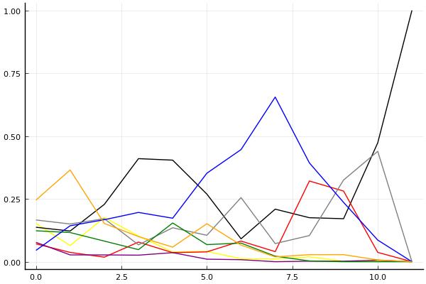
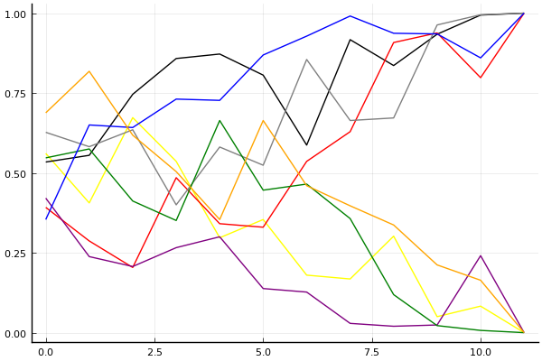

2020 시즌 2 개인전 16강 패자전

## 경기 결과

| 트랙 | 김승래 | 최윤서 | 김지민 | 최영훈 | 한승철 | 김기수 | 우성민 | 배성빈 |
|:---|---:|---:|---:|---:|---:|---:|---:|---:|
| [카멜롯 펜드래건 캐슬](../pendragon) | 0 | 5 | 1 | 3 | -1 | 4 | 10 | 7 |
| [어비스 숨겨진 바닷길](../hiddenoceanroad) | 10 | 7 | 1 | 5 | 3 | 0 | 4 | -1 |
| [공동묘지 해골성 대탐험](../skullcastle) | 0 | 7 | 10 | -1 | 5 | 3 | 4 | 1 |
| [황금문명 오르에트 황금 좌표](../coordinate) | -1 | 4 | 0 | 7 | 5 | 10 | 3 | 1 |
| [[리버스] 해적 로비 절벽의 전투](../rlobby) | 5 | 1 | 4 | 3 | -1 | 0 | 7 | 10 |
| [동화 이상한 나라의 문](../gate) | 0 | -1 | 7 | 10 | 3 | 4 | 5 | 1 |
| [광산 위험한 제련소](../jeryeonso) | 5 | 10 | 4 | -1 | 0 | 1 | 7 | 3 |
| [아이스 아찔한 헬기 점프](../heli) | 7 | 1 | 10 | 5 | 3 | 0 | -1 | 4 |
| [대저택 은밀한 지하실](../jeotaek) | -1 | 5 | 3 | 10 | 7 | 0 | 1 | 4 |
| [아이스 부서진 빙산](../boobing) | 5 | 7 | -1 | 4 | 10 | 3 | 0 | 1 |
| [어비스 숨겨진 바닷길](../hiddenoceanroad) | -1 | 10 | 5 | 1 | 0 | 7 | 4 | 3 |
| __total__ |__29__ |__56__ |__44__ |__46__ |__34__ |__32__ |__44__ |__34__ |

## 시뮬레이션

### 1st 확률

x축: 트랙, y축: 확률
1번: 옐로우, 2번: 블랙, 3번: 레드, 4번: 화이트(회색), 5번: 퍼플, 6번: 그린, 7번: 블루, 8번: 오렌지

| 트랙 | 김승래 | 최윤서 | 김지민 | 최영훈 | 한승철 | 김기수 | 우성민 | 배성빈 |
|:---|---:|---:|---:|---:|---:|---:|---:|---:|
| 초기 | 0.152 | 0.137 | 0.071 | 0.166 | 0.077 | 0.123 | 0.045 | 0.245 |
| 카멜롯 펜드래건 캐슬 | 0.064 | 0.122 | 0.037 | 0.150 | 0.027 | 0.116 | 0.143 | 0.365 |
| 어비스 숨겨진 바닷길 | 0.176 | 0.228 | 0.018 | 0.171 | 0.027 | 0.082 | 0.167 | 0.152 |
| 공동묘지 해골성 대탐험 | 0.102 | 0.410 | 0.078 | 0.067 | 0.026 | 0.048 | 0.196 | 0.100 |
| 황금문명 오르에트 황금 좌표 | 0.039 | 0.404 | 0.036 | 0.135 | 0.036 | 0.154 | 0.173 | 0.058 |
| [리버스] 해적 로비 절벽의 전투 | 0.041 | 0.269 | 0.039 | 0.105 | 0.010 | 0.068 | 0.352 | 0.151 |
| 동화 이상한 나라의 문 | 0.012 | 0.091 | 0.082 | 0.255 | 0.008 | 0.074 | 0.446 | 0.066 |
| 광산 위험한 제련소 | 0.011 | 0.209 | 0.040 | 0.072 | 0.000 | 0.022 | 0.655 | 0.019 |
| 아이스 아찔한 헬기 점프 | 0.019 | 0.175 | 0.321 | 0.104 | 0.002 | 0.003 | 0.393 | 0.028 |
| 대저택 은밀한 지하실 | 0.002 | 0.171 | 0.281 | 0.325 | 0.002 | 0.000 | 0.236 | 0.028 |
| 아이스 부서진 빙산 | 0.003 | 0.473 | 0.037 | 0.439 | 0.006 | 0.000 | 0.086 | 0.007 |
| 어비스 숨겨진 바닷길 | 0.000 | 1.000 | 0.000 | 0.000 | 0.000 | 0.000 | 0.000 | 0.000 |

### Advance 확률

x축: 트랙, y축: 확률
1번: 옐로우, 2번: 블랙, 3번: 레드, 4번: 화이트(회색), 5번: 퍼플, 6번: 그린, 7번: 블루, 8번: 오렌지

| 트랙 | 김승래 | 최윤서 | 김지민 | 최영훈 | 한승철 | 김기수 | 우성민 | 배성빈 |
|:---|---:|---:|---:|---:|---:|---:|---:|---:|
| 초기 | 0.561 | 0.534 | 0.392 | 0.627 | 0.421 | 0.547 | 0.354 | 0.688 |
| 카멜롯 펜드래건 캐슬 | 0.406 | 0.555 | 0.287 | 0.582 | 0.238 | 0.575 | 0.650 | 0.818 |
| 어비스 숨겨진 바닷길 | 0.673 | 0.746 | 0.204 | 0.635 | 0.207 | 0.412 | 0.642 | 0.618 |
| 공동묘지 해골성 대탐험 | 0.536 | 0.858 | 0.485 | 0.400 | 0.266 | 0.351 | 0.731 | 0.504 |
| 황금문명 오르에트 황금 좌표 | 0.297 | 0.872 | 0.341 | 0.581 | 0.300 | 0.664 | 0.727 | 0.354 |
| [리버스] 해적 로비 절벽의 전투 | 0.354 | 0.806 | 0.330 | 0.524 | 0.138 | 0.446 | 0.869 | 0.664 |
| 동화 이상한 나라의 문 | 0.180 | 0.587 | 0.536 | 0.855 | 0.127 | 0.465 | 0.928 | 0.460 |
| 광산 위험한 제련소 | 0.168 | 0.917 | 0.629 | 0.664 | 0.029 | 0.357 | 0.991 | 0.397 |
| 아이스 아찔한 헬기 점프 | 0.302 | 0.836 | 0.908 | 0.672 | 0.020 | 0.119 | 0.937 | 0.337 |
| 대저택 은밀한 지하실 | 0.050 | 0.934 | 0.938 | 0.963 | 0.024 | 0.022 | 0.935 | 0.212 |
| 아이스 부서진 빙산 | 0.083 | 0.994 | 0.798 | 0.995 | 0.241 | 0.007 | 0.860 | 0.164 |
| 어비스 숨겨진 바닷길 | 0.000 | 1.000 | 1.000 | 1.000 | 0.000 | 0.000 | 1.000 | 0.000 |

## 랭킹 변동

### [전체 랭킹](../singles-full)

| 순위 | 변동 | 이름 | 점수 | 변동 | mu | 변동 | sigma | 변동 |
|---:|---:|:---:|---:|---:|---:|---:|---:|---:|
| 17 / 93 | -2 | [배성빈](../baeseongbin) | 2983 | -28 | 3212 | -30 | 76 | -1 |
| 18 / 93 | +1 | [최영훈](../choiyeonghun) | 2972 | +4 | 3200 | +4 | 76 | +0 |
| 21 / 93 | +4 | [최윤서](../choiyunseo) | 2950 | +68 | 3203 | +56 | 84 | -4 |
| 24 / 93 | -2 | [김기수](../gimgisu) | 2909 | -16 | 3140 | -19 | 77 | -1 |
| 25 / 93 | -4 | [김승래](../gimseungrae) | 2906 | -38 | 3134 | -37 | 76 | +0 |
| 27 / 93 | +3 | [김지민](../gimjimin) | 2874 | +40 | 3127 | +27 | 84 | -4 |
| 28 / 93 | -1 | [한승철](../hanseungcheol) | 2869 | -7 | 3099 | -8 | 77 | -0 |
| 31 / 93 | +2 | [우성민](../useongmin) | 2840 | +60 | 3107 | +37 | 89 | -8 |

### 시즌 랭킹

| 순위 | 변동 | 이름 | 점수 | 변동 | mu | 변동 | sigma | 변동 |
|---:|---:|:---:|---:|---:|---:|---:|---:|---:|
| 8 / 32 | +5 | [최윤서](../choiyunseo) | 2931 | +163 | 3278 | +71 | 115 | -31 |
| 9 / 32 | -1 | [최영훈](../choiyeonghun) | 2885 | +54 | 3194 | +3 | 103 | -17 |
| 10 / 32 | +1 | [김지민](../gimjimin) | 2849 | +74 | 3162 | +18 | 104 | -19 |
| 11 / 32 | -1 | [한승철](../hanseungcheol) | 2794 | +19 | 3099 | -29 | 101 | -16 |
| 13 / 32 | +1 | [김기수](../gimgisu) | 2761 | +46 | 3102 | -46 | 114 | -31 |
| 14 / 32 | -2 | [김승래](../gimseungrae) | 2761 | -13 | 3066 | -59 | 102 | -15 |
| 15 / 32 | +2 | [우성민](../useongmin) | 2743 | +189 | 3095 | +84 | 117 | -35 |
| 16 / 32 | -1 | [배성빈](../baeseongbin) | 2722 | +108 | 3072 | +3 | 117 | -35 |

### 트랙 별 랭킹

#### [[리버스] 해적 로비 절벽의 전투](../rlobby)

| 순위 | 변동 | 이름 | 점수 | 변동 | mu | 변동 | sigma | 변동 |
|:---:|:---:|:---:|---:|---:|---:|---:|---:|---:|
| 8 / 32 | +1 | [김지민](../gimjimin) | 2370 | +62 | 3311 | -109 | 314 | -57 |
| 10 / 32 | +1 | [최영훈](../choiyeonghun) | 2182 | +65 | 3162 | -131 | 327 | -65 |
| 11 / 32 | -5 | [한승철](../hanseungcheol) | 2016 | -508 | 3142 | -738 | 375 | -77 |
| 12 / 32 | +7 | [우성민](../useongmin) | 1922 | +624 | 3009 | +355 | 362 | -90 |
| 13 / 32 | -1 | [최윤서](../choiyunseo) | 1857 | -30 | 3150 | -613 | 431 | -194 |
| 15 / 32 | +5 | [김승래](../gimseungrae) | 1782 | +657 | 2900 | +332 | 372 | -108 |
| 16 / 32 | +10 | [배성빈](../baeseongbin) | 1663 | +1292 | 2907 | +931 | 415 | -120 |
| 23 / 32 | +5 | [김기수](../gimgisu) | 1069 | +708 | 2392 | +155 | 441 | -184 |

#### [공동묘지 해골성 대탐험](../skullcastle)

| 순위 | 변동 | 이름 | 점수 | 변동 | mu | 변동 | sigma | 변동 |
|:---:|:---:|:---:|---:|---:|---:|---:|---:|---:|
| 7 / 36 | -4 | [최영훈](../choiyeonghun) | 2402 | -216 | 3265 | -316 | 288 | -33 |
| 9 / 36 | -1 | [김승래](../gimseungrae) | 2378 | -90 | 3268 | -229 | 297 | -46 |
| 10 / 36 | +0 | [김기수](../gimgisu) | 2364 | +93 | 3226 | -41 | 287 | -45 |
| 11 / 36 | +3 | [한승철](../hanseungcheol) | 2360 | +214 | 3182 | +103 | 274 | -37 |
| 12 / 36 | +5 | [우성민](../useongmin) | 2329 | +212 | 3380 | -66 | 350 | -93 |
| 13 / 36 | +7 | [김지민](../gimjimin) | 2301 | +484 | 3242 | +355 | 314 | -43 |
| 19 / 36 | +0 | [배성빈](../baeseongbin) | 2117 | +126 | 3017 | -27 | 300 | -51 |
| 21 / 36 | +3 | [최윤서](../choiyunseo) | 2061 | +656 | 3116 | +398 | 352 | -86 |

#### [광산 위험한 제련소](../jeryeonso)

| 순위 | 변동 | 이름 | 점수 | 변동 | mu | 변동 | sigma | 변동 |
|:---:|:---:|:---:|---:|---:|---:|---:|---:|---:|
| 12 / 57 | +1 | [배성빈](../baeseongbin) | 2480 | -7 | 3304 | -118 | 274 | -37 |
| 14 / 57 | -7 | [최영훈](../choiyeonghun) | 2441 | -252 | 3238 | -329 | 266 | -26 |
| 16 / 57 | +0 | [김승래](../gimseungrae) | 2391 | +93 | 2967 | +60 | 192 | -11 |
| 17 / 57 | +0 | [김지민](../gimjimin) | 2382 | +99 | 3242 | -32 | 286 | -44 |
| 18 / 57 | +12 | [최윤서](../choiyunseo) | 2223 | +562 | 3253 | +398 | 344 | -55 |
| 22 / 57 | -1 | [김기수](../gimgisu) | 2140 | -2 | 3115 | -200 | 325 | -66 |
| 28 / 57 | +18 | [우성민](../useongmin) | 1876 | +1091 | 3137 | +575 | 420 | -172 |
| 38 / 57 | +3 | [한승철](../hanseungcheol) | 1401 | +206 | 2233 | +105 | 277 | -34 |

#### [대저택 은밀한 지하실](../jeotaek)

| 순위 | 변동 | 이름 | 점수 | 변동 | mu | 변동 | sigma | 변동 |
|:---:|:---:|:---:|---:|---:|---:|---:|---:|---:|
| 4 / 79 | +2 | [최영훈](../choiyeonghun) | 3110 | +147 | 3746 | +113 | 212 | -11 |
| 6 / 79 | -1 | [김승래](../gimseungrae) | 2975 | -61 | 3429 | -73 | 151 | -4 |
| 7 / 79 | +2 | [한승철](../hanseungcheol) | 2974 | +95 | 3534 | +67 | 186 | -9 |
| 13 / 79 | +2 | [최윤서](../choiyunseo) | 2787 | +199 | 3789 | -24 | 334 | -75 |
| 16 / 79 | +4 | [김지민](../gimjimin) | 2573 | +96 | 3443 | -41 | 290 | -46 |
| 18 / 79 | +5 | [배성빈](../baeseongbin) | 2550 | +151 | 3291 | +73 | 247 | -26 |
| 21 / 79 | -2 | [김기수](../gimgisu) | 2492 | -24 | 3288 | -117 | 265 | -31 |
| 31 / 79 | +7 | [우성민](../useongmin) | 2158 | +227 | 3187 | -23 | 343 | -83 |

#### [동화 이상한 나라의 문](../gate)

| 순위 | 변동 | 이름 | 점수 | 변동 | mu | 변동 | sigma | 변동 |
|:---:|:---:|:---:|---:|---:|---:|---:|---:|---:|
| 8 / 41 | +0 | [배성빈](../baeseongbin) | 2781 | -133 | 3523 | -211 | 247 | -26 |
| 11 / 41 | +3 | [최영훈](../choiyeonghun) | 2608 | +177 | 3296 | +134 | 229 | -14 |
| 13 / 41 | -1 | [한승철](../hanseungcheol) | 2523 | +2 | 3239 | -69 | 239 | -24 |
| 16 / 41 | +2 | [우성민](../useongmin) | 2291 | +187 | 3110 | +76 | 273 | -37 |
| 19 / 41 | +1 | [김기수](../gimgisu) | 2134 | +161 | 2881 | +78 | 249 | -28 |
| 20 / 41 | +5 | [김지민](../gimjimin) | 2048 | +424 | 2957 | +275 | 303 | -50 |
| 21 / 41 | -2 | [김승래](../gimseungrae) | 2007 | -32 | 2835 | -126 | 276 | -31 |
| 32 / 41 | +0 | [최윤서](../choiyunseo) | 1184 | -53 | 2206 | -156 | 341 | -34 |

#### [아이스 부서진 빙산](../boobing)

| 순위 | 변동 | 이름 | 점수 | 변동 | mu | 변동 | sigma | 변동 |
|:---:|:---:|:---:|---:|---:|---:|---:|---:|---:|
| 3 / 52 | +0 | [김승래](../gimseungrae) | 3083 | -2 | 4182 | -255 | 366 | -84 |
| 6 / 52 | +7 | [최윤서](../choiyunseo) | 2806 | +479 | 4052 | +78 | 415 | -134 |
| 10 / 52 | -1 | [최영훈](../choiyeonghun) | 2620 | +126 | 3565 | -17 | 315 | -48 |
| 11 / 52 | +7 | [한승철](../hanseungcheol) | 2580 | +579 | 3556 | +450 | 325 | -43 |
| 18 / 52 | +5 | [김기수](../gimgisu) | 1992 | +327 | 3262 | -105 | 423 | -144 |
| 20 / 52 | -5 | [김지민](../gimjimin) | 1882 | -269 | 2860 | -389 | 326 | -40 |
| 28 / 52 | +8 | [배성빈](../baeseongbin) | 1390 | +578 | 2673 | +144 | 428 | -145 |
| 31 / 52 | +3 | [우성민](../useongmin) | 1235 | +290 | 2287 | +102 | 351 | -63 |

#### [아이스 아찔한 헬기 점프](../heli)

| 순위 | 변동 | 이름 | 점수 | 변동 | mu | 변동 | sigma | 변동 |
|:---:|:---:|:---:|---:|---:|---:|---:|---:|---:|
| 5 / 39 | +6 | [김승래](../gimseungrae) | 2579 | +172 | 3479 | +40 | 300 | -44 |
| 11 / 39 | -7 | [최윤서](../choiyunseo) | 2396 | -260 | 3453 | -539 | 352 | -93 |
| 12 / 39 | +11 | [김지민](../gimjimin) | 2358 | +397 | 3274 | +289 | 305 | -36 |
| 14 / 39 | -2 | [김기수](../gimgisu) | 2286 | -79 | 3044 | -155 | 253 | -25 |
| 18 / 39 | +2 | [최영훈](../choiyeonghun) | 2242 | +154 | 2955 | +87 | 238 | -22 |
| 22 / 39 | +0 | [한승철](../hanseungcheol) | 2097 | +103 | 2837 | +24 | 247 | -26 |
| 26 / 39 | +3 | [배성빈](../baeseongbin) | 1732 | +323 | 2569 | +203 | 279 | -40 |
| 28 / 39 | -2 | [우성민](../useongmin) | 1572 | -107 | 2535 | -219 | 321 | -37 |

#### [어비스 숨겨진 바닷길](../hiddenoceanroad)

| 순위 | 변동 | 이름 | 점수 | 변동 | mu | 변동 | sigma | 변동 |
|:---:|:---:|:---:|---:|---:|---:|---:|---:|---:|
| 10 / 42 | -5 | [배성빈](../baeseongbin) | 2382 | -231 | 3101 | -385 | 240 | -51 |
| 11 / 42 | +1 | [최영훈](../choiyeonghun) | 2377 | +61 | 3091 | -101 | 238 | -54 |
| 13 / 42 | +17 | [최윤서](../choiyunseo) | 2302 | +749 | 3159 | +494 | 285 | -85 |
| 14 / 42 | +1 | [김기수](../gimgisu) | 2169 | +166 | 2823 | +56 | 218 | -37 |
| 16 / 42 | +8 | [우성민](../useongmin) | 2133 | +379 | 2972 | +56 | 280 | -108 |
| 17 / 42 | +3 | [김승래](../gimseungrae) | 2078 | +199 | 2920 | -7 | 281 | -69 |
| 21 / 42 | +1 | [한승철](../hanseungcheol) | 1966 | +128 | 2657 | -12 | 231 | -47 |
| 23 / 42 | +8 | [김지민](../gimjimin) | 1941 | +553 | 2828 | +147 | 295 | -135 |

#### [카멜롯 펜드래건 캐슬](../pendragon)

| 순위 | 변동 | 이름 | 점수 | 변동 | mu | 변동 | sigma | 변동 |
|:---:|:---:|:---:|---:|---:|---:|---:|---:|---:|
| 6 / 32 | +9 | [배성빈](../baeseongbin) | 2296 | +491 | 3421 | +214 | 375 | -92 |
| 7 / 32 | +12 | [우성민](../useongmin) | 2284 | +799 | 3513 | +533 | 410 | -88 |
| 9 / 32 | -3 | [김승래](../gimseungrae) | 2166 | -144 | 3103 | -294 | 312 | -50 |
| 10 / 32 | +4 | [김기수](../gimgisu) | 2122 | +265 | 3174 | +10 | 351 | -85 |
| 11 / 32 | -2 | [최영훈](../choiyeonghun) | 2098 | +139 | 3014 | -15 | 305 | -51 |
| 12 / 32 | +8 | [최윤서](../choiyunseo) | 1997 | +550 | 3102 | +254 | 368 | -99 |
| 13 / 32 | -3 | [김지민](../gimjimin) | 1985 | +88 | 2894 | -58 | 303 | -49 |
| 20 / 32 | -2 | [한승철](../hanseungcheol) | 1439 | -96 | 2450 | -216 | 337 | -40 |

#### [황금문명 오르에트 황금 좌표](../coordinate)

| 순위 | 변동 | 이름 | 점수 | 변동 | mu | 변동 | sigma | 변동 |
|:---:|:---:|:---:|---:|---:|---:|---:|---:|---:|
| 6 / 29 | +7 | [한승철](../hanseungcheol) | 2080 | +230 | 3061 | +33 | 327 | -65 |
| 7 / 29 | -1 | [우성민](../useongmin) | 2034 | +11 | 3131 | -297 | 366 | -103 |
| 10 / 29 | +12 | [김기수](../gimgisu) | 1921 | +695 | 3046 | +476 | 375 | -73 |
| 15 / 29 | -8 | [김지민](../gimjimin) | 1784 | -187 | 2906 | -479 | 374 | -97 |
| 16 / 29 | +5 | [최윤서](../choiyunseo) | 1730 | +442 | 2871 | +80 | 380 | -121 |
| 18 / 29 | -1 | [배성빈](../baeseongbin) | 1682 | +140 | 2769 | -143 | 362 | -95 |
| 20 / 29 | +7 | [최영훈](../choiyeonghun) | 1459 | +868 | 2537 | +602 | 359 | -89 |
| 23 / 29 | -5 | [김승래](../gimseungrae) | 1321 | -126 | 2358 | -263 | 346 | -45 |
