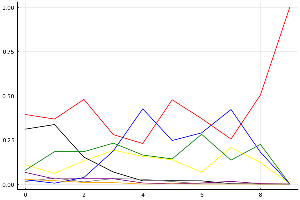

2020 시즌 2 개인전 16강 최종전

## 경기 결과

| 트랙 | 송용준 | 노준현 | 유영혁 | 최민석 | 최윤서 | 최영훈 | 김지민 | 우성민 |
|:---|---:|---:|---:|---:|---:|---:|---:|---:|
| [카멜롯 펜드래건 캐슬](../pendragon) | 1 | 4 | 5 | 7 | 0 | 10 | -1 | 3 |
| [광산 위험한 제련소](../jeryeonso) | 7 | 0 | 5 | -1 | 4 | 3 | 10 | 1 |
| [황금문명 오르에트 황금 좌표](../coordinate) | 5 | 0 | -1 | 7 | 3 | 4 | 10 | 1 |
| [[리버스] 해적 로비 절벽의 전투](../rlobby) | 5 | 0 | 7 | 3 | 1 | 4 | 10 | -1 |
| [공동묘지 해골성 대탐험](../skullcastle) | 5 | 7 | 10 | 3 | 0 | 4 | 1 | -1 |
| [동화 이상한 나라의 문](../gate) | 1 | 5 | 3 | 0 | 10 | 7 | 4 | -1 |
| [어비스 숨겨진 바닷길](../hiddenoceanroad) | 10 | 0 | 3 | 4 | 7 | 1 | 5 | -1 |
| [아이스 부서진 빙산](../boobing) | 3 | 4 | 10 | 5 | 0 | 7 | 1 | -5 |
| [대저택 은밀한 지하실](../jeotaek) | 4 | 5 | 10 | 3 | 0 | 1 | -1 | 7 |
| __total__ |__41__ |__25__ |__52__ |__31__ |__25__ |__41__ |__39__ |__3__ |

## 시뮬레이션

### 1st 확률

x축: 트랙, y축: 확률
1번: 옐로우, 2번: 블랙, 3번: 레드, 4번: 화이트(회색), 5번: 퍼플, 6번: 그린, 7번: 블루, 8번: 오렌지

| 트랙 | 송용준 | 노준현 | 유영혁 | 최민석 | 최윤서 | 최영훈 | 김지민 | 우성민 |
|:---|---:|---:|---:|---:|---:|---:|---:|---:|
| 초기 | 0.109 | 0.310 | 0.393 | 0.014 | 0.066 | 0.077 | 0.024 | 0.026 |
| 카멜롯 펜드래건 캐슬 | 0.060 | 0.336 | 0.367 | 0.034 | 0.029 | 0.183 | 0.005 | 0.019 |
| 광산 위험한 제련소 | 0.131 | 0.152 | 0.478 | 0.012 | 0.030 | 0.183 | 0.037 | 0.009 |
| 황금문명 오르에트 황금 좌표 | 0.191 | 0.068 | 0.279 | 0.031 | 0.030 | 0.231 | 0.187 | 0.008 |
| [리버스] 해적 로비 절벽의 전투 | 0.156 | 0.018 | 0.229 | 0.027 | 0.006 | 0.164 | 0.425 | 0.000 |
| 공동묘지 해골성 대탐험 | 0.137 | 0.019 | 0.476 | 0.014 | 0.001 | 0.142 | 0.246 | 0.001 |
| 동화 이상한 나라의 문 | 0.067 | 0.018 | 0.370 | 0.001 | 0.006 | 0.281 | 0.289 | 0.000 |
| 어비스 숨겨진 바닷길 | 0.207 | 0.002 | 0.254 | 0.001 | 0.015 | 0.135 | 0.421 | 0.000 |
| 아이스 부서진 빙산 | 0.121 | 0.000 | 0.503 | 0.001 | 0.002 | 0.224 | 0.180 | 0.000 |
| 대저택 은밀한 지하실 | 0.000 | 0.000 | 1.000 | 0.000 | 0.000 | 0.000 | 0.000 | 0.000 |

### Advance 확률

x축: 트랙, y축: 확률
1번: 옐로우, 2번: 블랙, 3번: 레드, 4번: 화이트(회색), 5번: 퍼플, 6번: 그린, 7번: 블루, 8번: 오렌지

| 트랙 | 송용준 | 노준현 | 유영혁 | 최민석 | 최윤서 | 최영훈 | 김지민 | 우성민 |
|:---|---:|---:|---:|---:|---:|---:|---:|---:|
| 초기 | 0.586 | 0.812 | 0.873 | 0.191 | 0.526 | 0.505 | 0.312 | 0.297 |
| 카멜롯 펜드래건 캐슬 | 0.478 | 0.853 | 0.888 | 0.346 | 0.342 | 0.780 | 0.153 | 0.271 |
| 광산 위험한 제련소 | 0.649 | 0.680 | 0.921 | 0.204 | 0.324 | 0.750 | 0.403 | 0.201 |
| 황금문명 오르에트 황금 좌표 | 0.688 | 0.411 | 0.739 | 0.330 | 0.312 | 0.777 | 0.759 | 0.104 |
| [리버스] 해적 로비 절벽의 전투 | 0.754 | 0.183 | 0.833 | 0.353 | 0.184 | 0.797 | 0.948 | 0.034 |
| 공동묘지 해골성 대탐험 | 0.801 | 0.263 | 0.958 | 0.267 | 0.070 | 0.807 | 0.921 | 0.006 |
| 동화 이상한 나라의 문 | 0.668 | 0.268 | 0.953 | 0.130 | 0.212 | 0.946 | 0.935 | 0.000 |
| 어비스 숨겨진 바닷길 | 0.903 | 0.064 | 0.915 | 0.126 | 0.277 | 0.847 | 0.962 | 0.000 |
| 아이스 부서진 빙산 | 0.949 | 0.015 | 0.998 | 0.081 | 0.063 | 0.975 | 0.974 | 0.000 |
| 대저택 은밀한 지하실 | 1.000 | 0.000 | 1.000 | 0.000 | 0.000 | 1.000 | 1.000 | 0.000 |

## 랭킹 변동

### [전체 랭킹](../singles-full)

| 순위 | 변동 | 이름 | 점수 | 변동 | mu | 변동 | sigma | 변동 |
|---:|---:|:---:|---:|---:|---:|---:|---:|---:|
| 6 / 93 | +0 | [유영혁](../yuyeonghyeok) | 3195 | +19 | 3425 | +19 | 76 | +0 |
| 11 / 93 | +3 | [송용준](../songyongjun) | 3044 | +26 | 3275 | +24 | 77 | -1 |
| 15 / 93 | +3 | [최영훈](../choiyeonghun) | 3001 | +29 | 3229 | +28 | 76 | -0 |
| 16 / 93 | -4 | [노준현](../nojunhyeon) | 2993 | -34 | 3302 | -77 | 103 | -14 |
| 21 / 93 | +0 | [최윤서](../choiyunseo) | 2938 | -12 | 3183 | -20 | 82 | -2 |
| 25 / 93 | +2 | [김지민](../gimjimin) | 2908 | +33 | 3154 | +27 | 82 | -2 |
| 31 / 93 | +1 | [최민석](../choiminseok) | 2842 | +33 | 3088 | +25 | 82 | -3 |
| 34 / 93 | -3 | [우성민](../useongmin) | 2767 | -72 | 3026 | -82 | 86 | -3 |

### 시즌 랭킹

| 순위 | 변동 | 이름 | 점수 | 변동 | mu | 변동 | sigma | 변동 |
|---:|---:|:---:|---:|---:|---:|---:|---:|---:|
| 3 / 32 | +2 | [유영혁](../yuyeonghyeok) | 3167 | +91 | 3496 | +41 | 110 | -17 |
| 6 / 32 | +1 | [송용준](../songyongjun) | 3095 | +60 | 3406 | +17 | 103 | -14 |
| 7 / 32 | -1 | [노준현](../nojunhyeon) | 3023 | -28 | 3337 | -74 | 105 | -16 |
| 8 / 32 | +1 | [최영훈](../choiyeonghun) | 2972 | +87 | 3255 | +61 | 94 | -9 |
| 9 / 32 | -1 | [최윤서](../choiyunseo) | 2932 | +1 | 3239 | -38 | 102 | -13 |
| 10 / 32 | +0 | [김지민](../gimjimin) | 2918 | +69 | 3206 | +44 | 96 | -8 |
| 11 / 32 | +1 | [최민석](../choiminseok) | 2859 | +82 | 3179 | +32 | 107 | -17 |
| 16 / 32 | -1 | [우성민](../useongmin) | 2676 | -67 | 2991 | -104 | 105 | -12 |

### 트랙 별 랭킹

#### [[리버스] 해적 로비 절벽의 전투](../rlobby)

| 순위 | 변동 | 이름 | 점수 | 변동 | mu | 변동 | sigma | 변동 |
|:---:|:---:|:---:|---:|---:|---:|---:|---:|---:|
| 5 / 32 | +3 | [김지민](../gimjimin) | 2684 | +314 | 3545 | +234 | 287 | -27 |
| 6 / 32 | +1 | [유영혁](../yuyeonghyeok) | 2659 | +284 | 3788 | +5 | 377 | -93 |
| 7 / 32 | -5 | [노준현](../nojunhyeon) | 2546 | -313 | 3526 | -499 | 327 | -62 |
| 9 / 32 | +1 | [최영훈](../choiyeonghun) | 2329 | +147 | 3187 | +25 | 286 | -40 |
| 12 / 32 | +1 | [최윤서](../choiyunseo) | 1990 | +133 | 3034 | -116 | 348 | -83 |
| 13 / 32 | +8 | [송용준](../songyongjun) | 1979 | +623 | 3077 | +334 | 366 | -96 |
| 15 / 32 | -3 | [우성민](../useongmin) | 1794 | -129 | 2762 | -246 | 323 | -39 |
| 19 / 32 | +8 | [최민석](../choiminseok) | 1485 | +790 | 2637 | +415 | 384 | -125 |

#### [공동묘지 해골성 대탐험](../skullcastle)

| 순위 | 변동 | 이름 | 점수 | 변동 | mu | 변동 | sigma | 변동 |
|:---:|:---:|:---:|---:|---:|---:|---:|---:|---:|
| 2 / 36 | +1 | [유영혁](../yuyeonghyeok) | 2811 | +196 | 3598 | +137 | 262 | -20 |
| 7 / 36 | +0 | [최영훈](../choiyeonghun) | 2483 | +80 | 3254 | -11 | 257 | -31 |
| 8 / 36 | +0 | [최민석](../choiminseok) | 2439 | +42 | 3195 | -43 | 252 | -29 |
| 12 / 36 | +1 | [김지민](../gimjimin) | 2312 | +11 | 3139 | -102 | 276 | -38 |
| 15 / 36 | +7 | [노준현](../nojunhyeon) | 2177 | +388 | 3070 | +252 | 298 | -45 |
| 20 / 36 | -8 | [우성민](../useongmin) | 2113 | -216 | 3042 | -338 | 309 | -41 |
| 22 / 36 | -1 | [최윤서](../choiyunseo) | 2056 | -5 | 2965 | -151 | 303 | -49 |
| 23 / 36 | +0 | [송용준](../songyongjun) | 2036 | +361 | 2920 | +216 | 295 | -48 |

#### [광산 위험한 제련소](../jeryeonso)

| 순위 | 변동 | 이름 | 점수 | 변동 | mu | 변동 | sigma | 변동 |
|:---:|:---:|:---:|---:|---:|---:|---:|---:|---:|
| 3 / 57 | +0 | [유영혁](../yuyeonghyeok) | 3109 | +9 | 3700 | -26 | 197 | -12 |
| 8 / 57 | +9 | [김지민](../gimjimin) | 2661 | +279 | 3452 | +210 | 264 | -23 |
| 10 / 57 | +3 | [송용준](../songyongjun) | 2643 | +198 | 3420 | +115 | 259 | -28 |
| 15 / 57 | -1 | [최영훈](../choiyeonghun) | 2471 | +30 | 3200 | -38 | 243 | -23 |
| 18 / 57 | +0 | [최윤서](../choiyunseo) | 2380 | +157 | 3270 | +17 | 297 | -47 |
| 25 / 57 | +3 | [우성민](../useongmin) | 1952 | +76 | 2993 | -145 | 347 | -73 |
| 31 / 57 | -6 | [최민석](../choiminseok) | 1738 | -297 | 2798 | -450 | 353 | -51 |
| 46 / 57 | +8 | [노준현](../nojunhyeon) | 843 | +997 | 2274 | +302 | 477 | -232 |

#### [대저택 은밀한 지하실](../jeotaek)

| 순위 | 변동 | 이름 | 점수 | 변동 | mu | 변동 | sigma | 변동 |
|:---:|:---:|:---:|---:|---:|---:|---:|---:|---:|
| 1 / 79 | +1 | [유영혁](../yuyeonghyeok) | 3372 | +79 | 3884 | +63 | 171 | -5 |
| 4 / 79 | +0 | [최영훈](../choiyeonghun) | 3080 | -30 | 3677 | -69 | 199 | -13 |
| 13 / 79 | +4 | [노준현](../nojunhyeon) | 2791 | +233 | 3763 | +31 | 324 | -68 |
| 14 / 79 | +0 | [송용준](../songyongjun) | 2776 | +75 | 3333 | +44 | 186 | -10 |
| 15 / 79 | -2 | [최윤서](../choiyunseo) | 2698 | -89 | 3571 | -218 | 291 | -43 |
| 17 / 79 | +14 | [우성민](../useongmin) | 2562 | +404 | 3453 | +266 | 297 | -46 |
| 21 / 79 | +4 | [최민석](../choiminseok) | 2496 | +202 | 3456 | +1 | 320 | -67 |
| 23 / 79 | -7 | [김지민](../gimjimin) | 2461 | -113 | 3261 | -182 | 267 | -23 |

#### [동화 이상한 나라의 문](../gate)

| 순위 | 변동 | 이름 | 점수 | 변동 | mu | 변동 | sigma | 변동 |
|:---:|:---:|:---:|---:|---:|---:|---:|---:|---:|
| 4 / 41 | +0 | [유영혁](../yuyeonghyeok) | 3044 | -42 | 3715 | -100 | 224 | -19 |
| 5 / 41 | +0 | [노준현](../nojunhyeon) | 3037 | -13 | 3965 | -190 | 310 | -59 |
| 9 / 41 | +2 | [최영훈](../choiyeonghun) | 2737 | +129 | 3377 | +81 | 214 | -16 |
| 11 / 41 | -2 | [최민석](../choiminseok) | 2640 | -53 | 3320 | -107 | 227 | -18 |
| 13 / 41 | +1 | [송용준](../songyongjun) | 2536 | +19 | 3332 | -82 | 265 | -34 |
| 17 / 41 | +3 | [김지민](../gimjimin) | 2284 | +236 | 3086 | +129 | 267 | -36 |
| 18 / 41 | -2 | [우성민](../useongmin) | 2203 | -88 | 2966 | -144 | 254 | -19 |
| 22 / 41 | +10 | [최윤서](../choiyunseo) | 1870 | +686 | 2761 | +556 | 297 | -44 |

#### [아이스 부서진 빙산](../boobing)

| 순위 | 변동 | 이름 | 점수 | 변동 | mu | 변동 | sigma | 변동 |
|:---:|:---:|:---:|---:|---:|---:|---:|---:|---:|
| 1 / 52 | +0 | [유영혁](../yuyeonghyeok) | 3649 | +109 | 4636 | +59 | 329 | -17 |
| 6 / 52 | +4 | [최영훈](../choiyeonghun) | 2796 | +176 | 3659 | +94 | 288 | -27 |
| 11 / 52 | +1 | [노준현](../nojunhyeon) | 2516 | +38 | 3435 | -109 | 307 | -49 |
| 12 / 52 | -6 | [최윤서](../choiyunseo) | 2413 | -393 | 3447 | -604 | 345 | -70 |
| 19 / 52 | +1 | [김지민](../gimjimin) | 1974 | +92 | 2835 | -25 | 287 | -39 |
| 24 / 52 | +12 | [최민석](../choiminseok) | 1680 | +745 | 2735 | +513 | 351 | -77 |
| 29 / 52 | +12 | [송용준](../songyongjun) | 1465 | +747 | 2642 | +357 | 392 | -130 |
| 33 / 52 | -2 | [우성민](../useongmin) | 1200 | -34 | 2174 | -114 | 325 | -26 |

#### [어비스 숨겨진 바닷길](../hiddenoceanroad)

| 순위 | 변동 | 이름 | 점수 | 변동 | mu | 변동 | sigma | 변동 |
|:---:|:---:|:---:|---:|---:|---:|---:|---:|---:|
| 2 / 42 | +6 | [송용준](../songyongjun) | 2782 | +271 | 3690 | +181 | 303 | -30 |
| 7 / 42 | +0 | [유영혁](../yuyeonghyeok) | 2543 | +19 | 3121 | -16 | 193 | -12 |
| 8 / 42 | +1 | [최민석](../choiminseok) | 2534 | +57 | 3199 | +2 | 222 | -18 |
| 10 / 42 | +3 | [최윤서](../choiyunseo) | 2505 | +203 | 3281 | +122 | 259 | -27 |
| 12 / 42 | -1 | [최영훈](../choiyeonghun) | 2381 | +4 | 3042 | -49 | 220 | -18 |
| 14 / 42 | +9 | [김지민](../gimjimin) | 2183 | +242 | 2974 | +146 | 263 | -32 |
| 19 / 42 | -3 | [우성민](../useongmin) | 2019 | -114 | 2796 | -176 | 259 | -21 |
| 23 / 42 | -1 | [노준현](../nojunhyeon) | 1939 | -14 | 2923 | -205 | 328 | -64 |

#### [카멜롯 펜드래건 캐슬](../pendragon)

| 순위 | 변동 | 이름 | 점수 | 변동 | mu | 변동 | sigma | 변동 |
|:---:|:---:|:---:|---:|---:|---:|---:|---:|---:|
| 2 / 32 | +0 | [유영혁](../yuyeonghyeok) | 2756 | +81 | 3719 | -109 | 321 | -63 |
| 4 / 32 | -1 | [송용준](../songyongjun) | 2499 | -77 | 3437 | -246 | 313 | -56 |
| 5 / 32 | +6 | [최영훈](../choiyeonghun) | 2451 | +353 | 3282 | +268 | 277 | -28 |
| 7 / 32 | +0 | [우성민](../useongmin) | 2375 | +91 | 3378 | -135 | 334 | -75 |
| 9 / 32 | +5 | [노준현](../nojunhyeon) | 2237 | +256 | 3143 | +101 | 302 | -52 |
| 13 / 32 | +6 | [최민석](../choiminseok) | 2107 | +563 | 3079 | +375 | 324 | -63 |
| 14 / 32 | -2 | [최윤서](../choiyunseo) | 2011 | +14 | 2960 | -142 | 316 | -52 |
| 15 / 32 | -2 | [김지민](../gimjimin) | 1890 | -95 | 2729 | -165 | 280 | -23 |

#### [황금문명 오르에트 황금 좌표](../coordinate)

| 순위 | 변동 | 이름 | 점수 | 변동 | mu | 변동 | sigma | 변동 |
|:---:|:---:|:---:|---:|---:|---:|---:|---:|---:|
| 3 / 29 | +0 | [송용준](../songyongjun) | 2517 | +85 | 3484 | -97 | 322 | -60 |
| 6 / 29 | +9 | [김지민](../gimjimin) | 2270 | +486 | 3256 | +350 | 329 | -45 |
| 7 / 29 | +10 | [최민석](../choiminseok) | 2174 | +446 | 3200 | +236 | 342 | -70 |
| 9 / 29 | -2 | [우성민](../useongmin) | 2039 | +5 | 2973 | -158 | 311 | -55 |
| 13 / 29 | +3 | [최윤서](../choiyunseo) | 1914 | +184 | 2871 | +0 | 319 | -61 |
| 16 / 29 | -3 | [노준현](../nojunhyeon) | 1833 | -42 | 2792 | -205 | 320 | -54 |
| 17 / 29 | +3 | [최영훈](../choiyeonghun) | 1797 | +337 | 2716 | +179 | 307 | -53 |
| 20 / 29 | -1 | [유영혁](../yuyeonghyeok) | 1462 | -165 | 2519 | -322 | 352 | -52 |
