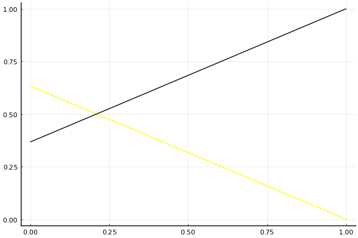

2020 시즌 2 개인전 결승전 1회전 tiebreaker

## 경기 결과

| 트랙 | 박인수 | 송용준 |
|:---|---:|---:|
| [대저택 은밀한 지하실](../jeotaek) | 0 | 1 |
| __total__ |__0__ |__1__ |

## 시뮬레이션

### Win 확률

x축: 트랙, y축: 확률
1번: 옐로우, 2번: 블랙, 3번: 레드, 4번: 화이트(회색), 5번: 퍼플, 6번: 그린, 7번: 블루, 8번: 오렌지

| 트랙 | 박인수 | 송용준 |
|:---|---:|---:|
| 초기 | 0.633 | 0.367 |
| 대저택 은밀한 지하실 | 0.000 | 1.000 |

## 랭킹 변동

### [전체 랭킹](../singles-full)

| 순위 | 변동 | 이름 | 점수 | 변동 | mu | 변동 | sigma | 변동 |
|---:|---:|:---:|---:|---:|---:|---:|---:|---:|
| 3 / 93 | +0 | [박인수](../bakinsu) | 3338 | -10 | 3569 | -9 | 77 | +0 |
| 10 / 93 | +0 | [송용준](../songyongjun) | 3095 | +8 | 3326 | +9 | 77 | +0 |

### 시즌 랭킹

| 순위 | 변동 | 이름 | 점수 | 변동 | mu | 변동 | sigma | 변동 |
|---:|---:|:---:|---:|---:|---:|---:|---:|---:|
| 2 / 32 | +0 | [박인수](../bakinsu) | 3353 | -14 | 3658 | -15 | 102 | -0 |
| 3 / 32 | +0 | [송용준](../songyongjun) | 3191 | +12 | 3467 | +12 | 92 | +0 |

### 트랙 별 랭킹

#### [대저택 은밀한 지하실](../jeotaek)

| 순위 | 변동 | 이름 | 점수 | 변동 | mu | 변동 | sigma | 변동 |
|:---:|:---:|:---:|---:|---:|---:|---:|---:|---:|
| 2 / 79 | +0 | [박인수](../bakinsu) | 3322 | -34 | 3782 | -41 | 153 | -2 |
| 12 / 79 | +0 | [송용준](../songyongjun) | 2876 | +63 | 3396 | +52 | 173 | -4 |
